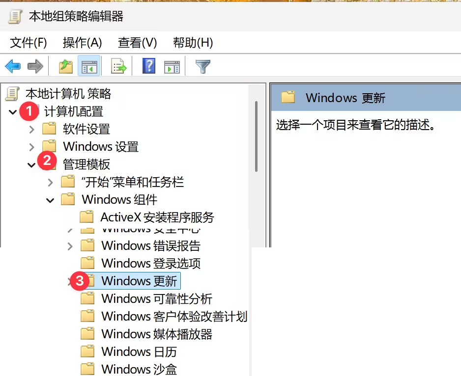
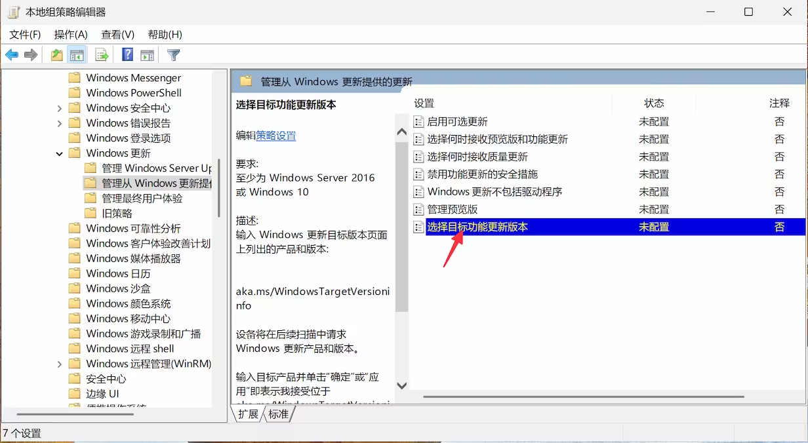
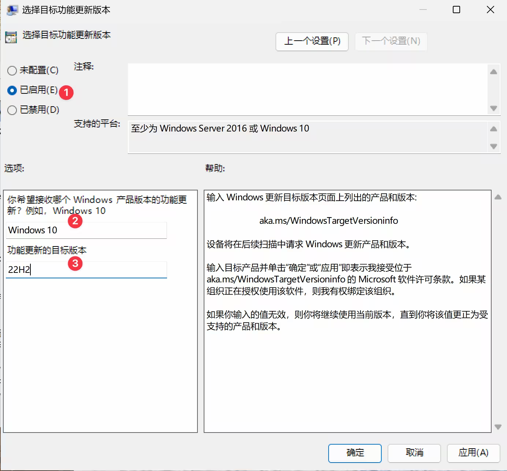
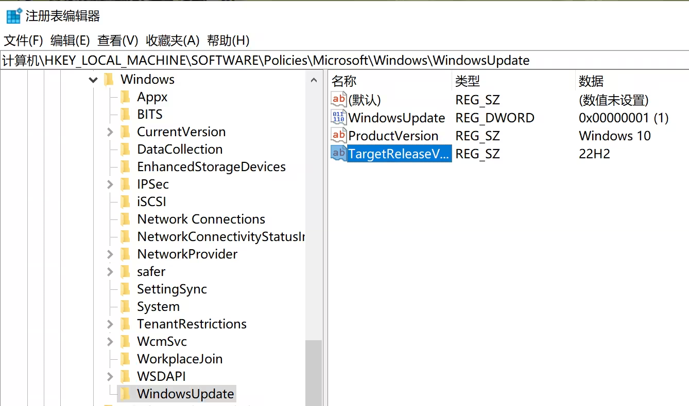
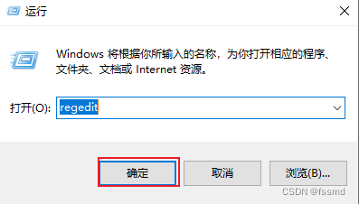
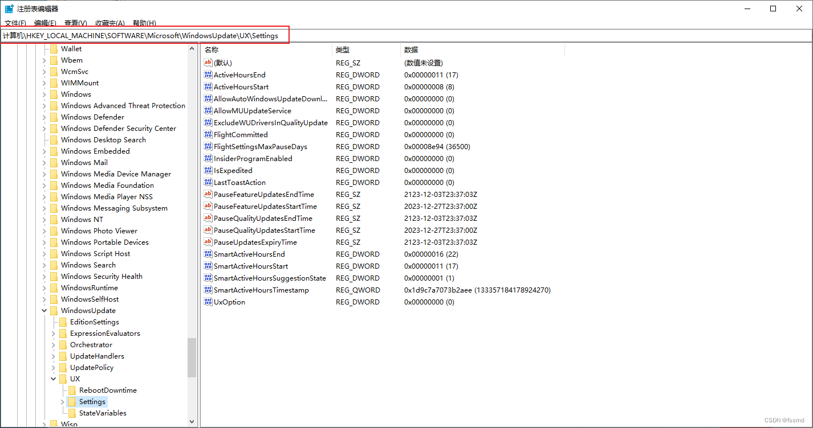
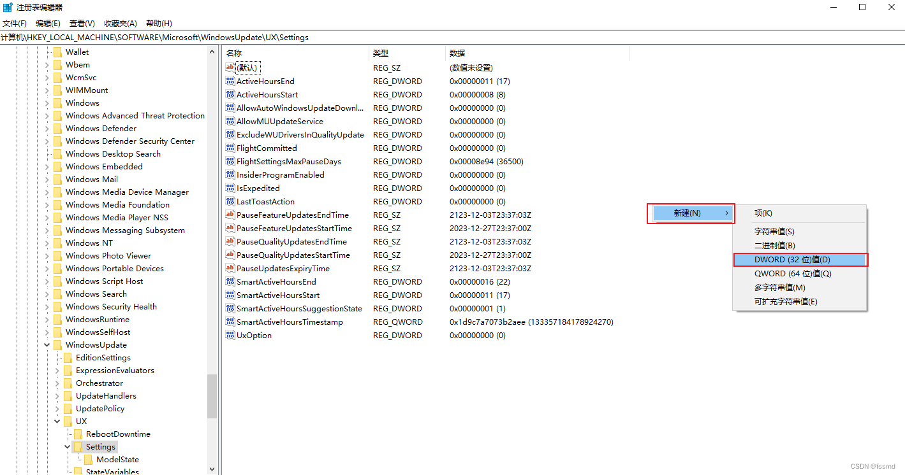
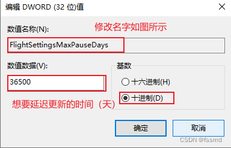
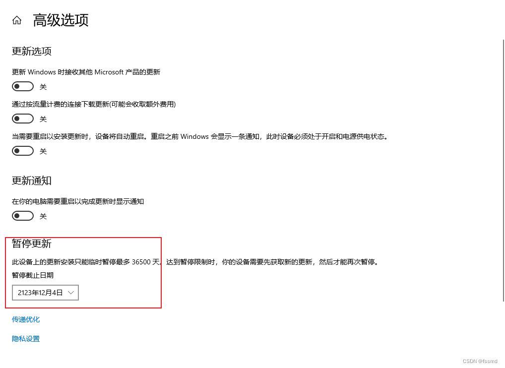

### 取消当前的更新下载

使用命令提示符，运行：

```bash
net stop wuauserv 
net stop bits
del /f /s /q %windir%\SoftwareDistribution\Download\*
```

这样可以取消当前正在下载中的更新。

但还没完，Windows 会再次、自动更新，只能继续取消


### 1. 本地策略组取消更新

适合于非 Windows 家庭版本用户，只需要打开策略组（运行 gpedit.msc），然后进入：

本地计算机策略 > 计算机配置 > 管理模板 > Windows 组件 > Windows 更新



然后在右侧的不同文件夹中找到：选择目标功能更新版本（要注意不同版本的 Windows 可能在不同文件夹中）：



然后双击它，修改：已启用、输入你希望停留的版本，比如最新的 Windows 10，以及 22H2 版本：




## 方法2：针对 Windows 家庭版用户

使用注册表来锁定版本。按 Win + R，输入 regedit 并回车，打开注册表编辑器：

进入：HKEY_LOCAL_MACHINE\SOFTWARE\Policies\Microsoft\Windows\WindowsUpdate

如果没有 WindowsUpdate，就在 Windows 下新建一个 WindowsUpdate 项。

在右侧空白处右键，选择“新建” > “DWORD（32位）值”，命名为 TargetReleaseVersion，并将其值设为 1。

新建一个“字符串值”，命名为 ProductVersion，值设为 Windows 10。

新建一个“字符串值”，命名为 TargetReleaseVersionInfo，值设为你当前 Windows 10 的版本号（如 22H2）：





## 方法3：（2025-02-17亲测有用） 通过设置暂停时间达到永久暂停更新效果

1.win+R打开命令提示行，输入regedit打开注册表编辑器



2.找到路径 

计算机\HKEY_LOCAL_MACHINE\SOFTWARE\Microsoft\WindowsUpdate\UX\Settings



3.右键空白处新建



4.修改该文件名字为，设置需要延迟的天数 



5.打开电脑设置 选择更新与安全 高级选项  暂停更新 下拉菜单选择时间

