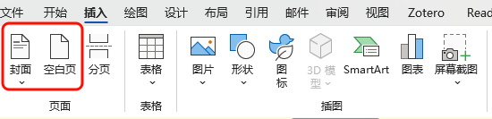
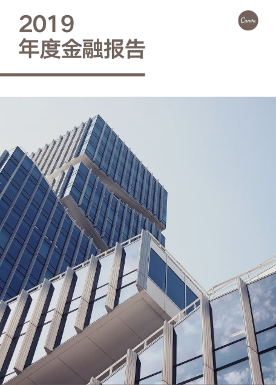
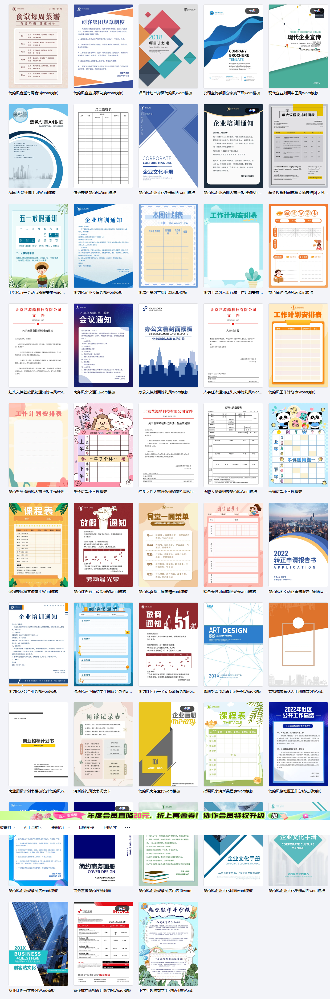

参考：

[cavas的广告--报告书的Word封面](https://www.canva.cn/learn/word-cover-material/)

[word封面背景](https://cloud.tencent.com/developer/article/1679841)

## 基础操作

### 封面模板网站

[爱给网，QQ登录，需要铜币，不完全免费](https://www.aigei.com/ppt/word/cover_template/)

[创客贴--有很多精美的，但是我没登录](https://www.chuangkit.com/polymer/1129.html)

### 如何在一篇word中插入封面

1. **打开Word并创建新文档**：
   - 打开Microsoft Word，点击“文件” > “新建” > “空白文档”。

2. **插入封面模板（最快捷方式）**：
   - 点击顶部菜单的 **“插入”** > **“封面”**（在Word的“页面布局”或“主页”区域）。
   - Word内置了多种封面模板，选择一个符合你需求的模板（例如简约、学术、商务风）。
   - 点击模板后，Word会自动在文档第一页插入封面。

3. **编辑封面内容**：
   - 模板通常包含标题、副标题、作者、日期等占位符。直接点击这些文本框，替换为你需要的内容（如报告标题、姓名、日期等）。
   - 可调整字体、大小、颜色：选中文字，前往 **“主页”** 调整字体样式或颜色。

4. **自定义设计（可选）**：
   - **插入图片**：点击 **“插入”** > **“图片”**，添加logo或背景图。调整图片大小并放置合适位置。
   - **更改颜色或风格**：点击 **“设计”** > **“主题”** 或 **“颜色”**，选择与封面风格匹配的配色方案。
   - **添加形状或线条**：在 **“插入”** > **“形状”** 中添加装饰性元素。

5. **调整布局**：
   - 确保封面内容居中或对齐。选中文字或图片，点击 **“主页”** > **段落”** 中的对齐选项（居中、左对齐等）。
   - 如果需要调整页边距，点击 **“布局”** > **“页边距”**，选择“窄”或自定义。

### 别人那种超级好看的封面是怎么做的

- 实际上主要的就是一张图片，别人用一张设计好的图片填充在页面中作为封面
- 观察word自带的封面可以发现，word的封面使用了大量的文本框和表格，以及形状的使用

## 进阶

### 封面欣赏

