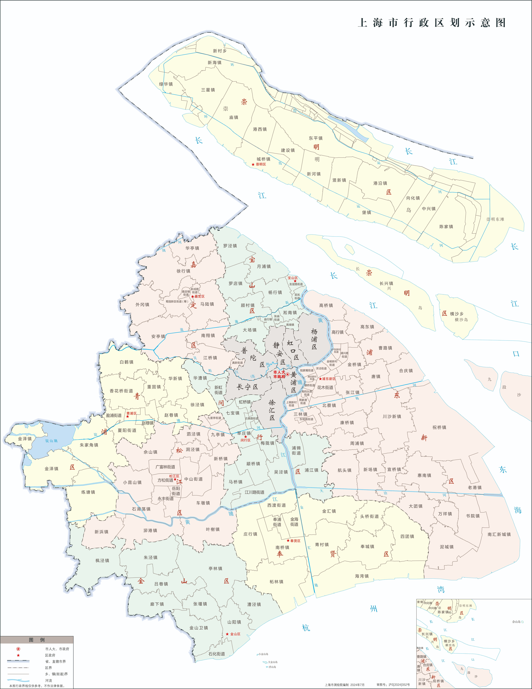
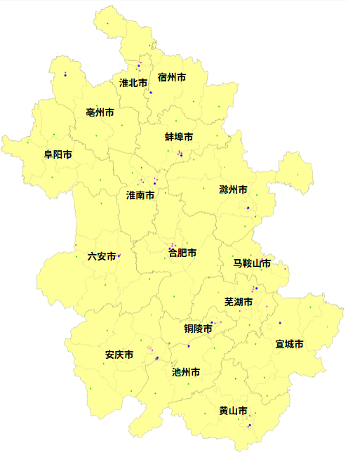
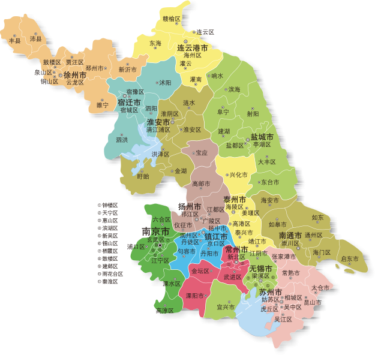
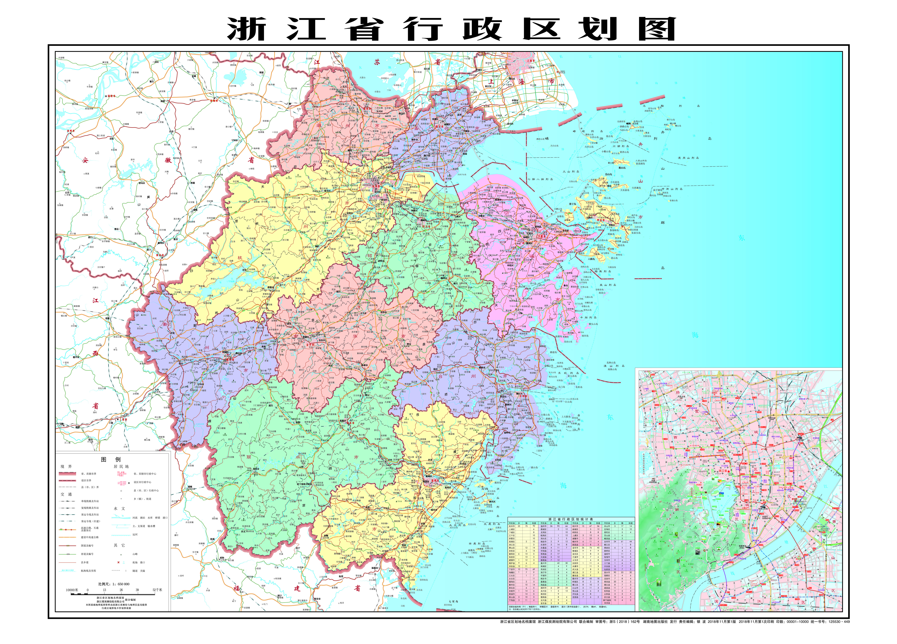

### 上海篇

<!--  -->

上海市，简称“沪”，位于中国东部，长江三角洲东端，东濒东海，南临杭州湾，西接江苏、浙江，北界长江入海口，是中国最大的经济中心和全球重要的金融、贸易、航运中心。上海是中国共产党诞生地、国家历史文化名城，融合中西文化，素有“东方巴黎”之称。全市面积6340.5平方公里，下辖16个区，2023年末常住人口约2418万。上海地势平坦，河网密布，属亚热带季风气候，港口优势显著，上海港连续多年集装箱吞吐量全球第一。2024年地区生产总值预计超4.7万亿元人民币，经济以金融、信息技术、先进制造、现代服务业为主。上海是国际化大都市，拥有外滩、东方明珠等标志性景观，文化活动丰富，旅游资源兼具历史底蕴与现代气息。

-----

#### **1. 黄浦区 (Huángpǔ Qū)**

**概况**: 上海核心城区，面积20.5平方公里，人口约65万。黄浦区是上海的政治、经济、文化中心，外滩、南京路步行街、豫园等标志性景点集中于此，是上海城市名片。
**旅游资源**: 外滩（万国建筑博览群）、南京路步行街、豫园（国家4A级）、上海城隍庙、中共一大会址（国家5A级）、人民广场。
**特色美食**: 小笼包、生煎包、蟹黄汤包、排骨年糕。
**亮点**: 外滩夜景灯光秀、南京路百年商街、中共一大会址红色文化。

-----

#### **2. 徐汇区 (Xúhuì Qū)**

**概况**: 面积54.8平方公里，人口约110万。徐汇区是上海科教文化重镇，拥有上海交通大学、徐家汇商圈，历史风貌区与现代商业并存。
**旅游资源**: 徐家汇天主教堂、龙华寺、衡山路历史风貌区、上海植物园、武康路。
**特色美食**: 老上海面、葱油拌面、辣肉面。
**亮点**: 武康路梧桐树下老洋房、徐家汇商圈。

-----

#### **3. 长宁区 (Chángníng Qū)**

**概况**: 面积38.3平方公里，人口约70万。长宁区是上海国际化程度最高的区域之一，虹桥商务区、涉外社区集中，上海动物园所在地。
**旅游资源**: 上海动物园、中山公园、虹桥古玩城、刘海粟美术馆。
**特色美食**: 红烧肉、草头饼、油爆虾。
**亮点**: 虹桥国际机场、国际化生活氛围。

-----

#### **4. 静安区 (Jìng’ān Qū)**

**概况**: 面积37.4平方公里，人口约100万。静安区是上海商业与文化交融之地，静安寺为千年古刹，高端商业与历史建筑并存。
**旅游资源**: 静安寺、南京西路商圈、乌鲁木齐路历史街区、上海展览中心。
**特色美食**: 鲜肉月饼、糟田螺、鸡鸭血汤。
**亮点**: 静安寺佛教文化、南京西路奢侈品购物。

-----

#### **5. 普陀区 (Pǔtuó Qū)**

**概况**: 面积55.5平方公里，人口约125万。普陀区是上海西北部重要城区，拥有长风公园、M50创意园区，工业历史与现代艺术结合。
**旅游资源**: 玉佛寺、长风公园、M50艺术园区、苏州河沿岸。
**特色美食**: 糖醋排骨、红烧蹄膀、蟹粉豆腐。
**亮点**: M50当代艺术、苏州河滨水步道。

-----

#### **6. 虹口区 (Hóngkǒu Qū)**

**概况**: 面积23.5平方公里，人口约75万。虹口区是上海近代史重要区域，曾是租界地，鲁迅、左联等文化名人聚居地。
**旅游资源**: 多伦路文化名人街、1933老场坊、虹口足球场、北外滩。
**特色美食**: 熏鱼、八宝鸭、油墩子。
**亮点**: 北外滩滨江景观、左联红色文化。

-----

#### **7. 杨浦区 (Yángpǔ Qū)**

**概况**: 面积60.7平方公里，人口约130万。杨浦区是上海高校集聚地，拥有复旦大学、同济大学，滨江转型为创新与休闲新区。
**旅游资源**: 杨浦滨江、共青森林公园、东方渔人码头、复旦大学。
**特色美食**: 锅贴、酱鸭、甜酒酿。
**亮点**: 杨浦滨江工业遗迹、大学校园文化。

-----

#### **8. 闵行区 (Mǐnháng Qū)**

**概况**: 面积371平方公里，人口约255万。闵行区是上海西南门户，虹桥枢纽所在地，工业与现代服务业并重，七宝古镇展现水乡风情。
**旅游资源**: 七宝古镇、锦江乐园、召稼楼古镇、闵行文化公园。
**特色美食**: 七宝方糕、羊肉汤、汤团。
**亮点**: 七宝古镇夜市、虹桥交通枢纽。

-----

#### **9. 宝山区 (Bǎoshān Qū)**

**概况**: 面积424.6平方公里，人口约205万。宝山区是上海北部工业重镇，吴淞口为长江入海处，邮轮旅游发达。
**旅游资源**: 吴淞炮台湿地公园、上海国际邮轮港、顾村公园、宝山寺。
**特色美食**: 宝山大黄鱼、葱油饼、蟹粉面。
**亮点**: 顾村公园樱花节、邮轮母港。

-----

#### **10. 嘉定区 (Jiādìng Qū)**

**概况**: 面积464.2平方公里，人口约160万。嘉定区是上海西北科创与文化区，拥有F1上海赛车场、孔庙等历史遗迹。
**旅游资源**: 嘉定孔庙、汇龙潭公园、南翔古镇、F1上海国际赛车场。
**特色美食**: 南翔小笼包、白斩鸡、糯米团。
**亮点**: 南翔古镇、南翔小笼包。

-----

#### **11. 浦东新区 (Pǔdōng Xīnqū)**

**概况**: 面积1210.4平方公里，人口约560万。浦东新区是上海改革开放窗口，陆家嘴为全球金融中心，拥有东方明珠等地标。
**旅游资源**: 东方明珠（国家5A级）、上海迪士尼乐园（国家5A级）、陆家嘴金融区、上海野生动物园、金茂大厦。
**特色美食**: 红烧鮰鱼、腌笃鲜、汤包。
**亮点**: 陆家嘴天际线、上海迪士尼。

-----

#### **12. 金山区 (Jīnshān Qū)**

**概况**: 面积613平方公里，人口约80万。金山区是上海西南沿海区，拥有金山城市沙滩，石化工业发达。
**旅游资源**: 金山城市沙滩、枫泾古镇、东林寺、金山嘴渔村。
**特色美食**: 枫泾丁蹄、金山蟠桃、农家菜。
**亮点**: 枫泾古镇水乡风情、海滨沙滩。

-----

#### **13. 松江区 (Sōngjiāng Qū)**

**概况**: 面积605.6平方公里，人口约190万。松江区是上海西南文化与科创区，历史悠久，有“上海之根”之称。
**旅游资源**: 佘山国家森林公园、泰晤士小镇、醉白池、广富林文化遗址。
**特色美食**: 松江鲈鱼、阿婆茶、米道糕。
**亮点**: 佘山天文台、广富林遗址。

-----

#### **14. 青浦区 (Qīngpǔ Qū)**

**概况**: 面积670.1平方公里，人口约120万。青浦区是上海西部水乡，朱家角古镇为江南水乡代表，国家会展中心所在地。
**旅游资源**: 朱家角古镇（国家4A级）、淀山湖、东方绿舟、大观园。
**特色美食**: 扎肉、青团、粽子。
**亮点**: 朱家角水乡夜游、国家会展中心。

-----

#### **15. 奉贤区 (Fèngxián Qū)**

**概况**: 面积687.4平方公里，人口约115万。奉贤区是上海南部沿海区，以农业与海滨旅游为主，花海景观闻名。
**旅游资源**: 碧海金沙、奉贤海湾旅游区、上海花米庄行景区、庄行古镇。
**特色美食**: 奉贤黄桃、滚灯汤圆、海棠糕。
**亮点**: 花米庄行花海、海湾旅游区。

-----

#### **16. 崇明区 (Chóngmíng Qū)**

**概况**: 面积1185.5平方公里，人口约70万。崇明区由崇明岛及长兴岛、横沙岛组成，是上海生态岛，湿地资源丰富。
**旅游资源**: 东平国家森林公园、崇明湿地、前卫生态村、长兴岛郊野公园。
**特色美食**: 崇明糕、老白酒、清水蟹。
**亮点**: 崇明生态旅游、湿地观鸟。

-----

#### **综合特色与总结**

**历史文化**: 上海是中国近代史缩影，租界文化与红色文化交织，中共一大会址、外滩见证历史变迁。海派文化独树一帜，石库门建筑、沪剧、滑稽戏等深入人心。
**自然景观**: 虽以都市风貌著称，上海仍拥有崇明岛湿地、淀山湖、佘山等生态景观，苏州河、黄浦江滨江步道提供城市绿肺。
**经济发展**: 上海是中国经济龙头，浦东新区是改革开放标杆，金融业以陆家嘴为中心，航运业依托上海港，科创产业在张江高科技园区蓬勃发展。
**美食文化**: 沪菜（本帮菜）讲究浓油赤酱，注重原汁原味，代表菜如红烧肉、腌笃鲜、小笼包。融合菜系丰富，涵盖全球美食。
**旅游体验**: 上海兼具国际化与传统韵味，游客可漫步外滩赏夜景，在迪士尼乐园尽享欢乐，探访朱家角感受水乡，体验南京路购物，或在武康路品味老上海风情，满足多元需求。

### 安徽篇

参考
|-----|
|[维基百科](https://zh.wikipedia.org/wiki/%E5%AE%89%E5%BE%BD%E7%9C%81)|
||

安徽地处华东内陆，北邻河南、山东，西接湖北，南连江西、浙江，东与江苏、上海毗邻。安徽是中华文明的重要发源地之一，拥有4000多年历史，孕育了徽文化、淮河文化等，涌现出老庄哲学、建安文学等文化瑰宝。自然景观以黄山、九华山、长江、淮河等为主，名山胜水与古村落交相辉映。经济上，安徽是制造业大省，家电、汽车、光伏产业全国领先，同时农业发达，被誉为“中国粮仓”。

安徽省，简称“皖”，位于中国东部，地处长江、淮河中下游，是长三角地区的重要组成部分，也是中国历史文化名省之一。安徽以其深厚的历史文化、秀美的自然风光和快速发展的经济而闻名，素有“江淮大地”“徽州故里”之称。全省面积约14万平方公里，人口约6100万（截至2023年），下辖16个地级市，105个县（市、区）。2024年安徽省GDP预计超4.7万亿元人民币，以制造业、农业、旅游业为经济支柱。以下是对安徽省16个地级市及其下辖县（市、区）的详细介绍，涵盖历史、文化、地理、经济、旅游资源、特色产业和美食等方面，突出各地特色。

- **历史文化**: 徽文化（徽派建筑、徽商、徽菜）、淮河文化、老庄哲学、建安文学。

- **自然景观**: 黄山（世界文化与自然遗产）、九华山、巢湖、长江、淮河。

- **经济亮点**: 家电、汽车、光伏产业全国领先，合肥科创中心地位突出。

- **美食**: 徽菜（臭鳜鱼、毛豆腐）、庐州烤鸭、黄山烧饼、淮南牛肉汤。

安徽省下辖16个地级市，每市均有独特的历史文化和自然景观，详见以下介绍。

#### **1. 合肥市 (Héféi Shì)**  

**概况**: 安徽省省会，地处江淮之间，是全国重要的科教基地和综合交通枢纽，被誉为“科创之都”。合肥历史悠久，素有“三国故地、包拯家乡”之称，拥有中国科学技术大学、合肥工业大学等高校，以及科大讯飞、京东方等高科技企业。2024年GDP预计超1.4万亿元，居全省第一。  

**旅游资源**: 包公园（包公祠、清风阁）、三河古镇、巢湖（中国第五大淡水湖）、徽园、合肥野生动物园。  

**特色美食**: 庐州烤鸭、包公鱼、李鸿章大杂烩、三河米饺、肥西老母鸡汤。  

**下辖行政区**: 4个区、4个县、1个县级市  

- **蜀山区**: 市中心，面积143平方公里，人口约100万。科教核心，中国科大、安徽省图书馆所在地，蜀山森林公园是城市绿肺。  

- **包河区**: 面积182平方公里，人口约90万。包公园、滨湖湿地公园、渡江战役纪念馆，滨湖新区是合肥现代化地标。  

- **瑶海区**: 面积142平方公里，人口约80万。合肥老工业区，瑶海公园、少荃湖生态区，商贸物流发达。  

- **庐阳区**: 面积139平方公里，人口约70万。市中心，逍遥津公园、明教寺是历史地标，淮河路步行街是美食购物中心。  

- **长丰县**: 面积2357平方公里，人口约80万。农业大县，草莓、板栗产业发达，北城新区是合肥新兴区域。  

- **肥东县**: 面积2213平方公里，人口约90万。浮槎山、岱山湖是生态旅游地，肥东烧饼是特色美食。  

- **肥西县**: 面积2087平方公里，人口约80万。三河古镇（国家5A级）是徽文化名片，紫蓬山风景区生态优美。  

- **庐江县**: 面积2348平方公里，人口约100万。汤池温泉全国闻名，冶父山风景区是道教圣地。  

- **巢湖市**: 面积2063平方公里，人口约80万。巢湖沿岸，半汤温泉、姥山岛是旅游亮点，巢湖银鱼是特产。

---

#### **2. 芜湖市 (Wúhú Shì)**  

**概况**: 位于长江下游南岸，素有“江东名邑”之称，是安徽重要的工业和港口城市。芜湖是中国汽车工业重镇，奇瑞汽车总部所在地，2024年GDP预计超5000亿元。  

**旅游资源**: 镜湖公园、赭山风景区、方特欢乐世界（国家5A级）、马仁奇峰、鸠兹古镇。  

**特色美食**: 芜湖小笼汤包、虾籽面、耿福兴酥烧饼、弋江羊肉。  

**下辖行政区**: 4个区、3个县  

- **镜湖区**: 市中心，面积124平方公里，人口约60万。镜湖公园、步行街是城市地标，商贸发达。  

- **弋江区**: 面积178平方公里，人口约50万。高新技术产业区，芜湖奥体中心所在地。  

- **鸠江区**: 面积329平方公里，人口约70万。方特欢乐世界、雕塑公园，临江新区发展迅速。  

- **三山区**: 面积165平方公里，人口约20万。沿江生态区，龙窝湖湿地是自然亮点。  

- **芜湖县**: 面积721平方公里，人口约40万。陶辛水韵（荷花景观）、湾沚花桥是旅游点。  

- **繁昌县**: 面积590平方公里，人口约30万。马仁奇峰风景区（国家4A级），陶瓷产业历史悠久。  

- **南陵县**: 面积1264平方公里，人口约50万。丫山风景区以丹霞地貌闻名，南陵大米是特产。

---

#### **3. 蚌埠市 (Bèngbù Shì)**  

**概况**: 位于淮河中游，素有“珠城”之称，是安徽重要的铁路枢纽和工业城市。蚌埠历史上是淮河漕运中心，近代工业发达，玻璃、食品加工产业领先。  

**旅游资源**: 淮河文化广场、张公山公园、龙子湖风景区、涂山风景区。  

**特色美食**: 蚌埠花生酥、烧饼夹里脊、雪园汤圆、湖沟烧饼。  

**下辖行政区**: 4个区、3个县  

- **龙子湖区**: 面积193平方公里，人口约30万。龙子湖风景区是城市名片，生态旅游发达。  

- **蚌山区**: 市中心，面积80平方公里，人口约40万。淮河文化广场、蚌埠老街是地标。  

- **禹会区**: 面积123平方公里，人口约30万。涂山、禹王宫是历史文化遗存。  

- **淮上区**: 面积236平方公里，人口约20万。工业新区，物流业发达。  

- **怀远县**: 面积2392平方公里，人口约100万。农业大县，怀远石榴是地理标志产品。  

- **五河县**: 面积1458平方公里，人口约60万。沱湖螃蟹、浍河湿地是生态亮点。  

- **固镇县**: 面积1363平方公里，人口约50万。垓下遗址（楚汉决战地），优质小麦产区。

---

#### **4. 淮南市 (Huáinán Shì)**  

**概况**: 位于淮河中游，素有“能源之都”之称，是中国重要的煤炭基地。淮南是楚汉文化的重要发源地，寿县古城是国家历史文化名城。经济以能源、化工为主。  

**旅游资源**: 八公山（国家4A级）、寿县古城、焦岗湖湿地、舜耕山。  

**特色美食**: 淮南牛肉汤、豆腐宴、八公山豆腐、洛河臭干子。  

**下辖行政区**: 5个区、2个县  

- **田家庵区**: 市中心，面积257平方公里，人口约60万。淮南老街、龙湖公园是地标。  

- **大通区**: 面积350平方公里，人口约30万。大通万人坑遗址是爱国主义教育基地。  

- **谢家集区**: 面积275平方公里，人口约30万。工业区，春申君陵园是历史遗迹。  

- **八公山区**: 面积105平方公里，人口约20万。八公山风景区以“淝水之战”闻名。  

- **潘集区**: 面积590平方公里，人口约30万。焦岗湖湿地生态旅游发达。  

- **凤台县**: 面积1100平方公里，人口约50万。茅仙洞、淮南王墓，农业和煤炭并重。  

- **寿县**: 面积2986平方公里，人口约90万。国家历史文化名城，寿春古城、报恩寺、安丰塘是文化瑰宝。

---

#### **5. 马鞍山市 (Mǎ’ānshān Shì)**  

**概况**: 位于长江下游，素有“钢城”之称，是中国重要的钢铁工业基地。马鞍山因采石矶（李白诗词地）而富有诗意，经济以钢铁、汽车零部件为主。  

**旅游资源**: 采石矶（国家5A级）、太白楼、雨山湖、褒禅山。  

**特色美食**: 采石矶茶干、长江三鲜、石臼湖螃蟹、马鞍山卤菜。  

**下辖行政区**: 3个区、3个县  

- **雨山区**: 市中心，面积173平方公里，人口约40万。雨山湖公园、佳山风景区。  

- **花山区**: 面积178平方公里，人口约50万。采石矶、太白楼是文化地标。  

- **博望区**: 面积351平方公里，人口约20万。刀具制造全国领先，横山风景区生态优美。  

- **当涂县**: 面积1002平方公里，人口约60万。太白祠、李白墓，大青山桃花是亮点。  

- **含山县**: 面积1047平方公里，人口约40万。褒禅山、运漕古镇，含山绿茶是特产。  

- **和县**: 面积1319平方公里，人口约50万。霸王祠、鸡笼山，香泉温泉是旅游名片。

---

#### **6. 淮北市 (Huáiběi Shì)**  

**概况**: 位于安徽北部，淮河流域，素有“煤城”之称，是中国重要的煤炭基地。淮北是相山文化的发源地，经济以能源、化工、农业为主。  

**旅游资源**: 相山风景区、龙脊山、临涣古城、濉溪老街。  

**特色美食**: 濉溪酱包瓜、临涣烧饼、淮北酥糖、口子窖酒。  

**下辖行政区**: 3个区、1个县  

- **相山区**: 市中心，面积147平方公里，人口约50万。相山风景区、淮北博物馆。  

- **杜集区**: 面积279平方公里，人口约30万。龙脊山、东湖湿地是生态亮点。  

- **烈山区**: 面积197平方公里，人口约20万。烈山森林公园，煤炭文化浓厚。  

- **濉溪县**: 面积1987平方公里，人口约100万。临涣古城、濉溪老街，酱包瓜是地理标志产品。

---

#### **7. 铜陵市 (Tónglíng Shì)**  

**概况**: 位于长江中下游，素有“中国铜都”之称，是中国重要的铜矿开采和冶炼基地。铜陵历史文化悠久，经济以有色金属、化工为主。  

**旅游资源**: 天井湖风景区、铜陵博物馆、浮山风景区、大通古镇。  

**特色美食**: 铜陵大蒜、顺安酥糖、铜陵姜饼、野雀舌茶。  

**下辖行政区**: 3个区、1个县  

- **铜官区**: 市中心，面积83平方公里，人口约30万。天井湖公园、铜文化博物馆。  

- **义安区**: 面积837平方公里，人口约30万。永泉旅游度假区，农业和工业并重。  

- **郊区**: 面积614平方公里，人口约20万。大通古镇是长江文化代表。  

- **枞阳县**: 面积1808平方公里，人口约60万。浮山风景区、桐城派文化遗址。

---

#### **8. 安庆市 (Ānqìng Shì)**  

**概况**: 位于长江中下游，素有“万里长江此封喉”之称，是国家历史文化名城，桐城派（清代文学流派）发源地。安庆是黄梅戏的故乡，经济以石化、纺织、农业为主。  

**旅游资源**: 迎江寺、振风塔、天柱山（国家5A级）、菱湖风景区、司空山。  

**特色美食**: 黄梅戏小吃、墨子酥、胡玉美蚕豆酱、岳西翠兰茶。  

**下辖行政区**: 3个区、5个县、2个县级市  

- **迎江区**: 市中心，面积207平方公里，人口约30万。迎江寺、振风塔是长江地标。  

- **大观区**: 面积203平方公里，人口约30万。菱湖风景区、赵朴初故居。  

- **宜秀区**: 面积421平方公里，人口约30万。巨石山风景区，生态旅游发达。  

- **怀宁县**: 面积1276平方公里，人口约60万。孔雀东南飞文化园，蓝莓产业全国领先。  

- **太湖县**: 面积2031平方公里，人口约50万。五千年文博园、花亭湖风景区。  

- **宿松县**: 面积2394平方公里，人口约70万。白崖寨、龙湖湿地，松兹文化独特。  

- **望江县**: 面积1347平方公里，人口约50万。雷池文化、武昌湖螃蟹。  

- **岳西县**: 面积2398平方公里，人口约40万。天峡风景区、岳西翠兰茶是特产。  

- **桐城市**: 面积1571平方公里，人口约70万。桐城派发源地，六尺巷、嬉子湖。  

- **潜山市**: 面积1688平方公里，人口约50万。天柱山（国家5A级）、薛家岗文化遗址。

---

#### **9. 黄山市 (Huángshān Shì)**  

[徽州为什么要改名黄山这么土气的名字？ - 知乎用户ZHn99l的回答 - 知乎](https://www.zhihu.com/question/24854943/answer/95308321)

**概况**:  位于安徽省最南端，素有“人间仙境”之称，是世界著名的旅游城市，以其境内的黄山风景区而闻名于世。黄山是世界文化与自然双重遗产，被誉为“天下第一奇山”。徽文化的发祥地也在黄山市，徽派建筑、徽菜、徽商、新安理学等都具有深远影响。主要景点有黄山风景区、宏村、西递、屯溪老街、牌坊群鲍家花园等。黄山是国际旅游名城，经济以旅游、茶叶为主。  

**旅游资源**: 黄山风景区（国家5A级）、西递宏村（世界文化遗产）、屯溪老街、翡翠谷。  

**特色美食**: 臭鳜鱼、黄山烧饼、徽州毛豆腐、祁门红茶。  

**下辖行政区**: 3个区、4个县  

- **屯溪区**: 市中心，面积191平方公里，人口约30万。屯溪老街、徽州博物馆，徽文化浓厚。  

- **黄山区**: 面积1775平方公里，人口约20万。黄山风景区、太平湖风景区。  

- **徽州区**: 面积424平方公里，人口约20万。唐模古村、呈坎古村，徽派建筑代表。  

- **歙县**: 面积2122平方公里，人口约40万。徽州古城、棠樾牌坊群，歙砚是国家级非遗。  

- **休宁县**: 面积2126平方公里，人口约20万。齐云山（道教名山）、状元博物馆。  

- **黟县**: 面积857平方公里，人口约10万。西递、宏村（世界文化遗产），乡村旅游典范。  

- **祁门县**: 面积2257平方公里，人口约20万。祁门红茶（世界三大高香茶之一），牯牛降风景区。

---

#### **10. 滁州市 (Chúzhōu Shì)**  

**概况**: 位于安徽省东部，江淮之间，素有“金陵锁钥”之称，毗邻江苏南京，是南京都市圈核心层城市和合肥都市圈成员城市。滁州历史悠久，人文荟萃，北宋文学家欧阳修的《醉翁亭记》使琅琊山名扬天下。自然风光秀美，农业发达。主要景点有琅琊山风景区、醉翁亭、明皇陵、皇甫山国家森林公园等。滁州是长三角的重要节点城市，经济以家电、食品加工为主。  

**旅游资源**: 琅琊山（国家5A级）、醉翁亭、狼巷迷谷、皇甫山。  

**特色美食**: 滁州贡菊、来安花红、凤阳酿豆腐、明光绿豆饼、秦栏卤鹅。  

**下辖行政区**: 2个区、4个县、2个县级市  

- **琅琊区**: 市中心，面积181平方公里，人口约30万。琅琊山、醉翁亭是文化地标。  

- **南谯区**: 面积1174平方公里，人口约30万。皇甫山森林公园，生态旅游发达。  

- **来安县**: 面积1481平方公里，人口约50万。白鹭岛、来安花红是生态和农业亮点。  

- **全椒县**: 面积1572平方公里，人口约40万。吴敬梓纪念馆（《儒林外史》作者），神山风景区。  

- **定远县**: 面积2998平方公里，人口约60万。范岗芍药、江巷水库，农业大县。  

- **凤阳县**: 面积1949平方公里，人口约60万。明皇陵、狼巷迷谷，凤阳花鼓是非遗。  

- **天长市**: 面积1770平方公里，人口约60万。红草湖湿地、龙岗古镇，电子信息产业发达。  

- **明光市**: 面积2335平方公里，人口约50万。女山湖、老母鸡汤是特色。

---

#### **11. 阜阳市 (Fùyáng Shì)**  

**概况**: 位于安徽西北部，淮河平原，是安徽人口第一大市（约1000万）。阜阳是农业大市，经济以食品加工、商贸物流为主。  

**旅游资源**: 颍州西湖、八里河风景区（国家5A级）、阜阳生态乐园、太和香椿。  

**特色美食**: 阜阳格拉条、太和板面、临泉贡鹅、颍上管氏臭干子。  

**下辖行政区**: 3个区、4个县、1个县级市  

- **颍州区**: 市中心，面积614平方公里，人口约70万。颍州西湖、文峰塔是地标。  

- **颍东区**: 面积699平方公里，人口约40万。阜阳生态乐园，农业和物流并重。  

- **颍泉区**: 面积509平方公里，人口约50万。阜阳博物馆、泉河湿地。  

- **临泉县**: 面积1839平方公里，人口约200万。中国人口第一大县，姜尚文化园，魔芋产业发达。  

- **太和县**: 面积1822平方公里，人口约140万。太和香椿、板面是特产，沙颍河风景区。  

- **阜南县**: 面积1801平方公里，人口约130万。王家坝（淮河防洪重地），柳编工艺是非遗。  

- **颍上县**: 面积1987平方公里，人口约120万。八里河风景区、迪沟生态旅游区。  

- **界首市**: 面积667平方公里，人口约80万。彩陶文化、界首渔鼓，农业和轻工业并重。

---

#### **12. 宿州市 (Sùzhōu Shì)**  

**概况**: 位于安徽北部，淮河平原，素有“舟车汇聚、九州通衢”之称。宿州是农业和商贸重镇，经济以食品加工、煤炭为主。  

**旅游资源**: 皇藏峪国家森林公园、砀山梨园、宿州博物馆、灵璧奇石。  

**特色美食**: 砀山酥梨、符离集烧鸡、萧县葡萄、灵璧羊肉汤。  

**下辖行政区**: 1个区、4个县  

- **埇桥区**: 市中心，面积2868平方公里，人口约180万。宿州博物馆、汴河风景区。  

- **砀山县**: 面积2773平方公里，人口约100万。“中国梨都”，砀山酥梨是地理标志产品。  

- **萧县**: 面积1885平方公里，人口约120万。皇藏峪、蔡洼红色旅游区，葡萄种植全国领先。  

- **灵璧县**: 面积2054平方公里，人口约100万。灵璧奇石、虞姬墓，钟馗文化独特。  

- **泗县**: 面积1785平方公里，人口约90万。泗州戏、石龙湖湿地，农业大县。

---

#### **13. 六安市 (Lù’ān Shì)**  

**概况**: 位于安徽西部，大别山北麓，素有“皖西明珠”之称，是红色革命老区。六安是农业和生态旅游大市，六安瓜片茶全国闻名。  

**旅游资源**: 天堂寨（国家5A级）、万佛湖（国家5A级）、大别山主峰、横排头风景区。  

**特色美食**: 六安瓜片、霍山黄芽、皖西白鹅、金寨吊锅。  

**下辖行政区**: 3个区、4个县  

- **金安区**: 市中心，面积1657平方公里，人口约80万。九仙尊石窟、六安茶谷。  

- **裕安区**: 面积1926平方公里，人口约90万。独山革命旧址、响洪甸水库。  

- **叶集区**: 面积320平方公里，人口约20万。大别山红色旅游区，农业新区。  

- **霍邱县**: 面积3239平方公里，人口约140万。临淮岗（淮河第一闸），优质稻米产区。  

- **舒城县**: 面积2092平方公里，人口约90万。万佛湖、万佛山，羽绒产业发达。  

- **金寨县**: 面积3814平方公里，人口约60万。天堂寨、大别山主峰，红色旅游和生态旅游并重。  

- **霍山县**: 面积2043平方公里，人口约30万。霍山黄芽、大化坪古村，竹产业全国领先。

---

#### **14. 亳州市 (Bozhou Shì)**  

**概况**: 位于安徽西北部，素有“中华药都”之称，是中药材集散地和华佗故里。亳州是道教文化和三国文化的重要区域，经济以中药、白酒、农业为主。  

**旅游资源**: 花戏楼、曹操运兵道、华佗纪念馆、古井贡酒博物馆。  

**特色美食**: 亳州牛肉板面、涡阳干扣面、古井贡酒、蒙城烧饼。  

**下辖行政区**: 1个区、3个县  

- **谯城区**: 市中心，面积2226平方公里，人口约140万。花戏楼、魏武祠，药材市场全国最大。  

- **涡阳县**: 面积2107平方公里，人口约130万。老子故里、义门古镇，道教文化浓厚。  

- **蒙城县**: 面积2091平方公里，人口约120万。庄子故里、万佛塔，蒙城烧饼是特产。  

- **利辛县**: 面积2005平方公里，人口约120万。西淝河湿地，农业大县。

---

#### **15. 池州市 (Chízhōu Shì)**  

**概况**: 位于安徽南部，长江南岸，素有“千载诗人地”之称，是生态旅游城市。九华山是中国四大佛教名山之一，经济以旅游、生态农业为主。  

**旅游资源**: 九华山（国家5A级）、牯牛降、杏花村、齐山风景区。  

**特色美食**: 九华素斋、石台富硒茶、池州野鸭、东至云尖茶。  

**下辖行政区**: 1个区、3个县  

- **贵池区**: 市中心，面积2432平方公里，人口约60万。杏花村、秋浦河风景区，池州傩戏是国家级非遗。  

- **东至县**: 面积3256平方公里，人口约50万。历山风景区、东至云尖茶。  

- **石台县**: 面积1403平方公里，人口约10万。牯牛降、仙寓山，富硒生态农业领先。  

- **青阳县**: 面积1181平方公里，人口约20万。九华山核心区，九华素饼是特产。

---

#### **16. 宣城市 (Xuānchéng Shì)**  

**概况**: 位于安徽东南部，皖南山区，是徽文化的延伸地带，素有“中国文房四宝之乡”之称（宣纸、徽墨）。经济以文房四宝、旅游、农业为主。  

**旅游资源**: 敬亭山、桃花潭、龙川风景区（国家5A级）、绩溪徽菜博物馆。  

**特色美食**: 宣城水东蜜枣、绩溪臭鳜鱼、宁国山核桃、广德毛豆腐。  

**下辖行政区**: 1个区、5个县、1个县级市  

- **宣州区**: 市中心，面积2533平方公里，人口约80万。敬亭山、鳌峰公园，宣纸文化园是地标。  

- **郎溪县**: 面积1105平方公里，人口约30万。梅渚古镇、石佛山，茶产业发达。  

- **泾县**: 面积2059平方公里，人口约30万。桃花潭、查济古村，宣纸和云岭毛峰茶是特产。  

- **绩溪县**: 面积1126平方公里，人口约20万。龙川风景区、徽菜博物馆，胡氏宗祠是徽文化代表。  

- **旌德县**: 面积904平方公里，人口约10万。江村古镇、灵芝山，生态旅游突出。  

- **宁国市**: 面积2447平方公里，人口约40万。青龙湾、宁国山核桃，板栗产业全国领先。  

- **广德市**: 面积2164平方公里，人口约50万。太极洞（国家4A级）、卢湖竹海，竹产业发达。

---

#### **综合特色与总结**

**历史文化**: 安徽是中华文明的发祥地之一，徽文化（徽派建筑、徽商、徽菜）、桐城派、黄梅戏、老子文化等熠熠生辉。西递宏村、黄山、九华山是世界级文化遗产。  

**自然景观**: 黄山、九华山、天柱山、巢湖、牯牛降等名山胜水，构成了安徽“山水人文”的独特魅力。  

**经济发展**: 安徽是制造业大省，家电、汽车、光伏产业全国领先，合肥的科创实力跻身全国前列，芜湖、滁州等地融入长三角经济圈。  

**美食文化**: 徽菜以臭鳜鱼、毛豆腐为代表，淮南牛肉汤、阜阳格拉条、黄山烧饼等地方美食令人垂涎。  

**旅游体验**: 从黄山的云海奇观到九华山的佛教文化，从西递宏村的徽派古村到三河古镇的水乡风情，安徽兼具自然奇观、历史探秘和现代科创体验，是多元旅游的理想目的地。

### 江苏篇

江苏省，简称“苏”，位于中国东部沿海，地处长江、淮河下游，北接山东，西邻安徽，东濒黄海，南与浙江、上海接壤，是中国经济最发达、文化底蕴最深厚的省份之一。全省面积10.72万平方公里，人口约8500万（截至2023年），下辖13个地级市，96个县（市、区）。江苏素有“鱼米之乡”“江南水乡”之称，拥有2500多年的建城史，是吴文化、楚汉文化、淮扬文化的发源地。全省经济总量稳居全国前列，2024年地区生产总值预计超13万亿元人民币，制造业、科教、外贸等领域领先全国。江苏的自然景观以水乡、湖泊、沿海湿地为主，历史文化名城、古镇、园林星罗棋布，旅游资源极为丰富。

---

#### **1. 南京市 (Nánjīng Shì)**  
**概况**: 江苏省省会，副省级市，中国四大古都之一（与北京、西安、洛阳齐名），有“六朝古都”“十朝都会”之称，历史上曾是东吴、东晋、南朝宋齐梁陈、以及南唐、明初、太平天国、民国等政权的都城。南京是全国重要的科研教育基地，拥有南京大学、东南大学等53所高校，高校数量仅次于北京、上海。交通方面，南京是国家综合交通枢纽，拥有南京禄口国际机场、南京南站（亚洲最大高铁站之一）等。经济以高端制造业、电子信息、生物医药为主。  
**旅游资源**: 中山陵、明孝陵（世界文化遗产）、夫子庙-秦淮风光带、总统府、南京博物院、紫金山、玄武湖、栖霞山等。  
**特色美食**: 盐水鸭、鸭血粉丝汤、桂花糖芋苗、小笼包、牛肉锅贴。  
**下辖行政区**: 11个区  
- **玄武区**: 南京市中心，面积75平方公里，人口约60万。玄武湖是南京最大城市湖泊，环湖有明城墙、鸡鸣寺等。中山陵、明孝陵是国家5A级景区，紫金山天文台是中国近代天文研究的发源地。区内高校林立，如南京大学仙林校区（部分）、南京林业大学等。  
- **秦淮区**: 南京历史文化核心，面积49平方公里，人口约100万。夫子庙-秦淮风光带是国家5A级景区，夜游秦淮河、赏灯会是南京旅游名片。江南贡院是中国古代最大科举考场，老门东历史街区保留明清风貌。  
- **建邺区**: 现代化新中心，面积81平方公里，人口约50万。河西新城是南京CBD，拥有南京国际博览中心、奥体中心、鱼嘴湿地公园。绿地紫峰大厦（江苏第一高楼，450米）部分区域在此。  
- **鼓楼区**: 传统中心，面积53平方公里，人口约120万。省政府驻地，南京大学鼓楼校区、东南大学四牌楼校区等名校云集。鼓楼、阅江楼展现古都风韵，湖南路是美食购物街。  
- **浦口区**: 长江北岸，面积913平方公里，人口约80万。国家级江北新区核心，拥有老山国家森林公园（骑行胜地）、珍珠泉风景区。制造业以汽车、电子为主，南京信息工程大学等高校在此。  
- **栖霞区**: 东北部，面积395平方公里，人口约70万。栖霞山是佛教名山，秋季红叶吸引全国游客。栖霞寺是中国四大名寺之一。南京经济技术开发区集聚了LG、夏普等外资企业。  
- **雨花台区**: 主城区之一，面积133平方公里，人口约50万。雨花台烈士陵园是爱国主义教育基地，南京软件谷是中国最大软件产业基地之一，集聚华为、阿里等企业。  
- **江宁区**: 面积最大、人口最多的区，1573平方公里，人口约140万。方山风景区、牛首山（供奉佛顶骨舍利）是国家5A级景区。江宁是南京制造业和科教重镇，拥有南航、南理工等高校。  
- **六合区**: 远郊区，面积1471平方公里，人口约90万。桂子山石柱林是国家地质公园，金牛湖风景区适合生态旅游。竹镇葡萄、龙袍蟹黄汤包是特色美食。  
- **溧水区**: 南部“后花园”，面积1067平方公里，人口约50万。无想山国家森林公园、天生桥风景区生态优美。草莓、蓝莓产业全国闻名，溧水草莓节吸引游客。  
- **高淳区**: 最南端，面积802平方公里，人口约45万。桠溪国际慢城倡导慢生活，固城湖螃蟹是地理标志产品。高淳陶瓷、老街历史文化区是亮点。

---

#### **2. 无锡市 (Wúxī Shì)**  
**概况**: 位于太湖之滨，长江三角洲平原腹地，素有“太湖明珠”之称，是国家历史文化名城。无锡自古是鱼米之乡，近代成为中国民族工商业的发祥地之一，涌现出荣氏家族等工商巨子。经济以制造业、电子信息、物联网为主，2024年GDP预计超1.5万亿元。  
**旅游资源**: 鼋头渚（国家5A级，太湖最佳观景地）、灵山大佛（世界最大青铜立佛）、三国城水浒城、惠山古镇、东林书院。  
**特色美食**: 无锡排骨、酱排骨、惠山油酥、阳山水蜜桃。  
**下辖行政区**: 5个区、2个县级市  
- **锡山区**: 面积399平方公里，人口约70万。荡口古镇保留明清江南水乡风貌，鹅湖玫瑰园是新兴景点。电子信息、装备制造是支柱产业。  
- **惠山区**: 面积325平方公里，人口约60万。惠山古镇（国家5A级景区部分区域）以二泉映月闻名，阳山水蜜桃是国家地理标志产品。  
- **滨湖区**: 面积629平方公里，人口约80万。太湖精华地带，鼋头渚、灵山胜境、蠡园、梅园吸引游客。无锡影视基地（三国城、水浒城）是影视旅游热门地。  
- **梁溪区**: 市中心，面积71平方公里，人口约110万。由原崇安、南长、北塘区合并，拥有南禅寺、清名桥古运河街区。惠山泥人是传统非遗。  
- **新吴区**: 高新技术产业开发区，面积220平方公里，人口约60万。集聚海康威视、药明康德等企业，是无锡创新引擎。  
- **江阴市**: 面积988平方公里，人口约165万。中国百强县领头羊，2024年GDP超5000亿元。华西村被誉为“天下第一村”，黄山湖公园是生态名片。  
- **宜兴市**: 面积1997平方公里，人口约125万。“中国陶都”，紫砂壶是国家级非遗。善卷洞、张公洞、竹海（国家4A级）是生态旅游胜地，宜兴大觉寺是佛教名刹。

---

#### **3. 徐州市 (Xúzhōu Shì)**  
**概况**: 位于江苏西北部，淮海经济区中心，素有“五省通衢”之称，是汉文化的发源地，西汉开国皇帝刘邦、楚霸王项羽的故乡。徐州是国家历史文化名城，交通枢纽地位突出，拥有徐州东站（高铁枢纽）。经济以能源、装备制造、食品加工为主。  
**旅游资源**: 云龙湖（国家5A级）、云龙山、龟山汉墓、徐州博物馆、汉画像石艺术馆、戏马台。  
**特色美食**: 地锅鸡、沛县狗肉、羊方藏鱼、霸王别姬。  
**下辖行政区**: 5个区、3个县、2个县级市  
- **鼓楼区**: 市中心，面积53平方公里，人口约70万。商业繁华，徐州老东门美食街是地标。  
- **云龙区**: 面积118平方公里，人口约50万。云龙湖、云龙山是徐州核心景区，湖滨公园适合休闲。  
- **贾汪区**: 面积690平方公里，人口约50万。由煤炭基地转型生态旅游，潘安湖湿地公园（国家4A级）、大洞山风景区吸引游客。  
- **泉山区**: 面积64平方公里，人口约60万。中国矿业大学所在地，科教文化氛围浓厚。  
- **铜山区**: 面积1847平方公里，人口约120万。农业和工业并重，吕梁山风景区是生态亮点。  
- **丰县**: 面积1450平方公里，人口约100万。刘邦故乡，“中国苹果之乡”，凤城汉文化景区还原汉代风貌。  
- **沛县**: 面积1576平方公里，人口约110万。刘邦故里，微山湖湿地资源丰富，沛县狗肉是特色美食。  
- **睢宁县**: 面积1773平方公里，人口约120万。儿童画艺术享誉全国，睢宁白酥梨是特产。  
- **新沂市**: 面积1616平方公里，人口约90万。窑湾古镇是运河文化代表，马陵山风景区生态优美。  
- **邳州市**: 面积2088平方公里，人口约150万。“中国大蒜之乡”“中国银杏之乡”，艾山风景区、邳州桃花岛是旅游亮点。

---

#### **4. 常州市 (Chángzhōu Shì)**  
**概况**: 位于江苏南部，长江三角洲中心，2500多年历史，素有“龙城”之称。经济以高端装备制造、新能源、纺织为主，2024年GDP预计超9000亿元。旅游资源以主题乐园和湖泊为主。  
**旅游资源**: 春秋淹城（国家5A级）、中华恐龙园（国家5A级）、天目湖、南山竹海。  
**特色美食**: 常州大麻糕、蟹壳黄、银丝面、天目湖鱼头汤。  
**下辖行政区**: 5个区、1个县级市  
- **天宁区**: 市中心，面积67平方公里，人口约60万。天宁寺拥有“中华第一佛塔”，红梅公园是市民休闲地。  
- **钟楼区**: 面积133平方公里，人口约70万。历史悠久，南大街是商业中心，青枫公园是生态名片。  
- **新北区**: 面积509平方公里，人口约80万。常州高新区，中华恐龙园是亲子旅游热门地，孟河斧劈石是地质奇观。  
- **武进区**: 面积1066平方公里，人口约100万。中国百强区，淹城春秋乐园还原春秋历史，太湖湾旅游度假区生态优美。  
- **金坛区**: 面积975平方公里，人口约55万。茅山是道教名山和红色旅游地，长荡湖大闸蟹是特产。  
- **溧阳市**: 面积1535平方公里，人口约80万。天目湖、南山竹海（国家5A级）是生态旅游名片，溧阳白茶是特产。

---

#### **5. 苏州市 (Sūzhōu Shì)**  
**概况**: 长江三角洲中部，2500多年历史，首批国家历史文化名城，素有“园林之城”“人间天堂”之称。苏州古典园林（拙政园、留园等）是世界文化遗产，昆曲、评弹是国家级非遗。经济以制造业、电子信息、外贸为主，2024年GDP预计超2.4万亿元。  
**旅游资源**: 拙政园、留园、狮子林、虎丘、周庄古镇、同里古镇、平江路、山塘街。  
**特色美食**: 松鼠桂鱼、阳澄湖大闸蟹、苏式面、碧螺春茶。  
**下辖行政区**: 5个区、4个县级市  
- **虎丘区**: 面积258平方公里，人口约80万。苏州高新区，虎丘山风景名胜区以“吴中第一名胜”闻名。  
- **吴中区**: 面积2231平方公里，人口约120万。环太湖，东山、西山盛产碧螺春、湖鲜，太湖国家旅游度假区是亮点。  
- **相城区**: 面积490平方公里，人口约90万。阳澄湖大闸蟹全国闻名，漕湖湿地是生态名片。  
- **姑苏区**: 面积86平方公里，人口约100万。历史文化保护区，拙政园、留园、沧浪亭、平江路、山塘街集中了苏州古城精华。  
- **吴江区**: 面积1176平方公里，人口约85万。“鱼米之乡”“丝绸之府”，同里古镇（世界文化遗产）是水乡代表，盛泽镇是丝绸重镇。  
- **常熟市**: 面积1264平方公里，人口约150万。中国百强县，沙家浜红色旅游地，虞山尚湖是国家5A级景区。  
- **张家港市**: 面积986平方公里，人口约140万。中国百强县，临港工业发达，香山风景区、暨阳湖是生态亮点。  
- **昆山市**: 面积931平方公里，人口约200万。中国百强县之首，台资企业超5000家，周庄古镇是水乡名片，昆曲发源地。  
- **太仓市**: 面积823平方公里，人口约80万。“中国德企之乡”，太仓港是长江重要港口，沙溪古镇、浏河古镇风情独特。

---

#### **6. 南通市 (Nántōng Shì)**  
**概况**: 长江入海口北翼，首批沿海开放城市，素有“江海明珠”之称。近代实业家张謇在此兴办实业、教育，留下丰富遗产。经济以家纺、建筑、海洋工程为主，2024年GDP预计超1.1万亿元。  
**旅游资源**: 狼山风景区（国家5A级）、濠河风景区、南通博物苑、水绘园。  
**特色美食**: 南通烧饼、狼山鸡、文蛤、长江三鲜（刀鱼、鲥鱼、河豚）。  
**下辖行政区**: 3个区、3个县级市  
- **崇川区**: 市中心，面积214平方公里，人口约90万。濠河环城，夜景迷人，南通博物苑是张謇创办的中国第一座公共博物馆。  
- **通州区**: 面积1352平方公里，人口约120万。家纺产业全国领先，通州湾是海洋经济新高地。  
- **海门区**: 面积1149平方公里，人口约100万。“科技兴市”，建筑业、家纺业发达，叠石桥国际家纺城是地标。  
- **启东市**: 面积1208平方公里，人口约110万。长江入海口，吕四渔港是全国六大中心渔港之一，圆陀角是观日出胜地。  
- **如皋市**: 面积1477平方公里，人口约120万。“中国花木盆景之都”，水绘园是江南四大名园之一，长寿文化闻名。  
- **海安市**: 面积1184平方公里，人口约90万。茧丝绸、纺织服装产业发达，七战七捷纪念馆是红色旅游地。

---

#### **7. 连云港市 (Liányúngǎng Shì)**  
**概况**: 黄海之滨，首批沿海开放城市，新亚欧大陆桥东方桥头堡，《西游记》文化发源地。连云港港是区域性国际枢纽港，经济以港口物流、海洋经济为主。  
**旅游资源**: 花果山（国家5A级）、连岛海滨度假区、孔望山摩崖石刻、海上云台山。  
**特色美食**: 海鲜（梭子蟹、对虾）、连云港豆丹、山楂糕。  
**下辖行政区**: 3个区、3个县  
- **海州区**: 市中心，面积697平方公里，人口约100万。古海州文化核心，陇海铁路起点。  
- **连云区**: 面积506平方公里，人口约30万。连云港港所在地，连岛海滨浴场是避暑胜地。  
- **赣榆区**: 面积1514平方公里，人口约100万。徐福故里，海洋渔业发达，抗日山烈士陵园是红色地标。  
- **东海县**: 面积2037平方公里，人口约120万。“中国水晶之都”，水晶市场全球最大，温泉资源丰富。  
- **灌云县**: 面积1539平方公里，人口约80万。豆丹美食、伊芦山风景区，农业县。  
- **灌南县**: 面积1029平方公里，人口约70万。菌菇产业发达，二郎神文化遗迹公园是特色景点。

---

#### **8. 淮安市 (Huái'ān Shì)**  
**概况**: 江淮平原东部，国家历史文化名城，周恩来总理故乡，素有“运河之都”之称。历史上是漕运、盐运重镇，经济以食品加工、现代农业为主。  
**旅游资源**: 周恩来故里（国家5A级）、淮安府署、中国漕运博物馆、洪泽湖湿地。  
**特色美食**: 盱眙小龙虾、淮扬菜（软兜长鱼、平桥豆腐）、洪泽湖大闸蟹。  
**下辖行政区**: 4个区、3个县  
- **清江浦区**: 市中心，面积283平方公里，人口约80万。里运河文化长廊展现运河风情，淮安板闸是古代水利工程遗迹。  
- **淮安区**: 面积1452平方公里，人口约110万。周恩来故里、淮安府署、吴承恩故居（《西游记》作者）是文化地标。  
- **淮阴区**: 面积1264平方公里，人口约90万。韩信故里，码头镇西瓜、涟水鸡糕是特产。  
- **洪泽区**: 面积1394平方公里，人口约30万。洪泽湖是江苏最大淡水湖，大闸蟹闻名，洪泽湖古堰是水利遗产。  
- **涟水县**: 面积1678平方公里，人口约100万。五岛公园、涟水红窑是生态和文化亮点。  
- **盱眙县**: 面积2499平方公里，人口约70万。“中国小龙虾之乡”，盱眙龙虾节全国知名，铁山寺国家森林公园生态优美。  
- **金湖县**: 面积1393平方公里，人口约30万。“尧帝故里，荷韵金湖”，荷花节、尧帝文化是特色。

---

#### **9. 盐城市 (Yánchéng Shì)**  
**概况**: 江苏东部沿海，拥有全省最长海岸线，丹顶鹤和麋鹿国家级保护区使之成为“东方湿地之都”。经济以海洋经济、生态旅游、新能源为主。  
**旅游资源**: 中华麋鹿园（国家5A级）、丹顶鹤湿地生态旅游区、大纵湖、新四军纪念馆。  
**特色美食**: 东台鱼汤面、大纵湖醉蟹、建湖藕粉圆。  
**下辖行政区**: 3个区、4个县、1个县级市  
- **亭湖区**: 市中心，面积847平方公里，人口约80万。盐城博物馆、盐渎公园是文化地标。  
- **盐都区**: 面积1015平方公里，人口约70万。大纵湖旅游度假区以湖泊湿地闻名。  
- **大丰区**: 面积3059平方公里，人口约70万。中华麋鹿园是世界最大野生麋鹿种群地，荷兰花海是网红打卡地。  
- **响水县**: 面积1461平方公里，人口约60万。西兰花等特色农产品，黄海滩涂是生态资源。  
- **滨海县**: 面积1880平方公里，人口约100万。海洋经济、滩涂湿地，港口建设快速发展。  
- **阜宁县**: 面积1439平方公里，人口约80万。金沙湖旅游度假区、阜宁杂技是亮点。  
- **射阳县**: 面积2607平方公里，人口约90万。丹顶鹤越冬地，射阳大米是地理标志产品。  
- **建湖县**: 面积1154平方公里，人口约70万。“中国杂技之乡”，九龙口风景区以湿地闻名。  
- **东台市**: 面积3240平方公里，人口约110万。黄海森林公园（国家5A级），鱼汤面、瓜儿豆腐是美食代表。

---

#### **10. 扬州市 (Yángzhōu Shì)**  
**概况**: 长江与京杭大运河交汇处，国家历史文化名城，隋唐时期全国最繁华城市之一。扬州以园林、淮扬菜、沐浴文化闻名，经济以旅游、食品、汽车制造为主。  
**旅游资源**: 瘦西湖（国家5A级）、个园、何园、大明寺、盂城驿。  
**特色美食**: 扬州炒饭、狮子头、三丁包子、高邮鸭蛋。  
**下辖行政区**: 3个区、1个县、2个县级市  
- **广陵区**: 市中心，面积113平方公里，人口约50万。瘦西湖、个园、何园是园林代表，东关街是历史街区。  
- **邗江区**: 面积809平方公里，人口约70万。瓜洲古渡是京杭运河地标，润扬森林公园生态优美。  
- **江都区**: 面积1479平方公里，人口约100万。工业重镇，邵伯湖、龙川广场是旅游点。  
- **宝应县**: 面积1467平方公里，人口约80万。“中国荷藕之乡”，宝应湖湿地公园、荷藕节是亮点。  
- **仪征市**: 面积857平方公里，人口约60万。汽车工业发达，捺山地质公园、红山体育公园吸引游客。  
- **高邮市**: 面积1963平方公里，人口约80万。高邮湖、盂城驿（中国最古老驿站）、秦少游故里，鸭蛋是特产。

---

#### **11. 镇江市 (Zhènjiāng Shì)**  
**概况**: 长江下游南岸，国家历史文化名城，素有“天下第一江山”之称。镇江香醋享誉全球，经济以香醋、化工、造纸为主。  
**旅游资源**: 金山寺、焦山、北固山（三山风景区，国家5A级）、西津渡古街、镇江博物馆。  
**特色美食**: 镇江香醋、肴肉、锅盖面、蟹黄汤包。  
**下辖行政区**: 3个区、3个县级市  
- **京口区**: 市中心，面积115平方公里，人口约60万。金山、北固山是三山核心，梦溪园纪念沈括。  
- **润州区**: 面积132平方公里，人口约30万。焦山风景区以书法碑刻闻名，南山风景区生态优美。  
- **丹徒区**: 面积611平方公里，人口约30万。十里长山生态园、丹徒宝堰米酒是特色。  
- **丹阳市**: 面积1047平方公里，人口约100万。“中国眼镜之乡”，全球最大镜片生产基地，季子庙是文化地标。  
- **扬中市**: 面积332平方公里，人口约30万。“江中明珠”，河豚美食、工程电气产业发达。  
- **句容市**: 面积1385平方公里，人口约60万。茅山是道教圣地，草莓产业全国领先。

---

#### **12. 泰州市 (Tàizhōu Shì)**  
**概况**: 长江北岸，国家历史文化名城，梅兰芳故乡，“中国医药城”。经济以医药、船舶制造、农产品加工为主。  
**旅游资源**: 溱湖国家湿地公园（国家5A级）、梅兰芳纪念馆、望海楼、凤城河。  
**特色美食**: 靖江蟹黄汤包、泰州干丝、黄桥烧饼、溱湖八鲜。  
**下辖行政区**: 3个区、3个县级市  
- **海陵区**: 市中心，面积291平方公里，人口约70万。凤城河、望海楼是地标，泰州老街美食云集。  
- **高港区**: 面积286平方公里，人口约30万。临江港口，雕花楼是历史建筑。  
- **姜堰区**: 面积927平方公里，人口约70万。溱湖湿地、溱潼古镇，会船节是国家级非遗。  
- **兴化市**: 面积2394平方公里，人口约150万。“千垛菜花”景观全球独有，李中水上森林是生态名片。  
- **靖江市**: 面积665平方公里，人口约70万。滨江工业城市，猪肉脯、蟹黄汤包是美食代表。  
- **泰兴市**: 面积1172平方公里，人口约120万。“中国银杏之乡”，黄桥烧饼、黄桥战役遗址是特色。

---

#### **13. 宿迁市 (Sùqiān Shì)**  
**概况**: 江苏北部，西楚霸王项羽故乡，“中国白酒之都”（洋河、双沟），电商产业发达。经济以白酒、电商、生态旅游为主。  
**旅游资源**: 项王故里、洪泽湖湿地、骆马湖、三台山国家森林公园。  
**特色美食**: 洋河大曲、泗洪大闸蟹、沭阳花木茶、泗阳膘鸡。  
**下辖行政区**: 2个区、3个县  
- **宿城区**: 市中心，面积854平方公里，人口约80万。项王故里还原楚汉文化，宿迁博物馆展示历史。  
- **宿豫区**: 面积1236平方公里，人口约60万。电商产业全国领先，雪枫公园是红色地标。  
- **沭阳县**: 面积2298平方公里，人口约190万。“中国花木之乡”，花木盆景交易市场全国最大。  
- **泗阳县**: 面积1418平方公里，人口约90万。平原绿海（杨树种植），妈祖文化公园是新兴景点。  
- **泗洪县**: 面积2729平方公里，人口约100万。洪泽湖湿地，“中国螃蟹之乡”，湿地生态旅游发达。

---

#### **综合特色与总结**
**历史文化**: 江苏是中国古代文明的发祥地，南京、苏州、扬州、镇江等历史文化名城承载了吴文化、楚汉文化、淮扬文化的精髓。昆曲、评弹、紫砂陶、镇江香醋等非遗文化全国闻名。  
**自然景观**: 太湖、洪泽湖、云龙湖、瘦西湖等湖泊，盐城湿地、连云港海滨构成江苏生态名片。  
**经济发展**: 江苏是中国经济第一大省，苏州、无锡、南京GDP名列前茅，昆山、江阴等县市经济实力全国领先，制造业、外贸、科教产业发达。  
**美食文化**: 淮扬菜是四大菜系之一，盐水鸭、阳澄湖大闸蟹、盱眙小龙虾、镇江香醋等美食吸引八方来客。  
**旅游体验**: 从苏州的古典园林到盐城的湿地生态，从南京的古都遗迹到连云港的滨海风光，江苏兼具历史探秘、自然休闲和现代都市体验，适合多元旅游需求。

### 浙江篇

浙江省，简称“浙”，位于中国东南沿海，地处长江三角洲南翼，东濒东海，北接江苏、上海，西连安徽、江西，南邻福建。浙江是中国经济最活跃、民营经济最发达的省份之一，文化底蕴深厚。全省面积10.55万平方公里，下辖11个地级市，90个县（市、区），2023年末常住人口约6627万。浙江是典型的“七山一水二分田”省份，山地丘陵广布，海岸线曲折，岛屿众多，是中国岛屿最多的省份。浙江是古代越文化的发源地，拥有良渚、河姆渡等重要史前文化遗址。全省经济总量稳居全国前列，2024年地区生产总值预计超8万亿元人民币，数字经济、电子商务、小商品贸易等领域全球领先。浙江的自然风光以山水、湖泊、海岛为特色，历史文化名村古镇遍布，旅游资源丰富多样。

-----

#### **1. 杭州市 (Hángzhōu Shì)**

**概况**: 浙江省省会，副省级市，中国七大古都之一，因风景秀丽，素有“人间天堂”的美誉。杭州是G20峰会、亚运会举办地，是全国重要的电子商务中心和数字经济高地，拥有阿里巴巴等世界知名企业。历史上曾是吴越国和南宋的都城。杭州是国家历史文化名城，拥有西湖、大运河两项世界文化遗产。交通便利，拥有杭州萧山国际机场、杭州东站等大型交通枢纽。
**旅游资源**: 西湖（国家5A级）、京杭大运河、灵隐寺、宋城、西溪国家湿地公园、千岛湖、良渚古城遗址（世界文化遗产）。
**特色美食**: 西湖醋鱼、东坡肉、龙井虾仁、叫化童子鸡、片儿川。
**下辖行政区**: 10个区、2个县、1个县级市

  - **上城区**: 杭州核心区，面积122平方公里，人口约130万。南宋皇城遗址所在地，湖滨商圈、清河坊历史街区是商业与文化中心。
  - **拱墅区**: 面积69平方公里，人口约110万。京杭大运河杭州段精华所在，拥有拱宸桥、小河直街、大兜路等历史街区，中国扇博物馆、伞博物馆、刀剪剑博物馆坐落于此。
  - **西湖区**: 面积312平方公里，人口约110万。西湖风景名胜区核心地带，灵隐寺、龙井村（西湖龙井茶产地）、浙江大学玉泉校区等均在此区。
  - **滨江区**: 面积72平方公里，人口约50万。杭州高新技术产业开发区，集聚了阿里巴巴、海康威视、网易等众多高科技企业，是杭州的“硅谷”。
  - **萧山区**: 面积1420平方公里，人口约170万。杭州萧山国际机场所在地，钱江新城对岸，跨湖桥遗址展示了8000年历史。
  - **余杭区**: 面积942平方公里，人口约130万。良渚古城遗址（世界文化遗产）所在地，阿里巴巴集团总部、未来科技城汇集创新资源。
  - **临平区**: 面积286平方公里，人口约80万。原余杭区部分区域划分而成，塘栖古镇是运河名镇，超山风景区以梅花闻名。
  - **钱塘区**: 面积532平方公里，人口约80万。杭州经济技术开发区，高校林立，是重要的制造业基地和高教园区。
  - **富阳区**: 面积1831平方公里，人口约70万。黄公望《富春山居图》原创地和实景地，龙门古镇是孙权后裔聚居地。
  - **临安区**: 面积3127平方公里，人口约60万。天目山国家级自然保护区是“大树王国”，大明山风景区适合滑雪和避暑。
  - **桐庐县**: 面积1825平方公里，人口约45万。“中国最美县”，富春江、瑶琳仙境、严子陵钓台风景如画。
  - **淳安县**: 面积4427平方公里，人口约35万。千岛湖（新安江水库）所在地，拥有1078个岛屿，是国家5A级景区和农夫山泉水源地。
  - **建德市**: 面积2321平方公里，人口约45万。新安江以“水清、风凉、雾奇”闻名，大慈岩、灵栖洞是特色景点。

-----

#### **2. 宁波市 (Níngbō Shì)**

**概况**: 浙江省副省级市，计划单列市，世界第四大港口城市，素有“港通天下”之称。宁波是国家历史文化名城，河姆渡遗址发源地，近代是“宁波帮”商人的摇篮。经济以外向型经济、港口物流、制造业为主，2024年GDP预计超1.7万亿元。
**旅游资源**: 普陀山（观音道场，国家5A级，行政上属舟山）、天一阁博物院（中国现存最早的私家藏书楼）、雪窦山、东钱湖、溪口-滕头旅游景区（国家5A级）。
**特色美食**: 宁波汤圆、雪菜大黄鱼、红膏炝蟹、奉化水蜜桃。
**下辖行政区**: 6个区、2个县、2个县级市

  - **海曙区**: 宁波中心城区，面积595平方公里，人口约100万。天一阁、月湖、鼓楼是历史地标，南塘老街是美食集散地。
  - **江北区**: 面积208平方公里，人口约50万。慈城古县城保存完好，老外滩是宁波近代开埠的见证。
  - **镇海区**: 面积367平方公里，人口约50万。宁波舟山港核心港区，招宝山是海防要塞，宁波帮发源地之一。
  - **北仑区**: 面积615平方公里，人口约80万。临港工业发达，拥有吉利、大众等汽车制造基地。
  - **鄞州区**: 面积799平方公里，人口约130万。宁波市政府驻地，东钱湖是浙江最大的天然淡水湖，南部商务区是宁波CBD。
  - **奉化区**: 面积1277平方公里，人口约50万。蒋介石故里，溪口景区是国家5A级景区，水蜜桃闻名全国。
  - **象山县**: 面积1382平方公里，人口约55万。象山影视城是知名影视拍摄基地，石浦渔港古城保留渔家风情。
  - **宁海县**: 面积1843平方公里，人口约60万。前童古镇是明清古建筑群，宁海温泉是华东著名温泉。
  - **余姚市**: 面积1501平方公里，人口约85万。“文献名邦”，河姆渡遗址所在地，王阳明、黄宗羲故里。
  - **慈溪市**: 面积1361平方公里，人口约150万。中国百强县前列，家电产业发达，杭州湾跨海大桥连接上海。

-----

#### **3. 温州市 (Wēnzhōu Shì)**

**概况**: 浙江东南部，中国民营经济发源地之一，“温州模式”闻名全国。温州人以“敢为天下先”的创业精神著称，商业网络遍布全球。经济以轻工业、商贸、金融为主。
**旅游资源**: 雁荡山（世界地质公园，国家5A级）、楠溪江、百丈漈-飞云湖、江心屿。
**特色美食**: 温州鱼丸、灯盏糕、糯米饭、鸭舌、永嘉麦饼。
**下辖行政区**: 4个区、5个县、2个县级市

  - **鹿城区**: 温州主城区，面积294平方公里，人口约130万。五马街是百年商街，江心屿被誉为“中国诗之岛”。
  - **龙湾区**: 面积227平方公里，人口约80万。温州龙湾国际机场所在地，是温州制造业高地。
  - **瓯海区**: 面积466平方公里，人口约100万。温州南站所在地，泽雅风景区以四连碓造纸作坊闻名。
  - **洞头区**: 面积100平方公里，人口约10万。由168个岛屿组成，被称为“百岛之县”，海岛风光旖旎。
  - **永嘉县**: 面积2674平方公里，人口约80万。楠溪江是山水诗摇篮，古村落点缀其间，是国家4A级景区。
  - **平阳县**: 面积1051平方公里，人口约80万。南麂列岛是中国最美海岛之一，拥有国内唯一的贝壳沙滩。
  - **苍南县**: 面积1261平方公里，人口约120万。浙江南大门，玉苍山国家森林公园、碗窑古村落是特色。
  - **文成县**: 面积1292平方公里，人口约25万。刘伯温故里，百丈漈瀑布落差达207米，为中华第一高瀑。
  - **泰顺县**: 面积1762平方公里，人口约25万。“中国廊桥之乡”，拥有多座保存完好的木拱廊桥，仕水碇步是古代桥梁杰作。
  - **瑞安市**: 面积1350平方公里，人口约120万。中国百强县，汽车摩配产业发达，寨寮溪风景区景色秀美。
  - **乐清市**: 面积1222平方公里，人口约140万。雁荡山所在地，电器产业全国闻名，被称为“中国电器之都”。

-----

#### **4. 嘉兴市 (Jiāxīng Shì)**

**概况**: 浙江东北部，长江三角洲中心，京杭大运河穿境而过。嘉兴是中国共产党的诞生地（南湖红船），是国家历史文化名城，马家浜文化发源地。经济以纺织、皮革、装备制造为主。
**旅游资源**: 南湖（国家5A级）、乌镇（国家5A级）、西塘古镇、盐官观潮景区（钱塘江大潮）。
**特色美食**: 嘉兴粽子、南湖菱、文虎酱鸭、西塘八珍糕。
**下辖行政区**: 2个区、3个县、2个县级市

  - **南湖区**: 市中心，面积439平方公里，人口约80万。南湖是中共“一大”会址，月河历史街区展现水乡风情。
  - **秀洲区**: 面积548平方公里，人口约60万。嘉兴国家高新区所在地，农民画艺术独具特色。
  - **嘉善县**: 面积507平方公里，人口约60万。西塘古镇是活着的千年古镇，是江南六大古镇之一。
  - **海盐县**: 面积535平方公里，人口约40万。秦山核电站是中国第一座核电站，南北湖是山海湖景结合的典范。
  - **海宁市**: 面积700平方公里，人口约85万。“中国皮革之都”，钱塘江观潮胜地盐官镇所在地，金庸、徐志摩故里。
  - **平湖市**: 面积553平方公里，人口约50万。毗邻上海，服装、光机电产业发达，东湖景区风光秀丽。
  - **桐乡市**: 面积727平方公里，人口约85万。乌镇是世界互联网大会永久会址，茅盾故里，杭白菊原产地。

-----

#### **5. 湖州市 (Húzhōu Shì)**

**概况**: 浙江北部，南太湖之滨，是“两山”理念（绿水青山就是金山银山）的诞生地。湖州是丝绸、毛笔（湖笔）文化的发源地，有“丝绸之府，鱼米之乡”之称。
**旅游资源**: 南浔古镇（国家5A级）、莫干山、安吉竹博园、太湖龙之梦乐园。
**特色美食**: 丁莲芳千张包、湖州粽子、安吉笋干、长兴紫笋茶。
**下辖行政区**: 2个区、3个县

  - **吴兴区**: 市中心，面积872平方公里，人口约80万。飞英塔有“塔中塔”奇观，衣裳街是历史商业街。
  - **南浔区**: 面积702平方公里，人口约50万。南浔古镇以中西合璧的建筑风格著称，是江南唯一的中西合璧水乡古镇。
  - **德清县**: 面积938平方公里，人口约50万。莫干山是“江南第一山”，为中国四大避暑胜地之一，下渚湖是江南最大湿地。
  - **长兴县**: 面积1431平方公里，人口约65万。顾渚山是茶圣陆羽《茶经》的著述地，大唐贡茶院是中国首座茶叶专题博物馆。
  - **安吉县**: 面积1886平方公里，人口约50万。“中国第一竹乡”，联合国人居奖首个获得县，电影《卧虎藏龙》取景地。

-----

#### **6. 绍兴市 (Shàoxīng Shì)**

**概况**: 浙江中北部，拥有2500多年建城史，首批国家历史文化名城，素有“文物之邦、鱼米之乡”的美誉。绍兴是鲁迅、蔡元培、周恩来等名人的故乡，也是越剧的发源地。
**旅游资源**: 鲁迅故里·沈园（国家5A级）、东湖、兰亭（王羲之《兰亭集序》诞生地）、柯岩风景区、大禹陵。
**特色美食**: 绍兴黄酒、霉干菜扣肉、醉蟹、臭豆腐、茴香豆。
**下辖行政区**: 3个区、1个县、2个县级市

  - **越城区**: 绍兴古城核心，面积498平方公里，人口约100万。鲁迅故里、沈园、仓桥直街、八字桥等景点集中。
  - **柯桥区**: 面积1066平方公里，人口约110万。拥有全球最大的纺织品集散中心——中国轻纺城，柯岩、鉴湖、鲁镇是核心景区。
  - **上虞区**: 面积1406平方公里，人口约80万。祝英台故里，曹娥江、中华孝德园是文化地标。
  - **新昌县**: 面积1213平方公里，人口约45万。天姥山是李白《梦游天姥吟留别》所描绘的仙境，大佛寺拥有江南第一大佛。
  - **诸暨市**: 面积2311平方公里，人口约110万。西施故里，五泄瀑布以五级飞瀑闻名，是全国最大的珍珠产销地之一。
  - **嵊州市**: 面积1784平方公里，人口约70万。“中国越剧之乡”，王羲之故里，小笼包、榨面是特色小吃。

-----

#### **7. 金华市 (Jīnhuá Shì)**

**概况**: 浙江中部，国家历史文化名城，以火腿闻名。金华下辖的义乌市是全球最大的小商品批发市场。经济以小商品贸易、五金、影视文化为主。
**旅游资源**: 横店影视城（国家5A级）、双龙洞、诸葛八卦村、牛头山国家森林公园。
**特色美食**: 金华火腿、义乌红糖、东阳沃面、兰溪鸡子馃。
**下辖行政区**: 2个区、3个县、4个县级市

  - **婺城区**: 市中心，面积1391平方公里，人口约70万。双龙洞是喀斯特溶洞代表，古子城是历史街区。
  - **金东区**: 面积662平方公里，人口约60万。艾青故里，积道山、大佛寺是景点。
  - **武义县**: 面积1577平方公里，人口约35万。“中国温泉之城”，牛头山被誉为“江南九寨沟”。
  - **浦江县**: 面积920平方公里，人口约40万。“中国书画之乡”，仙华山以奇秀著称，江南第一家（郑义门）倡导孝义文化。
  - **磐安县**: 面积1196平方公里，人口约17万。“浙江之心”，生态环境优良，百杖潭、花溪是生态景区。
  - **兰溪市**: 面积1313平方公里，人口约60万。诸葛八卦村是中国最大的诸葛亮后裔聚居地，地下长河独具特色。
  - **义乌市**: 面积1105平方公里，人口约130万。国际性商贸城市，义乌国际商贸城被誉为“世界超市”，中欧班列起点之一。
  - **东阳市**: 面积1744平方公里，人口约85万。“中国木雕之乡”，横店影视城是全球规模最大的影视实景拍摄基地，被誉为“中国好莱坞”。
  - **永康市**: 面积1049平方公里，人口约75万。“中国五金之都”，方岩风景区以丹霞地貌著称。

-----

#### **8. 衢州市 (Qúzhōu Shì)**

**概况**: 浙江西部，钱塘江源头，素有“四省通衢、五路总头”之称，是圣人孔子后裔的第二大聚居地，拥有南孔家庙。衢州是国家历史文化名城，生态环境优良。
**旅游资源**: 江郎山（世界自然遗产，国家5A级）、烂柯山（围棋发源地）、龙游石窟、廿八都古镇、钱江源国家森林公园。
**特色美食**: 三头一掌（兔头、鸭头、鱼头、鸭掌）、龙游发糕、开化清水鱼。
**下辖行政区**: 2个区、3个县、1个县级市

  - **柯城区**: 市中心，面积609平方公里，人口约50万。孔氏南宗家庙是全国仅有的两座孔庙之一，烂柯山是围棋圣地。
  - **衢江区**: 面积1748平方公里，人口约40万。乌溪江库区风光秀丽，盛产柑橘。
  - **常山县**: 面积1099平方公里，人口约25万。“中国油茶之乡”，三衢石林是地质奇观。
  - **开化县**: 面积2224平方公里，人口约25万。钱塘江源头，根宫佛国文化旅游区（国家5A级）以根雕艺术为特色，生态环境全国领先。
  - **龙游县**: 面积1143平方公里，人口约38万。龙游石窟是古代大型地下人工建筑群，谜团重重。
  - **江山市**: 面积2019平方公里，人口约50万。江郎山以“三爿石”丹霞地貌被列入世界自然遗产，仙霞关、廿八都古镇是明清古道重镇。

-----

#### **9. 舟山市 (Zhōushān Shì)**

**概况**: 浙江东北部，中国第一个以群岛建制的地级市，由1390个岛屿组成，素有“海天佛国、渔都港城”之称。舟山渔场是中国最大渔场，普陀山是观音菩萨道场。
**旅游资源**: 普陀山（国家5A级）、嵊泗列岛、桃花岛（金庸《射雕英雄传》描绘）、东极岛（电影《后会无期》拍摄地）。
**特色美食**: 舟山带鱼、梭子蟹、海鲜面、观音饼。
**下辖行政区**: 2个区、2个县

  - **定海区**: 市政府驻地，面积569平方公里，人口约50万。古城保留明清风貌，三毛祖居在此。
  - **普陀区**: 面积459平方公里，人口约38万。与普陀山隔海相望，沈家门渔港是世界三大渔港之一，夜排档闻名。
  - **岱山县**: 面积326平方公里，人口约20万。以盐业和渔业著称，摩星山景区可俯瞰列岛风光。
  - **嵊泗县**: 面积86平方公里，人口约7万。位于杭州湾口，枸杞岛、嵊山岛的“无人村”绿野仙踪景观是网红打卡地。

-----

#### **10. 台州市 (Tāizhōu Shì)**

**概况**: 浙江沿海中部，民营经济发达，制造业实力雄厚，特别是模具、医药、缝纫机等产业全国领先，被称为“制造之都”。
**旅游资源**: 天台山（国家5A级，佛教天台宗和道教南宗发源地）、神仙居（国家5A级）、临海古长城、大陈岛。
**特色美食**: 姜汤面、食饼筒（麦油脂）、三门青蟹、玉环文旦。
**下辖行政区**: 3个区、3个县、3个县级市

  - **椒江区**: 市政府驻地，面积338平方公里，人口约70万。大陈岛曾是垦荒精神的象征。
  - **黄岩区**: 面积988平方公里，人口约60万。“中国模具之乡”“中国蜜橘之乡”，长潭湖风光秀丽。
  - **路桥区**: 面积274平方公里，人口约60万。小商品市场繁荣，汽车产业是支柱。
  - **三门县**: 面积1072平方公里，人口约38万。“中国青蟹之乡”，蛇蟠岛以采石洞窟遗景为特色。
  - **天台县**: 面积1426平方公里，人口约40万。天台山是国家5A级景区，国清寺是佛教天台宗祖庭。
  - **仙居县**: 面积2006平方公里，人口约45万。神仙居景区以奇峰异石、云海飞瀑著称，杨梅品质优良。
  - **温岭市**: 面积926平方公里，人口约120万。中国百强县，石塘镇的石屋风情被称为“东方好望角”，新千年第一缕曙光照射地。
  - **临海市**: 面积2203平方公里，人口约105万。国家历史文化名城，台州府城墙（江南长城）保存完好，紫阳古街商业繁荣。
  - **玉环市**: 面积406平方公里，人口约45万。“中国阀门之都”，大鹿岛森林公园是全国唯一的海岛森林公园。

-----

#### **11. 丽水市 (Líshuǐ Shì)**

**概况**: 浙江西南部，是全省陆域面积最大的地级市，素有“浙江绿谷”之称，生态环境质量全国领先。丽水是著名的“中国生态第一市”“中国摄影之乡”。
**旅游资源**: 缙云仙都（国家5A级）、古堰画乡、云和梯田、龙泉山、南尖岩。
**特色美食**: 丽水缙云烧饼、庆元香菇、龙泉青瓷、遂昌黄米粿。
**下辖行政区**: 1个区、6个县、1个县级市

  - **莲都区**: 市政府驻地，面积1502平方公里，人口约50万。古堰画乡是美术写生基地和摄影创作区，风光旖旎。
  - **青田县**: 面积2493平方公里，人口约35万。“中国石都”，青田石雕是国家级非遗；“华侨之乡”，有30多万华侨遍布世界。
  - **缙云县**: 面积1494平方公里，人口约40万。仙都景区以鼎湖峰为标志，是众多影视剧的取景地，烧饼闻名遐迩。
  - **遂昌县**: 面积2539平方公里，人口约20万。汤显祖在此写下《牡丹亭》，南尖岩梯田云海是摄影胜地。
  - **松阳县**: 面积1406平方公里，人口约20万。被誉为“最后的江南秘境”，保留有百余座格局完整的传统村落。
  - **云和县**: 面积984平方公里，人口约11万。“中国木制玩具城”，云和梯田被誉为“中国最美梯田”。
  - **庆元县**: 面积1898平方公里，人口约15万。“中国香菇城”，是世界人工栽培香菇的发源地，百山祖国家公园生态原始。
  - **景宁畲族自治县**: 面积1950平方公里，人口约11万。全国唯一的畲族自治县，畲族风情浓郁，云中大漈景区景色独特。
  - **龙泉市**: 面积3059平方公里，人口约25万。“中国青瓷之都”“中国宝剑之邦”，龙泉青瓷烧制技艺是世界级非遗。

-----

#### **综合特色与总结**

**历史文化**: 浙江是中华文明的重要发源地，拥有河姆渡、良渚等史前文化。南宋定都杭州，留下了丰富的历史遗存。名人辈出，形成了独特的“浙东学派”，越剧、黄酒、丝绸、青瓷等文化符号影响深远。
**自然景观**: 景观多样，以“诗画江南、活力浙江”为主题。既有杭州西湖的婉约秀美，也有雁荡山、神仙居的奇峰异石；既有千岛湖的湖光山色，也有舟山群岛的碧海金沙；既有江南水乡的古朴宁静，也有云和梯田的壮丽辽阔。
**经济发展**: 浙江是中国民营经济的标杆，形成了独特的“浙江模式”。以阿里巴巴为代表的数字经济引领全国，义乌小商品、海宁皮革、永康五金等块状经济特色鲜明，县域经济充满活力。
**美食文化**: 浙菜作为中国八大菜系之一，以选料时鲜、制作精细、清鲜爽脆、淡雅细腻为特点。名菜如西湖醋鱼、东坡肉、龙井虾仁，特产如金华火腿、绍兴黄酒、舟山海鲜等享誉中外。
**旅游体验**: 浙江提供从繁华都市到静谧古镇，从文化朝圣到海岛度假，从山水揽胜到商贸考察的全方位旅游体验。无论是漫步西湖、探访鲁迅故里，还是在横店体验影视穿越，或是在莫干山享受清静，都能满足不同游客的需求。