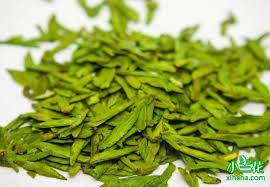
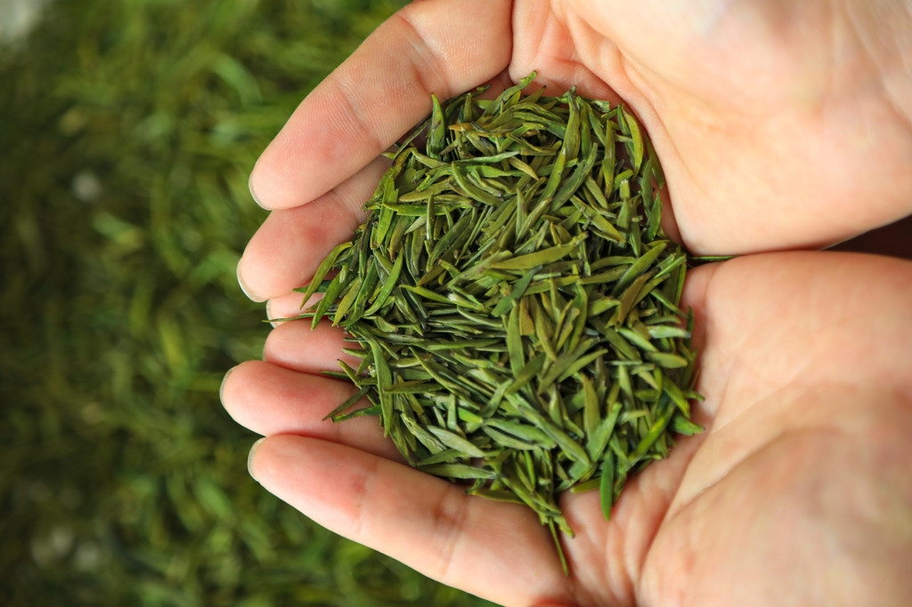

## ==茶叶==

> 茶叶是从山茶科植物茶树的嫩叶或芽中采摘，经不同加工工艺制作而成的饮品。作为世界上最受欢迎的天然饮料之一，茶叶含有多种活性成分，如茶多酚、咖啡因和氨基酸，具有清香的香气和独特的口感。`根据加工方式和发酵程度的不同`，茶叶主要分为绿茶、白茶、黄茶、青茶、红茶和黑茶等多种类型，各具风味。茶叶无高低贵贱之分，`自己喜欢的茶就是好茶`。
 
 `分类` 
| 茶叶种类       | 发酵程度          | 特点                               | 代表               | 
|----------------|------------------|-----------------------------------|--------------------| 
| 绿茶           | 发酵率 0%        | 保持天然绿色，味清香爽口            | 龙井、碧螺春、峨眉山茶      | 
| 白茶           | 发酵率 0-10%     | 微发酵，味清淡         | 白毫银针、白牡丹     | 
| 黄茶           | 发酵率 10-20%    | 轻发酵，滋味醇厚，带独特黄汤香      | 君山银针、蒙顶黄芽   | 
| 青茶（乌龙茶） | 发酵率 30-60%    | 半发酵，口感丰富，香气浓郁          | 铁观音、大红袍       | 
| 红茶           | 发酵率 80-100%   | 全发酵，汤色红亮，味甘醇、回甘      | 祁门红茶、滇红       | 
| 黑茶           | 微生物深度发酵    | 沤堆发酵，`非传统茶种类`         | 普洱茶              |

> `茶叶的味道来源`
>  涩味来自茶多酚（功效：抗氧化、保健作用） 
>  苦味来自咖啡因（刺激中枢神经，提神） 
>  香味（酮类、脂类、醇类） 
>  甜味（氨基酸） 
>  色素（花青素花黄素等）
>  `茶叶制作步骤`
>   主要步骤有：
> 1.采摘 i.采摘的位置，是叶芽还是叶子，采摘的时间（春茶最好）和天气
> 2.杀青 a.短时间高温处理防止发酵
> 3.萎凋 a.让茶叶自然失水，为后续揉捻和发酵做准备（对于白茶红茶乌龙茶等等发酵茶叶非常重要）
> 4.揉捻 a.通过大力揉捻促进茶叶细胞壁破裂，释放香气
> 5.发酵 a.除了黑茶，主要是生物氧化（多酚类物质被氧化
> 6.干燥 a.固定茶叶的香气和风味  

*`名茶`* 
主要和地区气候有关，具体哪个好喝看个人口味，没有高低贵贱 
`其他一些茶叶的知识`
> 1. 为什么有些茶叶要做成卷曲形或者球形？
> 
> > 茶叶被制成卷曲形或球形主要出于以下几个原因：
> > 
> > 1. **提高茶叶的耐泡性**：卷曲或球形的茶叶由于表面积相对较小，在冲泡时茶叶不会一次性完全释放内部的物质，茶汤会在逐次冲泡中逐渐释放香气和滋味，这使得茶叶能够多次冲泡而不失味道。这对于像**铁观音**等乌龙茶尤为重要。
> > 
> > 2. **便于保存和运输**：茶叶制成紧实的卷曲或球形，有利于节省空间，方便包装和储存。由于茶叶体积减少，包装效率提高，储存时也更加稳定。紧实的形状还减少了茶叶与空气的接触，延缓氧化，保持新鲜。
> > 
> > 3. **保护茶叶品质**：在卷曲或揉成球形的过程中，茶叶会经过**揉捻**，这有助于破坏细胞壁，释放内含的香气和滋味成分。成形后的茶叶更能保留其香气和营养成分，也不易在运输和储存过程中破碎。
> > 
> > 4. **冲泡时的视觉效果**：卷曲或球形茶叶在热水中慢慢舒展，逐渐释放香气和茶汁，这不仅增强了味觉体验，也带来了独特的视觉享受。茶叶在水中展开的过程常常被形容为"茶舞"，尤其在透明茶具中显得十分美观。
> > 
> > 5. **传统工艺和特色**：制作卷曲或球形茶叶是一些传统制茶工艺的体现，尤其在某些名茶中，卷曲或球形外形成为其标志性特点。比如，**铁观音**以其紧实的球形著称，而**碧螺春**则以卷曲螺旋状的形态闻名。

### 几款茶叶的详细介绍 （主要是产地和制作方式的区别）

#### 龙井 （叶子扁平，口味较浓但爽口） 分类：绿茶

龙井茶叶（西湖龙井）是中国绿茶的代表，其主要特点包括：

1. 外形：扁平光滑，形似雀舌，挺直匀整，色泽嫩绿或翠绿。
2. 香气：清香或栗香，带花果香，幽雅持久。
3. 滋味：鲜爽甘醇，入口柔和，回甘明显。
4. 汤色：清澈明亮，呈嫩绿色或黄绿色。
5. 叶底：细嫩成朵，均匀鲜活，呈嫩绿色。
6. 产地：主要产于浙江杭州西湖周边，如狮峰、梅家坞、龙井村等地。
7. 工艺：采用传统手工炒制，注重“抓、抖、搭、拓”等技法，保留茶叶鲜爽特性。

龙井茶以“色绿、香郁、味甘、形美”四绝著称，品质优异，深受茶友喜爱。

#### 峨眉山茶 （茶叶细嫩似雀舌，汤色嫩绿清亮）分类：绿茶

峨眉山茶以其独特的品质和风味著称，主要特点包括：

1. **外形**：峨眉山茶（以竹叶青为代表）外形扁平光滑，形似雀舌或竹叶，条索挺直匀整，色泽嫩绿或翠绿，整体美观精致。

2. **香气**：清香高扬，常带兰花香或栗香，部分高端茶品带有幽雅的花果香，香气持久，令人愉悦。

3. **滋味**：入口鲜爽甘醇，柔和顺滑，回甘明显，带有高山茶特有的清新感和层次感。

4. **汤色**：汤色清澈明亮，呈嫩绿色或浅黄绿色，晶莹剔透，视觉上极具吸引力。

5. **叶底**：叶底细嫩成朵，均匀鲜活，呈嫩绿色，展现出茶叶的优良品质和鲜嫩特性。

6. **产地**：主要产于四川峨眉山，海拔800-1500米的高山茶区，如黑水寺、万年寺、雷洞坪等地，环境云雾缭绕，土壤肥沃。

7. **工艺**：采用传统手工或半手工炒制，注重“抖、抓、压、磨”等技法，精准控制火候和时间，以保留茶叶的鲜爽特性和高山韵味。

### zata觉得还不错的茶叶（zata个人喜好，不喜勿喷）
- 竹叶青眀前绿茶（峨眉山茶） 分类：绿茶  ☆☆☆☆

都是明前茶，叶子很小，看着感觉很有档次。于2024年11月购入，当时是75一罐50g，感觉口感性价比都还不错，不过现在好像涨价了很多，感觉性价比就比较低了

优点：

1. 茶叶颗颗分明，非常好看
2. 包装加分

- 贡茶龙井 （龙井） 分类：绿茶  ☆☆☆

因为是龙井茶，所以口感会比竹叶青的要浓，叶子都是偏大，不过胜在量大管饱，于2024年3月购入，当时35元100g

