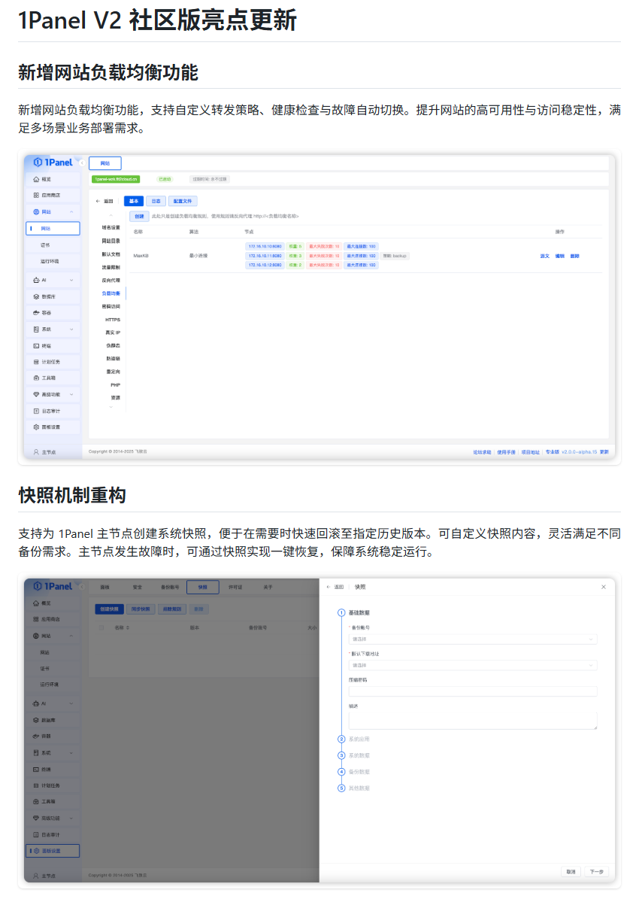
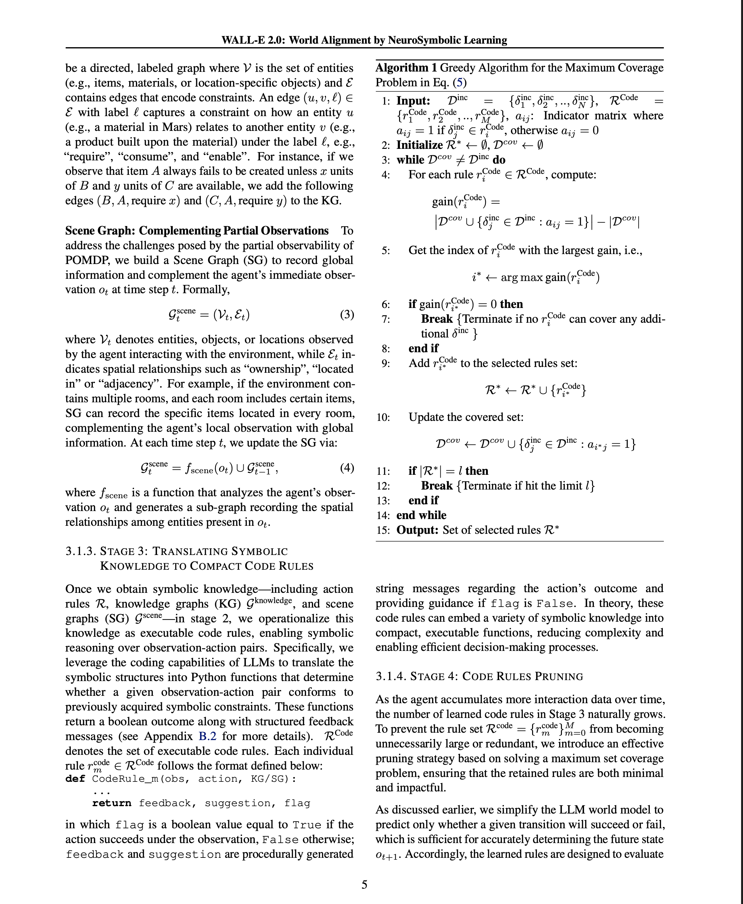
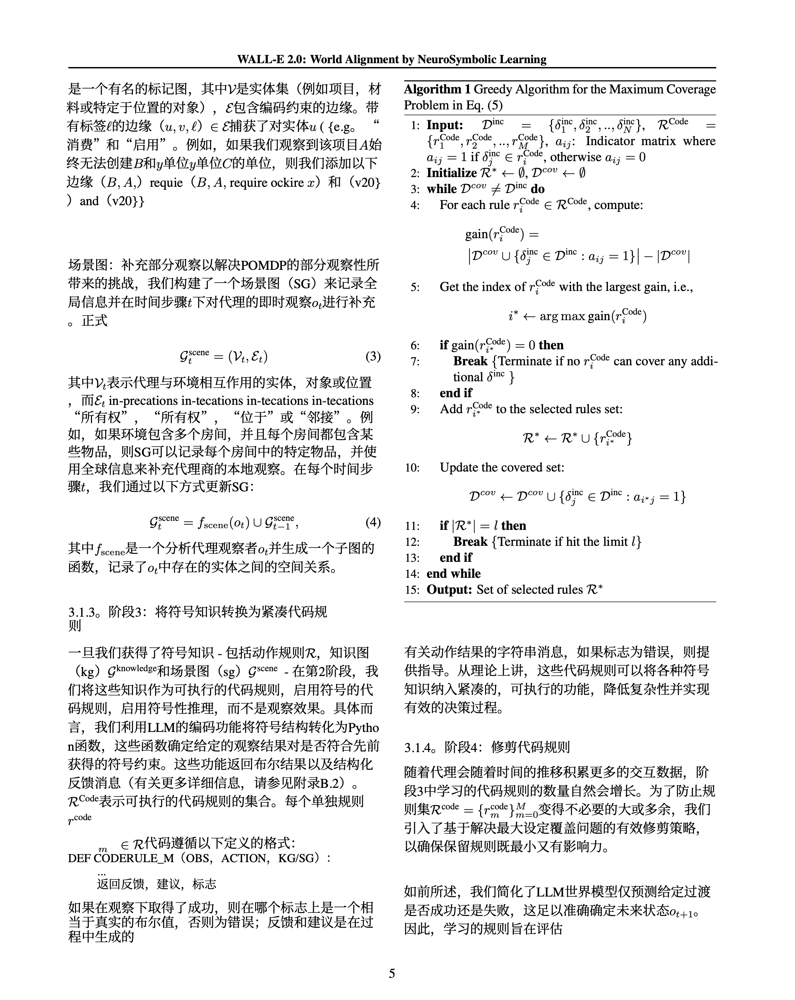

### 2025年07月第四周

#### 新闻

#### 项目

|||
|-----|-----|
|可以把在线的对话封装成api|- [minimax-free-api](https://github.com/LLM-Red-Team/minimax-free-api)|

#### 其他

### 2025年06月第四周

#### 新闻

#### 项目

|||
|-----|-----|
| monkeyocr - 非常好的pdf解析工具，感觉效果会比pdf2zh那个好非常多|- [github-monkeyocr](https://github.com/Yuliang-Liu/Monkey)|
|现一款刚刚开源的Python打包工具：PyFuze|[wechat](https://mp.weixin.qq.com/s/BkIQdK3G803GWZep-ODKMA)|
|Claudia发布！优雅界面赋能Claude Code，跨平台AI编程新体验|[aibase](https://www.aibase.com/zh/news/19207)|
|面向初学者的机器学习教程|[github](https://github.com/microsoft/ML-For-Beginners)|

#### 其他
##### Gemini Cli已发布， 对标claude code
[Gemini Cli已发布， 对标claude code](https://www.youtube.com/watch?v=v41xKxZmygU)
评论说效果似乎不如claude code

##### 1panel v2版本 社区版两点

### 2025年06月第一周

#### 新闻

#### 项目

|---|
|-----|
|- OpenAudio 发布开源 TTS 模型 S1-Mini：0.5B 参数打造超自然 AI 语音|
|- 全球领先的 AI 语音技术公司 ElevenLabs 正式发布了其最新文本转语音模型 Eleven v3（Alpha 版），被誉为迄今最具表现力的 AI 语音模型。这一突破性进展不仅提升了语音合成的自然度和情感表达能力，还为内容创作者和开发者提供了更强大的工具，助力视频、音频书和多媒体工具的开发。|

#### 其他
#####  google vertex 是什么？

**Google Vertex AI** 是一个由 Google Cloud提供的统一机器学习平台，旨在帮助开发者和数据科学家更轻松、更快速地构建、部署和扩展机器学习 (ML) 模型。它将 Google Cloud 内部用于机器学习的所有工具整合到一个统一的界面和 API 中，从而简化了从数据准备到模型部署和管理的整个机器学习工作流程。

可以把它想象成一个一站式的机器学习“车间”，无论是初学者还是专家，都可以在这里找到合适的工具来完成他们的项目。

---

**核心理念与目标**

Vertex AI 的核心理念是**简化机器学习的开发流程**。在过去，一个机器学习项目通常需要在多个不同的服务和工具之间切换，例如一个用于数据处理，另一个用于模型训练，还有一个用于模型部署。这个过程非常繁琐且容易出错。

Vertex AI 的目标就是解决这个问题，它将整个机器学习生命周期（MLOps）的各个阶段整合在一起，包括：

* **数据准备**：连接到各种数据源，并使用工具进行数据清洗、标注和预处理。
* **模型构建与训练**：利用 AutoML（自动化机器学习）或编写自定义代码来训练模型。
* **模型评估与管理**：在统一的模型注册表中跟踪、评估和管理所有模型版本。
* **模型部署与预测**：将模型轻松部署到生产环境中，并提供在线预测或批量预测。
* **模型监控**：持续监控已部署模型的性能，并检测数据漂移或概念漂移。

---

**主要功能与工具**

Vertex AI 提供了涵盖整个机器学习工作流程的丰富工具集：

| 功能类别 | 主要工具和特点 |
| :--- | :--- |
| **统一环境** | **Vertex AI Workbench**: 基于 Jupyter 的完全托管、可扩展的企业级计算环境，预装了数据科学和机器学习所需的各种库。 |
| **数据准备** | **Vertex AI Feature Store**: 一个集中的特征存储库，用于在不同模型之间共享、重用和提供机器学习特征。 |
| | **数据标注**: 提供数据标注服务，可用于图像、视频、文本等多种数据类型。 |
| **模型训练** | **AutoML**: 无需编写代码即可训练高质量的自定义模型。只需提供数据，Vertex AI 就会自动探索不同的模型架构，为您找到最佳模型。支持图像、表格、文本和视频数据。 |
| | **自定义训练**: 为需要更精细控制的专家提供全面的支持。您可以使用 TensorFlow, PyTorch, Scikit-learn 或 XGBoost 等主流框架编写自己的训练代码，并在 Google 强大的基础设施上运行。 |
| **模型部署与服务** | **统一模型注册表**: 一个中央位置，用于管理、版本化和跟踪您的所有机器学习模型。 |
| | **端点 (Endpoint)**: 只需点击几下，即可将您的模型部署为可用于实时预测的端点。支持流量拆分，方便进行 A/B 测试。 |
| | **批量预测**: 对于不需要实时响应的大规模数据，可以进行批量预测。 |
| **MLOps (机器学习运维)** | **Vertex AI Pipelines**: 基于 Kubeflow Pipelines 构建，可帮助您编排和自动化您的机器学习工作流，实现工作流的可重复性和可扩展性。 |
| | **模型监控**: 自动监控已部署模型的性能和输入数据，以检测是否存在偏移（skew）或漂移（drift），并及时发出警报。 |
| **生成式 AI (Generative AI)** | **Vertex AI Gemini API**: 可以访问 Google 最先进的多模态基础模型 Gemini，用于构建各种生成式 AI 应用。 |
| | **Model Garden**: 提供对 Google 和开源基础模型（Foundation Models）的访问，开发者可以轻松地发现、测试和部署这些模型，并进行微调。 |

---

**主要优势**

* **加速模型开发与部署**: 传统的机器学习项目可能需要数月时间，而借助 Vertex AI 的 AutoML 和简化的工作流程，可以将时间缩短到几天。
* **降低技术门槛**: AutoML 功能让没有深厚机器学习背景的开发者也能构建强大的模型。
* **提高团队协作效率**: 统一的平台和共享的工具（如 Feature Store 和模型注册表）使得数据科学家、机器学习工程师和开发者之间的协作更加顺畅。
* **强大的可扩展性与性能**: 背靠 Google Cloud 强大的基础设施，无论是训练还是预测，都能够轻松应对大规模的需求。
* **全面的 MLOps 支持**: 提供了从数据到部署再到监控的端到端 MLOps 工具，帮助企业实现机器学习流程的自动化和标准化，确保模型的质量和可靠性。
* **拥抱前沿的生成式 AI**: 紧跟技术趋势，内置了对 Gemini 等先进生成式 AI 模型的支持，让开发者可以轻松构建下一代 AI 应用。

---

**适用场景**

Google Vertex AI 适用于各种规模和行业的机器学习应用，例如：

* **零售业**: 用于构建产品推荐系统、需求预测和客户流失分析模型。
* **金融业**: 用于欺诈检测、信用风险评估和算法交易。
* **医疗保健**: 用于医学影像分析、疾病预测和个性化治疗方案的制定。
* **媒体与娱乐**: 用于内容推荐、观众行为分析和自动内容审核。
* **制造业**: 用于预测性维护、质量控制和供应链优化。

总而言之，**Google Vertex AI 是一个功能强大且全面的机器学习平台，它通过统一的工具和简化的流程，极大地降低了构建和部署高质量机器学习模型的复杂性，是企业和开发者在当今 AI 时代进行创新的重要利器。**
**Google Vertex AI：一站式机器学习与人工智能开发平台**

Google Vertex AI 是一个由 Google Cloud 提供的统一机器学习（ML）平台，旨在帮助开发者和数据科学家更轻松、更快速地构建、部署和扩展机器学习模型与人工智能（AI）应用。它整合了从数据准备、模型训练、模型评估到最终部署和管理的整个机器学习工作流程，提供了一套完整的工具集，无论是初学者还是专家都能高效地利用其进行 AI 开发。

---

**核心理念：统一与简化**

在 Vertex AI 推出之前，机器学习的各个阶段——例如使用 AutoML 进行自动化模型训练和使用自定义代码进行模型开发——通常需要通过不同的服务和界面来完成。Vertex AI 的核心优势在于**将整个机器学习流程统一到一个平台和 API**下。这意味着团队可以在同一个环境中进行数据工程、数据科学和机器学习工程的协作，从而大大提高了开发效率和协作的流畅性。

---

**主要功能与核心组件**

Vertex AI 提供了涵盖机器学习全生命周期的丰富功能，主要包括以下几个核心组件：

* **Vertex AI Studio**：这是一个用于快速测试、调整和部署生成式 AI 模型的可视化界面。开发者可以在这里与 Google 最先进的模型（如 Gemini）进行交互，通过编写提示（Prompt）来生成文本、图片、代码等内容，并根据特定需求对模型进行定制。

* **Model Garden（模型花园）**：Model Garden 提供了一个丰富的模型库，其中包含了 Google 自主研发的先进模型（如 Gemini、Imagen 等）、第三方模型以及众多流行的开源模型。用户可以在这里发现、测试、自定义和部署最适合其业务场景的模型。

* **AutoML**：对于没有深厚机器学习背景的用户，AutoML 提供了强大的自动化能力。用户只需提供结构化数据、图像、文本或视频，AutoML 就能自动训练出高性能的模型，无需编写任何代码。

* **Custom Training（自定义训练）**：对于需要更高灵活性的专家用户，Vertex AI 提供了完全受控的自定义训练环境。开发者可以使用自己喜欢的机器学习框架（如 TensorFlow, PyTorch, scikit-learn），编写自定义训练代码，并进行超参数调整。

* **Vertex AI Workbench**：这是一个基于 Jupyter 的集成开发环境，为数据科学家提供了从数据探索、分析到模型训练和部署的统一笔记本体验。它深度集成了 Google Cloud 的其他数据服务，如 BigQuery 和 Cloud Storage，方便用户无缝访问和处理数据。

* **MLOps 工具链**：Vertex AI 提供了一整套 MLOps（机器学习运维）工具，包括 **Vertex AI Pipelines** 用于构建和自动化工作流，**Vertex AI Feature Store** 用于管理和共享特征，以及 **Model Registry** 和 **Monitoring** 服务，帮助用户管理、版本控制和监控已部署模型的性能，确保其长期稳定运行。

---

**核心优势**

选择 Google Vertex AI 进行 AI 开发具有以下显著优势：

* **加速模型开发与部署**：通过统一的平台和强大的自动化工具，将模型从实验到生产部署的时间从数月缩短到数周甚至数天。
* **降低技术门槛**：AutoML 和 Vertex AI Studio 等工具使得没有专业机器学习知识的开发者也能构建和使用强大的 AI 模型。
* **强大的生成式 AI 能力**：可以直接访问和利用 Google 最前沿的生成式 AI 模型（如 Gemini），快速构建具备内容创作、对话、摘要等能力的下一代 AI 应用。
* **开放与灵活**：不仅支持 Google 的专有技术，还广泛兼容各类开源框架和第三方模型，为开发者提供了极大的灵活性和选择空间。
* **企业级的安全与可靠性**：依托于 Google Cloud 强大的基础设施，Vertex AI 提供了企业级的安全性、数据治理和可扩展性，确保应用稳定可靠。

---

**典型应用场景**

Google Vertex AI 已经被广泛应用于各个行业，解决复杂的业务问题，典型的应用场景包括：

* **智能客服与聊天机器人**：利用生成式 AI 模型构建能理解并进行多轮对话的智能客服，提升用户体验。
* **个性化推荐**：训练推荐模型，为用户提供更精准的商品、内容或服务推荐。
* **图像与视频分析**：通过图像识别和视频内容分析，实现产品质检、内容审核、场景理解等功能。
* **欺诈检测**：分析交易数据，实时识别并预防金融欺诈行为。
* **文档处理与分析**：自动从大量文档中提取关键信息、进行摘要和分类。

总之，Google Vertex AI 是一个功能强大且全面的平台，它通过简化和加速机器学习的整个生命周期，让企业和开发者能够更专注于创新和解决实际问题，从而在人工智能时代获得竞争优势。

### 2025年05月第二周

#### 新闻

- Flow-GRPO技术大幅提升图像生成模型能力，解决复杂场景生成难题。
- manus开放注册，目前看免费版本明显不如gemini

#### 项目

- [18中RAG技术对比](https://apframework.com/blog/essay/2025-04-09-18-RAG-Techniques)
- [Google Agent白皮书解析：模型、工具与编排层全面指南](https://apframework.com/blog/essay/2025-02-16-Google-Agent)
- [Claude MCP 使用及搭建](https://apframework.com/blog/essay/2024-12-15-Claude-MCP)
- [聊天记录生成数字分身](https://github.com/xming521/WeClone)

#### 感悟

### 2025年05月第一周
#### 科技新闻

- Qwen3发布

#### github项目

- [全新的跨平台浏览器内核，浏览器界面使用Qt开发](https://github.com/LadybirdBrowser/ladybird)

- [分享github项目的github项目](https://github.com/521xueweihan/HelloGitHub)

- [aws推出的agent框架](https://github.com/awslabs/agent-squad?tab=readme-ov-file)

            主要功能
            智能意图分类：自动识别用户查询，并动态分配合适的 AI 代理进行处理。

            双语支持：框架支持 Python 和 TypeScript 两种语言。

            灵活的代理响应：支持 流式（streaming） 和 非流式 的响应方式。

            上下文管理：多个 AI 代理之间共享和维护对话上下文，确保连贯性。

            可扩展架构：用户可以轻松集成新的 AI 代理，或定制现有代理的能力。

            跨平台部署：支持 AWS Lambda、本地环境、云平台 等多种运行方式。

            内置 AI 代理与分类器：提供预构建的代理，支持各种应用场景。

- [实时的deepfake](https://github.com/hacksider/Deep-Live-Cam)

- [一个子托管的dashboard，感觉可以和我的Upick结合一下](https://github.com/glanceapp/glance?tab=readme-ov-file)

- [具有本机AI功能的公平代码工作流程自动化平台。将视觉构建与自定义代码，自宿主或云相结合，400+集成。](https://github.com/n8n-io/n8n)

- [电子书阅读器，支持多格式，pdf、EPUB等](https://github.com/koreader/koreader?tab=readme-ov-file)

- [huggingface推出的agent课程](https://github.com/huggingface/agents-course)

- [科技爱好者周刊](https://github.com/ruanyf/weekly/tree/master)

### 2025年04月第三周

#### 科技新闻

-  真我推出首款 AI 翻译耳机 Bud Air7 Pro，支持 32 种语言翻译！  [感觉如果再结合手机作为声音输出源，真香！]
- ​哥伦比亚大学退学生开发 “AI面试作弊神器”Interview Coder ，成功融资500万美元 [可能以后的面试形式会变一变，不在是像现在这样的八股文了]

#### github项目

- https://github.com/microsoft/markitdown 【微软推出，用于将各类文件转换为markdown，现在提供mcp】 期待度：★★★★★

- https://github.com/Byaidu/PDFMathTranslate 【多语言的pdf翻译转换工具】 期待度：★★★★★   ---- 20250423试了，效果还可以，而且我还是用的默认的google翻译，可能用ai会更好

- https://github.com/dgtlmoon/changedetection.io?tab=readme-ov-file 【监控网页变化】

- https://github.com/pocketbase/pocketbase?tab=readme-ov-file 【一个小型的后端数据库】

- https://github.com/drawdb-io/drawdb 【可视化的操作/创建数据库】

- https://github.com/microsoft/generative-ai-for-beginners 【面向初学者的生成式AI课程】
 

### 2025年03月第三周

#### 科技新闻

1. OpenAI Chat Playground升级为Prompts Playground 更好测试、迭代提示词
2. 百度正式发布文心大模型4.5及文心大模型X1，效果如何？
	https://www.zhihu.com/question/13661056614
3. 小米大模型团队登顶音频推理 MMAU 榜，受到DeepSeek-R1启发
4. 首个国产Agent开发框架!仓颉社区发布Cangjie Magic，原生支持鸿蒙等全平台!
5. 2025.3.18-Mistral开源Mistral-Small-3.1-24B   多模态、多语言，各项评分超过Gemma 3 27B、GPT-4o mini，OCR能力强。
6. 腾讯更新混元3D模型 新发布3D 2.0 MV（多视角效果更好）和3D 2.0 Mini（参数更小）。

#### github项目趋势
1. https://github.com/glanceapp/glance/tree/main?tab=readme-ov-file   像newsnow    
2. https://github.com/xpipe-io/xpipe  shell connection hub

3. https://github.com/calcom/cal.com    有点像滴答清单

4. https://github.com/langchain-ai/ollama-deep-researcher

5. https://github.com/patchy631/ai-engineering-hub  ai的教程

6. https://github.com/langchain-ai/ollama-deep-researcher   ollama

7. https://github.com/graviraja/MLOps-Basics 分周了解机器学习运维基础

8. https://github.com/block/goose?tab=readme-ov-file  agent-tool

