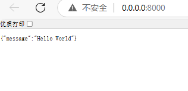
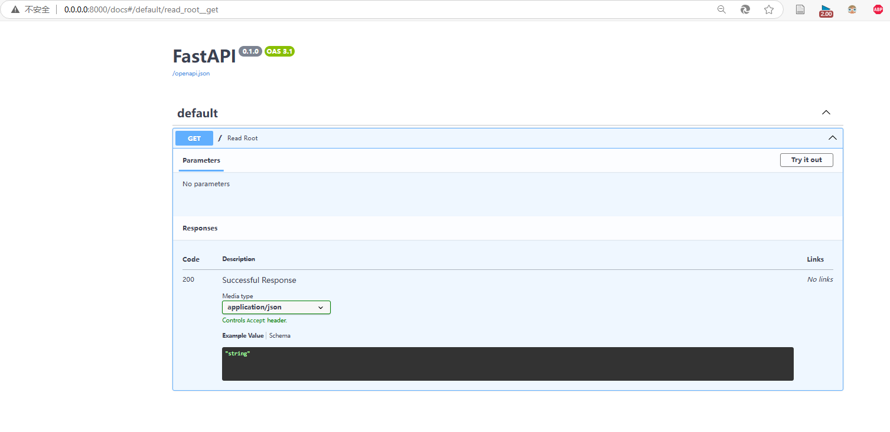
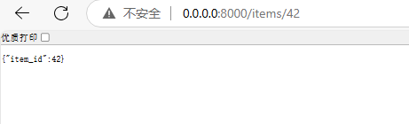
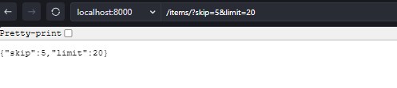
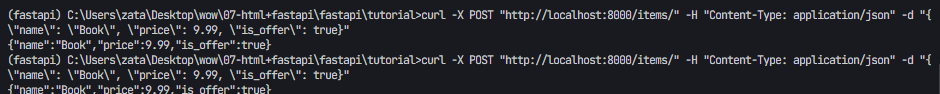
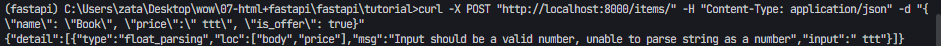
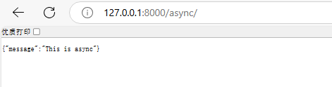

代码地址

https://github.com/zata-zhangtao/Zata-code/tree/main/07-html%2Bfastapi/fastapi/tutorial/phase1-fastapi%E7%AE%80%E5%8D%95%E7%9A%84%E5%BC%80%E5%A7%8B

---


### **教程大纲**
1. **环境准备**
2. **基础示例：Hello World**
3. **路径参数和查询参数**
4. **请求体和数据验证**
5. **异步编程**
6. **依赖注入**
7. **中间件和错误处理**
8. **部署 FastAPI 应用**

---

### **1. 环境准备**
#### 安装必要的工具  (我在教程中安装的python=3.11)
确保您已安装 Python 3.7 或更高版本，然后使用以下命令安装 FastAPI 和 Uvicorn（一个 ASGI 服务器，用于运行 FastAPI）：
```bash
pip install fastapi==0.115.12  uvicorn==0.34.0
```

#### 可选：安装其他依赖
- `pydantic`：用于数据验证（FastAPI 已包含）。
- `httpx`：用于测试 API（可选）。

---

### **2. 基础示例：Hello World**
让我们从一个简单的 FastAPI 应用开始。

#### 代码示例
创建一个文件 `main.py`：
```python
from fastapi import FastAPI

app = FastAPI()

@app.get("/")
def read_root():
    return {"message": "Hello World"}

# 然后你就可以使用 uvicorn 01-simple_start:app  --reload  去开启服务了

# 当然你也可以直接运行，使用下面的方式去开启服务

if __name__ == "__main__":
    import uvicorn
    uvicorn.run(app, host="0.0.0.0", port=8000)


```

#### 运行应用
在终端中运行以下命令：
```bash
uvicorn main:app --reload
```
- `main` 是文件名（不带 `.py`）。
- `app` 是 FastAPI 实例的名称。
- `--reload` 会在代码更改时自动重启服务器，适合开发环境。

#### 测试
打开浏览器访问 `http://127.0.0.1:8000`，您将看到：
```json
{"message": "Hello World"}
```



FastAPI 还提供交互式文档，访问 `http://127.0.0.1:8000/docs` 查看 Swagger UI。

---

### **3. 路径参数和查询参数**
#### 路径参数
路径参数通过 URL 传递，例如 `/items/1`。
```python
@app.get("/items/{item_id}")
def read_item(item_id: int):
    return {"item_id": item_id}
```
访问 `http://127.0.0.1:8000/items/42`，返回：
```json
{"item_id": 42}
```




#### 查询参数
查询参数通过 `?key=value` 形式传递。
```python
@app.get("/items/")
def read_items(skip: int = 0, limit: int = 10):
    return {"skip": skip, "limit": limit}
```
访问 `http://127.0.0.1:8000/items/?skip=5&limit=20`，返回：
```json
{"skip": 5, "limit": 20}
```


---

### **4. 请求体和数据验证**
FastAPI 使用 Pydantic 模型来处理请求体和数据验证。

#### 定义 Pydantic 模型
```python
from pydantic import BaseModel

class Item(BaseModel):
    name: str
    price: float
    is_offer: bool = None  # 可选字段，默认 None
```

#### 处理 POST 请求
```python
@app.post("/items/")
def create_item(item: Item):
    return {"name": item.name, "price": item.price, "is_offer": item.is_offer}
```

#### 测试
使用 Swagger UI (`/docs`) 或以下 `curl` 命令：
```bash
curl -X POST "http://localhost:8000/items/" -H "Content-Type: application/json" -d "{\"name\": \"Book\", \"price\": 9.99, \"is_offer\": true}"
```
返回：
```json
{"name": "Book", "price": 9.99, "is_offer": true}
```



如果数据格式错误（例如 `price` 传入字符串），FastAPI 会自动返回验证错误。




---

### **5. 异步编程**
FastAPI 支持异步函数，使用 `async def`，适合 I/O 密集型操作（如数据库查询）。

#### 异步示例
```python
import asyncio

@app.get("/async/")
async def read_async():
    await asyncio.sleep(1)  # 模拟异步操作
    return {"message": "This is async"}
```

访问 `http://127.0.0.1:8000/async/`，1 秒后返回结果。


---

### **6. 依赖注入**
依赖注入允许您在多个路由中复用代码，例如身份验证或数据库连接。

#### 定义依赖
```python
from fastapi import Depends

async def common_parameters(q: str | None = None, skip: int = 0):
    return {"q": q, "skip": skip}

@app.get("/depends/")
async def read_depends(commons: dict = Depends(common_parameters)):
    return commons
```

访问 `http://127.0.0.1:8000/depends/?q=test&skip=10`，返回：
```json
{"q": "test", "skip": 10}
```

我感觉注入依赖是一个比较难理解的内容，可以再看下面的内容增强理解


---

### **7. 中间件和错误处理**
#### 添加中间件
中间件用于处理请求和响应的全局逻辑，例如日志记录。
```python
@app.middleware("http")
async def add_custom_header(request, call_next):
    response = await call_next(request)
    response.headers["X-Custom"] = "Example"
    return response
```

#### 自定义异常处理
```python
from fastapi import HTTPException

@app.get("/error/")
async def read_error():
    raise HTTPException(status_code=404, detail="Item not found")
```
访问 `http://127.0.0.1:8000/error/`，返回：
```json
{"detail": "Item not found"}
```

---

### **8. 部署 FastAPI 应用**
#### 使用 Uvicorn 生产环境
去掉 `--reload`，指定主机和端口：
```bash
uvicorn main:app --host 0.0.0.0 --port 8000
```

#### 使用 Gunicorn + Uvicorn
安装 Gunicorn：
```bash
pip install gunicorn
```
运行：
```bash
gunicorn -w 4 -k uvicorn.workers.UvicornWorker main:app
```
- `-w 4` 表示 4 个工作进程。

#### Docker 部署
创建一个 `Dockerfile`：
```dockerfile
FROM python:3.9
WORKDIR /app
COPY . /app
RUN pip install fastapi uvicorn
CMD ["uvicorn", "main:app", "--host", "0.0.0.0", "--port", "8000"]
```
构建并运行：
```bash
docker build -t fastapi-app .
docker run -p 8000:8000 fastapi-app
```

