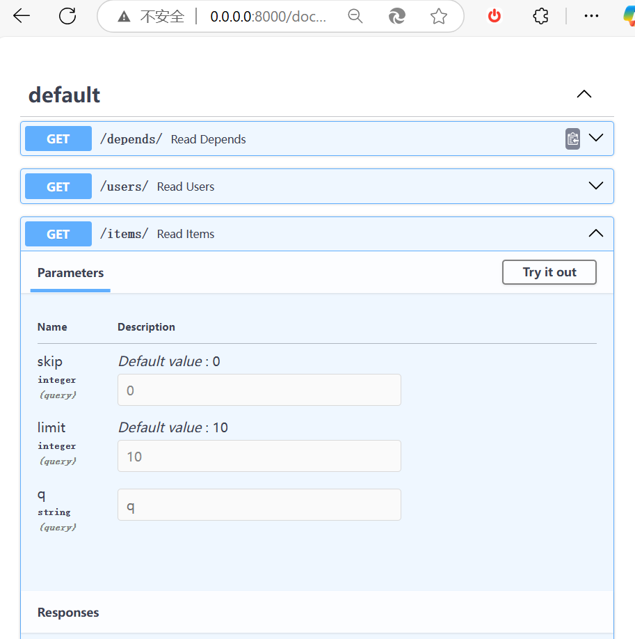

在 FastAPI 中，**依赖注入（Dependency Injection, DI）** 是一种设计模式，用于将某些功能或服务（称为“依赖”）动态地注入到应用程序的组件中，而不是在代码中硬编码这些依赖。它是 FastAPI 的核心特性之一，能够帮助开发者编写更模块化、可测试和可维护的代码。

下面我将详细解释 FastAPI 中的依赖注入概念，包括它的定义、工作原理、用法和实际示例。

---

### 1. 依赖注入是什么？
依赖注入的核心思想是：**将一个函数或类需要的外部资源（依赖）交给调用者来提供，而不是在函数或类内部直接创建这些资源**。在 FastAPI 中，依赖通常是：
- 数据库连接
- 用户认证逻辑
- 配置参数
- 外部 API 调用
- 其他需要在多个路由中复用的功能

FastAPI 通过其内置的依赖注入系统，允许你在路由函数或其他依赖中声明这些依赖，然后由框架自动解析并注入。

---

### 2. FastAPI 中依赖注入的工作原理
FastAPI 的依赖注入系统基于 Python 的类型注解和函数参数。它的工作方式如下：
- 你定义一个依赖（可以是一个函数或类）。
- 在路由函数或其他地方通过参数声明对这个依赖的使用。
- FastAPI 在运行时解析这些依赖，按照声明的顺序调用它们，并将结果注入到需要的地方。

依赖可以是同步函数、异步函数，甚至是类实例。FastAPI 还支持依赖的嵌套（一个依赖可以依赖另一个依赖）。

---

### 3. 如何使用依赖注入
FastAPI 提供了 `Depends` 函数来声明依赖。以下是基本用法：

#### 示例 1：简单的依赖注入
```python
from fastapi import FastAPI, Depends

app = FastAPI()

# 定义一个依赖函数
def common_parameters(q: str = None, skip: int = 0, limit: int = 10):
    return {"q": q, "skip": skip, "limit": limit}

# 在路由中使用依赖
@app.get("/items/")
def read_items(commons: dict = Depends(common_parameters)):
    return {"message": "Hello Items!", "params": commons}
```
- **依赖函数**：`common_parameters` 是一个普通的 Python 函数，返回一个字典。
- **`Depends`**：在路由函数中通过 `Depends(common_parameters)` 声明依赖，FastAPI 会调用这个函数并将结果注入到 `commons` 参数。
- **请求**：访问 `http://localhost:8000/items/?q=foo&skip=5&limit=20`，返回：
  ```json
  {"message": "Hello Items!", "params": {"q": "foo", "skip": 5, "limit": 20}}
  ```

#### 示例 2：异步依赖
如果你的依赖涉及异步操作（比如数据库查询），可以用 `async`：
```python
from fastapi import FastAPI, Depends

app = FastAPI()

async def get_db():
    db = "Database connection established"  # 模拟数据库连接
    try:
        yield db
    finally:
        print("Database connection closed")

@app.get("/users/")
async def read_users(db: str = Depends(get_db)):
    return {"db": db}
```
- **`async def`**：依赖函数是异步的。
- **`yield`**：支持上下文管理，`finally` 块在依赖使用完毕后执行（例如关闭数据库连接）。
- **请求**：访问 `http://localhost:8000/users/`，返回：
  ```json
  {"db": "Database connection established"}
  ```

#### 示例 3：类作为依赖
你也可以使用类来定义依赖：
```python
from fastapi import FastAPI, Depends

app = FastAPI()

class CommonQueryParams:
    def __init__(self, q: str = None, skip: int = 0, limit: int = 10):
        self.q = q
        self.skip = skip
        self.limit = limit

@app.get("/items/")
def read_items(commons: CommonQueryParams = Depends(CommonQueryParams)):
    return {"q": commons.q, "skip": commons.skip, "limit": commons.limit}
```
- **类依赖**：`CommonQueryParams` 是一个类，FastAPI 会自动实例化它并注入。
- **请求**：访问 `http://localhost:8000/items/?q=test&skip=2`，返回：
  ```json
  {"q": "test", "skip": 2, "limit": 10}
  ```

---

### 4. 依赖注入的优点
- **复用性**：同一个依赖可以在多个路由中复用，避免重复代码。例如，验证用户身份的逻辑可以写成依赖，在所有需要认证的路由中使用。
- **模块化**：依赖独立于路由逻辑，便于修改和替换。
- **测试性**：通过注入假的依赖（mock），可以轻松测试路由逻辑。
- **自动文档**：依赖的参数会自动出现在 FastAPI 的 Swagger UI 中，增强 API 可读性。

---

### 5. 高级用法
#### 嵌套依赖
依赖可以依赖其他依赖：
```python
from fastapi import FastAPI, Depends

app = FastAPI()

def query(q: str = None):
    return {"q": q}

def pagination(skip: int = 0, limit: int = 10, query_params: dict = Depends(query)):
    return {"skip": skip, "limit": limit, "query": query_params["q"]}

@app.get("/items/")
def read_items(params: dict = Depends(pagination)):
    return params
```
- **`pagination` 依赖 `query`**：FastAPI 会先解析 `query`，然后将结果注入到 `pagination` 中。
- **请求**：`http://localhost:8000/items/?q=foo&skip=5`，返回：
  ```json
  {"skip": 5, "limit": 10, "query": "foo"}
  ```

#### 全局依赖
可以在整个应用或特定路径上添加依赖：
```python
from fastapi import FastAPI, Depends

app = FastAPI(dependencies=[Depends(common_parameters)])

@app.get("/items/")
def read_items():
    return {"message": "Items with global dependency"}
```
- **`dependencies` 参数**：所有路由都会强制使用这个依赖。

---

### 你可以查看文档 /docs




### 6. 实际应用场景
- **用户认证**：检查请求头中的 token，确保用户已登录。
- **数据库连接**：为每个请求提供数据库会话，并在请求结束后关闭。
- **配置加载**：注入应用程序的配置参数。
- **日志记录**：在每个请求中注入日志对象。

例如，一个简单的认证依赖：
```python
from fastapi import FastAPI, Depends, HTTPException

app = FastAPI()

def get_current_user(token: str = None):
    if token != "valid-token":
        raise HTTPException(status_code=401, detail="Invalid token")
    return {"username": "user1"}

@app.get("/profile/")
def read_profile(user: dict = Depends(get_current_user)):
    return user
```

---

### 总结
FastAPI 的依赖注入是一种强大而灵活的工具，通过 `Depends` 和类型注解实现。它允许你将公共逻辑抽取出来，动态注入到路由中，既提高了代码复用性，又保持了清晰的结构。无论是简单的参数处理还是复杂的数据库操作，依赖注入都能很好地适应。
