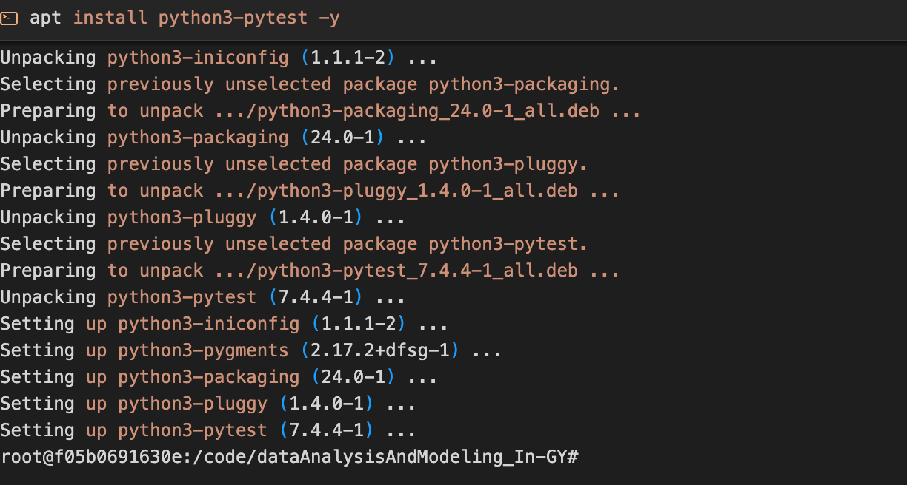
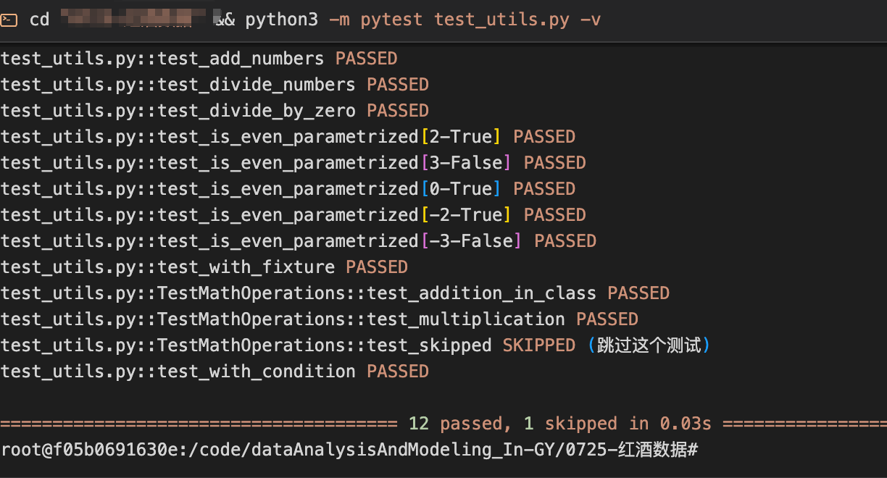

## 基础概念

### 什么是 Pytest？

Pytest 是一个成熟、功能丰富的 Python 测试框架。与 Python 内置的 `unittest` 框架相比，Pytest 具有以下核心优势：

* **更少的样板代码**：测试用例就是函数，不需要继承任何类。
* **更强大的断言**：直接使用 Python 的 `assert` 语句，失败时能提供详细的上下文信息，无需记忆 `assertEqual`, `assertTrue` 等方法。
* **强大的 Fixture (夹具)**：以一种优雅、模块化的方式管理测试的依赖和状态（如数据库连接、临时文件等）。
* **丰富的插件生态**：拥有数百个高质量的插件，如 `pytest-cov` (测试覆盖率)、`pytest-xdist` (分布式测试)、`pytest-django` (Django集成) 等。
* **灵活的测试发现**：自动发现并执行项目中的测试文件和测试函数。
* **清晰的输出信息**：默认提供简洁明了的测试报告。

### 1. 安装

首先，你需要通过 pip 安装 pytest：

```bash
pip install pytest
````
 2\. 你的第一个测试

Pytest 的测试发现机制遵循一些简单的规则：

  * 文件名以 `test_*.py` 或 `*_test.py` 格式命名。
  * 文件内，以 `test_` 开头的函数会被识别为测试函数。
  * 文件内，包含以 `test_` 开头的方法的 `Test` 开头的类（不能有 `__init__` 方法）会被识别为测试类。

**示例：**

假设我们有一个简单的函数需要测试。

**`project/calculator.py`**

```python
# 一个简单的计算器模块
def add(a, b):
    return a + b

def subtract(a, b):
    return a - b
```

现在，在同一个目录下创建一个测试文件。

**`project/test_calculator.py`**

```python
# 导入需要测试的函数
from calculator import add

# 这是一个测试函数
def test_add():
    # 使用 assert 语句进行断言
    assert add(2, 3) == 5
    assert add(-1, 1) == 0
    assert add(-1, -1) == -2

def test_add_strings():
    # 这个测试预期会失败，因为 add 函数不支持字符串
    assert add('a', 'b') == 'ab'
```

### 3\. 运行测试

在你的终端中，切换到 `project` 目录，然后执行 `pytest` 命令。

```bash
cd project
pytest
```

你会看到类似以下的输出：

```
============================= test session starts ==============================
platform linux -- Python 3.9.5, pytest-8.2.2, pluggy-1.5.0
rootdir: /path/to/project
collected 2 items

test_calculator.py .F                                                    [100%]

=================================== FAILURES ===================================
______________________________ test_add_strings ______________________________

    def test_add_strings():
        # 这个测试预期会失败，因为 add 函数不支持字符串
>       assert add('a', 'b') == 'ab'
E       TypeError: unsupported operand type(s) for +: 'int' and 'str'

test_calculator.py:14: TypeError
=========================== short test summary info ============================
FAILED test_calculator.py::test_add_strings - TypeError: unsupported operand...
========================= 1 failed, 1 passed in 0.02s ==========================
```

**输出解读**：

  * `.` (点) 代表一个通过的测试 (`test_add`)。
  * `F` 代表一个失败的测试 (`test_add_strings`)。
  * Pytest 详细地展示了 `test_add_strings` 失败的原因 (`TypeError`) 和失败发生在哪一行代码，这就是 `assert` 的强大之处。

**常用运行选项**：

  * **详细模式 (`-v`)**：显示每个测试函数的全名和结果。
    ```bash
    pytest -v
    ```
  * **运行指定文件**：
    ```bash
    pytest test_calculator.py
    ```
  * **使用关键字 (`-k`) 运行特定测试**：运行函数名中包含 "add" 的测试。
    ```bash
    pytest -k "add"
    ```
  * **遇到第一个失败就停止 (`-x`)**：
    ```bash
    pytest -x
    ```

### 4\. Fixture (夹具)：管理测试依赖

Fixture 是 Pytest 的核心功能，用于为测试提供一个固定的基线状态。它们是管理 setup 和 teardown 逻辑的首选方式。

**使用场景**：

  * 创建一个数据库连接。
  * 创建一个临时目录或文件。
  * 提供一个可复用的数据对象。

**示例：**
假设我们需要一个临时文件来进行测试。

```python
# test_file.py
import pytest
import os

# 定义一个 fixture
@pytest.fixture
def temp_file(tmp_path): # tmp_path 是 pytest 内置的更现代的 fixture
    # Setup: 创建一个临时文件并写入内容
    file_path = tmp_path / "test.txt"
    file_path.write_text("hello pytest")
    
    # yield 关键字返回资源，测试函数会在这里执行
    yield file_path
    
    # Teardown: 这里可以写清理代码，但 tmp_path 会自动清理
    # print("\nCleaning up the file")

# 在测试函数中，把 fixture 的名字作为参数传入
def test_read_from_temp_file(temp_file):
    with open(temp_file, "r") as f:
        content = f.read()
    assert content == "hello pytest"
```

  * `@pytest.fixture` 装饰器定义了一个 fixture。
  * 测试函数 `test_read_from_temp_file` 通过参数名 `temp_file` 来声明它需要使用这个 fixture。
  * `yield` 之前是 **setup** 代码，`yield` 之后是 **teardown** (清理) 代码。
  * `tmp_path` 是 Pytest 内置的一个 fixture，用于创建临时目录，是比 `tmpdir` 更推荐的方式。

#### Fixture 的作用域 (`scope`)

Fixture 可以在多个测试之间共享，以提高效率。`scope` 参数控制其生命周期：

  * `function` (默认): 每个测试函数都运行一次。
  * `class`: 每个测试类只运行一次。
  * `module`: 每个模块只运行一次。
  * `session`: 整个测试会话只运行一次（所有测试开始前创建，结束后销毁）。

<!-- end list -->

```python
@pytest.fixture(scope="session")
def db_connection():
    # 假设这里是连接数据库的昂贵操作
    print("\nSetting up DB connection for the session")
    conn = ... # connect_to_db()
    yield conn
    print("\nTearing down DB connection for the session")
    conn.close()
```

### 5\. 使用 `conftest.py` 共享 Fixture

当多个测试文件需要使用同一个 Fixture 时，我们不应该在每个文件里都写一遍。这时，`conftest.py` 就派上用场了。

`conftest.py` 是一个特殊的文件，它的作用是：

  * **共享 Fixtures**: 定义在 `conftest.py` 中的 Fixture 可以在其所在的目录及所有子目录的测试文件中直接使用，**无需导入**。
  * **存放 Hooks**: 可以用来自定义 Pytest 的行为。
  * **本地插件库**: `conftest.py` 本质上就是一个本地的插件。

**示例：**
假设我们的项目结构如下：

```
project/
├── app/
│   ├── __init__.py
│   └── user_service.py
└── tests/
    ├── conftest.py
    ├── test_user_api.py
    └── test_user_database.py
```

我们可以将昂贵的数据库连接 Fixture 放在 `tests/conftest.py` 中。

**`tests/conftest.py`**

```python
import pytest

# 一个 session 级别的 fixture，模拟数据库连接
@pytest.fixture(scope="session")
def db_conn():
    print("\n[conftest] Creating DB connection")
    # 模拟连接对象
    conn = {"status": "connected", "data": {}}
    yield conn
    # 清理工作
    print("\n[conftest] Closing DB connection")
    conn["status"] = "closed"
```

现在，`tests` 目录下的所有测试文件都可以直接使用 `db_conn` 这个 Fixture。

**`tests/test_user_api.py`**

```python
def test_user_creation_api(db_conn):
    # 注意：我们没有从任何地方导入 db_conn
    assert db_conn["status"] == "connected"
    # ... 模拟 API 调用来创建用户
```

**`tests/test_user_database.py`**

```python
def test_user_data_consistency(db_conn):
    assert db_conn["status"] == "connected"
    # ... 模拟直接检查数据库
```

当你运行 `pytest` 时，`db_conn` Fixture 只会被创建一次，然后被所有需要它的测试函数共享，最后在所有测试结束后被销毁。这就是 `conftest.py` 和 `scope="session"` 结合的强大之处。

### 6\. Markers (标记)：组织和控制测试

Markers 用于给测试函数打上标签，方便你对它们进行分组、跳过或标记为预期失败。

**常用内置标记：**

  * **`@pytest.mark.skip`**: 无条件跳过测试。
    ```python
    @pytest.mark.skip(reason="Function not implemented yet")
    def test_new_feature():
        ...
    ```
  * **`@pytest.mark.skipif`**: 根据条件跳过测试。
    ```python
    import sys

    @pytest.mark.skipif(sys.version_info < (3, 8), reason="requires Python 3.8 or higher")
    def test_modern_syntax():
        ...
    ```
  * **`@pytest.mark.xfail`**: 标记为预期失败 (XFAIL - Expected Failure)。如果测试失败，结果是 `XFAIL`；如果意外通过，结果是 `XPASS`。
    ```python
    @pytest.mark.xfail(reason="Bug #123 is not fixed yet")
    def test_known_bug():
        assert some_buggy_function() == False
    ```

**自定义标记：**
你可以创建自己的标记来对测试进行分类，例如 "slow", "api", "ui"。为了避免拼写错误和警告，最好在 `pytest.ini` 中注册它们。

**`pytest.ini`** (在项目根目录创建此文件)

```ini
[pytest]
markers =
    slow: marks tests as slow to run
    api: marks tests related to API calls
```

**`test_file.py`**

```python
import pytest

@pytest.mark.slow
def test_very_slow_operation():
    ...

@pytest.mark.api
def test_api_endpoint():
    ...
```

**运行带有特定标记的测试 (`-m`)**

```bash
# 只运行标记为 "slow" 的测试
pytest -m slow

# 运行所有不是 "slow" 的测试
pytest -m "not slow"

# 运行 "api" 或 "slow" 的测试
pytest -m "api or slow"
```

### 7\. 参数化 (`parametrize`)：用不同数据多次运行同一测试

当你需要用多组不同的输入和输出来测试同一个函数时，参数化非常有用。

```python
import pytest
from calculator import add

# 使用 @pytest.mark.parametrize 装饰器
@pytest.mark.parametrize("input1, input2, expected", [
    (1, 2, 3),          # 测试用例1
    (-1, 1, 0),         # 测试用例2
    (10, 0, 10),        # 测试用例3
    (99, 1, 100),       # 测试用例4
    pytest.param(1, 1, 3, marks=pytest.mark.xfail) # 标记为预期失败的用例
])
def test_add_multiple(input1, input2, expected):
    assert add(input1, input2) == expected
```

  * 第一个参数是参数名的字符串，用逗号分隔。
  * 第二个参数是一个列表，列表中的每个元素（通常是元组）对应一组测试数据。
  * Pytest 会为每一组数据生成并运行一个独立的测试。

### 8\. 配置文件 (`pytest.ini`)

`pytest.ini` 是 Pytest 的主配置文件，通常放在项目的根目录。它可以让你自定义 Pytest 的行为。

**一个常见的 `pytest.ini` 示例：**

```ini
[pytest]
# 设置默认的命令行参数
addopts = -v --strict-markers -ra

# 指定测试文件所在的目录
testpaths = tests

# 定义自定义标记，避免拼写错误和警告
markers =
    slow: marks tests as slow to run
    smoke: marks tests for smoke testing

# 忽略某些目录或文件
norecursedirs = .git venv *.egg-info
```

> `-ra` 是一个非常有用的参数，它会在测试结束后，简要报告所有通过（`p`）、失败（`f`）、跳过（`s`）等结果的原因。

### 9\. 常用插件

  * **`pytest-cov`**: 生成测试覆盖率报告。

    ```bash
    pip install pytest-cov
    pytest --cov=my_project --cov-report=html
    ```

    这会生成一个 `htmlcov` 目录，里面有详细的 HTML 覆盖率报告。

  * **`pytest-xdist`**: 并行运行测试，加快执行速度。

    ```bash
    pip install pytest-xdist
    pytest -n auto  # 'auto' 会根据 CPU 核心数自动决定进程数
    ```

### 总结

这个教程涵盖了 Pytest 最核心和最常用的功能。掌握了这些，你已经可以高效地为你的项目编写健壮的测试了。

**学习路径建议**：

1.  从编写简单的 `test_` 函数和使用 `assert` 开始。
2.  学习使用 Fixture 来管理测试的准备和清理工作。
3.  **使用 `conftest.py` 来组织和共享你的 Fixtures，使其在整个测试套件中可用。**
4.  当你发现测试用例重复时，使用 `@pytest.mark.parametrize` 进行参数化。
5.  当测试集变大时，使用 Markers (`@pytest.mark`) 来组织和筛选测试。
6.  通过 `pytest.ini` 配置文件来固化你的测试习惯。
7.  根据需要，探索并使用插件来扩展 Pytest 的功能。

最好的学习方法是实践。尝试为你自己的项目编写测试，或者为一个你喜欢的小型开源项目贡献测试代码。

要了解更多信息，请随时查阅 [Pytest 官方文档](https://docs.pytest.org/)。

-----

## 实战示例（结合 `conftest.py`）

让我们用一个更完整的例子来展示这些概念如何协同工作。

**项目结构:**

```
my_project/
├── app/
│   ├── __init__.py
│   └── math_operations.py
├── tests/
│   ├── conftest.py
│   └── test_math_operations.py
└── pytest.ini
```

**`app/math_operations.py`**

```python
def add(a, b):
    return a + b

def divide(a, b):
    if b == 0:
        raise ValueError("Cannot divide by zero")
    return a / b
```

**`tests/conftest.py`**

```python
import pytest

# 定义一个在所有测试函数中都可用的 fixture
@pytest.fixture
def base_data():
    """提供一组基础测试数据"""
    return {"x": 10, "y": 5}
```

**`tests/test_math_operations.py`**

```python
import pytest
from app.math_operations import add, divide

# 测试类，用于组织相关测试
class TestMath:
    # 使用来自 conftest.py 的 fixture
    def test_add(self, base_data):
        result = add(base_data["x"], base_data["y"])
        assert result == 15

    # 参数化测试
    @pytest.mark.parametrize("a, b, expected", [
        (10, 2, 5.0),
        (8, 4, 2.0),
        (-6, 3, -2.0)
    ])
    def test_divide_parametrized(self, a, b, expected):
        assert divide(a, b) == expected

    # 测试异常情况
    def test_divide_by_zero(self):
        with pytest.raises(ValueError, match="Cannot divide by zero"):
            divide(10, 0)
```

**`pytest.ini`**

```ini
[pytest]
addopts = -v
testpaths = tests
```

**如何运行?**

在 `my_project` 根目录下，直接运行 `pytest` 命令。

```bash
pytest
```

**预期输出:**

```
============================= test session starts ==============================
...
collected 4 items

tests/test_math_operations.py::TestMath::test_add PASSED                 [ 25%]
tests/test_math_operations.py::TestMath::test_divide_parametrized[10-2-5.0] PASSED [ 50%]
tests/test_math_operations.py::TestMath::test_divide_parametrized[8-4-2.0] PASSED [ 75%]
tests/test_math_operations.py::TestMath::test_divide_by_zero PASSED      [100%]

============================== 4 passed in ...s ===============================
```

这个实战示例展示了如何组织项目结构，如何使用 `conftest.py` 提供共享数据，以及如何在一个测试文件中结合使用测试类、参数化和异常测试。

```




