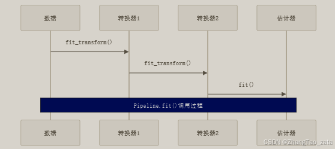
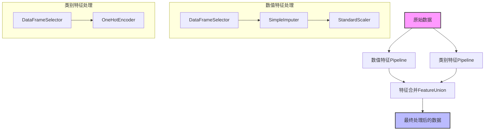

### pipeline的构建

####  1. Pipeline基本概念与规则

Pipeline是Scikit-learn中的一个重要工具，它可以将多个数据处理和模型训练步骤串联在一起。构建Pipeline需要遵循以下规则：

- Pipeline由(名字, 估计器)对的列表构成
- 除最后一个步骤外，其他步骤必须是转换器（transformer）
- 转换器必须具有fit_transform()方法
- 最后一个步骤可以是估计器（estimator）


#### 2. Pipeline运行机制

- 执行流程：



- 关键代码示例：
```python
from sklearn.pipeline import Pipeline
from sklearn.preprocessing import StandardScaler
from sklearn.impute import SimpleImputer

# 基础Pipeline构建
num_pipeline = Pipeline([
    ('imputer', SimpleImputer(strategy="median")),
    ('std_scaler', StandardScaler()),
])

# 执行转换
data_num_tr = num_pipeline.fit_transform(data_num)
```

#### 3. `自定义转换器`

为了处理Pandas DataFrame，我们需要创建自定义转换器：

```python
from sklearn.base import BaseEstimator, TransformerMixin

class DataFrameSelector(BaseEstimator, TransformerMixin):
    def __init__(self, attribute_names):
        self.attribute_names = attribute_names
    
    def fit(self, X, y=None):
        return self
    
    def transform(self, X):
        return X[self.attribute_names].values
```

#### 4. 完整Pipeline构建流程

- 数值和类别特征处理Pipeline：



- 实现代码：
```python
# 数值特征Pipeline
num_pipeline = Pipeline([
    ('selector', DataFrameSelector(num_attribs)),
    ('imputer', SimpleImputer(strategy="median")),
    ('std_scaler', StandardScaler())
])

# 类别特征Pipeline
cat_pipeline = Pipeline([
    ('selector', DataFrameSelector(cat_attribs)),
    ('onehot', OneHotEncoder(handle_unknown='ignore')),
])

# 合并Pipeline
from sklearn.pipeline import FeatureUnion
full_pipeline = FeatureUnion(transformer_list=[
    ('num_pipeline', num_pipeline),
    ('cat_pipeline', cat_pipeline),
])
```

#### 5. 使用ColumnTransformer简化Pipeline构建

在Scikit-Learn 0.20及以上版本中，可以使用ColumnTransformer来简化Pipeline构建：

```python
from sklearn.compose import ColumnTransformer

full_pipeline = ColumnTransformer([
    ("num", num_pipeline, num_attribs),
    ("cat", OneHotEncoder(), cat_attribs),
])
```

#### 6. Pipeline的优势

1. **代码组织**: 将所有预处理步骤组织在一起，使代码更清晰
2. **避免数据泄露**: 确保在训练集上fit的转换器用相同的参数转换测试集
3. **简化工作流**: 只需要调用一个fit和transform方法
4. **参数优化**: 可以对整个pipeline进行网格搜索调优
5. **重用性**: Pipeline可以保存并重复使用

#### 7. 最佳实践建议

1. 为Pipeline中的每个步骤选择有意义的名字
2. 确保所有转换器都实现了fit_transform方法
3. 使用ColumnTransformer处理不同类型的特征
4. 在构建Pipeline之前先测试单个转换器
5. 使用get_params()和set_params()方法调整Pipeline参数


- 示例代码

```python
from sklearn.pipeline import Pipeline
from sklearn.feature_extraction.text import CountVectorizer
from sklearn.naive_bayes import MultinomialNB
import numpy as np
import scipy.linalg
from sklearn.preprocessing import LabelEncoder, StandardScaler
import optuna
import scipy.linalg
from sklearn.linear_model import BayesianRidge
import pandas as pd
from sklearn.model_selection import LeaveOneOut, cross_val_score

class EmscScaler(object):
    def __init__(self, order=1):
        self.order = order
        self._mx = None
    def mlr(self, x, y):
        """Multiple linear regression fit of the columns of matrix x
        (dependent variables) to constituent vector y (independent variables)

        order -     order of a smoothing polynomial, which can be included
                    in the set of independent variables. If order is
                    not specified, no background will be included.
        b -         fit coeffs
        f -         fit result (m x 1 column vector)
        r -         residual   (m x 1 column vector)
        """
        if self.order > 0:
            s = np.ones((len(y), 1))
            for j in range(self.order):
                s = np.concatenate((s, (np.arange(0, 1 + (1.0 / (len(y) - 1)), 1.0 / (len(y) - 1)) ** j).reshape(-1,1)[0:len(y)]),1)
            X = np.concatenate((x.reshape(-1,1), s), 1)
        else:
            X = x
        # calc fit b=fit coefficients
        b = np.dot(np.dot(scipy.linalg.pinv(np.dot(X.T, X)), X.T), y)
        f = np.dot(X, b)
        r = y - f
        return b, f, r
    def fit(self, X, y=None):
        """fit to X (get average spectrum), y is a passthrough for pipeline compatibility"""
        self._mx = np.mean(X, axis=0)
    def transform(self, X, y=None, copy=None):
        if type(self._mx) == type(None):
            print("EMSC not fit yet. run .fit method on reference spectra")
        else:
            # do fitting
            corr = np.zeros(X.shape)
            for i in range(len(X)):
                b, f, r = self.mlr(self._mx, X[i, :])
                corr[i, :] = np.reshape((r / b[0]) + self._mx, (corr.shape[1],))
            return corr
    def fit_transform(self, X, y=None):
        self.fit(X)
        return self.transform(X)


from sklearn.base import BaseEstimator, TransformerMixin
class SpectraPreprocessor(BaseEstimator, TransformerMixin):
    def __init__(self, emsc_order=3,X_ref=None):
        self.emsc_order = emsc_order
        self.emsc_scalers = [EmscScaler(order=emsc_order) for _ in range(4)]
        self.X_ref = X_ref

    def fit(self, X, y=None):
        X_ref = self.X_ref
        if X_ref is None:
            X_ref = X.copy()
        # Define the column ranges for each segment
        ranges = [(0, 251), (281, 482), (482, 683), (683, 854)]
        
        # Fit EmscScaler for each segment
        for i, (start, end) in enumerate(ranges):
            self.emsc_scalers[i].fit(X_ref[:, start:end])
        
        return self

    def transform(self, X, y=None):
        # Define the column ranges for each segment
        ranges = [(0, 251), (281, 482), (482, 683), (683, 854)]
        
        # Transform each segment
        transformed_segments = []
        for i, (start, end) in enumerate(ranges):
            segment = X[:, start:end]
            transformed_segment = self.emsc_scalers[i].transform(segment)

            transformed_segments.append(transformed_segment)
        
        # Concatenate all transformed segments
        return np.concatenate(transformed_segments, axis=1)

    def fit_transform(self, X, y=None):
        self.fit(X)
        return self.transform(X)
    


def bayesian_ridge_optuna_for_emsc_data(x_train, y_train, pipeline_):
    def objective(trial):
        try:
            alpha_1 = trial.suggest_float('alpha_1', 0.001, 1, log=True)
            alpha_2 = trial.suggest_float('alpha_2', 0.001, 1, log=True)
            lambda_1 = trial.suggest_float('lambda_1', 0.001, 1, log=True)
            lambda_2 = trial.suggest_float('lambda_2', 0.001, 1, log=True)
            model = pipeline_.set_params(
                bayesian_ridge__alpha_1=alpha_1,
                bayesian_ridge__alpha_2=alpha_2,
                bayesian_ridge__lambda_1=lambda_1,
                bayesian_ridge__lambda_2=lambda_2
            )
            model.fit(x_train, y_train)
            score = cross_val_score(model, x_train, y_train, cv=10, n_jobs=-1, scoring='r2')
            return np.mean(score)
        except ValueError as e:
            return -np.inf
    
    optuna.logging.set_verbosity(optuna.logging.WARNING)
    pruner = optuna.pruners.MedianPruner()
    study = optuna.create_study(direction="maximize", pruner=pruner)
    study.optimize(objective, n_trials=500, show_progress_bar=True, n_jobs=1)
    return study.best_params


def getdata(filenamex, filenamey):
    x = pd.read_csv(filenamex, header=None)
    y = pd.read_csv(filenamey)

    data = pd.concat([x, y], axis=1)
    return data

    
name = 'test'
x, y = np.random.rand(100,884), np.random.rand(100)
x_ref =  np.random.rand(30,884)
pipeline = Pipeline([
    ('preprocessor', SpectraPreprocessor(emsc_order=3, X_ref=None)),
    ('scaler', StandardScaler()),
    ('bayesian_ridge', BayesianRidge())
])

pipeline.set_params(preprocessor__X_ref=x_ref)

############################################################################################################################################################
best_params = bayesian_ridge_optuna_for_emsc_data(x, y, pipeline)
############################################################################################################################################################

pipeline.set_params(
    bayesian_ridge__alpha_1=best_params['alpha_1'],
    bayesian_ridge__alpha_2=best_params['alpha_2'],
    bayesian_ridge__lambda_1=best_params['lambda_1'],
    bayesian_ridge__lambda_2=best_params['lambda_2']
)
pipeline.fit(x, y)
y_pred = pipeline.predict(x)
print(y_pred)
```
