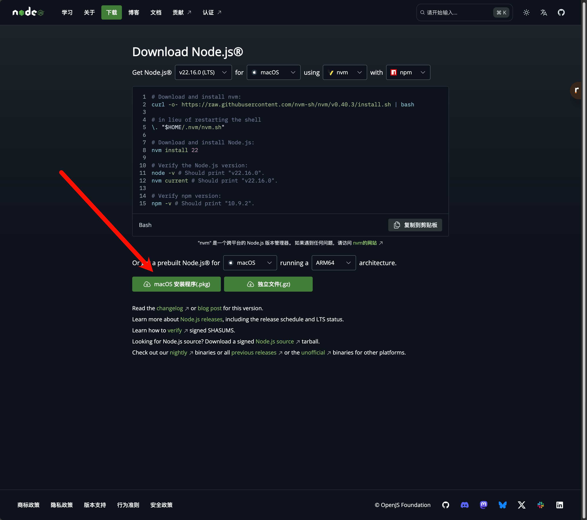

## 目录

- [基础知识](#基础知识)
  - [📚 1. 学习 React 前的准备](#-1-学习-react-前的准备)
  - [🛠️ 2. 搭建 React 开发环境](#️-2-搭建-react-开发环境)
  - [🧩 3. React 基础概念](#-3-react-基础概念)
  - [🎯 4. React 核心特性](#-4-react-核心特性)
  - [🚀 5. 第一个动手实践：待办事项列表](#-5-第一个动手实践待办事项列表-todo-list)
  - [💡 6. React Hooks 简介](#-6-react-hooks-简介)
  - [🚀 7. 接下来学什么？](#-7-接下来学什么)
  - [为什么使用Vite来构建React项目](#为什么使用Vite来构建React项目)
  - [💖 8. 学习建议](#-8-学习建议)
  
- [实战](#实战)
  - [TypeScript中的两种[]符号含义  useState<FileInfo[]>([])](#typescript中的两种符号含义)


## 基础知识

### 📚 1. 学习 React 前的准备

在开始学习 React 之前，你需要对以下技术有一定的了解：

1.  **HTML (超文本标记语言)**：了解基本的 HTML 结构和标签。
2.  **CSS (层叠样式表)**：了解如何使用 CSS 来设置页面样式。
3.  **JavaScript (JS)**：这是最重要的。你需要掌握 JavaScript 的基础知识，包括：
    * 变量、数据类型、操作符
    * 函数（特别是箭头函数 `=>`）
    * 数组和对象（包括解构赋值、扩展运算符 `...`）
    * ES6+ 模块 (`import`/`export`)
    * `this` 关键字 (虽然在函数组件中不常用，但理解其基本概念有益)
    * 异步编程 (Promises, async/await) - 在后续学习中会用到

---

### 🛠️ 2. 搭建 React 开发环境

最快上手 React 的方式是使用官方推荐的脚手架工具 `Create React App`。

1.  **安装 Node.js 和 npm (或 yarn)**：
    * React 开发依赖 Node.js 环境。访问 [Node.js 官网](https://nodejs.org/) 下载并安装最新 LTS (长期支持) 版本。

    


    * `npm` (Node Package Manager) 会随 Node.js 一起安装。你也可以选择使用 `yarn` 作为包管理工具。

2.  **创建你的第一个 React 应用**：
    打开你的终端或命令行工具，运行以下命令：
    ```bash
    npx create-react-app my-react-app
    ```
    这里 `my-react-app` 是你的项目名称，你可以替换成任何你喜欢的名字。
    `npx` 是一个 npm 包运行器，它会下载最新版本的 `create-react-app` 并执行它。

3.  **进入项目目录并启动开发服务器**：
    ```bash
    cd my-react-app
    npm start
    ```
    或者，如果你使用 yarn：
    ```bash
    cd my-react-app
    yarn start
    ```
    这会启动一个本地开发服务器（通常在 `http://localhost:3000`），并在你的浏览器中自动打开应用。当你修改代码并保存时，页面会自动刷新。

---

### 📂 3. 了解项目结构

`create-react-app` 会生成一个标准的项目结构：

```
my-react-app/
├── node_modules/      # 项目依赖的第三方库
├── public/            # 存放静态资源
│   ├── index.html     # 应用的 HTML 入口文件
│   └── ...            # 其他如 favicon.ico, manifest.json 等
├── src/               # 主要的源代码目录
│   ├── App.css        # App 组件的样式
│   ├── App.js         # 主要的 App 组件
│   ├── App.test.js    # App 组件的测试文件
│   ├── index.css      # 全局样式
│   ├── index.js       # JavaScript 的入口文件，将 App 组件渲染到 HTML 中
│   ├── logo.svg       # 示例图片
│   └── ...            # 其他辅助文件
├── .gitignore         # Git 忽略文件配置
├── package.json       # 项目元数据和依赖项列表
├── package-lock.json  # (或 yarn.lock) 锁定依赖版本
└── README.md          # 项目说明文件
```

* **`public/index.html`**：这是你的单页面应用的唯一 HTML 文件。React 会将你的组件渲染到这个文件中的某个 DOM 元素（通常是一个 `id="root"` 的 `div`）。
* **`src/index.js`**：这是 JavaScript 的入口。它使用 `ReactDOM.render()` 方法将你的主组件（通常是 `App` 组件）挂载到 `public/index.html` 中的 `div#root`元素上。
* **`src/App.js`**：这是应用的根组件。你将从这里开始构建你的用户界面。

---

### ✨ 4. React核心概念

#### a. JSX (JavaScript XML)

JSX 是一种 JavaScript 的语法扩展，它允许你在 JavaScript 代码中编写类似 HTML 的结构。浏览器并不直接支持 JSX，它需要通过 Babel 这样的转译器转换为普通的 JavaScript 对象。

示例：
```jsx
const name = "React 学习者";
const element = <h1>你好, {name}!</h1>; // JSX 表达式

// 上面的 JSX 实际上会被 Babel 转译成类似这样的 JavaScript：
// const element = React.createElement('h1', null, '你好, ', name, '!');
```
在 JSX 中：
* 你可以嵌入 JavaScript 表达式，用花括号 `{}` 包裹。
* HTML 属性名需要使用驼峰命名法（例如 `className` 而不是 `class`，`onClick` 而不是 `onclick`）。
* 所有标签必须闭合（例如 `` 或 `<div></div>`）。

#### b. 组件 (Components)

组件是 React 的核心。它们是独立且可复用的代码块，负责渲染 UI 的一部分。React 主要有两种类型的组件：

1.  **函数组件 (Functional Components)**：这是目前推荐的方式。它们是简单的 JavaScript 函数，接收一个 `props` 对象作为参数，并返回一个 React 元素（通常是 JSX）。

    ```jsx
    // src/components/Welcome.js
    import React from 'react';

    function Welcome(props) {
      return <h1>你好, {props.name}!</h1>;
    }

    export default Welcome;
    ```
    使用组件：
    ```jsx
    // src/App.js
    import React from 'react';
    import Welcome from './components/Welcome'; // 假设你创建了components目录

    function App() {
      return (
        <div>
          <Welcome name="张三" />
          <Welcome name="李四" />
        </div>
      );
    }

    export default App;
    ```

2.  **类组件 (Class Components)**：这是老版本 React 中常用的方式，基于 ES6 的 `class`。它们需要继承 `React.Component` 并实现一个 `render()` 方法。

    ```jsx
    // src/components/Greeting.js
    import React from 'react';

    class Greeting extends React.Component {
      render() {
        return <h1>你好, {this.props.name}! (来自类组件)</h1>;
      }
    }

    export default Greeting;
    ```

**建议**：对于新项目，优先使用函数组件和 Hooks。

#### c. Props (属性)

`Props` (properties 的缩写) 是组件的配置信息。它们是从父组件传递给子组件的数据。Props 是**只读的**，子组件不能直接修改接收到的 props。

示例见上面的 `Welcome` 组件，`name` 就是一个 prop。

#### d. State (状态)

`State` 是组件内部私有的数据，它可以随时间变化（例如用户交互、网络响应等）。当组件的 state 改变时，React 会自动重新渲染该组件。

在函数组件中，我们使用 `useState` Hook 来管理 state。

```jsx
// src/components/Counter.js
import React, { useState } from 'react'; // 引入 useState Hook

function Counter() {
  // 声明一个名为 count 的 state 变量，初始值为 0
  // setCount 是一个用来更新 count 的函数
  const [count, setCount] = useState(0);

  return (
    <div>
      <p>你点击了 {count} 次</p>
      <button onClick={() => setCount(count + 1)}>
        点我增加
      </button>
      <button onClick={() => setCount(count > 0 ? count - 1 : 0)}>
        点我减少
      </button>
    </div>
  );
}

export default Counter;
```
**关键点**：
* `useState` 返回一个数组：`[currentStateValue, functionToUpdateState]`。
* 通过调用 `setCount(newValue)` 来更新 `count` 的值，这会触发组件的重新渲染。
* 永远不要直接修改 state (例如 `count = count + 1;`)，总是使用 `set` 函数。

#### e. 事件处理 (Event Handling)

React 元素的事件处理和 DOM 元素的事件处理非常相似，但有一些语法差异：
* React 事件的命名采用驼峰式，而不是纯小写 (例如 `onClick` 而不是 `onclick`)。
* 通过 JSX，你传递一个函数作为事件处理程序，而不是一个字符串。

示例见上面的 `Counter` 组件中的 `onClick` 事件。

#### f. 条件渲染 (Conditional Rendering)

你可以根据应用的 state 或 props 来决定渲染哪些组件或元素。常用的方法有：
* `if` 语句
* 逻辑与运算符 `&&`
* 三元运算符 `condition ? trueValue : falseValue`

```jsx
// src/components/LoginControl.js
import React, { useState } from 'react';

function UserGreeting(props) {
  return <h1>欢迎回来!</h1>;
}

function GuestGreeting(props) {
  return <h1>请登录.</h1>;
}

function LoginButton(props) {
  return <button onClick={props.onClick}>登录</button>;
}

function LogoutButton(props) {
  return <button onClick={props.onClick}>退出</button>;
}

function LoginControl() {
  const [isLoggedIn, setIsLoggedIn] = useState(false);

  const handleLoginClick = () => {
    setIsLoggedIn(true);
  };

  const handleLogoutClick = () => {
    setIsLoggedIn(false);
  };

  let button;
  let greeting;

  if (isLoggedIn) {
    button = <LogoutButton onClick={handleLogoutClick} />;
    greeting = <UserGreeting />;
  } else {
    button = <LoginButton onClick={handleLoginClick} />;
    greeting = <GuestGreeting />;
  }

  return (
    <div>
      {greeting}
      {button}
      {/* 使用三元运算符的另一种方式 */}
      {/* {isLoggedIn ? <UserGreeting /> : <GuestGreeting />}
      {isLoggedIn
        ? <LogoutButton onClick={handleLogoutClick} />
        : <LoginButton onClick={handleLoginClick} />} */}
    </div>
  );
}

export default LoginControl;
```

#### g. 列表和 Keys (Lists and Keys)

你可以使用 JavaScript 的 `map()` 方法来将数组渲染为元素列表。当渲染列表时，React 需要一个特殊的 `key` prop 来帮助识别哪些列表项被更改、添加或删除。`key` 应该是唯一的字符串，通常使用数据项中的 ID。

```jsx
// src/components/NumberList.js
import React from 'react';

function ListItem(props) {
  // 正确！这里不需要指定 key:
  return <li>{props.value}</li>;
}

function NumberList(props) {
  const numbers = props.numbers;
  const listItems = numbers.map((number) =>
    // 正确！key 应该在数组的上下文中被指定
    <ListItem key={number.toString()} value={number} />
  );
  return (
    <ul>
      {listItems}
    </ul>
  );
}

export default NumberList;

// 在 App.js 中使用:
// import NumberList from './components/NumberList';
// const numbers = [1, 2, 3, 4, 5];
// <NumberList numbers={numbers} />
```
**重要提示**：`key` 只需要在兄弟节点中唯一，不需要全局唯一。不要使用数组的索引作为 `key`，除非列表是静态的且不会重新排序。

---


### 🚀 5. 第一个动手实践：待办事项列表 (Todo List)

让我们结合以上概念，尝试构建一个简单的待办事项列表。

1.  **创建 `TodoItem.js` 组件 (`src/components/TodoItem.js`)**
    ```jsx
    import React from 'react';

    function TodoItem({ todo, index, toggleTodo, removeTodo }) {
      return (
        <li style={{ textDecoration: todo.isCompleted ? 'line-through' : '' }}>
          {todo.text}
          <div>
            <button onClick={() => toggleTodo(index)}>
              {todo.isCompleted ? '撤销' : '完成'}
            </button>
            <button onClick={() => removeTodo(index)} style={{ marginLeft: '10px' }}>
              删除
            </button>
          </div>
        </li>
      );
    }

    export default TodoItem;
    ```

2.  **创建 `TodoList.js` 组件 (`src/components/TodoList.js`)**
    ```jsx
    import React, { useState } from 'react';
    import TodoItem from './TodoItem';

    function TodoList() {
      const [todos, setTodos] = useState([
        { text: '学习 React', isCompleted: false },
        { text: '构建一个 Todo 应用', isCompleted: false },
      ]);
      const [inputValue, setInputValue] = useState('');

      const addTodo = (text) => {
        if (!text.trim()) return; // 不添加空内容
        const newTodos = [...todos, { text, isCompleted: false }];
        setTodos(newTodos);
      };

      const toggleTodo = (index) => {
        const newTodos = [...todos];
        newTodos[index].isCompleted = !newTodos[index].isCompleted;
        setTodos(newTodos);
      };

      const removeTodo = (index) => {
        const newTodos = [...todos];
        newTodos.splice(index, 1);
        setTodos(newTodos);
      };

      const handleSubmit = (e) => {
        e.preventDefault(); // 阻止表单默认提交行为
        addTodo(inputValue);
        setInputValue(''); // 清空输入框
      };

      return (
        <div className="todo-list">
          <h1>我的待办事项</h1>
          <form onSubmit={handleSubmit}>
            <input
              type="text"
              value={inputValue}
              onChange={(e) => setInputValue(e.target.value)}
              placeholder="添加新的待办..."
            />
            <button type="submit">添加</button>
          </form>
          <ul>
            {todos.map((todo, index) => (
              <TodoItem
                key={index} // 注意：这里用 index 做 key 仅为演示，实际项目中如有唯一 ID 更好
                index={index}
                todo={todo}
                toggleTodo={toggleTodo}
                removeTodo={removeTodo}
              />
            ))}
          </ul>
        </div>
      );
    }

    export default TodoList;
    ```
    你可能需要一些简单的 CSS 来美化它。在 `src/App.css` (或新建一个 `TodoList.css` 并导入) 添加：
    ```css
    /* src/App.css 或 src/TodoList.css */
    .todo-list {
      font-family: sans-serif;
      max-width: 500px;
      margin: 50px auto;
      padding: 20px;
      border: 1px solid #eee;
      border-radius: 8px;
      box-shadow: 0 2px 4px rgba(0,0,0,0.1);
    }

    .todo-list h1 {
      text-align: center;
      color: #333;
    }

    .todo-list form {
      display: flex;
      margin-bottom: 20px;
    }

    .todo-list input[type="text"] {
      flex-grow: 1;
      padding: 10px;
      border: 1px solid #ddd;
      border-radius: 4px;
      font-size: 16px;
    }

    .todo-list button {
      padding: 10px 15px;
      margin-left: 10px;
      background-color: #5cb85c;
      color: white;
      border: none;
      border-radius: 4px;
      cursor: pointer;
      font-size: 16px;
    }

    .todo-list button:hover {
      background-color: #4cae4c;
    }

    .todo-list ul {
      list-style-type: none;
      padding: 0;
    }

    .todo-list li {
      display: flex;
      justify-content: space-between;
      align-items: center;
      padding: 10px 0;
      border-bottom: 1px solid #eee;
    }

    .todo-list li:last-child {
      border-bottom: none;
    }

    .todo-list li button {
      background-color: #d9534f;
      font-size: 12px;
      padding: 5px 10px;
    }
    .todo-list li button:first-of-type { /* 针对 "完成/撤销" 按钮 */
        background-color: #f0ad4e;
    }
    ```

3.  **在 `src/App.js` 中使用 `TodoList` 组件**
    ```jsx
    import React from 'react';
    import './App.css'; // 确保引入了样式
    import TodoList from './components/TodoList'; // 确保路径正确

    function App() {
      return (
        <div className="App">
          <TodoList />
        </div>
      );
    }

    export default App;
    ```

现在，你的浏览器应该显示一个可以添加、完成和删除待办事项的列表了！

---

### 💡 6. React Hooks 简介

Hooks 是 React 16.8 版本引入的新特性，它允许你在不编写 class 的情况下使用 state 以及其他的 React 特性。

* **`useState`**：如上所述，用于在函数组件中添加 state。
* **`useEffect`**：用于处理副作用（side effects），例如数据获取、订阅或手动更改 DOM。它类似于类组件中的 `componentDidMount`、`componentDidUpdate` 和 `componentWillUnmount` 的组合。

    ```jsx
    import React, { useState, useEffect } from 'react';

    function Timer() {
      const [seconds, setSeconds] = useState(0);

      useEffect(() => {
        // 这个函数会在组件挂载后以及每次更新后执行
        const intervalId = setInterval(() => {
          setSeconds(prevSeconds => prevSeconds + 1);
        }, 1000);

        // 清理函数：这个函数会在组件卸载前执行
        return () => clearInterval(intervalId);
      }, []); // 空数组 [] 表示这个 effect 只在组件挂载和卸载时运行一次

      return (
        <div>
          计时器: {seconds} 秒
        </div>
      );
    }

    export default Timer;
    ```
    **`useEffect` 的依赖项数组**：
    * `[]` (空数组)：Effect 只在挂载时运行一次，清理函数在卸载时运行。
    * `[var1, var2]`：Effect 在挂载时运行，并且在 `var1` 或 `var2` 改变后的每次渲染时运行。
    * 不传第二个参数（不推荐）：Effect 在每次渲染后都会运行。

还有许多其他的 Hooks，如 `useContext`, `useReducer`, `useCallback`, `useMemo`, `useRef` 等，你可以在后续学习中逐步掌握。

---

### 🚀 7. 接下来学什么？

当你掌握了以上基础知识后，可以继续学习：

1.  **表单处理 (Forms)**：更深入地学习受控组件和非受控组件。
2.  **组件生命周期 (Lifecycle Methods)**：虽然 Hooks 简化了许多，但了解类组件的生命周期方法对理解 React 的工作方式仍有帮助。
3.  **路由 (Routing)**：使用 `React Router` 来构建多页面的单页面应用。
4.  **状态管理 (State Management)**：
    * **Context API**：React 内置的，用于在组件树中共享状态，避免 props drilling (逐层传递 props)。
    * **Redux, Zustand, MobX**：更强大的第三方状态管理库，适用于大型复杂应用。
5.  **数据获取 (Data Fetching)**：如何从后端 API 获取数据并展示（例如使用 `fetch` API 或 `axios` 库，并结合 `useEffect`）。
6.  **组件库 (Component Libraries)**：例如 Material-UI, Ant Design, Chakra UI 等，它们提供了预制的 UI 组件，可以加速开发。
7.  **测试 (Testing)**：使用 Jest, React Testing Library 等工具为你的组件编写测试。
8.  **构建和部署 (Build and Deployment)**：学习如何将你的 React 应用打包并部署到服务器或静态网站托管平台。
9.  **TypeScript 与 React**：为你的 React 项目添加静态类型检查。
10. **性能优化 (Performance Optimization)**：`React.memo`, `useCallback`, `useMemo`, 代码分割等。

---

### 💖 8. 学习建议

* **多动手实践**：理论学习很重要，但通过实际编写代码来巩固知识更重要。
* **阅读官方文档**：React 的官方文档非常出色，是学习的最佳资源。
* **参与社区**：在 Stack Overflow, Reddit (r/reactjs), DEV Community 等社区提问和交流。
* **从小项目开始**：逐步增加项目的复杂度。
* **保持耐心**：学习曲线可能有些陡峭，但坚持下去就会有收获。


### 为什么使用Vite来构建React项目
“React 和 Vite 项目”是将强大的前端库 React 与现代、极速的构建工具 Vite 结合起来的开发方式。

这是一种非常流行和高效的组合，Vite 旨在通过提供闪电般的开发服务器启动速度和极快的热模块替换 (HMR) 来显著改善前端开发体验。

以下是关于 React 和 Vite 项目的详细说明：

---

🚀 为什么使用 Vite 来构建 React 项目？

Vite 解决了传统构建工具（如 Create React App 背后的 Webpack）在大型项目中遇到的一些性能瓶颈。

  * **极速的开发服务器启动：** Vite 使用浏览器原生的 ES 模块 (ESM) 功能。它不需要在启动前打包整个应用，而是按需提供代码文件，使得开发服务器几乎可以瞬时启动。
  * **闪电般的热模块替换 (HMR)：** 当你修改代码时，Vite 只会更新被修改的模块，而不是重新加载整个页面。这个过程非常快，让你能够几乎实时地看到代码变更的效果，且不会丢失应用状态。
  * **优化的构建：** 在生产环境中，Vite 使用 Rollup 进行打包。Rollup 是一个非常高效的打包器，擅长 tree-shaking（移除未使用的代码）和生成高度优化的代码包。
  * **开箱即用的体验：** Vite 原生支持 TypeScript、JSX、CSS Modules 等，无需繁琐配置。

-----

 🛠️ 如何创建一个 React + Vite 项目？

创建
一个 React + Vite 项目非常简单。你可以使用 `npm`, `yarn`, 或 `pnpm`。

打开你的终端，运行以下命令之一：

**使用 NPM:**

```bash
npm create vite@latest my-react-app -- --template react
```

**使用 Yarn:**

```bash
yarn create vite my-react-app --template react
```

**使用 PNPM:**

```bash
pnpm create vite my-react-app --template react
```

-----

 🏃‍♂️ 启动项目

创建完成后，按照终端提示的步骤操作：

1.  **进入项目目录：**

    ```bash
    cd my-react-app
    ```

2.  **安装依赖：**

    ```bash
    npm install
    ```

3.  **启动开发服务器：**

    ```bash
    npm run dev
    ```

执行 `npm run dev` 后，你将看到一个本地服务器地址（通常是 `http://localhost:5173/`）。在浏览器中打开它，你就能看到你的 React + Vite 应用了。

-----

 🆚 与 Create React App (CRA) 的对比

Vite 通常被视为 Create React App (CRA) 的现代替代品。

| 特性 | Vite | Create React App (CRA) |
| :--- | :--- | :--- |
| **开发服务器** | 原生 ESM，按需编译 | Webpack 打包，冷启动慢 |
| **启动速度** | 极快（秒级） | 较慢（随项目增大而变慢） |
| **HMR** | 极快（基于 ESM） | 较慢（通常刷新整个组件） |
| **构建工具** | Rollup (生产环境) | Webpack |
| **配置** | 简单，`vite.config.js` | 复杂，需 `eject` 或 Craco |

总之，**React + Vite** 组合提供了当下最顶级的开发体验，特别是对于追求效率和性能的开发者而言。

你是想了解如何**将旧的 CRA 项目迁移到 Vite**，还是想知道关于 Vite 配置的**更多细节**（例如如何配置代理）？

---

**如何禁止用户在浏览器中查看前端源码**

首先，我们必须明确一个核心事实：**你永远无法 100% 阻止用户查看你的前端代码。**

Web的根本机制决定了浏览器**必须**下载你的HTML、CSS和JavaScript文件才能在用户屏幕上渲染出页面。只要代码在浏览器上，技术上总有办法被查看（例如通过开发者工具的“网络”或“来源”面板）。

但是，你的目标可能不是“完全隐藏”，而是“**防止他人轻易地阅读、理解和复制你的原始源代码**”。

对于这个目标，Vite（以及其他现代构建工具）已经为你做了大部分工作。你需要做的主要有以下几件事：

 1\. 依赖生产构建（Vite 默认会做）

你**绝对不能**将 `npm run dev`（开发环境）的代码部署到线上。开发环境为了便于调试，会保留所有原始代码、注释和模块路径。

你必须使用生产构建命令：

```bash
npm run build
```

这个命令会触发 Vite (底层使用 Rollup) 执行以下操作，这已经解决了你 90% 的担忧：

  * **打包 (Bundling):** 将你所有的 `.js`, `.jsx` 模块合并成少数几个文件。
  * **转译 (Transpiling):** 将你的 JSX 语法和 ES6+ 语法转换为浏览器兼容的普通 JavaScript。
  * **压缩 (Minification):** 这是最关键的一步。它会删除所有空格、换行、注释，并将你的变量名（如 `const [userInfo, setUserInfo] = useState(null);`）替换成单个字母（如 `const [a,b]=useState(null);`）。

**结果：** 用户在浏览器中看到的将是一堆紧凑、混乱、几乎无法阅读的“乱码”，这已经不是你的“源码”了，而是“编译后的机器码”。

 2\. 关键一步：关闭 Source Maps（源映射）

这是**最重要**的一步，也是新手最容易忽略的一步。

  * **什么是 Source Map?** 它是一个 `.map` 文件，作用是**将“压缩后的代码”映射回“你的原始源代码”**。它的唯一目的是帮助开发者在生产环境（线上）也能轻松地调试错误。
  * **你的问题：** 如果你将 `.map` 文件上传到服务器，任何人都可以使用浏览器的开发者工具，像看你本地的 `src` 文件夹一样，看到你所有的原始 `.jsx` 文件、目录结构和注释。

**如何解决 (在 Vite 中):**

Vite 非常智能，**默认情况下在生产构建 (`npm run build`) 中是关闭 Source Map 的**。

但如果你（或你的同事）之前为了调试方便打开过它，你需要检查你的 `vite.config.js` (或 `vite.config.ts`) 文件，确保 `build.sourcemap` 设置为 `false`。

```javascript
// vite.config.js
import { defineConfig } from 'vite'
import react from '@vitejs/plugin-react'

export default defineConfig({
  plugins: [react()],
  build: {
    // 确保这一行是 false，或者直接删掉（Vite 默认就是 false）
    sourcemap: false 
  }
})
```

**检查方法：** 运行 `npm run build` 后，检查生成的 `dist/assets` 文件夹，确保里面**没有** `.js.map` 或 `.css.map` 结尾的文件。

 3\. （不推荐）极端方案：代码混淆 (Obfuscation)

如果你觉得“压缩”还不够，还想让代码逻辑变得更难被逆向工程，下一步就是“代码混淆”。

混淆器会做一些事情，比如：

  * 将字符串（如 "API\_KEY\_PUBLIC"）拆分成 `['A','P','I',...].join('')`。
  * 重写控制流（`if/else` 变成复杂的 `switch` 或循环）。
  * 注入无意义的“僵尸代码”。

**为什么不推荐？**

1.  **严重性能问题：** 混淆后的代码通常体积更大，运行速度更慢。
2.  **调试噩梦：** 如果线上出了 bug，你自己也看不懂代码，Source Map 将完全失效。
3.  **虚假的安全感：** 专业的逆向工程师依然可以（花更多时间）破解它。

如果你坚持要用，可以使用 `vite-plugin-javascript-obfuscator` 这类插件。

-----

总结：你的最佳策略

对于 99% 的项目，你只需要做两件事：

1.  始终使用 `npm run build` 来打包你的应用。
2.  确保 `vite.config.js` 中 `build.sourcemap` 为 `false`（或未设置，使用默认值）。

最后，请记住一个黄金法则：

> **任何敏感信息（如 API 密钥、私有算法、管理员密码）绝对不能放在前端代码中，无论你如何压缩或混淆。** 这些信息必须始终保留在你的后端服务器上。


## 实战

### TypeScript中的两种[]符号含义

##### 问题
在React的useState中看到这样的代码：
```typescript
const [files, setFiles] = useState<FileInfo[]>([]);
```
为什么`<FileInfo[]>`里面也有一个`[]`？

##### 解答

这里有两个不同的`[]`，它们的含义完全不同：

###### 1. `<FileInfo[]>` - TypeScript类型注解中的`[]`

```typescript
useState<FileInfo[]>
```

这里的`[]`表示**数组类型**：
- `FileInfo`是单个文件信息对象的类型
- `FileInfo[]`表示"FileInfo对象的数组"
- 相当于`Array<FileInfo>`的简写形式

###### 2. `([])` - 初始值中的`[]`

```typescript
useState<FileInfo[]>([])
```

这里的`[]`是**空数组字面量**：
- 这是JavaScript中创建空数组的语法
- 作为useState的初始值传入
- 表示状态的起始值是一个空数组

###### 对比理解

```typescript
// 完整写法更清楚地看出区别：
const [files, setFiles] = useState<Array<FileInfo>>(new Array());

// 简化写法：
const [files, setFiles] = useState<FileInfo[]>([]);
```

###### 类比说明

想象一下：
- `<FileInfo[]>`像是说"这个盒子专门装FileInfo类型的物品，而且可以装很多个"
- `([])`像是说"开始的时候盒子是空的"

###### 其他例子

```typescript
// 数字数组，初始值为空
const [numbers, setNumbers] = useState<number[]>([]);

// 字符串数组，初始值有内容
const [names, setNames] = useState<string[]>(["Alice", "Bob"]);

// 单个对象，不是数组
const [user, setUser] = useState<FileInfo | null>(null);
```

##### 总结
第一个`[]`是**类型定义**，第二个`[]`是**实际的空数组值**！


