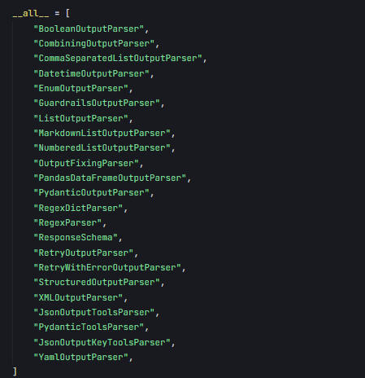
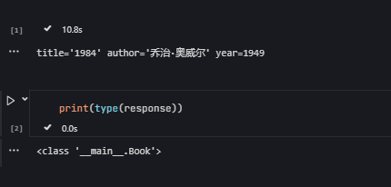
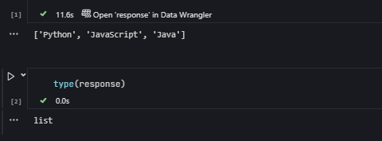

---

### 什么是 Output Parsers？
在 LangChain 中，输出解析器（Output Parsers）是用于将语言模型（LLM）的原始文本输出转换为结构化数据的工具。LLM 的输出通常是自由文本，可能是自然语言句子、JSON 字符串或列表等，而输出解析器的作用是提取这些输出的关键信息，并将其转换为程序友好的格式（如 Python 对象、字典或列表）。

#### 为什么需要 Output Parsers？
- **结构化需求**：应用程序可能需要特定格式的数据（例如 JSON、对象），而不是纯文本。
- **一致性**：确保 LLM 输出符合预期格式，避免手动解析的麻烦。
- **自动化**：简化从 LLM 输出到下游处理的流程。

---

### Output Parsers 在 LangChain 中的位置
输出解析器通常与提示模板（`PromptTemplate`）和 LLM 一起使用，形成一个链（Chain）。链的典型结构是：
```
PromptTemplate → LLM → OutputParser
```
- **PromptTemplate**：定义输入和输出格式要求。
- **LLM**：生成原始文本响应。
- **OutputParser**：将文本解析为结构化数据。

---

### 内置 Output Parsers 类型
`langchain_core.output_parsers` 提供了多种解析器，以下是主要类型及其用途：

#### 1. **`StrOutputParser`**
- **用途**：将 LLM 输出作为纯字符串返回，不做任何结构化处理。
- **适用场景**：只需要原始文本，不需要进一步解析时。
- **特点**：最简单，无需格式化指令。

#### 2. **`JsonOutputParser`**
- **用途**：将 LLM 输出解析为 JSON 对象（Python 字典）。
- **适用场景**：需要结构化数据（如键值对）时。
- **特点**：要求 LLM 输出有效的 JSON 字符串。

#### 3. **`PydanticOutputParser`**
- **用途**：将 LLM 输出解析为 Pydantic 模型（强类型对象）。
- **适用场景**：需要类型安全和复杂数据结构时。
- **特点**：依赖 Pydantic，提供字段验证和描述。

#### 4. **`CommaSeparatedListOutputParser`**
- **用途**：将逗号分隔的文本解析为 Python 列表。
- **适用场景**：需要从 LLM 获取简单列表时。
- **特点**：轻量，专注于单一格式。

#### 5. **`BaseOutputParser`**
- **用途**：自定义解析器的基类。
- **适用场景**：内置解析器无法满足需求时。
- **特点**：需要实现 `parse` 方法。


#### 解析错误重试


- **核心功能**：在解析失败时，多次尝试让 LLM 修正输出。
- **依赖**：需要一个基础解析器（如 `JsonOutputParser`）和 LLM。
- **适用场景**：当 LLM 输出不稳定或格式要求严格时。


**示例： 解析输出**

以下是一个完整的代码示例，展示如何确保 LLM 输出有效的 JSON。

```python
from langchain_openai import ChatOpenAI
from langchain_core.prompts import PromptTemplate
from langchain_core.output_parsers import PydanticOutputParser
from langchain_core.runnables import RunnableSequence
from pydantic import BaseModel, Field
import os
from dotenv import load_dotenv
import asyncio

# 加载环境变量
load_dotenv()
model = os.getenv("model")
api_key = os.getenv("api_key")
base_url = os.getenv("base_url")

# 初始化 LLM
llm = ChatOpenAI(
    model=model,
    api_key=api_key,
    base_url=base_url,
    streaming=True
)

# 定义输出结构使用 Pydantic
class ParseResult(BaseModel):
    result: str = Field(description="解析出的参数结果")

# 创建输出解析器
output_parser = PydanticOutputParser(pydantic_object=ParseResult)

# 创建提示模板
prompt_template = PromptTemplate.from_template(
    "请解析以下输入并返回结果：{input}\n\n返回格式：\n{format_instructions}",
    partial_variables={"format_instructions": output_parser.get_format_instructions()}
)

# 创建可运行序列
# chain = RunnableSequence(
#     prompt_template,
#     llm,
#     output_parser
# )
chain = prompt_template | llm | output_parser

# 输入数据
user_input = "提取这句话中的动词：'我喜欢跑步和游泳'"

async def run_parsing():
    max_attempts = 3
    
    for attempt in range(max_attempts):
        try:
            # 使用 invoke 方法运行链
            result = await chain.ainvoke({"input": user_input})
            
            print(f"第 {attempt + 1} 次尝试成功")
            print(f"解析结果: {result.model_dump()}")  # 将Pydantic 模型转换为 Python 字典
            return result
            
        except Exception as e:
            print(f"第 {attempt + 1} 次尝试失败，错误: {e}")
            if attempt < max_attempts - 1:
                print("正在重试...")
            else:
                print("已达到最大尝试次数")
                try:
                    result = await chain.ainvoke(
                        {"input": user_input},
                        config={"max_retries": 1}
                    )
                    print(f"最终修复结果: {result.model_dump()}")  # 使用 model_dump() 替代 dict()
                    return result
                except Exception as final_error:
                    print(f"最终尝试失败，错误: {final_error}")
                    return None

# 在已有事件循环中运行
async def main():
    await run_parsing()

# 如果在已有的事件循环中（比如 Jupyter），直接运行
if asyncio.get_event_loop().is_running():
    await main()  # 在已有循环中运行
else:
    # 如果不在事件循环中，使用 asyncio.run()
    asyncio.run(main())
```

**输出示例**：
```
解析结果： {'result': '喜欢,跑步,游泳'}
```


---

### 详细使用示例

#### 示例 1：StrOutputParser
最简单的解析器，直接返回字符串。

```python
from langchain_core.prompts import PromptTemplate
from langchain_core.output_parsers import StrOutputParser
from langchain_openai import ChatOpenAI
import os
from dotenv import load_dotenv
load_dotenv()
model = os.getenv("model")
api_key = os.getenv("api_key")
base_url = os.getenv("base_url")


prompt = PromptTemplate(template="今天是星期几？（假设今天是 2025 年 3 月 16 日）")
llm = ChatOpenAI(model=model, api_key=api_key,base_url=base_url,streaming=True)
parser = StrOutputParser()

chain = prompt | llm | parser
response = chain.invoke({})
print(response)
```

**输出**：
```
今天是星期日。
```

**说明**：
- 无需额外格式化，适合简单问答。

---

#### 示例 2：JsonOutputParser
解析 JSON 格式的输出。

```python
from langchain_core.prompts import PromptTemplate
from langchain_core.output_parsers import JsonOutputParser
from langchain_openai import ChatOpenAI
import os
from dotenv import load_dotenv
load_dotenv()
model = os.getenv("model")
api_key = os.getenv("api_key")
base_url = os.getenv("base_url")

parser = JsonOutputParser()
prompt = PromptTemplate(
    template="以 JSON 格式返回两种水果及其颜色。\n{format_instructions}",
    partial_variables={"format_instructions": parser.get_format_instructions()}
)

llm = ChatOpenAI(model=model, api_key=api_key,base_url=base_url,streaming=True)

chain = prompt | llm | parser
response = chain.invoke({})
print(response)

```

**输出**：
```
{'apple': 'red', 'banana': 'yellow'}
```

**说明**：
- `get_format_instructions()` 自动生成提示，告诉 LLM 输出 JSON。
- 如果 LLM 输出不是有效 JSON，会抛出异常。

---

#### 示例 3：PydanticOutputParser
使用 Pydantic 模型解析结构化数据。

```python
from langchain_core.prompts import PromptTemplate
from langchain_core.output_parsers import PydanticOutputParser
from langchain_openai import ChatOpenAI
from pydantic import BaseModel, Field

# region chatmdoe
import os
from dotenv import load_dotenv
load_dotenv()
model = os.getenv("model")
api_key = os.getenv("api_key")
base_url = os.getenv("base_url")
llm = ChatOpenAI(model=model, api_key=api_key,base_url=base_url,streaming=True)
# endregion

class Book(BaseModel):
    title: str = Field(description="书名")
    author: str = Field(description="作者")
    year: int = Field(description="出版年份")

parser = PydanticOutputParser(pydantic_object=Book)
prompt = PromptTemplate(
    template="推荐一本书，并以指定格式返回。\n{format_instructions}\n推荐什么书？",
    input_variables=["question"],
    partial_variables={"format_instructions": parser.get_format_instructions()}
)

chain = prompt | llm | parser
response = chain.invoke({"question": "推荐什么书？"})
print(response) 
```

**输出**：
```
Book(title='《活着》', author='余华', year=1993)
```

**说明**：
- Pydantic 确保字段类型正确（如 `year` 必须是整数）。
- 格式化指令会嵌入提示中，指导 LLM 输出符合模型的 JSON。

实例：   




---

#### 示例 4：CommaSeparatedListOutputParser
解析逗号分隔的列表。

```python
from langchain_core.prompts import PromptTemplate
from langchain_core.output_parsers import CommaSeparatedListOutputParser
from langchain_openai import ChatOpenAI

# region chatmdoe
import os
from dotenv import load_dotenv
load_dotenv()
model = os.getenv("model")
api_key = os.getenv("api_key")
base_url = os.getenv("base_url")
llm = ChatOpenAI(model=model, api_key=api_key,base_url=base_url,streaming=True)
# endregion

parser = CommaSeparatedListOutputParser()
prompt = PromptTemplate(
    template="列出三种编程语言，用逗号分隔。\n{format_instructions}",
    partial_variables={"format_instructions": parser.get_format_instructions()}
)

chain = prompt | llm | parser
response = chain.invoke({})
print(response) # type： list

```

**输出**：
```
['Python', 'Java', 'C++']
```

**说明**：
- 要求 LLM 输出形如 "Python, Java, C++" 的字符串。


实例：



---

#### 示例 5：自定义解析器
当内置解析器不够用时，可以自定义。

```python
from langchain_core.prompts import PromptTemplate
from langchain_core.output_parsers import BaseOutputParser
from langchain_openai import ChatOpenAI

class SemicolonListParser(BaseOutputParser):
    def parse(self, text: str) -> list:
        return [item.strip() for item in text.split(";")]

parser = SemicolonListParser()
prompt = PromptTemplate(template="列出三种城市，用分号分隔，例如：北京;上海;广州")
llm = ChatOpenAI(model="gpt-3.5-turbo", api_key="your-openai-api-key")
chain = prompt | llm | parser
response = chain.invoke({})
print(response)
```

**输出**：
```
['北京', '上海', '广州']
```

**说明**：
- 继承 `BaseOutputParser`，实现 `parse` 方法即可。
- 灵活性高，适用于特殊分隔符或格式。

---

### 高级功能与技巧

#### 1. **格式化指令（get_format_instructions）**
大多数解析器（如 `PydanticOutputParser` 和 `JsonOutputParser`）提供 `get_format_instructions()` 方法，生成提示中嵌入的格式说明。例如：
```
Please provide your response in the following JSON format:
{
  "title": "string",
  "author": "string",
  "year": "integer"
}
```

- **作用**：明确告诉 LLM 如何格式化输出。
- **技巧**：如果 LLM 不遵守格式，可以在提示中重复强调，或降低 `temperature` 参数。

#### 2. **错误处理**
LLM 可能不总是生成符合预期的输出。建议添加错误处理：

```python
try:
    response = chain.invoke({})
    print(response)
except Exception as e:
    print(f"解析失败：{e}")
    # 可选：使用 StrOutputParser 检查原始输出
    raw_chain = prompt | llm | StrOutputParser()
    raw_output = raw_chain.invoke({})
    print(f"原始输出：{raw_output}")
```

#### 3. **调试与优化**
- **调试**：先用 `StrOutputParser` 检查 LLM 输出，确认问题出在 LLM 还是解析器。
- **优化提示**：在提示中明确格式要求，如 "严格按照 JSON 格式返回，不要添加额外说明"。

---

### 使用场景
| 解析器类型                | 典型场景                          |
|--------------------------|----------------------------------|
| `StrOutputParser`        | 简单问答、文本生成               |
| `JsonOutputParser`       | API 返回数据、键值对提取         |
| `PydanticOutputParser`   | 数据验证、复杂对象处理           |
| `CommaSeparatedListOutputParser` | 列表提取（如选项、标签） |
| 自定义解析器             | 特殊格式（如分号分隔、表格解析） |

---

### 总结
LangChain 的 `output_parsers` 是构建智能应用的关键组件，通过将 LLM 的自由文本转换为结构化数据，极大提升了自动化和可编程性。核心要点：
- **内置解析器**：满足大多数需求，从简单字符串到复杂对象。
- **自定义能力**：通过 `BaseOutputParser` 扩展特殊场景。
- **与提示结合**：格式化指令是确保成功的关键。

