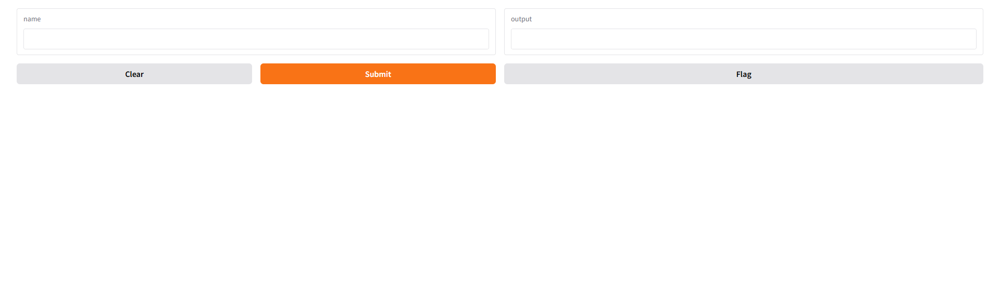

### 快速入门

```py
import gradio as gr
#输入文本处理程序
def greet(name):
    return "Hello " + name + "!"
#接口创建函数
#fn设置处理函数，inputs设置输入接口组件，outputs设置输出接口组件
#fn,inputs,outputs都是必填函数
demo = gr.Interface(fn=greet, inputs="text", outputs="text")
demo.launch()
```


