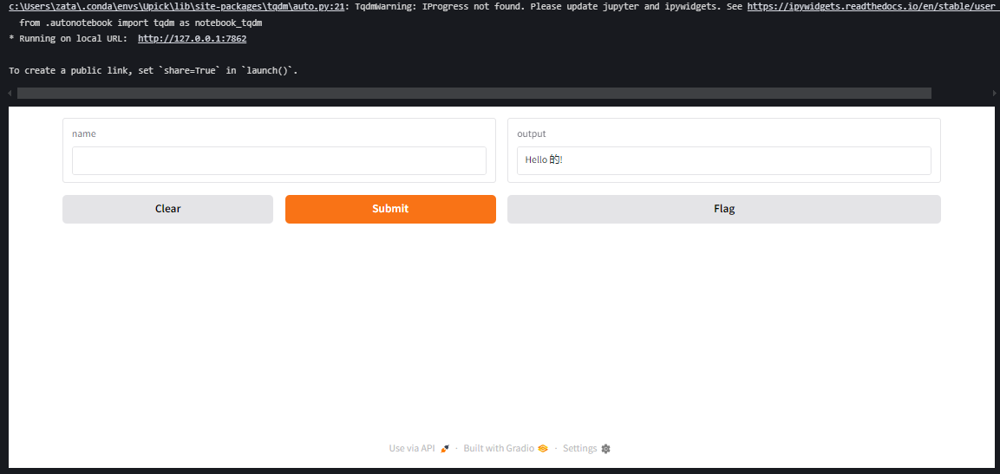
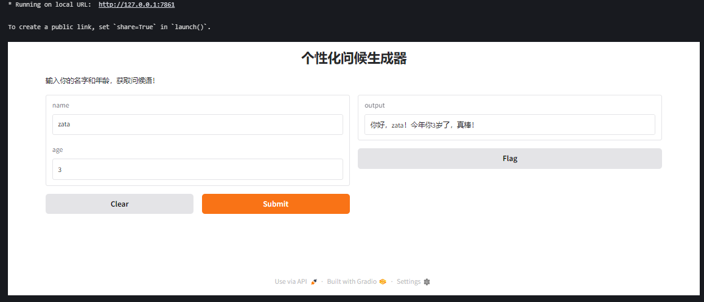
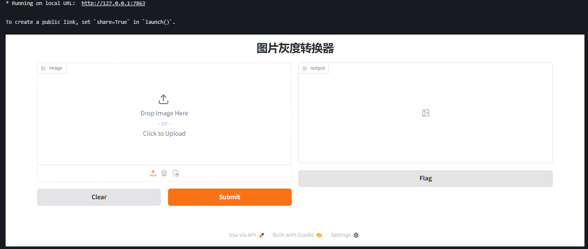
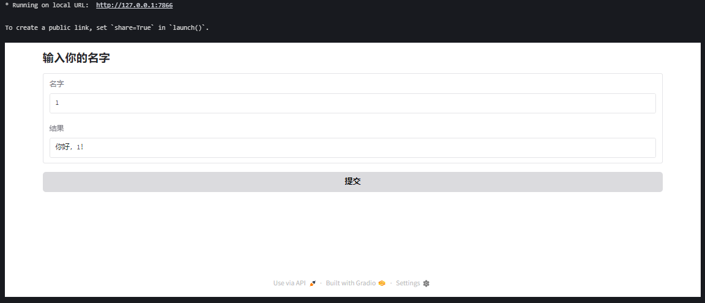
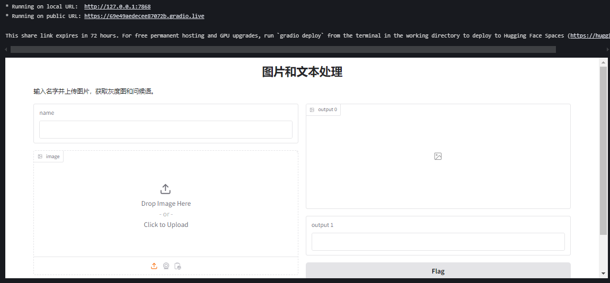
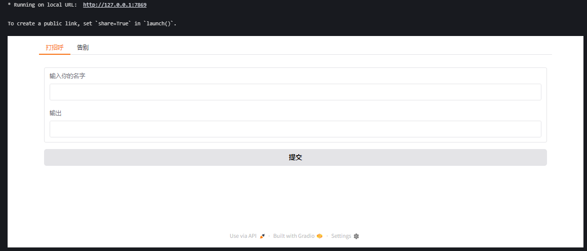
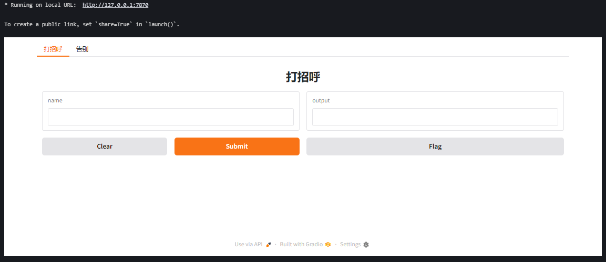
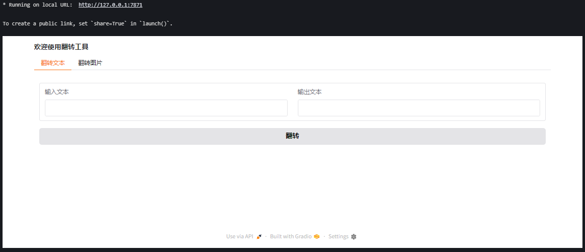

## Gradio 教程

代码地址：

https://github.com/zata-zhangtao/Zata-AI-Agent-code/blob/main/04-gradio/01-start/01-sample_example.ipynb

参考文档

https://www.gradio.app/guides/the-interface-class


---

### 1. 安装 Gradio
首先，确保你有 Python 环境，然后在终端运行以下命令安装 Gradio：
```bash
pip install gradio
```

---

### 2. 基本示例
让我们从一个简单的例子开始：创建一个界面，用户输入名字，程序返回问候语。
```py
import gradio as gr
#输入文本处理程序
def greet(name):
    return "Hello " + name + "!"
#接口创建函数
#fn设置处理函数，inputs设置输入接口组件，outputs设置输出接口组件
#fn,inputs,outputs都是必填函数
demo = gr.Interface(fn=greet, inputs="text", outputs="text")
demo.launch()
```

运行代码后，Gradio 会生成一个本地 Web 界面（通常在 `http://127.0.0.1:7860`），你可以在浏览器中输入名字并看到结果。



---

### 3. 界面参数说明
- `fn`: 要展示的核心函数（例如 `greet`）。
- `inputs`: 输入组件类型（如 `"text"`, `"image"`, `"audio"` 等）。
- `outputs`: 输出组件类型（如 `"text"`, `"image"`, `"label"` 等）。
- `launch()`: 启动界面，可以通过参数设置是否公开。

#### 常用输入和输出类型
- `"text"`: 文本框
- `"image"`: 图片上传或显示
- `"audio"`: 音频输入或输出
- `"video"`: 视频输入或输出
- `"dataframe"`: 数据表格

---

### 4. 进阶示例：处理多种输入
假设我们想创建一个函数，接收名字和年龄，返回个性化的消息：

```python
import gradio as gr

def greet(name, age):
    return f"你好，{name}！今年你{age}岁了，真棒！"

interface = gr.Interface(
    fn=greet,
    inputs=["text", "number"],  # 多个输入
    outputs="text",
    title="个性化问候生成器",  # 添加标题
    description="输入你的名字和年龄，获取问候语！"  # 添加描述
)

interface.launch()
```

运行后，你会看到一个有两个输入框的界面：一个文本框输入名字，一个数字框输入年龄。



---

### 5. 处理图片输入和输出
假设我们要创建一个简单的图像处理函数，将上传的图片转为灰度：

```python
import gradio as gr
from PIL import Image

def grayscale_image(image):
    return image.convert("L")  # 转换为灰度图

interface = gr.Interface(
    fn=grayscale_image,
    inputs="image",  # 上传图片
    outputs="image",  # 输出图片
    title="图片灰度转换器"
)

interface.launch()
```

用户可以上传图片，界面会返回灰度版本。



---

### 6. 自定义界面布局
如果需要更复杂的布局，可以使用 `gr.Blocks`：

```python
import gradio as gr

def greet(name):
    return f"你好，{name}！"

with gr.Blocks(title="自定义问候界面") as demo:
    gr.Markdown("## 输入你的名字")
    name_input = gr.Textbox(label="名字")
    output = gr.Textbox(label="结果")
    button = gr.Button("提交")
    button.click(fn=greet, inputs=name_input, outputs=output)

demo.launch()
```

`Blocks` 允许你自由组合组件，比如按钮、文本框、图片等。



---

### 7. 分享到公网
默认情况下，Gradio 界面只运行在本地。如果你想分享给别人，可以设置 `share=True`：
```python
interface.launch(share=True)
```
这会生成一个临时的公共链接（有效期通常为 72 小时）。

---

### 8. 常见问题
- **如何调试？** 添加 `debug=True` 参数到 `launch()`，会在终端显示详细日志：
  ```python
  interface.launch(debug=True)
  ```
- **如何保存用户输入？** 在函数中处理输入并保存到文件或数据库。
- **如何运行在特定端口？** 使用 `server_port` 参数：
  ```python
  interface.launch(server_port=8080)
  ```

---

### 9. 完整示例：带图片和文本的复杂界面
```python
import gradio as gr
from PIL import Image

def process_input(name, image):
    grayscale_img = image.convert("L")
    message = f"你好，{name}！这是你的灰度图片。"
    return grayscale_img, message

interface = gr.Interface(
    fn=process_input,
    inputs=["text", "image"],
    outputs=["image", "text"],
    title="图片和文本处理",
    description="输入名字并上传图片，获取灰度图和问候语。"
)

interface.launch(share=True)
```



---

### 10. 带有tab的界面

```python
import gradio as gr

# 定义两个简单的函数，分别用于不同的选项卡
def greet(name):
    return f"你好，{name}！"

def farewell(name):
    return f"再见，{name}！"

# 使用 Blocks 创建界面
with gr.Blocks() as demo:
    # 创建 Tabs 容器
    with gr.Tabs():
        # 第一个选项卡：打招呼
        with gr.TabItem("打招呼"):
            name_input_1 = gr.Textbox(label="输入你的名字")
            greet_output = gr.Textbox(label="输出")
            greet_button = gr.Button("提交")
            greet_button.click(fn=greet, inputs=name_input_1, outputs=greet_output)

        # 第二个选项卡：告别
        with gr.TabItem("告别"):
            name_input_2 = gr.Textbox(label="输入你的名字")
            farewell_output = gr.Textbox(label="输出")
            farewell_button = gr.Button("提交")
            farewell_button.click(fn=farewell, inputs=name_input_2, outputs=farewell_output)

# 启动应用
demo.launch()
```

gr.Blocks()：创建一个灵活的界面容器。   
gr.Tabs()：定义一个选项卡组。   
gr.TabItem("标签名")：定义单个选项卡，标签名会显示在界面上。   
每个选项卡内可以放置输入组件（如 Textbox）、输出组件和事件（如按钮点击）。   
运行这段代码后，你会看到一个带有“打招呼”和“告别”两个选项卡的界面。点击每个选项卡，可以切换到对应的功能。   



### 11. 使用 gr.TabbedInterface 组合多个界面
```python
import gradio as gr

# 定义两个函数
def greet(name):
    return f"你好，{name}！"

def farewell(name):
    return f"再见，{name}！"

# 创建两个独立的 Interface
interface1 = gr.Interface(fn=greet, inputs="text", outputs="text", title="打招呼")
interface2 = gr.Interface(fn=farewell, inputs="text", outputs="text", title="告别")

# 使用 TabbedInterface 组合
demo = gr.TabbedInterface(
    [interface1, interface2],  # 接口列表
    ["打招呼", "告别"]        # 选项卡名称列表
)

# 启动应用
demo.launch()
```
代码说明：   

gr.TabbedInterface 接受两个主要参数：   
第一个参数是一个 Interface 对象列表。   
第二个参数是选项卡名称的列表，与 Interface 顺序对应。   
这种方法适合快速组合已有的界面，但灵活性不如 Blocks。   




---

### 12.  高级布局：结合 Row 和 Column

```python
import gradio as gr
import numpy as np

# 定义翻转文本和图片的函数
def flip_text(text):
    return text[::-1]

def flip_image(image):
    return np.fliplr(image)

# 使用 Blocks 创建界面
with gr.Blocks(title="翻转工具") as demo:
    gr.Markdown("### 欢迎使用翻转工具")
    with gr.Tabs():
        # 文本翻转选项卡
        with gr.TabItem("翻转文本"):
            with gr.Row():
                text_input = gr.Textbox(label="输入文本")
                text_output = gr.Textbox(label="输出文本")
            text_button = gr.Button("翻转")
            text_button.click(fn=flip_text, inputs=text_input, outputs=text_output)

        # 图片翻转选项卡
        with gr.TabItem("翻转图片"):
            with gr.Row():
                image_input = gr.Image(label="上传图片", type="numpy")
                image_output = gr.Image(label="输出图片")
            image_button = gr.Button("翻转")
            image_button.click(fn=flip_image, inputs=image_input, outputs=image_output)

# 启动应用
demo.launch()
```


代码说明：   

gr.Row()：将组件水平排列。   
gr.Column()：将组件垂直排列（默认布局）。   
这个例子展示了一个文本翻转和图片翻转的工具，每个功能在单独的选项卡中。





### 总结
Gradio 的核心优势在于简单易用，适合快速展示和测试功能。你可以根据需求扩展功能，比如集成机器学习模型、处理音频视频、或设计复杂布局。如果有具体问题或想深入某个功能，可以告诉我，我再详细讲解！