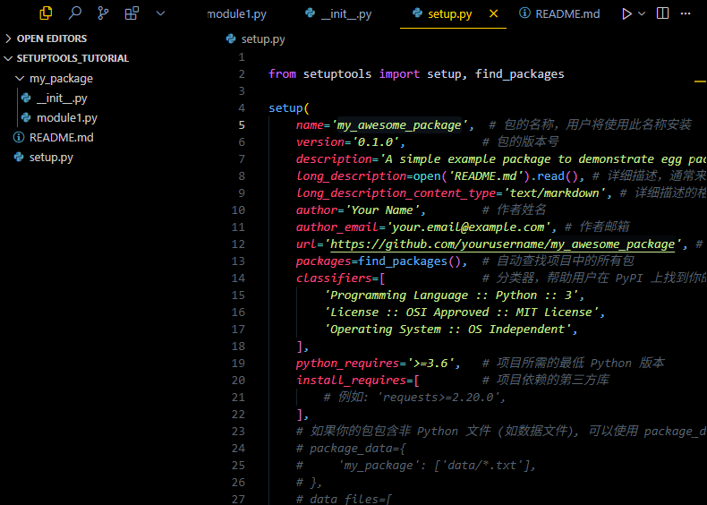
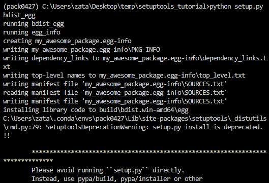
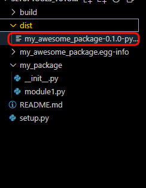
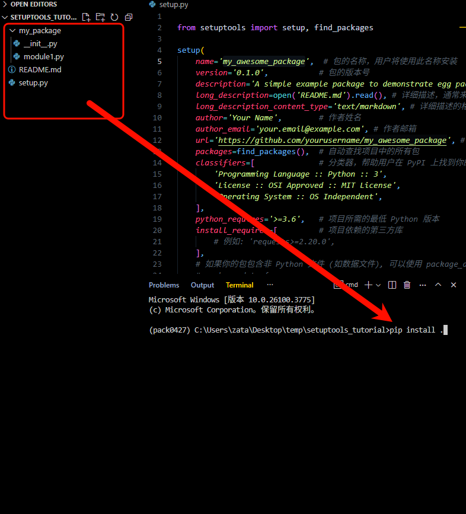

这是一个使用 `setuptools` 将 Python 项目打包为 `.egg` 文件的详细教程，包含源代码示例。

---

**请注意：** `.egg` 格式是较旧的 Python 分发格式。目前更推荐使用 `.whl` (Wheel) 格式，它在安装速度和兼容性方面有优势。然而，如果你确实需要创建 `.egg` 文件（例如，为了兼容旧系统或特定工具），可以按照以下步骤进行。

## **简易教程1：使用 setuptools 打包 Python 项目为 Egg**

### **1. 项目结构**

首先，你需要一个标准的 Python 项目结构。一个典型的结构如下所示：

```
my_package/
├── my_package/
│   ├── __init__.py
│   └── module1.py
├── setup.py
├── README.md
└── LICENSE
```

* `my_package/`: 这是你的实际 Python 包目录，其中包含你的模块和代码。
* `my_package/__init__.py`: 这个文件使 `my_package` 成为一个 Python 包。它可以是空的，也可以包含包的初始化代码。
* `my_package/module1.py`: 这是一个示例模块文件，包含你的项目代码。
* `setup.py`: 这是 `setuptools` 的配置文件，用于描述你的项目以及如何打包。
* `README.md`: 项目的说明文件（推荐）。
* `LICENSE`: 项目的许可证文件（推荐）。

### **2. 创建示例项目代码**

在 `my_package/module1.py` 中添加一些示例代码：

```python
# my_package/module1.py

def greet(name):
    """
    一个简单的问候函数。
    """
    return f"Hello, {name}!"

def farewell(name):
    """
    一个简单的告别函数。
    """
    return f"Goodbye, {name}!"
```

在 `my_package/__init__.py` 中，你可以选择导入 `module1` 中的函数，以便用户可以直接从 `my_package` 导入它们：

```python
# my_package/__init__.py

from .module1 import greet, farewell

__version__ = "0.1.0" # 添加一个版本号
```


### **3. 创建 setup.py 文件**

`setup.py` 文件是使用 `setuptools` 打包项目的核心。它包含了项目的元数据和打包指令。

```python
# setup.py

from setuptools import setup, find_packages

setup(
    name='my_awesome_package',  # 包的名称，用户将使用此名称安装
    version='0.1.0',           # 包的版本号
    description='A simple example package to demonstrate egg packaging', # 包的简短描述
    long_description=open('README.md').read(), # 详细描述，通常来自 README 文件
    long_description_content_type='text/markdown', # 详细描述的格式
    author='Your Name',        # 作者姓名
    author_email='your.email@example.com', # 作者邮箱
    url='https://github.com/yourusername/my_awesome_package', # 项目主页或其他 URL
    packages=find_packages(),  # 自动查找项目中的所有包
    classifiers=[              # 分类器，帮助用户在 PyPI 上找到你的包
        'Programming Language :: Python :: 3',
        'License :: OSI Approved :: MIT License',
        'Operating System :: OS Independent',
    ],
    python_requires='>=3.6',   # 项目所需的最低 Python 版本
    install_requires=[         # 项目依赖的第三方库
        # 例如: 'requests>=2.20.0',
    ],
    # 如果你的包包含非 Python 文件 (如数据文件), 可以使用 package_data 或 data_files
    # package_data={
    #     'my_package': ['data/*.txt'],
    # },
    # data_files=[
    #     ('my_data', ['data/my_data.csv']),
    # ],

    # 定义命令行脚本 (可选)
    # entry_points={
    #     'console_scripts': [
    #         'my_script = my_package.module1:greet', # 这里的 greet 是一个可执行函数
    #     ],
    # },

    # 设置为 True 以便生成 egg 文件
    zip_safe=True,
)
```

**`setup()` 函数参数说明：**

* `name`: 你的包的名称。这是用户在安装时使用的名称（例如 `pip install my_awesome_package`）。
* `version`: 包的版本号。遵循 [Semantic Versioning](https://semver.org/) 是一个好习惯。
* `description`: 包的简短描述。
* `long_description`: 包的详细描述，通常从 README 文件中读取。
* `long_description_content_type`: 详细描述的格式，例如 `'text/markdown'`。
* `author` 和 `author_email`: 作者的信息。
* `url`: 项目的主页或代码仓库地址。
* `packages`: 一个列表，列出项目包含的所有 Python 包。`find_packages()` 函数会自动查找当前目录下的所有包（包含 `__init__.py` 的目录）。
* `classifiers`: 一个列表，包含描述你的项目的分类器。这些分类器有助于用户在 PyPI (Python Package Index) 上搜索和过滤包。你可以在 [PyPI Classifiers](https://pypi.org/classifiers/) 找到完整的列表。
* `python_requires`: 指定项目兼容的 Python 版本范围。
* `install_requires`: 一个列表，列出项目运行时依赖的第三方库。`setuptools` 会在安装你的包时自动安装这些依赖。
* `package_data`: 用于包含包内部的非 Python 文件，例如数据文件、模板等。键是包名，值是文件路径模式的列表。
* `data_files`: 用于安装不在包内部的文件到指定位置。这在打包可执行脚本或配置文件时很有用。它是一个包含 `(destination, files)` 元组的列表。
* `entry_points`: 用于定义控制台脚本或其他入口点。这允许你在安装包后直接从命令行运行某个函数。
* `zip_safe`: 如果设置为 `True` (默认值)，`setuptools` 会尝试将包打包成一个 ZIP 文件 (即 `.egg`)。如果你的包需要在安装后从 ZIP 文件中导入模块，并且你没有使用 `pkg_resources.resource_filename()` 等方法访问包内的文件，通常可以设置为 `True`。如果你的包需要访问包内的非 Python 文件或有特定的加载需求，可能需要设置为 `False`，这样包会以目录的形式安装。





### **4. 生成 Egg 文件**

在包含 `setup.py` 文件的项目根目录下，打开终端或命令行，运行以下命令：

```bash
python setup.py bdist_egg
```

执行此命令后，`setuptools` 会开始构建过程。成功后，你会在项目根目录下找到一个名为 `dist/` 的目录。在该目录中，你会找到生成的 `.egg` 文件，其名称类似于 `my_awesome_package-0.1.0-py3.x.egg` (其中 `py3.x` 表示 Python 版本)。








### **5. 安装和使用 Egg 文件**

你可以使用 `easy_install` 工具来安装 `.egg` 文件（`easy_install` 是 `setuptools` 自带的安装工具）：

```bash
easy_install dist/my_awesome_package-0.1.0-py3.x.egg
```

或者，你也可以直接将 `.egg` 文件放置在 Python 的 `sys.path` 中，Python 就可以直接从中导入模块。

安装后，你就可以像安装其他 Python 包一样导入和使用你的模块了：

```python
# 在 Python 交互式环境中或另一个脚本中
from my_package import greet, farewell

print(greet("World"))
print(farewell("User"))
```

**注意事项和 Egg 的局限性：**

* **兼容性问题：** Egg 文件可能在不同的操作系统、Python 版本或架构上存在兼容性问题，尤其当你的项目包含编译后的扩展模块时。
* **安装复杂性：** 相比 Wheel，Egg 的安装通常涉及更多的运行时解压和处理，可能导致安装速度较慢。
* **不推荐用于新项目：** 如前所述，对于新的 Python 项目，强烈建议使用 Wheel 格式进行分发。Wheel 解决了 Egg 的许多缺点，提供了更好的兼容性、更快的安装速度和更简单的结构。
* **`zip_safe=True` 的影响：** 当 `zip_safe` 为 `True` 时，包会被打包到 ZIP 文件中。如果你的代码需要通过文件路径访问包内部的资源（而不是使用 `pkg_resources` 或 `importlib.resources`），可能会出现问题。设置为 `False` 会将包安装为目录，避免这个问题。


### **6. 如果不打包egg文件也可以直接安装**


如果第3步做好了，实际上就已经可以直接安装，在setup.py的同级目录下运行pip install .





**总结**

通过创建 `setup.py` 文件并使用 `python setup.py bdist_egg` 命令，你可以使用 `setuptools` 将你的 Python 项目打包成 `.egg` 文件。虽然 Egg 格式在过去很常用，但现在 Wheel 格式已成为首选。在开发新的 Python 包时，优先考虑使用 Wheel 进行分发。如果你需要为旧系统或特定需求创建 Egg 文件，本教程提供了详细的步骤和示例代码。