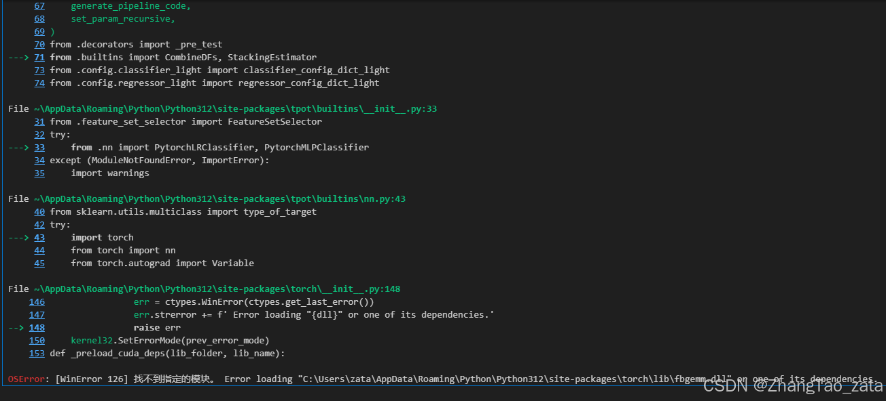
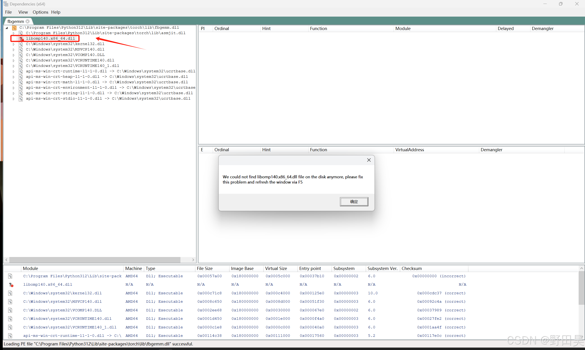

## 一些问题和解决方案

#### 在使用torch、或者任何涉及到torch的库中，只要导入torch就会报错

- 解决方案
    https://blog.csdn.net/Changxing_J/article/details/140489278
    https://blog.csdn.net/weixin_43591849/article/details/140715890（最终这个解决）

    下载Dependencies

    [下载地址](https://github.com/lucasg/Dependencies/tree/v1.11.1)

    下载完成并解压，启动DependenciesGui.exe

    找到报错的dll的位置，在DependenciesGui.exe中的file→open打开dll的位置，我出现的问题如下
    
    

    缺少libomp140.x86_64.dll。解决方法：在https://www.dllme.com/dll/files/libomp140_x86_64#google_vignette 下载某一个版本的dll文件，放到C:\Windows\System32中。

    问题解决！

    如果是缺少vcomp140.dll文件可以参考https://blog.csdn.net/Changxing_J/article/details/140489278