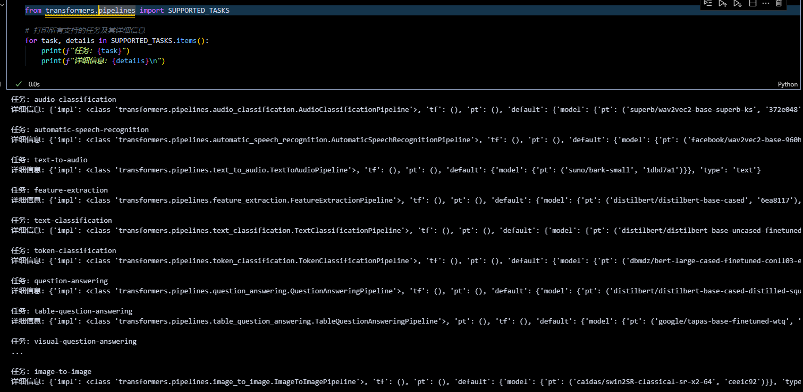

# Hugging Face `transformers.pipeline` 教程

`pipeline` 是 Hugging Face `transformers` 库提供的高层次接口，可以快速调用预训练模型完成 NLP、图像处理等任务。本教程将带你从基础用法到进阶技巧全面掌握 `pipeline`。


---

## 1. 查看支持的任务类型

`pipeline` 支持多种任务，可以通过 `SUPPORTED_TASKS` 查看：

```python
from transformers.pipelines import SUPPORTED_TASKS

# 打印所有支持的任务及其详细信息
for task, details in SUPPORTED_TASKS.items():
    print(f"任务: {task}")
    print(f"详细信息: {details}\n")
```



**常见任务示例**：
- `text-classification`：文本分类（如情感分析）
- `text-generation`：文本生成
- `question-answering`：问答
- `zero-shot-object-detection`：零样本目标检测

完整列表请参考 [官方文档](https://huggingface.co/docs/transformers/main_classes/pipelines)。

---

## 2. 创建与使用 `pipeline`

### 2.1 直接根据任务类型创建（默认模型）
默认使用英文模型，适合快速上手：

```python
from transformers import pipeline

# 创建文本分类 pipeline
pipe = pipeline("text-classification")

# 输入文本列表
results = pipe(["very good!", "very bad!"])
print(results)
```

**输出**：
```
[{'label': 'POSITIVE', 'score': 0.9998}, {'label': 'NEGATIVE', 'score': 0.9987}]
```

### 2.2 指定任务和模型
选择特定模型（如中文模型）以适配需求：

```python
# 使用中文情感分析模型
pipe = pipeline("text-classification", model="uer/roberta-base-finetuned-dianping-chinese")

# 分析中文文本
result = pipe("我觉得不太行！")
print(result)
```

**输出**：
```
[{'label': 'negative', 'score': 0.987}]
```

**模型选择**：可在 [Hugging Face Model Hub](https://huggingface.co/models) 搜索适合的模型。

### 2.3 预加载模型和分词器
更灵活的方式，先加载模型和分词器，再创建 `pipeline`：

```python
from transformers import AutoModelForSequenceClassification, AutoTokenizer

# 加载模型和分词器
model = AutoModelForSequenceClassification.from_pretrained("uer/roberta-base-finetuned-dianping-chinese")
tokenizer = AutoTokenizer.from_pretrained("uer/roberta-base-finetuned-dianping-chinese")

# 创建 pipeline
pipe = pipeline("text-classification", model=model, tokenizer=tokenizer)

# 使用
result = pipe("我觉得不太行！")
print(result)
```

**输出**：
```
Device set to use cpu
[{'label': 'negative (stars 1, 2 and 3)', 'score': 0.9735506772994995}]
```

---

## 3. 性能优化：使用 GPU 推理

默认情况下，`pipeline` 使用 CPU。可以通过 `device` 参数切换到 GPU：

```python
# 指定 device=0 使用第一个 GPU
pipe = pipeline("text-classification", model="uer/roberta-base-finetuned-dianping-chinese", device=0)

# 检查模型运行设备
print(pipe.model.device)  # 输出: cuda:0

# 测试推理速度
import torch
import time

times = []
for _ in range(100):
    torch.cuda.synchronize()  # 同步 GPU
    start = time.time()
    pipe("我觉得不太行！")
    torch.cuda.synchronize()
    end = time.time()
    times.append(end - start)

print(f"平均推理时间: {sum(times) / 100:.4f} 秒")
```

**对比**：在 CPU 上运行相同代码（`device=-1`），GPU 通常显著更快。

---

## 4. 参数调整与高级用法

### 4.1 问答任务示例
调整参数以控制输出：

```python
qa_pipe = pipeline("question-answering", model="uer/roberta-base-chinese-extractive-qa")

# 输入问题和上下文
result = qa_pipe(
    question="中国的首都是哪里？",
    context="中国的首都是北京",
    max_answer_len=5  # 限制答案长度
)
print(result)
```

**输出**：
```
{'score': 0.99, 'start': 6, 'end': 8, 'answer': '北京'}
```

### 4.2 图像任务：零样本目标检测
处理图像任务需要额外依赖（如 `Pillow`）：

```python
from transformers import pipeline
from PIL import Image, ImageDraw
import requests

# 创建零样本目标检测 pipeline
detector = pipeline(model="google/owlvit-base-patch32", task="zero-shot-object-detection")

# 下载并打开图片
url = "https://unsplash.com/photos/oj0zeY2Ltk4/download?force=true&w=640"
img = Image.open(requests.get(url, stream=True).raw)

# 检测对象
predictions = detector(img, candidate_labels=["hat", "sunglasses", "book"])
print(predictions)

# 绘制结果
draw = ImageDraw.Draw(img)
for pred in predictions:
    box = pred["box"]
    draw.rectangle((box["xmin"], box["ymin"], box["xmax"], box["ymax"]), outline="red", width=1)
    draw.text((box["xmin"], box["ymin"]), f"{pred['label']}: {pred['score']:.2f}", fill="red")
img.show()  # 显示图片
```

---

## 5. `pipeline` 背后的实现

理解底层过程有助于调试和自定义：

```python
from transformers import AutoTokenizer, AutoModelForSequenceClassification
import torch

# 加载分词器和模型
tokenizer = AutoTokenizer.from_pretrained("uer/roberta-base-finetuned-dianping-chinese")
model = AutoModelForSequenceClassification.from_pretrained("uer/roberta-base-finetuned-dianping-chinese")

# 输入文本
input_text = "我觉得不太行！"
inputs = tokenizer(input_text, return_tensors="pt")  # 转换为张量

# 模型推理
outputs = model(**inputs)
logits = outputs.logits
probs = torch.softmax(logits, dim=-1)  # 转换为概率

# 获取预测结果
pred_id = torch.argmax(probs).item()
result = model.config.id2label[pred_id]  # 从 ID 映射到标签
print(f"预测结果: {result}")
```

**输出**：
```
预测结果: negative
```

**流程解析**：
1. **分词**：`tokenizer` 将文本转为模型可理解的输入。
2. **推理**：`model` 输出 logits（原始分数）。
3. **后处理**：通过 `softmax` 和 `argmax` 转换为标签。

---

## 6. 注意事项与技巧
- **模型下载**：首次运行会自动下载模型，需联网。
- **中文支持**：选择中文模型（如 `uer/roberta-base-chinese`）以提升效果。
- **参数调整**：如 `max_length`、`truncation=True` 可处理长文本。
- **硬件**：大型模型建议使用 GPU（检查 `torch.cuda.is_available()`）。

---

## 7. 结语
通过 `pipeline`，你可以快速实现从文本分类到图像检测的多种任务。如果需要更深入的定制，可以参考底层实现部分，或访问 [Hugging Face 文档](https://huggingface.co/docs/transformers)。

