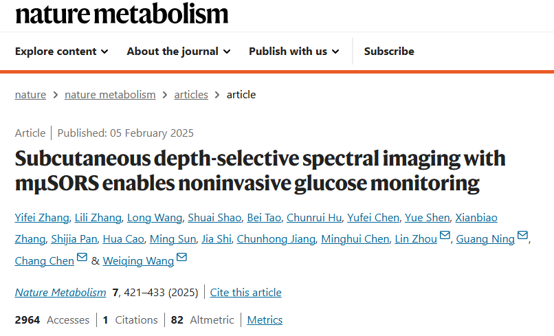

#
## Subcutaneous depth-selective spectral imaging with mμSORS enables noninvasive glucose monitoring

### 摘要

```text
Noninvasive blood glucose monitoring offers substantial advantages forpatients, but current technologies are often not sufficiently accurate for
clinical applications or require personalized calibration. Here we reportmultiple μ-spatially offset Raman spectroscopy, which captures Raman signals at varying skin depths, and show that it accurately detects bloodglucose levels in humans. In 35 individuals with or without type 2 diabetes,we first determine the optimal depth for glucose detection to be at orbelow the capillary-rich dermal–epidermal junction, where we observea strong correlation between specific Raman bands and venous plasmaglucose concentrations. In a second study, comprising 230 participants, we then improve accuracy of our regression model to reach a mean absolute relative difference of 14.6%, without personalized calibration, whereby 99.4% of calculated glucose values fall into clinically acceptable zones of the consensus error grid (zones A and B). These findings highlight the ability and robustness of multiple μ-spatially offset Raman spectroscopy for noninvasive blood glucose measurement in a clinical setting.
```

Noninvasive blood glucose monitoring offers substantial advantages for patients, but current technologies are often not sufficiently accurate for
clinical applications or require personalized calibration. 

非侵入式血糖监测为患者提供了显著的优势，但当前技术往往在临床应用中不够精确，或者需要个性化校准。

substantial 实质的
clinical applications 临床应用
personalized calibration 个性化校准
subcutaneous 皮下的


Here we report multiple μ-spatially offset Raman spectroscopy, which captures Raman signals at varying skin depths, and show that it accurately detects bloodglucose levels in humans. In 35 individuals with or without type 2 diabetes,we first determine the optimal depth for glucose detection to be at orbelow the capillary-rich dermal–epidermal junction, where we observea strong correlation between specific Raman bands and venous plasmaglucose concentrations. 

在此，我们报告了一种多重微空间偏移拉曼光谱技术，该技术能够捕获不同皮肤深度的拉曼信号，并证明其能够准确检测人体内的血糖水平。在35名有或无2型糖尿病的个体中，我们首先确定了检测葡萄糖的最佳深度为毛细血管丰富的真皮-表皮交界处或其下方，在此深度我们观察到特定拉曼光谱带与静脉血浆葡萄糖浓度之间存在强相关性。

In a second study, comprising 230 participants, we then improve accuracy of our regression model to reach a mean absolute relative difference of 14.6%, without personalized calibration, whereby 99.4% of calculated glucose values fall into clinically acceptable zones of the consensus error grid (zones A and B).

在第二项研究中，包括230名参与者，我们进一步提高了回归模型的准确性，使平均绝对相对差达到14.6%，无需个性化校准，其中99.4%的计算葡萄糖值落在共识误差网格的临床可接受区域（A区和B区）。

consensus error grid 共识误差网格


 These findings highlight the ability and robustness of multiple μ-spatially offset Raman spectroscopy for noninvasive blood glucose measurement in a clinical setting.
 这些发现突显了多重微空间偏移拉曼光谱技术在临床环境中进行非侵入式血糖测量的能力和稳健性。


### 引言

1. **Blood glucose monitoring is critical for health management, especially for the over 500 million people with diabetes worldwide.**
   血糖监测对健康管理至关重要，特别是对于全球超过5亿的糖尿病患者。

2. **Patients with diabetes typically receive recommendations to monitor their blood glucose level multiple times per day.**
   糖尿病患者通常被建议每天多次监测血糖水平。

3. **Nevertheless, conventional finger pricks induce pain and risk of infection, which thereby reduced the patients’ quality of life and their adherence to treatment.**
   然而，传统的指尖采血会引起疼痛和感染风险，从而降低了患者的生活质量和治疗依从性。

4. **More recently, minimally invasive continuous blood glucose monitoring technologies have been developed, utilizing indwelling sensors to measure glucose levels in interstitial compartments.**
   最近，微创持续血糖监测技术已经开发出来，利用植入式传感器测量间质液中的葡萄糖水平。

5. **However, these sensors require constant attachment to the user and cause inconvenience.**
   然而，这些传感器需要持续附着在用户身上，并带来不便。

6. **Hence, there remains a persistent need for practical solutions to noninvasive blood glucose monitoring.**
   因此，仍然迫切需要实用的非侵入性血糖监测解决方案。

7. **So far, the route to clinically applicable noninvasive blood glucose monitoring remains elusive.**
   到目前为止，临床上适用的非侵入性血糖监测方法仍未明确。

8. **Among the various approaches, including iontophoresis, transdermal impedance spectroscopy, photoacoustic spectroscopy and infrared spectroscopy, Raman spectroscopy is highly anticipated due to its direct identification of glucose molecules with high specificity by spectral information, along with its selectable wavelengths for deep penetration in human skin.**
   在众多方法中，包括离子电渗透、经皮阻抗光谱、光声光谱和红外光谱，拉曼光谱因其通过光谱信息直接高特异性地识别葡萄糖分子，以及其可选择波长以深入穿透人体皮肤而备受期待。

9. **Recently developed paraboloidal mirror Raman, confocal Raman and spatially offset Raman spectroscopy (SORS) have shown promising results for noninvasive blood glucose testing.**
   最近开发的抛物面镜拉曼、体视拉曼和空间偏移拉曼光谱（SORS）在非侵入性血糖测试中显示出令人期待的结果。

10. **However, these Raman spectroscopy methods require subject-specific training to build a proper mathematical model for each user, introducing additional procedures in practical applications.**
    然而，这些拉曼光谱方法需要针对每个用户进行特定训练以构建适当的数学模型，这在实际应用中引入了额外的程序。

11. **The main hindrance to higher robustness and accuracy in Raman spectroscopic measurements is the broad and strong fluorescence background signal from the skin surface.**
    拉曼光谱测量实现更高稳健性和准确性的主要障碍是皮肤表面广泛而强烈的荧光背景信号。

12. **Therefore, a Raman spectroscopy method to reduce the interference of the skin surface signal when capturing deeper glucose signals is imperative for clinically applicable noninvasive blood glucose monitoring.**
    因此，在捕获更深层葡萄糖信号时减少皮肤表面信号干扰的拉曼光谱方法，对于临床上适用的非侵入性血糖监测至关重要。

13. **In this work, we present multiple μ-spatially offset Raman spectroscopy (mμSORS), a technique capable of directly measuring Raman signals from both epidermal and dermal layers of human skin, and thus, potentially feasible for clinical noninvasive blood glucose monitoring.**
    在这项工作中，我们提出了多重微空间偏移拉曼光谱（mμSORS），这是一种能够直接测量人体皮肤表皮和真皮层拉曼信号的技术，因此可能适用于临床非侵入性血糖监测。

14. **Utilizing an optical probe with fibre layout at five different offsets, mμSORS realized depth-selective detection of Raman signals, with larger offsets capturing a higher proportion of signals from greater depths.**
    通过使用具有五种不同偏移的光纤布局的光学探头，mμSORS实现了拉曼信号的深度选择性检测，较大的偏移捕获了来自更深处更高比例的信号。

15. **We first conducted a preliminary basic experimental study with humans (BESH) involving 35 participants that demonstrated that in contrast to the Raman signal from the skin surface, the mμSORS signal from deeper layers, especially around or below the dermal–epidermal junction (DEJ), exhibits a statistically notable correlation of Raman glucose peaks to venous plasma glucose (VPG) levels.**
    我们首先进行了一项涉及35名参与者的人体初步基础实验研究（BESH），结果表明，与皮肤表面的拉曼信号相比，来自更深层（特别是真皮-表皮交界处（DEJ）附近或下方）的mμSORS信号显示出拉曼葡萄糖峰值与静脉血浆葡萄糖（VPG）水平在统计上显著的相关性。

16. **Based on this optimal detection depth, we then expanded the BESHs, monitoring the VPG of additional 230 participants while collecting Raman spectra from the optimal offsets using mμSORS.**
    基于这一最佳检测深度，我们随后扩展了BESH，监测了另外230名参与者的VPG，同时使用mμSORS从最佳偏移处收集拉曼光谱。

17. **A partial least squares (PLS) regression model was applied to predict the blood glucose level from the Raman spectra.**
    使用偏最小二乘（PLS）回归模型从拉曼光谱预测血糖水平。

18. **Using independent training and test dataset consisting of data from different individuals (individual-independent), the model reached a mean absolute relative difference (MARD) of 14.6%, with 99.4% of the predictions in clinically acceptable zones of the consensus error grid (CEG; A + B).**
    使用由不同个体数据组成的独立训练和测试数据集（个体无关），该模型达到了14.6%的平均绝对相对差异（MARD），99.4%的预测位于共识误差网格（CEG；A + B）的临床可接受区域。

19. **This result indicates that mμSORS achieves a high accuracy in blood glucose measurement without personalized calibration and data acquisition, marking a valid demonstration of a clinically applicable technology for noninvasive blood glucose monitoring.**
    这一结果表明，mμSORS在无需个性化校准和数据采集的情况下实现了高精度的血糖测量，标志着临床上适用的非侵入性血糖监测技术的有效演示。


## 结果

---

### **mµSORS detects depth-selective Raman signals in skin layers**
**mµSORS 在皮肤层中检测深度选择性拉曼信号**

1. **We tailored mμSORS for depth-selective detection of Raman signals from human skins.**
   我们调整了 mμSORS 以实现从人体皮肤中深度选择性地检测拉曼信号。

2. **SORS is an advanced spectroscopic technology, known for its ability to detect Raman signals beneath surfaces, and is widely applied in applications such as cargo content inspection, archaeology, cancer screening and pharmaceutical analysis.**
   SORS 是一种先进的光谱技术，以其检测表面下拉曼信号的能力而闻名，广泛应用于货物内容检查、考古学、癌症筛查和药物分析等领域。

3. **Here, we reformed this technology at the scale of tens to hundreds of micrometres, aiming to obtain Raman signals from various depths of the skin to realize noninvasive blood glucose monitoring.**
   在这里，我们在数十至数百微米的尺度上改进了这项技术，旨在从皮肤不同深度获取拉曼信号，以实现非侵入性血糖监测。

4. **An optical probe focused a 785-nm laser on the sample (human thenar in this work) and then collected the backscattered photons, directing them to a concentrically organized fibre bundle.**
   一个光学探头将 785 纳米激光聚焦在样本上（本研究中使用人体大鱼际），然后收集背散射光子，将其引导至同心组织的纤维束。

5. **The concentrical layers of fibres were designed to capture photons emitted at specific lateral offsets, which were 0 μm (offset 0), 50 μm (offset 1), 100 μm (offset 2), 150 μm (offset 3) and 200 μm (offset 4) from the incident beam centre, respectively.**
   同心纤维层被设计为捕获在特定横向偏移处发射的光子，分别为距入射光束中心的 0 微米（偏移 0）、50 微米（偏移 1）、100 微米（偏移 2）、150 微米（偏移 3）和 200 微米（偏移 4）。

6. **The signal intensity is notably lower for larger offsets.**
   信号强度在较大偏移处显著较低。

7. **Nevertheless, the concentric layout led to more fibres at greater offsets, compensating for the decrease in signal intensity.**
   尽管如此，同心布局使得较大偏移处有更多纤维，从而补偿了信号强度的下降。

8. **We used a series of bilayer samples to assess the depth-selective detection capability of mμSORS.**
   我们使用一系列双层样本评估了 mμSORS 的深度选择性检测能力。

9. **Each offset exhibited a maximum intensity of the bottom layer at a different detection depth, indicating that Raman photons backscattered from larger offsets had a higher probability to have originated from greater depths.**
   每个偏移在不同检测深度处显示底层最大强度，表明从较大偏移处背散射的拉曼光子更可能来自更深处。

10. **Therefore, mμSORS technology proves capable of selectively collecting Raman signals at various depths on a sub-millimetre scale.**
    因此，mμSORS 技术证明能够在亚毫米尺度上选择性地收集不同深度的拉曼信号。

11. **For the purpose of noninvasive glucose detection, the key is to acquire Raman signals dominated from the dermis, which is rich in interstitial fluid (ISF) and capillary loops and could provide direct evidence of blood glucose levels.**
    为了非侵入性葡萄糖检测，关键是获取主要来自真皮的拉曼信号，真皮富含间质液（ISF）和毛细血管环，可以提供血糖水平的直接证据。

12. **The dermis lies under the DEJ, the depth of which can be identified from the optical coherence tomography (OCT) image.**
    真皮位于真皮-表皮交界处（DEJ）下方，其深度可以通过光学相干断层扫描（OCT）图像识别。

13. **We first observed the biological variation in the histogram of DEJ depths from 232 samples (thenar from both hands of 116 individuals), which ranged from 250 to 700 μm, with the most common depth around 350 μm.**
    我们首先观察了来自 232 个样本（116 个个体双手的大鱼际）的 DEJ 深度直方图中的生物变异，范围从 250 微米到 700 微米，最常见深度约为 350 微米。

14. **We then selected four typical individuals with different DEJ depths (labelled I–IV, in the order of increasing DEJ depth) and measured their mμSORS spectra (offsets 0–4).**
    然后，我们选择了四个具有不同 DEJ 深度的典型个体（标记为 I-IV，按 DEJ 深度递增顺序排列），并测量了他们的 mμSORS 光谱（偏移 0-4）。

15. **Compared with the reference Raman spectra taken from ex vivo human epidermis and dermis samples (dashed lines in Fig. 1e), the shape of spectra from offsets 0–4 exhibited a clear transition from epidermis-like to dermis-like for all four individuals, with corresponding shifts in the relative intensities of the Raman peaks assigned to collagen and nucleic acid.**
    与从离体人体表皮和真皮样本获得的参考拉曼光谱（图 1e 中的虚线）相比，偏移 0-4 的光谱形状在所有四个个体中表现出从表皮样到真皮样的明显过渡，伴随胶原蛋白和核酸拉曼峰相对强度的相应变化。

16. **It is assumed that the distinct spectral features within the 1,200–1,400 cm⁻¹ range, particularly evident in the relative intensities of the collagen Raman peak (1,240 cm⁻¹) and the nucleic acid Raman peak (1,320 cm⁻¹), mainly result from the compositional difference.**
    假设在 1,200-1,400 cm⁻¹ 范围内的独特光谱特征，特别是胶原蛋白拉曼峰（1,240 cm⁻¹）和核酸拉曼峰（1,320 cm⁻¹）的相对强度，主要源于成分差异。

17. **This difference is shown in the skin tissue cross-section, where the epidermis consists of densely packed cells, whereas the dermis is rich in collagen.**
    这种差异在皮肤组织横截面中显示出来，其中表皮由密集排列的细胞组成，而真皮富含胶原蛋白。

18. **Combining the spectral transition and the DEJ depths derived from OCT, we can roughly characterize the detection depth of mμSORS in human thenar skin.**
    结合光谱过渡和 OCT 得出的 DEJ 深度，我们可以大致表征 mμSORS 在人体大鱼际皮肤中的检测深度。

19. **The transition of mμSORS spectra from epidermis-like to dermis-like occurred at smaller offsets for samples with shallower DEJ depths and vice versa.**
    对于 DEJ 深度较浅的样本，mμSORS 光谱从表皮样到真皮样的过渡发生在较小的偏移处，反之亦然。

20. **Based on this trend we can use the DEJ depth determined by OCT as a ‘ruler’ to gauge the depth measured by a given offset of mμSORS.**
    根据这一趋势，我们可以使用 OCT 确定的 DEJ 深度作为“标尺”，来衡量 mμSORS 特定偏移测量的深度。

21. **We thus roughly estimated the detection depths of five mμSORS offsets: 0–270 μm for offset 0, 270–370 μm for offset 1, 370–430 μm for offset 2, 430–620 μm for offset 3 and >620 μm for offset 4.**
    因此，我们大致估计了五个 mμSORS 偏移的检测深度：偏移 0 为 0-270 微米，偏移 1 为 270-370 微米，偏移 2 为 370-430 微米，偏移 3 为 430-620 微米，偏移 4 为 >620 微米。

22. **In addition, mμSORS spectra at offsets 3 and 4 displayed dermis-like shapes or at least a mixture of epidermis-like and dermis-like features in all samples.**
    此外，在所有样本中，偏移 3 和 4 的 mμSORS 光谱显示出真皮样形状，或至少是表皮样和真皮样特征的混合。

23. **Even offset 2 showed mixed features in Sample III, where the DEJ is deeper than 72% of all the 232 samples.**
    甚至在样本 III 中，偏移 2 也显示出混合特征，该样本的 DEJ 深度超过所有 232 个样本的 72%。

24. **These results indicate that mμSORS also has a capability for depth-selective detection in human skin, and it could effectively capture signals from the dermis for most individuals using offsets 2–4.**
    这些结果表明，mμSORS 在人体皮肤中也具有深度选择性检测能力，并且对于大多数个体，使用偏移 2-4 可以有效地捕获真皮信号。

---

### **Dermal Raman spectra demonstrate high correlation with VPG**
**真皮拉曼光谱与 VPG 表现出高相关性**

25. **Having verified that mµSORS can selectively detect signals from various depths, including those deeper than the DEJ in human thenar skin, we proceeded to evaluate its capability for measuring glucose in the skin and predicting the blood glucose at a clinical setting.**
    在验证了 mµSORS 可以选择性地检测人体大鱼际皮肤中不同深度（包括 DEJ 以下）的信号后，我们继续评估其在皮肤中测量葡萄糖并在临床环境中预测血糖的能力。

26. **We conducted a preliminary BESH with 35 participants, in which we measured both mµSORS spectra from their right-hand thenar and their VPG concentrations during a 5-h oral glucose tolerance test (OGTT).**
    我们对 35 名参与者进行了一项初步 BESH，在 5 小时的口服葡萄糖耐量测试（OGTT）期间，测量了他们右手大鱼际的 mµSORS 光谱及其静脉血浆葡萄糖（VPG）浓度。

27. **Their VPG levels ranged from 2.9 to 31.8 mmol l⁻¹, covering the physiological to pathological blood glucose region.**
    他们的 VPG 水平范围从 2.9 到 31.8 mmol l⁻¹，涵盖了从生理到病理的血糖区域。

28. **Individuals were free to take their hands off the setup or walk around in the sampling intervals.**
    在采样间隔期间，个体可以自由将手从设备上移开或走动。

29. **A total of 415 mµSORS spectra sets (offsets 0–4) were acquired, each corresponding to VPG levels measured at the same time points, yielding 415 VPG–spectra data pairs.**
    总共采集了 415 组 mµSORS 光谱（偏移 0-4），每组对应于同时点测量的 VPG 水平，产生了 415 个 VPG-光谱数据对。

30. **Consistent with before, the average spectra from the preliminary BESH exhibited a transition from epidermis-like to dermis-like with increasing offsets.**
    与之前一致，初步 BESH 的平均光谱随着偏移增加，从表皮样过渡到真皮样。

31. **Moreover, offsets 2–4 displayed highly similar spectral shapes and dermis-like spectral features between 1,150 and 1,400 cm⁻¹, indicating that all these three offsets are capable of detecting dermal signals.**
    此外，偏移 2-4 在 1,150 到 1,400 cm⁻¹ 之间显示出高度相似的光谱形状和真皮样光谱特征，表明这三个偏移都能够检测真皮信号。

32. **To analyse Raman spectra across different glucose levels at different offsets, we categorized all the 415 VPG–spectra data pairs into ten groups based on the VPG level (equal binning).**
    为了分析不同偏移处不同葡萄糖水平的拉曼光谱，我们根据 VPG 水平将所有 415 个 VPG-光谱数据对分为十组（等间隔分组）。

33. **To account for variations in absolute spectrum intensity across groups, we normalized the glucose Raman band using the phenylalanine Raman band at 1,001 cm⁻¹, because phenylalanine is abundant in solid skin tissue compartments such as lipids, proteins and collagen.**
    为了解释各组间绝对光谱强度的变化，我们使用 1,001 cm⁻¹ 处的苯丙氨酸拉曼带对葡萄糖拉曼带进行归一化，因为苯丙氨酸在固态皮肤组织成分（如脂质、蛋白质和胶原蛋白）中含量丰富。

34. **With a larger offset that can detect dermal signals, such as offset 3, the normalized glucose Raman peak increased notably with VPG across the ten groups, exhibiting a trend not seen at offset 0.**
    对于能够检测真皮信号的较大偏移（如偏移 3），归一化的葡萄糖拉曼峰随着十组 VPG 的增加而显著增加，表现出偏移 0 未见的趋势。

35. **Linear correlation analysis revealed a high correlation (with a Pearson correlation coefficient (CORR) of 0.94–0.97) between VPG and the normalized glucose Raman band at offsets 2–4, much higher than the correlation at offset 0 (CORR = 0.63) and offset 1 (CORR = 0.85).**
    线性相关分析显示，偏移 2-4 处 VPG 与归一化葡萄糖拉曼带之间具有高相关性（皮尔逊相关系数（CORR）为 0.94-0.97），远高于偏移 0（CORR = 0.63）和偏移 1（CORR = 0.85）的相关性。

36. **The normalized glucose Raman band at offsets 2–4 also demonstrated notably greater sensitivity to VPG, as indicated by the steeper slopes in the linear fit, suggesting that Raman spectra from dermal skin layers offer more relevant information about blood glucose levels.**
    偏移 2-4 处归一化的葡萄糖拉曼带还显示出对 VPG 的更高灵敏度，如线性拟合中更陡的斜率所示，表明真皮层中的拉曼光谱提供了更多与血糖水平相关的信息。

37. **Both correlation and sensitivity to VPG are very similar for offsets 2–4, consistent with the highly similar shapes of average spectra observed at these three offsets.**
    偏移 2-4 对 VPG 的相关性和灵敏度非常相似，与这三个偏移处观察到的平均光谱高度相似的形状一致。

38. **To further determine the optimal offsets for individual-independent blood glucose monitoring, we built a PLS regression model to fit the VPG–spectra pairs from each offset individually, taking advantage of Raman features across the full spectral range.**
    为了进一步确定个体无关血糖监测的最佳偏移，我们构建了一个偏最小二乘（PLS）回归模型，分别拟合每个偏移的 VPG-光谱对，充分利用整个光谱范围内的拉曼特征。

39. **A leave-one-subject-out cross-validation scheme was applied.**
    应用了留一法交叉验证方案。

40. **The results indicated that offset 3 yielded the highest accuracy, closely followed by offset 4 and offset 2.**
    结果表明，偏移 3 提供了最高准确性，紧随其后的是偏移 4 和偏移 2。

41. **Notably, these offsets encompass the DEJ depths in the majority of individuals, supporting our hypothesis that signals from below the DEJ are more suitable for noninvasive blood glucose monitoring.**
    值得注意的是，这些偏移涵盖了大多数个体的 DEJ 深度，支持了我们的假设，即 DEJ 以下的信号更适合非侵入性血糖监测。

42. **In addition, our data analysis algorithm provided direct evidence of leveraging glucose-specific Raman spectral information.**
    此外，我们的数据分析算法提供了利用葡萄糖特异性拉曼光谱信息的直接证据。

43. **The PLS regression coefficients trained on spectra from offset 3 aligned well with the characteristic Raman bands of glucose solution, a distinctive feature absent at offset 0.**
    在偏移 3 的光谱上训练的 PLS 回归系数与葡萄糖溶液的特征拉曼带高度一致，这是偏移 0 所缺乏的独特特征。

44. **This alignment suggests that while analysing Raman signals from offset 3, we can leverage more directly relevant spectroscopic information of glucose molecules than other biomolecules in human skin.**
    这种一致性表明，在分析偏移 3 的拉曼信号时，我们可以利用比人体皮肤中其他生物分子更直接相关的葡萄糖分子的光谱信息。

45. **In contrast, at offset 0, neither glucose nor other biomolecular signals could be clearly identified.**
    相比之下，在偏移 0 处，葡萄糖或其他生物分子信号都无法被清楚识别。

---

### **Accurate and individual-independent glucose predictions**
**准确且个体无关的葡萄糖预测**

46. **With the preliminary BESH, we identified direct evidence of glucose molecules in mμSORS spectra, and determined that the optimal offsets to detect blood glucose Raman signals were offsets 2–4.**
    通过初步 BESH，我们在 mμSORS 光谱中识别了葡萄糖分子的直接证据，并确定检测血糖拉曼信号的最佳偏移为偏移 2-4。

47. **However, due to the small sample size, the prediction accuracy remained low (MARD = 28.0% for offset 3) and failed to meet the clinical standards.**
    然而，由于样本量较小，预测准确性仍然较低（偏移 3 的 MARD = 28.0%），未能达到临床标准。

48. **To further improve the prediction accuracy, we initiated expanded BESHs of 230 individuals with two major improvements: (1) Raman spectra were collected from thenar of both hands to augment the dataset and eliminate hand-specificity; (2) spectra from offsets 2 and 3 were combined as the input to the PLS model according to the results of the preliminary BESH, whereas offset 4 was removed from the device due to its high spatial cost (requiring more fibres than other offsets) despite its high prediction accuracy.**
    为了进一步提高预测准确性，我们启动了对 230 名个体的扩展 BESH，进行了两项重大改进：(1) 从双手大鱼际采集拉曼光谱以增加数据集并消除手部特异性；(2) 根据初步 BESH 的结果，将偏移 2 和 3 的光谱组合作为 PLS 模型的输入，而偏移 4 由于其高空间成本（需要比其他偏移更多的纤维）尽管预测准确性高而从设备中移除。

49. **The 230 participants covered a wide range of age (18–80 years) and body mass indices (BMIs; 16.2–38.1 kg m⁻²).**
    这 230 名参与者涵盖了广泛的年龄范围（18-80 岁）和体质指数（BMI；16.2-38.1 kg m⁻²）。

50. **A relatively balanced representation of sex (91 female and 139 male) and varied skin colours were also achieved.**
    性别分布相对平衡（91 名女性和 139 名男性），肤色也各异。

51. **VPG levels of individuals ranged between 2.94 to 31.64, effectively covering the entire extent of physiological to pathological blood glucose levels.**
    个体的 VPG 水平范围在 2.94 到 31.64 之间，有效覆盖了从生理到病理的整个血糖水平范围。

52. **At each sampling point of the OGTT, we measured VPG and two mμSORS spectra from the two hands of the participant, yielding a total of 5,308 VPG–spectra data pairs, ~13 times larger than the dataset in the preliminary BESH.**
    在 OGTT 的每个采样点，我们测量了参与者的 VPG 和双手的两个 mμSORS 光谱，总共产生了 5,308 个 VPG-光谱数据对，约为初步 BESH 数据集的 13 倍。

53. **Each of these spectra was averaged over 60 frames (8 s per frame), providing a database with 318,480 single spectra in total.**
    这些光谱每组平均 60 帧（每帧 8 秒），总共提供了包含 318,480 个单一光谱的数据库。

54. **Spectra from offsets 2–3 and both hands were simultaneously used for model training and testing, generating separate predicted glucose concentrations for the left and right hands.**
    偏移 2-3 和双手的光谱同时用于模型训练和测试，分别生成左手和右手的预测葡萄糖浓度。

55. **Practically, this hand-independent approach allows users to freely choose either hand for blood glucose monitoring, thereby adding flexibility in the clinical use.**
    实际上，这种手部无关的方法允许用户自由选择任一只手进行血糖监测，从而增加了临床使用的灵活性。

56. **We employed a subject-wise ten-fold cross-validation scheme to evaluate the prediction accuracy of mμSORS for individual-independent blood glucose monitoring.**
    我们采用了基于个体的十折交叉验证方案，以评估 mμSORS 在个体无关血糖监测中的预测准确性。

57. **Similar to the leave-one-subject-out scheme used in the preliminary BESH, this approach simulated a scenario where a user’s blood glucose levels can be directly measured and monitored without the need for personalized pre-calibration, validating the applicability of mμSORS in real-life clinical settings and distinguishing it from various other works in the field.**
    与初步 BESH 中使用的留一法方案类似，这种方法模拟了一种场景，即无需个性化预校准即可直接测量和监测用户的血糖水平，验证了 mμSORS 在现实临床环境中的适用性，并将其与其他领域的工作区分开来。

58. **Consequently, a total of 5,308 predicted glucose concentration values were generated, with each VPG value corresponding to two predicted concentration values, one from the left hand and the other from the right hand.**
    因此，总共生成了 5,308 个预测葡萄糖浓度值，每个 VPG 值对应两个预测浓度值，一个来自左手，另一个来自右手。

59. **Overall, 99.4% of these points fell within the clinically acceptable range (CEG A + B), achieving a MARD value of 14.3%.**
    总体而言，99.4% 的点落在临床可接受范围（CEG A + B）内，实现了 14.3% 的 MARD 值。

60. **No significant difference in accuracy between female and male participants (13.43 ± 5.79% versus 14.98 ± 6.23%; P = 0.06, two-sample t-test) or between left and right hand (14.62 ± 6.65% versus 14.12 ± 7.16%; P = 0.247, paired sample t-test) was observed.**
    女性和男性参与者的准确性无显著差异（13.43 ± 5.79% 对 14.98 ± 6.23%；P = 0.06，双样本 t 检验），左手和右手的准确性也无显著差异（14.62 ± 6.65% 对 14.12 ± 7.16%；P = 0.247，配对样本 t 检验）。

61. **For each participant, the predictions from the left-hand and right-hand spectra exhibited good consistency with each other, closely aligning with the VPG values and trends.**
    对于每个参与者，左手和右手光谱的预测彼此一致，与 VPG 值和趋势密切对齐。

62. **Furthermore, the MARD value consistently remained below 20%, and the CEG A + B exceeded 99% across nearly all VPG intervals.**
    此外，MARD 值始终保持在 20% 以下，CEG A + B 在几乎所有 VPG 区间内超过 99%。

63. **In summary, mµSORS provides real noninvasive blood glucose monitoring that is both accurate and flexible in clinical settings, without the need for personalized calibration.**
    总之，mµSORS 提供了真实、准确且灵活的非侵入性血糖监测，在临床环境中无需个性化校准。

---

### **Practical glucose monitoring on an independent test set**
**在独立测试集上的实用葡萄糖监测**

64. **To mimic the conditions of clinical blood glucose monitoring even more closely and further validate the clinical applicability of mμSORS, we performed model training and testing on two independent datasets.**
    为了更贴近临床血糖监测的条件并进一步验证 mμSORS 的临床适用性，我们在两个独立的数据集上进行了模型训练和测试。

65. **Overall, 30 participants (25 with type 2 diabetes (T2D) and 5 without diabetes) recruited at the end of each BESH were selected as an independent test set, while the rest 200 participants comprised the training set.**
    总体而言，在每次 BESH 结束时招募的 30 名参与者（25 名患有 2 型糖尿病（T2D），5 名无糖尿病）被选为独立测试集，其余 200 名参与者组成训练集。

66. **This generated 4,618 VPG–spectra data pairs in the training set and 690 in the test set, with diverse blood glucose trends and broad VPG distributions in both datasets.**
    这在训练集中生成了 4,618 个 VPG-光谱数据对，在测试集中生成了 690 个，两个数据集中具有多样化的血糖趋势和广泛的 VPG 分布。

67. **A PLS model was exclusively trained on the training set, after which the resulting regression coefficients were locked, and then used to predict the blood glucose level in the test set.**
    一个 PLS 模型仅在训练集上进行训练，之后锁定了所得回归系数，然后用于预测测试集中的血糖水平。

68. **A MARD value of 14.6% was achieved in the test set with 99.4% of predictions within the CEG A + B zone.**
    在测试集中实现了 14.6% 的 MARD 值，99.4% 的预测落在 CEG A + B 区域内。

69. **Examining the prediction accuracy across different VPG concentrations, the CEG A + B ratio consistently reached 100% in 25 out of 28 VPG intervals (1 mmol l⁻¹ each), and the MARD value was lower than 20% in 26 out of 28 VPG intervals.**
    检查不同 VPG 浓度的预测准确性，在 28 个 VPG 区间（每个 1 mmol l⁻¹）中的 25 个中，CEG A + B 比率始终达到 100%，并且在 28 个 VPG 区间中的 26 个中，MARD 值低于 20%。

70. **These results in the independent test dataset again underscored the prominent capability of mμSORS for noninvasive blood glucose monitoring.**
    独立测试数据集中的这些结果再次凸显了 mμSORS 在非侵入性血糖监测中的卓越能力。

71. **For both hands, the predicted trends of blood glucose during OGTT closely matched the VPG trends, regardless of whether the individuals had diabetes.**
    对于双手，在 OGTT 期间预测的血糖趋势与 VPG 趋势密切匹配，无论个体是否患有糖尿病。

72. **For participants with T2D, both VPG and predictions depicted monophasic OGTT response curves typical of T2D patients, in which the blood glucose level increases after the ingest of glucose and then decreases after reaching a peak.**
    对于患有 T2D 的参与者，VPG 和预测均描绘了 T2D 患者典型的单相 OGTT 反应曲线，其中血糖水平在摄入葡萄糖后增加，到达峰值后下降。

73. **On the other hand, the flat response curves observed in participants without diabetes reflected the capability of mμSORS to generate accurate trend predictions even within the normal VPG range.**
    另一方面，在无糖尿病参与者中观察到的平坦反应曲线反映了 mμSORS 即使在正常 VPG 范围内也能生成准确趋势预测的能力。

74. **When it comes to every individual, the predicted glucose concentrations still demonstrated high accuracy and good alignment with the VPG, regardless of which hand the predictions came from.**
    对于每个个体，预测的葡萄糖浓度仍然显示出高准确性和与 VPG 的良好对齐，无论预测来自哪只手。

75. **This confirms the robustness of our system and offers users the flexibility to choose either hand for blood glucose measurements.**
    这证实了我们系统的稳健性，并为用户提供了选择任一只手进行血糖测量的灵活性。

76. **In greater detail, participant D190 with the most accurate predictions in the test set showed a MARD value for both hands as small as 7.6%.**
    更详细地说，测试集中预测最准确的参与者 D190 的双手 MARD 值低至 7.6%。

77. **Most participants showed typical prediction accuracy with MARD values between 10% and 15%.**
    大多数参与者显示出典型的预测准确性，MARD 值在 10% 到 15% 之间。

78. **Even for the participant with the highest MARD in the test set (D193, MARD = 26.5%), the predictions demonstrated a clear trend of increasing blood glucose concentration, consistent with the change of VPG, as well as a close proximity between predictions given by the two hands.**
    即使对于测试集中 MARD 最高的参与者（D193，MARD = 26.5%），预测仍显示出血糖浓度增加的明确趋势，与 VPG 的变化一致，并且双手给出的预测值非常接近。

79. **In summary, with the more rigorous validation provided by the independent test set, mμSORS once again proved itself of high accuracy and solid practical viability in clinical blood glucose monitoring.**
    总之，通过独立测试集提供的更严格验证，mμSORS 再次证明了其在临床血糖监测中的高准确性和坚实的实用可行性。

--- 

