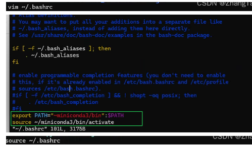
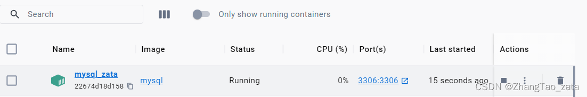

<!--  -->

<!--  -->

## 1. 安装docker mysql容器
### 首先拉取mysql镜像 ，默认拉取最新版

```bash
docker pull mysql
```


###  然后创建容器

```bash
docker run --name mysql_zata -p 3306:3306 -e MYSQL_ROOT_PASSWORD=123456 mysql  #第一个端口是主机的端口
或
docker run --name mysql_zata -p 53306:3306 -e MYSQL_ROOT_PASSWORD=123456 mysql
```


| 参数 |解释  |
|--|--|
|docker run: |创建Docker容器的命令。|
|--name  mysql_zata | 这个选项用于指定容器的名称，这里将容器命名为"mysql_zata"。 |
|-p 3306:3306: [第一个3306是主机的端口可以改成其他的，第二个3306是容器的端口，也就是要固定的]可以改成如： <br> -p 53306：3306
| 这个选项用于将容器内部的端口映射到宿主机上。具体来说，-p 3306:3306 将容器内部的MySQL数据库服务的端口3306映射到宿主机的端口3306。这样，您可以通过宿主机上的3306端口访问容器内的MySQL服务。|
|-e MYSQL_ROOT_PASSWORD=123456: |这个选项用于设置MySQL数据库的root用户的密码。在这里，密码被设置为"123456"。这是一个环境变量设置，MySQL容器会使用这个密码来授权root用户访问数据库。|
|mysql:| 这是要运行的Docker镜像的名称。在这里，它是MySQL镜像，意味着会启动一个MySQL数据库容器。|


现在是前台模式创建的（我也不是很清楚，反正关闭这个窗口服务就会停掉），关闭窗口也没事，可以重新再windows的docker界面重开




## 2. 安装Ubuntu容器并配置

### 1. 拉取镜像

```bash
docker pull ubuntu
```

### 2.查看镜像是否拉取成功

```bash
docker images
```

### 3. 运行容器

```bash
docker run -itd --name <容器名称>  -p <主机端口>:<容器端口>   ubuntu 
```

### 4. 通过 exec 命令进入 ubuntu 容器

```bash
docker exec -it <容器名>  /bin/bash
```
### 5. 安装ssh并启动
```bash
apt-get updata

apt-get install openssh-client
apt-get install openssh-server

# 启动
sudo service ssh start
```
### 6. 安装vim

```bash
apt-get install vim
```

### 7. 安装conda 
https://zhuanlan.zhihu.com/p/307923089

注意，可能要手动配置环境变量（如果能直接用也就不用配置）


### 8. 安装zip、unzip

```bash
apt-get install zip 
apt-get install unzip 
```
### 9. 解决中文乱码问题

```python
export LC_ALL="C.UTF-8"
source /etc/bash.bashrc
```

### 10. 安装sudo

```bash
apt-get install sudo
```
