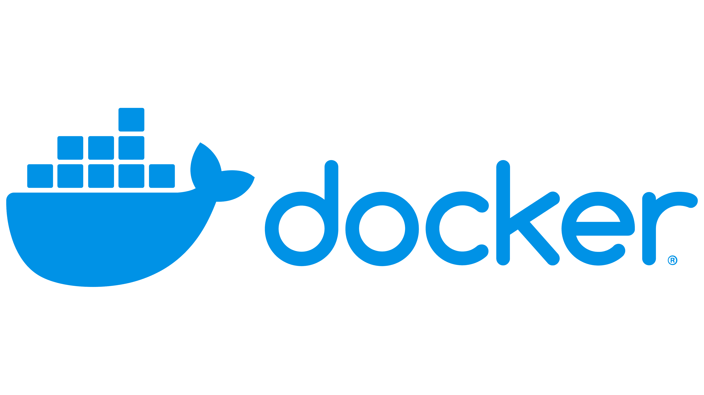

<!--  -->


在 Docker 中，如果你想保存一个容器，可以将其保存为镜像（image），然后在需要时基于这个镜像重新创建容器。以下是具体步骤：

### 方法一：将容器保存为镜像
1. **查看正在运行的容器**
   使用以下命令列出当前运行的容器，找到你要保存的容器 ID 或名称：
   ```bash
   docker ps -a
   ```

2. **提交容器为镜像**
   使用 `docker commit` 命令将容器保存为一个新的镜像。假设你的容器 ID 是 `abc123`，你想保存为镜像名称 `myimage:latest`：
   ```bash
   docker commit abc123 myimage:latest
   ```
   - `abc123` 是容器 ID 或容器名称。
   - `myimage:latest` 是你想保存的新镜像名称和标签。

3. **验证镜像**
   保存后，可以用以下命令查看新创建的镜像：
   ```bash
   docker images
   ```

4. **（可选）保存镜像到文件**
   如果你想将镜像导出为一个 `.tar` 文件以便备份或转移到其他机器：
   ```bash
   docker save -o myimage.tar myimage:latest
   ```
   这样会生成一个 `myimage.tar` 文件。

5. **（可选）加载镜像**
   在其他地方使用时，可以通过以下命令加载 `.tar` 文件：
   ```bash
   docker load -i myimage.tar
   ```

### 方法二：直接导出容器
如果你不需要将其转化为镜像，而是想直接保存容器的完整状态（包括文件系统和配置），可以用 `docker export`：
```bash
docker export abc123 > container.tar
```
- 这会将容器导出为一个 `.tar` 文件。
- 之后可以用 `docker import` 导入这个文件为镜像：
  ```bash
  docker import container.tar myimage:latest
  ```

### 注意事项
- **`docker commit` vs `docker export`**：
  - `docker commit` 保存的是容器的运行时状态为一个新镜像，适合需要保留容器修改的情况。
  - `docker export` 导出的只是文件系统快照，不包括容器的元数据（如 CMD、ENTRYPOINT 等）。
- **推荐方式**：通常建议使用 `docker commit` 并结合 Dockerfile 来管理镜像，这样更符合 Docker 的最佳实践。

### 使用保存的镜像
保存为镜像后，随时可以用以下命令基于镜像启动新容器：
```bash
docker run -d myimage:latest
```

如果你有其他具体需求（比如保存到某个地方或自动化脚本），可以告诉我，我再帮你调整方案！