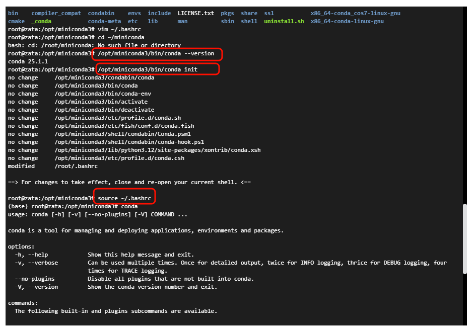

---

## 在 Ubuntu 上安装 Miniconda


按顺序执行以下命令一般就可以顺利安装了

```
wget https://repo.anaconda.com/miniconda/Miniconda3-latest-Linux-x86_64.sh
bash Miniconda3-latest-Linux-x86_64.sh
cd ~
source .bashrc
```


<span style="color:red;">注意：有时候也有意外</span>

见下面问题合集


## 问题合集

###  安装完成后，在执行`source.bashrc`后，输入命令`conda --version`并没有弹出conda，显示没有此命令

一般来说，miniconda会默认安装在`~/miniconda3`目录下，执行上面的cd ~  和 source .bashrc后，会将conda添加到环境变量中，但是有时候，默认安装位置也会发生变化，在本次事件中，我发现conda的默认安装位置变成了opt目录下（在1panel平台上的容器中使用），所以需要手动添加环境变量，

验证 Conda 是否正常工作：
```bash
/opt/miniconda3/bin/conda --version
```
- 如果输出类似 `conda 24.1.2` 的版本号，说明 Conda 已正确安装，只是未添加到 Shell 环境中。
- 如果报错（例如文件不存在），检查 `/opt/miniconda3/bin/conda` 是否存在，可能需要重新安装。


如果conda能正常使用，那么
执行下面的命令


```bash
# 这会在你的 ~/.bashrc 文件中添加 Conda 的初始化脚本，指向 /opt/miniconda3 目录。
/opt/miniconda3/bin/conda init  

# 添加环境变量到 Shell 会话
source ~/.bashrc
```
上面操作后就成功了，可以
检查 `conda` 命令是否全局可用：
```bash
conda --version
```
- 如果成功输出版本号，说明配置完成。


