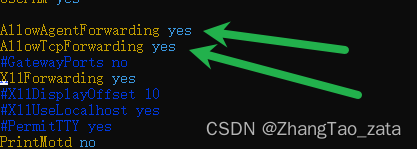
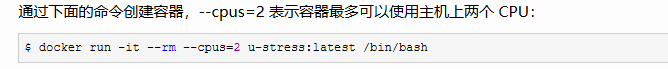
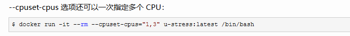

<!--  -->
<!--  -->


### docker容器相关命令
#### 1. 拉取镜像

```bash
docker pull ubuntu
```

#### 2.查看镜像是否拉取成功

```bash
docker images
```

#### 3. 运行容器

```bash
docker run -itd --name <容器名称>  -p <主机端口>:<容器端口> --cpus=30  ubuntu
# -p设置端口   --cpus/-c 设置核心 
```

#### 4. 通过 exec 命令进入 ubuntu 容器

```bash
docker exec -it <容器名>  /bin/bash
```
#### 5. 安装ssh
```bash
apt-get updata

apt-get install openssh-client
apt-get install openssh-server

```
#### 6. 安装vim

```bash
apt-get install vim
```

#### 7. 安装conda 
https://zhuanlan.zhihu.com/p/307923089
注意，可能要手动配置环境变量


#### 8. 安装zip、unzip

```bash
apt-get install zip 
apt-get install unzip 
```
#### 9. 解决中文乱码问题

```python
export LC_ALL="C.UTF-8"
source /etc/bash.bashrc
```

#### 10. 安装sudo

```bash
apt-get install sudo
```


-------------
-------------
-------------
-------------

### Docker使用技巧

#### 使用已有容器创建镜像

```bash
docker commit container-name  new-image-name
```
#### 开启/重启ssh服务

```bash
service ssh start 
service ssh restart 
```

#### docker 文件传输
宿主机到容器
```bash
# docker cp 宿主机文件/路径 容器名：容器内路径
docker cp /home/Download/index.html wordpress-lee:/var/www/html
```

容器到宿主机
```bash
# docker cp 容器名：文件/路径 宿主机路径 
docker cp wordpress-lee:/root/example.sh /root
```

#### 修改服务器配置允许通过此服务器进行ssh转发
进入配置文件，不要cd..然后在vim，直接vim  ...
```bash
vim /etc/ssh/sshd_config
```
配置文件内容


修改其中的：




 重启ssh服务

```bash
 service ssh restart
```

#### docker容器添加对外映射端口

|参考：|
|---|
|https://www.cnblogs.com/zhumengke/articles/13525837.html|


最简单省事方法：将现有的容器打包成镜像，然后在使用新的镜像运行容器时重新指定要映射的端口


#### docker设置可用CPU核心数量

|参考：|
|---|
|https://www.cnblogs.com/sparkdev/p/8052522.html|







