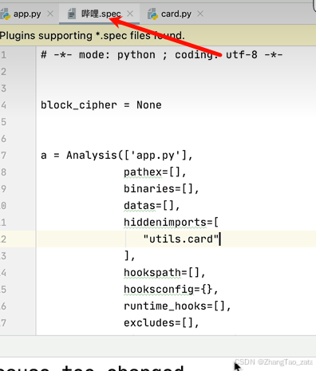
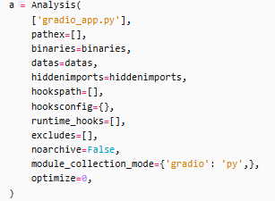

##   一些问题的提醒
### `打包时候指定了附加文件，但是打包之后附加文件是放在了__internal文件夹里面的`
我的解决方法是：
- 使用python代码打包，然后打包好了之后在把文件移动到和exe一个目录

### `开发的时候引用脚本没有任何问题，但是打包的时候就出错？`
我的解决方法是：
1. 最好以程序的入口文件位置作为所有脚本的位置
2. 最好使用相对路径：我使用的是 	`Root_dir =  os.path.dirname(os.path.realpath(sys.argv[0]))` 作为我所有函数识别的根路径


### 其他打包工具

- cx_Freeze：老牌打包工具，稳定可靠
- Auto-py-to-exe：PyInstaller的GUI版本，适合新手使用
- Py2exe：仅支持Windows平台的经典工具
- PyStand： 非常容易快捷的打包方式，只需要把源码和环境拖入制定文件夹就可以


---


## 2. 使用PyInstaller进行打包简单使用


```bash
pip install pyinstaller

# 最简单的打包
pyinstaller your_script.py
```

这将生成一个dist文件夹，其中包含可执行文件及其依赖。

> 也可以使用pyi-makespec命令生成一个.spec文件，然后在.spec文件中进行配置，最后使用pyinstaller命令进行打包。
> 例如：
> ```bash
> pyi-makespec your_script.py
> ```
> 然后在生成的.spec文件中进行配置


### 常用参数说明

PyInstaller提供了多个有用的参数：


基本命令格式:
```bash
pyinstaller [options] script.py
```

1. 基础参数:
```bash
-F, --onefile       # 打包成一个单独的可执行文件
-D, --onedir        # 打包成一个文件夹(默认选项)
-n NAME             # 指定生成的可执行文件名
-w, --windowed      # Windows系统下不显示命令行窗口
-c, --console       # 显示命令行窗口(默认)
--noconfirm         # 跳过确认提示,直接覆盖现有文件
```

2. 路径和文件相关:
```bash
--distpath DIR      # 指定打包后的输出路径
--workpath DIR      # 指定工作目录路径
--specpath DIR      # 指定spec文件的生成路径
-p DIR              # 添加Python路径(可多次使用)
--add-data         # 添加额外的数据文件 
                   # 格式: source:dest (Windows用;分隔,Linux用:分隔)
--add-binary       # 添加额外的二进制文件
```

3. 打包控制:
```bash
--hidden-import    # 添加隐式导入的模块
--additional-hooks-dir # 指定额外的hooks目录
--runtime-hook    # 指定运行时hook脚本
--exclude-module  # 排除指定模块
--clean          # 清理打包前的临时文件
```

常见实例:

1. 最简单的单文件打包(不需确认):
```bash
pyinstaller --noconfirm -F main.py
```

2. 打包成单文件且不显示控制台:
```bash
pyinstaller --noconfirm -F -w main.py
```

3. 包含数据文件的打包:
```bash
# Windows
pyinstaller --noconfirm -F --add-data "resources;resources" main.py

# Linux/MacOS
pyinstaller --noconfirm -F --add-data "resources:resources" main.py
```

4. 完整的生产环境打包示例:
```bash
pyinstaller --noconfirm --onefile --windowed --icon "app.ico" ^
  --hidden-import "PIL" ^
  --add-data "resources;resources" ^
  --add-data "config.yml;." ^
  --name "MyApp" ^
  main.py
```


### 配置文件说明


此外，.spec这个文件提供了可以手动写隐式导入配置的功能，在配置文件中的hiddenimports中写入，然后允许pyinstaller手动选择相关.spec文件，后面不用再接其他配置
```bash
pyinstaller -F 哔哩.spec 
```



下面是我用于打包gradio项目的gradio源码和一个配置文件的示例，


```py
# gradio_app.py 
import gradio as gr


def greet(name):
    return "Hello " + name + "!!"


demo = gr.Interface(fn=greet, inputs="text", outputs="text")

if __name__ == "__main__":
    demo.launch()

```


配置文件

生成方式：
```bash
 pyi-makespec --collect-all aiofiles --collect-all annotated_types --collect-all anyio --collect-all certifi --collect-all charset_normalizer --collect-all click --collect-all colorama --collect-all dateutil --collect-all fastapi --collect-all ffmpy --collect-all filelock --collect-all fsspec --collect-all gradio --collect-all gradio_client --collect-all groovy --collect-all h11 --collect-all httpcore --collect-all httpx --collect-all huggingface_hub --collect-all idna --collect-all jinja2 --collect-all lxml --collect-all markdown_it --collect-all markupsafe --collect-all mdurl --collect-all multipart --collect-all numpy --collect-all opencc --collect-all orjson --collect-all packaging --collect-all pandas --collect-all pillow --collect-all pip --collect-all pydantic --collect-all pydantic_core --collect-all pydub --collect-all pygments --collect-all python_multipart --collect-all pytz --collect-all requests --collect-all rich --collect-all ruff --collect-all safehttpx --collect-all semantic_version --collect-all setuptools --collect-all shellingham --collect-all sniffio --collect-all starlette --collect-all tomlkit --collect-all tqdm --collect-all typer --collect-all tzdata --collect-all urllib3 --collect-all uvicorn --collect-all websockets --collect-all wheel gradio_app.py
```

下面是生成得到的配置文件

```py
# gradio_app.spec
# -*- mode: python ; coding: utf-8 -*-
from PyInstaller.utils.hooks import collect_all

datas = []
binaries = []
hiddenimports = []
tmp_ret = collect_all('aiofiles')
datas += tmp_ret[0]; binaries += tmp_ret[1]; hiddenimports += tmp_ret[2]
tmp_ret = collect_all('annotated_types')
datas += tmp_ret[0]; binaries += tmp_ret[1]; hiddenimports += tmp_ret[2]
tmp_ret = collect_all('anyio')
datas += tmp_ret[0]; binaries += tmp_ret[1]; hiddenimports += tmp_ret[2]
tmp_ret = collect_all('certifi')
datas += tmp_ret[0]; binaries += tmp_ret[1]; hiddenimports += tmp_ret[2]
tmp_ret = collect_all('charset_normalizer')
datas += tmp_ret[0]; binaries += tmp_ret[1]; hiddenimports += tmp_ret[2]
tmp_ret = collect_all('click')
datas += tmp_ret[0]; binaries += tmp_ret[1]; hiddenimports += tmp_ret[2]
tmp_ret = collect_all('colorama')
datas += tmp_ret[0]; binaries += tmp_ret[1]; hiddenimports += tmp_ret[2]
tmp_ret = collect_all('dateutil')
datas += tmp_ret[0]; binaries += tmp_ret[1]; hiddenimports += tmp_ret[2]
tmp_ret = collect_all('fastapi')
datas += tmp_ret[0]; binaries += tmp_ret[1]; hiddenimports += tmp_ret[2]
tmp_ret = collect_all('ffmpy')
datas += tmp_ret[0]; binaries += tmp_ret[1]; hiddenimports += tmp_ret[2]
tmp_ret = collect_all('filelock')
datas += tmp_ret[0]; binaries += tmp_ret[1]; hiddenimports += tmp_ret[2]
tmp_ret = collect_all('fsspec')
datas += tmp_ret[0]; binaries += tmp_ret[1]; hiddenimports += tmp_ret[2]
tmp_ret = collect_all('gradio')
datas += tmp_ret[0]; binaries += tmp_ret[1]; hiddenimports += tmp_ret[2]
tmp_ret = collect_all('gradio_client')
datas += tmp_ret[0]; binaries += tmp_ret[1]; hiddenimports += tmp_ret[2]
tmp_ret = collect_all('groovy')
datas += tmp_ret[0]; binaries += tmp_ret[1]; hiddenimports += tmp_ret[2]
tmp_ret = collect_all('h11')
datas += tmp_ret[0]; binaries += tmp_ret[1]; hiddenimports += tmp_ret[2]
tmp_ret = collect_all('httpcore')
datas += tmp_ret[0]; binaries += tmp_ret[1]; hiddenimports += tmp_ret[2]
tmp_ret = collect_all('httpx')
datas += tmp_ret[0]; binaries += tmp_ret[1]; hiddenimports += tmp_ret[2]
tmp_ret = collect_all('huggingface_hub')
datas += tmp_ret[0]; binaries += tmp_ret[1]; hiddenimports += tmp_ret[2]
tmp_ret = collect_all('idna')
datas += tmp_ret[0]; binaries += tmp_ret[1]; hiddenimports += tmp_ret[2]
tmp_ret = collect_all('jinja2')
datas += tmp_ret[0]; binaries += tmp_ret[1]; hiddenimports += tmp_ret[2]
tmp_ret = collect_all('lxml')
datas += tmp_ret[0]; binaries += tmp_ret[1]; hiddenimports += tmp_ret[2]
tmp_ret = collect_all('markdown_it')
datas += tmp_ret[0]; binaries += tmp_ret[1]; hiddenimports += tmp_ret[2]
tmp_ret = collect_all('markupsafe')
datas += tmp_ret[0]; binaries += tmp_ret[1]; hiddenimports += tmp_ret[2]
tmp_ret = collect_all('mdurl')
datas += tmp_ret[0]; binaries += tmp_ret[1]; hiddenimports += tmp_ret[2]
tmp_ret = collect_all('multipart')
datas += tmp_ret[0]; binaries += tmp_ret[1]; hiddenimports += tmp_ret[2]
tmp_ret = collect_all('numpy')
datas += tmp_ret[0]; binaries += tmp_ret[1]; hiddenimports += tmp_ret[2]
tmp_ret = collect_all('opencc')
datas += tmp_ret[0]; binaries += tmp_ret[1]; hiddenimports += tmp_ret[2]
tmp_ret = collect_all('orjson')
datas += tmp_ret[0]; binaries += tmp_ret[1]; hiddenimports += tmp_ret[2]
tmp_ret = collect_all('packaging')
datas += tmp_ret[0]; binaries += tmp_ret[1]; hiddenimports += tmp_ret[2]
tmp_ret = collect_all('pandas')
datas += tmp_ret[0]; binaries += tmp_ret[1]; hiddenimports += tmp_ret[2]
tmp_ret = collect_all('pillow')
datas += tmp_ret[0]; binaries += tmp_ret[1]; hiddenimports += tmp_ret[2]
tmp_ret = collect_all('pip')
datas += tmp_ret[0]; binaries += tmp_ret[1]; hiddenimports += tmp_ret[2]
tmp_ret = collect_all('pydantic')
datas += tmp_ret[0]; binaries += tmp_ret[1]; hiddenimports += tmp_ret[2]
tmp_ret = collect_all('pydantic_core')
datas += tmp_ret[0]; binaries += tmp_ret[1]; hiddenimports += tmp_ret[2]
tmp_ret = collect_all('pydub')
datas += tmp_ret[0]; binaries += tmp_ret[1]; hiddenimports += tmp_ret[2]
tmp_ret = collect_all('pygments')
datas += tmp_ret[0]; binaries += tmp_ret[1]; hiddenimports += tmp_ret[2]
tmp_ret = collect_all('python_multipart')
datas += tmp_ret[0]; binaries += tmp_ret[1]; hiddenimports += tmp_ret[2]
tmp_ret = collect_all('pytz')
datas += tmp_ret[0]; binaries += tmp_ret[1]; hiddenimports += tmp_ret[2]
tmp_ret = collect_all('requests')
datas += tmp_ret[0]; binaries += tmp_ret[1]; hiddenimports += tmp_ret[2]
tmp_ret = collect_all('rich')
datas += tmp_ret[0]; binaries += tmp_ret[1]; hiddenimports += tmp_ret[2]
tmp_ret = collect_all('ruff')
datas += tmp_ret[0]; binaries += tmp_ret[1]; hiddenimports += tmp_ret[2]
tmp_ret = collect_all('safehttpx')
datas += tmp_ret[0]; binaries += tmp_ret[1]; hiddenimports += tmp_ret[2]
tmp_ret = collect_all('semantic_version')
datas += tmp_ret[0]; binaries += tmp_ret[1]; hiddenimports += tmp_ret[2]
tmp_ret = collect_all('setuptools')
datas += tmp_ret[0]; binaries += tmp_ret[1]; hiddenimports += tmp_ret[2]
tmp_ret = collect_all('shellingham')
datas += tmp_ret[0]; binaries += tmp_ret[1]; hiddenimports += tmp_ret[2]
tmp_ret = collect_all('sniffio')
datas += tmp_ret[0]; binaries += tmp_ret[1]; hiddenimports += tmp_ret[2]
tmp_ret = collect_all('starlette')
datas += tmp_ret[0]; binaries += tmp_ret[1]; hiddenimports += tmp_ret[2]
tmp_ret = collect_all('tomlkit')
datas += tmp_ret[0]; binaries += tmp_ret[1]; hiddenimports += tmp_ret[2]
tmp_ret = collect_all('tqdm')
datas += tmp_ret[0]; binaries += tmp_ret[1]; hiddenimports += tmp_ret[2]
tmp_ret = collect_all('typer')
datas += tmp_ret[0]; binaries += tmp_ret[1]; hiddenimports += tmp_ret[2]
tmp_ret = collect_all('tzdata')
datas += tmp_ret[0]; binaries += tmp_ret[1]; hiddenimports += tmp_ret[2]
tmp_ret = collect_all('urllib3')
datas += tmp_ret[0]; binaries += tmp_ret[1]; hiddenimports += tmp_ret[2]
tmp_ret = collect_all('uvicorn')
datas += tmp_ret[0]; binaries += tmp_ret[1]; hiddenimports += tmp_ret[2]
tmp_ret = collect_all('websockets')
datas += tmp_ret[0]; binaries += tmp_ret[1]; hiddenimports += tmp_ret[2]
tmp_ret = collect_all('wheel')
datas += tmp_ret[0]; binaries += tmp_ret[1]; hiddenimports += tmp_ret[2]


a = Analysis(
    ['gradio_app.py'],
    pathex=[],
    binaries=binaries,
    datas=datas,
    hiddenimports=hiddenimports,
    hookspath=[],
    hooksconfig={},
    runtime_hooks=[],
    excludes=[],
    noarchive=False,
    module_collection_mode={'gradio': 'py',},
    optimize=0,
)
pyz = PYZ(a.pure)

exe = EXE(
    pyz,
    a.scripts,
    [],
    exclude_binaries=True,
    name='gradio_app',
    debug=False,
    bootloader_ignore_signals=False,
    strip=False,
    upx=True,
    console=True,
    disable_windowed_traceback=False,
    argv_emulation=False,
    target_arch=None,
    codesign_identity=None,
    entitlements_file=None,
)
coll = COLLECT(
    exe,
    a.binaries,
    a.datas,
    strip=False,
    upx=True,
    upx_exclude=[],
    name='gradio_app',
)


```


#### 1. `Analysis` 部分



`Analysis` 是 PyInstaller 的核心类，用于分析 Python 脚本的依赖关系并收集打包所需的文件。

- **`['gradio_app.py']`**:  
  指定要打包的主 Python 脚本文件。这里是 `gradio_app.py`，表示这是应用程序的入口脚本。

- **`pathex=[]`**:  
  指定额外的路径，PyInstaller 会在这些路径中查找模块或文件。通常为空，PyInstaller 会自动处理标准路径。如果你的项目有非标准路径的依赖，可以在这里添加。

- **`binaries=binaries`**:  
  指定额外的二进制文件（如 DLL 文件或共享库）。`binaries` 是一个预定义的列表，包含需要打包的非 Python 二进制依赖。如果为空，则 PyInstaller 自动检测。

- **`datas=datas`**:  
  指定额外的非代码文件（如图像、配置文件、HTML 模板等）。`datas` 是一个列表，格式通常为 `[(源路径, 目标路径)]`。这些文件会被打包到最终的可执行文件中。

- **`hiddenimports=hiddenimports`**:  
  指定 PyInstaller 无法自动检测的隐式导入模块。例如，某些动态导入的模块（如 Gradio 的依赖）需要手动列出，防止打包后缺少模块。

- **`hookspath=[]`**:  
  指定自定义 PyInstaller 钩子文件的路径。钩子文件用于处理特定模块的打包逻辑（如 Gradio 的复杂依赖）。为空时使用默认钩子。

- **`hooksconfig={}`**:  
  提供特定模块的钩子配置。某些模块需要额外的配置来正确打包，格式为字典。

- **`runtime_hooks=[]`**:  
  指定运行时钩子脚本，这些脚本会在可执行文件启动时运行，用于动态修改环境（如设置环境变量）。

- **`excludes=[]`**:  
  指定要从打包中排除的模块。用于减少包体积，排除不必要的模块。

- **`noarchive=False`**:  
  是否禁用归档模式。如果为 `True`，PyInstaller 不会将文件打包为压缩归档，而是直接解压到临时目录。通常保持 `False`。

- **`module_collection_mode={'gradio': 'py'}`**:  
  指定模块的收集模式。`'gradio': 'py'` 表示 Gradio 模块以源代码形式（`.py` 文件）收集，而不是编译为 `.pyc` 文件。这在调试或某些模块不兼容编译时有用。

- **`optimize=0`**:  
  指定 Python 字节码优化的级别。  
  - `0`: 无优化（默认）。  
  - `1`: 移除 `assert` 语句。  
  - `2`: 移除 `assert` 和文档字符串。  
  通常设为 `0` 以保留调试信息。

---


#### 2. `PYZ` 部分
`PYZ` 用于创建 Python 字节码的压缩归档文件（`.pyz` 文件），包含所有 Python 模块。

- **`a.pure`**:  
  来自 `Analysis` 的纯 Python 模块列表（不包括 C 扩展模块）。`PYZ` 将这些模块打包为一个压缩归档，供可执行文件加载。

---

#### 3. `EXE` 部分
`EXE` 定义了最终生成的可执行文件。

- **`pyz`**:  
  上一步生成的 `PYZ` 对象，包含 Python 字节码。

- **`a.scripts`**:  
  来自 `Analysis` 的脚本列表，通常包括主脚本（`gradio_app.py`）和 PyInstaller 的启动脚本。

- **`[]`**:  
  额外的二进制文件列表，添加到可执行文件中。此处为空，依赖已在 `Analysis` 中处理。

- **`exclude_binaries=True`**:  
  是否将二进制文件排除在可执行文件之外。如果为 `True`，二进制文件不会嵌入 `.exe` 文件，而是由 `COLLECT` 步骤单独收集到输出目录。这减少 `.exe` 文件大小。

- **`name='gradio_app'`**:  
  可执行文件的名称。生成的文件将命名为 `gradio_app.exe`（Windows）或 `gradio_app`（Linux/macOS）。

- **`debug=False`**:  
  是否启用调试模式。如果为 `True`，会在运行时输出详细的调试信息（如模块加载日志）。通常设为 `False`。

- **`bootloader_ignore_signals=False`**:  
  是否让 PyInstaller 的引导程序（bootloader）忽略系统信号（如 `SIGINT`）。通常保持默认值 `False`。

- **`strip=False`**:  
  是否对可执行文件进行符号剥离（移除调试符号）。设为 `True` 可减小文件大小，但可能影响调试。通常设为 `False`。

- **`upx=True`**:  
  是否使用 UPX（Ultimate Packer for Executables）压缩可执行文件。UPX 可以显著减小文件大小，但可能导致杀毒软件误报或兼容性问题。设为 `True` 表示启用。

- **`console=True`**:  
  是否生成带有控制台窗口的可执行文件。  
  - `True`: 运行时会显示命令行窗口（适合调试或 CLI 应用）。  
  - `False`: 无控制台窗口（适合 GUI 应用）。  
  Gradio 应用通常是 Web 应用，可能不需要控制台，但这里设为 `True`。

- **`disable_windowed_traceback=False`**:  
  是否在 Windows GUI 模式下禁用错误跟踪。如果为 `True`，GUI 模式下的错误不会显示详细回溯。保持 `False` 以便调试。

- **`argv_emulation=False`**:  
  是否模拟命令行参数传递（主要用于 macOS）。通常设为 `False`。

- **`target_arch=None`**:  
  指定目标架构（如 `x86_64` 或 `arm64`）。为 `None` 时，PyInstaller 自动选择当前系统架构。

- **`codesign_identity=None`**:  
  指定 macOS 代码签名的身份。为空表示不签名。

- **`entitlements_file=None`**:  
  指定 macOS 代码签名的权限文件。为空表示使用默认权限。

---

#### 4. `COLLECT` 部分
`COLLECT` 将所有文件（可执行文件、二进制文件、数据文件等）收集到一个输出目录。

- **`exe`**:  
  上一步生成的 `EXE` 对象，即主可执行文件。

- **`a.binaries`**:  
  来自 `Analysis` 的二进制文件列表，包含依赖的 DLL、共享库等。

- **`a.datas`**:  
  来自 `Analysis` 的数据文件列表，包含非代码文件。

- **`strip=False`**:  
  是否对收集的二进制文件进行符号剥离。保持 `False` 以保留调试信息。

- **`upx=True`**:  
  是否对收集的二进制文件应用 UPX 压缩。与 `EXE` 部分的 `upx` 参数类似。

- **`upx_exclude=[]`**:  
  指定不使用 UPX 压缩的文件列表。如果某些文件压缩后会导致问题，可以在这里列出。

- **`name='gradio_app'`**:  
  输出目录的名称。所有文件将被收集到 `dist/gradio_app` 目录下。


---


注意事项:
1. 打包前确保在虚拟环境中安装了所有依赖
2. 如果程序引用了动态库或特殊文件,需要使用--add-data或--add-binary添加
3. 某些模块可能需要手动添加hidden-import
4. 建议先使用-D选项测试,确认无误后再使用-F打包

这样的参数列表更加完整,包含了--noconfirm参数的使用说明。您可以根据具体需求选择合适的参数组合。

## 3. 实战案例：打包一个GUI应用

下面是一个完整的案例，展示如何打包一个使用tkinter的GUI应用。

### 3.1 示例程序代码

```python
import tkinter as tk
from tkinter import messagebox

class SimpleApp:
    def __init__(self, root):
        self.root = root
        self.root.title("简单计算器")
        
        # 创建输入框
        self.num1 = tk.Entry(root)
        self.num1.pack()
        
        self.num2 = tk.Entry(root)
        self.num2.pack()
        
        # 创建按钮
        self.calc_button = tk.Button(root, text="计算", command=self.calculate)
        self.calc_button.pack()
        
        # 显示结果的标签
        self.result_label = tk.Label(root, text="结果：")
        self.result_label.pack()
    
    def calculate(self):
        try:
            n1 = float(self.num1.get())
            n2 = float(self.num2.get())
            result = n1 + n2
            self.result_label.config(text=f"结果：{result}")
        except ValueError:
            messagebox.showerror("错误", "请输入有效的数字！")

if __name__ == "__main__":
    root = tk.Tk()
    app = SimpleApp(root)
    root.mainloop()
```

### 3.2 打包配置文件

创建一个名为 `app.spec` 的配置文件：

```python
# -*- mode: python ; coding: utf-8 -*-

block_cipher = None

a = Analysis(['your_script.py'],
             pathex=[],
             binaries=[],
             datas=[],
             hiddenimports=[],
             hookspath=[],
             hooksconfig={},
             runtime_hooks=[],
             excludes=[],
             win_no_prefer_redirects=False,
             win_private_assemblies=False,
             cipher=block_cipher,
             noarchive=False)

pyz = PYZ(a.pure, a.zipped_data,
          cipher=block_cipher)

exe = EXE(pyz,
          a.scripts,
          a.binaries,
          a.zipfiles,
          a.datas,
          [],
          name='MyApp',
          debug=False,
          bootloader_ignore_signals=False,
          strip=False,
          upx=True,
          upx_exclude=[],
          runtime_tmpdir=None,
          console=False,
          disable_windowed_traceback=False,
          target_arch=None,
          codesign_identity=None,
          entitlements_file=None,
          icon='icon.ico')
```

### 3.3 执行打包

使用配置文件进行打包：

```bash
pyinstaller app.spec
```

## 4. 常见问题及解决方案

### 4.1 找不到模块

如果打包后运行提示找不到某些模块，可以：

1. 使用 `--hidden-import` 参数手动添加
2. 在spec文件中的 `hiddenimports` 列表中添加

### 4.2 文件路径问题

在打包后的程序中，需要特别注意文件路径的处理：

```python
import os
import sys

# 获取程序运行时的真实路径
if getattr(sys, 'frozen', False):
    application_path = os.path.dirname(sys.executable)
else:
    application_path = os.path.dirname(os.path.abspath(__file__))
```

### 4.3 减小文件体积

可以通过以下方法减小打包后的文件体积：

1. 使用虚拟环境，只安装必要的依赖
2. 使用 `--exclude-module` 排除不需要的模块
3. 使用UPX压缩（如果可用）

### 实践建议

1. 始终使用虚拟环境进行开发和打包
2. 仔细检查依赖项，避免包含不必要的模块
3. 在目标平台上测试打包后的程序
4. 保存并管理spec文件，方便后续修改和重新打包
5. 记录打包过程中的问题和解决方案

### 6. 环境相关注意事项

#### 6.1 Python版本兼容性
- 建议使用与开发环境相同的Python版本进行打包
- 注意目标机器的系统架构(32位/64位)
- 某些第三方库可能与特定Python版本不兼容，需提前测试

#### 6.2 虚拟环境使用
```bash
# 创建虚拟环境
python -m venv venv

# 激活虚拟环境
# Windows
venv\Scripts\activate
# Linux/Mac
source venv/bin/activate

# 安装依赖
pip install -r requirements.txt
```

#### 6.3 依赖管理
- 使用`pipreqs`生成准确的依赖列表：
```bash
pip install pipreqs
pipreqs ./
```
- 定期更新`requirements.txt`
- 检查并移除未使用的依赖
