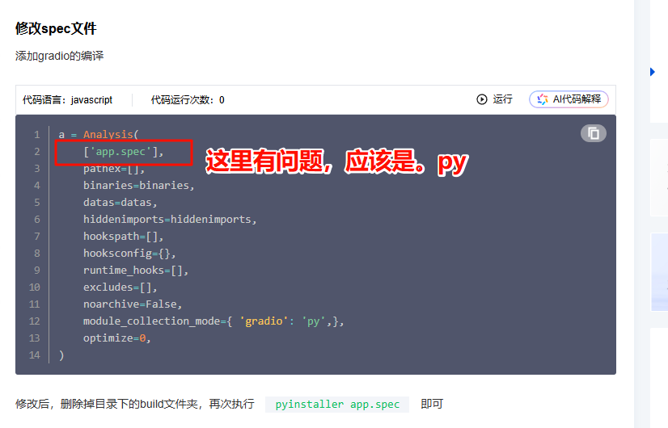
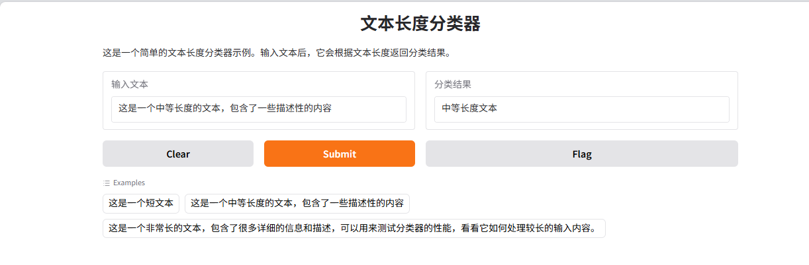
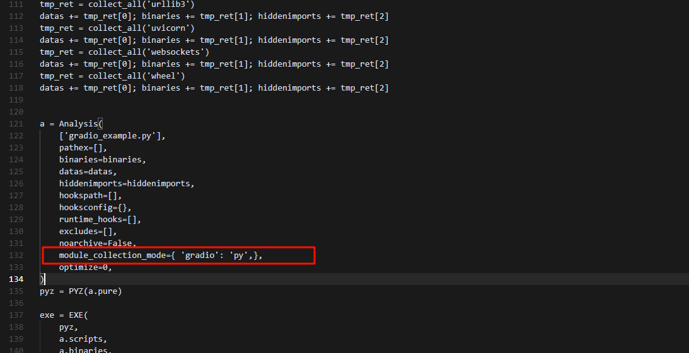
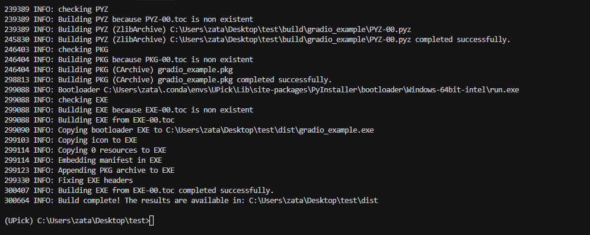

<span style="color : red"> 由于gradio库中的代码都是pyi文件，而pyinstaller 在打包时默认库中的都是pyc文件，故而需要修改spec文件，指定对gradio库下的代码进行编译。  </span>


参考： https://cloud.tencent.com/developer/article/2503987

注意上面的链接中：




--- 

## 打包示例

### 1 代码的例子

```py 

#gradio_example.py

import gradio as gr
import numpy as np
import logging
import sys
import os

# 配置日志
logging.basicConfig(
    level=logging.INFO,
    format='%(asctime)s - %(levelname)s - %(message)s',
    handlers=[
        logging.StreamHandler(sys.stdout)
    ]
)

def classify_text(text):
    try:
        # 这里我们使用一个简单的示例分类器
        # 在实际应用中，这里可以替换为你的机器学习模型
        if len(text) < 10:
            return "短文本"
        elif len(text) < 50:
            return "中等长度文本"
        else:
            return "长文本"
    except Exception as e:
        logging.error(f"分类过程中发生错误: {str(e)}")
        return f"错误: {str(e)}"

def main():
    try:
        # 创建 Gradio 界面
        demo = gr.Interface(
            fn=classify_text,
            inputs=gr.Textbox(label="输入文本", placeholder="请输入要分类的文本..."),
            outputs=gr.Textbox(label="分类结果"),
            title="文本长度分类器",
            description="这是一个简单的文本长度分类器示例。输入文本后，它会根据文本长度返回分类结果。",
            examples=[
                ["这是一个短文本"],
                ["这是一个中等长度的文本，包含了一些描述性的内容"],
                ["这是一个非常长的文本，包含了很多详细的信息和描述，可以用来测试分类器的性能，看看它如何处理较长的输入内容。"]
            ]
        )

        # 启动界面
        logging.info("正在启动 Gradio 界面...")
        demo.launch()
    except Exception as e:
        logging.error(f"程序启动失败: {str(e)}")
        input("按回车键退出...")

if __name__ == "__main__":
    main() 
``` 




### 2 生成.spec文件并增加一行


gradio会有很多依赖库，这些都是要的，具体可以使用pip freeze 查看依赖

```bash
pyi-makespec --onefile  --collect-all aiofiles --collect-all annotated_types --collect-all anyio --collect-all certifi --collect-all charset_normalizer --collect-all click --collect-all colorama --collect-all dateutil --collect-all fastapi --collect-all ffmpy --collect-all filelock --collect-all fsspec --collect-all gradio --collect-all gradio_client --collect-all groovy --collect-all h11 --collect-all httpcore --collect-all httpx --collect-all huggingface_hub --collect-all idna --collect-all jinja2 --collect-all lxml --collect-all markdown_it --collect-all markupsafe --collect-all mdurl --collect-all multipart --collect-all numpy --collect-all opencc --collect-all orjson --collect-all packaging --collect-all pandas --collect-all pillow --collect-all pip --collect-all pydantic --collect-all pydantic_core --collect-all pydub --collect-all pygments --collect-all python_multipart --collect-all pytz --collect-all requests --collect-all rich --collect-all ruff --collect-all safehttpx --collect-all semantic_version --collect-all setuptools --collect-all shellingham --collect-all sniffio --collect-all starlette --collect-all tomlkit --collect-all tqdm --collect-all typer --collect-all tzdata --collect-all urllib3 --collect-all uvicorn --collect-all websockets --collect-all wheel gradio_example.py
```


然后增加一行

module_collection_mode={ 'gradio': 'py',},




### 3 使用spec文件打包exe

```bash
pyinstaller gradio.spec
```


