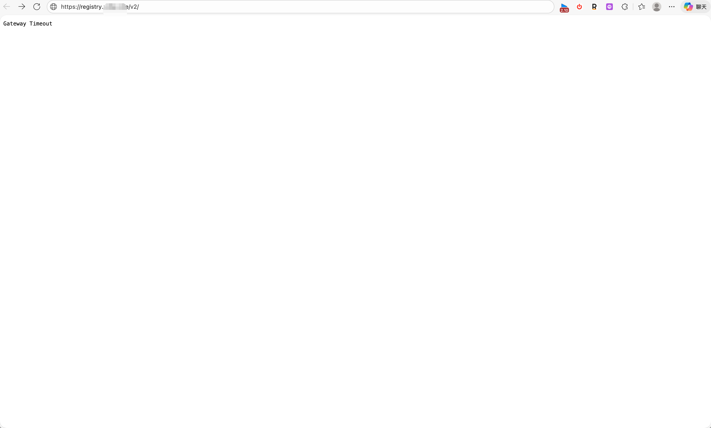

# 安装和配置

## Dokploy ：搭建自带“自动清理”功能的私有 Docker 镜像仓库 --- 20260225

在个人服务器上搭建私有 Docker Registry（镜像仓库）是很多开发者的刚需。使用 Dokploy 部署虽然简单，但很多人很快会遇到一个棘手的问题：**磁盘空间爆炸**。

原生的 Docker Registry 像个“只进不出”的貔貅，默认既不支持删除镜像，删除了也不释放空间。

本文将带你通过 Dokploy 部署一个**带 Web 管理界面**、**支持删除**且**每晚自动释放磁盘空间**的完美私有仓库。

---

**1. 为什么 Registry 的清理这么麻烦？**

在开始配置之前，我们需要理解为什么 Docker 官方把 Registry 设计得这么“难用”。很多人发现，即便开启了删除功能，删除了镜像，磁盘占用依然没变。

这是因为 Registry 的清理机制分为两步：

1.  **软删除 (Soft Delete)**：当你通过 API 或 UI 点击删除时，Registry 只是删除了**清单（Manifest）**。这就像你在 Windows 上把文件拖进了回收站，文件其实还在磁盘上。
2.  **垃圾回收 (Garbage Collection)**：这是真正的物理删除。因为 Docker 的镜像是由很多“层（Layers）”组成的，且不同镜像会**共享**底层。Registry 必须通过扫描全盘，计算引用关系，确认某一层真的没有被任何镜像使用后，才敢真正删除它。

**此外，官方默认禁用删除操作（`REGISTRY_STORAGE_DELETE_ENABLED: false`）主要基于以下考量：**

*   **层共享保护**：防止误删被其他镜像依赖的基础层。
*   **并发安全**：防止在清理时，刚好有新镜像正在推送（Push）导致数据损坏。
*   **不可变基础设施**：发布的镜像应当被视为不可变的历史存档。

但在个人或小团队场景下，为了省钱（服务器磁盘贵啊！），我们需要它能够清理。

---

**2. 编写 `docker-compose.yml`**

我们将通过 Dokploy 部署三个服务：

1.  **Registry**：核心仓库服务。
2.  **Auto-Auth**：一个辅助容器，启动时生成账号密码文件，然后自动退出。
3.  **Registry UI**：一个轻量级的 Web 界面，方便我们查看和删除镜像。

在 Dokploy 的 `Compose` 选项卡中，填入以下配置：

```yaml
version: '3.8'

# 定义数据卷，持久化存储镜像和认证信息
volumes:
  registry-data:
  registry-auth-data: 

# 使用 Dokploy 预置的外部网络
networks:
  dokploy-network:
    external: true

services:
  # 1. 认证辅助服务：生成账号 admin / 密码 123456
  # 启动一次生成文件后就会退出，这是正常的
  auto-setup-auth:
    image: httpd:alpine
    command: /bin/sh -c "htpasswd -Bbn admin 123456 > /auth/htpasswd"
    volumes:
      - registry-auth-data:/auth

  # 2. 核心 Registry 服务
  registry:
    image: registry:2
    container_name: my-private-registry
    restart: always
    networks:
      - dokploy-network
    # 映射端口方便本地调试，生产环境主要靠 Traefik 转发
    ports:
      - "5000:5000"
    environment:
      # 认证配置
      REGISTRY_AUTH: htpasswd
      REGISTRY_AUTH_HTPASSWD_REALM: "Registry Realm"
      REGISTRY_AUTH_HTPASSWD_PATH: /auth/htpasswd
      # 反向代理配置
      REGISTRY_HTTP_HEADERS_X_FORWARDED_FOR: true
      REGISTRY_HTTP_HEADERS_X_FORWARDED_PROTO: https
      # 【关键配置】开启删除权限
      REGISTRY_STORAGE_DELETE_ENABLED: "true"
      # 【跨域配置】允许 UI 界面通过浏览器调用 API
      REGISTRY_HTTP_HEADERS_ACCESS_CONTROL_ALLOW_ORIGIN: '[https://registry-ui.zata.cafe]'
      REGISTRY_HTTP_HEADERS_ACCESS_CONTROL_ALLOW_METHODS: '[HEAD,GET,OPTIONS,DELETE]'
      REGISTRY_HTTP_HEADERS_ACCESS_CONTROL_ALLOW_HEADERS: '[Authorization,Accept,Cache-Control]'
      REGISTRY_HTTP_HEADERS_ACCESS_CONTROL_EXPOSE_HEADERS: '[Docker-Content-Digest]'
    volumes:
      - registry-data:/var/lib/registry
      - registry-auth-data:/auth
    depends_on:
      auto-setup-auth:
        condition: service_completed_successfully

    # Traefik 标签：配置域名和 HTTPS
    labels:
      - "traefik.enable=true"
      - "traefik.http.routers.registry.rule=Host(`registry.zata.cafe`)"
      - "traefik.http.routers.registry.entrypoints=websecure"
      - "traefik.http.routers.registry.tls.certresolver=letsencrypt"
      - "traefik.http.services.registry.loadbalancer.server.port=5000"
      # 取消请求体大小限制，防止 Push 大镜像失败
      - "traefik.http.middlewares.limit.buffering.maxRequestBodyBytes=0"

  # 3. Web UI 管理界面
  registry-ui:
    image: joxit/docker-registry-ui:latest
    container_name: registry-ui
    restart: always
    networks:
      - dokploy-network
    environment:
      # 删除 REGISTRY_URL，改用下面这两个变量：
      - NGINX_PROXY_PASS_URL=http://my-private-registry:5000
      - SINGLE_REGISTRY=true
      
      - DELETE_IMAGES=true
      - REGISTRY_TITLE=Zata Registry
    labels:
      - "traefik.enable=true"
      - "traefik.http.routers.registry-ui.rule=Host(`registry-ui.zata.cafe`)"
      - "traefik.http.routers.registry-ui.entrypoints=websecure"
      - "traefik.http.routers.registry-ui.tls.certresolver=letsencrypt"
      - "traefik.http.services.registry-ui.loadbalancer.server.port=80"
```

> **注意**：请将代码中的 `zata.cafe` 替换为你自己的域名，并确保 DNS 解析已指向你的服务器。

点击 **Deploy** 部署应用。

---

**3. 实现自动化清理 (GC)**

部署完成后，你现在可以通过 `registry-ui.zata.cafe` 访问界面，并手动删除不需要的镜像 Tag。但这只是“软删除”。为了释放磁盘空间，我们需要在**宿主机**上配置定时任务。

**步骤 1：创建清理脚本**

SSH 登录到你的服务器，创建一个脚本文件：

```bash
nano /root/clean_registry.sh
```

写入以下内容：

```bash
#!/bin/bash

echo "Starting Registry Garbage Collection: $(date)"

# 调用容器内的 registry 工具执行垃圾回收
# -m 参数表示同时删除不再被引用的 manifest（清单）
docker exec my-private-registry /bin/registry garbage-collect /etc/docker/registry/config.yml -m

echo "Garbage Collection Finished: $(date)"
```

保存并退出（Ctrl+O, Enter, Ctrl+X），然后赋予执行权限：

```bash
chmod +x /root/clean_registry.sh
```

**步骤 2：配置定时任务 (Crontab)**

我们希望在每天凌晨（比如 4 点）没人使用的时候执行清理。

输入命令编辑定时任务：

```bash
crontab -e
```

在文件末尾添加一行：

```cron
# 每天凌晨 4:00 执行清理，并将日志输出到文件以便排查
0 4 * * * /root/clean_registry.sh >> /var/log/registry_gc.log 2>&1
```

---

**4. 最终工作流**

完成以上配置后，你的私有仓库工作流变成了这样：

1.  **日常开发**：正常 `docker push` 推送镜像。
2.  **手动维护**：觉得某个镜像版本太老了？打开 `registry-ui` 网页，点一下垃圾桶图标删除它（此时空间未释放）。
3.  **自动瘦身**：不用管了，去睡觉吧。凌晨 4 点，服务器会自动运行 GC，扫描并彻底删除那些你标记为删除的文件块，第二天早上起来，磁盘空间就回来了。

---

**总结**

通过 Dokploy 配合 Traefik，我们不仅拥有了一个 HTTPS 安全的私有仓库，还加上了可视化管理界面。再配合简单的 Shell 脚本和 Crontab，解决了 Docker Registry 最令人头疼的磁盘占用问题。

Happy Coding! 🐳


##   Docker 和 Traefik 搭建私有镜像仓库（及踩坑记录）--- 202602/23

在 DevOps 流程中，拥有一个私有的 Docker Registry（镜像仓库）是必不可少的。虽然 Docker Hub 很好用，但出于隐私、速度和成本的考虑，自建仓库往往是更好的选择。本文将手把手教你如何使用 Docker Compose 和 Traefik 反向代理搭建一个带 HTTPS 和基础认证的轻量级私有仓库，并重点分析部署过程中最容易遇到的 “Gateway Timeout” 和 “Connection Refused” 等网络问题。

**为什么选择这个方案？**

*   **轻量级**：基于官方 `registry:2` 镜像，资源占用极小。
*   **安全**：通过 Traefik 自动管理 SSL 证书（Let's Encrypt），并配置 `htpasswd` 基础认证。
*   **易维护**：所有配置通过一个 `docker-compose.yml` 文件管理。

**准备工作**

1.  一台安装了 Docker 和 Docker Compose 的 Linux 服务器。
2.  一个域名并解析到服务器 IP（例如：`registry.example.com`）。
3.  **Traefik 已经在运行中**（如果你使用的是 Dokploy、Coolify 等面板，Traefik 通常是内置好的）。

**核心配置：docker-compose.yml**

为了方便演示，我们使用一个技巧：利用临时容器自动生成密码文件，避免手动安装 `htpasswd` 工具的麻烦。请创建一个目录 `my-registry`，并在其中新建 `docker-compose.yml`，内容如下：

```yaml
version: '3.8'

# 定义数据卷，持久化存储镜像和认证信息
volumes:
  registry-data:
  registry-auth-data:

# 【重点】定义网络
# 这里必须使用 external: true，表示使用外部已经存在的 Traefik 网络
# 如果你用的是 Dokploy，网络名通常是 dokploy-network
# 如果你是自己部署的 Traefik，通常叫 traefik_public 或 proxy
networks:
  dokploy-network:
    external: true

services:
  # 1. 辅助服务：自动生成账号密码
  # 启动后会生成密码文件并存入卷中，然后自动退出
  auto-setup-auth:
    image: httpd:alpine
    # 账号: admin, 密码: 123456 (生产环境请修改！)
    command: /bin/sh -c "htpasswd -Bbn admin 123456 > /auth/htpasswd"
    volumes:
      - registry-auth-data:/auth

  # 2. 核心仓库服务
  registry:
    image: registry:2
    container_name: my-private-registry
    restart: always

    # 【关键点 1】加入 Traefik 所在的网络
    networks:
      - dokploy-network
  
    # 端口映射（可选，仅用于本地调试，生产环境可注释掉）
    ports:
      - "5000:5000"
  
    environment:
      # 启用认证
      REGISTRY_AUTH: htpasswd
      REGISTRY_AUTH_HTPASSWD_REALM: "Registry Realm"
      REGISTRY_AUTH_HTPASSWD_PATH: /auth/htpasswd
      # 告诉 Registry 它运行在 HTTPS 反向代理后面
      REGISTRY_HTTP_HEADERS_X_FORWARDED_FOR: true
      REGISTRY_HTTP_HEADERS_X_FORWARDED_PROTO: https
  
    volumes:
      - registry-data:/var/lib/registry
      - registry-auth-data:/auth
  
    depends_on:
      auto-setup-auth:
        condition: service_completed_successfully

    # 【关键点 2】Traefik 标签配置
    labels:
      - "traefik.enable=true"
      # 修改为你的实际域名
      - "traefik.http.routers.registry.rule=Host(`registry.example.com`)"
      # 指定入口点为 HTTPS
      - "traefik.http.routers.registry.entrypoints=websecure"
      # 启用 TLS (自动申请证书)
      - "traefik.http.routers.registry.tls.certresolver=letsencrypt"
      # 【至关重要】告诉 Traefik 容器内部端口是 5000
      - "traefik.http.services.registry.loadbalancer.server.port=5000"
      # 取消请求体大小限制（防止 docker push 大镜像失败）
      - "traefik.http.middlewares.limit.buffering.maxRequestBodyBytes=0"
```

配置完成后，使用 `docker-compose up -d` 命令启动服务。

**常见问题排查（Troubleshooting）**

在部署过程中，你可能会遇到以下几种错误，请根据现象进行排查：

**1. 504 Gateway Timeout (网关超时)**



*   **现象**：浏览器访问域名/v2/，加载很久后显示 `504 Gateway Timeout`。
*   **原因**：这说明 Traefik 接到了请求，但是**无法连接到后端的 Registry 容器**。这通常是因为 Traefik 和 Registry **不在同一个 Docker 网络** 中。Traefik 就像大楼的前台，它想转接电话给 Registry，但发现线路不通。
*   **解决方案**：检查 `docker-compose.yml` 中的 `networks` 部分。必须确保 Registry 加入了 Traefik 所在的那个网络（通过 `docker network ls` 查看网络名称）。

**2. Context Deadline Exceeded (连接超时)**

*   **现象**：在使用 Dokploy 或命令行登录时，提示 `Client.Timeout exceeded while awaiting headers`。
*   **原因**：这通常是**网络层面的物理隔绝**。你的请求根本没有到达服务器，被防火墙拦在了外面。
*   **解决方案**：
    1.  检查云服务商（AWS/阿里云/腾讯云）的安全组，**必须开放 TCP 443 和 80 端口**。
    2.  检查服务器内部防火墙（如 `ufw` 或 `iptables`）。

**3. 登录失败或 404 Not Found**

*   **现象**：访问域名能通，但是 docker login 总是失败，或者页面显示 404。
*   **原因**：可能是 Traefik 把流量转发到了错误的端口。Registry 默认监听 **5000**，而 Traefik 默认转发到 80。
*   **解决方案**：确保 `labels` 中包含指定端口的配置：`- "traefik.http.services.registry.loadbalancer.server.port=5000"`。

**4. 推送镜像失败 (Blob Upload Unknown)**

*   **现象**：登录成功，但在 `docker push` 大文件时失败并重试。
*   **原因**：Traefik 或 Nginx 默认会限制上传文件的大小。
*   **解决方案**：添加中间件配置取消限制：`- "traefik.http.middlewares.limit.buffering.maxRequestBodyBytes=0"`。

**验证与使用**

部署成功后，建议按以下步骤进行测试：

1.  **浏览器访问**：打开 `https://registry.example.com/v2/`，应该弹出登录框，输入 `admin` / `123456`，页面显示 `{}` 即为成功。
2.  **Docker 登录**：在终端执行 `docker login registry.example.com`，输入配置的用户名和密码。
3.  **推送镜像**：
    *   给本地镜像打标签：`docker tag my-image:latest registry.example.com/my-image:latest`
    *   推送至仓库：`docker push registry.example.com/my-image:latest`

**总结**

搭建私有仓库并不难，难点通常在于**网络配置**。记住一句话：**“Traefik 是网关，防火墙是门卫，网络是内部通道。”** 只有这三者都配置正确，你的镜像仓库才能顺畅运行。希望这篇指南能帮你避开常见的陷阱。


# 概念

## 镜像仓库命名空间概念详解

在容器化技术日益普及的今天，镜像仓库成为了存储和管理 Docker 镜像的核心基础设施。而在镜像仓库的体系中，**命名空间（Namespace）** 是一个至关重要却又容易被忽视的概念。本文将带您深入了解命名空间的定义、作用以及最佳实践。

**什么是命名空间**

命名空间可以理解为镜像仓库中的一种逻辑隔离机制。它类似于文件系统中的文件夹，用于对镜像进行分类和组织。在一个公共或私有的镜像仓库中，命名空间允许不同的用户、团队或项目拥有独立的区域来存储他们的镜像，从而避免命名冲突。

例如，一个完整的镜像地址通常遵循以下格式：

- registry/namespace/image-name:tag

其中，namespace 部分就是命名空间。对于个人用户，命名空间通常等同于用户名；对于组织用户，则是组织名称。

**为什么需要命名空间**

引入命名空间主要为了解决以下几个核心问题：

1. **资源隔离与权限管理**
不同的命名空间可以绑定不同的访问控制策略。管理员可以为特定命名空间分配独立的读写权限，确保只有授权人员才能推送或拉取特定镜像，从而实现多租户环境下的安全隔离。

2. **避免命名冲突**
在没有命名空间的情况下，所有镜像都必须拥有全局唯一的名称。这显然是不现实的。通过命名空间，不同的团队可以使用相同的镜像名称（例如 web-app），只要它们位于不同的命名空间下（例如 team-a/web-app 和 team-b/web-app），就不会发生冲突。

3. **逻辑组织与分类**
随着微服务架构的演进，一个项目可能包含数十甚至上百个镜像。通过合理的命名空间规划，可以将镜像按业务线、环境（开发、测试、生产）或团队进行归类，极大地提升了运维效率。

**命名空间的使用场景**

在实际操作中，命名空间的应用非常广泛：

- **个人开发者**：通常直接使用个人账户作为命名空间，用于存储个人实验性或开源项目镜像。
- **企业团队**：会创建专门的组织命名空间，如 company-backend、company-frontend，以便区分不同职能团队的产物。
- **环境隔离**：有些团队会使用命名空间来区分环境，例如 proj-dev、proj-prod，虽然更常见的做法是使用 Tag 或不同的仓库实例，但命名空间也是一种可行的隔离手段。

**最佳实践建议**

为了更高效地管理镜像仓库，建议遵循以下规范：

* **保持命名简洁**：使用小写字母、数字和连字符，避免特殊字符，确保兼容性和易读性。
* **统一命名规范**：团队内部应制定明确的命名规则，例如 业务线 - 服务名，防止随意创建导致混乱。
* **定期清理**：定期检查命名空间下的镜像，删除不再使用的旧版本，节省存储空间并减少安全隐患。
* **权限最小化**：仅为必要的人员分配命名空间的写入权限，降低误操作风险。

综上所述，命名空间是镜像仓库管理中不可或缺的一部分。合理使用命名空间不仅能提升工作效率，还能增强系统的安全性和可维护性。希望本文能帮助您更好地规划和使用镜像仓库中的命名空间。