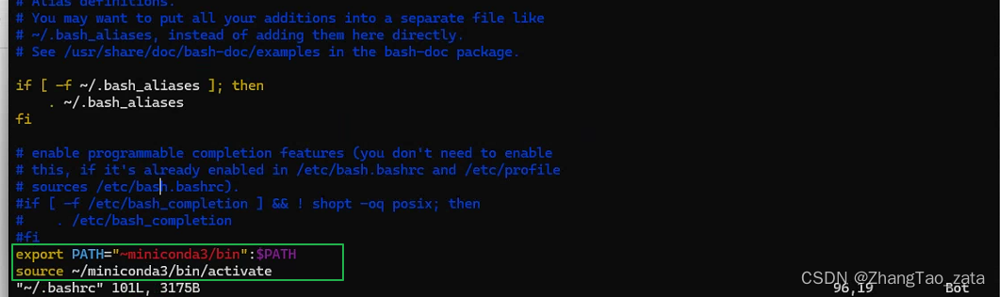
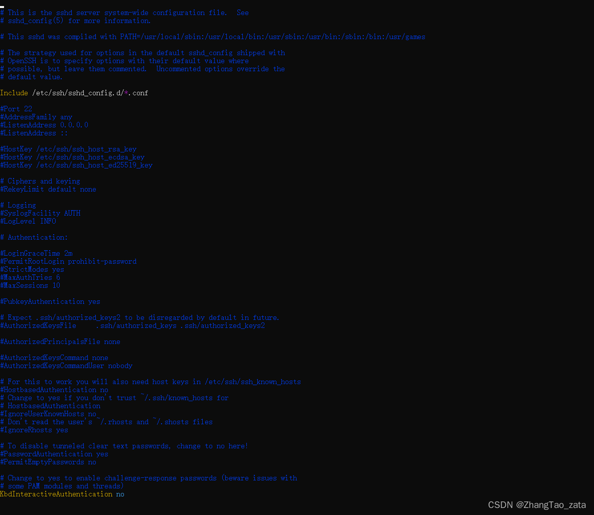
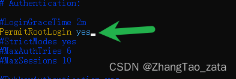
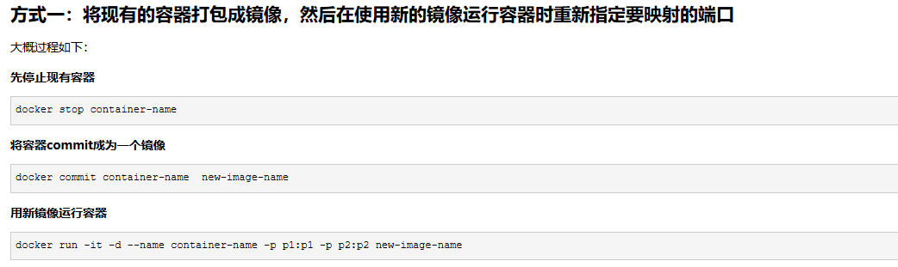
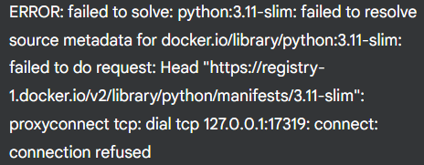
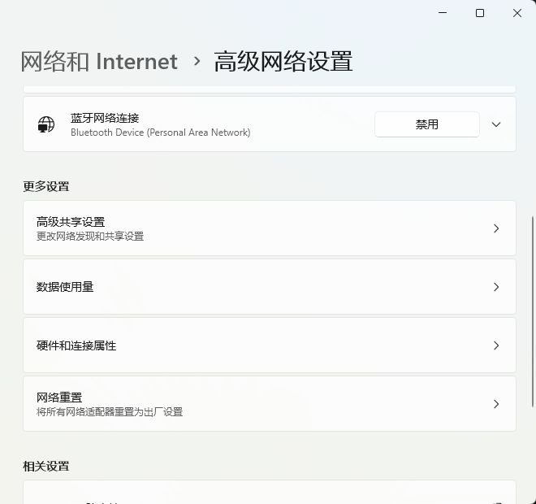
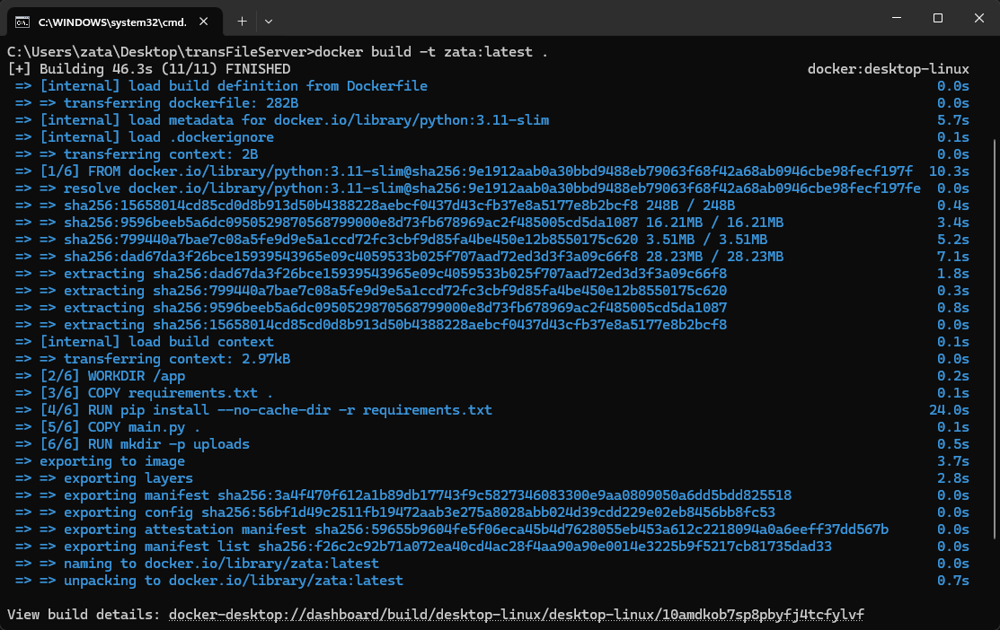

```bash 
# Docker 常用命令汇总

# 将容器的当前状态保存为新的镜像
docker commit <my-container> <my-new-image>:[tag]   


```
镜像 (Image) 相关命令

镜像是创建容器的基础，包含了应用程序及其依赖的环境。

| 命令 | 描述 |
| :--- | :--- |
| `docker images` | 列出本地所有镜像。 |
| `docker pull [镜像名]:[标签]` | 从 Docker Hub 或其他镜像仓库拉取镜像 (例如: `docker pull ubuntu:22.04`)。 |
| `docker push [用户名]/[镜像名]:[标签]` | 将本地镜像推送到 Docker Hub 或其他镜像仓库。 |
| `docker build -t [镜像名]:[标签] .` | 根据当前目录下的 Dockerfile 构建镜像 (例如: `docker build -t my-app:1.0 .`)。 |
| `docker rmi [镜像ID或镜像名]` | 删除一个或多个镜像 (例如: `docker rmi ubuntu:22.04`)。 |
| `docker tag [源镜像] [新镜像名]` | 为本地镜像添加一个新的标签 (例如: `docker tag my-app:1.0 my-app:latest`)。 |
| `docker history [镜像名]` | 查看镜像的构建历史。 |
| `docker save -o [文件名.tar] [镜像名]` | 将镜像保存为一个 tar 归档文件。 |
| `docker load -i [文件名.tar]` | 从一个 tar 归档文件加载镜像。 |
| `docker rmi $(docker images -qf "dangling=true")` | 删除所有悬空的（dangling）镜像。 |

 容器 (Container) 相关命令

容器是镜像的运行实例，是真正运行应用程序的地方。

| 命令 | 描述 |
| :--- | :--- |
| `docker run [选项] [镜像名] [命令]` | 创建并启动一个新的容器。 |
| `docker ps` | 列出所有正在运行的容器。 |
| `docker ps -a` | 列出所有容器（包括已停止的）。 |
| `docker start [容器ID或容器名]` | 启动一个或多个已停止的容器。 |
| `docker stop [容器ID或容器名]` | 停止一个或多个正在运行的容器。 |
| `docker restart [容器ID或容器名]` | 重启一个容器。 |
| `docker rm [容器ID或容器名]` | 删除一个或多个容器。 |
| `docker rm -f $(docker ps -aq)` | 强制删除所有容器（无论运行中还是已停止）。 |
| `docker logs [容器ID或容器名]` | 查看容器的日志输出 (`-f` 选项可以持续跟踪日志)。 |
| `docker exec -it [容器ID] [命令]` | 在正在运行的容器中执行一个交互式命令 (例如: `docker exec -it my-nginx /bin/bash`)。 |
| `docker cp [本地路径] [容器ID]:[容器内路径]` | 在宿主机和容器之间复制文件/文件夹。 |
| `docker stats` | 实时显示容器的资源使用情况。 |
| `docker top [容器ID]` | 查看容器内运行的进程。 |
| `docker inspect [容器ID或镜像ID]`| 查看容器或镜像的详细信息（元数据）。|

### `docker run` 常用选项

* `-d`: 后台运行容器（detached mode）。
* `-p [宿主机端口]:[容器端口]`: 端口映射。
* `-v [宿主机路径]:[容器内路径]`: 数据卷挂载。
* `--name [容器名]`: 为容器指定一个名称。
* `-it`: 启动交互式会话 (`-i` 交互, `-t` 分配一个伪终端)。
* `--rm`: 容器停止后自动删除。
* `-e [环境变量名]=[值]`: 设置环境变量。
* `--network [网络名]`: 将容器连接到指定网络。

**示例:**
`docker run -d -p 8080:80 --name my-web-server -v /webapp:/usr/share/nginx/html nginx`

 Docker Compose 相关命令

用于定义和运行多容器 Docker 应用程序的工具。

| 命令 | 描述 |
| :--- | :--- |
| `docker-compose up` | 根据 `docker-compose.yml` 创建并启动所有服务。 |
| `docker-compose up -d` | 在后台创建并启动所有服务。 |
| `docker-compose down` | 停止并移除由 `up` 创建的容器、网络、卷。 |
| `docker-compose ps` | 列出 `docker-compose.yml` 文件中定义的所有容器的状态。 |
| `docker-compose logs` | 查看所有服务的日志。 |
| `docker-compose logs -f [服务名]` | 实时跟踪特定服务的日志。 |
| `docker-compose build` | 构建或重新构建服务。 |
| `docker-compose pull` | 拉取服务依赖的镜像。 |
| `docker-compose exec [服务名] [命令]` | 在指定的服务容器中执行命令。 |
| `docker-compose stop` | 停止服务，但不删除容器。 |
| `docker-compose start` | 启动已停止的服务。 |

 系统与资源管理命令

| 命令 | 描述 |
| :--- | :--- |
| `docker system prune` | 清理系统中未使用的 Docker 资源（容器、镜像、网络、卷）。 |
| `docker system prune -a --volumes` | 更彻底的清理，会删除所有未使用的镜像和数据卷。 **请谨慎使用！** |
| `docker system df` | 查看 Docker 的磁盘使用情况。 |
| `docker volume ls` | 列出所有的数据卷。 |
| `docker volume rm [卷名]` | 删除一个或多个数据卷。 |
| `docker network ls` | 列出所有的网络。 |
| `docker network rm [网络名]` | 删除一个或多个网络。 |
| `docker login` | 登录到 Docker Hub 或其他镜像仓库。 |
| `docker logout` | 登出 Docker Hub 或其他镜像仓库。 |
| `docker info` | 显示 Docker 系统范围的信息。 |
| `docker version` | 显示 Docker 的版本信息。 |


### docker容器相关命令
#### 1. 拉取镜像

```bash
docker pull ubuntu
```

#### 2.查看镜像是否拉取成功

```bash
docker images
```

#### 3. 运行容器

```bash
docker run -itd --name <容器名称>  -p <主机端口>:<容器端口> --cpus=30  ubuntu
# -p设置端口   --cpus/-c 设置核心 
```

#### 4. 通过 exec 命令进入 ubuntu 容器

```bash
docker exec -it <容器名>  /bin/bash
```
#### 5. 安装ssh
```bash
apt-get updata

apt-get install openssh-client
apt-get install openssh-server

```
#### 6. 安装vim

```bash
apt-get install vim
```

#### 7. 安装conda 
https://zhuanlan.zhihu.com/p/307923089
注意，可能要手动配置环境变量





#### 8. 安装zip、unzip

```bash
apt-get install zip 
apt-get install unzip 
```
#### 9. 解决中文乱码问题

```python
export LC_ALL="C.UTF-8"
source /etc/bash.bashrc
```

#### 10. 安装sudo

```bash
apt-get install sudo
```


-------------
-------------
-------------
-------------

### Docker使用技巧

#### 使用已有容器创建镜像

```bash
docker commit container-name  new-image-name
```
#### 开启/重启ssh服务

```bash
service ssh start 
service ssh restart 
```

#### docker 文件传输
宿主机到容器
```bash
# docker cp 宿主机文件/路径 容器名：容器内路径
docker cp /home/Download/index.html wordpress-lee:/var/www/html
```

容器到宿主机
```bash
# docker cp 容器名：文件/路径 宿主机路径 
docker cp wordpress-lee:/root/example.sh /root
```

#### 修改服务器配置允许通过此服务器进行ssh转发
进入配置文件，不要cd..然后在vim，直接vim  ...
```bash
vim /etc/ssh/sshd_config
```
配置文件内容



修改其中的：




 重启ssh服务

```bash
 service ssh restart
```

#### docker容器添加对外映射端口

|参考：|
|---|
|https://www.cnblogs.com/zhumengke/articles/13525837.html|


最简单省事方法：将现有的容器打包成镜像，然后在使用新的镜像运行容器时重新指定要映射的端口




#### docker设置可用CPU核心数量

|参考：|
|---|
|https://www.cnblogs.com/sparkdev/p/8052522.html|


### 实战

#### wsl中镜像网络与docker网络冲突，使用netsh winsock reset修改网络设置之后，docker连不上 -- 解决

报错信息


解决方法，将wsl setting的网络调到默认的nat模式，然后重置网络



然后就ok了


