- [docker容器常用命令](#docker容器常用命令)
  - [镜像 (Image) 相关命令](#镜像-image-相关命令)
  - [容器 (Container) 相关命令](#容器-container-相关命令)
  - [`docker run` 常用选项](#docker-run-常用选项)
  - [Docker Compose 相关命令](#docker-compose-相关命令)
  - [系统与资源管理命令](#系统与资源管理命令)
  - [简单开始一个docker镜像的使用](#简单开始一个docker镜像的使用)

- [Docker使用技巧](#docker使用技巧)

  
  - [docker的卷挂载功能](#docker的卷挂载功能)
  - [将镜像推送到远程仓库](#将镜像推送到远程仓库)
  - [Docker Context 教程](#docker-context-教程)
  - [在 Windows 上实现 Docker in Docker (DinD) 终极教程](#在-windows-上实现-docker-in-docker-dind-终极教程)
  - [使用已有容器创建镜像](#使用已有容器创建镜像)
  - [开启/重启ssh服务](#开启重启ssh服务)
  - [docker 文件传输](#docker-文件传输)
  - [修改服务器配置允许通过此服务器进行ssh转发](#修改服务器配置允许通过此服务器进行ssh转发)
  - [docker容器添加对外映射端口](#docker容器添加对外映射端口)
  - [docker设置可用CPU核心数量](#docker设置可用cpu核心数量)
  - [容器端口转发问题排查和解决方案](#容器端口转发问题排查和解决方案)
  - [局域网访问Docker容器完整指南](#局域网访问docker容器完整指南)
  - [docker设置可用CPU核心数量](#docker设置可用cpu核心数量)

- [docker实战](#docker实战)
  - [Docker使用实战-MySQL和Ubuntu容器](#docker使用实战-mysql和ubuntu容器)
    - [1. 安装docker mysql容器](#1-安装docker-mysql容器)
    - [2. 安装Ubuntu容器并配置](#2-安装ubuntu容器并配置)
  - [Docker使用实战-容器保存和迁移](#docker使用实战-容器保存和迁移)
    - [方法一：将容器保存为镜像](#方法一将容器保存为镜像)
    - [方法二：直接导出容器](#方法二直接导出容器)
  - [Docker 服务部署教程](#docker-服务部署教程)
    - [环境准备](#环境准备)
    - [实战演练：部署一个 Python Web 应用](#实战演练部署一个-python-web-应用)
    - [进阶：使用 Docker Compose 编排服务](#进阶使用-docker-compose-编排服务)
  - [Docker服务部署教程2-使用uv替代pip](#docker服务部署教程2-使用uv替代pip)
    - [使用 UV 的核心改动](#使用-uv-的核心改动)
    - [更新后的 `Dockerfile` (使用 uv)](#更新后的-dockerfile-使用-uv)
  - [docker容器的部署教程3-将容器部署到服务器上](#docker容器的部署教程3-将容器部署到服务器上)
    - [核心流程](#核心流程)
    - [第四步：选择部署方案 (Deploy)](#第四步选择部署方案-deploy)
    - [如何选择？](#如何选择)
  - [运行容器了但是并没有生效-通过查看日志解决问题](#运行容器了但是并没有生效-通过查看日志解决问题)
    - [第一步：检查容器是否正在运行](#第一步检查容器是否正在运行)
    - [第二步：查看容器日志](#第二步查看容器日志)
    - [第三步：常见问题和解决方案汇总](#第三步常见问题和解决方案汇总)
    - [from werkzeug.urls import url_quote 问题根源](#from-werkzeugurls-import-url_quote-问题根源)
    - [解决方案](#解决方案)
  - [wsl中镜像网络与docker网络冲突，使用netsh winsock reset修改网络设置之后，docker连不上 -- 解决](#wsl中镜像网络与docker网络冲突使用netsh-winsock-reset修改网络设置之后docker连不上----解决)
  - [具有SSL证书的后端在docker环境中出现问题](#具有SSL证书的后端在docker环境中出现问题)


# 常用命令

**docker 单机常用命令**
```bash
# 列出所有正在运行的容器
docker ps [-a]

# 停止并删除容器
docker stop <容器ID或容器名>
docker rm <容器ID或容器名>


# 删除指定卷
docker volume rm <卷ID或卷名>

# 查看所有容器的统计信息, --no-stream 不实时更新
docker stats [容器ID或容器名] [--no-stream]

# 清理所有停止的容器
docker rm $(docker ps -aq)
# 清理所有悬空的镜像
docker rmi $(docker images -qf "dangling=true")
# 清理所有悬空的网络
docker network prune $(docker network ls -qf "dangling=true")
# 清理所有悬空的卷
docker volume prune $(docker volume ls -qf "dangling=true")

# 将容器的当前状态保存为新的镜像
docker commit <my-container> <my-new-image> [:tag]    # 如果tag不填就默认是latest
```


**docker swarm 常用命令**
```bash
# 初始化 Swarm 集群（管理节点）
docker swarm init --advertise-addr <IP地址>

# 获取管理节点加入命令 
docker swarm join-token manager

# 获取加入集群的命令（在工作节点执行）
docker swarm join-token worker

# 加入 Swarm 集群
docker swarm join --token <token>   --advertise-addr <IP地址>  --data-path-addr <IP地址>  --listen-addr 0.0.0.0:2377  <管理节点IP>:2377

# 离开 Swarm 集群
docker swarm leave

# 强制离开集群
docker swarm leave --force

# 更新 Swarm 配置
docker swarm update --param value

# 查看集群节点列表
docker node ls

# 查看节点详细信息
docker node inspect <节点ID或名称>

# 更新节点属性
docker node update --availability active/pause/drain <节点ID>

# 提升节点为管理节点
docker node promote <节点ID>

# 降级管理节点为工作节点
docker node demote <节点ID>

# 删除节点
docker node rm <节点ID>

# 创建服务
docker service create --name <服务名> --replicas <副本数> -p <端口> <镜像名>

# 查看服务列表
docker service ls

# 查看服务详细信息
docker service inspect <服务名>

# 查看服务运行的任务
docker service ps <服务名>

# 扩展服务副本数
docker service scale <服务名>=<副本数>

# 更新服务配置
docker service update --image <新镜像> <服务名>

# 更新服务端口
docker service update --publish-add <端口> <服务名>

# 删除服务
docker service rm <服务名>

# 查看服务日志
docker service logs <服务名>


# 创建覆盖网络
docker network create --driver overlay <网络名>

# 查看网络列表
docker network ls


```


镜像 (Image) 相关命令

镜像是创建容器的基础，包含了应用程序及其依赖的环境。

| 命令 | 描述 |
| :--- | :--- |
| `docker images` | 列出本地所有镜像。 |
| `docker pull [镜像名]:[标签]` | 从 Docker Hub 或其他镜像仓库拉取镜像 (例如: `docker pull ubuntu:22.04`)。 |
| `docker push [用户名]/[镜像名]:[标签]` | 将本地镜像推送到 Docker Hub 或其他镜像仓库。 |
| `docker build -t [镜像名]:[标签] .` | 根据当前目录下的 Dockerfile 构建镜像 (例如: `docker build -t my-app:1.0 .`)。 |
| `docker rmi [镜像ID或镜像名]` | 删除一个或多个镜像 (例如: `docker rmi ubuntu:22.04`)。 |
| `docker tag [源镜像] [新镜像名]` | 为本地镜像添加一个新的标签 (例如: `docker tag my-app:1.0 my-app:latest`)。 |
| `docker history [镜像名]` | 查看镜像的构建历史。 |
| `docker save -o [文件名.tar] [镜像名]` | 将镜像保存为一个 tar 归档文件。 |
| `docker load -i [文件名.tar]` | 从一个 tar 归档文件加载镜像。 |
| `docker rmi $(docker images -qf "dangling=true")` | 删除所有悬空的（dangling）镜像。 |

 容器 (Container) 相关命令

容器是镜像的运行实例，是真正运行应用程序的地方。

| 命令 | 描述 |
| :--- | :--- |
| `docker run [选项] [镜像名] [命令]` | 创建并启动一个新的容器。 |
| `docker ps` | 列出所有正在运行的容器。 |
| `docker ps -a` | 列出所有容器（包括已停止的）。 |
| `docker start [容器ID或容器名]` | 启动一个或多个已停止的容器。 |
| `docker stop [容器ID或容器名]` | 停止一个或多个正在运行的容器。 |
| `docker restart [容器ID或容器名]` | 重启一个容器。 |
| `docker rm [容器ID或容器名]` | 删除一个或多个容器。 |
| `docker rm -f $(docker ps -aq)` | 强制删除所有容器（无论运行中还是已停止）。 |
| `docker logs [容器ID或容器名]` | 查看容器的日志输出 (`-f` 选项可以持续跟踪日志)。 |
| `docker exec -it [容器ID] [命令]` | 在正在运行的容器中执行一个交互式命令 (例如: `docker exec -it my-nginx /bin/bash`)。 |
| `docker cp [本地路径] [容器ID]:[容器内路径]` | 在宿主机和容器之间复制文件/文件夹。 |
| `docker stats` | 实时显示容器的资源使用情况。 |
| `docker top [容器ID]` | 查看容器内运行的进程。 |
| `docker inspect [容器ID或镜像ID]`| 查看容器或镜像的详细信息（元数据）。|

### `docker run` 常用选项

* `-d`: 后台运行容器（detached mode）。
* `-p [宿主机端口]:[容器端口]`: 端口映射。
* `-v [宿主机路径]:[容器内路径]`: 数据卷挂载。
* `--name [容器名]`: 为容器指定一个名称。
* `-it`: 启动交互式会话 (`-i` 交互, `-t` 分配一个伪终端)。
* `--rm`: 容器停止后自动删除。
* `-e [环境变量名]=[值]`: 设置环境变量。
* `--network [网络名]`: 将容器连接到指定网络。

**示例:**
`docker run -d -p 8080:80 --name my-web-server -v /webapp:/usr/share/nginx/html nginx`

 Docker Compose 相关命令

用于定义和运行多容器 Docker 应用程序的工具。

| 命令 | 描述 |
| :--- | :--- |
| `docker-compose up` | 根据 `docker-compose.yml` 创建并启动所有服务。 |
| `docker-compose up -d` | 在后台创建并启动所有服务。 |
| `docker-compose down` | 停止并移除由 `up` 创建的容器、网络、卷。 |
| `docker-compose ps` | 列出 `docker-compose.yml` 文件中定义的所有容器的状态。 |
| `docker-compose logs` | 查看所有服务的日志。 |
| `docker-compose logs -f [服务名]` | 实时跟踪特定服务的日志。 |
| `docker-compose build` | 构建或重新构建服务。 |
| `docker-compose pull` | 拉取服务依赖的镜像。 |
| `docker-compose exec [服务名] [命令]` | 在指定的服务容器中执行命令。 |
| `docker-compose stop` | 停止服务，但不删除容器。 |
| `docker-compose start` | 启动已停止的服务。 |

 系统与资源管理命令

| 命令 | 描述 |
| :--- | :--- |
| `docker system prune` | 清理系统中未使用的 Docker 资源（容器、镜像、网络、卷）。 |
| `docker system prune -a --volumes` | 更彻底的清理，会删除所有未使用的镜像和数据卷。 **请谨慎使用！** |
| `docker system df` | 查看 Docker 的磁盘使用情况。 |
| `docker volume ls` | 列出所有的数据卷。 |
| `docker volume rm [卷名]` | 删除一个或多个数据卷。 |
| `docker network ls` | 列出所有的网络。 |
| `docker network rm [网络名]` | 删除一个或多个网络。 |
| `docker login` | 登录到 Docker Hub 或其他镜像仓库。 |
| `docker logout` | 登出 Docker Hub 或其他镜像仓库。 |
| `docker info` | 显示 Docker 系统范围的信息。 |
| `docker version` | 显示 Docker 的版本信息。 |


# docker 安装

## 阿里云安装docker

**阿里云服务器**
 ```bash

# 先下载 GPGkey
sudo curl -fsSL https://mirrors.aliyun.com/docker-ce/linux/ubuntu/gpg -o /etc/apt/keyrings/docker.asc                                                      
sudo chmod a+r /etc/apt/keyrings/docker.asc  


# Add the Aliyun Repository
echo "deb [arch=$(dpkg --print-architecture) signed-by=/etc/apt/keyrings/docker.asc] https://mirrors.aliyun.com/docker-ce/linux/ubuntu $(lsb_release -cs) stable" | sudo tee /etc/apt/sources.list.d/docker.list > /dev/null 
 # Update your Package List
sudo apt-get update

 # Install Docker 
sudo apt-get install -y docker-ce docker-ce-cli containerd.io docker-buildx-plugin docker-compose-plugin


#配置镜像加速
sudo mkdir -p /etc/docker

sudo tee /etc/docker/daemon.json <<-'EOF'
{
  "registry-mirrors": ["https://docker.m.daocloud.io","https://<你的加速镜像地址，进入阿里云镜像加速服务获取>.mirror.aliyuncs.com","https://mirror.ccs.tencentyun.com"]

}
EOF

#设置docker服务自启
sudo systemctl daemon-reload
sudo systemctl enable --now docker
sudo systemctl enable containerd


 # verify the installation
docker version
docker compose version

#------------------------------------------
# 到这里docker到安装完成，下面是docker swarm的安装
#------------------------------------------

# 初始化docker swarm 集群 --advertise-addr <ip地址> #如果没有指定，默认是当前机器的局域网ip地址
docker swarm init --advertise-addr <公网ip地址>

```

## 腾讯云安装docker
**腾讯云服务器**
```bash
sudo install -m 0755 -d /etc/apt/keyrings

curl -fsSL http://mirrors.tencentyun.com/docker-ce/linux/ubuntu/gpg | sudo gpg --dearmor -o /etc/apt/keyrings/docker.gpg

sudo chmod a+r /etc/apt/keyrings/docker.gpg

echo "deb [arch=$(dpkg --print-architecture) signed-by=/etc/apt/keyrings/docker.gpg] http://mirrors.tencentyun.com/docker-ce/linux/ubuntu \
  $(. /etc/os-release && echo "$VERSION_CODENAME") stable" | sudo tee /etc/apt/sources.list.d/docker.list > /dev/null

sudo apt-get update

sudo apt-get install -y docker-ce docker-ce-cli containerd.io docker-buildx-plugin docker-compose-plugin


sudo mkdir -p /etc/docker

sudo tee /etc/docker/daemon.json <<-'EOF'
{
  "registry-mirrors": ["https://mirror.ccs.tencentyun.com"]
}
EOF

sudo systemctl daemon-reload
sudo systemctl restart docker

sudo systemctl enable --now docker
sudo systemctl enable containerd
```


## windows 安装docker desktop


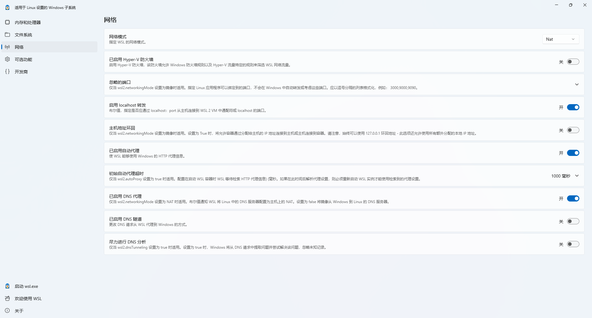

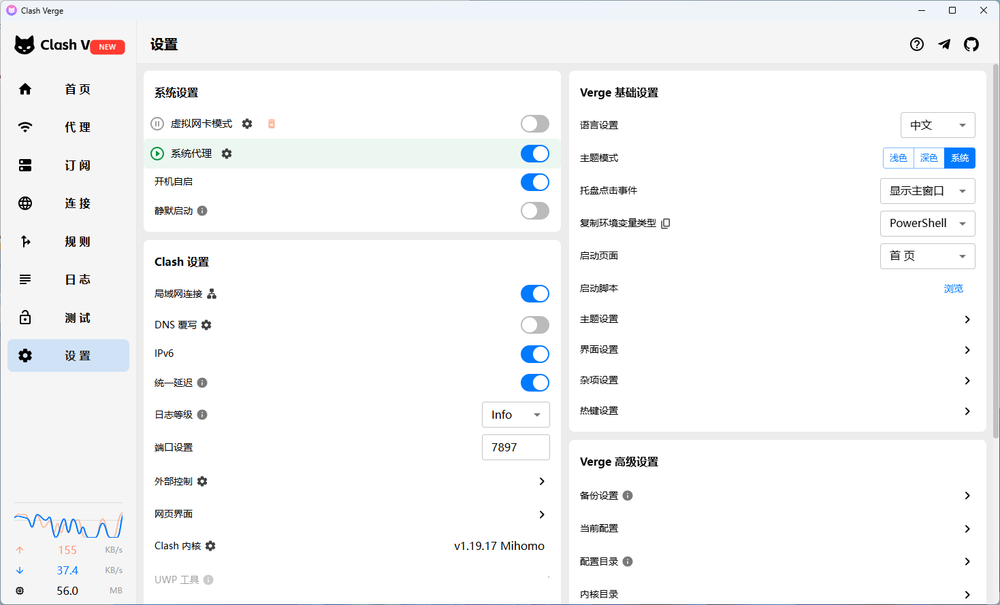

如果需要查询vpm有没有在容器里面生效

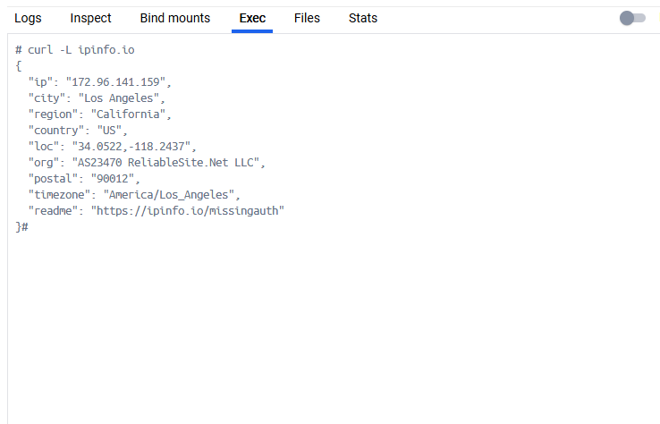


# 注意事项


# 使用指南


### docker自动创建的数据卷自动挂载到 /mnt


在很多场景下，我们习惯让 Docker 自己管理数据卷（即 Named Volumes，比如 `docker volume create my_vol`）。这些卷默认存放在 `/var/lib/docker/volumes/`。

如果你想让 Docker 把这些自己创建的卷也放到 `/mnt` 里，这里有三种方案，请根据实际需求选择：

**方案 A：修改全局默认存储路径（强烈推荐，一劳永逸）**

这是最规范的做法。它不仅会把数据卷存到 `/mnt`，还会把拉取的镜像、容器日志等所有 Docker 数据都转移过去，彻底解放系统盘。

操作步骤：

1.  **停止 Docker 服务：**

    ```bash
    sudo systemctl stop docker

    #如果docker.socket服务没有停止，需要先停止它
    sudo systemctl stop docker.socket
    ```

2.  **修改或创建配置文件：**
    编辑 `/etc/docker/daemon.json` 文件：

    ```bash
    sudo nano /etc/docker/daemon.json
    ```

    写入以下配置（假设你要把数据存在 `/mnt/docker_data`）：

    ```json
    {
      "data-root": "/mnt/docker_data"
    }
    ```

3.  **（重要）迁移历史数据：**
    为了防止你以前创建的容器和镜像丢失，务必将原数据同步到新目录：

    ```bash
    sudo rsync -aP /var/lib/docker/ /mnt/docker_data/
    ```

4.  **重启 Docker：**

    ```bash
    sudo systemctl start docker
    ```

**效果：** 以后你执行任何关于 Docker 的操作，数据都会自动落在大硬盘 `/mnt/docker_data` 里了！

**方案 B：使用软链接（简单粗暴）**

如果你只想把数据卷（Volumes）挪到 `/mnt`，而镜像等其他数据还要留在系统盘，可以使用 Linux 的软链接魔法。

操作步骤：

1.  停止服务：`sudo systemctl stop docker`
2.  在 `/mnt` 创建目标文件夹：`sudo mkdir -p /mnt/docker_volumes`
3.  迁移现有的卷数据：`sudo mv /var/lib/docker/volumes/* /mnt/docker_volumes/`
4.  删除原本的空文件夹：`sudo rm -rf /var/lib/docker/volumes`
5.  创建软链接：

    ```bash
    sudo ln -s /mnt/docker_volumes /var/lib/docker/volumes
    ```

6.  重启服务：`sudo systemctl start docker`

**效果：** 欺骗了 Docker。Docker 以为自己还是写在 `/var/lib` 下，但实际上数据已经悄悄存进了 `/mnt`。

**方案 C：在 Docker Compose 中按需指定物理路径（优雅灵活）**

如果你不想修改系统的任何配置，只想在部署某个特定项目时，让它自己的数据卷落在 `/mnt`，可以在定义 volume 时使用 local 驱动。

这在编写 `docker-compose.yml` 时非常实用：

```yaml
version: '3.8'
services:
  db:
    image: mysql:8.0
    volumes:
      - mysql_data:/var/lib/mysql

volumes:
  mysql_data:
    driver: local
    driver_opts:
      type: none
      o: bind
      device: /mnt/my_project/mysql_data
```

**效果：** 既保留了 Named Volumes 的便捷性，又实现了数据的物理分离，非常适合项目迁移和备份。

**总结建议**

*   如果你的系统盘马上就要满了：别犹豫，直接用 **方案 A**，修改 `data-root` 把整个 Docker 搬家到大硬盘。
*   如果你只是想把项目数据单独分类存放大盘：推荐 **方案 C**，在 `docker-compose.yml` 中使用 `driver_opts`，干净且优雅。

希望这篇文章能帮你解决 Docker 存储空间的烦恼！如果遇到权限问题（Permission Denied），记得检查 `/mnt` 对应目录的用户权限哦（chown）。

(Tags: Docker, Linux, 运维，存储优化，DockerVolume)


### 简单开始一个docker镜像的使用

#### 1. 拉取镜像

```bash
docker pull ubuntu
```

#### 2.查看镜像是否拉取成功

```bash
docker images
```

#### 3. 运行容器

```bash
docker run -itd --name <容器名称>  -p <主机端口>:<容器端口> --cpus=30  ubuntu
# -p设置端口   --cpus/-c 设置核心 
```

#### 4. 通过 exec 命令进入 ubuntu 容器

```bash
docker exec -it <容器名>  /bin/bash
```
#### 5. 安装ssh
```bash
apt-get update

apt-get install openssh-client -y
apt-get install openssh-server -y

```
#### 6. 安装vim

```bash
apt-get install vim -y
```

#### 7. 安装conda 
https://zhuanlan.zhihu.com/p/307923089
注意，可能要手动配置环境变量


#### 8. 安装zip、unzip

```bash
apt-get install zip 
apt-get install unzip 
```
#### 9. 解决中文乱码问题

```python
export LC_ALL="C.UTF-8"
source /etc/bash.bashrc
```

#### 10. 安装sudo

```bash
apt-get install sudo
```

### Docker使用实战-MySQL和Ubuntu容器

#### 1. 安装docker mysql容器

##### 首先拉取mysql镜像 ，默认拉取最新版

```bash
docker pull mysql
```

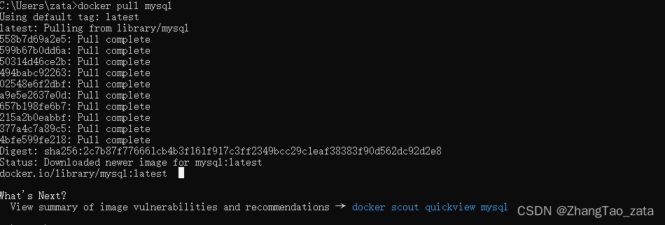

##### 然后创建容器

```bash
docker run --name mysql_zata -p 3306:3306 -e MYSQL_ROOT_PASSWORD=123456 mysql  #第一个端口是主机的端口
或
docker run --name mysql_zata -p 53306:3306 -e MYSQL_ROOT_PASSWORD=123456 mysql
```

| 参数 |解释  |
|--|--|
|docker run: |创建Docker容器的命令。|
|--name  mysql_zata | 这个选项用于指定容器的名称，这里将容器命名为"mysql_zata"。 |
|-p 3306:3306: [第一个3306是主机的端口可以改成其他的，第二个3306是容器的端口，也就是要固定的]可以改成如： <br> -p 53306：3306
| 这个选项用于将容器内部的端口映射到宿主机上。具体来说，-p 3306:3306 将容器内部的MySQL数据库服务的端口3306映射到宿主机的端口3306。这样，您可以通过宿主机上的3306端口访问容器内的MySQL服务。|
|-e MYSQL_ROOT_PASSWORD=123456: |这个选项用于设置MySQL数据库的root用户的密码。在这里，密码被设置为"123456"。这是一个环境变量设置，MySQL容器会使用这个密码来授权root用户访问数据库。|
|mysql:| 这是要运行的Docker镜像的名称。在这里，它是MySQL镜像，意味着会启动一个MySQL数据库容器。|

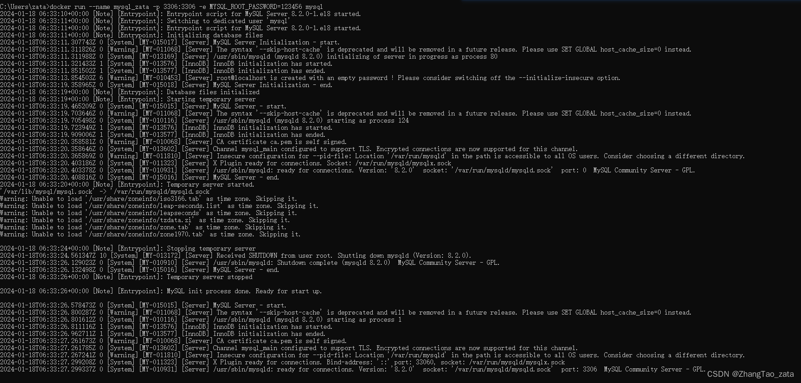

现在是前台模式创建的（我也不是很清楚，反正关闭这个窗口服务就会停掉），关闭窗口也没事，可以重新再windows的docker界面重开


#### 2. 安装Ubuntu容器并配置

##### 1. 拉取镜像

```bash
docker pull ubuntu
```

##### 2.查看镜像是否拉取成功

```bash
docker images
```

##### 3. 运行容器

```bash
docker run -itd --name <容器名称>  -p <主机端口>:<容器端口>   ubuntu 
```

##### 4. 通过 exec 命令进入 ubuntu 容器

```bash
docker exec -it <容器名>  /bin/bash
```
##### 5. 安装ssh并启动
```bash
apt-get updata

apt-get install openssh-client
apt-get install openssh-server

# 启动
sudo service ssh start
```
##### 6. 安装vim

```bash
apt-get install vim
```

##### 7. 安装conda 
https://zhuanlan.zhihu.com/p/307923089

注意，可能要手动配置环境变量（如果能直接用也就不用配置）


##### 8. 安装zip、unzip

```bash
apt-get install zip 
apt-get install unzip 
```
##### 9. 解决中文乱码问题

```python
export LC_ALL="C.UTF-8"
source /etc/bash.bashrc
```

##### 10. 安装sudo

```bash
apt-get install sudo
```


-------------
-------------
-------------
-------------

### Docker使用技巧


#### docker的卷挂载功能
```bash
docker run -v <host_path>:<container_path> <image_name>

# 需要为每一个路径都添加-v
docker run -v <host_path1>:<container_path1> -v <host_path2>:<container_path2> ... <image_name>  
```

windows环境下面的特殊情况（路径反斜杠）
示例： 假设你想将 Windows 上的 C:\data 映射到容器内的 /app/data
```bash
docker run -v /c/data:/app/data -it <image_name> /bin/bash


# 如果路径存在空格，需要用""包起来 如
docker run -v "/c/Program Files/my folder:/app" -it <image_name>
```


#### 将镜像推送到远程仓库

推送到公开
```bash
docker login
docker tag my-app:1.0 myusername/my-app:1.0 
docker push myusername/my-app:1.0
```


到私有
```bash
docker login registry.example.com  # 如果是docker hub 只需要 login in
docker tag my-app:1.0 registry.example.com/myusername/my-app:1.0  # 重命名tag
docker push registry.example.com/myusername/my-app:1.0
```

#### Docker Context 教程

### 什么是 Docker Context？

在深入了解之前，我们首先需要理解 Docker Context 的概念。简单来说，**Docker Context** 是 Docker CLI（命令行工具）用来连接和管理不同 Docker 守护进程（Docker daemon）或 Kubernetes 集群的配置集合。

在 Docker CLI 的早期版本中，我们通常使用 `DOCKER_HOST` 环境变量来指定要连接的远程 Docker daemon。这种方式虽然有效，但对于需要频繁切换不同环境（例如：本地开发、远程测试服务器、生产环境等）的开发者来说，管理起来非常不便，因为它要求每次切换时都手动更改环境变量。

Docker Context 解决了这个问题。它允许你将连接信息（如主机地址、证书等）保存为一个命名的配置，并可以通过简单的命令 (`docker context use`) 在这些配置之间快速切换，而无需手动管理环境变量。

一个 Docker Context 可以包含：

  * **Docker Endpoint**：Docker 守护进程的地址（例如：`tcp://<host>:<port>` 或 `ssh://<user>@<host>`）。
  * **Kubernetes Endpoint**：Kubernetes API 服务器的地址。
  * **安全认证信息**：用于连接的证书和密钥。

默认情况下，当你安装 Docker 后，会自动创建一个名为 `default` 的上下文，它指向你本地的 Docker 守护进程。

### 为什么使用 Docker Context？

  * **简化工作流**：无需频繁设置和取消 `DOCKER_HOST` 环境变量。
  * **集中管理**：将所有不同环境的连接配置集中管理。
  * **支持多种环境**：不仅支持远程 Docker daemon，还支持连接到 Kubernetes 集群。
  * **安全**：可以方便地管理和切换不同环境的安全认证信息。

-----

### Docker Context 常用命令

在使用 Docker Context 之前，您需要确保您的 Docker 版本在 19.03 或更高。

#### 1\. 查看现有上下文

`docker context ls` 命令用于列出所有已定义的上下文。

```bash
docker context ls
```

您将看到类似以下的输出：

```
NAME                DESCRIPTION                         DOCKER ENDPOINT                                        KUBERNETES ENDPOINT                          ORCHESTRATOR
default * Current DOCKER_HOST based configuration unix:///var/run/docker.sock                                                                swarm
```

  * `NAME`：上下文的名称。
  * `*`：星号表示当前正在使用的上下文。
  * `DESCRIPTION`：对上下文的描述。
  * `DOCKER ENDPOINT`：Docker 守护进程的连接地址。
  * `KUBERNETES ENDPOINT`：如果上下文用于 Kubernetes，则显示其连接地址。

#### 2\. 创建新上下文

`docker context create` 命令用于创建一个新的上下文。

**创建连接到远程 Docker daemon 的上下文**

有几种方式可以连接远程 Docker daemon，最常见的是通过 SSH 或 TCP。

**a) 通过 SSH 连接**

这是最推荐和最安全的连接方式。您需要确保：

  * 本地机器已配置好无密码 SSH 登录远程主机。
  * 远程主机上已安装 Docker，且当前用户有权限执行 `docker` 命令（通常通过将用户添加到 `docker` 用户组来实现）。

<!-- end list -->

```bash
docker context create <context_name> --description "<description>" --docker "host=ssh://<username>@<remote_host>"
```

**示例：**

假设您的远程主机 IP 为 `192.168.1.100`，用户名为 `ubuntu`。

```bash
docker context create remote-server --description "Remote Docker daemon on dev server" --docker "host=ssh://ubuntu@192.168.1.100"
```

**b) 通过 TCP 连接**

这种方式需要远程 Docker daemon 暴露在 TCP 端口上，并且通常需要TLS加密来保证安全。

  * **警告**：不建议在没有TLS加密的情况下通过公共网络连接。

<!-- end list -->

```bash
# 假设远程 Docker daemon 暴露在 2375 端口
docker context create remote-tcp --description "Insecure remote connection" --docker "host=tcp://192.168.1.100:2375"

# 如果使用 TLS 加密
docker context create remote-tls --description "Secure remote connection" --docker "host=tcp://192.168.1.100:2376" --tls-ca-path <path_to_ca> --tls-cert-path <path_to_cert> --tls-key-path <path_to_key>
```

**c) 创建连接到 Kubernetes 集群的上下文**

如果您已经使用 `kubectl` 配置了集群连接，Docker Context 可以自动从您的 `.kube/config` 文件中加载这些配置。

```bash
docker context create <context_name> --description "<description>" --kubernetes "config-file=<path_to_kubeconfig>" --kubernetes "context=<kube_context_name>"
```

**示例：**

```bash
docker context create k8s-cluster --description "My Kubernetes cluster" --kubernetes "context=my-cluster-context"
```

#### 3\. 切换上下文

`docker context use` 命令用于切换当前活动的上下文。

```bash
docker context use <context_name>
```

**示例：**

```bash
# 切换到之前创建的远程服务器上下文
docker context use remote-server

# 验证当前上下文
docker context ls
```

此时，`docker context ls` 的输出会显示 `remote-server` 旁边有星号 `*`。从现在开始，您所有的 `docker` 命令（例如 `docker ps`、`docker images` 等）都将在远程主机上执行。

#### 4\. 在单次命令中使用特定上下文

如果您只想在某一次命令中使用某个上下文，而不想永久切换，可以使用 `--context` 全局选项。

```bash
docker --context <context_name> <docker_command>
```

**示例：**

```bash
# 在不切换当前上下文的情况下，查看远程服务器上的容器列表
docker --context remote-server ps -a
```

#### 5\. 检查上下文详情

`docker context inspect` 命令可以查看某个上下文的详细配置信息。

```bash
docker context inspect <context_name>
```

**示例：**

```bash
docker context inspect remote-server
```

#### 6\. 更新上下文

`docker context update` 命令可以修改现有上下文的配置。

```bash
docker context update <context_name> --description "New description" --docker "host=..."
```

#### 7\. 移除上下文

`docker context rm` 命令可以删除一个上下文。

```bash
docker context rm <context_name>
```

-----

### 综合示例：从本地切换到远程，再切换回来

这是一个完整的流程，展示了如何利用 Docker Context 简化日常工作。

**步骤 1：检查本地默认上下文**

```bash
# 检查默认上下文，确保指向本地
docker context ls
```

输出应显示 `default *`。

**步骤 2：创建远程上下文**

假设您要连接到 IP 为 `192.168.1.100` 的远程服务器。

```bash
docker context create my-remote-host --description "My development server" --docker "host=ssh://user@192.168.1.100"
```

**步骤 3：切换到远程上下文**

```bash
docker context use my-remote-host
```

此时，您已成功切换到远程环境。

**步骤 4：在远程主机上执行命令**

现在，您可以像操作本地 Docker 一样操作远程 Docker。

```bash
# 查看远程主机上正在运行的容器
docker ps

# 在远程主机上拉取一个镜像
docker pull nginx

# 在远程主机上运行一个新容器
docker run -d --name my-nginx -p 80:80 nginx
```

这些命令的执行都将在 `192.168.1.100` 上完成。

**步骤 5：切换回本地上下文**

当您完成远程操作后，可以轻松切换回本地环境。

```bash
docker context use default
```

**步骤 6：验证切换**

```bash
docker context ls
```

输出应再次显示 `default *`。

现在，您的 `docker` 命令又将作用于本地机器。

通过这个简单的教程，您可以看到 Docker Context 如何极大地简化了多 Docker 环境的管理，使其成为一个高效且安全的工具。

#### 在 Windows 上实现 Docker in Docker (DinD) 终极教程

在 Windows 环境下开发时，我们有时会遇到需要在 Docker 容器内部再次调用 Docker 命令的场景，例如在 Jenkins CI/CD 流水线中构建 Docker 镜像。这个技术通常被称为 "Docker in Docker" (DinD)。

本文将详细介绍在 Windows (通过 Docker Desktop + WSL 2) 中实现 DinD 的两种主流方法，分析其优劣，并提供手把手的操作步骤。

##### 核心概念：两种实现方式

1.  **挂载 Docker Socket (DooD - Docker-out-of-Docker)**: **(官方推荐)** 让容器内的 Docker CLI 直接与宿主机的 Docker 守护进程 (Daemon) 通信。这好比在办公室里装一部电话分机，直接使用公司总机的功能。
2.  **真正的 Docker-in-Docker (DinD)**: 在容器内运行一个全新的、完全隔离的 Docker 守护进程。这好比在办公室里私建一个小基站，内外通信完全独立。

##### 结论先行：哪种方法最适合你？

对于绝大多数场景，**方法一 (挂载 Docker Socket)** 是最佳选择。

| 特性 | 方法一 (挂载 Socket) | 方法二 (真·DinD) |
| :--- | :--- | :--- |
| **推荐度** | ⭐⭐⭐⭐⭐ **(强烈推荐)** | ⭐⭐ (仅特定场景) |
| **隔离性** | 弱 | 强 |
| **安全性** | 较高 (无需特权模式) | 低 (必须使用 `--privileged`) |
| **性能/资源** | 开销极小 | 开销大 (双倍守护进程) |
| **配置复杂度** | 简单 | 复杂 |
| **镜像缓存** | 与宿主机共享 | 独立缓存，占用额外空间 |
| **典型用例** | CI/CD, 开发环境 | 隔离的 Docker 功能测试 |

##### 方法一：挂载 Docker Socket (DooD) - 官方推荐

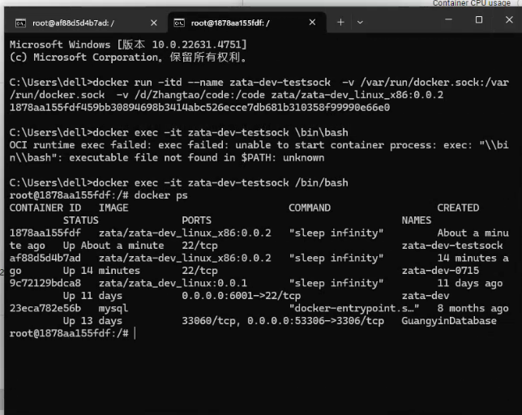

这是最简单、高效且安全的方式。

###### ✨ 原理

通过 `-v` 参数将宿主机的 Docker Socket 文件 (`/var/run/docker.sock`) 挂载到容器内部。容器内的任何 `docker` 命令都会通过这个 Socket 文件被发送到宿主机，由宿主机的 Docker Daemon 执行。

###### ✅ 优点

  * **配置简单**：一行命令参数即可搞定。
  * **资源高效**：无需启动额外的 Docker 服务，内存和 CPU 占用极低。
  * **镜像共享**：容器内拉取的镜像，宿主机可以直接使用，避免重复下载，节约时间和磁盘空间。

###### 🚀 操作步骤

**1. 前提条件**

  * Windows 10/11 已安装 **Docker Desktop**。
  * Docker Desktop 使用 **WSL 2 后端** (当前默认设置)。
      * **检查方法**: 打开 Docker Desktop > `Settings` > `General`，确保 `Use the WSL 2 based engine` 已勾选。

**2. 运行容器并挂载 Socket**

打开 PowerShell 或 CMD，执行以下命令来启动一个带有 Docker CLI 的容器：

```bash
docker run -it --rm \
  -v /var/run/docker.sock:/var/run/docker.sock \
  docker:latest \
  sh
```

**命令解析**:

  * `docker run -it --rm`: 以交互模式启动一个临时容器，退出后自动删除。
  * `-v /var/run/docker.sock:/var/run/docker.sock`: **核心命令**。将宿主机的 Docker Socket 文件挂载到容器内的相同路径。
    > **提示**: 即使在 Windows 系统，也请直接使用 `/var/run/docker.sock` 这个 Linux 路径。Docker Desktop 会自动处理好与 WSL 2 之间的路径转换。
  * `docker:latest`: 使用官方 `docker` 镜像，它内置了 Docker 命令行工具 (CLI)。
  * `sh`: 启动容器内的 shell 环境。

**3. 在容器内验证**

命令执行后，你的终端提示符会变为 `/#`，表示已进入容器内部。

  * **查看宿主机容器**:

    ```shell
    # 在容器内部执行
    docker ps
    ```

    输出结果会列出你**宿主机**上所有正在运行的容器，包括你刚刚启动的这一个。这证明容器已成功连接到宿主机的 Docker 服务。

  * **运行一个新容器**:

    ```shell
    # 在容器内部执行
    docker run --rm hello-world
    ```

    你会看到 `hello-world` 镜像被成功拉取并运行。此时，你在**宿主机**上执行 `docker images`，也能看到 `hello-world` 这个镜像，证明了缓存是共享的。

##### 方法二：真正的 Docker-in-Docker (DinD) - 特定场景使用

> **⚠️ 安全警告**
> 此方法必须开启 `--privileged` (特权)模式，这会打破容器的隔离性，给予容器访问宿主机内核的权限，存在**严重的安全风险**。请仅在完全信任镜像内容，并确实需要强隔离环境时使用。

###### ✨ 原理

使用官方提供的 `docker:dind` 镜像，在容器内启动一个完整的、独立的 Docker 守护进程。

###### ❌ 缺点

  * **安全风险高**：`--privileged` 模式是危险的。
  * **性能开销大**：双重 Docker Daemon 运行，消耗更多系统资源。
  * **双重存储**：内外镜像是隔离的，同一镜像需要下载两次，占用双倍磁盘空间。

###### 🚀 操作步骤

**1. 启动 DinD 守护进程容器**

这个容器专门用来在后台运行独立的 Docker 服务。

```bash
docker run --privileged --name my-dind-daemon -d \
  -e DOCKER_TLS_CERTDIR=/certs \
  docker:24.0-dind
```

**命令解析**:

  * `--privileged`: **(高危)** 授予容器特权。
  * `--name my-dind-daemon`: 为该容器命名，方便后续连接。
  * `-d`: 后台运行。
  * `docker:24.0-dind`: 使用官方的 `dind` 专用镜像。

**2. 启动客户端容器并连接到 DinD**

现在启动另一个容器作为客户端，并将其网络连接到刚才的 `dind` 容器。

```bash
docker run -it --rm \
  --link my-dind-daemon:docker \
  docker:24.0 \
  sh
```

**命令解析**:

  * `--link my-dind-daemon:docker`: **核心命令**。将 `my-dind-daemon` 容器连接到当前容器，并设置网络别名为 `docker`。这样，客户端内的 Docker CLI 就会自动找到名为 `docker` 的主机作为其守护进程。
  * `docker:24.0`: 使用普通的 `docker` 镜像作为客户端。

**3. 在客户端容器内验证**

进入客户端容器后，进行验证。

  * **查看容器**:

    ```shell
    # 在客户端容器内执行
    docker ps
    ```

    输出结果应为空。因为它连接的是 `my-dind-daemon` 提供的全新、隔离的环境。

  * **运行一个新容器**:

    ```shell
    # 在客户端容器内执行
    docker run --rm hello-world
    ```

    `hello-world` 镜像会被下载并运行。这个容器完全存在于 `my-dind-daemon` 的环境中，你的宿主机对此毫不知情。在宿主机上执行 `docker ps` 或 `docker images` 都看不到这个 `hello-world`。


#### 使用已有容器创建镜像

```bash
docker commit container-name  new-image-name
```
#### 开启/重启ssh服务

```bash
service ssh start 
service ssh restart 
```

#### docker 文件传输
宿主机到容器
```bash
# docker cp 宿主机文件/路径 容器名：容器内路径
docker cp /home/Download/index.html wordpress-lee:/var/www/html
```

容器到宿主机
```bash
# docker cp 容器名：文件/路径 宿主机路径 
docker cp wordpress-lee:/root/example.sh /root
```

#### 修改服务器配置允许通过此服务器进行ssh转发
进入配置文件，不要cd..然后在vim，直接vim  ...
```bash
vim /etc/ssh/sshd_config
```
配置文件内容


修改其中的：


 重启ssh服务

```bash
 service ssh restart
```

#### docker容器添加对外映射端口

|参考：|
|---|
|https://www.cnblogs.com/zhumengke/articles/13525837.html|


最简单省事方法：将现有的容器打包成镜像，然后在使用新的镜像运行容器时重新指定要映射的端口


#### 局域网访问Docker容器完整指南

这个问题非常常见，是团队协作或使用多台设备进行开发时必备的技能。

另一台局域网上的电脑（我们称之为"开发机"）要进入运行 Docker 的电脑（我们称之为"主机"）的容器，核心思想是**通过网络暴露容器的服务或端口**。容器本身是隔离的，你需要"开一个门"让局域网上的其他设备可以访问。

这里有几种主流的方法，从简单到复杂，适用于不同的开发场景。

##### **准备工作：必须知道主机IP**

首先，你需要在运行 Docker 的主机上获取其局域网 IP 地址。

  * **在 Windows 上:** 打开命令提示符（CMD）或 PowerShell，输入 `ipconfig`，查找 "IPv4 地址"。通常是 `192.168.x.x` 或 `10.x.x.x` 的形式。
  * **在 macOS 或 Linux 上:** 打开终端，输入 `ifconfig` 或 `ip a`，查找 `inet` 后面的地址。

下文中，我们假设主机的 IP 地址是 `192.168.1.100`。请在你的实际操作中替换成你自己的主机 IP。

##### **方法一：端口映射 (Port Mapping) - 最常用**

这是最直接、最常见的方法，适用于访问容器内运行的 Web 应用、API 服务、数据库等。

**原理：**
将主机的一个端口映射到容器内的一个端口。这样，访问主机的这个端口就等于访问了容器内的对应端口。

**操作步骤：**

1.  **启动容器时添加 `-p` 参数：**
    在主机上，当你使用 `docker run` 启动容器时，必须使用 `-p` 或 `--publish` 参数来暴露端口。

    格式为：`-p <主机端口>:<容器端口>`

    **关键点：** 为了让局域网上的其他电脑能访问，主机端口部分必须绑定到 `0.0.0.0`，或者干脆省略 IP 地址（默认就是 `0.0.0.0`）。

      * **示例1：运行一个 Nginx Web 服务器**

        ```bash
        # 将主机的 8080 端口映射到容器的 80 端口
        # 这样局域网内的任何机器都可以通过主机的 8080 端口访问
        docker run -d --name my-web -p 8080:80 nginx
        ```

      * **示例2：运行一个 Python Flask 应用**
        假设你的 Flask 应用在容器的 5000 端口运行。

        ```bash
        # 将主机的 5000 端口映射到容器的 5000 端口
        docker run -d --name my-app -p 5000:5000 your-python-app-image
        ```

2.  **在开发机上访问：**
    现在，在局域网的另一台开发机上，打开浏览器或使用工具（如 cURL, Postman）访问 `http://<主机IP>:<主机端口>`。

      * 对于上面的 Nginx 示例，访问地址是：`http://192.168.1.100:8080`
      * 对于 Flask 应用示例，访问地址是：`http://192.168.1.100:5000`

**如果容器已经启动了怎么办？**
你不能动态地给一个正在运行的容器添加端口映射。你需要停止并删除旧的容器，然后使用新的 `-p` 参数重新启动它。

```bash
docker stop <容器名或ID>
docker rm <容器名或ID>
# 然后使用上面的 docker run -p ... 命令重新创建
```

##### **方法二：通过 SSH 进入容器 - 获取完整的 Shell 环境**

如果你需要在容器内部执行命令、调试脚本，就像登录一台远程服务器一样，那么在容器里运行一个 SSH 服务是最佳选择。

**原理：**
在你的 Docker 镜像中安装并运行一个 SSH 服务器，然后像方法一那样，将容器的 SSH 端口（默认为 22）映射到主机的一个端口。

**操作步骤：**

1.  **准备一个带 SSH 服务的 Dockerfile：**
    你不能直接在官方的基础镜像（如 `ubuntu`）里直接用 SSH，需要先安装。

    下面是一个基于 Ubuntu 的 `Dockerfile` 示例：

    ```dockerfile
    # 使用一个基础镜像
    FROM ubuntu:20.04

    # 安装 SSH 服务端和一些常用工具
    RUN apt-get update && apt-get install -y openssh-server sudo vim curl \
        && rm -rf /var/lib/apt/lists/*

    # 创建一个用于 SSH 登录的用户，并设置密码
    # 注意：在生产环境中，不要用硬编码的密码！
    RUN useradd -m -s /bin/bash developer && echo "developer:yourpassword" | chpasswd && adduser developer sudo

    # 允许 root 登录（仅用于开发，不推荐在生产中使用）
    RUN sed -i 's/#PermitRootLogin prohibit-password/PermitRootLogin yes/' /etc/ssh/sshd_config

    # 创建 SSH 服务运行所需的目录
    RUN mkdir /var/run/sshd

    # 暴露容器的 22 端口
    EXPOSE 22

    # 容器启动时运行 SSH 服务
    CMD ["/usr/sbin/sshd", "-D"]
    ```

2.  **构建并运行镜像：**

      * 在主机上，将上述 `Dockerfile` 保存，然后在该目录下执行构建命令：
        ```bash
        docker build -t my-ssh-container .
        ```
      * 运行容器，并将主机的 2222 端口映射到容器的 22 端口（使用 2222 是为了避免与主机本身的 SSH 服务冲突）：
        ```bash
        docker run -d --name dev-env -p 2222:22 my-ssh-container
        ```

3.  **在开发机上通过 SSH 连接：**
    在你的开发机上，打开终端，使用 `ssh` 命令连接。

    ```bash
    # 使用你创建的 developer 用户登录
    ssh developer@192.168.1.100 -p 2222
    ```

    然后输入你设置的密码 (`yourpassword`)，就可以进入容器的命令行界面了。

##### **方法三：使用 VS Code Remote Development - 最现代化的开发体验**

这是目前最受推崇的开发方式，它结合了本地 IDE 的流畅体验和容器化环境的隔离与一致性。

**原理：**
你在本地的 VS Code 上编写代码，但所有的文件操作、终端命令、调试器都运行在远程主机上的容器内部。VS Code 会在容器里安装一个轻量的服务来实现这种无缝连接。

**操作步骤：**

1.  **在主机上：暴露 Docker Daemon**
    这是最关键的一步。你需要让 Docker 守护进程监听一个 TCP 端口，以便远程的 VS Code 可以连接。

      * **对于 Docker Desktop (Windows/macOS):**
        进入 Settings -> General，勾选 "Expose daemon on tcp://localhost:2375 without TLS"。
      * **对于 Linux:**
        编辑 Docker 的配置文件 `/etc/docker/daemon.json` (如果不存在则创建)，添加以下内容：
        ```json
        {
          "hosts": ["tcp://0.0.0.0:2375", "unix:///var/run/docker.sock"]
        }
        ```
        然后重启 Docker 服务：
        ```bash
        sudo systemctl restart docker
        ```

    **安全警告：** 将 Docker Daemon 暴露在网络上存在安全风险，请确保你的局域网是受信任的，并且主机防火墙已正确配置。

2.  **在主机上：确保你的开发容器正在运行。**

    ```bash
    # 只需要一个普通的开发容器即可，无需特殊配置
    docker run -d --name my-project-container -it your-dev-image bash
    ```

    `-it` 和 `bash` 让容器保持运行状态。

3.  **在开发机上：配置 VS Code**

      * 安装 VS Code。
      * 在 VS Code 的扩展市场中，搜索并安装 **Remote Development** 扩展包（由 Microsoft 发布）。
      * 打开 VS Code 的设置 (Settings JSON)，添加以下配置，告诉它 Docker 主机在哪里：
        ```json
        {
            "docker.host": "tcp://192.168.1.100:2375"
        }
        ```
      * 重启 VS Code。

4.  **在开发机上：连接到容器**

      * 点击 VS Code 左下角的绿色 `><` 图标，或者按 `F1` 输入 `Remote-Containers: Attach to Running Container...`。
      * VS Code 会列出主机 `192.168.1.100` 上所有正在运行的容器。
      * 选择你的目标容器（例如 `my-project-container`）。
      * VS Code 会自动在容器内安装所需的服务，并重新加载窗口。完成后，你的 VS Code 就已经"进入"了容器。你可以直接打开容器内的文件夹、使用 VS Code 的集成终端（这个终端就是容器的 shell）、安装语言扩展、进行调试等，一切都像在本地一样。

##### **总结与选择**

| 方法 | 适用场景 | 优点 | 缺点 |
| :--- | :--- | :--- | :--- |
| **端口映射** | 访问 Web 服务、API、数据库等需要端口的应用。 | 简单、直接、最常用。 | 只能访问暴露的服务，无法直接操作容器内部文件系统或执行任意命令。 |
| **SSH 进入容器** | 需要完整的命令行权限，进行系统管理、脚本调试。 | 功能强大，像操作一台真实的 Linux 服务器。 | 配置相对复杂，需要在镜像中预置 SSH 服务和用户。 |
| **VS Code Remote** | 现代化的编码、调试、测试一体化开发。 | 体验最佳，无缝集成，兼具本地 IDE 的流畅和容器环境的隔离。 | 需要配置 Docker Daemon，有一定安全风险，依赖 VS Code。 |

**强烈建议：**

  * 对于**查看和测试 Web 应用**，使用**方法一**。
  * 对于**需要深入容器内部进行复杂操作**的场景，使用**方法二**。
  * 对于**日常编码和开发**，强烈推荐学习并使用**方法三**，这是目前最先进、最高效的流程。

最后，请务必检查**主机的防火墙**，确保你映射的端口（如 `8080`, `2222`, `2375`）是开放的，允许来自局域网的访问。


#### docker设置可用CPU核心数量

|参考：|
|---|
|https://www.cnblogs.com/sparkdev/p/8052522.html|


#### 容器端口转发问题排查和解决方案

在容器中进行端口转发并遇到无法访问的问题，可能涉及多个原因。以下是详细的分析和可能的原因，以及解决方法：

##### 1. **容器端口转发的工作原理**
Docker 的端口转发通过 `-p` 或 `-P` 参数实现：
- `-p <主机端口>:<容器端口>`：显式地将主机的某个端口映射到容器的某个端口。例如，`-p 5980:5980` 会将主机的 5980 端口映射到容器的 5980 端口。
- `-P`（大写）：自动将容器 Dockerfile 中通过 `EXPOSE` 指令暴露的端口随机映射到主机的高位端口（通常是 32768 以上的端口）。

当你使用 `-P` 参数时，Docker 会自动分配一个主机端口，而不是直接使用容器内的端口（比如 5980）。因此，访问 `http://localhost:5980` 可能失败，因为主机的 5980 端口并未映射到容器的 5980 端口。

**检查方法**：
运行以下命令查看端口映射：
```bash
docker ps
```
或
```bash
docker port <容器名称或ID>
```
输出会显示类似 `0.0.0.0:49153->5980/tcp` 的信息，表示容器内的 5980 端口被映射到主机的 49153 端口。你需要访问 `http://localhost:49153` 而不是 `http://localhost:5980`。

**解决方法**：
如果你希望明确映射到主机的 5980 端口，创建容器时使用：
```bash
docker run -p 5980:5980 <镜像名称>
```
这样容器内的 5980 端口会直接映射到主机的 5980 端口。

---

##### 2. **SSL 配置导致的问题**
你提到后端服务启用了 SSL（HTTPS）。这意味着服务可能在容器内监听的是 HTTPS 协议（`https://`），而不是 HTTP 协议（`http://`）。如果你尝试访问 `http://localhost:5980`，可能会因为协议不匹配而失败。

**可能原因**：
- 服务在容器内运行在 HTTPS 模式（默认 443 端口或你配置的 5980 端口），但你尝试用 HTTP 访问。
- SSL 证书配置错误，导致服务无法正常响应。

**检查方法**：
1. 确认服务是否使用 HTTPS：
   - 检查你的后端服务配置文件（例如 Spring Boot 的 `application.properties` 或 Node.js 的 HTTPS 配置），确认监听的协议和端口。
   - 如果服务监听的是 HTTPS，访问时需要使用 `https://localhost:5980` 而不是 `http://localhost:5980`。
2. 检查容器内的服务是否正常运行：
   ```bash
   docker exec -it <容器名称或ID> bash
   ```
   进入容器后，运行 `netstat -tuln` 或 `ss -tuln` 检查 5980 端口是否在监听。如果没有，说明服务未正确启动。
3. 检查 SSL 证书：
   - 确保 SSL 证书和密钥文件已正确挂载到容器中（通过 `-v` 挂载卷或 Dockerfile 复制）。
   - 确保证书有效（未过期，主机名匹配等）。

**解决方法**：
- 如果服务使用 HTTPS，访问时使用 `https://localhost:5980`。
- 如果证书有问题，尝试临时禁用 SSL（用于测试），或确保证书正确配置。
- 如果你希望继续使用 HTTP，检查服务是否支持 HTTP 模式（例如，修改配置文件将服务切换到 HTTP）。

---

##### 3. **主机与容器的网络问题**
Docker 容器默认运行在桥接网络（bridge network）中，主机和容器之间的网络通信需要正确配置。

**可能原因**：
- 防火墙或安全组阻止了主机的 5980 端口（或随机映射的端口）。
- 容器网络模式配置错误（例如使用了 `host` 网络模式但未正确配置）。
- 服务绑定了错误的网络接口（例如只绑定了 `127.0.0.1`，而不是 `0.0.0.0`）。

**检查方法**：
1. 确认服务监听的 IP 地址：
   - 进入容器，运行 `netstat -tuln` 检查服务是否绑定到 `0.0.0.0:5980`（接受所有接口的连接）或 `127.0.0.1:5980`（仅接受本地连接）。
   - 如果绑定到 `127.0.0.1`，容器外部无法访问。
2. 检查主机防火墙：
   - 在 Linux 上运行 `iptables -L` 或 `ufw status` 检查是否阻止了 5980 端口。
   - 在 Windows/Mac 上，检查系统防火墙设置。
3. 检查 Docker 网络模式：
   - 如果你使用了 `--network host`，容器直接使用主机的网络，端口映射（`-p` 或 `-P`）无效，服务端口需要与主机一致。
   - 如果使用默认桥接网络，确保端口映射正确。

**解决方法**：
- 确保服务监听 `0.0.0.0` 而不是 `127.0.0.1`。在后端服务配置中修改监听地址（例如 Spring Boot 的 `server.address=0.0.0.0`）。
- 开放主机防火墙的相应端口：
  ```bash
  sudo ufw allow 5980
  ```
- 如果不需要桥接网络，可以尝试使用 `--network host` 运行容器：
  ```bash
  docker run --network host <镜像名称>
  ```
  但注意这会绕过 Docker 的端口映射机制，容器直接使用主机端口。

---

##### 4. **本机运行 vs. 容器运行的差异**
你提到在本机运行代码可以访问，但在容器中无法访问。以下是可能的原因：
- **环境差异**：
  - 本机运行时，服务可能默认监听 HTTP 或绑定到 `127.0.0.1`，而容器中可能配置不同。
  - 容器中的环境变量、配置文件或依赖可能与本机不一致。
- **端口冲突**：
  - 如果主机上已有其他服务占用了 5980 端口，Docker 端口映射可能失败。
- **证书路径问题**：
  - 容器内的 SSL 证书路径可能与本机不同，导致服务启动失败或无法响应 HTTPS 请求。

**检查方法**：
1. 比较本机和容器的服务配置：
   - 检查本机和容器中的配置文件（例如 `application.properties` 或 `config.json`）。
   - 确保环境变量（通过 `docker run -e` 设置）一致。
2. 检查主机端口占用：
   ```bash
   netstat -tuln | grep 5980
   ```
   如果 5980 端口已被占用，尝试使用其他端口映射（例如 `-p 5981:5980`）。
3. 检查容器日志：
   ```bash
   docker logs <容器名称或ID>
   ```
   查看服务是否启动成功，是否有 SSL 或端口相关的错误。

**解决方法**：
- 确保容器内的配置文件与本机一致。
- 如果端口冲突，释放主机上的 5980 端口或使用其他端口映射。
- 检查日志并修复启动错误（例如缺少依赖、证书路径错误等）。

---

##### 5. **如何调试和解决**
按照以下步骤逐步排查：
1. **确认端口映射**：
   - 使用 `docker port <容器名称或ID>` 查看实际映射的端口。
   - 尝试访问正确的映射端口（例如 `http://localhost:<映射端口>` 或 `https://localhost:<映射端口>`）。
2. **检查服务状态**：
   - 进入容器，确认服务是否在 5980 端口监听，并检查绑定地址（`0.0.0.0` 或 `127.0.0.1`）。
   - 检查日志是否有错误。
3. **测试 HTTPS**：
   - 使用 `curl -k https://localhost:5980`（`-k` 忽略证书验证）测试是否能连接。
   - 如果失败，检查 SSL 配置或尝试 HTTP。
4. **尝试显式端口映射**：
   - 停止并删除当前容器，重新运行：
     ```bash
     docker stop <容器名称或ID>
     docker rm <容器名称或ID>
     docker run -p 5980:5980 <镜像名称>
     ```
5. **检查网络和防火墙**：
   - 确保主机防火墙允许 5980 端口。
   - 如果在云服务器上运行，检查安全组规则是否开放 5980 端口。

---

##### 6. **总结**
你无法访问 `http://localhost:5980` 的主要原因可能是：
- 使用 `-P` 参数导致主机端口不是 5980（而是随机端口）。
- 服务使用 HTTPS，但你尝试用 HTTP 访问。
- 服务绑定了 `127.0.0.1` 而不是 `0.0.0.0`，或存在端口冲突。
- SSL 证书配置错误或容器环境与本机不一致。

**推荐步骤**：
1. 使用 `docker port` 检查实际映射端口，尝试访问正确的端口。
2. 确保访问协议正确（HTTP 或 HTTPS）。
3. 使用显式端口映射 `-p 5980:5980` 重启容器。
4. 检查容器日志和服务配置，确保与本机运行一致。
5. 如果问题仍未解决，提供以下信息以便进一步分析：
   - 你的 `docker run` 完整命令。
   - 容器日志（`docker logs <容器ID>`）。
   - 服务配置文件或代码片段（涉及端口和 SSL 配置的部分）。

如果需要更具体的帮助，请提供上述信息，我可以进一步协助你！


# docker实战

### Docker使用实战-容器保存和迁移

在 Docker 中，如果你想保存一个容器，可以将其保存为镜像（image），然后在需要时基于这个镜像重新创建容器。以下是具体步骤：

#### 方法一：将容器保存为镜像
1. **查看正在运行的容器**
   使用以下命令列出当前运行的容器，找到你要保存的容器 ID 或名称：
   ```bash
   docker ps -a
   ```

2. **提交容器为镜像**
   使用 `docker commit` 命令将容器保存为一个新的镜像。假设你的容器 ID 是 `abc123`，你想保存为镜像名称 `myimage:latest`：
   ```bash
   docker commit abc123 myimage:latest
   ```
   - `abc123` 是容器 ID 或容器名称。
   - `myimage:latest` 是你想保存的新镜像名称和标签。

3. **验证镜像**
   保存后，可以用以下命令查看新创建的镜像：
   ```bash
   docker images
   ```

4. **（可选）保存镜像到文件**
   如果你想将镜像导出为一个 `.tar` 文件以便备份或转移到其他机器：
   ```bash
   docker save -o myimage.tar myimage:latest

    # 或者
   # 将镜像传递到远程服务器 将 your-user@your-server 替换为你的 SSH 登录信息
   docker save my-x86-app:1.0 | ssh your-user@your-server 'docker load'

   ```
   这样会生成一个 `myimage.tar` 文件。

5. **（可选）加载镜像**
   在其他地方使用时，可以通过以下命令加载 `.tar` 文件：
   ```bash
   docker load -i myimage.tar
   ```

#### 方法二：直接导出容器
如果你不需要将其转化为镜像，而是想直接保存容器的完整状态（包括文件系统和配置），可以用 `docker export`：
```bash
docker export abc123 > container.tar
```
- 这会将容器导出为一个 `.tar` 文件。
- 之后可以用 `docker import` 导入这个文件为镜像：
  ```bash
  docker import container.tar myimage:latest
  ```

#### 注意事项
- **`docker commit` vs `docker export`**：
  - `docker commit` 保存的是容器的运行时状态为一个新镜像，适合需要保留容器修改的情况。
  - `docker export` 导出的只是文件系统快照，不包括容器的元数据（如 CMD、ENTRYPOINT 等）。
- **推荐方式**：通常建议使用 `docker commit` 并结合 Dockerfile 来管理镜像，这样更符合 Docker 的最佳实践。

#### 使用保存的镜像
保存为镜像后，随时可以用以下命令基于镜像启动新容器：
```bash
docker run -d myimage:latest
```

如果你有其他具体需求（比如保存到某个地方或自动化脚本），可以告诉我，我再帮你调整方案！

### Docker 服务部署教程

在开始之前，我们先快速理解三个最重要的概念：

  * **Docker**：一个开源平台，用于开发、发布和运行应用程序。它允许你将应用程序及其所有依赖（库、环境变量、配置文件等）打包到一个标准化的单元中，这个单元被称为“容器”。
  * **镜像 (Image)**：一个只读的模板，包含了运行应用程序所需的所有内容——代码、运行时、库、环境变量和配置文件。你可以把镜像理解为安装程序或一个“蓝图”。
  * **容器 (Container)**：镜像的运行实例。当你运行一个镜像，你就启动了一个容器。容器是独立的、轻量级的，并且在你的主机操作系统上运行，但与主机和其他容器隔离。你可以同时运行同一个镜像的多个容器。

**简单比喻**：

  * `Dockerfile` 是菜谱。
  * `镜像 (Image)` 是做好的、打包在盒子里的预制菜。
  * `容器 (Container)` 是你把预制菜放进微波炉加热后，正在运行、可以享用的那份饭菜。

-----

#### 环境准备

在开始之前，你需要在你的机器上安装 Docker。

  * **Windows / macOS**: 下载并安装 **Docker Desktop**。它提供了一个图形化界面和命令行工具。
      * 官方下载地址: `https://www.docker.com/products/docker-desktop/`
  * **Linux**: 根据你的发行版（如 Ubuntu, CentOS）按照官方文档进行安装。
      * 官方安装指南: `https://docs.docker.com/engine/install/`

安装完成后，打开你的终端（在 Windows 上是 PowerShell 或 WSL2，macOS 上是 Terminal），运行以下命令来验证 Docker 是否安装成功：

```bash
docker --version
docker ps
```

如果命令能够成功执行并显示版本信息和一个空的容器列表，说明 Docker 已经准备就绪。

-----

#### 实战演练：部署一个 Python Web 应用

我们将部署一个简单的 Python Flask Web 应用，它会在访问时返回 "Hello, Docker\!"。

##### 步骤一：准备应用程序

首先，在你喜欢的位置创建一个新的项目文件夹，例如 `my-docker-app`。

```bash
mkdir my-docker-app
cd my-docker-app
```

在该文件夹中，创建以下两个文件：

1.  **`app.py`** (我们的 Web 应用程序代码)

    ```python
    from flask import Flask

    # 创建 Flask 应用实例
    app = Flask(__name__)

    # 定义根路由
    @app.route('/')
    def hello():
        return "Hello, Docker! This is a simple web service."

    # 启动服务
    # host='0.0.0.0' 让容器外部可以访问
    # port=5000 是应用监听的端口
    if __name__ == '__main__':
        app.run(host='0.0.0.0', port=5000)
    ```

2.  **`requirements.txt`** (列出 Python 依赖)

    ```text
    Flask==2.2.2
    ```

现在你的文件夹结构应该是：

```
my-docker-app/
├── app.py
└── requirements.txt
```

##### 步骤二：编写 Dockerfile

`Dockerfile` 是一个文本文件，它包含了构建 Docker 镜像所需的所有指令。在 `my-docker-app` 文件夹中创建名为 `Dockerfile` (没有文件扩展名) 的文件。

```dockerfile
# 步骤 1: 选择一个基础镜像
# 我们选择一个官方的、轻量级的 Python 3.9 镜像
FROM python:3.9-slim

# 步骤 2: 在镜像中设置工作目录
# 之后的所有命令都会在这个目录下执行
WORKDIR /app

# 步骤 3: 复制依赖文件到工作目录
# 将 requirements.txt 复制到镜像的 /app 目录中
COPY requirements.txt .

# 步骤 4: 安装应用程序的依赖
# 在镜像中运行 pip 命令来安装 Flask
RUN pip install --no-cache-dir -r requirements.txt

# 步骤 5: 复制应用程序代码到工作目录
# 将当前目录下的所有文件 (app.py) 复制到镜像的 /app 目录
COPY . .

# 步骤 6: 声明容器将监听的端口
# 这只是一个元数据声明，告诉用户这个容器内部的应用会使用 5000 端口
EXPOSE 5000

# 步骤 7: 定义启动容器时要执行的命令
# 运行我们的 Python 应用
CMD ["python", "app.py"]
```

##### 步骤三：构建 Docker 镜像

现在我们有了应用程序和 `Dockerfile`，可以构建我们的镜像了。确保你的终端当前路径在 `my-docker-app` 文件夹下。

运行 `docker build` 命令：

```bash
# -t my-web-app:v1  给镜像起一个名字 (tag)，格式是 <name>:<version>
# .                 表示使用当前目录下的 Dockerfile
docker build -t my-web-app:v1 .
```


你会看到 Docker 按照 `Dockerfile` 中的步骤逐一执行。构建成功后，你可以用以下命令查看你刚刚创建的镜像：

```bash
docker images
```

你应该能在列表中看到 `my-web-app` 这个镜像。

##### 步骤四：运行 Docker 容器

镜像已经构建好了，现在让我们用它来启动一个容器。

运行 `docker run` 命令：

```bash
docker run -d -p 8888:5000 --name my-first-container my-web-app:v1
```

让我们分解一下这个命令：

  * `docker run`: 运行一个容器的命令。
  * `-d` (detached): 后台运行模式。容器将在后台启动并持续运行。
  * `-p 8888:5000` (port mapping): 端口映射。这是非常重要的一步。
      * 它将**宿主机 (你的电脑)** 的 `8888` 端口映射到**容器**的 `5000` 端口。
      * `5000` 是我们在 `app.py` 和 `Dockerfile` 中指定的应用端口。
      * `8888` 是我们希望通过外部访问的端口。你可以换成其他未被占用的端口，如 `80`。
  * `--name my-first-container`: 给这个正在运行的容器起一个友好的名字，方便管理。
  * `my-web-app:v1`: 指定要运行的镜像。

##### 步骤五：验证和管理

1.  **验证服务**
    打开你的浏览器，访问 `http://localhost:8888`。
    你应该能看到页面上显示 "Hello, Docker\! This is a simple web service."。

    你也可以使用 `curl` 命令在终端验证：

    ```bash
    curl http://localhost:8888
    ```

2.  **管理容器**
    以下是一些常用的容器管理命令：

      * **查看正在运行的容器**

        ```bash
        docker ps
        ```

      * **查看容器日志** (非常适合排查问题)

        ```bash
        docker logs my-first-container
        ```

      * **停止容器**

        ```bash
        docker stop my-first-container
        ```

      * **重新启动已停止的容器**

        ```bash
        docker start my-first-container
        ```

      * **删除容器** (必须先停止容器才能删除)

        ```bash
        docker rm my-first-container
        ```

      * **删除镜像** (必须先删除所有使用该镜像的容器才能删除)

        ```bash
        docker rmi my-web-app:v1
        ```

-----

#### 进阶：使用 Docker Compose 编排服务

当你的应用变得复杂，比如需要一个 Web 服务和一个数据库服务时，手动管理多个容器会很麻烦。`Docker Compose` 就是解决这个问题的工具。它允许你使用一个 `YAML` 文件来定义和运行多容器的 Docker 应用程序。

##### 步骤一：安装 Docker Compose

如果你安装的是 Docker Desktop (Windows/macOS)，那么 Docker Compose 已经包含在内了。你可以通过 `docker-compose --version` 或 `docker compose version` 来验证。

##### 步骤二：创建 `docker-compose.yml` 文件

在你的 `my-docker-app` 文件夹中，创建一个名为 `docker-compose.yml` 的文件。

```yaml
# docker-compose.yml

# 定义 Compose 文件的版本
version: '3.8'

# 定义服务
services:
  # 我们的 Web 应用服务
  web:
    # 构建指令
    build:
      # 使用当前目录下的 Dockerfile
      context: .
    # 镜像名称
    image: my-web-app-compose:latest
    # 容器名称
    container_name: my-web-app-container
    # 端口映射
    ports:
      - "8888:5000"
    # 卷挂载 (可选，用于代码热更新)
    # 将本地代码目录挂载到容器的 /app 目录
    # 这样修改本地代码后，服务会自动重启（需要 Flask 开启 debug 模式）
    volumes:
      - .:/app
    # 环境变量
    environment:
      - FLASK_ENV=development # 开启 Flask 调试模式

  # 假设我们还需要一个 Redis 服务
  redis:
    # 直接使用官方 Redis 镜像
    image: "redis:alpine"
    container_name: my-redis-cache
```

##### 步骤三：使用 Docker Compose 启动服务

在 `my-docker-app` 目录下，运行以下命令：

```bash
# 启动所有服务 (-d 表示后台运行)
docker-compose up -d
# 或者新版本命令
# docker compose up -d
```

Compose 会自动帮你：

1.  构建 `web` 服务的镜像（如果尚未构建）。
2.  拉取 `redis` 镜像。
3.  创建并启动 `web` 和 `redis` 两个容器，并根据配置建立网络连接。

##### 步骤四：管理 Compose 服务

  * **查看服务状态**
    ```bash
    docker-compose ps
    ```
  * **查看日志**
    ```bash
    docker-compose logs -f web  # 查看 web 服务的日志
    ```
  * **停止并删除所有服务**
    ```bash
    docker-compose down
    ```

#### 总结

恭喜你！你已经学会了如何使用 Docker 部署一个单服务的 Web 应用，并了解了如何使用 Docker Compose 管理更复杂的应用场景。

**核心流程回顾**：

1.  **写代码** (`app.py`, `requirements.txt`)
2.  **写配置** (`Dockerfile`)
3.  **构建镜像** (`docker build`)
4.  **运行容器** (`docker run` 或 `docker-compose up`)

Docker 的世界非常广阔，接下来你可以继续探索数据持久化（Volumes）、网络（Networking）、以及如何将你的镜像推送到 Docker Hub 与他人共享。


### Docker服务部署教程2-使用uv替代pip

好的，当然可以。使用 `uv` 来替代 `pip` 进行包管理是一个非常棒的选择，尤其是在 Docker 构建环境中，因为 `uv` 的速度极快，可以显著缩短镜像构建的时间。

改动主要集中在 `Dockerfile` 文件中。你需要添加安装 `uv` 的步骤，并用 `uv pip install` 替换 `pip install`。你的应用程序代码 (`app.py`) 和依赖列表 (`requirements.txt`) **完全不需要改变**。

下面是详细的说明和更新后的代码。

#### 使用 UV 的核心改动

`uv` 是一个独立的二进制文件，我们需要在 Docker 镜像中先安装它。最直接的方法是使用官方提供的安装脚本。

更新后的 `Dockerfile` 会包含以下几个新步骤：

1.  安装 `curl` 工具，以便下载 `uv` 安装脚本。
2.  运行 `uv` 的安装脚本。
3.  将 `uv` 的路径添加到环境变量 `PATH` 中，以便后续命令可以找到它。
4.  使用 `uv` 来安装依赖。

-----

#### 更新后的 `Dockerfile` (使用 uv)

这是修改后的 `Dockerfile`。你可以直接用它替换掉原来项目中的 `Dockerfile`。

```dockerfile
# Use a Python image with uv pre-installed
FROM ghcr.io/astral-sh/uv:python3.12-bookworm-slim

# Set working directory
WORKDIR /app

# Enable bytecode compilation
ENV UV_COMPILE_BYTECODE=1

# Copy from the cache instead of linking since it's a mounted volume
ENV UV_LINK_MODE=copy

# Copy requirements file first for better layer caching
COPY requirements.txt .

# Install dependencies using uv with requirements.txt
RUN --mount=type=cache,target=/root/.cache/uv \
    uv pip install --system -r requirements.txt

# Copy application code
COPY . .

# Expose port 5000 (Flask default)
EXPOSE 5000

# Reset the entrypoint, don't invoke `uv`
ENTRYPOINT []

# Run the Flask application
CMD ["python", "app.py"]
```
-----
你的整体工作流程几乎不变，只是替换了 `Dockerfile` 的内容。
之前使用gemini的教程但是报错了
    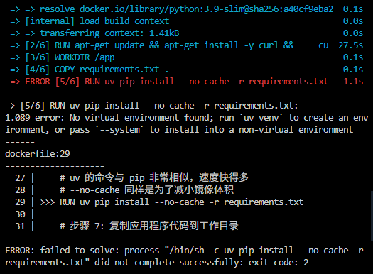
所以最好使用uv官方提供的镜像，具体使用教程可见

<span style="color:red;">[在 Docker 中使用 uv](https://hellowac.github.io/uv-zh-cn/guides/integration/docker/)</span>

#### 使用 UV 的完整流程

    ```bash
    docker build -t my-web-app:uv-latest .
    ```
    （我们用了 `uv-latest` 这个新标签来区分版本）

    在这一步，你会注意到 `RUN uv pip install` 这一层会比之前使用 `pip` 快非常多，尤其是在依赖项很多的情况下。

---


3.  **运行容器（命令不变）**
    使用新的镜像标签来运行容器：

    ```bash
    docker run -d -p 8888:5000 --name my-uv-container my-web-app:uv-latest
    ```
    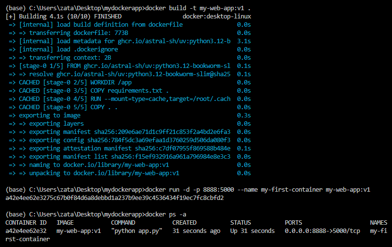

4.  **验证（方式不变）**
    访问 `http://localhost:8888`，一切应该和之前一样正常工作。


#### 对于 Docker Compose 呢？

**你的 `docker-compose.yml` 文件完全不需要任何改动。**

```yaml
# docker-compose.yml (无需改动)
version: '3.8'
services:
  web:
    build:
      context: .
    ports:
      - "8888:5000"
    # ... 其他配置
```

这就是 Docker 的强大之处。`docker-compose.yml` 只关心“做什么”（比如，从当前目录 `.` 构建一个镜像），而不关心“怎么做”（具体是使用 `pip` 还是 `uv` 来安装依赖）。所有的实现细节都被封装在 `Dockerfile` 里了。当你运行 `docker-compose up` 时，Compose 会自动使用你更新后的 `Dockerfile` 来构建镜像。

#### 总结

将包管理器从 `pip` 切换到 `uv`，你只需要：

1.  **更新 `Dockerfile`** 以包含安装和使用 `uv` 的指令。
2.  重新 **`build`** 你的镜像。

其他所有代码、文件和部署命令都保持原样，流程无缝衔接，同时还能享受到 `uv` 带来的极致构建速度。


### docker容器的部署教程3-将容器部署到服务器上

当你创建完 `Dockerfile` 之后，部署一个应用通常遵循一个标准化的流程：**构建镜像 -\> 推送镜像 -\> 在目标环境运行容器**。

下面我将为你分解这个过程，并介绍从简单到复杂的不同部署方案。

#### 核心流程

##### 第一步：构建 Docker 镜像 (Build)

这是将你的 `Dockerfile` 和应用程序代码打包成一个标准化的、不可变的“Docker 镜像”的过程。

在你的 `Dockerfile` 所在的目录下，打开终端并运行以下命令：

```bash
# docker build -t <你的镜像名称>:<标签> .
# 示例:
docker build -t my-awesome-app:v1.0 .
```

  * `docker build`: 构建命令。
  * `-t my-awesome-app:v1.0`: `-t` 参数用来给镜像打上“标签”（tag），格式通常是 `image_name:version`。这非常重要，便于版本管理。
  * `.`: 这个点表示 `Dockerfile` 的上下文路径（Context Path）是当前目录。Docker 会把这个目录下的所有文件发送给 Docker 守护进程来帮助构建。

构建成功后，你可以通过 `docker images` 命令查看你本地的所有镜像。

##### 第二步：在本地运行和测试 (Run Locally)

在推送到服务器之前，首先在本地运行容器以确保它能正常工作。

```bash
# docker run --rm -p <本地端口>:<容器端口> <你的镜像名称>:<标签>
# 示例: 假设你的应用在容器内监听 8080 端口
docker run --rm -p 3000:8080 my-awesome-app:v1.0
```

  * `docker run`: 运行命令。
  * `--rm`: 容器停止后自动删除，适合测试。
  * `-p 3000:8080`: `-p` 参数用来做端口映射（Port Mapping），将你本机的 `3000` 端口映射到容器的 `8080` 端口。这样你就可以通过访问 `http://localhost:3000` 来访问你的应用了。
  * `my-awesome-app:v1.0`: 指定要运行的镜像。

##### 第三步：推送镜像到镜像仓库 (Push to Registry)

为了在其他机器（例如你的云服务器）上使用这个镜像，你需要将它推送到一个中央存储库，这被称为“镜像仓库”（Image Registry）。

最常用的公共仓库是 [Docker Hub](https://hub.docker.com/)。各大云服务商也提供私有仓库，如 Google Artifact Registry (GCR), Amazon Elastic Container Registry (ECR), Azure Container Registry (ACR) 等。

1.  **为镜像打上符合仓库要求的标签**：
    推送前，你需要将镜像重命名为 `<你的仓库用户名>/<镜像名称>:<标签>` 的格式。

    ```bash
    # 格式: docker tag <本地镜像> <仓库用户名>/<新镜像名>:<标签>
    # 示例 (以 Docker Hub 为例):
    docker tag my-awesome-app:v1.0 your-dockerhub-username/my-awesome-app:v1.0
    ```

2.  **登录你的镜像仓库**：

    ```bash
    # 登录 Docker Hub
    docker login
    # 按照提示输入你的 Docker Hub 用户名和密码
    # 然后这个页面不要关，下面推送的时候打开一个新的终端
    ```
    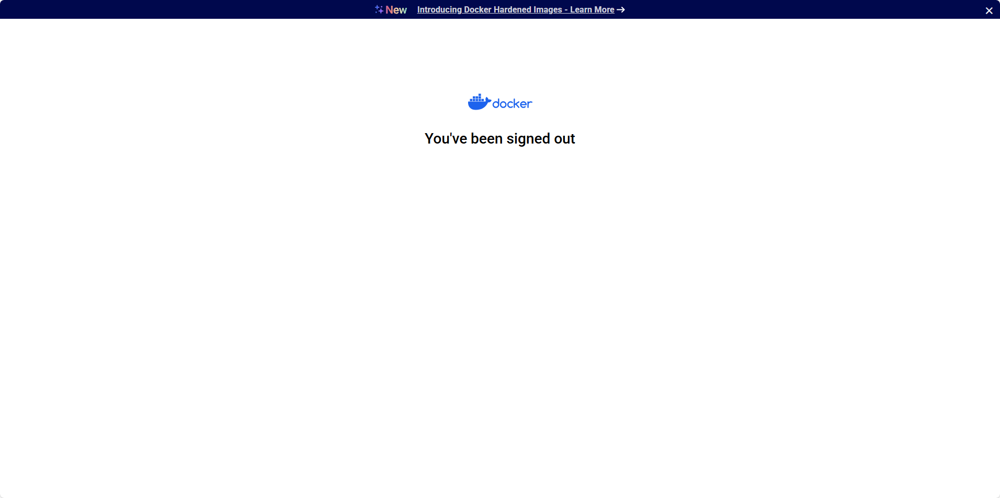

3.  **推送镜像**：

    ```bash
    
    # 格式: docker push <仓库用户名>/<镜像名>:<标签>
    # 示例:
    docker push your-dockerhub-username/my-awesome-app:v1.0
    ```

    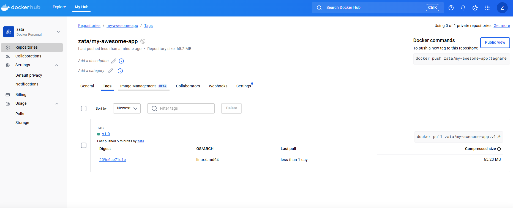

#### 第四步：选择部署方案 (Deploy)

现在你的镜像已经准备就绪，可以部署了。以下是几种常见的部署方案，从易到难：

-----

##### 方案一：在单台云服务器上手动部署 (最简单)

这种方式适合个人项目、测试环境或小型应用。

1.  **准备服务器**：购买一台云服务器（如 GCP, AWS, Azure, 阿里云等），并确保已安装 Docker。
2.  **SSH 登录服务器**：通过 SSH 客户端连接到你的服务器。
3.  **拉取镜像**：在服务器上，从你之前推送的仓库中拉取镜像。
    ```bash
    docker pull your-dockerhub-username/my-awesome-app:v1.0
    ```
4.  **运行容器**：与在本地运行类似，但在服务器上通常使用 `-d` 参数让容器在后台运行。
    ```bash
    # -d (detached mode) 表示在后台运行容器
    docker run -d -p 80:8080 --name my-running-app your-dockerhub-username/my-awesome-app:v1.0
    ```
    这里我们将服务器的 `80` 端口（HTTP 默认端口）映射到容器的 `8080` 端口。现在，你可以通过服务器的 IP 地址直接访问你的应用。

-----

##### 方案二：使用 Docker Compose 部署 (推荐用于多容器应用)

如果你的应用包含多个服务（例如一个 Web 应用 +一个数据库），使用 `Docker Compose` 会让管理变得非常简单。

1.  **创建 `docker-compose.yml` 文件**：在你的项目中创建一个 `docker-compose.yml` 文件。
    ```yaml
    version: '3.8'

    services:
      app:
        image: your-dockerhub-username/my-awesome-app:v1.0
        ports:
          - "80:8080"
        restart: always # 容器挂掉后自动重启
      
      # 如果有数据库，可以这样添加
      # db:
      #   image: postgres:13
      #   environment:
      #     - POSTGRES_PASSWORD=mysecretpassword
    ```
2.  **部署**：将 `docker-compose.yml` 文件上传到你的服务器，然后在该文件所在的目录运行：
    ```bash
    # 以后台模式启动所有服务
    docker-compose up -d

    # 如果需要更新镜像并重新部署
    docker-compose pull  # 拉取 yml 文件中定义的所有镜像的最新版
    docker-compose up -d --force-recreate # 强制重新创建容器
    ```

-----

##### 方案三：部署到云平台的容器服务 (PaaS/Serverless)

这种方式可以让你不用管理底层服务器，只需提供容器镜像，平台会自动为你扩缩容和管理。

  * **Google Cloud Run**：非常简单的无服务器平台。你只需将镜像推送到 Google Artifact Registry，然后在 Cloud Run 上创建一个服务，指向这个镜像即可。平台按需计费，没有请求时不收费。
  * **AWS App Runner / Azure Container Apps**：与 Google Cloud Run 类似的服务。
  * **Heroku**：传统的 PaaS 平台，也支持通过 Docker 部署。

**优点**：免运维、自动扩缩容、按需付费。
**缺点**：平台锁定性较强，自定义程度较低。

-----

##### 方案四：使用容器编排工具 (Kubernetes)

对于大型、复杂、高可用的生产系统，Kubernetes (K8s) 是事实上的标准。

  * **它是什么**：一个强大的系统，用于自动化部署、扩展和管理容器化应用程序。
  * **何时使用**：当你的应用需要高可用性、自动伸缩、滚动更新、服务发现和负载均衡等高级功能时。
  * **如何使用**：
    1.  学习 Kubernetes 的基本概念（Pod, Deployment, Service 等）。
    2.  编写 Kubernetes 的 YAML 配置文件来定义你的应用部署。
    3.  使用云服务商提供的托管 Kubernetes 服务，如：
          * **Google Kubernetes Engine (GKE)**
          * **Amazon Elastic Kubernetes Service (EKS)**
          * **Azure Kubernetes Service (AKS)**

**优点**：极其强大和灵活，是微服务架构的最佳拍档。
**缺点**：学习曲线非常陡峭，管理复杂。

#### 如何选择？

| **方案** | **适用场景** | **优点** | **缺点** |
| :--- | :--- | :--- | :--- |
| **手动部署** | 个人项目、学习、快速原型 | 简单直接，易于理解 | 手动操作多，不易扩展和管理 |
| **Docker Compose** | 多容器的单机应用、开发和测试环境 | 大大简化多容器管理 | 主要面向单机，集群能力弱 |
| **云平台容器服务** | 中小型应用、无服务器爱好者 | 极简运维，自动扩缩容 | 平台锁定，不够灵活 |
| **Kubernetes** | 生产级、大型复杂系统、微服务架构 | 功能强大，高可用，可移植性好 | 学习曲线陡峭，非常复杂 |

**对于初学者，我强烈建议你从 `方案一` 和 `方案二` 开始。** 当你对容器化部署有了更深入的理解后，再根据项目需求去探索 `方案三` 和 `方案四`。


### 运行容器了但是并没有生效-通过查看日志解决问题

我运行容器了，但是访问localhost:8888并没有生效

好的，这是一个非常常见的问题，别担心，我们一步一步来排查。访问 `localhost:8888` 不生效通常有以下几个原因。

请打开你的终端，按顺序执行下面的命令来定位问题。

#### **第一步：检查容器是否正在运行**

首先，我们需要确认你的容器是否成功启动并且正在运行。

运行这个命令，它会列出所有正在运行的容器：

```bash
docker ps
```

**你应该会看到类似这样的输出：**

```
CONTAINER ID   IMAGE           COMMAND                  CREATED          STATUS          PORTS                    NAMES
a1b2c3d4e5f6   my-web-app:v1   "python app.py"          2 minutes ago    Up 2 minutes    0.0.0.0:8888->5000/tcp   my-first-container
```

**请检查几件事：**

1.  **你的容器在列表里吗？**
      * **如果不在**，说明容器启动失败或者已经退出了。请运行 `docker ps -a` (这会显示所有容器，包括已停止的)，找到你的容器 (`my-first-container`)，然后查看它的 `STATUS`。如果显示 `Exited`，请直接跳到下面的 **第二步**。
2.  **`STATUS` 是否是 `Up`？**
      * 如果状态是 `Up`，说明容器正在运行，这是个好消息。
3.  **`PORTS` 是否正确？**
      * 请仔细检查 `PORTS` 这一列。它**必须显示** `0.0.0.0:8888->5000/tcp` 或类似的映射关系。这表示主机的 8888 端口已成功映射到容器的 5000 端口。如果这里是空的或者不正确，说明你运行 `docker run` 命令时 `-p` 参数可能有误。

-----

#### **第二步：查看容器日志**

如果容器没有运行 (状态是 `Exited`)，或者虽然在运行但服务依然无法访问，那么最重要的一步就是查看日志。日志会告诉我们应用程序在容器内部发生了什么。

运行以下命令来获取容器的日志：

```bash
docker logs my-first-container
```


我这里看到这个错误，于是去[from-werkzeugurls-import-url_quote-问题根源](#from-werkzeugurls-import-url_quote-问题根源)


**分析日志输出：**

  * **情况A：看到错误信息 (Error)**
      * 如果你在日志中看到任何像 `SyntaxError`, `ModuleNotFoundError`, `ImportError` 或其他 Python 错误堆栈信息，说明是你的 `app.py` 代码有问题。请检查代码是否和教程中的完全一致。最常见的错误是 `pip install` 失败或者代码缩进错误。
  * **情况B：看到 Flask 正常的启动信息**
      * 如果你看到类似下面的信息，说明 Flask 应用本身是正常启动的：
        ```
         * Serving Flask app 'app'
         * Running on http://0.0.0.0:5000
         * Press CTRL+C to quit
        ```
      * 如果日志正常，但你依然无法访问，问题很可能出在 **端口映射** 或 **网络/防火墙** 上。

-----

#### **第三步：常见问题和解决方案汇总**

根据以上检查，这里是问题排查的清单：

1.  **问题：容器启动后立即退出 (`Exited`)。**

      * **原因**：应用代码有错误。
      * **解决**：运行 `docker logs my-first-container` 查看具体错误，修改 `app.py` 或 `requirements.txt`。修改后，你需要**重新构建镜像**并**重新运行容器**。
        ```bash
        # 1. 停止并删除旧容器
        docker rm my-first-container

        # 2. 重新构建镜像
        docker build -t my-web-app:v1 .

        # 3. 重新运行容器
        docker run -d -p 8888:5000 --name my-first-container my-web-app:v1
        ```

2.  **问题：容器在运行 (`Up`)，但 `docker ps` 的 `PORTS` 列是空的。**

      * **原因**：运行容器时忘记了 `-p 8888:5000` 参数。
      * **解决**：停止并删除现有容器，然后使用正确的 `docker run` 命令重新运行。
        ```bash
        docker stop my-first-container
        docker rm my-first-container
        docker run -d -p 8888:5000 --name my-first-container my-web-app:v1
        ```

3.  **问题：容器在运行，端口映射也正确，日志也正常，但就是无法访问。**

      * **原因1**：你电脑的 `8888` 端口可能被其他程序占用了（比如另一个开发服务）。

      * **解决1**：尝试换一个主机端口，比如 `8889`。

        ```bash
        docker stop my-first-container
        docker rm my-first-container
        docker run -d -p 8889:5000 --name my-first-container my-web-app:v1
        ```

        然后访问 `http://localhost:8889`。

      * **原因2**：防火墙或安全软件。公司电脑或一些安全软件可能会阻止端口访问。

      * **解决2**：暂时关闭防火墙或安全软件进行测试。

      * **原因3 (特别是 Windows 用户)**：如果你在使用一些旧版本的 Docker 或者网络配置特殊的虚拟机，`localhost` 可能无法直接映射。

      * **解决3**：尝试使用 `127.0.0.1:8888` 访问。如果还不行，可以找到 Docker 虚拟机的 IP 地址来访问。

请按照这个顺序排查，99% 的问题都能通过检查 **容器状态** 和 **容器日志** 来解决。如果你能把 `docker ps` 和 `docker logs my-first-container` 的输出结果贴出来，我可以给你更精确的诊断。

---

#### from werkzeug.urls import url_quote 问题根源

你遇到的错误是 `ImportError: cannot import name 'url_quote' from 'werkzeug.urls'`。

  * **简单解释**：你的应用程序（Flask）依赖于另一个名为 `Werkzeug` 的底层库。你安装的 Flask 版本 (2.2.2) 需要从 `Werkzeug` 库中导入一个叫做 `url_quote` 的函数。然而，`pip` 在安装依赖时，为你安装了一个**非常新**的 `Werkzeug` 版本（3.0 或更高版本），而在这个新版本中，`url_quote` 这个函数已经被移除了，从而导致了 `ImportError`（导入错误）。

  * **为什么会发生？**：在你的 `requirements.txt` 文件中，你只指定了 `Flask==2.2.2`。`pip` 在安装它时，会去自动安装 Flask 所需的依赖（比如 Werkzeug），并且通常会选择最新的可用版本。这就导致了 Flask (旧) 和 Werkzeug (新) 之间的不兼容。

#### 解决方案

解决方法很简单：我们需要在 `requirements.txt` 中明确指定一个与 `Flask==2.2.2` 兼容的 `Werkzeug` 版本。Werkzeug 2.x 版本是兼容的。

请按照以下步骤操作：

##### **第一步：修改 `requirements.txt`**

打开你的项目文件夹中的 `requirements.txt` 文件，将其内容修改为：

```text
Flask==2.2.2
Werkzeug==2.2.2
```

**为什么要这样做？**
通过“锁定”或“固定”`Werkzeug` 的版本，我们确保了每次构建 Docker 镜像时，安装的都是经过测试、相互兼容的库版本组合。这正是 Docker 实现环境一致性和可复现性的核心思想之一。

-----

##### **第二步：停止并删除旧的容器**

由于之前的容器是基于错误的镜像创建的，我们需要先清理它。

```bash
# 停止正在运行的容器（如果它还在尝试运行的话）
docker stop my-first-container

# 删除已停止的容器
docker rm my-first-container
```


> 如果命令提示 "No such container"，说明容器已经停止并被移除了，这没关系，直接进行下一步即可。

-----

##### **第三步：重新构建 Docker 镜像**

由于我们修改了 `requirements.txt`，镜像的构建指令已经发生了变化，所以必须重新构建镜像。Docker 会很智能地利用缓存，只重新执行发生变化的步骤（即 `RUN pip install` 之后的步骤）。

在你的项目文件夹中，运行 `build` 命令：

```bash
docker build -t my-web-app:v1 .
```
    
-----

##### **第四步：重新运行容器**

现在，使用新构建的、包含了正确库版本的镜像来启动容器。

```bash
docker run -d -p 8888:5000 --name my-first-container my-web-app:v1
```

-----


##### **第五步：再次验证**

等待几秒钟让容器启动，然后再次访问 `http://localhost:8888`。


这次，你应该就能成功看到 "Hello, Docker\! This is a simple web service." 的消息了。

这个错误完美地展示了为什么在 `requirements.txt` 中锁定依赖版本是如此重要，尤其是在使用 Docker 创建可复现、无意外的环境时。

### wsl中镜像网络与docker网络冲突，使用netsh winsock reset修改网络设置之后，docker连不上 -- 解决

报错信息


解决方法，将wsl setting的网络调到默认的nat模式，然后重置网络


然后就ok了


### 具有SSL证书的后端在docker环境中出现问题


首先，后端服务是放在dokcer容器中 0.0.0.0上的，然后看vscode的映射，最后记得改成https（第一次加载超级慢，而且可能连接失败）
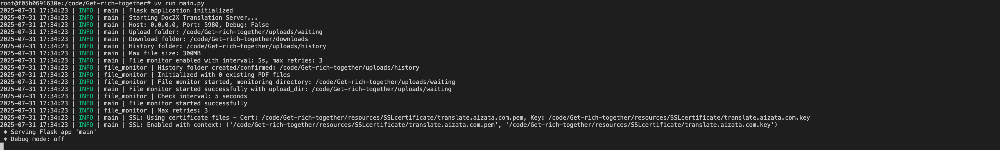
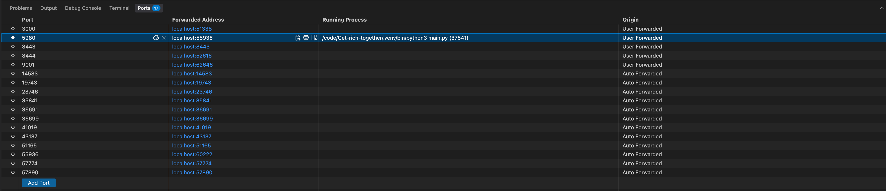


如果使用http就无法访问
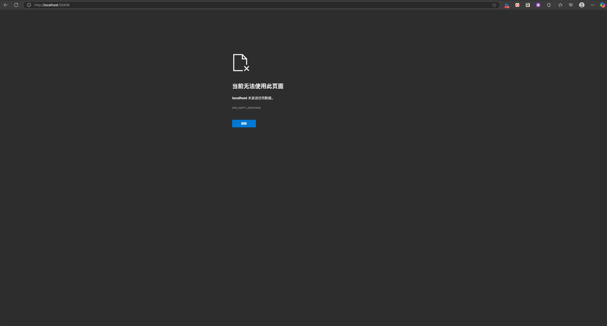


尽量还是不要在容器里面调试https吧


然后我试了127.0.0.1

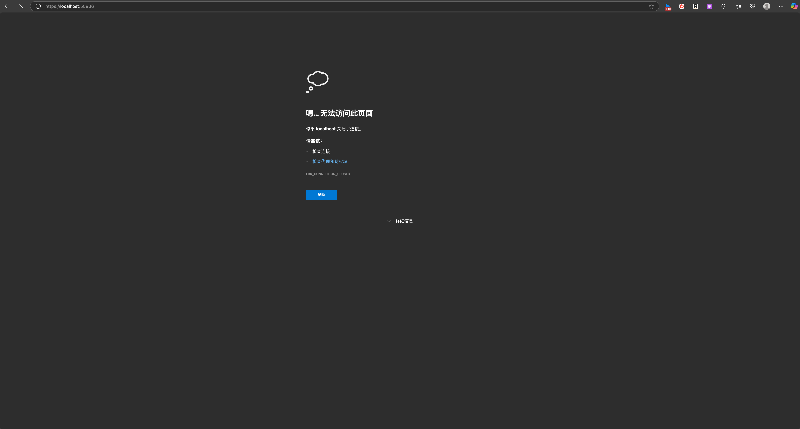


