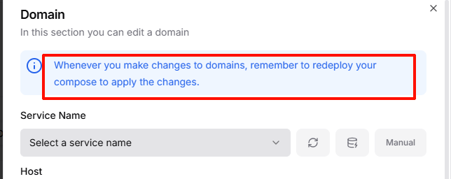
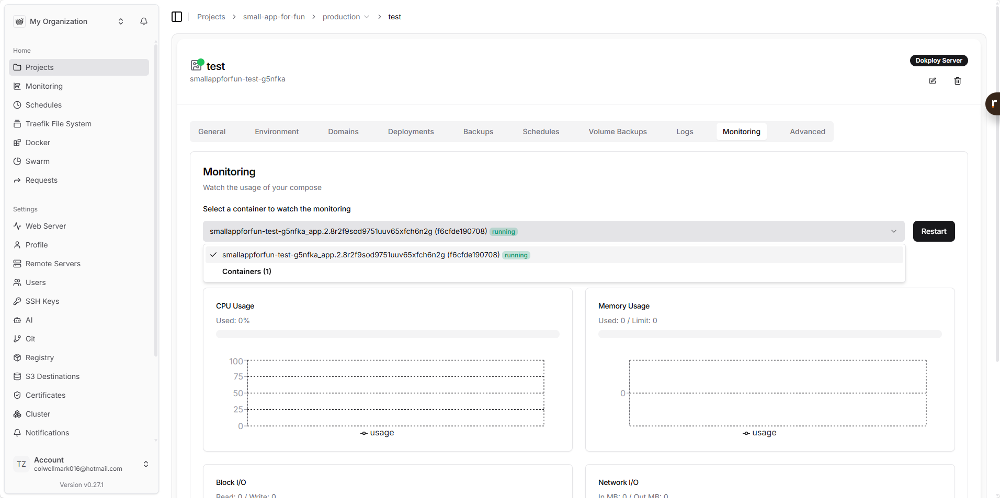
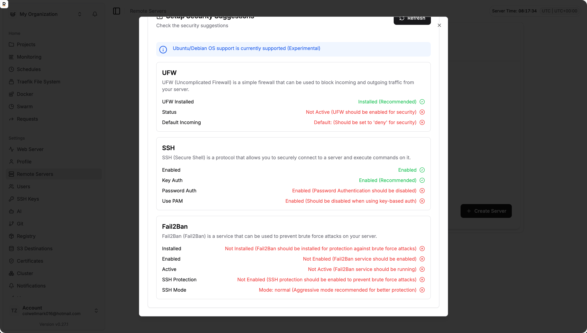
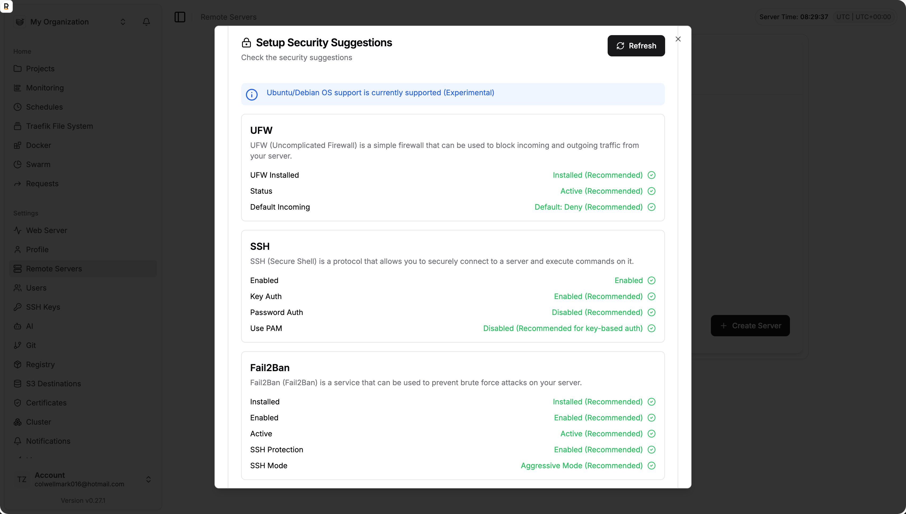

# 快速安装使用教程 (注意，如果内存小于等于2G，一定要加虚拟内存，否则会卡死)


[官网地址](https://dokploy.com/)

[关于swarm的安装](https://docs.dokploy.com/docs/core/manual-installation)


注意: 如果内存很小的机器,安装之后千万别点升级dokploy的按钮, 即使你开了Swap也没用,只要一升级,很大概率就会很绝望了(dokploy服务崩溃且无法恢复),内存1G的推荐安装0.26.6版本,其他版本可能就爆内存了  export DOKPLOY_VERSION=v0.26.6 && curl -sSL https://dokploy.com/install.sh | sh --- 20260310 

一键安装脚本，安装完成之后会给一个地址
```bash
export ADVERTISE_ADDR=<指定IP地址>  # 需要指定公网IP
curl -sSL https://dokploy.com/install.sh | sh

# 或者

curl -sSL https://dokploy.com/install.sh | ADVERTISE_ADDR=<你的服务器公网IP> bash
```


帮助子节点安装docker

**阿里云服务器**
 ```bash
 # Add the Aliyun Repository
echo "deb [arch=$(dpkg --print-architecture)] https://mirrors.aliyun.com/docker-ce/linux/ubuntu $(lsb_release -cs) stable" | sudo tee /etc/apt/sources.list.d/docker.list > /dev/null

 # Update your Package List
sudo apt-get update

 # Install Docker 
sudo apt-get install -y docker-ce docker-ce-cli containerd.io docker-buildx-plugin docker-compose-plugin

 # verify the installation
docker version

#配置镜像加速
sudo mkdir -p /etc/docker

sudo tee /etc/docker/daemon.json <<-'EOF'
{
  "registry-mirrors": ["https://<你的加速镜像地址，进入阿里云镜像加速服务获取>.mirror.aliyuncs.com"]
}
EOF

sudo systemctl daemon-reload
sudo systemctl restart docker

sudo systemctl enable --now docker
sudo systemctl enable containerd
```

**腾讯云服务器**
```bash
sudo install -m 0755 -d /etc/apt/keyrings

curl -fsSL http://mirrors.tencentyun.com/docker-ce/linux/ubuntu/gpg | sudo gpg --dearmor -o /etc/apt/keyrings/docker.gpg

sudo chmod a+r /etc/apt/keyrings/docker.gpg

echo "deb [arch=$(dpkg --print-architecture) signed-by=/etc/apt/keyrings/docker.gpg] http://mirrors.tencentyun.com/docker-ce/linux/ubuntu \
  $(. /etc/os-release && echo "$VERSION_CODENAME") stable" | sudo tee /etc/apt/sources.list.d/docker.list > /dev/null

sudo apt-get update

sudo apt-get install -y docker-ce docker-ce-cli containerd.io docker-buildx-plugin docker-compose-plugin


sudo mkdir -p /etc/docker

sudo tee /etc/docker/daemon.json <<-'EOF'
{
  "registry-mirrors": ["https://mirror.ccs.tencentyun.com"]
}
EOF

sudo systemctl daemon-reload
sudo systemctl restart docker

sudo systemctl enable --now docker
sudo systemctl enable containerd
```


  
```bash
curl -fsSL https://get.docker.com | sh

# 设置开机自启  
systemctl enable --now docker

# 作为子节点加入到 swarm 集群
docker swarm join \
  --token <TOKEN> \
  --advertise-addr <当前子节点的_公网IP> \
  --data-path-addr <当前子节点的_公网IP> \
  <Manager_公网IP>:2377
```


查看所有容器的运行状态
```bash
docker service ps 
```


## 服务器爬墙来安装

服务器爬墙的内容可以看我另一篇 《服务器爬墙》教程

**🛠️ Dokploy 完美安装四部曲**

**第一步：基础环境准备 (Ubuntu/Debian)**
首先确保系统干净，并安装必要的工具。
```bash
apt update && apt upgrade -y
apt install -y curl vim net-tools
```

**第二步：安装并优化 Docker (核心环节)**
不要直接运行 Dokploy 脚本，先手动把 Docker 装好并配置代理。

1.  **安装 Docker**：
    ```bash
    curl -fsSL https://get.docker.com | bash
    systemctl enable --now docker
    ```

2.  **配置 Docker 代理 (解决镜像下载失败)**：
    这是国内服务器成功的关键。
    ```bash
    mkdir -p /etc/systemd/system/docker.service.d
    vim /etc/systemd/system/docker.service.d/http-proxy.conf
    ```
    写入以下内容（假设你的 Mihomo 代理在 7890）：
    ```ini
    [Service]
    Environment="HTTP_PROXY=http://127.0.0.1:7890"
    Environment="HTTPS_PROXY=http://127.0.0.1:7890"
    Environment="NO_PROXY=localhost,127.0.0.1,你的服务器公网IP"
    ```

3.  **重启生效**：
    ```bash
    systemctl daemon-reload
    systemctl restart docker
    ```

**第三步：部署 Dokploy**
现在 Docker 已经可以丝滑地拉取镜像了，直接运行官方脚本：

```bash
# 注意替换成你自己的服务器公网 IP
curl -sSL https://dokploy.com/install.sh | ADVERTISE_ADDR=你的服务器公网IP bash
```

**这一步脚本会自动完成以下操作：**
*   初始化 Docker Swarm（容器集群模式）。
*   创建 `dokploy-network` 虚拟网络。
*   生成随机的数据库密码并存入 `Docker Secrets`。
*   部署 `Postgres` (数据库)、`Redis` (缓存) 和 `Dokploy` (主程序)。

**第四步：防火墙与初始化**

1.  **放行端口**：
    去你的云商后台（腾讯云/阿里云等）开启以下入站规则：
    *   **3000**：Dokploy 面板访问端口。
    *   **80 / 443**：未来你部署应用后的访问端口。

2.  **访问面板**：
    打开浏览器：`http://你的服务器IP:3000`
    *   **第一次进入**：会要求你创建管理员账号（邮箱/密码）。
    *   **配置面板**：进入后在 `Settings` 中确认 `Server IP` 正确。

**💡 为什么之前会失败？（复盘总结）**

| 错误阶段 | 根本原因 | 表现 |
| :--- | :--- | :--- |
| **安装 Docker 报错** | 脚本传参语法不对 | `Failure writing output` |
| **创建容器一直 Preparing** | Docker 无法连接官方镜像仓库 | 镜像下载进度 0% |
| **PostgresError (密码错误)** | 残留的旧数据库卷与新生成的密码冲突 | 容器一直重启，日志报 `auth_failed` |


## 安装卡住时的清理方法

有时候安装Dokploy可能会卡住，需要清除重来，以下是完整的清理步骤：

```bash
# 离开 swarm 并清理
docker swarm leave --force

# 删掉所有 Dokploy 相关的东西
docker service rm $(docker service ls -q)
docker container rm -f $(docker ps -aq --filter "name=dokploy")
docker volume rm $(docker volume ls -q --filter "name=dokploy")
docker network rm $(docker network ls -q --filter "name=dokploy")

# 更加彻底的：
# 删除所有服务
docker service rm $(docker service ls -q)
# 删除 Dokploy 存储的密码密钥 (关键！)
docker secret rm $(docker secret ls -q)
# 删除网络
docker network rm dokploy-network
# 删除数据卷（如果你不介意清空重来，这能解决 99% 的数据库问题）
docker volume rm $(docker volume ls -q)


# 清理残留镜像（可选）
docker system prune -a --volumes --force

# 再跑安装（加 --debug 看更详细输出）
curl -sSL https://dokploy.com/install.sh | bash -s -- --debug
# 或指定 advertise addr（如果你的公网IP不是自动检测到的）
curl -sSL https://dokploy.com/install.sh | ADVERTISE_ADDR=你的服务器公网IP bash
```


# 注意事项


1. 只要改过了domin,就一定要重新deploy


1. 可以先用自己电脑ssh-copy-id 到远程服务器，然后把自己电脑上的ssh密钥复制过来


2. 子节点默认可能是没有docker的,需要安装一下


3. 添加docker swarm 误操作添加了管理节点，然后又下线会导致原本的管理节点脑裂,详情需要看dokploy的官方文档
重新安装请查看前面的方法

4. dokploy很多时候部署失败可能是不提示的,尤其是使用 docker stack 的时候

5. 配置了域名地址之后,有时候可能要等一会才能生效

6. 网络配置
这一步非常重要，告诉 Docker 使用 Dokploy 已经建好的网络
networks:
  dokploy-network:
    external: true


# 一些应用的部署


## Docker Registry  --- 20260307创建 未做测试

Docker Registry 原生并没有提供“自动根据时间删除镜像”的功能。要实现超过 7 天自动删除，必须分为两步完成：

1. **调用 API 删除标签**：将超过 7 天的镜像标记为“已删除”（但此时物理磁盘空间还未释放）。
2. **执行垃圾回收 (Garbage Collection)**：清理那些失去标签的底层文件（Blob），真正释放磁盘空间。

为了在 Docker Compose 中实现自动化，我们可以**增加一个专门的清理服务（`registry-cleanup`）**。它会每天自动运行一个广受欢迎的开源 Python 脚本 `registry-cli` 来删除旧镜像，并调用 Registry 的 GC 命令释放空间。

下面是修改后的完整 `docker-compose.yml`：

```yaml
version: '3.8'

# 定义数据卷，持久化存储镜像和认证信息
volumes:
  registry-data:
  registry-auth-data: 

# 使用 Dokploy 预置的外部网络
networks:
  dokploy-network:
    external: true

services:
  # 1. 认证辅助服务：生成账号 admin / 密码 123456
  auto-setup-auth:
    image: httpd:alpine
    command: /bin/sh -c "htpasswd -Bbn admin 123456 > /auth/htpasswd"
    volumes:
      - registry-auth-data:/auth

  # 2. 核心 Registry 服务
  registry:
    image: registry:2
    container_name: my-private-registry
    restart: always
    networks:
      - dokploy-network
    ports:
      - "5000:5000"
    environment:
      REGISTRY_AUTH: htpasswd
      REGISTRY_AUTH_HTPASSWD_REALM: "Registry Realm"
      REGISTRY_AUTH_HTPASSWD_PATH: /auth/htpasswd
      REGISTRY_HTTP_HEADERS_X_FORWARDED_FOR: true
      REGISTRY_HTTP_HEADERS_X_FORWARDED_PROTO: https
      # 【关键配置】开启删除权限（必须开启，清理脚本才能工作）
      REGISTRY_STORAGE_DELETE_ENABLED: "true"
      REGISTRY_HTTP_HEADERS_ACCESS_CONTROL_ALLOW_ORIGIN: '[https://registry-ui.zata.cafe]'
      REGISTRY_HTTP_HEADERS_ACCESS_CONTROL_ALLOW_METHODS: '[HEAD,GET,OPTIONS,DELETE]'
      REGISTRY_HTTP_HEADERS_ACCESS_CONTROL_ALLOW_HEADERS: '[Authorization,Accept,Cache-Control]'
      REGISTRY_HTTP_HEADERS_ACCESS_CONTROL_EXPOSE_HEADERS: '[Docker-Content-Digest]'
    volumes:
      - registry-data:/var/lib/registry
      - registry-auth-data:/auth
    depends_on:
      auto-setup-auth:
        condition: service_completed_successfully
    labels:
      - "traefik.enable=true"
      - "traefik.http.routers.registry.rule=Host(`registry.zata.cafe`)"
      - "traefik.http.routers.registry.entrypoints=websecure"
      - "traefik.http.routers.registry.tls.certresolver=letsencrypt"
      - "traefik.http.services.registry.loadbalancer.server.port=5000"
      - "traefik.http.middlewares.limit.buffering.maxRequestBodyBytes=0"

  # 3. Web UI 管理界面
  registry-ui:
    image: joxit/docker-registry-ui:latest
    container_name: registry-ui
    restart: always
    networks:
      - dokploy-network
    environment:
      - NGINX_PROXY_PASS_URL=http://my-private-registry:5000
      - SINGLE_REGISTRY=true
      - DELETE_IMAGES=true
      - REGISTRY_TITLE=Zata Registry
    labels:
      - "traefik.enable=true"
      - "traefik.http.routers.registry-ui.rule=Host(`registry-ui.zata.cafe`)"
      - "traefik.http.routers.registry-ui.entrypoints=websecure"
      - "traefik.http.routers.registry-ui.tls.certresolver=letsencrypt"
      - "traefik.http.services.registry-ui.loadbalancer.server.port=80"

  # 4. 【新增】自动清理服务 (每天执行)
  registry-cleanup:
    image: docker:cli
    container_name: registry-cleanup
    restart: always
    networks:
      - dokploy-network
    volumes:
      # 挂载宿主机的 Docker Socket，以便此容器能够向 registry 容器发送垃圾回收命令
      - /var/run/docker.sock:/var/run/docker.sock
    depends_on:
      - registry
    entrypoint: ["/bin/sh", "-c"]
    # 核心自动化脚本
    command: 
      - |
        # 安装 Python 和 HTTP 请求库
        apk add --no-cache python3 py3-requests curl
        # 下载著名的开源镜像清理脚本 registry-cli
        curl -sSLO https://raw.githubusercontent.com/anoxis/registry-cli/master/registry.py
        chmod +x registry.py
      
        echo "自动清理服务已启动..."
        while true; do
          echo "==== 开始调用 API 清理 7 天前的镜像标签 ===="
          # 参数说明:
          # --keep-days 7 : 删除 7 天前的镜像
          # --keep-tags 1 : 即使超过 7 天，也强制保留最新生成的 1 个版本（防止仓库被彻底删空，如果你想彻底删空可去掉此参数）
          python3 registry.py -r http://my-private-registry:5000 -l admin:123456 --delete --keep-days 7 --keep-tags 1
        
          echo "==== 开始执行 GC (垃圾回收) 释放磁盘空间 ===="
          # 必须执行 --delete-untagged，否则上一段脚本删除的镜像文件依然会占用物理空间
          docker exec my-private-registry registry garbage-collect --delete-untagged /etc/docker/registry/config.yml
        
          echo "==== 清理与回收完成，休眠 24 小时 ===="
          sleep 86400
        done
```
 新增服务原理解析：

1. **基础镜像 (`docker:cli`)**：我们需要在脚本最后使用 `docker exec` 去调用 Registry 容器执行垃圾回收，因此使用了带 docker 命令的基础镜像，并挂载了宿主机的 `docker.sock`。
2. **依赖安装**：自动下载著名的 `anoxis/registry-cli` 脚本，它擅长处理 Docker Registry 的 API，并且支持基于时间删除。
3. **保留策略控制**：
   * `--keep-days 7`：这就是你要求的，超过 7 天的删除。
   * `--keep-tags 1`：（推荐设置）保护机制，如果某个镜像 1 个月没更新了，清理时依然会保留最近的一个版本，以免业务拉取不到镜像。
4. **垃圾回收 (`garbage-collect`)**：脚本删除标签后，镜像状态会变成 untagged（无标签），最后执行 `registry garbage-collect --delete-untagged` 才会把它们真正从宿主机的物理硬盘上删除。
5. **内网直连**：脚本直接使用内网地址 `http://my-private-registry:5000` 通信，既快又不会受到外部 Traefik 或 Nginx 超时策略的影响。


## FileBrowser

这份教程不仅能让你拥有一个管理 VPS 全盘文件的神器，还规避了密码无法重置、下载系统文件报错等常见问题。

---

**1. 准备工作**

*   **目标**：部署一个 Web 端的文件管理器，可以管理 VPS 上的**所有文件**（拥有 Root 权限）。
*   **工具**：Dokploy 面板（使用 Docker Compose 方式）。

**2. 部署配置 (Docker Compose)**

在 Dokploy 中创建一个新的 **Application (Compose)**，将以下代码完整复制进去。

**代码特点：**

1.  **超级权限**：使用 `user: "0:0"` 获得 Root 权限，可读写系统任何文件。
2.  **全盘挂载**：将宿主机根目录 `/` 挂载到容器内，实现全盘管理。
3.  **防止配置冲突**：修正了之前的语法错误，并配置了数据卷以确保持久化。

```yaml
version: '3.3'
services:
  filebrowser:
    image: filebrowser/filebrowser:latest
    container_name: filebrowser_root
    restart: unless-stopped
    # 核心：赋予容器 Root 权限，否则无法修改系统文件
    user: "0:0"
    networks:
      - dokploy-network
    volumes:
      # 核心：将 VPS 的根目录 (/) 挂载到容器的 /srv 目录
      - /:/srv
      # 数据库持久化卷：存储你的用户信息和设置
      # 如果忘记密码，修改冒号前的名称 (如改成 filebrowser_data_v3) 即可重置
      - filebrowser_data_v2:/database 

    # 启动命令 (合并写在一行)：
    # -d 指定数据库路径
    # -p 强制监听 80 端口
    # -r 指定根目录为挂载进来的 /srv
    command: -d /database/filebrowser.db -p 80 -r /srv

volumes:
  # 对应上面的数据卷名称
  filebrowser_data_v2:

networks:
  dokploy-network:
    external: true
```

**3. 端口设置 (Ports)**

在 Dokploy 的应用设置界面，找到 **Ports** 选项卡：

*   **Internal Port (容器端口)**: `80`
*   **External Port (外部端口)**: 填写一个未被占用的端口，例如 `8088` 或 `9999`。

点击 **Save** 并 **Deploy**。

**4. 首次登录与设置**

部署完成后，通过浏览器访问 `http://你的 IP:你的外部端口`。

1.  **默认账号**：`admin`
2.  **默认密码**：`admin`
3.  **修改密码（重要）**：
    *   登录后，点击左侧栏 **Settings** -> **Profile**。
    *   在 **Password** 区域输入新密码。
    *   点击 **Update** 保存。

**5. 避坑指南 (常见误区)**

**Q1: 为什么下载某些文件报错 `ERR_INVALID_RESPONSE`？**

*   **现象**：尝试下载 `/proc`、`/sys`、`/dev` 目录下的文件时失败。
*   **原因**：这些不是真实文件，而是系统内存和内核状态的“虚拟映射”。它们大小通常显示为 0，Web 服务器无法打包下载它们。
*   **解决**：**不要下载这些目录的文件**。请测试下载 `/etc/hosts` 或者你自己创建的 `/home/test.txt`，这些才是真实文件。

**Q2: 我忘记了密码怎么办？**

**无法通过环境变量设置密码**。如果忘记密码，最快的方法是“洗号重来”：

1.  修改 Docker Compose 中的 `volumes` 部分。
2.  将 `- filebrowser_data_v2:/database` 改为 `- filebrowser_data_v3:/database`。
3.  重新部署。这会生成全新的数据库，密码恢复为默认的 `admin`。

**Q3: 安全警告**

因为这个容器挂载了 `/` 根目录且拥有 Root 权限：

*   **不要**随意删除 `/bin`, `/boot`, `/usr` 等系统核心目录，否则 VPS 会挂掉。
*   **务必**设置强密码，不要将此服务随意暴露给不可信的人。


## webDAV

```yaml
services:
  webdav:
    image: bytemark/webdav
    restart: unless-stopped
    environment:
      - AUTH_TYPE=Basic
      - USERNAME=your_username
      - PASSWORD=your_password
    volumes:
      - ./data:/var/lib/dav
    labels:
      - "traefik.enable=true"
      # 1. 路由规则：域名匹配
      - "traefik.http.routers.webdav.rule=Host(`dav.yourdomain.com`)"
      # 2. 启用 TLS 并在入口点使用 HTTPS (443)
      - "traefik.http.routers.webdav.entrypoints=websecure"
      # 3. 指定你的 Let's Encrypt 解析器名称 (通常在 Traefik 全局配置里定义)
      - "traefik.http.routers.webdav.tls.certresolver=letsencrypt"
      # 4. 强制指定内部端口，防止 Traefik 误判
      - "traefik.http.services.webdav.loadbalancer.server.port=80"

  cleaner:
    image: alpine
    restart: unless-stopped
    volumes:
      - ./data:/var/lib/dav
    command:
      - /bin/sh
      - -c
      - |
        while true; do
          # 检查 1024MB (1GB)
          while [ $$(du -sm /var/lib/dav | awk '{print $$1}') -gt 1024 ]; do
            # 删掉最老的文件
            OLDEST=$$(find /var/lib/dav -type f -exec stat -c "%Y %n" {} + | sort -n | head -n 1 | cut -d" " -f2-)
            [ -z "$$OLDEST" ] && break
            rm -f "$$OLDEST"
          done
          sleep 60
        done
```

---

**💡补充几点：**

1. **证书解析器名称**：
   标签里的 `tls.certresolver=letsencrypt`。这里的 `letsencrypt` 必须和你 Traefik 静态配置文件（或是 Dokploy 设置里）定义的解析器名称**完全一致**。如果不一致，证书不会自动签发。
2. **网络（Network）的坑**：
   如果你发现域名访问报 **504 Gateway Timeout**，那 99% 还是网络问题。此时你需要运行 `docker network ls` 看看 Traefik 在哪个网段，并在 `webdav` 服务下加上该网络。
3. **关于清理脚本（Cleaner）**：
   这个脚本是并行的。WebDAV 负责写，Cleaner 负责巡逻。它们共享 `./data` 卷，所以互不干扰。

## alist 

alist 直接可以在应用市场安装


# 使用与配置

## Volume  vs Bind Mount vs Environment Variables --- 20260310

本教程旨在帮助您彻底理解 Dokploy 中的数据存储机制（Volumes）与环境变量（Environment Variables）的配置方式、区别及最佳实践。

---

**📋 第一部分：核心概念速查（决策树）**

在动手配置之前，请根据您的具体需求选择正确的存储类型：

| 您的需求 | 推荐类型 | 关键特征 |
| :--- | :--- | :--- |
| **数据库数据** (MySQL, PostgreSQL, Redis) | ✅ **Volume (命名卷)** | Docker 自动管理，权限无忧，备份迁移方便。 |
| **用户上传的文件** (图片/视频/附件) | ✅ **Volume (命名卷)** | 安全隔离，不依赖宿主机具体路径结构。 |
| **简单的配置文件** (`.env`, `config.json`, `nginx.conf`) | ✅ **File Mount (文件挂载)** | **最推荐**。网页直接编写内容，无需 SSH，自动创建并挂载。 |
| **复杂的配置目录** (已有大量现有配置文件) | ✅ **Bind Mount (绑定挂载)** | 映射宿主机现有目录，适合高级用户或遗留系统迁移。 |
| **开发调试/代码热更新** | ✅ **Bind Mount (绑定挂载)** | 宿主机修改代码/文件，容器内即时生效。 |
| **不确定选哪个** | ✅ **Volume** | 它是 Docker 的最佳实践，容错率最高。 |

---

**🛠️ 第二部分：三种存储类型详解与实战**

**1. Volume (命名卷) —— "让 Docker 操心"**
**适用场景**：数据库持久化、应用产生的数据文件。

*   **工作原理**：Docker 在其专用目录（通常是 `/var/lib/docker/volumes/`）下创建并管理存储空间。
*   **优点**：
    *   **权限自动适配**：极少出现 `Permission denied` 错误。
    *   **高可移植性**：不依赖宿主机的具体目录结构，迁移服务器只需迁移卷数据。
    *   **安全隔离**：数据存储在 Docker 管理区域，不易被误删。
*   **Dokploy 配置步骤**：
    1.  进入应用 **Advanced** -> **Volumes**。
    2.  点击 **Add Volume**。
    3.  **Mount Type**: 选择 `Volume`。
    4.  **Name**: 输入卷名称（如 `db_data`）。
    5.  **Mount Path**: 输入容器内路径（如 `/var/lib/postgresql/data`）。
    6.  **Host Path**: **留空**。
    7.  保存并 **Deploy**。

**2. File Mount (文件挂载) —— "网页即写即用"**
**适用场景**：单个配置文件（`.env`, `.conf`, `.json`）。

*   **工作原理**：Dokploy 将您在网页文本框中输入的内容，在后台动态生成一个临时文件，并挂载到容器指定路径。
*   **优点**：
    *   **无需 SSH**：直接在面板编辑，无需登录服务器创建文件。
    *   **版本友好**：内容直接保存在 Dokploy 配置中，便于管理。
    *   **简单快捷**：最适合 `.env` 文件管理。
*   **Dokploy 配置步骤**：
    1.  进入应用 **Advanced** -> **Volumes**。
    2.  点击 **Add Volume**。
    3.  **Mount Type**: 选择 `File Mount`。
    4.  **Content**: 粘贴文件完整内容。
    5.  **File Path**: 输入容器内**完整文件路径**（必须包含文件名，如 `/app/.env`）。
    6.  保存并 **Deploy**。

**3. Bind Mount (绑定挂载) —— "完全由你控制"**
**适用场景**：挂载现有目录、代码热重载、访问宿主机特定资源。

*   **工作原理**：将容器路径直接映射到宿主机上已存在的绝对路径。
*   **优点**：
    *   **路径透明**：可直接在宿主机通过 SSH/FTP 访问和编辑文件。
    *   **实时同步**：宿主机文件修改，容器内立即生效（适合开发）。
*   **缺点**：
    *   **权限陷阱**：需手动确保宿主机文件夹权限与容器用户匹配。
    *   **路径依赖**：迁移服务器时需重建相同的目录结构。
*   **前置准备**（SSH 登录服务器）：
    ```bash
    mkdir -p /home/dokploy/my-app/logs
    chmod 777 /home/dokploy/my-app/logs  # 注意权限设置
    ```
*   **Dokploy 配置步骤**：
    1.  进入应用 **Advanced** -> **Volumes**。
    2.  点击 **Add Volume**。
    3.  **Mount Type**: 选择 `Bind`。
    4.  **Host Path**: 填写宿主机**绝对路径**（如 `/home/dokploy/my-app/logs`）。
    5.  **Mount Path**: 填写容器内路径（如 `/app/logs`）。
    6.  保存并 **Deploy**。

---

**⚖️ 第三部分：环境变量 (Env) 的两种配置方式及优先级**

在 Dokploy 中，您有两种方式向容器传递配置信息，理解它们的区别至关重要。

**1. 两种方式对比**

| 特性 | **控制面板 Env 设置** | **挂载 .env 文件 (File Mount)** |
| :--- | :--- | :--- |
| **操作位置** | 应用菜单 -> **Environment** 标签页 | 应用菜单 -> **Advanced** -> **Volumes** -> **File Mount** |
| **底层原理** | Docker 启动参数 `-e KEY=VALUE` | 文件系统挂载 `-v host_file:/container/.env` |
| **生效机制** | Docker 守护进程直接注入进程环境空间 | **应用程序自己读取文件**解析加载 |
| **适用框架** | 所有支持环境变量的应用 | 支持读取 `.env` 文件的框架 (Node.js, Python, Laravel 等) |
| **管理体验** | 适合少量、分散的变量 | 适合大量、成组的配置，与本地开发一致 |

**2. 优先级冲突：如果两个地方都设置了同一个变量，谁生效？**

**答案取决于您的应用程序代码逻辑，而非 Docker。**

*   **情况 A：现代框架 (Node.js `dotenv`, Python `python-dotenv`, Laravel)**
    *   通常加载顺序：先读 `.env` 文件 -> 再读系统环境变量。
    *   **常见行为**：系统环境变量（控制面板设置）**覆盖** `.env` 文件中的值。
    *   **部分行为**：某些配置下，`.env` 文件一旦加载即锁定，环境变量无法覆盖。
    *   *风险*：混用会导致配置行为不可预测，难以排查。

*   **情况 B：传统应用 (Nginx, Redis, Go/C 编译程序)**
    *   这些程序通常**不会自动读取 `.env` 文件**。
    *   它们只认**系统环境变量**（控制面板设置）或特定的配置文件（如 `nginx.conf`）。
    *   *结论*：对于这类应用，挂载 `.env` 文件通常**无效**，必须使用控制面板 Env 或直接挂载对应的 conf 文件。

**3. 💡 最佳实践建议**

1.  **二选一原则**：针对同一组配置，**不要混用**两种方式。
    *   **方案 A（推荐用于 Web 应用）**：完全使用 **File Mount** 挂载完整的 `.env` 文件。
        *   *理由*：保证本地开发环境与生产环境配置文件完全一致，复制粘贴即可，减少人为遗漏。
    *   **方案 B（推荐用于基础服务/简单变量）**：完全使用 **控制面板 Env 设置**。
        *   *理由*：界面清晰，管理方便，适合变量较少的情况。

2.  **明确应用行为**：查阅应用文档，确认它是优先读取文件还是优先读取环境变量。

3.  **敏感信息**：如果极度敏感，考虑使用 **Bind Mount** 挂载服务器上权限严格控制的独立文件，避免内容出现在 Dokploy 数据库备份中。

---

**⚠️ 第四部分：常见陷阱与故障排查**

**1. 权限错误 (Permission Denied)**
*   **现象**：容器启动失败，日志提示无法写入文件或读取配置。
*   **原因**：多见于 **Bind Mount**。容器内用户 UID 与宿主机文件夹所有者不一致。
*   **解决**：
    *   优先改用 **Volume**。
    *   若必须用 Bind，在服务器执行 `chown -R <UID>:<GID> /host/path`。

**2. 路径错误**
*   **File Mount**：`File Path` 必须是**完整路径 + 文件名**（例：`/app/.env`），不能只是目录。
*   **Bind Mount**：`Host Path` 必须是**绝对路径**，不能用 `~` 或相对路径。

**3. 修改未生效**
*   **File Mount / Env Panel**：修改后必须点击 **Deploy** 重新创建/启动容器。
*   **Bind Mount**：文件修改通常即时生效，但**应用程序可能需要重启**才能重新加载配置（除非支持热重载）。

**4. 数据迁移**
*   **Volume**：需使用 Docker 命令或 Dokploy 备份功能迁移卷数据。
*   **Bind Mount**：直接打包宿主机对应文件夹 (`tar`) 传输到新服务器即可。

---

**🏁 总结流程图**

```mermaid
graph TD
    Start[开始配置存储] --> Q1{数据类型？}
  
    Q1 -- 数据库/持久化数据 --> Vol[使用 Volume<br>安全/自动管理]
    Q1 -- 单个配置文件 (.env) --> File[使用 File Mount<br>网页编辑/最便捷]
    Q1 -- 现有目录/代码热更 --> Bind[使用 Bind Mount<br>需 SSH 预建目录]
  
    File --> EnvQ{是否需要设置环境变量？}
    EnvQ -- 是 --> Choice{选择策略}
    Choice -- 推荐：保持一致性 --> UseFile[完全使用 File Mount 挂载 .env]
    Choice -- 备选：简单变量 --> UsePanel[完全使用 控制面板 Env 设置]
    Choice -- ❌ 禁止 --> Mix[混用两者 (易导致冲突)]
  
    Vol --> Deploy[点击 Deploy 部署]
    Bind --> Deploy
    UseFile --> Deploy
    UsePanel --> Deploy
  
    Deploy --> Done[完成]
```

遵循本指南，您将能够高效、安全地管理 Dokploy 中的应用数据与配置。如有具体报错，请提供日志以便进一步分析。


## Dokploy 自动化部署踩坑

在使用 Dokploy 配合 CI/CD（如 GitHub Actions）进行自动化部署时，很多人会踩到两个致命的坑：

*   **时序错乱（抢跑）**：刚 git push 完代码，CI/CD 还没把镜像打包推送完，Dokploy 就已经提前开始拉取部署了，导致部署失败或拉到旧镜像。
*   **镜像缓存（死不更新）**：等镜像真正推送完，去触发 Dokploy Webhook 时，由于镜像标签都是 latest，Dokploy 直接用了本地缓存，怎么部署都是旧版本！

今天，我们就用 **“Raw 模式分离” + “API 改写镜像 SHA”** 的终极方案，彻底打通这条全自动流水线！

**踩坑一：为什么一 Push 代码 Dokploy 就抢跑？**

根本原因：如果你在 Dokploy 中选择了 Git 作为代码源，它的触发器只有 On Push，一旦侦测到代码提交它就会立刻执行。

破局思路：既然镜像已经由 CI/CD 负责打包，Dokploy 就只需要做一个“纯粹的执行器”。

👉 **解决方法：**

在 Dokploy 的应用设置中，不要选 Git/GitHub。

*   如果是单容器，数据源选 **Docker**。
*   如果是编排部署，数据源选 **Raw 模式**（直接粘贴你的 docker-compose.yml）。

这样 Dokploy 就彻底脱离了 Git 仓库的束缚，只会安静等待指令。

**踩坑二：触发更新时，如何彻底避免 latest 镜像缓存？**

很多教程只教你推完镜像后 curl 一下 Webhook，但这不够。为了实现绝对的不可变部署（Immutable Deployment），最佳实践是在 CI/CD 构建完镜像后，提取该镜像唯一的 SHA 摘要（Digest），利用 Dokploy 的 API 动态改写配置，然后再触发部署。

**准备工作：获取 API 密钥与 URL**

1.  **生成 API Key**：登录 Dokploy 面板，点击右上角头像 -> Profile -> 找到 API/CLI 区域，生成一串 API Key。
2.  **确认 API URL**：即你的 Dokploy 访问地址（例如 `https://dokploy.your-domain.com`）。
3.  **获取应用 ID**：在 Dokploy 中点开你的应用，看浏览器地址栏，通常能找到你的 `applicationId` 或 `composeId`。

**终极 CI/CD 流水线实战（以 GitHub Actions 为例）**

我们需要在工作流中完成三个步骤：构建推送 -> 改写 Dokploy 配置里的 SHA -> 触发部署。

在你的 `.github/workflows/deploy.yml` 最后加上这段核心代码：

```yaml
# 前置步骤：正常拉取代码并登录镜像库...

- name: 构建并推送 Docker 镜像，提取 SHA
  id: build-image
  run: |
    # 1. 正常打包并推送最新镜像
    docker build -t your-namespace/your-image:latest .
    docker push your-namespace/your-image:latest
  
    # 2. 核心操作：获取刚刚推送在云端生成的唯一 SHA256 摘要
    IMAGE_SHA=$(docker inspect --format='{{index .RepoDigests 0}}' your-namespace/your-image:latest)
    echo "IMAGE_SHA=$IMAGE_SHA" >> $GITHUB_ENV
    echo "最新镜像摘要为: $IMAGE_SHA"

- name: 调用 Dokploy API 改写镜像 SHA
  run: |
    # 3. 将带有 SHA 的完整镜像地址更新到 Dokploy 的配置中
    curl -X POST "https://dokploy.your-domain.com/api/application.update" \
      -H "Authorization: Bearer ${{ secrets.DOKPLOY_API_KEY }}" \
      -H "Content-Type: application/json" \
      -d '{
        "applicationId": "${{ secrets.DOKPLOY_APP_ID }}",
        "dockerImage": "${{ env.IMAGE_SHA }}"
      }'

- name: 调用 Dokploy API 触发真实部署
  run: |
    # 4. 配置修改完毕，正式下达部署指令
    curl -X POST "https://dokploy.your-domain.com/api/application.deploy" \
      -H "Authorization: Bearer ${{ secrets.DOKPLOY_API_KEY }}" \
      -H "Content-Type: application/json" \
      -d '{
        "applicationId": "${{ secrets.DOKPLOY_APP_ID }}"
      }'
```

(💡 提示：记得在 GitHub 的 Secrets 中配置好 `DOKPLOY_API_KEY` 和 `DOKPLOY_APP_ID`)

**💡 进阶技巧：如果你用的是 Raw 模式 (Docker Compose) 怎么办？**

在 Raw 模式下由于是直接写 YAML 文件，API 更新全文有些繁琐。最佳实践是结合环境变量：

在 Dokploy 的 Raw 配置框中这样写：

```yaml
services:
  web:
    image: your-namespace/your-image@${IMAGE_SHA} # 引用环境变量
```

在 GitHub Actions 中，调用 Dokploy 的环境变量更新 API（`/api/application.env.set` 或相关路由），把新的 SHA 刷进环境变量里。最后再触发 Deploy。

**总结**

通过上述改造，我们完美分离了“代码构建”与“容器部署”的职责：

*   CI/CD 专职负责构建镜像，并产出带有唯一指纹的 SHA 摘要。
*   Dokploy 作为纯粹的容器执行引擎，通过 API 接收最新的 SHA 彻底绕过本地缓存。

时序绝对正确，更新绝对精准，你的全自动 CI/CD 部署流水线现在坚不可摧了！🎉


## 解决 Traefik 处理大文件上传时的 502 错误 (i/o timeout)

在使用 Traefik 作为反向代理时，如果遇到大文件上传导致 `502 Bad Gateway` 错误，且日志中出现 `i/o timeout` 相关信息，通常是因为 Traefik 的默认超时设置过短。

以下是具体的排查思路与解决方案。

**1. 问题现象与日志分析**

当上传较大文件时，请求在到达后端之前被 Traefik 截断，返回 502 错误。查看 Traefik 容器日志，关键错误信息如下：

```text
vulcand/oxy/buffer: error when reading request body, err: i/o timeout
entryPointName=websecure middlewareName=transmaster-staging-backend-buffering@docker
```

**原因定位：**
*   错误并非由 `maxRequestBodyBytes`（请求体大小限制）引起。
*   根本原因是 Traefik 的 `buffering` 中间件在等待客户端上传数据时发生了 **I/O 超时 (i/o timeout)**。默认的读取超时时间对于大文件上传来说太短了。

**2. 解决方案**

需要修改 `traefik.yml` 配置文件，在对应的 `entryPoints`（入口点）下增加 `respondingTimeouts` 配置，延长读取和写入的超时时间。

**修改 `traefik.yml`**

找到你的 `traefik.yml` 文件（通常位于 `/etc/dokploy/traefik/traefik.yml` 或类似路径），在 `entryPoints` 部分添加或修改 `transport` 配置。

**配置示例：**

```yaml
entryPoints:
  web:
    address: :80
    transport:
      respondingTimeouts:
        readTimeout: 900s   # 读取请求体超时时间（针对大文件上传，建议设大一点，如 15 分钟）
        writeTimeout: 900s  # 写入响应超时时间
        idleTimeout: 180s   # 空闲连接超时时间
  websecure:
    address: :443
    transport:
      respondingTimeouts:
        readTimeout: 900s
        writeTimeout: 900s
        idleTimeout: 180s
    http:
      tls:
        certResolver: letsencrypt
```

**参数说明：**
*   `readTimeout`: 最关键参数。决定 Traefik 等待客户端把请求体传完的时间。如果上传文件较大或网速较慢，需适当调大（例如 900s）。
*   `writeTimeout`: 决定 Traefik 等待后端服务返回响应的时间。
*   `idleTimeout`: 保持连接空闲的超时时间，通常不需要太大。

**3. 应用配置**

修改保存配置文件后，需要重启 Traefik 容器以使配置生效。

**执行重启命令：**

```bash
docker restart dokploy-traefik
// 或者根据你的容器名称调整，例如：
// docker restart <traefik_container_name>
```

**4. 验证结果**

重启完成后，再次尝试上传之前失败的大文件。

*   **观察日志：** 确认不再出现 `i/o timeout` 错误。
*   **业务测试：** 文件上传成功，不再返回 502 错误。

通过调整 `respondingTimeouts`，即可解决因网络波动或文件过大导致的 Traefik 上传超时问题。


## 部署相同项目的但是不同的环境（staging和production）发现冲突 --- trakfik路由重名冲突问题

在 Dokploy 中，路由重名问题（Route Name Collision / Duplicate Route）是一个在部署多个应用或同一应用的多个实例时经常遇到的网络路由冲突问题。

要理解这个问题，首先需要了解 Dokploy 的底层网络架构：Dokploy 依赖 Traefik 作为其反向代理和负载均衡器。Traefik 通过读取 Docker 容器上的标签（Labels）或动态配置文件，来决定如何将外部的 HTTP/HTTPS 请求转发到正确的内部容器。

以下是关于 Dokploy 中路由重名问题的详细解释：

**什么是“路由重名”？**

在 Traefik 的配置体系中，每个路由规则都需要一个唯一的路由名称（Router Name）。例如，在 Docker Compose 的 labels 中，你可能会看到这样的配置：`traefik.http.routers.my-app-router.rule=Host('example.com')`。这里的 `my-app-router` 就是路由名称。如果在 Dokploy 中，有两个不同的服务或应用使用了完全相同的路由名称，Traefik 就会发生冲突。

**常见的触发场景**

*   **部署同一模板的多个实例（多租户场景）：** 假设你使用 Docker Compose 模板在 Dokploy 上部署了一个开源系统（如 ERPNext、WordPress 或你自己的项目）。当你想要为另一个客户部署第二套相同的系统时，如果你直接复制了 Compose 文件而没有修改里面的 Traefik 标签，两个容器都会声明自己叫 `my-app-router`。
*   **误绑重复的域名：** 团队成员在 Dokploy 的控制面板中，不小心为两个不同的应用程序绑定了相同的域名（在 Dokploy 的 GitHub 仓库中，Issue #3036 专门提到了缺少重复域名校验导致的 Traefik 路由崩溃问题）。
*   **服务从其他平台迁移时的硬编码：** 直接复制了原本在 Coolify 或纯 Docker 环境下的 Compose 文件，导致不同项目复用了默认的通用路由名称（如 `web-router` 或 `frontend-router`）。

**路由重名会导致的后果**

*   **流量串门 / 覆盖失效：** Traefik 无法区分这两个服务。通常情况下，后启动的容器可能会覆盖先启动的容器的路由规则，导致访问应用 A 的域名却打开了应用 B 的页面。
*   **服务不可用（504 或 404 错误）：** Traefik 的动态配置加载可能会因为命名冲突而报错，导致该路由规则被整体丢弃，最终访问域名时出现 504 Gateway Timeout 或 404 Not Found。
*   **部署状态假死：** Dokploy 面板显示应用已成功部署且正在运行，但外部始终无法通过域名访问。

**如何解决和避免？**

*   **方法一：确保路由名称的唯一性（最核心）**
    如果你通过 Templates 或 Docker Compose 部署应用，必须确保 labels 里的 router 和 service 名称是全局唯一的。
    *   错误写法（写死名称）：`- "traefik.http.routers.web-router.rule=..."`
    *   正确写法（添加唯一标识/租户 ID）：`- "traefik.http.routers.app1-web-router.rule=..."` 或 `- "traefik.http.routers.app2-web-router.rule=..."`
    *   或者使用环境变量：`- "traefik.http.routers.${TENANT_ID}-router.rule=..."`
*   **方法二：明确指定 Traefik 网络**
    当出现复杂的网络配置时（例如应用同时加入了多个 Docker Network），Traefik 会不知道该把流量发往哪个网络，从而引发 504 错误。在标签中明确指定 Dokploy 的默认网络可以防范此类路由异常：`- "traefik.docker.network=dokploy-network"`。
*   **方法三：使用 Dokploy 原生 Application 部署**
    如果你使用的是 Dokploy 的 Applications 功能（基于 Nixpacks, Dockerfile 或 Buildpacks 部署），Dokploy 底层会通过修改 Traefik 的文件系统（File Provider）来自动为你生成带有唯一哈希值的路由名称。这种模式下，只要你不绑定完全重复的域名，通常不会触发路由重名问题。

总结：Dokploy 的路由重名本质上是 Traefik 代理引擎的命名空间冲突。在编写 Compose 文件或打标签时，养成为所有 Traefik 相关的 router、service、middlewares 加上项目名前缀的习惯，就能完美避开这个问题。

**参考资料**

*   cherryservers.com
*   dokploy.com
*   frappe.io
*   github.com
*   lobehub.com
*   Google Search Suggestions: "dokploy" router name collision, "dokploy" route name, "dokploy" 路由冲突，"dokploy" duplicate route


## dokploy 如果因为磁盘爆了而崩溃，怎么解决

```bash
# 确认磁盘状态
df -h  


# 清除陈旧的系统日志
sudo journalctl --vacuum-time=1d
sudo journalctl --vacuum-size=100M

# 清理未使用的 Docker 镜像和停止的容器
docker system prune -a -f
```


## 配置S3 Destinations

- 以b2_buckets 为例


**将 Backblaze B2 配置到 Dokploy 的 S3 存储指南**

将 Backblaze B2 配置到 Dokploy 的 S3 存储中主要分为两步：首先在 Backblaze 获取凭据，然后在 Dokploy 仪表板中完成设置。

**第一步：在 Backblaze B2 中获取信息**

1.  **创建存储桶 (Bucket)**
    *   登录 Backblaze，进入 B2 Cloud Storage > Buckets。
    *   创建一个新存储桶（例如命名为 `dokploy-backups`）。
    *   注意：在存储桶列表中找到刚才创建的桶，复制其显示的 S3 Endpoint（例如 `s3.us-west-002.backblazeb2.com`）。

2.  **创建应用程序密钥 (Application Keys)**
    *   进入 App Keys 页面。
    *   点击 Add a New Application Key。
    *   设置名称，并确保权限设置为 Read and Write。
    *   创建后，你会得到：
        *   `keyID`（即 Dokploy 中的 Access Key）
        *   `applicationKey`（即 Dokploy 中的 Secret Key）
    *   注意：`applicationKey` 仅显示一次，请务必保存。

**第二步：在 Dokploy 中进行配置**

1.  进入 Dokploy 面板，点击左侧菜单的 Settings (设置)。
2.  找到 S3 Destinations 选项卡，点击 Add S3 Destination。
3.  根据以下对应关系填写表单：

| Dokploy 字段 | 对应 Backblaze 的信息 | 示例值 |
| :--- | :--- | :--- |
| Name | 自定义名称 | Backblaze-B2 |
| Provider |  | 选择 Amazon Web Services （AWS）S3 ｜
| Endpoint | 存储桶页面的 S3 Endpoint (需带 https://) | `https://s3.us-west-002.backblazeb2.com` |
| Region | Endpoint 中的地区部分 | `us-west-002` |
| Bucket | 你创建的存储桶名称 | `dokploy-backups` |
| Access Key | 刚才生成的 keyID | `002123456789...` |
| Secret Key | 刚才生成的 applicationKey | `K001abcd...` |

4.  **保存并测试**：填写完成后，点击 Test Connection。如果显示成功，则说明配置正确。

**第三步：为数据库或应用开启备份**

配置好 S3 目的地后，你还需要将其应用到具体的备份任务中：

1.  进入你想备份的 Database (数据库) 或 Service。
2.  点击 Backups 选项卡。
3.  在 Select Destination 下拉菜单中选择刚才创建的 Backblaze-B2。
4.  设置 Cron Schedule（例如 `0 0 * * *` 表示每天午夜备份）并启用。

** 第四步：恢复备份**

总结恢复步骤清单：

本地已经部署镜像并启动容器，对应需要恢复的卷名是 9cut8x_postgres_data。

1. 命令行查卷(这个卷名换成实际的)： docker ps -a --filter volume=9cut8x_postgres_data
2. 清理现场： docker rm -f <查到的容器ID>
3. 彻底删除旧卷： docker volume rm 9cut8x_postgres_data
4. 执行恢复： 在 Dokploy 的 Volume Backups 页面填入 9cut8x_postgres_data 并点击 Restore。
5. 验证： 恢复完成后，执行 docker volume ls 确保该卷已重新创建。
6. 部署应用： 回到 Dokploy 对应的服务界面，点击 "Deploy"（这会根据你的 docker-compose.yml 重新挂载刚才恢复好的卷）。


**常见问题排查**

*   **权限错误**：确保创建 Key 时勾选了对应存储桶的 "Read and Write" 权限。
*   **Endpoint 格式**：Dokploy 通常需要完整的 URL 格式，请确保包含 `https://`。
*   **地区 (Region)**：Backblaze 的地区代码通常就在 Endpoint URL 中（如 `us-west-002`），必须准确填写。


## Dokploy Swarm 子节点联通性测试指南

这是一份专为 Dokploy 用户准备的 **Docker Swarm 子节点（Worker Node）联通性测试教程**。在搭建好 Dokploy 多节点集群后，最关键的一步是验证 **管理节点（Manager）** 是否能通过 **Overlay 网络** 正常调度并连接到 **子节点（Worker）** 上的容器。本教程将通过部署一个跨节点的测试应用，验证网络数据平面（Data Plane）是否畅通。

**一、核心概念：为什么不能用“默认”网络？**

很多教程提到“不要使用默认网络”，这通常指两点：

1.  **禁止使用 `bridge` 网络**：这是单机网络。如果你不指定网络，Docker 默认使用 `bridge`，跨服务器的容器将无法互相访问。
2.  **必须使用 `Overlay` 网络**：Swarm 模式下，只有 Overlay 网络能建立跨物理机的虚拟隧道。
3.  **Dokploy 的做法**：Dokploy 已经预设了一个名为 `dokploy-network` 的 Overlay 网络。**我们的应用必须挂载到这个网络上**，才能被 Dokploy 的 Traefik 网关识别并实现跨节点转发。

**二、准备工作**

1.  确保在 Dokploy 的 **Servers** 菜单中，子节点显示为 `Ready`。
2.  （可选）为子节点添加标签：
    *   在管理节点终端执行：`docker node update --label-add type=worker <子节点主机名>`
    *   *这能确保我们的测试应用准确落在子节点上。*

**三、编写部署文件 (Compose)**

在 Dokploy 中新建一个 **Compose**，选择 **Stack** 模式，填入以下配置：

```yaml
version: '3.8'

services:
  # 服务 A：强制运行在管理节点 (Manager)
  test-manager:
    image: nginxdemos/hello:plain-text
    networks:
      - dokploy-network
    deploy:
      replicas: 1
      placement:
        constraints:
          - node.role == manager

  # 服务 B：强制运行在子节点 (Worker)
  test-worker:
    image: nginxdemos/hello:plain-text
    networks:
      - dokploy-network
    deploy:
      replicas: 1
      placement:
        constraints:
          # 如果没打标签，可用 - node.role == worker
          - node.role == worker 

networks:
  # 使用 Dokploy 预设的 Overlay 网络
  dokploy-network:
    external: true
```

*注意：上述 YAML 中的注释行已保留，但请确保在实际编辑时不要误删关键配置。*

**四、部署步骤**

1.  **创建 Stack**：在 Dokploy 项目中点击 `Create Service` -> `Compose`。
2.  **配置**：
    *   **Name**: `swarm-test`
    *   **Source**: 直接粘贴上述 YAML 代码。
3.  **部署**：点击 **Deploy**。
4.  **确认位置**：
    *   部署完成后，在 Dokploy 的容器列表里查看。
    *   确认 `test-manager` 运行在管理节点 IP 上。
    *   确认 `test-worker` 运行在子节点 IP 上。

**五、联通性验证（手动测试）**

即使两个容器都显示 "Running"，也不代表网络是通的。我们需要执行以下两项压力测试：

**1. 容器间内网互访（验证 Overlay 网络）**

进入管理节点上的 `test-manager` 容器，尝试访问子节点上的服务名：

```bash
    # 1. 在管理节点终端找到容器 ID
docker ps | grep test-manager

    # 2. 进入容器内部
docker exec -it <容器 ID> sh

    # 3. 通过服务名访问子节点的容器（Swarm 会自动做 VIP 负载均衡）
curl http://test-worker
```

*   **成功标志**：如果返回 `Server address: 10.0.x.x` 且该 IP 是子节点的内部 IP，说明 **Overlay 网络跨机通信正常**。

**2. 外部网关转发（验证 Traefik 联通）**

在 Dokploy 中为 `test-worker` 服务配置一个域名（Domain）：

1.  在 `test-worker` 的域名设置里绑定一个测试域名。
2.  通过浏览器访问该域名。
*   **原理**：流量会先到达 **管理节点的 Traefik** -> 通过 **dokploy-network** -> 转发到 **子节点的容器**。
*   **成功标志**：浏览器正常显示网页。如果出现 `502 Bad Gateway`，说明管理节点和子节点之间的 **4789/UDP** 端口被防火墙拦截了。

**六、故障排查**

如果测试不通，请检查各节点间防火墙是否放行了以下 Swarm 必需端口：

1.  **TCP 2377**：集群管理通信。
2.  **TCP/UDP 7946**：节点发现与健康检查。
3.  **UDP 4789**：**关键！** 数据平面 Overlay 网络（UDP 封装）。如果该端口不通，容器能启动但无法互相 ping 通。

**检查指令（在任一节点查看网络详情）：**

```bash
docker network inspect dokploy-network
```

确认子节点（Worker）的容器 IP 是否出现在 `Containers` 列表中。

**总结**

在 Dokploy 中测试子节点，**核心就是利用 `dokploy-network` (External Overlay)**。只要能通过管理节点的容器 `curl` 通子节点的容器名，你的集群网络就是完美的。

## Dokploy + Docker Swarm 实战：为什么扩容后看不见容器？(多节点部署避坑指南)




最近在使用 **Dokploy** 配合 **Docker Swarm** 进行多节点部署时，遇到了一些非常经典的概念误区。这篇笔记旨在记录从单机迈向集群模式时，容易让人产生“自我怀疑”的几个瞬间，以及如何正确地管理你的 Swarm 集群。

**01. 现象：明明扩容了，容器去哪了？**

我在 Dokploy 的后台将一个应用（`transfileserver`）的副本数（Replicas）设置为了 **2**。

在主节点（Master/Manager）终端输入 `docker service ls`，状态看起来非常完美：

```bash
root@master:~# docker service ls
ID             NAME                             REPLICAS   IMAGE
j4pif4la2ox3   smallappforfun-test..._app       2/2        registry.../app:latest
```

`REPLICAS 2/2` 告诉我：期望跑 2 个，实际跑了 2 个。一切正常，对吧？

**但是**，当我习惯性地在主节点输入 `docker ps` 想看看这两个容器时，却发现：**只有一个容器在运行！**

```bash
root@master:~# docker ps | grep transfileserver
// 只有一行输出，显示其中一个容器 ID
```

**我的第一个反应是：** 部署失败了？还是 Dokploy UI 显示 bug 了？为什么丢了一个容器？

**02. 原理：上帝视角 vs. 本地视角**

其实，部署并没有失败。这是 **Docker Swarm** 最基本的运行逻辑，也是新手最容易混淆的地方。

**为什么 `docker ps` 看不到？**

*   **`docker ps` 是“本地视角”**：这个命令问的是当前这台物理服务器：“你的 CPU 和内存里现在跑着哪些进程？”
*   **Swarm 调度机制**：当你设置 `replicas: 2` 且拥有多个节点时，Swarm 调度器为了负载均衡，大概率会将其中一个容器分配给主节点，另一个分配给子节点（Worker Node）。

所以，你在主节点运行 `docker ps`，当然只能看到分配给主节点的那个容器。另一个容器正在子节点的肚子里跑得欢呢。

**正确的查看方式：上帝视角**

要确认所有副本的状态和位置，不能用 `docker ps`，而要用 **Service** 级别的命令：

```bash
docker service ps <你的服务名称>
```

输出结果会像这样：

| ID | NAME | NODE | DESIRED STATE | CURRENT STATE |
| :--- | :--- | :--- | :--- | :--- |
| x7... | ...app.1 | **racknerd-master** | Running | Running |
| y9... | ...app.2 | **worker-node-01** | Running | Running |

注意 **NODE** 这一列。你可以清晰地看到，Swarm 已经把任务分发到了不同的机器上。这证明你的负载均衡集群已经完美工作了。

**03. 疑问：子节点需要安装 Dokploy 吗？**

既然应用跑在子节点上，我是否需要在子节点上也跑一遍 Dokploy 的安装脚本？

**答案是：绝对不需要，千万别装！**

**为什么？**

1.  **架构逻辑**：Dokploy 是“指挥官”（Brain），它只需要存在于主节点。Worker 节点只需要安装基础的 Docker Engine。主节点通过 Swarm 协议遥控子节点干活。
2.  **端口冲突**：Dokploy 自带 Traefik（网关），占用 80/443 端口。如果在子节点再装一套，会导致端口冲突，破坏集群的统一路由网络。
3.  **资源浪费**：子节点会被迫运行一套多余的 Postgres、Redis 和监控服务。

**子节点只需要做一件事**：安装 Docker，然后运行 `docker swarm join ...` 命令加入集群即可。

**04. 关键避坑：多节点下的文件存储（Volumes）**

虽然多节点部署成功了，但如果你的应用涉及到文件上传或持久化存储（比如我的文件传输服务），这里有一个巨大的隐患。

**场景重现**

假设你的 `docker-compose.yml` 是这样写的：

```yaml
volumes:
  - ./uploads:/app/uploads
```

*   **用户 A** 上传文件，请求被分发到了 **主节点** 的容器。文件保存在主节点的硬盘里。
*   **用户 A** 再次刷新，请求被分发到了 **子节点** 的容器。
*   **结果**：子节点容器里是空的！用户发现刚传的文件“丢了”。

**解决方案**

在 Swarm 模式下，本地目录挂载（Bind Mounts）不再适用于需要数据共享的场景。你需要：

1.  **方案一（推荐）：对象存储**
    修改代码，不要把文件存本地硬盘，而是存到 AWS S3、阿里云 OSS 或自建的 MinIO 中。这是云原生应用的最佳实践。
2.  **方案二：NFS（网络文件系统）**
    搭建一个 NFS 服务器，让所有节点挂载同一个网络硬盘。
3.  **方案三：限制节点（临时方案）**
    如果是单机应用强行上 Swarm，可以通过配置 `placement constraints`，强制该服务只运行在主节点上，放弃多节点负载均衡，只利用 Swarm 的管理功能。

**总结**

1.  **信任 `docker service ls`**：如果它显示 `2/2`，那就是成功的。
2.  **用对命令**：查看集群状态用 `docker service ps`，而不是 `docker ps`。
3.  **保持子节点纯净**：不要在 Worker 节点重复安装 Dokploy。
4.  **留意存储**：多节点部署必须解决文件共享问题，否则数据会“漂移”。

希望这篇避坑指南能帮你更自信地驾驭 Dokploy 和 Docker Swarm！


## Dokploy 安全建议检查与服务器加固操作指南




这张截图显示的是 Dokploy 的 **安全建议检查（Security Suggestions）**。它并不是让你在 Dokploy 的网页界面里填个表，而是提示你需要登录到 **服务器的终端（Terminal）** 去修改系统配置文件。这是一份服务器“加固”清单。要把这些红色的叉号（❌）变成绿色的勾号（✅），你需要 SSH 登录到这台服务器，依次执行以下操作。

⚠️ **警告：在操作之前，请务必确保你已经可以通过 SSH 密钥登录服务器！如果你在没有配置好密钥的情况下禁用了密码登录，你将无法进入服务器！**

---

**第一步：修复 SSH 设置 (最重要)**

截图建议你禁用密码登录（Password Auth）和 PAM，只允许密钥登录。

1.  **SSH 登录服务器**。
2.  **编辑 SSH 配置文件**：
    ```bash
    sudo nano /etc/ssh/sshd_config
    ```
3.  **修改以下配置项**（使用键盘上下键找到这些行，修改后的样子如下）：
    *   找到 `PasswordAuthentication`，将其改为 `no`：
        ```text
        PasswordAuthentication no
        ```
    *   找到 `UsePAM`，建议改为 `no` (注意：有些系统改为 no 可能会有副作用，通常改 PasswordAuthentication 最关键，但为了满足 Dokploy 的检查，你可以改为 no)：
        ```text
        UsePAM no
        ```
    *   *确保 `PubkeyAuthentication` 是 `yes`（通常默认就是）。*
4.  **保存并退出**：按 `Ctrl + O` 回车保存，按 `Ctrl + X` 退出。
5.  **重启 SSH 服务**使配置生效：
    ```bash
    sudo systemctl restart ssh
    ```
    *操作完这一步，SSH 部分的红色叉号应该会变绿。*

---

**第二步：配置 UFW 防火墙**

截图显示 UFW 已安装但未激活，且默认策略不是“拒绝”。

1.  **设置默认拒绝进入**（安全基线）：
    ```bash
    sudo ufw default deny incoming
    ```
2.  **放行必要的端口**（**非常重要，否则你会把自己关在外面**）：
    ```bash
    # 放行 SSH (通常是 22)
    sudo ufw allow 22/tcp

    # 放行 Web 服务 (HTTP/HTTPS)
    sudo ufw allow 80/tcp
    sudo ufw allow 443/tcp

    # 放行 Dokploy 面板端口 (默认是 3000)
    sudo ufw allow 3000/tcp
    ```
3.  **启用防火墙**：
    ```bash
    sudo ufw enable
    ```
    *(系统会提示你这可能会断开 SSH 连接，输入 `y` 确认即可，只要上面 allow 22 执行了就没事)*。

---

**第三步：安装并配置 Fail2Ban**

截图显示 Fail2Ban 根本没安装，建议安装并开启 SSH 攻击保护（Aggressive 模式）。

1.  **安装 Fail2Ban**：
    ```bash
    sudo apt-get update
    sudo apt-get install fail2ban -y
    ```
2.  **创建配置文件**（不要直接改 jail.conf，新建 jail.local）：
    ```bash
    sudo nano /etc/fail2ban/jail.local
    ```
3.  **粘贴以下内容**（开启 SSH 保护并设为激进模式）：
    ```ini
    [sshd]
    enabled = true
    port    = ssh
    filter  = sshd
    logpath = /var/log/auth.log
    maxretry = 3
    # 截图建议 SSH Mode: aggressive
    mode    = aggressive
    ```
4.  **保存并退出**：`Ctrl + O` 回车，`Ctrl + X`。
5.  **启动 Fail2Ban 服务**：
    ```bash
    sudo systemctl enable fail2ban
    sudo systemctl start fail2ban
    ```

---

**最后一步：验证**

回到 Dokploy 网页界面，点击弹窗右上角的 **Refresh (刷新)** 按钮。如果操作正确，大部分或者全部的红叉 ❌ 应该都会变成绿色的 ✅。

**简单总结：**
1.  改 `/etc/ssh/sshd_config` 禁止密码。
2.  运行 `ufw` 命令开放端口并开启防火墙。
3.  运行 `apt install fail2ban` 并配置它。





## Dokploy 搭配 Nginx Proxy Manager 保姆级实操教程

没问题！既然你习惯了 1Panel 的操作逻辑，那么**方案一：使用 Nginx Proxy Manager (NPM)** 绝对是你的最佳选择。

这将是一个**手把手、保姆级**的实操教程，涵盖从网络配置到最终通过域名访问的全过程。

---

**准备工作**

1.  **一台安装好 Dokploy 的服务器**。
2.  **一个域名**（假设为 `example.com`）。
3.  **确保端口未被占用**：确保服务器的 80 和 443 端口没有被其他程序占用（Dokploy 面板默认通常在 3000 端口，所以 80/443 通常是空闲的）。

---

**第一步：规划 Docker 网络（关键点）**

在 1Panel 里，系统帮你自动处理了网络。但在 Dokploy（以及原生 Docker）中，为了让“反向代理容器”能找到“应用容器”，它们必须在**同一个 Docker 网络**中。

我们先创建一个专用的网络，名字叫 `proxy-net`。

1.  登录你的服务器终端（SSH）。
2.  执行以下命令创建网络：

```bash
docker network create proxy-net
```

这一步做完，以后所有的应用和 NPM 都加入这个网络，它们就能通过“容器名”互相通信了。

---

**第二步：在 Dokploy 中部署 Nginx Proxy Manager**

1.  登录 Dokploy 面板。
2.  进入 **Project（项目）** -> 选择或新建一个项目（例如叫 `System`）。
3.  点击 **Compose** -> **Add Compose**。
    *   **Name:** `nginx-proxy-manager`
    *   **Description:** 反向代理服务
4.  在右侧的编辑器中，粘贴以下配置（注意我添加了网络配置）：

```yaml
version: '3.8'
services:
  app:
    image: 'jc21/nginx-proxy-manager:latest'
    container_name: nginx-proxy-manager
    restart: unless-stopped
    ports:
      - '80:80'
      - '81:81'
      - '443:443'
    volumes:
      - ./data:/data
      - ./letsencrypt:/etc/letsencrypt
    networks:
      - proxy-net

networks:
  proxy-net:
    external: true
```

5.  点击 **Deploy**（部署）。
6.  等待日志显示 `Listening on port 81`，表示启动成功。

---

**第三步：初始化 Nginx Proxy Manager**

1.  在浏览器访问：`http://你的服务器 IP:81`
2.  使用默认账号登录：
    *   **Email:** `admin@example.com`
    *   **Password:** `changeme`
3.  登录后，系统会立即要求你修改**用户名**和**密码**，请务必修改并记住。

此时，你的“反向代理中心”已经搭建好了！

---

**第四步：部署一个业务应用（以 Alist 为例）**

现在我们来部署一个实际的应用，并尝试通过域名访问它。

1.  回到 Dokploy 面板。
2.  进入你的项目，点击 **Compose** -> **Add Compose**。
3.  **Name:** `alist`
4.  粘贴以下配置（**注意看 `networks` 和 `ports` 的部分**）：

```yaml
version: '3.3'
services:
  alist:
    image: 'xhofe/alist:latest'
    container_name: alist-app
    restart: always
    volumes:
      - './etc/alist:/opt/alist/data'
    networks:
      - proxy-net

networks:
  proxy-net:
    external: true
```

5.  点击 **Deploy**。

**重点理解**：此时，`alist-app` 和 `nginx-proxy-manager` 都在 `proxy-net` 这个网络里。虽然你在公网通过 IP:5244 访问不到 Alist（因为没暴露端口），但 NPM 可以通过内部网络访问到它。

---

**第五步：域名解析 (DNS)**

去你的域名服务商（阿里云、腾讯云、Cloudflare 等）：

1.  添加一条 **A 记录**。
2.  **主机记录 (Name):** 例如 `pan` (即 `pan.example.com`)。
3.  **记录值 (Value):** 填写你 **Dokploy 服务器的公网 IP**。

---

**第六步：在 NPM 中配置反向代理（最后一步！）**

1.  回到 NPM 的管理后台 (`http://你的服务器 IP:81`)。
2.  点击顶部菜单 **Hosts** -> **Proxy Hosts**。
3.  点击右上角 **Add Proxy Host**。

**A. Details 标签页 (基本信息)**
*   **Domain Names:** `pan.example.com` (你刚才解析的域名)
*   **Scheme:** `http`
*   **Forward Hostname / IP:** `alist-app`
    *   这里最关键！填写你在第四步定义的 `container_name`。不要填 IP，填容器名即可。
*   **Forward Port:** `5244`
    *   填写 Alist 的内部端口。
*   **Cache Assets / Block Common Exploits:** 推荐勾选。

**B. SSL 标签页 (HTTPS 证书)**
*   **SSL Certificate:** 选择 `Request a new SSL Certificate`。
*   **Force SSL:** 勾选 (强制跳转 HTTPS)。
*   **HTTP/2 Support:** 推荐勾选。
*   **Email Address:** 填写你的邮箱。
*   **I Agree to the Terms:** 勾选。

4.  点击 **Save**。

---

**验证成果**

现在，在浏览器输入 `https://pan.example.com`。

*   如果一切顺利，你应该能看到 Alist 的页面。
*   并且浏览器地址栏有一把**小锁**（HTTPS 已启用）。
*   整个过程你不需要手动去碰 Nginx 的配置文件，也不需要手动上传证书。

**进阶小贴士**

1.  **后续添加新应用：**
    *   在 Dokploy 部署新应用时，记得在 Compose 文件里加上 `networks: - proxy-net`。
    *   记下容器名 (`container_name`) 和内部端口。
    *   去 NPM 添加一条新的 Proxy Host 即可。

2.  **关于端口 81 的安全：**
    *   NPM 的后台（81 端口）直接暴露在公网其实不太安全。
    *   **高级玩法**：你可以在 NPM 里，把自己（`nginx-proxy-manager` 容器，端口 81）也代理一下！
    *   配置一个域名如 `npm.example.com` -> Forward Hostname: `nginx-proxy-manager` -> Port: `81`。
    *   一旦配置成功，去云服务商防火墙把 81 端口封掉，只留 80/443，以后通过 `npm.example.com` 访问管理后台，更加安全且带有 HTTPS。

通过这套流程，你在 Dokploy 上就完美复刻了 1Panel 的反向代理体验，甚至在多服务器扩展性上比 1Panel 更强（因为基于标准的 Docker 网络）。


# Dokploy介绍

Dokploy 是一个新兴的、开源的、基于 Web 的服务器管理和应用程序部署平台，旨在让开发者和中小型团队能够像使用 Heroku 或 Vercel 一样简便地部署和管理应用，但所有服务完全运行在您自己拥有或控制的服务器（如 VPS）上。简单来说，Dokploy 是“自托管/私有化部署的 Heroku”。

它通过一个直观的 Web 控制面板，将复杂的 Docker、Git、Webhook 和反向代理配置过程完全可视化，让您无需记忆冗长的命令行指令，就能完成应用部署、数据库创建、SSL 证书安装等一系列操作。

 核心特性

- **基于 Docker**：所有应用和服务都以 Docker 容器形式运行，保证环境的一致性和隔离性。支持上传标准的 `docker-compose.yml` 文件，或使用内置模板快速创建多容器应用。

- **可视化部署**：
  - **Git 集成**：连接 GitHub、GitLab 或 Bitbucket 仓库，实现持续部署。每次推送代码到指定分支，Dokploy 会自动拉取、构建并重新部署应用。
  - **Docker 镜像部署**：可直接从 Docker Hub 或私有仓库拉取镜像进行部署。
  - **环境变量管理**：在网页界面中轻松添加、编辑和管理敏感配置信息，无需手动编辑文件。

- **内置服务支持**：一键部署常用数据库（MySQL、PostgreSQL、MongoDB、Redis 等）、缓存服务和反向代理（Nginx），无需手动编写配置文件。

- **SSL 证书自动管理**：集成 Let’s Encrypt，为您的应用域名自动签发和续期免费的 HTTPS 证书，仅需点击几下即可完成配置。

- **直观的监控与管理**：
  - 实时查看容器状态（运行/停止）、CPU 与内存使用情况。
  - 查看实时日志流，支持在线启动、停止、重启容器。

- **多服务器管理**：一个 Dokploy 控制面板可同时管理多个远程服务器（节点），便于在不同机器上分布和调度应用。

- **开源与可扩展**：完全开源（采用商业源码许可证），代码透明，社区驱动，支持通过插件或模板扩展功能，便于二次开发与定制。

 典型工作流程

1. **准备一台 VPS**：在 DigitalOcean、Linode、阿里云、腾讯云等服务商购买一台安装了 Ubuntu 或 Debian 的虚拟服务器。
2. **安装 Dokploy**：使用官方提供的一键安装脚本，在服务器上部署 Dokploy（其本身也是一个 Docker 容器）。
3. **访问控制面板**：通过浏览器访问服务器 IP 和指定端口，进入 Dokploy 的 Web 界面并完成初始设置。
4. **连接 Git 账户**：在面板中授权您的 GitHub、GitLab 或 Bitbucket 账号。
5. **创建新项目**：点击“部署应用”，选择目标仓库和分支。
6. **配置部署参数**：设置端口映射、环境变量、构建命令等。Dokploy 会自动生成 `Dockerfile`（如项目未提供），或使用您上传的 `docker-compose.yml`。
7. **执行部署**：点击“部署”按钮，Dokploy 会自动拉取代码、构建镜像、启动容器，并通过内置的 Traefik 或 Nginx 配置好域名访问。
8. **持续管理**：部署完成后，通过面板监控应用状态、查看日志、添加自定义域名并启用 SSL。

 适合谁使用？

- **前端/全栈开发者**：希望快速部署 Next.js、Nuxt.js、React、Vue 或 Node.js 等项目，却不愿花时间处理服务器运维。
- **初创团队和小公司**：需要成本可控、易于维护的部署方案，同时避免被 Heroku、Railway 等 PaaS 平台绑定或高额费用困扰。
- **注重数据隐私的个人或组织**：因合规性、安全或数据主权要求，必须将应用部署在自有基础设施上，但仍希望享受现代云平台的便捷体验。
- **Docker 初学者**：想体验容器化部署的优势，但对命令行、网络配置、存储卷等概念感到困难。

 优点与缺点

**优点：**
- **成本效益高**：仅需支付 VPS 费用，Dokploy 本身免费，长期使用远低于按需付费的云 PaaS。
- **完全自主可控**：数据和基础设施由您掌控，可自由定制服务器配置和安全策略。
- **开发者体验友好**：极大降低了 Docker 和 CI/CD 的入门门槛，部署流程流畅直观。
- **活跃社区**：项目更新频繁，功能持续迭代，社区支持逐步增强。

**缺点：**
- **依赖自有服务器**：您需具备基本的服务器运维能力（如 SSH 登录、防火墙设置），并自行负责安全更新、备份和底层维护。
- **非企业级架构**：相比 Kubernetes 或商业面板（如 Plesk、cPanel），在集群管理、高可用、自动伸缩等方面功能尚不完善。
- **新兴项目**：作为较新的开源工具，其长期稳定性、大规模生产环境验证和生态成熟度仍需时间检验。

 与其他工具的对比

| 工具 | 类型 | 核心特点 | 适合场景 |
| :--- | :--- | :--- | :--- |
| **Dokploy** | 自托管 PaaS 面板 | 开源、可视化、Git 集成、轻量级、基于 Docker | 个人开发者、小团队自托管应用 |
| **Heroku / Vercel** | 云 PaaS | 极致简化、全托管、生态丰富、按需付费 | 追求效率、不愿管理服务器的用户 |
| **Portainer** | Docker 管理面板 | 通用型容器、镜像、网络、卷管理 | 需要精细管理 Docker 环境的管理员 |
| **Coolify / CapRover** | 自托管 PaaS 面板 | 与 Dokploy 定位高度重叠，功能相似 | 可作为 Dokploy 的替代选择进行对比 |
| **Kubernetes** | 容器编排平台 | 企业级、高扩展性、功能强大但复杂 | 大型系统、微服务架构、需要弹性伸缩的场景 |

 如何开始？

1. 访问 Dokploy 官方网站获取最新文档和安装指南：[https://dokploy.com](https://dokploy.com)
2. 查看开源代码和社区贡献：[https://github.com/Dokploy/dokploy](https://github.com/Dokploy/dokploy)

 总结

Dokploy 填补了“完全托管的云服务”与“手动服务器运维”之间的空白，让开发者能专注于编写代码，而将部署与运维的复杂性封装在一个美观、易用的界面之后。对于追求自主权、控制权和成本效益的开发者而言，Dokploy 是一个极具吸引力的现代部署解决方案。如果您正在寻找一种比手动操作更高效、比大型云平台更自主的部署方式，Dokploy 绝对值得一试。


