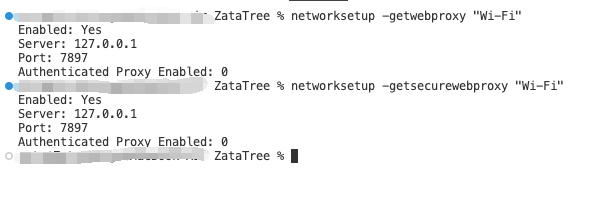

## 概述

代理配置分为两个层面：

- **系统代理**：由操作系统或 GUI 客户端（如 Clash Verge）管理，主要影响浏览器和 GUI 应用。
- **环境变量代理**：通过 `http_proxy` / `https_proxy` / `ALL_PROXY` 等环境变量设置，主要影响命令行工具。

两者互相独立。系统代理设置了，终端里的 curl/git/docker 不一定走代理；反之亦然。

---

## 一、macOS 系统代理（Clash Verge）

Clash Verge 开启「系统代理」后，会自动配置 macOS 的网络代理设置，浏览器等 GUI 应用会走代理。

### 1.1 查看当前系统代理

```bash
networksetup -getwebproxy "Wi-Fi"
networksetup -getsecurewebproxy "Wi-Fi"
```



### 1.2 绕过列表（Bypass）

在 Clash Verge 的「系统代理」设置中配置绕过地址，如：（一般默认就有了）

```
127.0.0.1, localhost, 192.168.0.0/16, 10.0.0.0/8, 172.16.0.0/12
```

**注意**：系统代理的绕过列表主要影响浏览器和 GUI 应用，**对命令行工具不生效**。

---

## 二、Shell 环境变量配置

### 2.1 基础变量

在 `~/.zshrc`（或 `~/.bashrc`）中添加：

```bash
# 代理地址（根据你的客户端端口修改）
export http_proxy="http://127.0.0.1:7897"
export https_proxy="http://127.0.0.1:7897"
export ALL_PROXY="socks5://127.0.0.1:7897"

# 绕过本地和局域网
export NO_PROXY="127.0.0.1,localhost,::1,192.168.0.0/16,10.0.0.0/8,172.16.0.0/12"
```

生效：

```bash
source ~/.zshrc
```

### 2.2 快速开关代理

可以添加别名方便切换：

```bash
# ~/.zshrc
alias proxy='export http_proxy=http://127.0.0.1:7897; export https_proxy=http://127.0.0.1:7897; export ALL_PROXY=socks5://127.0.0.1:7897'
alias unproxy='unset http_proxy; unset https_proxy; unset ALL_PROXY'
```

### 2.3 只对当前命令生效

```bash
http_proxy=http://127.0.0.1:7897 curl -I https://github.com
```

---

## 三、NO_PROXY 绕过详解

### 3.1 问题现象

Clash Verge 开启系统代理后，curl 访问 `localhost` 返回 404：

```bash
curl http://localhost:8000/api/xxx
# {"detail":"Not Found"}
```

`curl -v` 发现请求走了代理：

```
Uses proxy env variable http_proxy == 'http://127.0.0.1:7897'
```

### 3.2 原因

Clash Verge 的绕过列表不影响命令行工具。curl 读取 `http_proxy` 环境变量后，会尝试通过代理访问 localhost，而代理服务器不认识这个本地地址。

### 3.3 解决

补充 `NO_PROXY` 环境变量：

```bash
export NO_PROXY="127.0.0.1,localhost,::1,192.168.0.0/16,10.0.0.0/8,172.16.0.0/12"
```

**常见 NO_PROXY 值**：

| 地址 | 说明 |
|------|------|
| `127.0.0.1` | 本地 IPv4 |
| `localhost` | 本地主机名 |
| `::1` | 本地 IPv6 |
| `192.168.0.0/16` | 私网 A 段 |
| `10.0.0.0/8` | 私网 B 段 |
| `172.16.0.0/12` | 私网 C 段 |

### 3.4 验证

```bash
curl -v http://localhost:8000/health
# 不再出现 "Uses proxy env variable"
```

---

## 四、Git 代理配置

Git 不读取 `http_proxy` 环境变量（某些版本会读，但不可靠），需要单独配置：

### 4.1 HTTP/HTTPS 代理

```bash
git config --global http.proxy http://127.0.0.1:7897
git config --global https.proxy http://127.0.0.1:7897
```

### 4.2 SOCKS5 代理

```bash
git config --global http.proxy socks5://127.0.0.1:7897
```

### 4.3 取消代理

```bash
git config --global --unset http.proxy
git config --global --unset https.proxy
```

### 4.4 仅对特定域名配置

```bash
git config --global http.https://github.com.proxy http://127.0.0.1:7897
```

---

## 五、Docker 代理配置

Docker 的代理分两个层面：**Daemon 代理**（影响 `docker pull` 等命令）和**客户端默认代理**（影响 `docker run` / `docker build` 自动注入的环境变量）。

### 5.1 Docker 客户端默认代理

配置 `~/.docker/config.json`，让 `docker run` 和 `docker build` 自动注入代理环境变量：

```bash
mkdir -p ~/.docker
```

`~/.docker/config.json`：

```json
{
  "proxies": {
    "default": {
      "httpProxy": "http://127.0.0.1:7897",
      "httpsProxy": "http://127.0.0.1:7897",
      "noProxy": "127.0.0.1,localhost,::1"
    }
  }
}
```

**注意**：这个配置只影响容器内部和构建过程，**不影响** `docker pull` 拉取镜像。

### 5.2 Docker Daemon 代理

`docker pull` 等命令由 Docker Daemon 执行，Daemon 作为系统服务运行，不读取 Shell 环境变量，需要单独配置。

**注意：macOS 上的特殊行为**

Docker Desktop for Mac 运行在一个轻量级 Linux VM 中，这个 VM 的网络流量**经过 macOS 主机的网络栈**。因此即使没有在 Docker 中手动配置代理，Clash Verge 等工具开启的 **macOS 系统代理也会被 VM "捎带" 走**。这会导致：

- 开启 Clash 系统代理时，`docker pull` 能正常拉取（走了代理）
- 关闭 Clash 系统代理后，`docker pull` 可能失败或极慢（因为原先走代理的流量现在直连不通了）

如果你需要 Docker 在**无论系统代理开或关**的情况下都能稳定工作，建议显式配置 Daemon 代理（见下方）。

**Linux (systemd)**：

```bash
sudo mkdir -p /etc/systemd/system/docker.service.d
sudo tee /etc/systemd/system/docker.service.d/http-proxy.conf << 'EOF'
[Service]
Environment="HTTP_PROXY=http://127.0.0.1:7897"
Environment="HTTPS_PROXY=http://127.0.0.1:7897"
Environment="NO_PROXY=localhost,127.0.0.1,::1"
EOF

sudo systemctl daemon-reload
sudo systemctl restart docker
```

**macOS (Docker Desktop)**：

Settings → Resources → Proxies → Manual proxy configuration

### 5.3 容器内代理

运行容器时传入：

```bash
docker run -e http_proxy=http://host.docker.internal:7897 \
           -e https_proxy=http://host.docker.internal:7897 \
           -e NO_PROXY="localhost,127.0.0.1" \
           ubuntu
```

注意：容器内访问宿主机代理，macOS 用 `host.docker.internal`，Linux 用宿主机的局域网 IP。

---

## 六、包管理器代理

### 6.1 pip

```bash
pip install package-name --proxy http://127.0.0.1:7897

# 或设置环境变量
export PIP_PROXY=http://127.0.0.1:7897
```

### 6.2 npm

```bash
npm config set proxy http://127.0.0.1:7897
npm config set https-proxy http://127.0.0.1:7897

# 取消
npm config delete proxy
npm config delete https-proxy
```

### 6.3 uv

```bash
# uv 读取标准环境变量
export http_proxy=http://127.0.0.1:7897
export https_proxy=http://127.0.0.1:7897

# 或使用 --native-tls（某些证书问题场景）
uv pip install package-name --native-tls
```

---

## 七、常用工具代理

| 工具 | 代理方式 |
|------|---------|
| `curl` | 读取 `http_proxy` / `https_proxy` / `ALL_PROXY` |
| `wget` | 读取 `http_proxy` / `https_proxy`，或用 `-e http_proxy=` |
| `ssh` | 用 `-o ProxyCommand="nc -X 5 -x 127.0.0.1:7897 %h %p"` |
| `brew` | 读取环境变量，或 `HOMEBREW_CURLRC=1` + `~/.curlrc` |
| `go get` | 读取 `http_proxy` / `https_proxy` |

### 7.1 curl 指定代理

```bash
curl -x http://127.0.0.1:7897 https://api.github.com

# 或 SOCKS5
curl -x socks5://127.0.0.1:7897 https://api.github.com
```

### 7.2 wget 指定代理

```bash
wget -e http_proxy=http://127.0.0.1:7897 https://example.com
```

---

## 八、一键验证

配置完成后，验证代理是否生效：

```bash
# 查看当前代理环境变量
echo "HTTP:  $http_proxy"
echo "HTTPS: $https_proxy"
echo "ALL:   $ALL_PROXY"
echo "NO:    $NO_PROXY"

# 测试外网（应走代理）
curl -s -o /dev/null -w "%{http_code}" https://github.com

# 测试本地（应直连）
curl -v http://localhost:8000 2>&1 | grep -i "proxy"

# 查看出口 IP（对比开关代理）
curl -s https://httpbin.org/ip
```

---

## 九、常见问题

### Q1: 终端已经设置了代理，但某些命令还是不生效？

某些工具（如 Git）不读环境变量，需要单独配置。详见上文各节。

### Q2: Docker 容器内无法访问宿主机代理？

- macOS: 用 `host.docker.internal:7897`
- Linux: 用宿主机局域网 IP，如 `192.168.1.x:7897`
- 或配置 Docker 的 `--network host`（仅限 Linux）

### Q3: NO_PROXY 设置后不生效？

注意大小写：
- 大多数工具读 `NO_PROXY`
- 部分老工具读 `no_proxy`
建议两个都设：

```bash
export NO_PROXY="..."
export no_proxy="$NO_PROXY"
```
