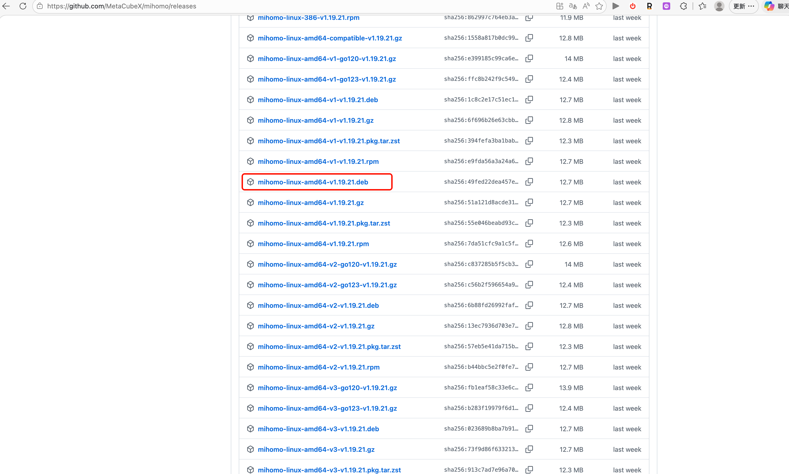
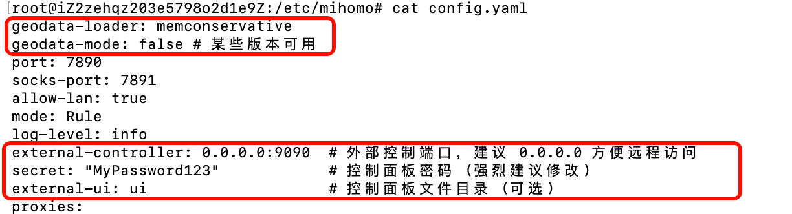

# 安装和配置

[github地址](https://github.com/MetaCubeX/mihomo/releases)

1. 首先下载deb包（或者压缩包）


2. 传输到远程服务器
```bash 
scp <deb包名>.deb root@remote_server:/root/
```

3. 安装deb包
```bash 
dpkg -i /root/<deb包名>.deb
```

4.下载 Country.mmdb
```bash
# 进入配置目录
cd /etc/mihomo

# 下载 Country.mmdb
curl -L -o Country.mmdb https://ghp.ci/https://github.com/MetaCubeX/meta-rules-dat/releases/download/latest/country.mmdb
```

5. 修改配置文件
```bash
# 编辑配置文件
vim /etc/mihomo/config.conf


# 粘贴你的clash配置文件
【-------】


# 把这几行添加到配置文件的开头
geodata-loader: memconservative
geodata-mode: false # 某些版本可用
external-controller: 0.0.0.0:9090  # 外部控制端口，建议 0.0.0.0 方便远程访问
secret: "your_secret_password"            # 控制面板密码 (强烈建议修改)
external-ui: ui                    # 控制面板文件目录 (可选)
```




6. 重启服务
```bash
# 重启服务
systemctl restart mihomo

# 立即查看日志
journalctl -u mihomo -f
```

7. 访问控制面板
```bash
# 访问控制面板
http://remote_server:9090/ui?secret=your_secret_password
```

8. 配置环境变量
```bash
# 写入环境变量
echo "export http_proxy=http://127.0.0.1:7890" >> ~/.bashrc
echo "export https_proxy=http://127.0.0.1:7890" >> ~/.bashrc
# 使其立即生效
source ~/.bashrc
```
9. 设置开机自启
```bash
# 设置开机自启
systemctl enable mihomo
```