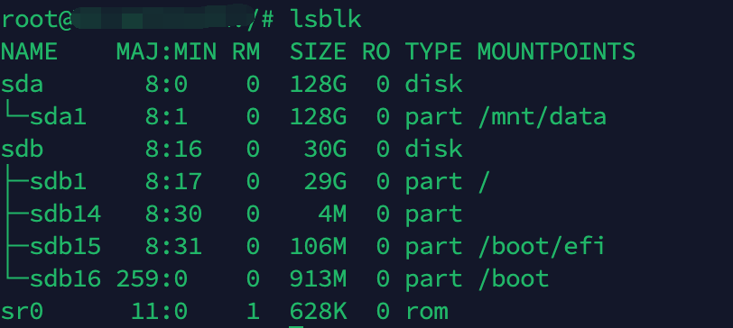

服务器运维的第一步是搞清楚自己手上有几块盘、有多大、挂在哪。本文覆盖从磁盘查看、分区格式化到持久化挂载的完整流程。

---

## 查看磁盘概况

### 1. lsblk —— 最直观的树形视图

```bash
lsblk
```

输出示例：




```
NAME        MAJ:MIN RM  SIZE RO TYPE MOUNTPOINT
sda           8:0    0   50G  0 disk
├─sda1        8:1    0    1G  0 part /boot
└─sda2        8:2    0   49G  0 part /
sdb           8:16   0  100G  0 disk
└─sdb1        8:17   0  100G  0 part /mnt
nvme0n1     259:0    0  200G  0 disk
```

解读：
- `sda`、`sdb`、`nvme0n1` 是 **3 块物理磁盘**
- `sda` 分了 2 个区，分别挂载到 `/boot` 和 `/`
- `sdb` 分了 1 个区，挂载到 `/mnt`
- `nvme0n1` 未分区、未挂载

常用参数：

```bash
# 只看物理盘，不显示分区
lsblk -d -o NAME,SIZE,TYPE,MODEL

# 显示文件系统类型和 UUID
lsblk -f
```

### 2. df -h —— 查看已挂载分区的使用情况

```bash
df -h
```

输出示例：

```
Filesystem      Size  Used Avail Use% Mounted on
/dev/sda2        49G   15G   32G  32% /
/dev/sda1       1.0G  200M  800M  20% /boot
/dev/sdb1       100G   10G   90G  10% /mnt
```

### 3. fdisk -l —— 查看所有磁盘详情（含未挂载）

```bash
sudo fdisk -l
```

需要 root 权限，能看到 sector 大小、磁盘标签类型等详细信息。

### 4. 查看磁盘类型（HDD / SSD / NVMe）

```bash
# 方法1：通过旋转状态判断（SSD 为 0）
cat /sys/block/sda/queue/rotational
# 0 = SSD/NVMe, 1 = 机械硬盘

# 方法2：直接查看硬件信息
lsblk -d -o NAME,ROTA,TYPE,MODEL

# 方法3：NVMe 专用信息
sudo nvme list
```

---

## 分区与格式化

### 对新磁盘进行分区

以 `/dev/sdb` 为例：

```bash
sudo fdisk /dev/sdb
```

交互命令：
- `n` —— 新建分区
- `p` —— 主分区
- `1` —— 分区号
- 回车两次 —— 使用默认起始和结束扇区（占用整块盘）
- `w` —— 写入并退出

> 大于 2TB 的磁盘请使用 `gdisk` 或 `parted`，fdisk 不支持 GPT 大分区。

### 格式化分区

```bash
# ext4（Linux 最常用）
sudo mkfs.ext4 /dev/sdb1

# xfs（适合大文件、高并发）
sudo mkfs.xfs /dev/sdb1
```

---

## 挂载磁盘

### 临时挂载

```bash
sudo mkdir -p /mnt/data
sudo mount /dev/sdb1 /mnt/data
```

重启后失效。

### 持久化挂载（/etc/fstab）

先获取分区的 UUID：

```bash
lsblk -f /dev/sdb1
# 或
sudo blkid /dev/sdb1
```

编辑 fstab：

```bash
sudo nano /etc/fstab
```

添加一行（**务必用 UUID，不要用设备名**，防止重启后设备名变化导致挂错盘）：

```
UUID=xxxxx-xxxxx-xxxxx  /mnt/data  ext4  defaults,noatime  0  2
```

字段说明：
- `UUID=...` —— 分区的唯一标识
- `/mnt/data` —— 挂载点
- `ext4` —— 文件系统类型
- `defaults,noatime` —— 挂载选项（noatime 减少不必要的写操作，延长 SSD 寿命）
- `0` —— dump 备份标记（一般填 0）
- `2` —— fsck 检查顺序（根目录填 1，其他填 2，不检查填 0）

验证配置是否正确：

```bash
sudo mount -a
```

无报错即表示配置正确。如果配错了，重启后可能进不了系统，所以 **mount -a 验证这一步不能省**。

---

## 场景：把 Docker 数据迁移到数据盘

这是最常见的需求之一。系统盘通常只有 50G，数据盘有几百 G。将 Docker 数据根目录改到 `/mnt/docker_data`：

```bash
sudo systemctl stop docker
sudo systemctl stop docker.socket

sudo mkdir -p /mnt/docker_data
sudo rsync -aP /var/lib/docker/ /mnt/docker_data/

sudo nano /etc/docker/daemon.json
```

写入：

```json
{
  "data-root": "/mnt/docker_data"
}
```

```bash
sudo systemctl start docker
```

验证：

```bash
docker info | grep "Docker Root Dir"
# 应输出 /mnt/docker_data
```

更详细的方案（软链接、Compose 级挂载等）可参考 [Docker 容器相关命令](/p/docker容器相关命令/) 中的"数据卷自动挂载到 /mnt"一节。

---

## 常用命令速查表

| 需求 | 命令 |
|------|------|
| 查看物理磁盘列表 | `lsblk -d` |
| 查看分区 + 挂载点 | `lsblk` |
| 查看已挂载磁盘使用率 | `df -h` |
| 查看所有磁盘详情 | `sudo fdisk -l` |
| 查看分区 UUID | `lsblk -f` 或 `sudo blkid` |
| 判断 SSD/HDD | `cat /sys/block/sdX/queue/rotational` |
| 新建分区 | `sudo fdisk /dev/sdX` |
| 格式化 ext4 | `sudo mkfs.ext4 /dev/sdX1` |
| 临时挂载 | `sudo mount /dev/sdX1 /mnt/xxx` |
| 验证 fstab | `sudo mount -a` |
| 查看目录占用空间 | `du -sh /path` |

---

## 注意事项

1. **操作前确认设备名**：`sda`、`sdb` 在不同机器、甚至同一机器重启后可能变化，写脚本或 fstab 时尽量用 UUID。
2. **不要直接格式化已挂载的分区**：先 `umount`，或者在救援模式下操作。
3. **云服务器的数据盘**：首次使用需要先在控制台"挂载"到实例，然后在系统内分区格式化。阿里云、AWS、GCP 都是如此。
4. **LVM 场景**：某些云镜像默认使用 LVM，此时 `lsblk` 看到的结构会更复杂（`vg-xxx`、`lv-xxx`），扩容操作需要用 `lvextend` + `resize2fs`。
