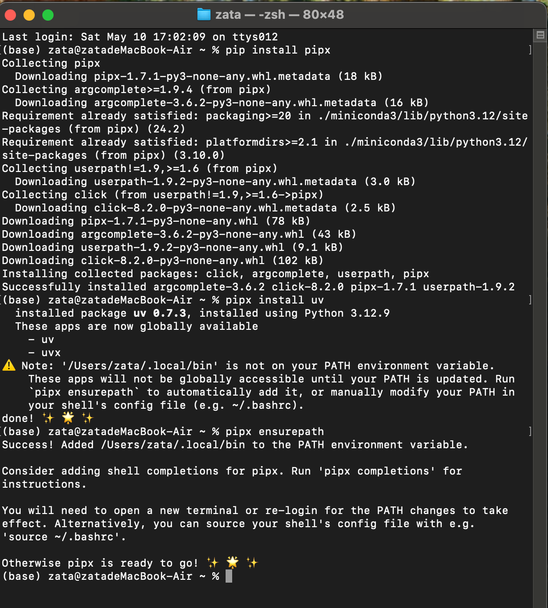
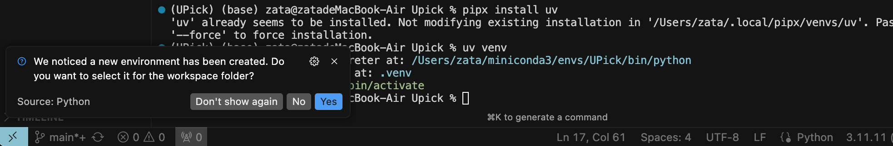

||
|---|
|- [UV常用命令](#uv常用命令)|
|- [pyproject.toml使用](#pyprojecttoml使用)|
|- [uv tool 使用](#uv-tool的使用方法)|


---


### uv常用命令
```bash
# 初始化一个新的 Python 项目 and 创建toml文件
uv init <project-name>

# 创建虚拟环境
uv venv

# 激活虚拟环境（Unix/macOS）
source .venv/bin/activate
# 激活虚拟环境（Windows）
.venv\Scripts\activate

# 安装依赖
uv pip install <package-name>

# 安装项目依赖（从 pyproject.toml 或 requirements.txt）
uv pip install -r requirements.txt
# 或
uv pip install .

# 升级包
uv pip install --upgrade <package-name>

# 卸载包
uv pip uninstall <package-name>

# 列出已安装的包
uv pip list

# 导出依赖到 requirements.txt
uv pip freeze > requirements.txt

# 运行 Python 脚本或命令
uv run <script.py>
# 或
uv run python <script.py>

# 添加依赖到 pyproject.toml
uv add <package-name>

# 移除依赖从 pyproject.toml
uv remove <package-name>

# 同步项目依赖（确保虚拟环境与 pyproject.toml 一致）
uv sync     # 如果只有requirements.txt使用uv sync --requirements requirements.txt

# 查看依赖树
uv tree

# 清理缓存
uv cache clean

# 检查 uv 版本
uv --version
```


UV 是一个由 Astral (Ruff 的开发者) 开发的、用 Rust 编写的极速 Python 包安装器和解析器。它的目标是成为 `pip` 和 `venv` 的直接替代品，提供更快、更友好的用户体验。


**教程大纲:**

1.  **UV 是什么？为什么选择 UV？**
2.  **安装 UV**
3.  **核心概念**
    * 虚拟环境管理
    * 包管理 (作为 `pip` 的替代)
    * 依赖解析
    * 全局缓存
4.  **基本命令详解**
    * 创建和管理虚拟环境 (`uv venv`)
    * 安装包 (`uv pip install`)
    * 卸载包 (`uv pip uninstall`)
    * 列出已安装的包 (`uv pip list`)
    * 生成依赖文件 (`uv pip freeze`)
    * 从依赖文件安装 (`uv pip install -r`, `uv pip sync`)
    * 编译依赖 (`uv pip compile`)
5.  **高级用法和特性**
    * 使用 `pyproject.toml`
    * 临时执行包 (`uvx`)
    * 缓存管理 (`uv cache`)
6.  **与 pip 的主要区别和优势**
7.  **总结与展望**

---

### 1. UV 是什么？为什么选择 UV？

* **UV 是什么？**
    UV 是一个实验性的 Python 包管理工具，旨在提供一个非常快速的、统一的包安装和虚拟环境管理体验。它被设计为 `pip`, `pip-tools` (特别是 `pip-compile`) 和 `venv` 的替代品。

* **为什么选择 UV？**
    * **速度极快:** UV 使用 Rust 编写，并在依赖解析和包安装方面进行了大量优化，通常比 `pip` 快几个数量级，尤其是在复杂的依赖关系或冷缓存启动时。
    * **统一体验:** 将虚拟环境创建 (`venv`) 和包安装/管理 (`pip`) 功能整合到单个命令行工具 `uv` 中。
    * **更好的依赖解析器:** UV 内置了一个高性能的依赖解析器，可以更快、更准确地解决复杂的依赖冲突。
    * **现代化的设计:** 遵循最新的 Python 打包标准 (如 PEP 517, PEP 621)。
    * **全局缓存:** UV 使用一个共享的全局缓存来存储下载的包和构建的轮子 (wheels)，这使得在不同项目中重用依赖时速度更快，并节省磁盘空间。
    * **`pip-compile` 功能内置:** `uv pip compile` 命令提供了类似于 `pip-tools` 的依赖锁定功能。
    * **`uvx`**: 类似于 `npx` (Node.js) 或 `pipx run`，允许你临时执行来自 PyPI 的包，而无需将其安装到你的项目中或全局环境中。

---

### 2. 安装 UV

你可以通过多种方式安装 UV：

* **使用 `curl` (Linux & macOS):**
    ```bash
    curl -LsSf https://astral.sh/uv/install.sh | sh
    ```
* **使用 `pip` (不推荐用于全局安装，除非在隔离环境中):**
    ```bash
    pip install uv
    ```
* **使用 `pipx` (推荐，用于将 UV 安装到隔离环境中):**
    ```bash
    pipx install uv
    ```
    如果你没有 `pipx`, 可以先安装它: `pip install pipx` 




* **使用 `cargo` (如果你是 Rust 开发者):**
    ```bash
    cargo install uv
    ```
* **从 GitHub Releases 下载预编译的二进制文件。**

安装完成后，验证安装：
```bash
uv --version
```

*注意：如果你发现安装好之后，vscode/cursor中的terminal并没有生效，那么需要完全重启vscode/cursor*


---

### 3. 核心概念

* **虚拟环境管理:**
    UV 可以像 `python -m venv` 或 `virtualenv` 一样创建和管理虚拟环境。它会将环境创建在 `.venv` 目录（默认）或你指定的目录。

* **包管理 (作为 `pip` 的替代):**
    `uv pip` 子命令旨在成为 `pip` 命令的直接替代品。大多数你熟悉的 `pip` 命令都可以用 `uv pip` 替代，例如 `uv pip install <package>`, `uv pip uninstall <package>`。

* **依赖解析:**
    UV 的核心优势之一是其快速且健壮的依赖解析器。当你安装包或编译需求文件时，它会分析所有直接和间接的依赖关系，找到一组兼容的版本。

* **全局缓存:**
    UV 会在用户缓存目录（例如 `~/.cache/uv` 或 `%LOCALAPPDATA%\uv\cache`）中维护一个全局缓存。这包括下载的包索引、sdist、wheel 文件等。这意味着如果你在项目 A 中安装了 `requests==2.30.0`，在项目 B 中再次安装相同版本的 `requests` 时，UV 可以直接从缓存中获取，无需重新下载或构建。

---

### 4. 基本命令详解

#### 创建和管理虚拟环境 (`uv venv`)

* **创建虚拟环境:**
    默认情况下，会在当前目录下创建一个名为 `.venv` 的虚拟环境。
    ```bash
    uv venv
    ```
    
    你也可以指定环境名称和 Python解释器：
    ```bash
    uv venv myenv --python 3.11 # 使用 python3.11 创建名为 myenv 的环境
    uv venv .env -p 3.9       # 使用 python3.9 创建名为 .env 的环境
    ```

* **激活虚拟环境:**
    UV 创建的虚拟环境与标准 `venv` 模块创建的环境结构相同，激活方式也一样：
    * Linux/macOS:
        ```bash
        source .venv/bin/activate
        # 或 source myenv/bin/activate
        ```
    * Windows (CMD):
        ```bash
        .venv\Scripts\activate.bat
        ```
    * Windows (PowerShell):
        ```bash
        .venv\Scripts\Activate.ps1
        ```
    激活后，命令行提示符通常会显示虚拟环境的名称。

* **停用虚拟环境:**
    ```bash
    deactivate
    ```

#### 安装包 (`uv pip install`)

* **从 PyPI 安装最新版本:**
    (确保你已激活虚拟环境，或者 UV 会尝试安装到全局环境，除非配置了 `UV_SYSTEM_PYTHON=true` 来明确允许)
    ```bash
    uv pip install requests
    uv pip install flask sqlalchemy
    ```

* **安装特定版本:**
    ```bash
    uv pip install "requests==2.28.1"
    uv pip install "django>=3.2,<4.0"
    ```

* **从 `requirements.txt` 文件安装:**
    ```bash
    uv pip install -r requirements.txt
    ```

* **从本地项目安装 (使用 `pyproject.toml` 或 `setup.py`):**
    ```bash
    uv pip install .  # 安装当前目录下的项目
    uv pip install -e . # 以可编辑模式安装
    ```

* **从 Git 仓库安装:**
    ```bash
    uv pip install git+https://github.com/pallets/flask.git
    ```

* **指定索引 URL:**
    ```bash
    uv pip install --index-url https://my-private-index/simple requests
    ```

#### 卸载包 (`uv pip uninstall`)

```bash
uv pip uninstall requests
uv pip uninstall requests flask
```
可以配合 `-r requirements.txt` 使用，卸载文件中列出的所有包。

#### 列出已安装的包 (`uv pip list`)

```bash
uv pip list
uv pip list --format freeze # 输出格式与 requirements.txt 相同
uv pip list --format json   # 输出为 JSON 格式
```

#### 生成依赖文件 (`uv pip freeze`)

这会将当前环境中所有已安装的包及其版本输出到标准输出，通常用于生成 `requirements.txt` 文件。
```bash
uv pip freeze > requirements.txt
```

#### 从依赖文件安装 (`uv pip install -r`, `uv pip sync`)

* `uv pip install -r requirements.txt`:
    安装 `requirements.txt` 中列出的所有包。如果某些包已安装但版本不匹配，UV 会尝试升级或降级。如果某些包已安装但不在文件中，它们不会被卸载。

* `uv pip sync requirements.txt`:
    **推荐使用 `sync` 来精确同步环境。** 此命令会确保你的虚拟环境与 `requirements.txt` 文件中的内容 *完全一致*。
    * 安装文件中列出的、但尚未安装的包。
    * 升级或降级已安装的、但版本与文件中不符的包。
    * **卸载环境中已安装的、但未在文件中列出的包。**
    这对于确保环境的纯净和可复现性非常有用。

    如果你也使用 `pyproject.toml` (见下文)，你可以同步项目的依赖：
    ```bash
    uv pip sync pyproject.toml
    # 或 uv pip sync (如果 pyproject.toml 在当前目录)
    ```

#### 编译依赖 (`uv pip compile`)

类似于 `pip-compile` (来自 `pip-tools`)，此命令用于将高层级的依赖需求（例如 `requirements.in` 或 `pyproject.toml`）解析并锁定为具体的版本，输出到一个完全固定的依赖文件（例如 `requirements.txt`）。

* **从 `requirements.in` 编译到 `requirements.txt`:**
    `requirements.in` (示例):
    ```
    flask
    requests>=2.20
    ```
    编译命令:
    ```bash
    uv pip compile requirements.in -o requirements.txt
    ```
    这会生成一个 `requirements.txt` 文件，其中包含 Flask、Requests 以及它们所有子依赖的精确版本。

* **从 `pyproject.toml` 编译:**
    如果你的项目使用 `pyproject.toml` 定义依赖：
    `pyproject.toml` (部分示例):
    ```toml
    [project]
    name = "my-app"
    version = "0.1.0"
    dependencies = [
        "flask",
        "requests>=2.20",
    ]

    [project.optional-dependencies]
    dev = [
        "pytest",
        "black",
    ]
    ```
    编译命令:
    ```bash
    # 编译核心依赖
    uv pip compile pyproject.toml -o requirements.txt

    # 编译核心依赖和 'dev' 附加依赖
    uv pip compile pyproject.toml --extra dev -o requirements-dev.txt
    ```

---

### pyproject.toml使用

```sh
# Initialize a new project with pyproject.toml
uv init <project-name>

# Add a dependency to pyproject.toml
uv add <package>

# Remove a dependency from pyproject.toml
uv remove <package>

# Sync dependencies from pyproject.toml to virtual environment
uv sync

# Update dependencies and lockfile
uv lock

# Run a script or command in the project environment
uv run <script-or-command>

# Display dependency tree
uv tree

# Add a development dependency
uv add --dev <package>

# Create or update uv.lock file
uv lock

# Build a source distribution or wheel
uv build

# Publish the project to a package index
uv publish

# Export dependencies to requirements.txt
uv export

# Check or manage Python version
uv python
```

在 Python 项目中使用 `uv` 包管理工具时，`pyproject.toml` 是其核心配置文件，用于定义项目元数据、依赖关系和构建配置。以下是关于如何使用 `uv` 的 `pyproject.toml` 文件的详细说明：

 1. **基本结构**
`pyproject.toml` 文件基于 TOML 格式，`uv` 使用它来管理项目的依赖、元数据和构建配置。以下是一个典型的 `pyproject.toml` 文件结构：

```toml
[project]
name = "my-project"
version = "0.1.0"
description = "A sample Python project"
readme = "README.md"
requires-python = ">=3.8"
dependencies = [
    "requests>=2.25.1",
    "pandas>=1.5.0",
]

[tool.uv]
 uv 特定的配置
dev-dependencies = [
    "pytest>=7.0.0",
    "black>=23.0.0",
]
```

 2. **关键字段说明**
 `[project]` 部分
这是 PEP 621 标准定义的项目元数据部分，`uv` 使用它来了解项目的基本信息和依赖。
- `name`: 项目名称，必须唯一。
- `version`: 项目版本号，建议遵循语义化版本规范（Semantic Versioning）。
- `description`: 项目简短描述。
- `readme`: 项目 README 文件路径（用于生成项目描述）。
- `requires-python`: 指定支持的 Python 版本（例如 `>=3.8`）。
- `dependencies`: 项目的生产依赖列表，格式为包名和版本约束。

 `[tool.uv]` 部分
这是 `uv` 专用的配置部分，用于定义 `uv` 特定的设置。
- `dev-dependencies`: 开发环境依赖（如测试、格式化工具），与生产依赖分开管理。
- 其他配置（可选）：
  - `index-url`: 指定自定义的 PyPI 源，例如 `"https://pypi.company.com/simple"`.
  - `extra-index-url`: 额外的 PyPI 源。
  - `constraint`: 指定依赖约束文件路径。
  - `override`: 指定依赖覆盖文件路径。

 3. **使用 `uv` 管理 `pyproject.toml`**
以下是如何结合 `uv` 命令和 `pyproject.toml` 进行项目管理的常见操作：

 初始化项目
运行以下命令，`uv` 会自动创建一个基础的 `pyproject.toml` 文件：
```bash
uv init my-project
```
这会生成一个包含 `[project]` 部分的 `pyproject.toml`，你可以根据需要编辑。

 添加依赖
- 添加生产依赖：
  ```bash
  uv add requests
  ```
  这会在 `pyproject.toml` 的 `[project]` 部分添加 `requests` 依赖。
- 添加开发依赖：
  ```bash
  uv add --dev pytest
  ```
  这会在 `[tool.uv]` 部分添加 `pytest` 作为开发依赖。

 移除依赖
- 移除生产依赖：
  ```bash
  uv remove requests
  ```
- 移除开发依赖：
  ```bash
  uv remove --dev pytest
  ```

 同步依赖
运行以下命令，确保虚拟环境中的依赖与 `pyproject.toml` 一致：
```bash
uv sync
```
这会安装 `[project.dependencies]` 和 `[tool.uv.dev-dependencies]` 中的所有依赖。

 运行项目
使用 `uv run` 执行脚本或命令，自动使用虚拟环境的依赖：
```bash
uv run python main.py
```

 锁定依赖
`uv` 会生成一个 `uv.lock` 文件，用于锁定依赖的确切版本，确保可重复构建：
```bash
uv lock
```
`uv.lock` 是自动生成的，不需要手动编辑。

 4. **示例：完整的 `pyproject.toml`**
以下是一个更完整的示例，包含多种配置：
```toml
[project]
name = "my-project"
version = "0.2.0"
description = "A Python project managed by uv"
authors = [
    { name = "Your Name", email = "your.email@example.com" }
]
license = "MIT"
requires-python = ">=3.9"
dependencies = [
    "fastapi>=0.95.0",
    "uvicorn>=0.20.0",
]

[tool.uv]
dev-dependencies = [
    "pytest>=7.3.0",
    "ruff>=0.1.0",
    "mypy>=1.0.0",
]
index-url = "https://pypi.org/simple"
extra-index-url = ["https://test.pypi.org/simple"]

[build-system]
requires = ["hatchling"]
build-backend = "hatchling.build"
```

 5. **注意事项**
- **版本约束**：依赖版本使用 PEP 440 规范，例如 `>=1.0.0,<2.0.0`。
- **虚拟环境**：`uv` 自动在项目目录下的 `.venv` 创建虚拟环境，运行 `uv sync` 即可激活。
- **兼容性**：`uv` 的 `pyproject.toml` 遵循 PEP 621 标准，与其他工具（如 `poetry`、`pdm`）兼容，但 `[tool.uv]` 是 `uv` 专有。
- **锁定文件**：`uv.lock` 确保依赖版本一致，建议将其加入版本控制。
- **自定义源**：如果使用私有 PyPI 源，确保在 `[tool.uv]` 中正确配置 `index-url` 或 `extra-index-url`。

 6. **常见问题**
- **如何迁移现有项目到 `uv`？**
  1. 确保 `pyproject.toml` 包含 `[project]` 部分，列出依赖。
  2. 运行 `uv lock` 生成 `uv.lock`。
  3. 运行 `uv sync` 安装依赖。
- **如何处理依赖冲突？**
  使用 `uv lock --verbose` 查看冲突详情，必要时在 `[tool.uv]` 中添加 `constraint` 文件。
- **如何运行特定命令？**
  使用 `uv run` 执行命令，例如 `uv run pytest tests/`。

 7. **更多资源**
- 官方文档：访问 [uv 文档](https://docs.astral.sh/uv/) 获取最新信息。
- 示例项目：查看 `uv` 的 GitHub 仓库或官方示例。
- 如果需要实时搜索最新信息，可使用 `uv` 的 X 社区或 PyPI 页面。

如果你有具体的 `pyproject.toml` 配置问题或需要进一步示例，请提供更多细节，我可以为你定制解答！


### uv tool的使用方法

```bash
# 安装命令行工具到持久化环境
uv tool install <package>              # 安装指定包的工具（如 ruff）
uv tool install <package>==<version>   # 安装特定版本的工具
uv tool install <package> --with <dep> # 安装工具并附带额外依赖
uv tool install <package> --python <version> # 使用指定 Python 版本安装

# 在临时环境中运行工具（别名 uvx）
uvx <command>                          # 运行工具（如 uvx pycowsay 'hello'）
uvx <command>@<version>                # 运行特定版本的工具
uvx --from <package> <command>         # 指定提供命令的包（如 uvx --from httpie http）
uvx --python <version> <command>       # 使用指定 Python 版本运行

# 升级已安装的工具
uv tool upgrade <package>              # 升级工具到最新版本（尊重版本约束）

# 列出已安装的工具
uv tool list                           # 显示所有通过 uv tool install 安装的工具

# 卸载工具
uv tool uninstall <package>            # 移除指定工具及其环境

# 更新 shell 配置以确保工具可执行文件在 PATH 中
uv tool update-shell                   # 添加 ~/.local/bin 到 PATH
```


以下是关于 Python 包管理工具 **uv** 中 `tool` 功能的详细使用教程，基于官方文档和相关资料整理，涵盖安装、运行、管理工具等核心操作，并提供示例以便于理解。[](https://docs.astral.sh/uv/getting-started/installation/)[](https://github.com/astral-sh/uv)[](https://medium.com/%40nimritakoul01/uv-package-manager-for-python-f92c5a760a1c)

---

 什么是 uv 的 `tool` 功能？

`uv` 的 `tool` 功能允许用户安装和运行 Python 包提供的命令行工具（类似 `pipx`），并在隔离的环境中执行这些工具。它特别适合需要快速运行 CLI 工具（如 `ruff`、`pytest` 或 `huggingface-cli`）的场景。`uv tool` 提供了以下优势：
- **隔离性**：工具运行在独立的虚拟环境中，避免与项目依赖冲突。
- **高效性**：利用 `uv` 的高速缓存和 Rust 实现，安装和运行工具极快。
- **兼容性**：支持 `pip` 生态系统，易于迁移和使用。

`uv tool` 主要命令包括：
- `uv tool install`：安装工具及其依赖。
- `uv tool run`（别名 `uvx`）：在临时环境中运行工具。
- `uv tool upgrade`：升级已安装的工具。
- `uv tool list`：列出已安装的工具。
- `uv tool uninstall`：卸载工具。

---


 使用 uv tool 的教程

以下是 `uv tool` 的核心功能和使用步骤，包含具体命令和示例。

 1. 安装命令行工具 (`uv tool install`)

使用 `uv tool install` 将一个 Python 包提供的命令行工具安装到持久化环境中，工具的可执行文件会自动添加到 `PATH` 中。

**语法**：
```bash
uv tool install <package> [options]
```

**常用选项**：
- `--with <package>`：安装额外的依赖包。
- `--python <version>`：指定 Python 版本。
- `--force`：强制重新安装。
- `--from <package>`：指定工具来源包（当包名和工具名不同时）。

**示例 1：安装 ruff 工具**
`ruff` 是一个快速的 Python 代码检查工具。
```bash
uv tool install ruff
```
- 安装后，运行以下命令验证：
  ```bash
  ruff --version
  ```
  输出示例：
  ```
  ruff 0.5.4
  ```

**示例 2：安装 huggingface-cli 工具**
`huggingface_hub` 包提供了 `huggingface-cli` 工具，用于与 Hugging Face 仓库交互。
```bash
uv tool install huggingface_hub
```
- 运行工具：
  ```bash
  huggingface-cli --version
  ```

**示例 3：安装特定版本的工具**
安装特定版本的 `ruff`：
```bash
uv tool install 'ruff==0.5.0'
```

**示例 4：安装带有额外依赖的工具**
安装 `mkdocs` 并附带 `mkdocs-material` 主题：
```bash
uv tool install mkdocs --with mkdocs-material
```

**注意**：
- 安装的工具可执行文件默认位于 `~/.local/bin/`（Linux/macOS）或 `%USERPROFILE%\.local\bin`（Windows）。确保该路径在 `PATH` 中。
- 如果工具未自动添加到 `PATH`，运行以下命令更新 shell 配置：
  ```bash
  uv tool update-shell
  ```

 2. 运行工具 (`uv tool run` / `uvx`)

使用 `uv tool run`（或其别名 `uvx`）可以在临时虚拟环境中运行工具，无需持久化安装。适合一次性使用或测试。

**语法**：
```bash
uvx <command> [args]
 或
uv tool run <command> [args]
```

**常用选项**：
- `--from <package>`：指定提供命令的包（当包名和命令名不同时）。
- `--python <version>`：指定 Python 版本。
- `@<version>`：运行特定版本的工具。

**示例 1：运行 pycowsay**
运行 `pycowsay` 工具生成 ASCII 艺术：
```bash
uvx pycowsay 'hello world!'
```
输出示例：
```
 ------------ 
< hello world! >
 ------------ 
    ^__^
    (oo)\_______
    (__)\       )\/\
        ||----w |
        ||     ||
```

**示例 2：运行特定包的工具**
`httpie` 包提供 `http` 命令：
```bash
uvx --from httpie http https://example.com
```

**示例 3：运行特定版本的工具**
运行 `ruff` 的 0.3.0 版本：
```bash
uvx ruff@0.3.0 check
```

**示例 4：指定 Python 版本**
使用 Python 3.12 运行 `ruff`：
```bash
uvx --python 3.12 ruff --version
```

**注意**：
- `uvx` 运行的工具在命令执行后，临时环境会被销毁。
- 如果工具需要频繁使用，建议用 `uv tool install` 安装到持久化环境。

 3. 升级工具 (`uv tool upgrade`)

升级已安装的工具到最新版本，尊重安装时的版本约束。

**语法**：
```bash
uv tool upgrade <package>
```

**示例：升级 ruff**
```bash
uv tool upgrade ruff
```
- 如果安装时指定了版本范围（如 `ruff>=0.3,<0.4`），升级将保持在该范围内。
- 要更改版本约束，重新运行 `uv tool install`：
  ```bash
  uv tool install 'ruff>=0.4'
  ```

 4. 列出已安装工具 (`uv tool list`)

查看所有通过 `uv tool install` 安装的工具。

**语法**：
```bash
uv tool list
```

**示例**：
```bash
uv tool list
```
输出示例：
```
ruff (0.5.4)
huggingface-cli (0.23.0)
```

 5. 卸载工具 (`uv tool uninstall`)

移除已安装的工具及其环境。

**语法**：
```bash
uv tool uninstall <package>
```

**示例：卸载 ruff**
```bash
uv tool uninstall ruff
```

 6. 管理工具依赖

`uv tool` 安装的工具不会将其模块暴露给当前 Python 环境，以避免冲突。例如，安装 `ruff` 后，以下命令会失败：
```bash
python -c "import ruff"
```
这是设计使然，确保工具的依赖与项目隔离。

如果需要将工具的模块用于项目，改用 `uv add` 或 `uv pip install` 将包安装到项目环境中：
```bash
uv add ruff
```

 7. 高级用法：结合 pyproject.toml

对于项目管理，`uv` 支持在 `pyproject.toml` 中定义工具依赖组。例如，添加 `pytest` 到开发依赖组：

**编辑 pyproject.toml**：
```toml
[project]
name = "my-project"
version = "0.1.0"
dependencies = ["fastapi"]

[dependency-groups]
dev = ["pytest>=8.3.4"]
lint = ["ruff>=0.5.4"]
```

**安装依赖**：
```bash
uv sync --group dev
```
- 运行 `pytest`：
  ```bash
  uv run pytest
  ```

**运行 lint 工具**：
```bash
uv run ruff check
```

 8. 常见问题与解决方案

- **问题**：工具命令未找到。
  - **解决**：确保 `~/.local/bin` 在 `PATH` 中，运行 `uv tool update-shell` 或手动添加：
    ```bash
    export PATH="$HOME/.local/bin:$PATH"
    ```

- **问题**：工具运行时依赖冲突。
  - **解决**：使用 `uvx` 在临时环境中运行，或检查 `pyproject.toml` 中的依赖版本。

- **问题**：需要特定 Python 版本。
  - **解决**：使用 `uv python install` 安装所需版本：
    ```bash
    uv python install 3.11
    uvx --python 3.11 <command>
    ```

---

 最佳实践

1. **优先使用 `uvx` 进行测试**：
   - 对于不常使用的工具，使用 `uvx` 避免占用磁盘空间。
   - 示例：`uvx black --version` 检查 `black` 版本。

2. **持久化常用工具**：
   - 使用 `uv tool install` 安装频繁使用的工具（如 `ruff`、`pytest`），并确保 `PATH` 配置正确。

3. **结合 CI/CD**：
   - 在 CI/CD 管道中，使用 `uv tool install` 安装工具，确保一致性。例如：
     ```bash
     uv tool install ruff
     ruff check .
     ```

4. **保持版本一致**：
   - 使用 `uv.lock` 和 `pyproject.toml` 锁定工具版本，确保团队成员和生产环境使用相同版本。

5. **定期清理**：
   - 使用 `uv tool list` 检查已安装工具，`uv tool uninstall` 移除不再需要的工具。

---

 示例工作流：设置开发环境

假设你要为一个 FastAPI 项目设置 `ruff`（代码检查）和 `pytest`（测试）工具：

1. 初始化项目：
   ```bash
   uv init my-project
   cd my-project
   ```

2. 添加项目依赖：
   ```bash
   uv add fastapi
   ```

3. 添加开发工具：
   ```bash
   uv add --group dev pytest
   uv add --group lint ruff
   ```

4. 安装工具：
   ```bash
   uv tool install ruff
   uv tool install pytest
   ```

5. 运行检查和测试：
   ```bash
   ruff check .
   uv run pytest
   ```

6. 检查工具：
   ```bash
   uv tool list
   ```

---

 局限性

- **不完全兼容 `pip`**：某些 `pip` 功能（如 `.egg` 依赖、特定 Git 安装）暂不支持。查看 [pip 兼容性指南](https://docs.astral.sh/uv/pip/compatibility/) 获取详情。[](https://codemaker2016.medium.com/introducing-uv-next-gen-python-package-manager-b78ad39c95d7)
- **早期开发阶段**：部分功能可能不稳定，建议关注 [GitHub Issues](https://github.com/astral-sh/uv) 获取最新更新。[](https://ubuntushell.com/install-uv-python-package-manager/)
- **工具隔离**：`uv tool install` 的模块不可导入到项目中，需单独安装依赖。

---

 参考资料

- 官方文档：https://docs.astral.sh/uv/guides/tools/[](https://docs.astral.sh/uv/)
- GitHub 仓库：https://github.com/astral-sh/uv[](https://github.com/astral-sh/uv)
- UV 工具介绍：https://www.saaspegasus.com/guides/uv-python-package-manager/[](https://www.saaspegasus.com/guides/uv-deep-dive/)
- 示例教程：https://realpython.com/python-uv/[](https://realpython.com/python-uv/)


### 与 Jupyter Notebook / JupyterLab 集成


#### 4.2 设置步骤 


```bash 
# 4.2.1 创建并激活项目的 uv 虚拟环境 
uv venv .venv && source .venv/bin/activate

# 4.2.2 在 uv 环境中安装 Jupyter 和 ipykernel
uv pip install jupyterlab ipykernel (或 notebook ipykernel)
#建议将这些作为开发依赖添加到 pyproject.toml

# 4.2.3 (推荐) 将 uv 环境注册为 Jupyter 内核 (Kernel) 
uv run python -m ipykernel install --user --name=my-project-venv --display-name="Python (my-project-venv)"


# 4.2.4 启动 JupyterLab 或 Jupyter Notebook 
从已激活 uv 环境的终端启动：uv run jupyter lab 或 uv run jupyter notebook
或者全局安装的 Jupyter 自动检测到注册的内核

# 4.2.5 在 Jupyter 中选择和使用 uv 环境的内核

```
#### 4.3 管理项目依赖 

在 Notebook 中通过 !uv pip install <new_package> (不推荐长期做法)

正确做法：在终端中激活 uv 环境，使用 uv pip install，然后重启 Jupyter 内核

使用 pyproject.toml 和 uv pip compile / uv pip sync 管理 Jupyter 项目的依赖

#### 4.4 移除 Jupyter 内核 (如果已注册) 

jupyter kernelspec list

jupyter kernelspec uninstall my-project-venv


### 5. 高级用法和特性

#### 使用 `pyproject.toml`

UV 对 PEP 621 (`pyproject.toml` 中的 `[project]` 表) 有良好支持。
* `uv pip install .`: 会读取 `pyproject.toml` 中的 `dependencies`。
* `uv pip install .[extra]`: 会安装核心依赖和指定的 `optional-dependencies`。
* `uv pip sync pyproject.toml`: 会同步环境以匹配 `pyproject.toml` 中定义的核心依赖。
* `uv pip sync pyproject.toml --extra dev`: 同步核心依赖和 `dev` 附加依赖。
* `uv pip compile pyproject.toml`: 将 `pyproject.toml` 中的依赖编译成锁文件。

#### 临时执行包 (`uvx`)

`uvx` 允许你执行来自 PyPI 的命令行工具，而无需将其永久安装到你的项目虚拟环境或全局 Python 环境中。UV 会在后台创建一个临时的隔离环境来运行该工具。

这对于代码格式化器、linter 或一次性脚本非常有用。

```bash
uvx black .             # 临时下载 black 并用它格式化当前目录代码
uvx cowsay "Hello UV"
uvx python -m http.server # 临时运行一个 http 服务器
```
`uvx` 会缓存下载的包，所以后续执行会更快。

#### 缓存管理 (`uv cache`)

* **查看缓存目录:**
    ```bash
    uv cache dir
    ```
* **清理缓存:**
    ```bash
    uv cache clean
    # 或者 uv cache prune (更推荐，会保留最近使用的条目)
    ```
    清理缓存可以释放磁盘空间，但下次安装包时可能需要重新下载。

---

### 6. 与 pip 的主要区别和优势

| 特性         | UV                                     | pip + venv + pip-tools                 |
| :----------- | :------------------------------------- | :------------------------------------- |
| **核心语言** | Rust                                   | Python                                 |
| **速度** | 极快 (通常快几个数量级)                   | 较慢                                   |
| **工具集** | 单一工具 `uv` (包含 venv, pip, compile) | 多个工具 (`python -m venv`, `pip`, `pip-compile`) |
| **依赖解析** | 内置高性能解析器                        | 依赖外部解析器 (有时较慢或不够健壮)         |
| **缓存** | 智能全局缓存                            | 每个虚拟环境或用户级缓存 (pip >= 20.1)     |
| **`sync`** | `uv pip sync` 精确同步环境               | 无直接对应命令 (需手动组合)             |
| **`uvx`** | `uvx <cmd>` 临时执行包                   | `pipx run <cmd>` (需要额外安装 `pipx`) |
| **`compile`**| `uv pip compile` 内置依赖锁定            | `pip-compile` (需要额外安装 `pip-tools`) |
| **错误信息** | 通常更清晰                              | 有时冗长                               |

**主要优势总结:**

1.  **性能:** 最显著的优势，尤其在大型项目或 CI/CD 环境中。
2.  **易用性:** 单个工具简化了工作流程。
3.  **强大的依赖管理:** 内置的编译和同步功能使得依赖管理更稳健。

---

### 7. 总结与展望

UV 是一个非常有前途的 Python 打包工具，它通过 Rust 实现带来了显著的性能提升和现代化的用户体验。它旨在简化 Python 开发者的日常工作，从创建环境到安装、管理和锁定依赖。

虽然 UV 仍在积极开发中（截至2025年初），但它已经足够稳定和强大，可以在许多项目中使用，特别是对于那些对性能有较高要求的场景。

**建议:**

* **尝试一下！** 特别是如果你对当前 `pip` 和 `venv` 的速度或工作流程感到不满。
* **关注 Astral 的官方博客和 UV 的 GitHub 仓库** ([https://github.com/astral-sh/uv](https://github.com/astral-sh/uv)) 以获取最新的更新和功能。
* 可以考虑在你的项目中逐步引入 UV，例如先用它来创建虚拟环境和安装包，然后再尝试 `uv pip compile` 和 `uv pip sync`。
