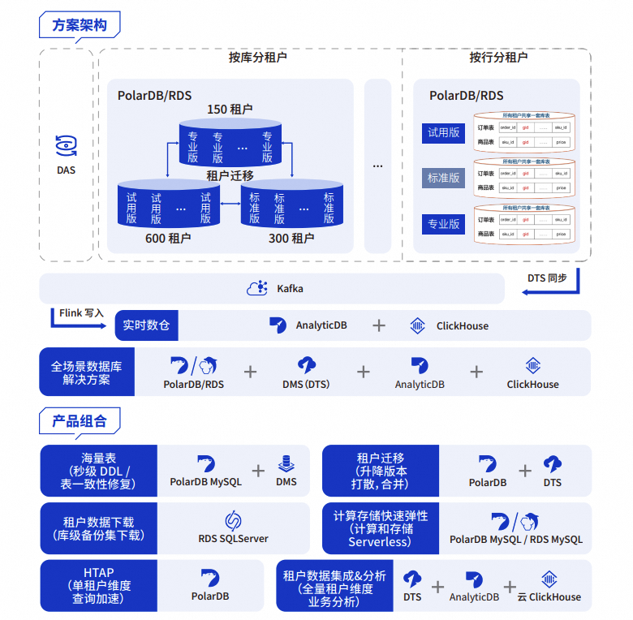
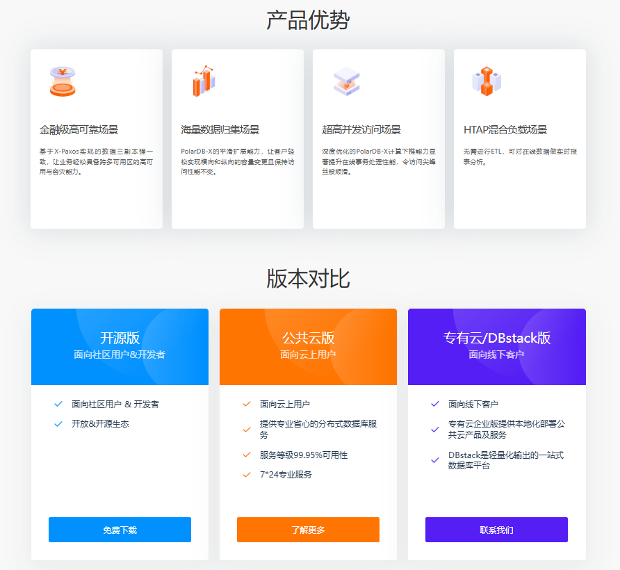

### 简介

- Alibaba 的 PolarDB 是一款`云原生关系型数据库服务`，性能高、可扩展性强，与**MySQL 和 PostgreSQL**完全兼容。
- 它采用计算与存储分离架构，支持高达 500 TB 的存储容量，并提供多区域部署以确保高可用性。
- 安全功能包括 IP 白名单和虚拟专用云（VPC），全球数据库网络（GDN）支持跨区域数据复制和灾难恢复。
- 意外细节：PolarDB 还提供免费实例，适合开发者测试，规格为 2 核 8 GB，50 GB 存储，每个月可参与一次。

**什么是 PolarDB？**  
PolarDB 是阿里巴巴云开发的一款云原生数据库服务，旨在为现代应用程序提供高性能和可扩展性。它与 MySQL 和 PostgreSQL 完全兼容，适合需要快速响应和高并发场景的企业。

**主要特点**  
- **高性能**：比传统数据库快得多，支持数百万次每秒查询（QPS）。  
- **可扩展性**：支持自动扩展，计算和存储可独立调整，最大支持 500 TB 存储。  
- **高可用性**：通过多区域部署和自动故障转移，确保最小停机时间。  
- **安全性**：包括 IP 白名单、VPC 等措施保护数据。  
- **全球数据库网络（GDN）**：支持跨区域数据同步，灾难恢复时间小于 2 秒。  

**开发者福利**  
PolarDB 提供免费实例，规格为 2 核 8 GB，50 GB 存储，适合开发者测试，每个月可参与一次，区域包括中国香港、德国法兰克福等。详情请访问 [官方产品页面](https://www.alibabacloud.com/en/product/polarDB) 和 [文档中心](https://www.alibabacloud.com/help/en)。

---

### 详细报告

Alibaba 的 PolarDB 是一款云原生关系型数据库服务，由阿里巴巴云开发，旨在为企业提供高性能、可扩展和可靠的数据库解决方案。以下是其详细特点和功能的全面分析，基于官方资料和相关审查。

#### 概述与背景  
PolarDB 是为云环境优化的下一代关系型数据库，采用计算与存储分离架构，整合了软件和硬件资源，确保高性能和灵活性。它完全兼容 MySQL 和 PostgreSQL，并高度兼容 Oracle 语法，适合需要快速迁移和扩展的企业应用。PolarDB 已在阿里巴巴的“双十一”全球购物节等超大规模事件中得到验证，体现了其在高并发和大规模存储场景下的稳定性。

#### 主要特点与功能  

##### 1. 架构与性能  
- **计算与存储分离**：PolarDB 的核心设计是将计算和存储解耦，允许独立扩展计算节点和存储容量。这种架构通过共享分布式存储确保数据一致性，避免传统异步复制带来的延迟问题。  
- **高性能**：官方数据表明，PolarDB for MySQL 在事务处理上比开源 MySQL 快 5 倍，在分析查询上快 400 倍，总拥有成本（TCO）降低 50%。对于 PostgreSQL，优化后查询和事务处理速度比标准 PostgreSQL 快 6 倍。  
- **并行查询（MySQL 8.0）**：通过在存储层分配数据到多个线程并行计算，复杂 SQL 和报告查询的响应时间可减少高达 30 倍（在 100 GB 数据、88 CPU 核心、710 GB 内存的配置下）。  
- **快速 DDL 操作（MySQL）**：通过物理复制优化，添加列或索引可在并行处理下瞬间完成，1 TB 数据、16 CPU 核心、128 GB 内存的场景下，添加列仅需 1 秒，比开源 MySQL 快 10 倍。  

##### 2. 可扩展性与存储  
- PolarDB 支持高达 500 TB 的存储容量（MySQL 和 PostgreSQL 版本），每个集群最多 16 个节点，每个节点最多 88 vCPUs。  
- **自动扩展**：存储和计算资源可根据数据量自动调整，无需停机。PolarDB-X 版本可扩展至拍字节级，适合超大规模数据场景。  
- **弹性扩展（MySQL）**：支持垂直扩展（升级/降级规格）和水平扩展（添加/移除只读节点，最多 16 个），存储可自动扩展至 500 TB，调整在几分钟内生效。  

##### 3. 高可用性与灾难恢复  
- **多区域架构**：PolarDB 在多个可用区部署数据副本，确保数据库灾难恢复和备份。支持在同一区域的 3 个数据中心或跨 3 个区域的 5 个数据中心部署。  
- **全球数据库网络（GDN）**：通过异步复制和物理日志并行处理，数据在全球多个集群间同步时间小于 2 秒，支持跨区域读写分离，数据从最近的集群读取，提升性能。  
- **高可用性**：主节点故障时自动切换到备用节点，无数据丢失，解决异步复制问题，确保全球数据一致性。  

##### 4. 安全与管理  
- **安全措施**：包括 IP 白名单、虚拟专用云（VPC）和多数据副本，确保数据在访问、存储和管理中的安全性。  
- **运维功能（MySQL）**：提供 24/7 机器学习驱动的异常检测，细粒度监控和诊断工具，包括自治中心、会话管理、实时监控、存储分析、死锁分析、诊断报告和性能洞察。SQL Explorer 可保留日志长达 5 年，支持慢 SQL 查询分析。  
- **自动扩展**：可配置阈值、节点规格和只读节点，动态调整资源。  

##### 5. 兼容性与迁移  
- **兼容性**：PolarDB for MySQL 和 PostgreSQL 与其生态系统 100% 兼容，PostgreSQL 版本高度兼容 Oracle 语法，支持 DBLINK、分区表、PL/SQL 等功能，逻辑概念（如用户、角色、模式、权限）与 Oracle 相似。  
- **迁移支持**：提供 ADAM 工具进行免费迁移评估，覆盖兼容性、关联性、性能、风险和修改方法，并提供优化和转换建议。PostgreSQL 版本还包括数据库专家服务，涵盖模式/数据迁移、一致性验证、SQL 模拟/回放/切换/优化。  

##### 6. 特定版本功能  

- **PolarDB for PostgreSQL**：  
  - 集成 GanosBase，支持时空数据存储和管理，包括向量、网格、轨迹、点云、网格、路径、3D 模型等。提供多级并行运算符，高效处理，兼容商业和开源空间数据服务，可构建城市级空间数据仓库。  
  - 完全托管，减少 TCO，支持手动次要版本升级以获取性能提升、新功能和修复。  

- **PolarDB for Xscale**：  
  - 分布式无共享架构，高吞吐量、低延迟、高可扩展性和高可用性，完全兼容 MySQL 生态，支持二进制日志和开源分区/分片工具。  
  - 标准版基于 Paxos 协议（主节点、备用节点、日志节点），成本效益高，可迁移至企业版。企业版支持在线扩展至拍字节级，适合高并发和大规模数据处理。  
  - 自动分区（AUTO 模式，无需分区键，使用标准 MySQL 语法），混合负载（并行计算、自动扩展、读写分离、只读副本支持 OLTP/OLAP），金融级一致性（RPO=0，RC/RR 隔离级别）。  
  - 企业级功能包括多区域/多区域灾难恢复，符合金融分布式事务数据库标准，通过长期稳定性测试，监控（计算/存储/数据库，定制警报，概览）和诊断/优化（识别问题 SQL，实时分析，报告中心）。  

##### 7. 开发者福利  
- **免费实例**：提供 Always Free 实例，适合开发者测试。规格为 2 核 8 GB，50 GB 存储，每个月可参与一次，区域包括中国（香港）、德国（法兰克福）、印度尼西亚（雅加达）、日本（东京）、新加坡、泰国（曼谷）、英国（伦敦）。参与后有效期为当月，未使用则过期，可切换区域或转为付费计划。详情请访问 [获取免费资源指南](https://www.alibabacloud.com/blog/how-to-claim-polardb-resources-for-free_600105) 和 [条款与条件](https://www.alibabacloud.com/help/doc-detail/58764.htm#J_2364114860)。  

#### 计费与成本效益  
- **计费方式（MySQL）**：支持按量付费（根据实例规格和存储使用扣费，自动扩展，适合短期使用）和订阅（预付费，长期使用，更具成本效益，提供更长有效期和更大容量计划）。  
- **成本效益**：比传统 MySQL/PostgreSQL 快 100 倍以上，共享存储减少扩展成本，仅按实际使用存储付费，降低总拥有成本。  

#### 对比与用户反馈  
根据审查和用户反馈，PolarDB 特别适合需要高并发、大规模存储和复杂查询的业务场景。Sourceforge 的描述指出，其在阿里巴巴“双十一”购物节中得到验证，支持百万级 QPS 和 100 TB 集群，成本仅为传统商业数据库的 1/10。Gartner Peer Insights 和其他平台的用户评论强调其性能和扩展性，但也建议关注特定版本的文档以了解差异。

#### 表格：PolarDB 主要版本对比  

| **版本**              | **架构**                  | **存储容量** | **主要特点**                                      | **适用场景**                     |
|-----------------------|---------------------------|--------------|--------------------------------------------------|----------------------------------|
| PolarDB for MySQL     | 共享存储                 | 500 TB       | 高事务性能，快速 DDL，IMCI 支持 HTAP             | 高并发 OLTP/OLAP 混合负载        |
| PolarDB for PostgreSQL| 共享存储                 | 500 TB       | Oracle 兼容，时空数据支持，托管服务              | 空间数据分析，Oracle 迁移         |
| PolarDB for Xscale    | 分布式无共享             | 拍字节级     | 高吞吐量，自动分区，金融级一致性                 | 大规模分布式事务，金融行业        |

#### 结论  
PolarDB 提供了一套全面的云原生数据库解决方案，涵盖高性能、可扩展性、安全性和兼容性，适合各种企业级应用。开发者可通过免费实例快速上手，具体功能根据版本（如 MySQL、PostgreSQL、Xscale）有所不同，建议参考官方文档获取详细信息。

**关键引用：**  
- [PolarDB 产品页面详细介绍](https://www.alibabacloud.com/en/product/polarDB)  
- [PolarDB 文档中心](https://www.alibabacloud.com/help/en)  
- [获取 PolarDB 免费资源指南](https://www.alibabacloud.com/blog/how-to-claim-polardb-resources-for-free_600105)  
- [PolarDB for MySQL 学习更多](https://www.alibabacloud.com/product/polardb-for-mysql)  
- [PolarDB for PostgreSQL 学习更多](https://www.alibabacloud.com/product/polardb-for-postgresql)  
- [PolarDB for Xscale 学习更多](https://www.alibabacloud.com/product/polardb-for-xscale)  
- [PolarDB MySQL 文档](https://www.alibabacloud.com/help/polardb/latest/polardb-for-mysql)  
- [PolarDB PostgreSQL 文档](https://www.alibabacloud.com/help/polardb/polardb-for-postgresql/)  
- [PolarDB Xscale 文档](https://www.alibabacloud.com/help/polardb/latest/polardb-x)  
- [PolarDB 产品介绍与用户评论](https://www.gartner.com/reviews/market/cloud-database-management-systems/vendor/alibaba-cloud/product/polardb)  
- [PolarDB 数据库目录信息](https://dbdb.io/db/polardb)  
- [PolarDB-SCC 性能审查文章](https://emptysqua.re/blog/review-polardb-scc/)  
- [PolarDB 用户评价与定价](https://sourceforge.net/software/product/PolarDB/)  
- [PolarDB-X 用户评价与功能](https://sourceforge.net/software/product/PolarDB-X/)  
- [PolarDB for PostgreSQL 技术文章](https://www.geeksforgeeks.org/what-is-polardb-for-postgresql/)  
- [PolarDB 深入分析博客](https://www.alibabacloud.com/blog/polardb-deep-dive-on-alibaba-cloud%25E2%2580%2599s-next-generation-database_578138)  
- [PolarDB 入门指南博客](https://www.alibabacloud.com/blog/polardb-series-1-get-started-in-10-minutes_594647)