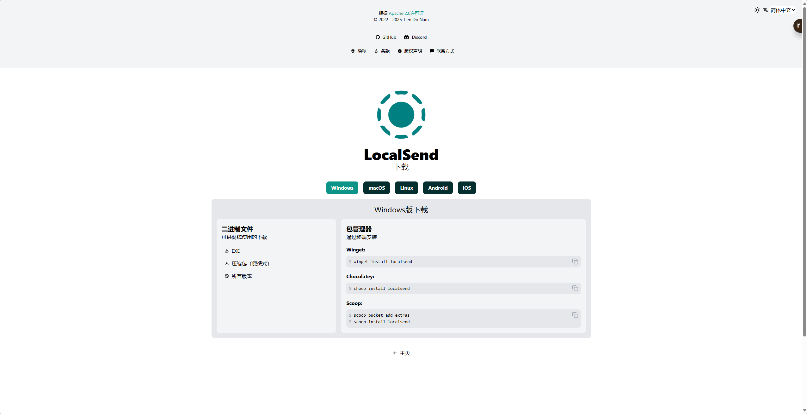
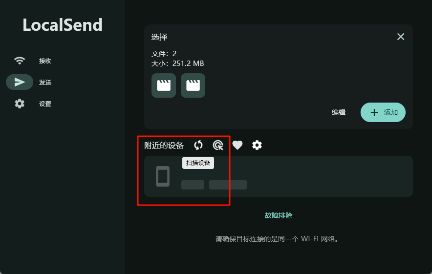
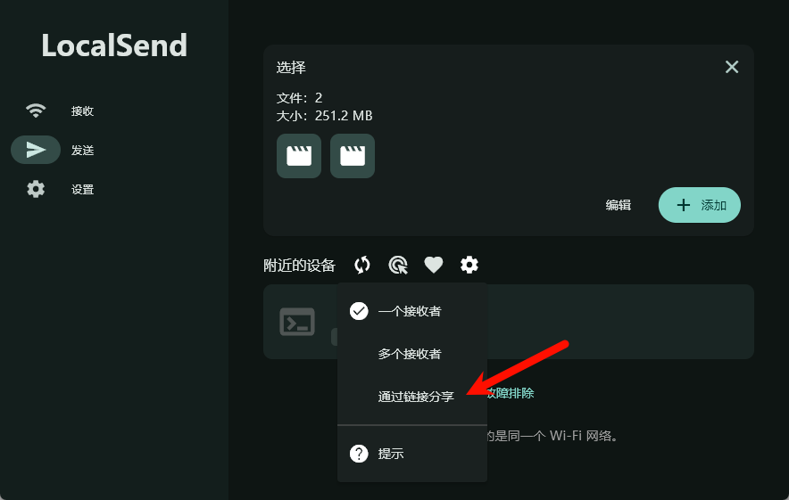
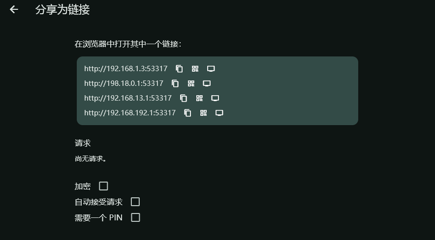
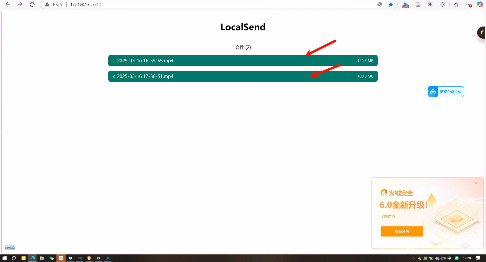

<!--  -->

https://localsend.org/zh-CN/download

---

### 下载

有很多种下载方法，我这里下载exe

### 传输

#### 如果都是连接的wifi

如果都是连接的都是wifi，那么直接传输即可

---

#### 如果一个连接的wifi，另一个连接的网线

1. 使用链接分享

那么可能找不到，这个时候发送端选择设置

可以看到出来几个链接，一般选择第一个，到另一个电脑上面去

点击文件就能下载了

2. 尝试使用手动输入

**前提先把双方的vpn关掉**

然后可以保存到收藏夹
