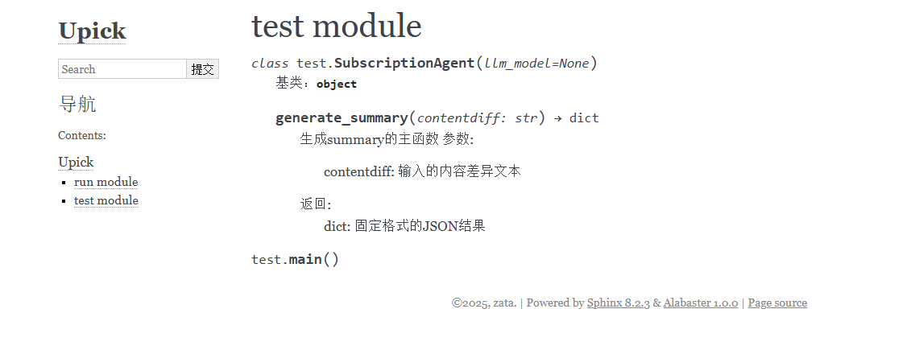

<!--  -->
---

### 示例项目：一个简单的计算器
假设我们有一个小项目 `calculator`，结构如下：
```
calculator/
├── calc.py        # 主代码文件
└── docs/          # 文档文件夹（稍后创建）
```

#### 1. 创建项目代码
先在 `calculator` 文件夹下创建 `calc.py`，内容如下：
```python
"""这是一个简单的计算器模块。"""

def add(a, b):
    """将两个数相加。

    参数:
        a (int): 第一个数
        b (int): 第二个数

    返回:
        int: 两数之和
    """
    return a + b

def subtract(a, b):
    """将两个数相减。

    参数:
        a (int): 被减数
        b (int): 减数

    返回:
        int: 两数之差
    """
    return a - b
```

这个文件有模块级 docstring 和函数级 docstring，Sphinx 可以利用这些生成文档。

---

### 2. 设置 Sphinx
#### 安装 Sphinx
确保你有 Python 环境，然后在终端运行：
```bash
pip install sphinx
```

#### 初始化文档
进入 `calculator` 文件夹，运行：
```bash
mkdir docs
cd docs
sphinx-quickstart
```
系统会问你一些问题，按以下方式回答（其他可以默认回车）：
- `Separate source and build directories (y/n)`：输入 `n`（简单起见，放在一起）。
- `Project name`：输入 `Calculator`。
- `Author name(s)`：输入你的名字，比如 `张三`。
- `Project release`：输入 `1.0`。

完成后，`docs` 文件夹会变成这样：
```
calculator/
├── calc.py
└── docs/
    ├── conf.py       # 配置文件
    ├── index.rst     # 主文档文件
    ├── Makefile      # Linux/Mac 生成工具
    └── make.bat      # Windows 生成工具
```

---

### 3. 配置 Sphinx
#### 修改 `conf.py`
打开 `docs/conf.py`，做两处调整：
1. **添加项目路径**，让 Sphinx 能找到 `calc.py`：
   在文件顶部添加：
   ```python
   import os
   import sys
   sys.path.insert(0, os.path.abspath('..'))  # 指向 calculator 目录
   ```

2. **启用 `autodoc` 扩展**，支持自动生成代码文档：
   找到 `extensions` 列表，改成：
   ```python
   extensions = ['sphinx.ext.autodoc']
   ```

#### 检查 `index.rst`
默认的 `index.rst` 可能是：
```
Welcome to Calculator's documentation!
======================================

.. toctree::
   :maxdepth: 2
```
暂时不用改，后面会加内容。

---

### 4. 自动生成代码文档
#### 用 `sphinx-apidoc`
在 `docs` 目录下运行：
```bash
sphinx-apidoc -o . ..
```
- `-o .`：输出到当前目录（`docs`）。
- `..`：扫描上级目录（`calculator`）。

这会生成：
- `modules.rst`：模块总览。
- `calc.rst`：针对 `calc.py` 的文档。

看看 `calc.rst`，内容大概是：
```
calc
====

.. automodule:: calc
   :members:
   :undoc-members:
   :show-inheritance:
```

#### 整合到 `index.rst`
编辑 `index.rst`，加入模块链接：
```
Welcome to Calculator's documentation!
======================================

这是一个简单的计算器项目，提供加法和减法功能。

.. toctree::
   :maxdepth: 2

   modules
```
这里手动加了句介绍文字，`modules` 指向自动生成的模块文档。

---

### 5. 手动添加使用说明
新建一个文件 `docs/usage.rst`，写点教程：
```
使用说明
========

这是一个计算器的使用方法。

步骤
----
1. 导入模块：
   .. code-block:: python

      from calc import add, subtract

2. 调用函数：
   .. code-block:: python

      print(add(3, 5))      # 输出 8
      print(subtract(10, 2)) # 输出 8
```

然后在 `index.rst` 的 `toctree` 里加一行：
```
.. toctree::
   :maxdepth: 2

   modules
   usage
```

---

### 6. 生成文档
在 `docs` 目录下运行：
```bash
make html  # Linux/Mac
```
或
```bash
make.bat html  # Windows
```

完成后，打开 `docs/_build/html/index.html`，你会看到：
- 首页有欢迎文字和目录。
- 点击 “modules” -> “calc”，显示 `add` 和 `subtract` 的自动文档（从 docstring 生成）。
- 点击 “使用说明”，显示手动写的教程。

---

### 结果预览
网页大概长这样：
- **首页**：
  ```
  Welcome to Calculator's documentation!
  这是一个简单的计算器项目，提供加法和减法功能。
  - modules
  - usage
  ```
- **calc 页面**：
  ```
  calc
  这是一个简单的计算器模块。
  add(a, b)
    将两个数相加。
    参数: a (int) - 第一个数, b (int) - 第二个数
    返回: int - 两数之和
  subtract(a, b)
    将两个数相减。
    ...
  ```
- **usage 页面**：
  ```
  使用说明
  这是一个计算器的使用方法。
  步骤
  1. 导入模块：
     from calc import add, subtract
  2. 调用函数：
     print(add(3, 5))      # 输出 8
     ...
  ```

---

### 总结流程
1. **写代码+注释**：`calc.py` 里加 docstring。
2. **初始化**：`sphinx-quickstart` 创建文档框架。
3. **配置**：改 `conf.py` 加路径和扩展。
4. **自动生成**：用 `sphinx-apidoc` 提取代码文档。
5. **手动补充**：写 `usage.rst` 加说明。
6. **生成网页**：`make html`。

---
