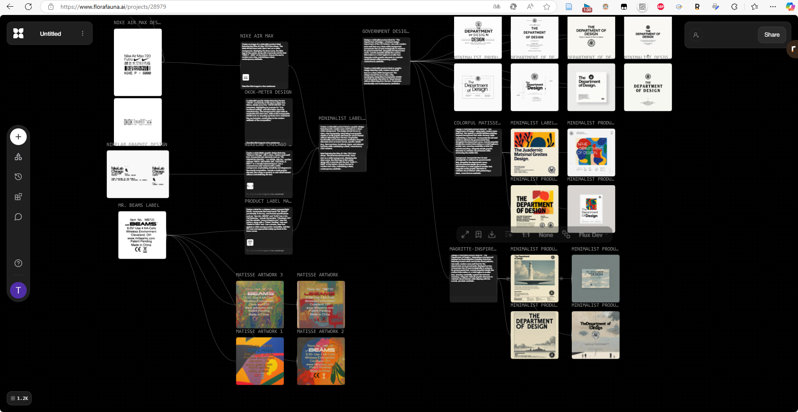
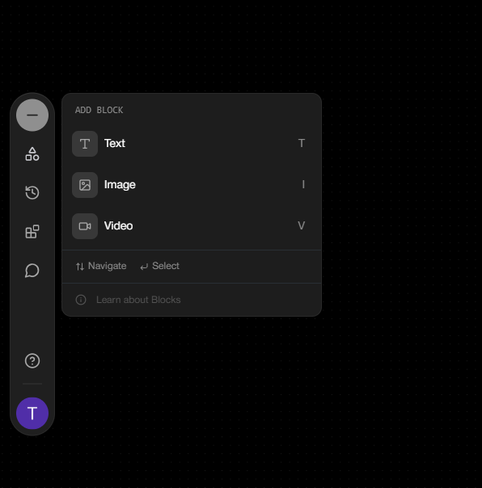
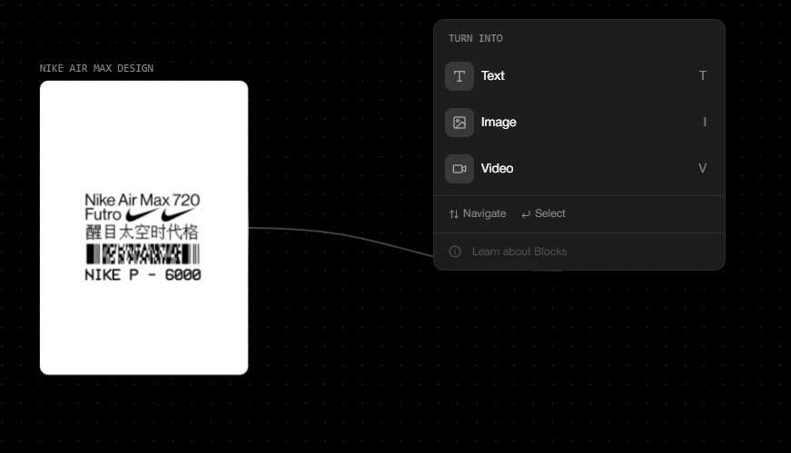
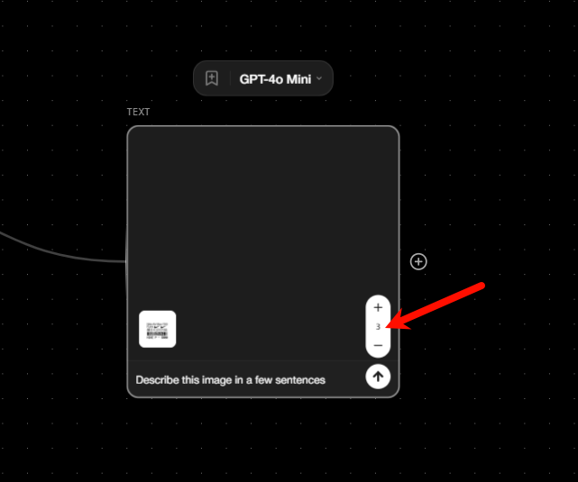
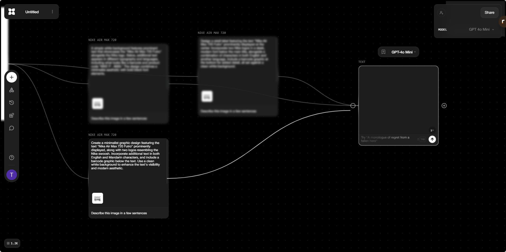
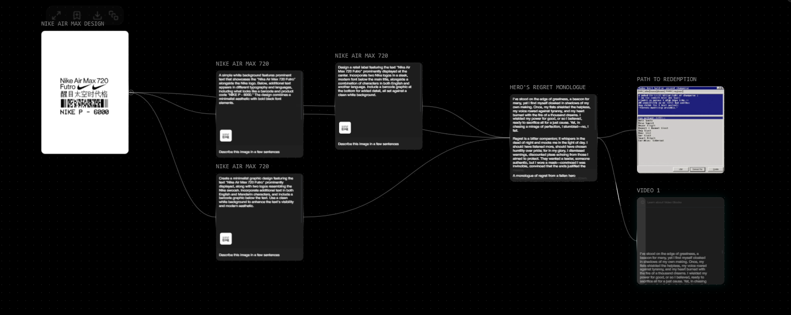
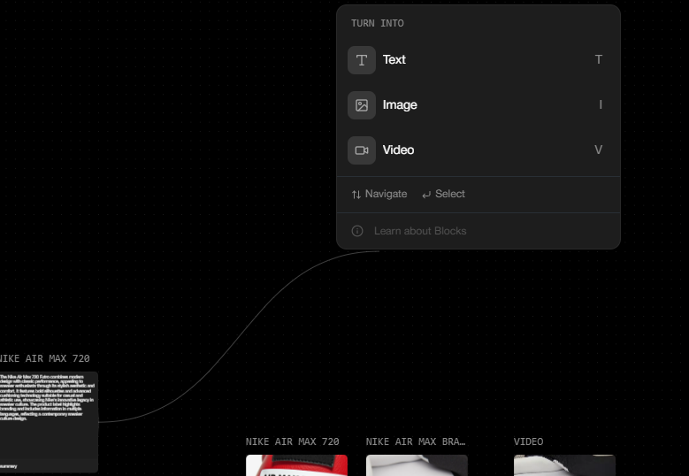

### 网址
https://www.florafauna.ai/

### 使用简介

当前可以免费使用，可以google账户登录

1. 导入个人的资源文件，由于后续的风格生成   

2. 点击加号，设置生成方式并输入提示词

3. 点击生成按钮，等待生成结果 
其中的数字表示同时生成几个（因为往往ai的效果不稳定，可能生成很多个才能找到适合自己的一个）

4. 可以多个生成内容传入一个输入中，不过只支持文本

可以让它做总结

5. 总结的内容可以再用于生成视频或图片

### 使用感受
flora我主要是用于设计方面，可以提供它一些风格的图片，让它学习，然后让它生成，这样就可以快速生成想要的风格。主要使用的方式是工作流的方式，每一个下级的框都会接收上一级的输出，总体来说使用成本比较低，支持文本、图片和视频三种输入和输出。   
   
使用简单，基本上效果也还可以。   

缺点：   
- 感觉界面有点卡顿    
- 可以选择的模型比较少
- 提示词还是需要自己写，有现成的提示词的话，就好了