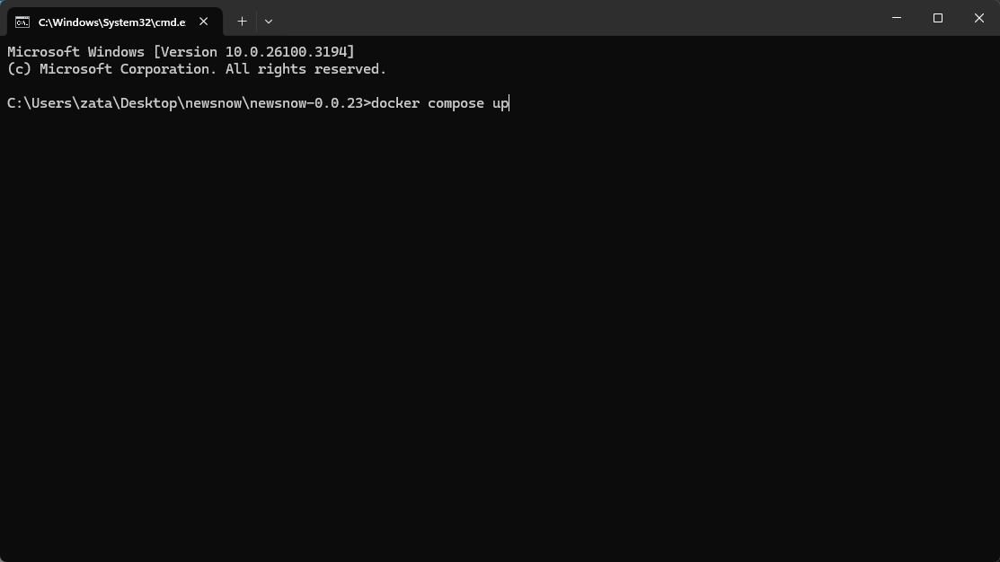
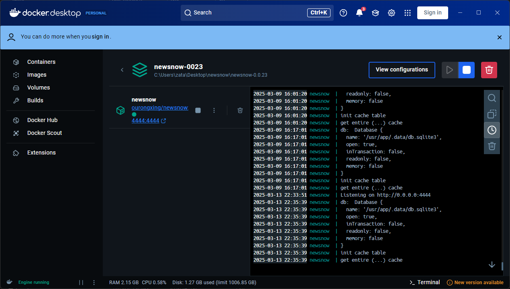
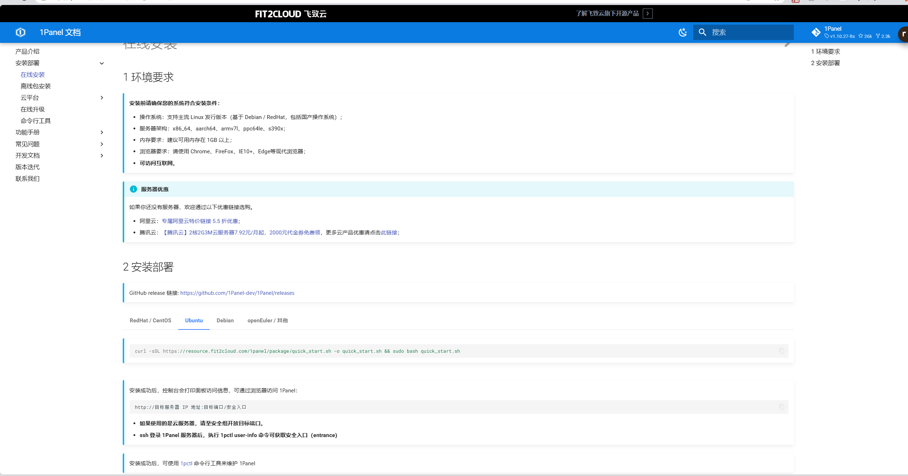

<!--  -->




### 项目介绍

项目地址：

https://github.com/ourongxing/newsnow

newsnow是一个新闻聚合平台，用户可以关注自己感兴趣的新闻，并查看新闻内容。


### 使用docker部署 -- windows

1. 安装好docker desktop


具体的部署方式就不介绍了


2. 下载项目文件


3. 在当前项目下执行docker compose up 命令






### 使用docker部署 -- linux服务器

1. 安装好docker，可以使用1panel或者是宝塔面板

```bash
curl -sSL https://resource.fit2cloud.com/1panel/package/quick_start.sh -o quick_start.sh && sudo bash quick_start.sh
```




2. 使用docker编排进行部署

```bash
version: '3'

services:
  newsnow:
    image: ghcr.io/ourongxing/newsnow:latest
    container_name: newsnow
    restart: always
    ports:
      - '4444:4444'
    environment:
      - G_CLIENT_ID=
      - G_CLIENT_SECRET=
      - JWT_SECRET=
      - INIT_TABLE=true
      - ENABLE_CACHE=true
```


3. 打开你的ip地址:4444