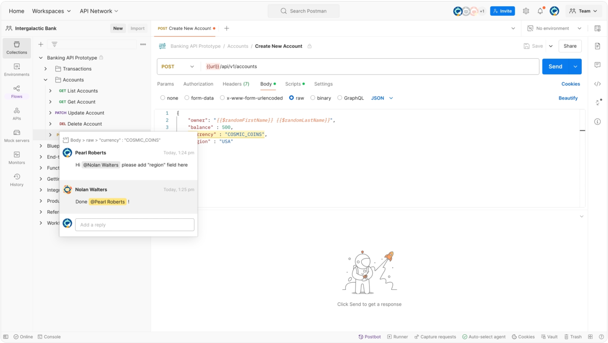

<!--  -->

### postman介绍

如今，Postman的开发者已超过1000万(来自官网)，选择使用Postman的原因如下:   
简单易用 - 要使用Postman，你只需登录自己的账户，只要在电脑上安装了Postman应用程序，就可以方便地随时随地访问文件。
使用集合 - Postman允许用户为他们的API调用创建集合。每个集合可以创建子文件夹和多个请求。这有助于组织测试结构。
多人协作 - 可以导入或导出集合和环境，从而方便共享文件。直接使用链接还可以用于共享集合。
创建环境 - 创建多个环境有助于减少测试重复(DEV/QA/STG/UAT/PROD)，因为可以为不同的环境使用相同的集合。这是参数化发生的地方，将在后续介绍。
创建测试 - 测试检查点(如验证HTTP响应状态是否成功)可以添加到每个API调用中，这有助于确保测试覆盖率。
自动化测试 - 通过使用集合Runner或Newman，可以在多个迭代中运行测试，节省了重复测试的时间。
调试 - Postman控制台有助于检查已检索到的数据，从而易于调试测试。
持续集成——通过其支持持续集成的能力，可以维护开发实践。

### 
