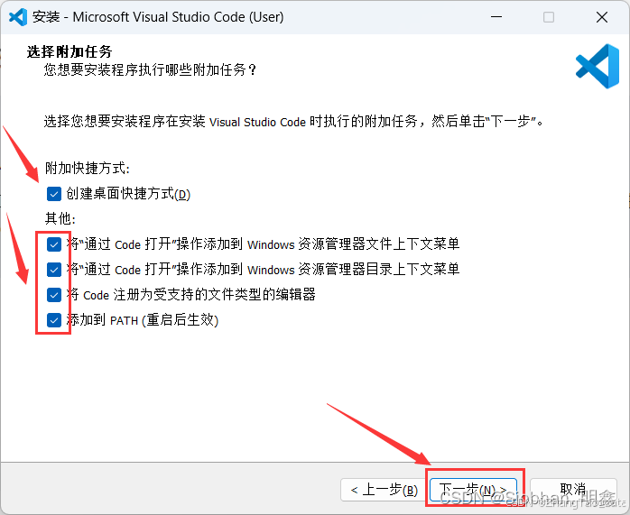
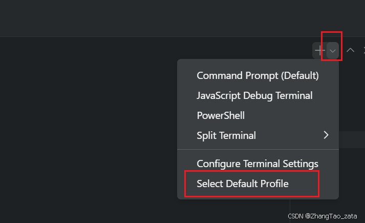
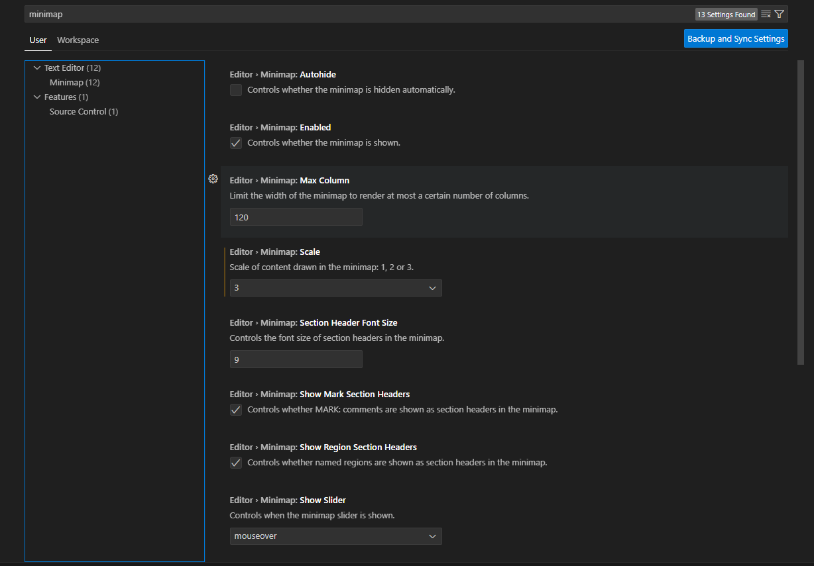
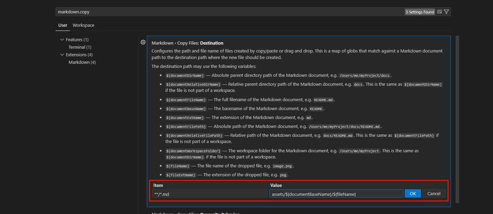
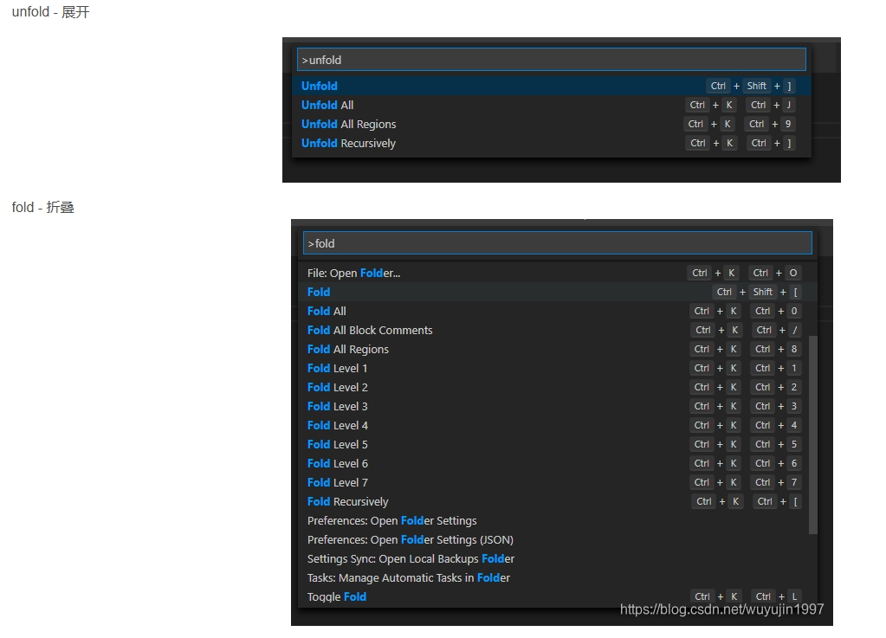
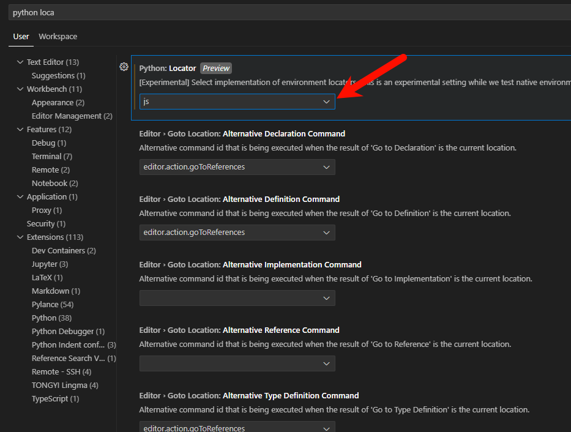

参考：
https://blog.csdn.net/weixin_46474921/article/details/132841711
# 安装
## 1. 下载安装
[VScode官网](https://code.visualstudio.com/)
注意，这一步最好全部打勾




## 2. 设置默认terminal为cmd


## 3. 修改Code Runner 的配置（右键运行）
`首先你要安装好Code Runner 插件`
- 修改点击右键运行时的运行环境，改为终端运行


- 修改右键运行时工作路径


4. 设置文件自动保存


# 其他相关设置
## vscode右侧的预览窗口设置


设置方法，在设置里面搜索minimap  




## vscode写markdown插入图片时放在指定目录

参考 https://juejin.cn/post/7244809769794289721



```bash
**/*.md      assets/${documentDirName}/${fileName}   # 以原始文件名放到 ./assets/<md文件名>/<图片文件名>
**/*.md      assets/${documentBaseName}/${documentBaseName}.${fileExtName}   # 重新以md文件名命名图片名
```

## vscode折叠代码




---
---
---


# 遇到的问题
## vscode 一直 reactivatiing terminals

这个是由于python扩展找不到虚拟环境的问题，具体可以看    
https://stackoverflow.com/questions/78886125/vscode-python-extension-loading-forever-saying-reactivating-terminals/78886126#78886126


我的解决方法是把python Locator换成js

