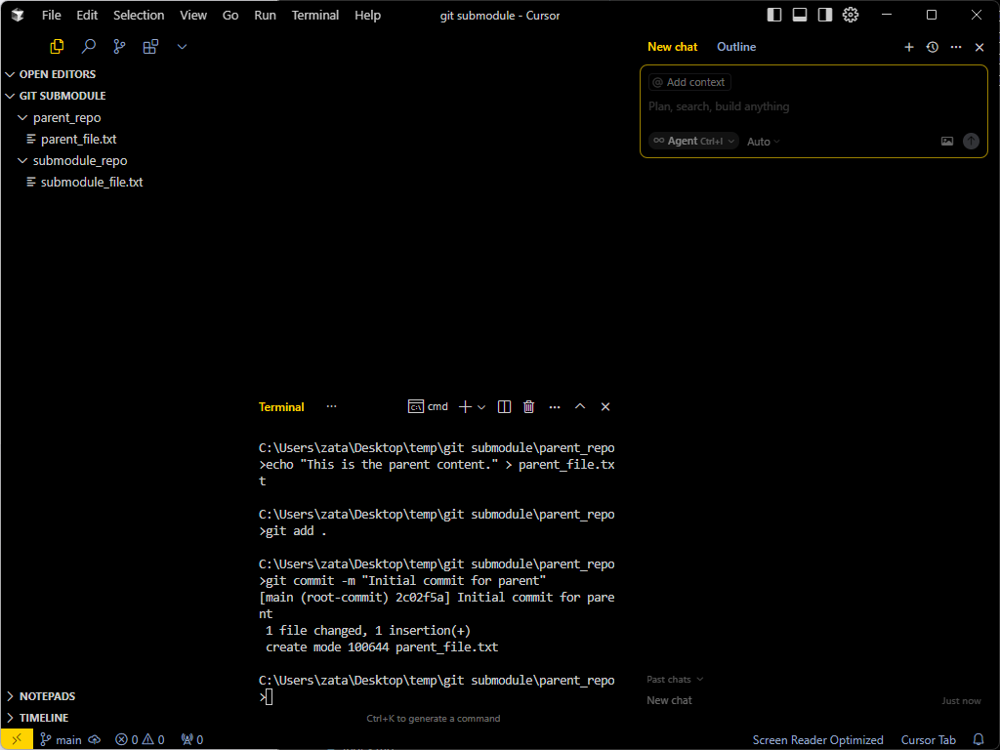
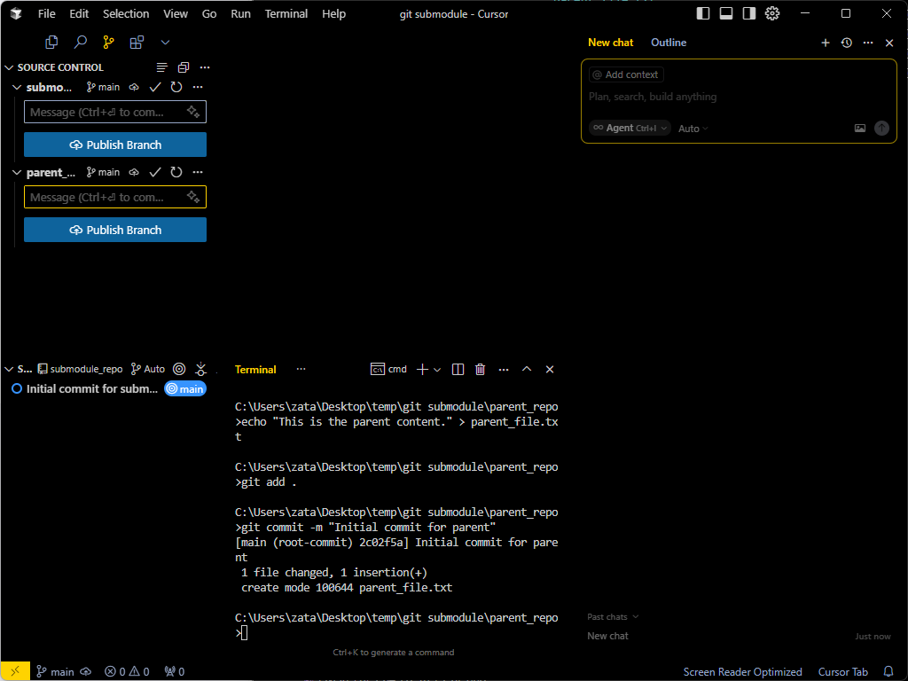
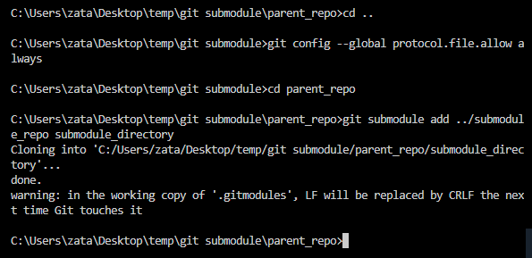
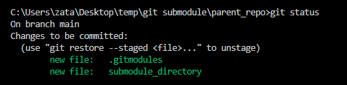
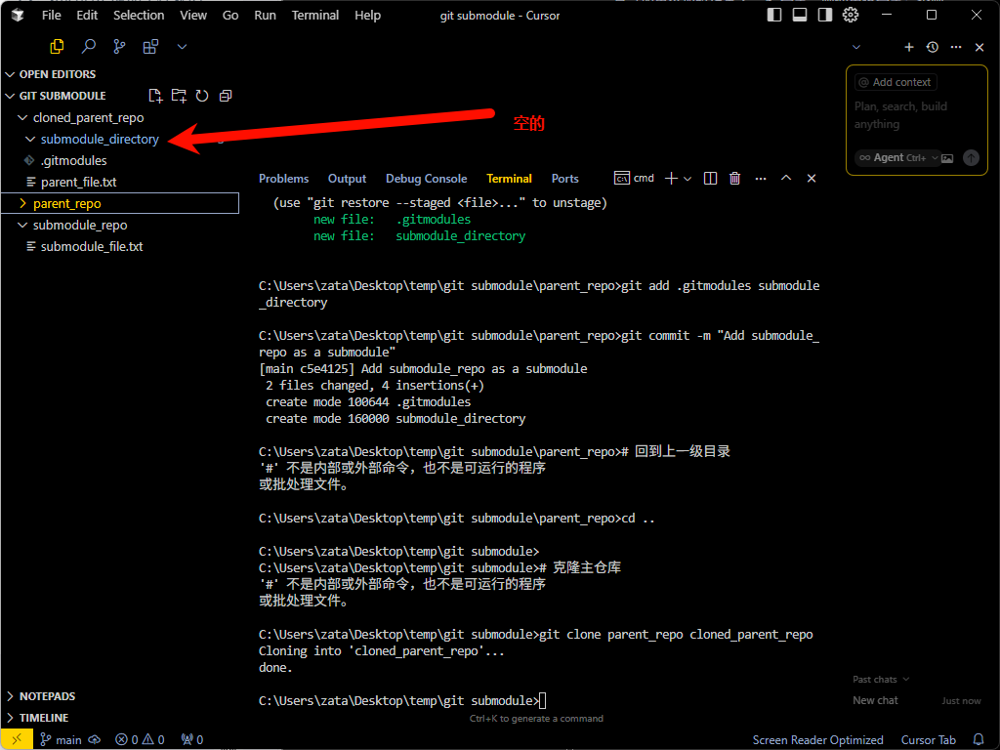
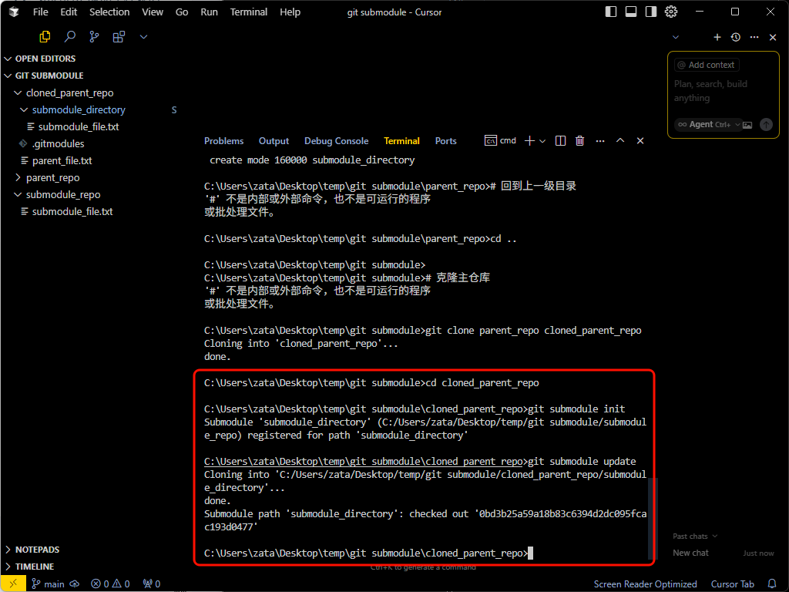
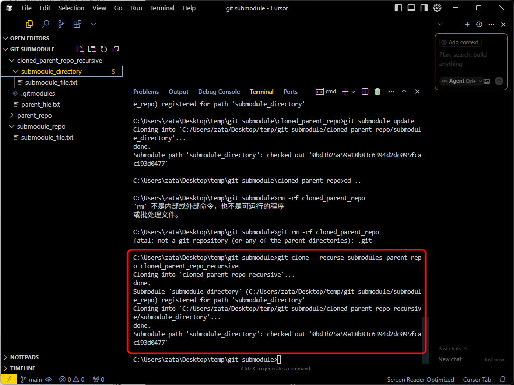
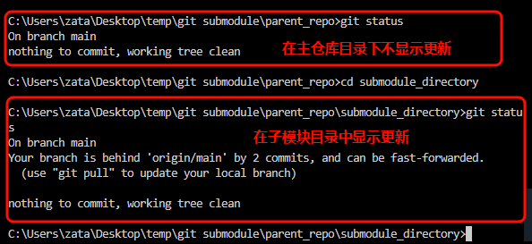
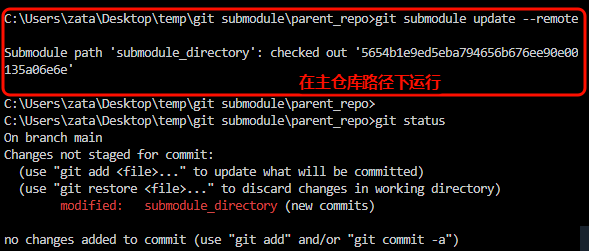

这是一份关于 Git Submodule（子模块）的详细教程，包括概念、使用场景、常用命令以及详细的可执行代码示例。

Git Submodule 允许你将一个 Git 仓库作为另一个 Git 仓库的子目录。这在你有一个主项目依赖于其他独立开发的库或项目时非常有用。子模块会固定在你指定的一个特定的提交（commit）上，而不是分支的最新状态。


## 知识点总结

### Git Submodule 记录的是子模块仓库中一个特定的提交

Git Submodule 的一个核心概念是：主仓库记录的是子模块仓库中一个特定的提交（commit），而不是跟踪子模块的某个分支的最新状态。

这意味着当你使用 git submodule add <远程仓库URL> <path> 命令时：

Git 会克隆远程子模块仓库到指定的路径。
默认情况下，Git 会检出子模块仓库的 默认分支（通常是 main 或 master）。
最重要的一点： 主仓库会记录下子模块仓库在 那个默认分支上当前的最新提交的 SHA-1 值。

为什么是这样？

这种设计是为了保证主项目的稳定性。主项目依赖于子模块的一个确定版本。如果主项目仅仅跟踪子模块的某个分支（比如 main），那么子模块的任何新提交都可能在你不经意间破坏主项目的功能。通过锁定到特定的提交，你可以精确控制主项目使用的子模块代码版本，确保每次克隆或更新主项目时，子模块都处于预期的状态。


### 如何指定添加子模块时使用的分支或标签？


如果你不想使用子模块仓库的默认分支，可以在 git submodule add 命令中使用 -b 选项指定一个特定的分支：

```Bash
git submodule add -b <分支名> <远程仓库URL> <子模块在主仓库中的路径>
```

示例：指定 develop 分支

假设你想添加子模块，并使用其 develop 分支的当前提交：

```Bash
git submodule add -b develop https://github.com/your-username/your-submodule-repo.git submodule_directory
```

这样，Git 会克隆子模块仓库，检出 develop 分支，然后主仓库记录 develop 分支当前的最新提交。

你也可以指定一个标签（tag）：

```Bash
git submodule add -b <标签名> <远程仓库URL> <子模块在主仓库中的路径>
```


### 更新子模块时如何处理分支？

当你运行 git submodule update --remote 命令来更新子模块时：

Git 会进入子模块目录。

它会拉取子模块远程仓库的最新提交。

默认情况下，它会根据 .gitmodules 文件中记录的信息（如果添加时指定了 -b 分支，则使用该分支；否则使用远程仓库的默认分支）找到该分支的最新提交。

然后，它会将子模块的工作树更新到该分支的最新提交，并更新主仓库对子模块的引用到这个新的提交。

### **为什么使用 Git Submodule？**

* **管理外部依赖：** 当你的项目依赖于第三方库或其他内部独立项目时，可以使用子模块来包含它们，而不是直接复制代码。
* **分离关注点：** 将大型项目拆分成更小的、可管理的独立仓库。
* **版本控制依赖：** 精确控制主项目使用的外部依赖的版本（通过指定特定的提交）。

**Git Submodule 的一些注意事项：**

* **复杂性增加：** 使用子模块会增加工作流程的复杂性，特别是对于不熟悉子模块的团队成员。
* **更新子模块：** 子模块不会随主项目自动更新到最新版本，需要手动更新。
* **克隆的特殊性：** 克隆包含子模块的项目需要额外的步骤。

---

## 具体教程

### **准备工作：创建示例仓库**

为了演示，我们需要创建两个 Git 仓库：一个作为主仓库（parent），另一个作为子模块仓库（submodule）。

1.  **创建子模块仓库 (submodule_repo):**

    ```bash
    # 创建一个目录作为子模块仓库
    mkdir submodule_repo
    cd submodule_repo

    # 初始化 Git 仓库
    git init

    # 创建一个示例文件
    echo "This is the submodule content." > submodule_file.txt

    # 添加并提交
    git add .
    git commit -m "Initial commit for submodule"

    # (可选) 如果你使用 GitHub 或 Gitee，可以创建一个远程仓库并关联
    # git remote add origin <你的远程仓库地址>
    # git push -u origin master
    ```

2.  **创建主仓库 (parent_repo):**

    ```bash
    # 回到上一级目录
    cd ..

    # 创建一个目录作为主仓库
    mkdir parent_repo
    cd parent_repo

    # 初始化 Git 仓库
    git init

    # 创建一个示例文件
    echo "This is the parent content." > parent_file.txt

    # 添加并提交
    git add .
    git commit -m "Initial commit for parent"

    # (可选) 如果你使用 GitHub 或 Gitee，可以创建一个远程仓库并关联
    # git remote add origin <你的远程仓库地址>
    # git push -u origin master
    ```

现在我们有了两个本地 Git 仓库：`parent_repo` 和 `submodule_repo`。







---

### **1. 添加子模块**

在主仓库 `parent_repo` 中，我们将 `submodule_repo` 添加为一个子模块。

打开终端，进入 `parent_repo` 目录：

```bash
cd parent_repo
```

使用 `git submodule add` 命令添加子模块。语法是：`git submodule add <子模块仓库地址> <子模块在主仓库中的路径>`

如果你的子模块仓库是本地的，可以使用相对或绝对路径。如果是远程仓库（如 GitHub），使用其 URL。

**示例：添加本地子模块**


因为 Git 的安全设置默认禁止通过 file:// 协议（也就是直接的本地文件路径）进行克隆，这包括添加本地子模块。

这是 Git 为了防止某些安全风险而设置的。当你使用相对路径 ../submodule_repo 时，Git 内部会将其解析为 file:// 协议来尝试克隆。

因此可以通过配置全局允许file协议解决

```bash
# 任何目录下执行，写入配置
git config --global protocol.file.allow always


## 如果想取消
git config --global --unset protocol.file.allow

```


假设 `submodule_repo` 目录与 `parent_repo` 目录在同一级。

```bash
# 在主仓库目录，添加子模块
git submodule add ../submodule_repo submodule_directory
```

* `../submodule_repo`: 子模块仓库的路径。
* `submodule_directory`: 子模块在 `parent_repo` 中的存放路径。

执行此命令后，你会看到类似以下的输出：

```
Cloning into 'submodule_directory'...
done.
```




**查看变化：**

运行 `git status`，你会发现有两项变化：

* `.gitmodules` 文件被创建。
* `submodule_directory` 目录被添加。

```bash
git status
```

输出会显示：

```
On branch master
Changes to be committed:
  (use "git reset HEAD <file>..." to unstage)

	new file:   .gitmodules
	new file:   submodule_directory
```




`.gitmodules` 文件记录了子模块的信息，包括路径和 URL。查看其内容：

```bash
cat .gitmodules
```

输出类似：

```
[submodule "submodule_directory"]
	path = submodule_directory
	url = ../submodule_repo
```

`submodule_directory` 目录现在是 `submodule_repo` 的一个工作副本，但它处于一个特殊的“游离 HEAD”（detached HEAD）状态，指向添加子模块时 `submodule_repo` 的最新提交。

**提交子模块的添加：**

将 `.gitmodules` 文件和子模块目录的添加提交到主仓库：

```bash
git add .gitmodules submodule_directory
git commit -m "Add submodule_repo as a submodule"
```

现在，主仓库已经记录了子模块的存在以及它指向的特定提交。

---

### **2. 克隆包含子模块的仓库**

当其他人克隆包含子模块的仓库时，默认情况下子模块目录是空的。需要额外的步骤来初始化和更新子模块。

假设你要克隆上面创建的 `parent_repo`。

1.  **正常克隆主仓库：**

    ```bash
    # 回到上一级目录
    cd ..

    # 克隆主仓库
    git clone parent_repo cloned_parent_repo
    ```

    进入克隆后的 `cloned_parent_repo` 目录，你会发现 `submodule_directory` 目录存在，但里面是空的：

    ```bash
    cd cloned_parent_repo
    ls submodule_directory
    ```

    （没有输出或显示目录为空）



2.  **初始化并更新子模块：**

    需要运行以下命令来初始化子模块配置并拉取子模块的代码：

    ```bash
    git submodule init
    git submodule update
    ```

    

    * `git submodule init`: 这个命令会读取 `.gitmodules` 文件，并将子模块的信息添加到主仓库的 `.git/config` 文件中。
    * `git submodule update`: 这个命令会克隆子模块仓库到指定的路径，并检出 `.gitmodules` 文件中记录的特定提交。

    运行 `git submodule update` 后，`submodule_directory` 目录就会包含子模块的代码了：

    ```bash
    ls submodule_directory
    ```

    输出：

    ```
    submodule_file.txt
    ```

**更便捷的克隆方式：**

可以在克隆主仓库时直接使用 `--recurse-submodules` 选项，一步完成克隆、初始化和更新子模块：

```bash
# 回到上一级目录并删除之前克隆的仓库
cd ..
rm -rf cloned_parent_repo

# 使用 --recurse-submodules 选项克隆
git clone --recurse-submodules parent_repo cloned_parent_repo_recursive

# 进入目录并查看子模块内容
cd cloned_parent_repo_recursive
ls submodule_directory
```

输出：

```
submodule_file.txt
```



这种方式更推荐，因为它简化了克隆包含子模块的项目流程。

---

### **3. 更新子模块**

子模块固定在主仓库记录的特定提交上。如果子模块仓库有了新的提交，你需要手动更新主仓库中对子模块的引用。

假设 `submodule_repo` 有了新的提交。

1.  **在子模块仓库中进行新的提交：**

    进入 `submodule_repo` 目录（或者克隆后的 `cloned_parent_repo/submodule_directory` 目录），进行修改并提交：

    ```bash
    # 进入子模块目录 (如果你还在 parent_repo 或其克隆目录中)
    cd submodule_directory # 或者 cd ../submodule_repo

    # 创建或修改文件
    echo "Adding new content to submodule." >> submodule_file.txt

    # 添加并提交
    git add .
    git commit -m "Add new content to submodule"

    # (如果子模块有远程仓库) 推送到子模块的远程仓库
    # git push origin master
    ```

2.  **在主仓库中更新子模块引用：**

    回到主仓库（`parent_repo` 或其克隆目录）。此时，主仓库仍然指向子模块的旧提交。进入子模块目录之后运行 `git status` 会显示子模块目录已被修改：

    ```bash
    cd .. # 回到主仓库目录 (parent_repo 或 cloned_parent_repo)
    cd parent_repo
    cd submodule_directory
    git status
    ```

    输出类似：

    ```
    On branch master
    Changes not staged for commit:
      (use "git add <file>..." to update what will be committed)
      (use "git checkout -- <file>..." to discard changes in working directory)

    	modified:   submodule_directory (new commits)

    no changes added to commit (use "git add" and/or "git commit -a")
    ```


    

    要将主仓库更新到子模块的最新提交，可以使用 `git submodule update --remote` 命令：

    ```bash
    git submodule update --remote
    ```

    

    这个命令会进入每个子模块目录，拉取最新的代码，并更新主仓库中子模块的引用到最新的提交。

    **注意：** `git submodule update --remote` 默认会更新到子模块仓库当前分支的最新提交。如果你希望更新到特定分支，可以使用 `--remote --merge <分支名>` 或 `--remote --rebase <分支名>`。

    更新后，再次运行 `git status`，你会看到子模块目录再次被标记为已修改，但这次是因为它的引用指向了新的提交：

    ```bash
    git status
    ```

    输出类似：

    ```
    On branch master
    Changes to be committed:
      (use "git reset HEAD <file>..." to unstage)

    	modified:   submodule_directory
    ```

    **提交主仓库的更新：**

    将主仓库中对子模块引用的更新进行提交：

    ```bash
    git add submodule_directory    # 当然直接git add . 也可以
    git commit -m "Update submodule_directory to latest commit"

    # (如果主仓库有远程仓库) 推送到主仓库的远程仓库
    # git push origin master
    ```

    这样，主仓库就记录了子模块的最新状态。

---

### **4. 在子模块中工作**

在子模块目录中，你可以像在任何独立的 Git 仓库中一样进行操作：切换分支、创建提交、推拉代码等。

进入子模块目录：

```bash
cd submodule_directory
```

现在你就在 `submodule_repo` 的工作目录中了。你可以进行正常的 Git 操作：

```bash
# 查看当前分支
git branch

# 切换分支
# git checkout <分支名>

# 创建新的提交
# (修改文件，git add，git commit)

# 推送到子模块的远程仓库
# git push origin <分支名>
```

完成在子模块中的工作后，回到主仓库目录：

```bash
cd ..
```

如果子模块中有了新的提交，主仓库会检测到变化（如上面更新子模块的步骤所示），你需要再次在主仓库中提交对子模块引用的更新。

---

### **5. 切换分支（包含子模块）**

在包含子模块的主仓库中切换分支可能会有些复杂，因为不同分支可能引用子模块的不同提交，甚至在某些分支上没有子模块。

当切换到一个新分支时，Git 会尝试根据新分支的 `.gitmodules` 文件和主仓库记录的子模块提交信息，自动更新子模块。

**示例：切换到新分支**

假设在 `parent_repo` 中创建一个新分支 `feature_branch`：

```bash
git checkout -b feature_branch
```

如果在 `feature_branch` 上对子模块进行了修改（例如，更新到新的提交），然后切换回 `master` 分支：

```bash
git checkout master
```

Git 会尽力将子模块恢复到 `master` 分支所指向的提交。如果出现问题（例如，子模块目录有未提交的修改），Git 可能会报错或将子模块目录标记为未追踪。

为了避免潜在的问题，建议在切换主仓库分支之前，确保子模块目录是干净的（没有未提交的修改）。如果子模块中有修改需要保留，先在子模块内部进行提交。

---

### **6. 删除子模块**

删除子模块比添加子模块要麻烦一些，需要执行几个步骤来彻底移除子模块的记录和文件。

假设我们要从 `parent_repo` 中删除 `submodule_directory` 子模块。

1.  **取消初始化子模块：**

    ```bash
    git submodule deinit submodule_directory
    ```

    这个命令会移除 `.git/config` 文件中关于该子模块的配置。

2.  **移除 `.gitmodules` 文件中的对应条目：**

    使用文本编辑器打开 `.gitmodules` 文件，删除对应子模块的配置段落（例如，`[submodule "submodule_directory"]` 开始的部分）。

    或者使用命令：

    ```bash
    git config -f .gitmodules --remove-section submodule.submodule_directory
    ```

3.  **从暂存区移除子模块：**

    子模块在 Git 中被记录为一个特殊的工作树条目。需要将其从暂存区移除：

    ```bash
    git rm --cached submodule_directory
    ```

4.  **手动删除子模块的工作目录和 `.git/modules` 中的相关文件：**

    ```bash
    rm -rf submodule_directory
    rm -rf .git/modules/submodule_directory
    ```

    * `rm -rf submodule_directory`: 删除子模块在主仓库中的工作目录。
    * `rm -rf .git/modules/submodule_directory`: 删除 Git 在主仓库内部为该子模块存储的元数据和对象。

5.  **提交删除操作：**

    ```bash
    git add .gitmodules
    git commit -m "Remove submodule_directory submodule"
    ```

    现在，子模块就彻底从主仓库中删除了。

---

### **总结常用命令**

* `git submodule add <url> <path>`: 添加子模块。
* `git submodule init`: 初始化本地的子模块配置。
* `git submodule update`: 克隆子模块仓库并检出主仓库指定的提交。
* `git clone --recurse-submodules <url>`: 克隆主仓库并递归地初始化和更新子模块。
* `git submodule update --remote`: 将子模块更新到其远程仓库的最新提交，并更新主仓库的引用。
* `git submodule deinit <path>`: 取消初始化子模块。
* `git rm --cached <path>`: 从暂存区移除子模块。

---

### **更高级的用法和注意事项**

* **指定分支或标签：** 添加子模块时，可以使用 `-b <分支名>` 或指定一个特定的提交 SHA1 来控制子模块的初始状态。
* **子模块的子模块：** 如果子模块本身也包含子模块，在克隆和更新时需要使用 `--recursive` 选项，例如 `git clone --recursive` 和 `git submodule update --recursive`。
* **游离 HEAD 状态：** 在子模块目录中进行修改并提交后，子模块会处于游离 HEAD 状态。如果你想在子模块中固定跟踪某个分支，需要在子模块目录中 `git checkout <分支名>`，然后在主仓库中提交对子模块引用的更新。
* **使用 .gitattributes 忽略子模块的某些文件：** 可以在主仓库的 `.gitattributes` 文件中配置，以便 Git 在某些操作（如 `git status`）中忽略子模块目录中的未追踪或已修改文件。
* **替代方案：** 对于简单的依赖管理，考虑使用包管理器（如 npm, yarn, pip, Composer, Maven, Gradle 等），它们通常比 Git Submodule 更易于管理依赖版本和更新。Git Submodule 更适合于包含独立的、需要独立开发和版本控制的子项目或库。

希望这份详细的教程能帮助你理解和使用 Git Submodule！如果在实践中遇到问题，可以根据具体的错误信息进行搜索或提问。