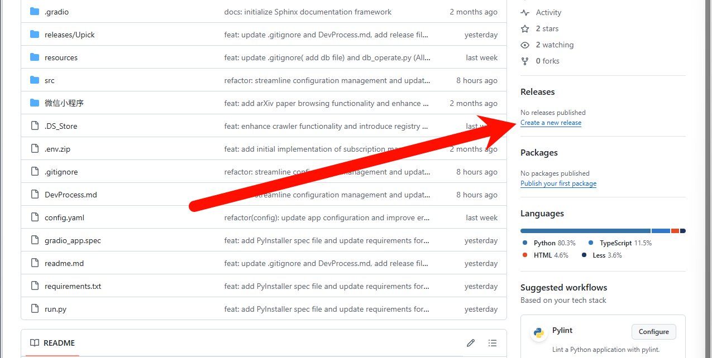
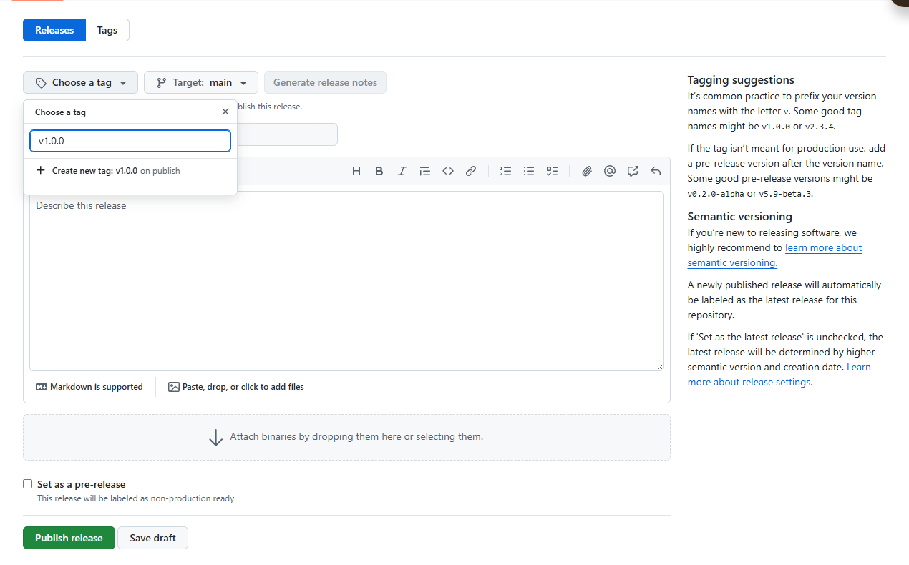
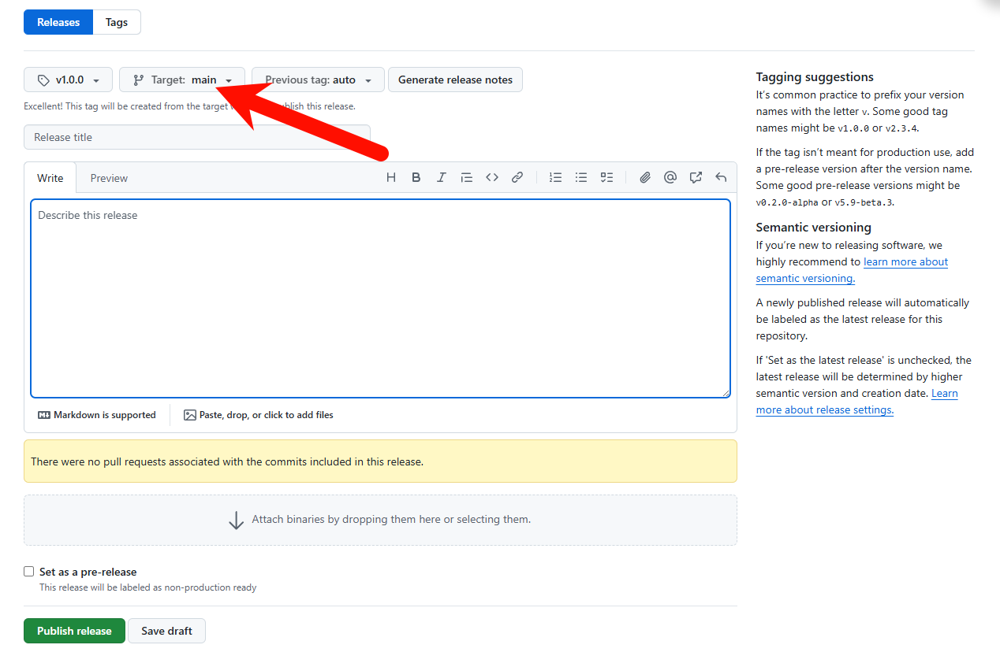
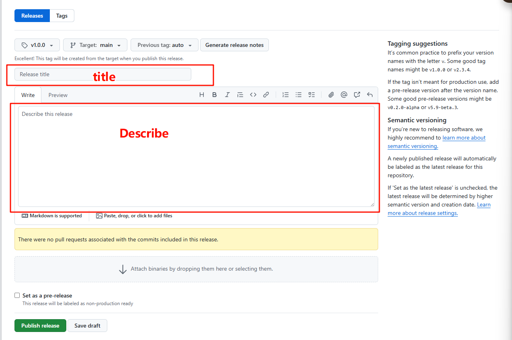
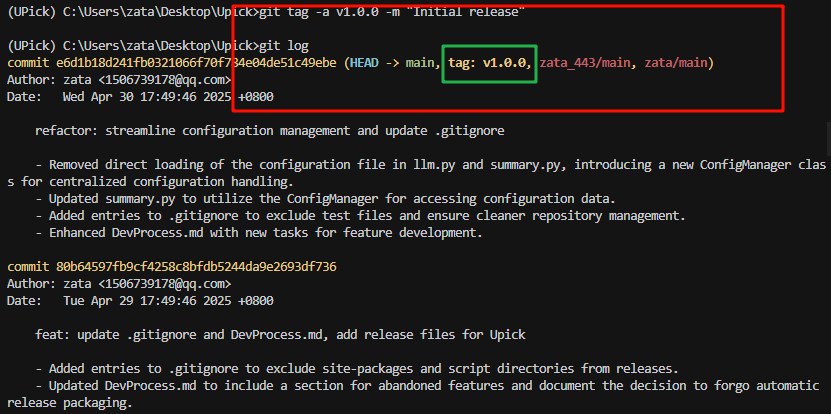
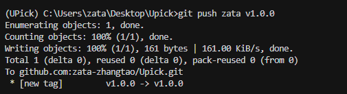
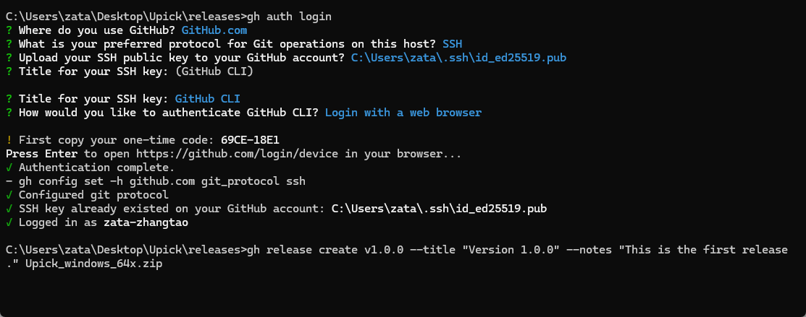
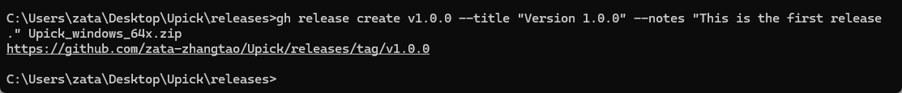

关于版本的管理可以参考：
https://www.bilibili.com/video/BV1Ee411W79K

---

GitHub Release 是 GitHub 上用来标记项目可发布版本的一种方式。它可以包含该版本的源代码快照、编译好的二进制文件以及相关的发行说明。创建 Release 有助于用户清晰地了解项目的版本历史和获取特定版本的可执行文件或库。

**为什么使用 GitHub Release？**

* **版本管理：** 清晰地标记项目的不同版本，方便追溯和管理。
* **软件分发：** 提供稳定版本的下载链接，方便用户获取和使用。
* **发行说明：** 在 Release 中包含详细的说明，介绍该版本的特性、改进、Bug 修复等。
* **自动化：** 可以结合 CI/CD 工具实现自动化 Release 发布。

在创建 GitHub Release 之前，你需要满足以下条件：

1.  拥有一个 GitHub 账号。
2.  拥有一个 GitHub 仓库。
3.  对该仓库有写入权限。
4.  通常情况下，你需要有一个 Git Tag 与 Release 关联。Tag 用于标记代码库中的某个特定的提交（commit），代表着该版本代码的状态。

有两种主要的方式来创建 GitHub Release：通过 GitHub 网页界面和通过 Git 命令行工具（结合 GitHub CLI）。

### 方法一：通过 GitHub 网页界面创建 Release

这是最直观和常用的方法。

**步骤 1：进入你的仓库页面**

在浏览器中打开你的 GitHub 仓库主页。


**步骤 2：创建新的 Release**

"**Create a new release**"（创建新 Release），点击这个按钮。



**步骤 3：选择或创建 Tag**

在新 Release 页面，你需要关联一个 Git Tag。

* **选择现有 Tag：** 点击 "Choose a tag"（选择一个标签）下拉菜单，选择一个已经存在的 Tag。
* **创建新 Tag：** 在输入框中直接输入你想要创建的新 Tag 名称（例如 `v1.0.0`）。输入后，会显示 "**Create new tag on publish**"（发布时创建新标签）。




**重要提示：** Tag 的命名通常遵循 [Semantic Versioning](https://semver.org/) 规范，格式通常是 `MAJOR.MINOR.PATCH`（大版本，小版本，bug修复版本），例如 `v1.0.0`、`v1.2.3` 等。建议在 Tag 前加上 `v`。

**步骤 4：选择目标分支 (如果创建新 Tag)**

如果你在步骤 4 中创建了一个新的 Tag，你需要选择这个 Tag 将关联到哪个分支上的最新提交。通常情况下，你会选择你的主分支（如 `main` 或 `master`）。点击 "Target"（目标）下拉菜单进行选择。



**步骤 5：填写 Release 标题和描述**

* **Release title (发行标题):** 输入你的 Release 的标题，通常与 Tag 名称相同或稍作描述（例如 "Version 1.0.0 Release"）。
* **Describe this release (描述此发行版):** 在这里填写详细的发行说明（Release Notes）。你可以使用 Markdown 格式来美化你的说明。发行说明通常包括：
    * 新功能 (New Features)
    * 改进 (Improvements)
    * Bug 修复 (Bug Fixes)
    * 已知问题 (Known Issues)
    * 重大变化 (Breaking Changes) (如果适用)
    * 致谢 (Acknowledgements) (如果适用)




**步骤 6：自动生成 Release Notes (可选)**

GitHub 可以根据最近的提交历史自动生成 Release Notes。在描述框上方，点击 "**Generate release notes**"（生成发行说明）按钮。你可以基于生成的笔记进行修改和完善。

**步骤 7：上传二进制文件 (可选)**  这只能上传25M，Github CLi可以2G

如果你的 Release 包含编译好的可执行文件、安装包或其他二进制文件，可以在 "**Attach binaries by dropping them here or selecting them**"（通过将二进制文件拖放到此处或选择它们来附加）区域上传。直接将文件拖放到该区域，或者点击选择文件。

**步骤 8：选择 Release 类型 (可选)**

* **This is a pre-release (这是一个预发行版):** 如果这个 Release 是一个测试版本、Beta 版本或 RC (Release Candidate) 版本，勾选此选项。预发行版会在 Release 列表中有特殊的标记。
* **Set as the latest release (设置为最新发行版):** 默认情况下，新发布的 Release 会被标记为最新发行版。如果你发布的是一个旧版本或一个特殊的 Release，可以取消勾选此选项。

**步骤 9：创建讨论 (可选)**

如果你的仓库开启了 GitHub Discussions 功能，你可以选择为这个 Release 创建一个讨论。勾选 "**Create a discussion for this release**"（为此发行版创建讨论），并选择一个讨论分类。

**步骤 10：发布 Release**

* **Publish release (发布发行版):** 如果你准备好将 Release 公开，点击此按钮。
* **Save draft (保存草稿):** 如果你还没有准备好发布，想稍后再完善，点击此按钮将 Release 保存为草稿。草稿状态的 Release 只有仓库的协作者可见。

发布后，你的 Release 将会在仓库的 Releases 页面列出，并且与你关联的 Tag 也会被创建（如果你创建了新 Tag）。

### 方法二：通过 Git 命令行和 GitHub CLI 创建 Release

对于习惯使用命令行或需要自动化发布流程的用户，可以使用 Git 命令创建 Tag，然后结合 GitHub CLI 来创建 Release。

**前提条件：**

* 安装并配置好 Git。
* 安装并认证 GitHub CLI ([https://cli.github.com/](https://cli.github.com/))。

CLI可以看：[GitHub CLI 命令行工具（gh)](https://zhuanlan.zhihu.com/p/601200139)

**步骤 1：在本地仓库创建并推送 Tag**

首先，在你的本地 Git 仓库中创建并推送一个 Tag。

```bash
# 切换到你想要打 Tag 的 commit (可选，如果不是最新的 commit)
# git checkout <commit_hash>

# 创建一个轻量级 Tag (不推荐用于 Release)
# git tag <tag_name>

# 创建一个附注 Tag (推荐用于 Release，可以包含说明信息)
git tag -a <tag_name> -m "发行说明"

# 推送 Tag 到远程仓库
git push origin <tag_name>
```

例如：

```bash
git tag -a v1.0.0 -m "Initial release"
git push origin v1.0.0
```





如果想要删除tag，使用下面的命令
```bash
# 删除本地tag
git tag -d v1.0.0

# 删除远程tag
git push origin --delete v1.0.0
```


**步骤 2：使用 GitHub CLI 创建 Release**

在 Tag 推送到 GitHub 后，你可以使用 GitHub CLI 命令来创建 Release。



```bash
gh release create <tag_name> [flags]
```

一些常用的 flag：

* `-t, --title <string>`: 设置 Release 的标题。
* `-n, --notes <string>`: 设置 Release 的描述/发行说明。
* `-F, --notes-file <file>`: 从文件中读取 Release 的描述/发行说明。
* `-d, --draft`: 将 Release 创建为草稿。
* `-p, --prerelease`: 将 Release 标记为预发行版。
* `--latest=false`: 不将此 Release 设置为最新发行版。
* `<filename> | <pattern>...`: 指定要上传到 Release 的资产文件。

例如，创建一个包含描述并上传一个文件的 Release：

```bash
gh release create v1.0.0 --title "Version 1.0.0" --notes "This is the first release." my_app.zip
```

如果你的发行说明比较长，可以将其写入一个文件（例如 `release_notes.md`），然后使用 `-F` 参数：

```bash
gh release create v1.0.0 --title "Version 1.0.0" -F release_notes.md my_app.zip
```



如果你只创建 Tag，然后想基于该 Tag 在 GitHub 上起草 Release，也可以直接去网页界面操作，选择刚刚推送的 Tag。但是网页只能上传25MB的附件

**通过命令行编辑和删除 Release：**

GitHub CLI 也提供了编辑和删除 Release 的命令：

* 编辑 Release：`gh release edit <tag_name> [flags]`
* 删除 Release：`gh release delete <tag_name>`

### 总结

创建 GitHub Release 是项目版本管理和软件分发的重要环节。你可以选择使用直观的网页界面进行操作，也可以通过命令行工具实现更灵活和自动化的流程。无论哪种方式，核心都是为代码库的特定状态（通过 Git Tag 标记）创建一个带有详细说明和可选附件的版本发布。

希望这个详细教程对你有帮助！