<span style="color:red">
参考<br>
https://letere-gzj.github.io/hugo-stack/
</span>


## 可能遇到的问题

### 如何插入嵌入式视频

#### B站
1. 直接可以点击分享的嵌入代码然后粘贴到md文件中
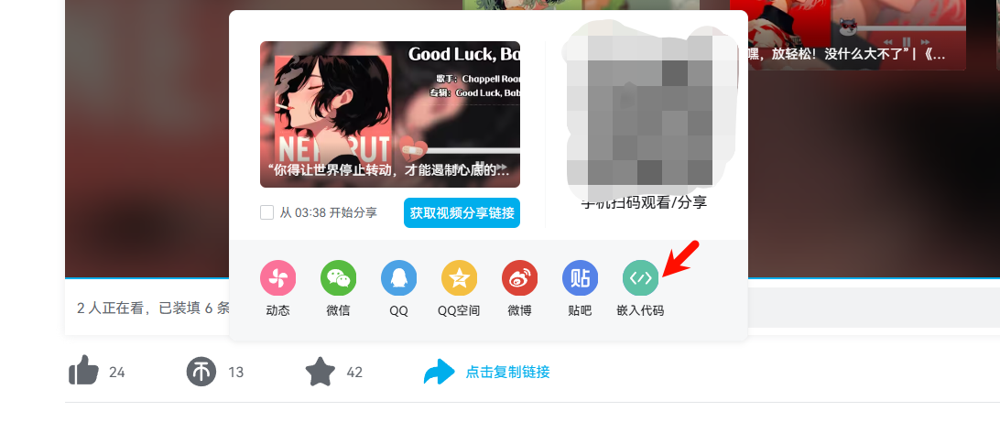
```html
<iframe 
src="//player.bilibili.com/player.html?isOutside=true&aid=113991737148695&bvid=BV1qQK7eXERw&cid=28358870196&p=1" 
scrolling="yes"
border="0" 
frameborder="no" 
framespacing="0" 
allowfullscreen="true">
</iframe>
```
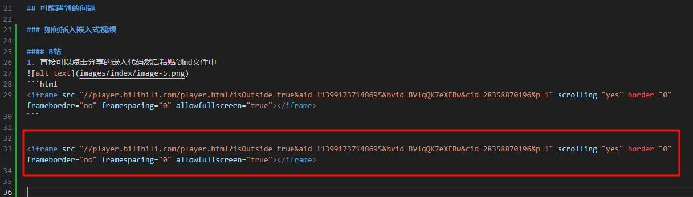

`效果如下：`

<iframe 
src="//player.bilibili.com/player.html?isOutside=true&aid=113991737148695&bvid=BV1qQK7eXERw&cid=28358870196&p=1" 
scrolling="yes"
border="0" 
frameborder="no" 
framespacing="0" 
allowfullscreen="true">
</iframe>


2. 使用shortcode方式

参考：https://zhuanlan.zhihu.com/p/622866669


创建一个模板文件，内容可以为：
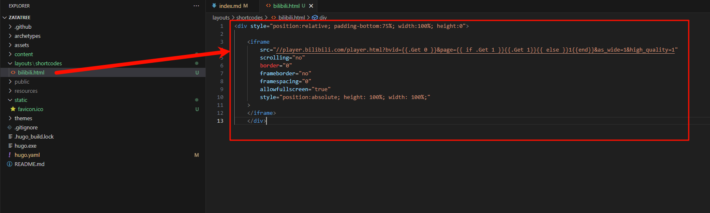

代码：

```html
<div style="position:relative; padding-bottom:75%; width:100%; height:0">

<iframe
	src="//player.bilibili.com/player.html?bvid={{.Get 0 }}&page={{ if .Get 1 }}{{.Get 1}}{{ else }}1{{end}}&as_wide=1&high_quality=1"
	scrolling="no"
	border="0"
	frameborder="no"
	framespacing="0"
	allowfullscreen="true"
	style="position:absolute; height: 100%; width: 100%;"
>
</iframe>
</div>
```
然后使用下面的语法使用这个模板
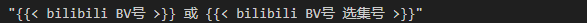

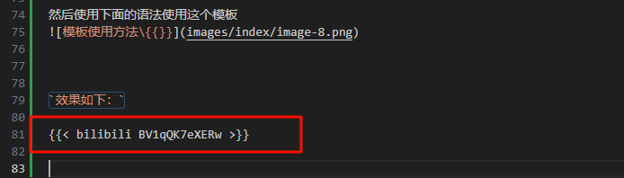

`效果如下：`




### Hugo 文章日期设定上的小问题（时区问题）


参考： https://blog.hly0928.com/post/hugo-post-date-issue/


Hugo 在生成静态页面的时候，不会生成超过当前时间的文章；而 Hugo 默认采用的是 格林尼治平时 (GMT)，比北京时间 (UTC+8) 晚了 8 个小时。也就是说，当北京时间在 08:00 之前，而你又将文章发布日期设在当天时，Hugo 就默认不会生成这个页面。

解决方法： 
最后我选择文章头增加时区信息
```py
---
...
date: 2025-03-02T00:00:00+08:00
...
---
```


## Stack 主题

### hugo Stack 配置文件示例


```py
baseurl: www.zata.cc                    # 定义网站的基础 URL，所有相对链接基于此生成，通常是域名
languageCode: en-us                     # 指定默认语言代码（如 en-us 表示美国英语）
theme: hugo-theme-stack                 # 指定使用的 Hugo 主题名称
title: Example Site                     # 网站的默认标题，显示在浏览器标签页或页面中
copyright: Example Person               # 网站版权声明，通常显示在页脚

# Theme i18n support
# Available values: ar, bn, ca, de, el, en, es, fr, hu, id, it, ja, ko, nl, pt-br, th, uk, zh-cn, zh-hk, zh-tw
DefaultContentLanguage: zh-cn           # 指定默认内容语言，这里是简体中文（zh-cn）

# Set hasCJKLanguage to true if DefaultContentLanguage is in [zh-cn ja ko]
# This will make .Summary and .WordCount behave correctly for CJK languages.
hasCJKLanguage: false                   # 是否启用 CJK 语言（中文、日文、韩文）的优化，这里关闭

languages:
    en:
        languageName: English           # 语言名称为“英语”
        title: Example Site             # 英文版本的网站标题
        weight: 1                       # 语言优先级，数字越小优先级越高
        params:
            sidebar:
                subtitle: Example description  # 英文侧边栏描述
    zh-cn:
        languageName: 中文             # 语言名称为“中文”
        title: Zata's Blog             # 中文版本的网站标题
        weight: 2                      # 优先级低于英文
        params:
            sidebar:
                subtitle:              # 中文侧边栏描述（此处为空）
    # ar:
    #     languageName: عربي          # 示例：阿拉伯语名称
    #     languagedirection: rtl      # 示例：从右到左布局
    #     title: موقع تجريبي         # 示例：阿拉伯语标题
    #     weight: 3                   # 示例：优先级
    #     params:
    #         sidebar:
    #             subtitle: وصف تجريبي  # 示例：阿拉伯语侧边栏描述

services:
    # Change it to your Disqus shortname before using
    disqus:
        shortname: "hugo-theme-stack"   # Disqus 评论系统的短名称，用于启用评论
    # GA Tracking ID
    googleAnalytics:
        id:                             # Google Analytics 的跟踪 ID（未填写）

pagination:
    pagerSize: 10                       # 每页显示的文章数量，这里为 10 篇

permalinks:
    post: /p/:slug/                    # 文章链接格式，例如 /p/my-post/
    page: /:slug/                      # 普通页面链接格式，例如 /about/

params:
    mainSections:
        - post                         # 指定主要内容类型为 post（通常是博客文章）
    featuredImageField: image          # 指定文章的特色图片字段为 image（文章头的key）
    rssFullContent: true               # RSS 订阅输出完整文章内容，而非摘要
    favicon:                           # 网站图标路径（未设置，例如 /favicon.ico）
    # 网站图标路径#e.g.:favicon placed in static/favicon.ico of your site folder,then set thisfield to/favicon.ico(/is necessay)


    footer:
        since: 2020                    # 显示网站起始年份（如“© 2020-2025”）
        customText:                    # 自定义页脚文本（未设置）

    dateFormat:
        published: Jan 02, 2006        # 文章发布日期格式（例如“Jan 02, 2006”）
        lastUpdated: Jan 02, 2006 15:04 MST  # 最后更新时间的格式（包含时区）

    sidebar:
        emoji: 🍥                     # 侧边栏显示的表情符号
        subtitle: Hello,I am Zata.     # 侧边栏副标题
        avatar:
            enabled: true              # 启用头像
            local: true                # 头像文件存储在本地
            src: img/avatar.jpg        # 头像文件路径

    article:
        math: false                    # 是否启用数学公式支持（关闭）
        toc: true                      # 启用文章目录（Table of Contents）
        readingTime: true              # 显示阅读时间
        license:
            enabled: false             # 是否显示许可声明（关闭）
            default: Licensed under CC BY-NC-SA 4.0  # 默认许可文本

    comments:
        enabled: true                  # 启用评论
        provider: disqus               # 使用 Disqus 作为评论提供者

        disqusjs:
            shortname:                 # DisqusJS 的短名称（未设置）
            apiUrl:                    # DisqusJS 的 API 地址（未设置）
            apiKey:                    # DisqusJS 的 API 密钥（未设置）
            admin:                     # DisqusJS 管理员（未设置）
            adminLabel:                # DisqusJS 管理员标签（未设置）

        utterances:
            repo:                      # Utterances 的仓库（未设置）
            issueTerm: pathname        # Utterances 的问题标识方式（未设置）
            label:                     # Utterances 的标签（未设置）

        beaudar:
            repo:                      # Beaudar 的仓库（未设置）
            issueTerm: pathname        # Beaudar 的问题标识方式（未设置）
            label:                     # Beaudar 的标签（未设置）
            theme:                     # Beaudar 的主题（未设置）

        remark42:
            host:                      # Remark42 的主机地址（未设置）
            site:                      # Remark42 的站点名称（未设置）
            locale:                    # Remark42 的语言（未设置）

        vssue:
            platform:                  # Vssue 的平台（未设置）
            owner:                     # Vssue 的拥有者（未设置）
            repo:                      # Vssue 的仓库（未设置）
            clientId:                  # Vssue 的客户端 ID（未设置）
            clientSecret:              # Vssue 的客户端密钥（未设置）
            autoCreateIssue: false     # Vssue 是否自动创建问题（关闭）

        # Waline client configuration see: https://waline.js.org/en/reference/component.html
        waline:
            serverURL:                 # Waline 的服务器地址（未设置）
            lang:                      # Waline 的语言（未设置）
            pageview:                  # Waline 的页面浏览量（未设置）
            emoji:
                - https://unpkg.com/@waline/emojis@1.0.1/weibo  # Waline 的表情包地址
            requiredMeta:
                - name                 # Waline 的必填项：名称
                - email                # Waline 的必填项：邮箱
                - url                  # Waline 的必填项：网址
            locale:
                admin: Admin           # Waline 的管理员名称
                placeholder:           # Waline 的占位符（未设置）

        twikoo:
            envId:                     # Twikoo 的环境 ID（未设置）
            region:                    # Twikoo 的区域（未设置）
            path:                      # Twikoo 的路径（未设置）
            lang:                      # Twikoo 的语言（未设置）

        # See https://cactus.chat/docs/reference/web-client/#configuration for description of the various options
        cactus:
            defaultHomeserverUrl: "https://matrix.cactus.chat:8448"  # Cactus 的默认服务器地址
            serverName: "cactus.chat"  # Cactus 的服务器名称
            siteName: ""               # Cactus 的站点名称（需唯一，未设置）

        giscus:
            repo:                      # Giscus 的仓库（未设置）
            repoID:                    # Giscus 的仓库 ID（未设置）
            category:                  # Giscus 的分类（未设置）
            categoryID:                # Giscus 的分类 ID（未设置）
            mapping:                   # Giscus 的映射方式（未设置）
            lightTheme:                # Giscus 的亮色主题（未设置）
            darkTheme:                 # Giscus 的暗色主题（未设置）
            reactionsEnabled: 1        # Giscus 是否启用反应（启用）
            emitMetadata: 0            # Giscus 是否输出元数据（关闭）

        gitalk:
            owner:                     # Gitalk 的拥有者（未设置）
            admin:                     # Gitalk 的管理员（未设置）
            repo:                      # Gitalk 的仓库（未设置）
            clientID:                  # Gitalk 的客户端 ID（未设置）
            clientSecret:              # Gitalk 的客户端密钥（未设置）
            proxy:                     # Gitalk 的代理（未设置）

        cusdis:
            host:                      # Cusdis 的主机地址（未设置）
            id:                        # Cusdis 的 ID（未设置）
    widgets:
        homepage:
            - type: search             # 主页小部件：搜索框
            - type: archives           # 主页小部件：归档列表
              params:
                  limit: 5             # 归档列表限制显示 5 个
            - type: categories         # 主页小部件：分类列表
              params:
                  limit: 10            # 分类列表限制显示 10 个
            - type: tag-cloud          # 主页小部件：标签云
              params:
                  limit: 10            # 标签云限制显示 10 个
        page:
            - type: toc                # 单页小部件：目录

    opengraph:
        twitter:
            # Your Twitter username
            site:                      # Twitter 用户名（未设置）
            # Available values: summary, summary_large_image
            card: summary_large_image  # Twitter 卡片类型（大图模式）

    defaultImage:
        opengraph:
            enabled: false             # 是否启用默认 Open Graph 图片（关闭）
            local: false               # 是否使用本地图片（否）
            src:                       # 图片路径（未设置）

    colorScheme:
        # Display toggle
        toggle: true                   # 显示主题切换按钮
        # Available values: auto, light, dark
        default: auto                  # 默认使用自动主题（根据浏览器偏好）

    imageProcessing:
        cover:
            enabled: true              # 启用封面图处理
        content:
            enabled: true              # 启用内容图片处理

### Custom menu
### See https://stack.jimmycai.com/config/menu
### To remove about, archive and search page menu item, remove `menu` field from their FrontMatter
menu:
    main: []                           # 主菜单（为空）
    social:
        - identifier: github           # 社交链接：GitHub
          name: GitHub                 # 显示名称
          url: https://github.com/zata-zhangtao/ZataTree  # 链接地址
          params:
              icon: brand-github       # 图标名称

        # - identifier: twitter        # 示例：Twitter 社交链接（已注释）
        #   name: Twitter
        #   url: https://twitter.com
        #   params:
        #       icon: brand-twitter

related:
    includeNewer: true                 # 相关文章推荐包括较新的文章
    threshold: 60                      # 相关性阈值（越高越严格）
    toLower: false                     # 标签/分类是否忽略大小写
    indices:
        - name: tags                   # 根据标签匹配相关文章
          weight: 100                  # 标签权重
        - name: categories             # 根据分类匹配相关文章
          weight: 200                  # 分类权重

markup:
    goldmark:
        extensions:
            passthrough:
                enable: true           # 启用原始字符渲染（例如数学公式）
                delimiters:
                    block:
                        - - \[            # 块级数学公式开始分隔符
                          - \]            # 块级数学公式结束分隔符
                        - - $$            # 块级数学公式开始分隔符
                          - $$            # 块级数学公式结束分隔符
                    inline:
                        - - \(            # 行内数学公式开始分隔符
                          - \)            # 行内数学公式结束分隔符
        renderer:
            ## Set to true if you have HTML content inside Markdown
            unsafe: true               # 允许在 Markdown 中嵌入 HTML
    tableOfContents:
        endLevel: 4                    # 目录包含到 4 级标题
        ordered: true                  # 目录编号
        startLevel: 2                  # 从 2 级标题开始
    highlight:
        noClasses: false               # 使用 CSS 类高亮代码
        codeFences: true               # 启用代码块
        guessSyntax: true              # 自动检测代码语言
        lineNoStart: 1                 # 行号从 1 开始
        lineNos: true                  # 显示行号
        lineNumbersInTable: true       # 行号显示在表格中
        tabWidth: 4                    # 制表符宽度

frontmatter:
    lastmod: [":fileModTime", "lastmod"]  # 定义最后修改时间的来源（文件修改时间或 frontmatter 中的 lastmod）

```

### Hugo Stack 主题添加[最后修改于]

参考：
- https://shitao5.org/posts/hugo-stack/


1. 配置[最后修改于]

      在主题的.yaml文件中添加
      
    ```py
    frontmatter:
    lastmod: [":fileModTime", "lastmod"]
    ```
    
    **这样会显示最后更新于**
    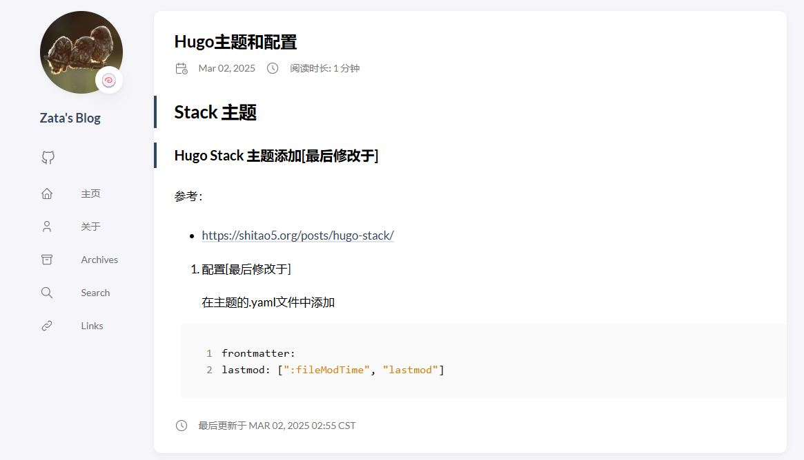
    
    **如果要显示最后修改于**
    修改 themes/hugo-theme-stack/i18n 文件夹中的 zh-cn.yaml 文件
    


### 在文章开头就显示修改时间

参考：   
https://letere-gzj.github.io/hugo-stack/p/hugo/custom-stack-theme/#3-%E6%98%BE%E7%A4%BA%E6%96%87%E7%AB%A0%E6%9B%B4%E6%96%B0%E6%97%B6%E9%97%B4


1. 在themes\hugo-theme-satck\layouts\partials\article\components\details.html，在指定位置引入以下代码
```html
        {{- if ne .Lastmod .Date -}}
        <div>
            {{ partial "helper/icon" "clock" }}
            <time class="article-time--published">
                {{ T "article.lastUpdatedOn" }} {{ .Lastmod | time.Format ( or .Site.Params.dateFormat.lastUpdated "Jan 02, 2006 15:04 MST" ) }}
            </time>
        </div>
        {{- end -}}
```

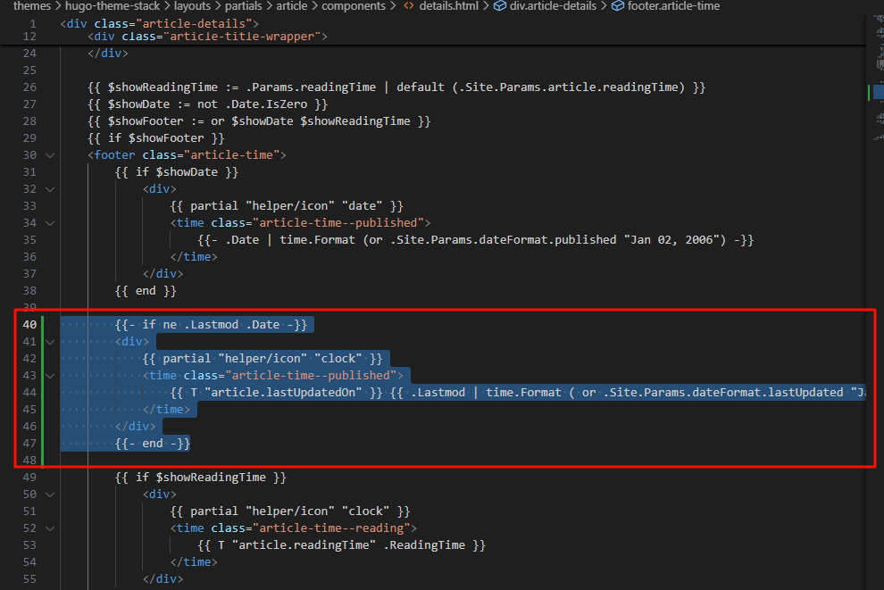


2. 在主题的.yaml文件中添加
```yaml
# 更新时间：优先读取git时间 -> git时间不存在，就读取本地文件修改时间
frontmatter:
  lastmod:
    - :git
    - :fileModTime

# 允许获取Git信息		
enableGitInfo: true

```

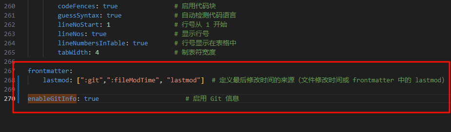

这部分指定了Hugo获取lastmod值的优先级顺序：  
:git：优先使用Git提交历史中的最后修改时间（更准确反映内容实际更新时间）。  
:fileModTime：如果Git信息不可用，则使用本地文件的修改时间作为备选。  
如果不设置这个，Hugo可能无法正确填充.Lastmod，导致你的代码 {{ if ne .Lastmod .Date }} 条件永远不生效。  
enableGitInfo: true：   
默认情况下，Hugo不会去查询Git信息（为了性能考虑）。   
设置 enableGitInfo: true 后，Hugo会利用Git仓库的提交历史来填充页面变量（如 .Lastmod）。  
如果你使用的是版本控制（比如GitHub），这个设置非常有用，因为它能确保修改时间反映的是内容的实际提交时间，而不是本地文件的时间（后者可能因环境不同而变化）。


3. 修改github action文件.github/workflows/xxx.yaml，让可以读取git信息

```yaml
- name: Git Configuration
run: |
    git config --global core.quotePath false
    git config --global core.autocrlf false
    git config --global core.safecrlf true
    git config --global core.ignorecase false      
```    

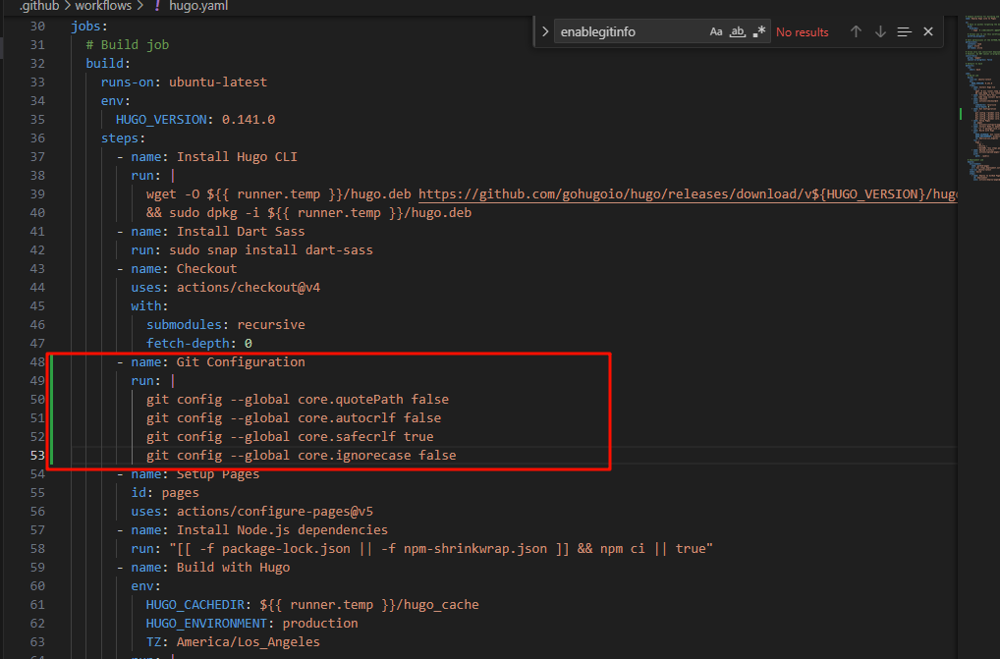

这些配置确保Git在构建过程中能够正确处理文件路径和换行符等问题，避免因环境差异导致的异常。   
core.quotePath false：确保特殊字符的文件名不会被转义。   
core.autocrlf false：避免换行符转换问题（不同系统可能处理不同）。   
core.safecrlf true：确保换行符处理安全。   
core.ignorecase false：保持文件名大小写敏感。   
这些设置虽然不直接决定.Lastmod，但能确保Git仓库的行为一致，避免潜在问题。   


### 代码块过长折叠&展开
1. 准备一张图片作为代码展开的按钮，放到assets/icons文件夹下，并命名为codeMore.png
2. 将下面代码复制粘贴到layouts/partials/footer/custom.html中(文件没有就新建)，有报错不要管
```html
<style>
    .highlight {
        /* 你可以根据需要调整这个高度 */
        max-height: 400px;
        overflow: hidden;
    }

    .code-show {
        max-height: none !important;
    }

    .code-more-box {
        width: 100%;
        padding-top: 78px;
        background-image: -webkit-gradient(linear, left top, left bottom, from(rgba(255, 255, 255, 0)), to(#fff));
        position: absolute;
        left: 0;
        right: 0;
        bottom: 0;
        z-index: 1;
    }

    .code-more-btn {
        display: block;
        margin: auto;
        width: 44px;
        height: 22px;
        background: #f0f0f5;
        border-top-left-radius: 8px;
        border-top-right-radius: 8px;
        padding-top: 6px;
        cursor: pointer;
    }

    .code-more-img {
        cursor: pointer !important;
        display: block;
        margin: auto;
        width: 22px;
        height: 16px;
    }
</style>

<script>
  function initCodeMoreBox() {
    let codeBlocks = document.querySelectorAll(".highlight");
    if (!codeBlocks) {
      return;
    }
    codeBlocks.forEach(codeBlock => {
      // 校验是否overflow
      if (codeBlock.scrollHeight <= codeBlock.clientHeight) {
        return;
      }
      // 元素初始化
      // codeMoreBox
      let codeMoreBox = document.createElement('div');
      codeMoreBox.classList.add('code-more-box');
      // codeMoreBtn
      let codeMoreBtn = document.createElement('span');
      codeMoreBtn.classList.add('code-more-btn');
      codeMoreBtn.addEventListener('click', () => {
        codeBlock.classList.add('code-show');
        codeMoreBox.style.display = 'none';
        // 触发resize事件，重新计算目录位置
        window.dispatchEvent(new Event('resize'))
      })
      // img
      let img = document.createElement('img');
      img.classList.add('code-more-img');
      img.src = {{ (resources.Get "icons/codemore.png").Permalink }}
      // 元素添加
      codeMoreBtn.appendChild(img);
      codeMoreBox.appendChild(codeMoreBtn);
      codeBlock.appendChild(codeMoreBox)
    })
  }
  
  initCodeMoreBox();
</script>

```
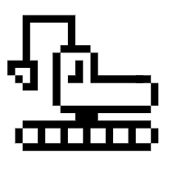
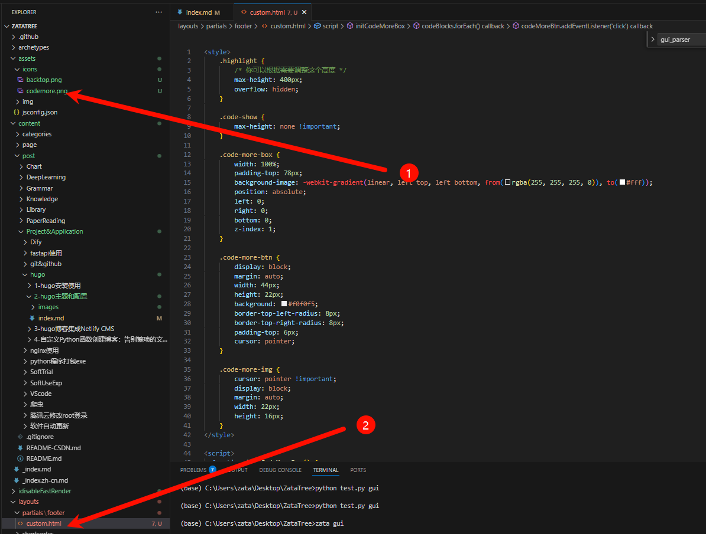

###  添加’返回顶部’按钮


1. 图片还是和代码块过长一样放在/assets/icons文件夹下，命名为backtop.png
2. 修改layouts/partials/footer/custom.html文件，下面的代码是直接在代码块折叠的基础上又加了返回最顶按钮.粘贴代码一样也是，vscode报错也别理
```html
<style>
    .highlight {
        max-height: 400px;
        overflow: hidden;
        position: relative;
    }

    .code-show {
        max-height: none !important;
    }

    .code-more-box {
        width: 100%;
        padding-top: 78px;
        background-image: linear-gradient(to bottom, rgba(255, 255, 255, 0), #fff);
        position: absolute;
        left: 0;
        bottom: 0;
        z-index: 1;
    }

    .code-more-btn {
        display: block;
        margin: 0 auto;
        width: 44px;
        height: 22px;
        background: #f0f0f5;
        border-top-left-radius: 8px;
        border-top-right-radius: 8px;
        padding-top: 6px;
        cursor: pointer;
    }

    .code-more-img {
        display: block;
        margin: 0 auto;
        width: 22px;
        height: 16px;
    }

    #backTopBtn {
        display: none;
        position: fixed;
        bottom: 30px;
        right: 20px;
        z-index: 99;
        cursor: pointer;
        width: 30px;
        height: 30px;
        background-image: url({{ (resources.Get "icons/backtop.png").RelPermalink }});
        background-size: cover;
        background-repeat: no-repeat;
    }
</style>

<script>
    function initCodeMoreBox() {
        try {
            const codeBlocks = document.querySelectorAll(".highlight");
            if (!codeBlocks.length) return;

            codeBlocks.forEach(codeBlock => {
                if (codeBlock.scrollHeight <= codeBlock.clientHeight) return;

                const codeMoreBox = document.createElement('div');
                codeMoreBox.classList.add('code-more-box');

                const codeMoreBtn = document.createElement('span');
                codeMoreBtn.classList.add('code-more-btn');

                const img = document.createElement('img');
                img.classList.add('code-more-img');
                img.src = "{{ (resources.Get "icons/codemore.png").RelPermalink }}";
                img.alt = 'Show more';

                codeMoreBtn.addEventListener('click', () => {
                    codeBlock.classList.add('code-show');
                    codeMoreBox.style.display = 'none';
                    window.dispatchEvent(new Event('resize'));
                });

                codeMoreBtn.appendChild(img);
                codeMoreBox.appendChild(codeMoreBtn);
                codeBlock.appendChild(codeMoreBox);
            });
        } catch (error) {
            console.error('Error in initCodeMoreBox:', error);
        }
    }

    function initScrollTop() {
        try {
            const rightSideBar = document.querySelector(".right-sidebar");
            if (!rightSideBar) {
                console.warn('Right sidebar not found');
                return;
            }

            const btn = document.createElement("div");
            btn.id = "backTopBtn";
            btn.onclick = backToTop;
            rightSideBar.appendChild(btn);

            window.onscroll = function () {
                if (document.body.scrollTop > 20 || document.documentElement.scrollTop > 20) {
                    btn.style.display = "block";
                } else {
                    btn.style.display = "none";
                }
            };
        } catch (error) {
            console.error('Error in initScrollTop:', error);
        }
    }

    function backToTop() {
        window.scrollTo({ top: 0, behavior: "smooth" });
    }

    document.addEventListener('DOMContentLoaded', () => {
        initCodeMoreBox();
        initScrollTop();
    });
</script>
```
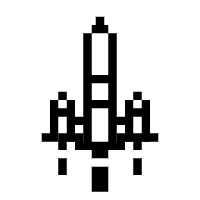
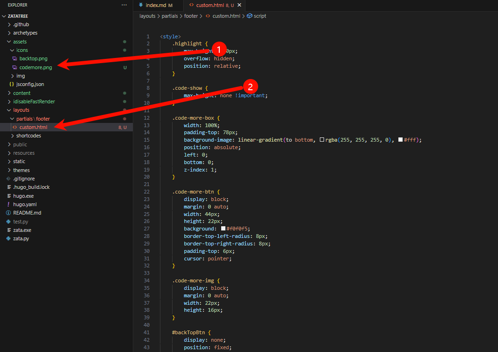

