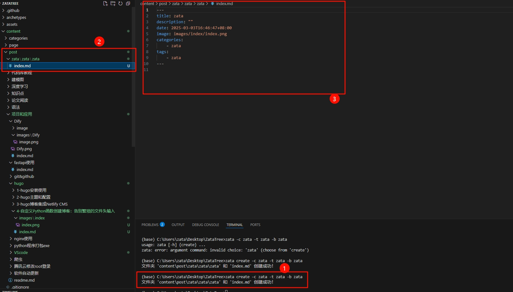
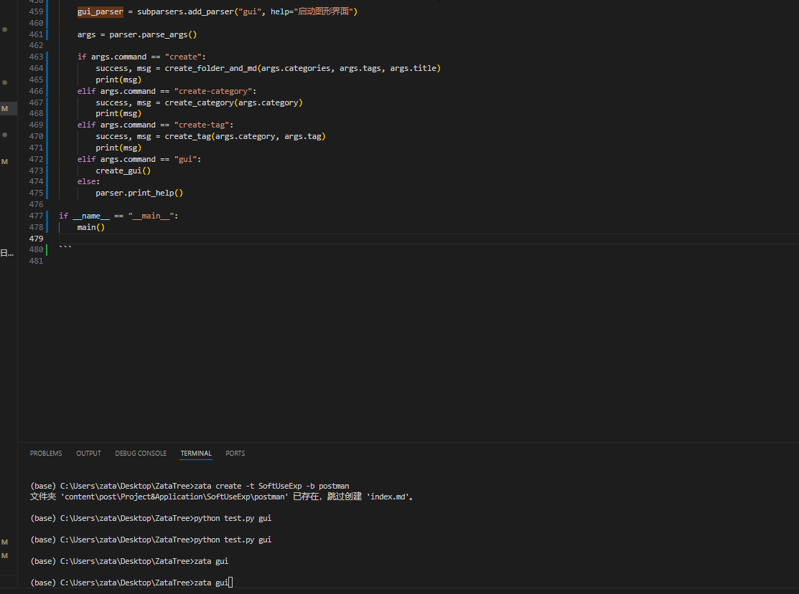

以下是基于最新的需求重新撰写的博客文章，主题仍是“使用自定义Python函数创建博客，避免繁琐的文件头标准内容输入”。这次博客将反映新的功能：通过 `categories`、`tags` 和 `title` 三个参数生成文件夹和文件，并将路径组合为 `categories/tags/title`。

---

# 使用自定义Python函数创建博客：告别繁琐的文件头输入

在维护技术博客时，每次创建新文章都需要手动设置文件夹结构和标准化的Markdown文件头，例如标题、分类、标签和日期等。这种重复劳动不仅耗时，还容易出错。想象一下，如果能通过一个简单的命令，比如 `zata create -c Python -t github -b MyProject`，自动生成带有标准头部的博客文件，并按分类和标签组织目录结构，会不会让写作更高效？

在这篇博客中，我将展示如何用Python实现这一自动化工具，并将其打包成一个命令行可执行文件。通过自定义函数，我们可以轻松创建博客文件，避免手动输入繁琐的文件头内容。

---

## 背景与目标

假设你正在用静态网站生成器（如Jekyll或Hugo）写博客，每次新建文章时需要：
1. 创建一个文件夹结构，比如 `Python/github/MyProject`。
2. 在最内层文件夹中生成一个 `index.md` 文件。
3. 为 `index.md` 添加标准头部，例如：
   ```
   ---
   title: MyProject
   description: "空"
   date: 2025-03-03T15:20:45+08:00
   image: images/index.png
   categories:
       - Python
   tags:
       - github
   ---
   ```

手动完成这些步骤虽然可行，但效率低下。我的目标是：
- 编写一个Python脚本，接受 `categories`、`tags` 和 `title` 三个参数。
- 根据输入生成路径 `categories/tags/title`，并创建对应的文件夹和 `index.md` 文件。
- 自动填充标准头部信息，日期使用当前时间。
- 将脚本打包成命令行工具，支持 `zata create -c [分类] -t [标签] -b [标题]` 的调用方式。

---

##  2025.03.03 初步实现可以使用命令行创建一个博客

### 步骤 1：设计基本功能

我们需要一个函数，根据输入的 `categories`、`tags` 和 `title` 创建文件夹和文件。以下是最小化的实现：

```python
import os
from datetime import datetime

def create_folder_and_md(categories, tags, title):
    current_dir = os.getcwd()
    target_path = os.path.join(current_dir, categories, tags, title)
    current_time = datetime.now().strftime("%Y-%m-%dT%H:%M:%S+08:00")
    
    os.makedirs(target_path, exist_ok=True)
    md_file_path = os.path.join(target_path, "index.md")
    header_content = f"""---
title: {title}
description: "空"
date: {current_time}
image: images/index.png
categories:
    - {categories}
tags:
    - {tags}
---
"""
    with open(md_file_path, 'w', encoding='utf-8') as f:
        f.write(header_content)
    print(f"文件夹 '{target_path}' 和 'index.md' 创建成功！")

create_folder_and_md("Python", "github", "MyProject")
```

这个脚本会在当前目录下创建 `Python/github/MyProject` 文件夹，并在其中生成带有标准头部的 `index.md`。

### 步骤 2：添加命令行支持

为了让脚本更实用，我们引入 `argparse` 模块，支持命令行参数输入：

```python
import os
from datetime import datetime
import argparse

def create_folder_and_md(categories, tags, title):
    current_dir = os.getcwd()
    target_path = os.path.join(current_dir, categories, tags, title)
    current_time = datetime.now().strftime("%Y-%m-%dT%H:%M:%S+08:00")
    
    try:
        os.makedirs(target_path, exist_ok=True)
        md_file_path = os.path.join(target_path, "index.md")
        header_content = f"""---
title: {title}
description: "空"
date: {current_time}
image: images/index.png
categories:
    - {categories}
tags:
    - {tags}
---
"""
        with open(md_file_path, 'w', encoding='utf-8') as f:
            f.write(header_content)
        print(f"文件夹 '{target_path}' 和 'index.md' 创建成功！")
    except Exception as e:
        print(f"发生错误: {str(e)}")

def main():
    parser = argparse.ArgumentParser(prog="zata", description="根据categories、tags和title创建一个文件夹和index.md文件")
    subparsers = parser.add_subparsers(dest="command", help="可用命令")
    create_parser = subparsers.add_parser("create", help="创建文件夹和index.md")
    create_parser.add_argument("-c", "--categories", required=True, help="博客分类")
    create_parser.add_argument("-t", "--tags", required=True, help="博客标签")
    create_parser.add_argument("-b", "--title", required=True, help="博客标题")
    args = parser.parse_args()
    
    if args.command == "create":
        create_folder_and_md(args.categories, args.tags, args.title)
    else:
        parser.print_help()

if __name__ == "__main__":
    main()
```

保存为 `zata.py`，运行以下命令测试：
```bash
python zata.py create -c Python -t github -b MyProject
```

### 步骤 3：打包成可执行文件

为了方便使用，我们用 `PyInstaller` 将脚本打包成单一的 `.exe` 文件：

1. 安装 PyInstaller：
   ```bash
   pip install pyinstaller
   ```
2. 打包脚本：
   ```bash
   pyinstaller --onefile zata.py
   ```
3. 打包完成后，在 `dist` 文件夹中找到 `zata.exe`，运行：
   ```bash
   zata.exe create -c Python -t github -b MyProject
   ```


---

### 成果展示

运行以下命令：
```bash
zata create -c Python -t github -b MyProject
```

结果：
- 生成目录结构：`Python/github/MyProject`。
- 在 `MyProject` 文件夹中创建 `index.md`，内容如下：
  ```
  ---
  title: MyProject
  description: "空"
  date: 2025-03-03T15:20:45+08:00
  image: images/index.png
  categories:
      - Python
  tags:
      - github
  ---
  ```
- 控制台输出：
  ```
  文件夹 'Python/github/MyProject' 和 'index.md' 创建成功！
  ```

整个过程只需一条命令，省去了手动创建文件夹和输入文件头的麻烦。

---


## 2025.03.05 增加giu可以下拉选择来创建



```python
import os
from datetime import datetime
import argparse
import tkinter as tk
from tkinter import ttk, messagebox

# 原有函数保持不变，返回值改为元组以适应 GUI 使用
def create_category(category):
    """创建category目录"""
    target_path = os.path.join("content", "post", category)
    try:
        os.makedirs(target_path, exist_ok=True)
        return True, f"Category目录 '{target_path}' 创建成功！"
    except Exception as e:
        return False, f"创建category时发生错误: {str(e)}"

def create_tag(category, tag):
    """创建tag目录，必须指定category"""
    base_path = os.path.join("content", "post")
    target_path = os.path.join(base_path, category, tag)
    
    category_path = os.path.join(base_path, category)
    if not os.path.exists(category_path):
        return False, f"错误：Category目录 '{category_path}' 不存在！请先创建category"
    
    try:
        os.makedirs(target_path, exist_ok=True)
        return True, f"Tag目录 '{target_path}' 创建成功！"
    except Exception as e:
        return False, f"创建tag时发生错误: {str(e)}"

def create_folder_and_md(categories, tags, title):
    """创建文章目录和index.md文件"""
    current_time = datetime.now().strftime("%Y-%m-%dT%H:%M:%S+08:00")
    base_path = os.path.join("content", "post")
    
    if categories:
        target_path = os.path.join(base_path, categories, tags, title)
        parent_path = os.path.join(base_path, categories, tags)
        
        if not os.path.exists(parent_path):
            return False, f"错误：父目录 '{parent_path}' 不存在！请先创建相应的categories和tags目录"
    else:
        matched_paths = []
        for category in os.listdir(base_path):
            category_path = os.path.join(base_path, category)
            if os.path.isdir(category_path):
                tag_path = os.path.join(category_path, tags)
                if os.path.exists(tag_path) and os.path.isdir(tag_path):
                    matched_paths.append(tag_path)
        
        if len(matched_paths) == 0:
            return False, f"错误：未在任何category下找到tags '{tags}'！请先创建相应的tags目录"
        elif len(matched_paths) > 1:
            error_msg = f"错误：找到多个匹配的tags '{tags}'：\n"
            for path in matched_paths:
                error_msg += f"  - {path}\n"
            error_msg += "请指定具体的category以避免歧义"
            return False, error_msg
        else:
            parent_path = matched_paths[0]
            target_path = os.path.join(parent_path, title)
            categories = os.path.basename(os.path.dirname(parent_path))

    try:
        os.makedirs(target_path, exist_ok=True)
        md_file_path = os.path.join(target_path, "index.md")
        
        header_content = f"""---
title: {title}
description: ""
date: {current_time}
image: images/index/index.png
"""
        if categories:
            header_content += f"""categories:
    - {categories}
"""
        header_content += f"""tags:
    - {tags}
---
"""
        
        if not os.path.exists(md_file_path):
            with open(md_file_path, 'w', encoding='utf-8') as f:
                f.write(header_content)
            return True, f"文件夹 '{target_path}' 和 'index.md' 创建成功！"
        return True, f"文件夹 '{target_path}' 已存在，跳过创建 'index.md'。"
    except Exception as e:
        return False, f"发生错误: {str(e)}"

# 新增函数：获取现有 Category 和 Tag 列表
def get_existing_categories():
    base_path = os.path.join("content", "post")
    if not os.path.exists(base_path):
        return []
    return [d for d in os.listdir(base_path) if os.path.isdir(os.path.join(base_path, d))]

def get_existing_tags(category=None):
    base_path = os.path.join("content", "post")
    if not os.path.exists(base_path):
        return []
    tags = set()
    if category:
        category_path = os.path.join(base_path, category)
        if os.path.exists(category_path):
            tags.update([d for d in os.listdir(category_path) if os.path.isdir(os.path.join(category_path, d))])
    else:
        for cat in os.listdir(base_path):
            cat_path = os.path.join(base_path, cat)
            if os.path.isdir(cat_path):
                tags.update([d for d in os.listdir(cat_path) if os.path.isdir(os.path.join(cat_path, d))])
    return sorted(list(tags))

# 修改后的 GUI
def create_gui():
    root = tk.Tk()
    root.title("Zata - 博客管理工具")
    root.geometry("500x400")

    notebook = ttk.Notebook(root)
    notebook.pack(pady=10, fill="both", expand=True)

    # Category选项卡
    category_frame = ttk.Frame(notebook)
    notebook.add(category_frame, text="创建Category")

    ttk.Label(category_frame, text="Category名称:").pack(pady=5)
    category_entry = ttk.Entry(category_frame, width=40)
    category_entry.pack(pady=5)

    def create_category_btn():
        category = category_entry.get().strip()
        if not category:
            messagebox.showerror("错误", "请输入Category名称")
            return
        success, msg = create_category(category)
        messagebox.showinfo("结果", msg)
        # 成功后刷新下拉框
        if success:
            update_category_combobox()

    ttk.Button(category_frame, text="创建Category", command=create_category_btn).pack(pady=10)

    # Tag选项卡
    tag_frame = ttk.Frame(notebook)
    notebook.add(tag_frame, text="创建Tag")

    ttk.Label(tag_frame, text="所属Category:").pack(pady=5)
    tag_category_entry = ttk.Entry(tag_frame, width=40)
    tag_category_entry.pack(pady=5)
    
    ttk.Label(tag_frame, text="Tag名称:").pack(pady=5)
    tag_entry = ttk.Entry(tag_frame, width=40)
    tag_entry.pack(pady=5)

    def create_tag_btn():
        category = tag_category_entry.get().strip()
        tag = tag_entry.get().strip()
        if not category or not tag:
            messagebox.showerror("错误", "请输入Category和Tag名称")
            return
        success, msg = create_tag(category, tag)
        messagebox.showinfo("结果", msg)
        # 成功后刷新下拉框
        if success:
            update_tag_combobox()

    ttk.Button(tag_frame, text="创建Tag", command=create_tag_btn).pack(pady=10)

    # 文章选项卡
    post_frame = ttk.Frame(notebook)
    notebook.add(post_frame, text="创建文章")

    # Category 下拉框
    ttk.Label(post_frame, text="选择Category（可选）:").pack(pady=5)
    category_combobox = ttk.Combobox(post_frame, width=37, state="readonly")
    category_combobox.pack(pady=5)
    
    # Tag 下拉框
    ttk.Label(post_frame, text="选择Tag:").pack(pady=5)
    tag_combobox = ttk.Combobox(post_frame, width=37, state="readonly")
    tag_combobox.pack(pady=5)
    
    ttk.Label(post_frame, text="文章标题:").pack(pady=5)
    post_title_entry = ttk.Entry(post_frame, width=40)
    post_title_entry.pack(pady=5)

    # 更新下拉框内容的函数
    def update_category_combobox():
        categories = get_existing_categories()
        category_combobox["values"] = [""] + categories  # 空字符串表示可选
        if categories:
            category_combobox.set("")
    
    def update_tag_combobox(event=None):
        selected_category = category_combobox.get()
        if selected_category:
            tags = get_existing_tags(selected_category)
        else:
            tags = get_existing_tags()
        tag_combobox["values"] = tags
        if tags:
            tag_combobox.set(tags[0])
        else:
            tag_combobox.set("")

    # 绑定 Category 下拉框的选择事件
    category_combobox.bind("<<ComboboxSelected>>", update_tag_combobox)

    # 初始化下拉框
    update_category_combobox()
    update_tag_combobox()

    def create_post_btn():
        category = category_combobox.get() or None
        tag = tag_combobox.get()
        title = post_title_entry.get().strip()
        if not tag or not title:
            messagebox.showerror("错误", "请选择Tag并输入文章标题")
            return
        success, msg = create_folder_and_md(category, tag, title)
        messagebox.showinfo("结果", msg)

    ttk.Button(post_frame, text="创建文章", command=create_post_btn).pack(pady=10)

    root.mainloop()

def main():
    parser = argparse.ArgumentParser(prog="zata", description="博客目录和文件管理工具")
    subparsers = parser.add_subparsers(dest="command", help="可用命令")

    create_parser = subparsers.add_parser("create", help="创建文章文件夹和index.md")
    create_parser.add_argument("-c", "--categories", help="博客分类（可选）")
    create_parser.add_argument("-t", "--tags", required=True, help="博客标签")
    create_parser.add_argument("-b", "--title", required=True, help="博客标题")

    category_parser = subparsers.add_parser("create-category", help="创建category目录")
    category_parser.add_argument("-c", "--category", required=True, help="要创建的category名称")

    tag_parser = subparsers.add_parser("create-tag", help="创建tag目录")
    tag_parser.add_argument("-c", "--category", required=True, help="所属category")
    tag_parser.add_argument("-t", "--tag", required=True, help="要创建的tag名称")

    gui_parser = subparsers.add_parser("gui", help="启动图形界面")

    args = parser.parse_args()

    if args.command == "create":
        success, msg = create_folder_and_md(args.categories, args.tags, args.title)
        print(msg)
    elif args.command == "create-category":
        success, msg = create_category(args.category)
        print(msg)
    elif args.command == "create-tag":
        success, msg = create_tag(args.category, args.tag)
        print(msg)
    elif args.command == "gui":
        create_gui()
    else:
        parser.print_help()

if __name__ == "__main__":
    main()

```

