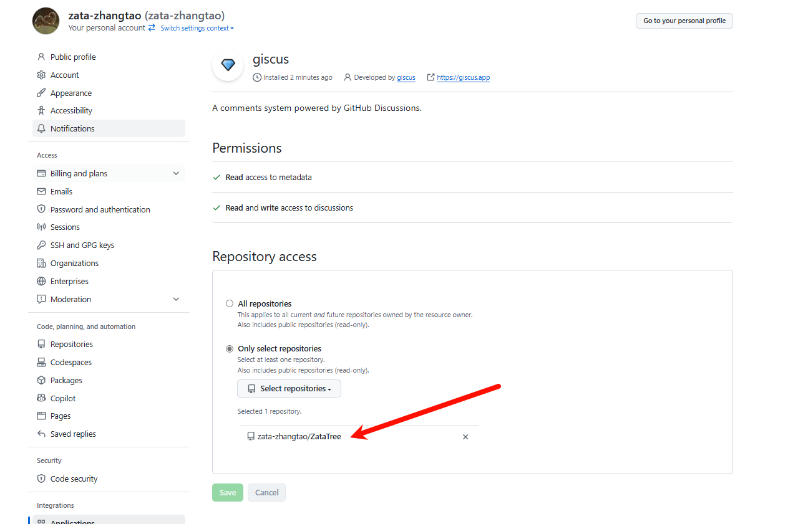
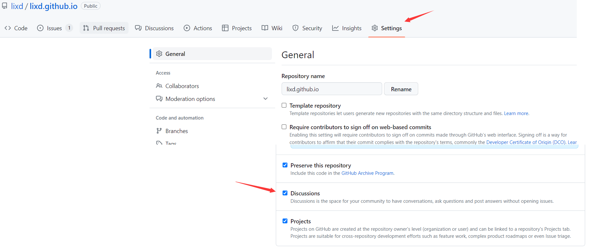
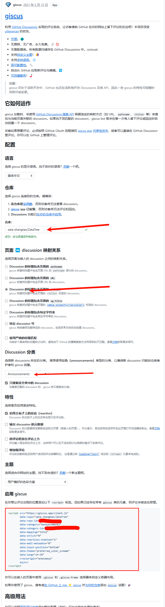
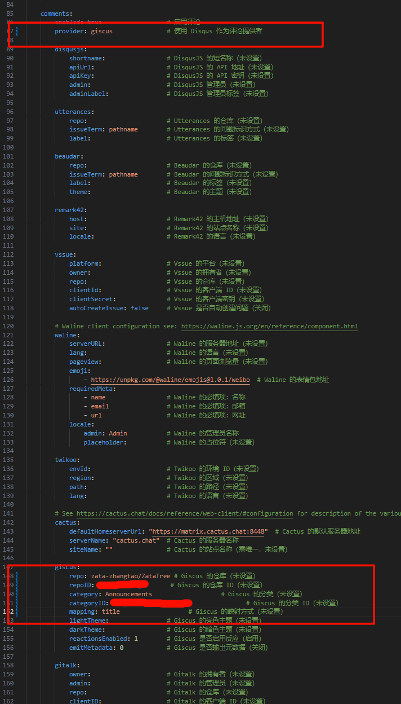

参考：

https://www.lixueduan.com/posts/blog/02-add-giscus-comment/#1-%E9%80%89%E6%8B%A9%E4%B8%80%E4%B8%AA%E8%AF%84%E8%AE%BA%E7%B3%BB%E7%BB%9F

## Stack 主题

### 1. 登录绑定应用

https://github.com/apps/giscus

然后选择你需要绑定的仓库

### 2.进入仓库开启Discussions 

### 3.获取配置信息

进到下面的这个网站里面

https://giscus.app/zh-CN

然后按照这样配置就可以得到最后的配置文件

### 4.回到hugo.yaml把刚刚的配置填进去

红框里面是要改的地方

### 碰到的坑
1. 上面的参考文章里面写的页面--discussion映射关系是使用pathname，但是我发现会乱码，就改成用title了