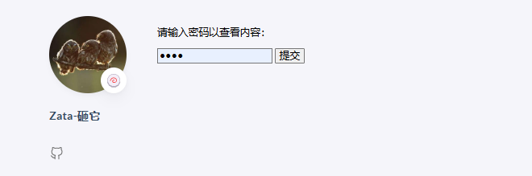
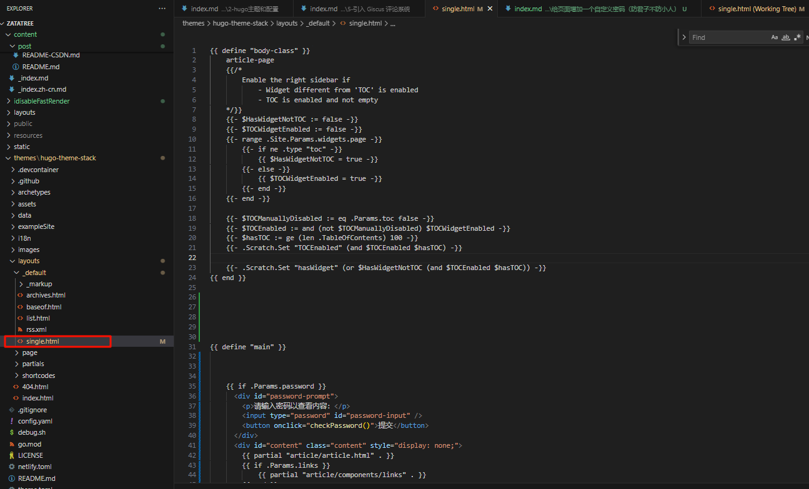

在 Hugo 的 Stack 模板中为特定文章添加自定义密码保护并不是 Hugo 内置的功能，但可以通过结合 Hugo 的前端功能和一些自定义逻辑来实现。以下是一个分步指南，帮助你在 Stack 模板中为某些文章添加密码保护：

---


## 在页面当中添加一个密码验证（由于静态页面的特性，仍有方法在没有密码的情况下解除锁定，所以此方法不要当真,防君子不防小人）

在 Hugo 的 Stack 模板中为特定文章添加自定义密码保护并不是 Hugo 内置的功能，但可以通过结合 Hugo 的前端功能和一些自定义逻辑来实现。以下是一个分步指南，帮助你在 Stack 模板中为某些文章添加密码保护：

### 1. 前提条件
- 你需要对 Hugo 的模板文件（如 `.html` 文件）有一定了解。
- 你需要编辑 Stack 模板的代码（通常位于 `themes/Stack` 目录下）。
- 每篇文章的密码在Front Matter 中定义。

---

### 2. 为文章添加密码字段
在需要密码保护的文章的 Front Matter 中添加一个自定义字段，例如 `password`。例如：

```yaml
---
title: "受保护的文章"
date: 2025-03-05
password: "mysecretpassword"  # 自定义密码
---
这是一篇受保护的文章内容。
```

如果某篇文章没有 `password` 字段，则默认不启用密码保护。

---

### 3. 修改模板文件
Stack 模板通常使用 `layouts` 文件夹中的模板来渲染文章页面。你需要修改渲染单篇文章的模板（通常是 `themes/Stack/layouts/_default/single.html`）。

#### 示例修改：
在 `single.html` 中添加逻辑，检查文章是否有密码，并要求用户输入密码。以下是一个基本的实现思路：

```
{{ define "body-class" }}
    article-page
    {{/* 
        Enable the right sidebar if
            - Widget different from 'TOC' is enabled
            - TOC is enabled and not empty
    */}}
    {{- $HasWidgetNotTOC := false -}}
    {{- $TOCWidgetEnabled := false -}}
    {{- range .Site.Params.widgets.page -}}
        {{- if ne .type "toc" -}}
            {{ $HasWidgetNotTOC = true -}}
        {{- else -}}
            {{ $TOCWidgetEnabled = true -}}
        {{- end -}}
    {{- end -}}

    {{- $TOCManuallyDisabled := eq .Params.toc false -}}
    {{- $TOCEnabled := and (not $TOCManuallyDisabled) $TOCWidgetEnabled -}}
    {{- $hasTOC := ge (len .TableOfContents) 100 -}}
    {{- .Scratch.Set "TOCEnabled" (and $TOCEnabled $hasTOC) -}}
    
    {{- .Scratch.Set "hasWidget" (or $HasWidgetNotTOC (and $TOCEnabled $hasTOC)) -}}
{{ end }}


{{ define "main" }}


    {{ if .Params.password }}
      <div id="password-prompt">
        <p>请输入密码以查看内容：</p>
        <input type="password" id="password-input" />
        <button onclick="checkPassword()">提交</button>
      </div>
      <div id="content" class="content" style="display: none;">
        {{ partial "article/article.html" . }}
        {{ if .Params.links }}
            {{ partial "article/components/links" . }}
        {{ end }}

        {{ partial "article/components/related-content" . }}
        
        {{ if not (eq .Params.comments false) }}
            {{ partial "comments/include" . }}
        {{ end }}

        {{ partialCached "footer/footer" . }}

        {{ partialCached "article/components/photoswipe" . }}
      </div>
      <script>
        function checkPassword() {
          const input = document.getElementById("password-input").value;
          const correctPassword = "{{ .Params.password }}";
          if (input === correctPassword) {
            document.getElementById("password-prompt").style.display = "none";
            document.getElementById("content").style.display = "block";
          } else {
            alert("密码错误！");
          }
        }
      </script>
    {{ else }}
        {{ partial "article/article.html" . }}
        {{ if .Params.links }}
            {{ partial "article/components/links" . }}
        {{ end }}

        {{ partial "article/components/related-content" . }}
        
        {{ if not (eq .Params.comments false) }}
            {{ partial "comments/include" . }}
        {{ end }}

        {{ partialCached "footer/footer" . }}

        {{ partialCached "article/components/photoswipe" . }}

    {{ end }}
{{ end }}


{{ define "right-sidebar" }}
    {{ if not .Params.password }}
        {{ if .Scratch.Get "hasWidget" }}{{ partial "sidebar/right.html" (dict "Context" . "Scope" "page") }}{{ end}}
    {{ end }}
{{ end }}

```
---




下面是single.html中原本的内容
```

<!-- 
{{ define "body-class" }}
    article-page
    {{/* 
        Enable the right sidebar if
            - Widget different from 'TOC' is enabled
            - TOC is enabled and not empty
    */}}
    {{- $HasWidgetNotTOC := false -}}
    {{- $TOCWidgetEnabled := false -}}
    {{- range .Site.Params.widgets.page -}}
        {{- if ne .type "toc" -}}
            {{ $HasWidgetNotTOC = true -}}
        {{- else -}}
            {{ $TOCWidgetEnabled = true -}}
        {{- end -}}
    {{- end -}}

    {{- $TOCManuallyDisabled := eq .Params.toc false -}}
    {{- $TOCEnabled := and (not $TOCManuallyDisabled) $TOCWidgetEnabled -}}
    {{- $hasTOC := ge (len .TableOfContents) 100 -}}
    {{- .Scratch.Set "TOCEnabled" (and $TOCEnabled $hasTOC) -}}
    
    {{- .Scratch.Set "hasWidget" (or $HasWidgetNotTOC (and $TOCEnabled $hasTOC)) -}}
{{ end }}

{{ define "main" }}
    {{ partial "article/article.html" . }}

    {{ if .Params.links }}
        {{ partial "article/components/links" . }}
    {{ end }}

    {{ partial "article/components/related-content" . }}
     
    {{ if not (eq .Params.comments false) }}
        {{ partial "comments/include" . }}
    {{ end }}

    {{ partialCached "footer/footer" . }}

    {{ partialCached "article/components/photoswipe" . }}
{{ end }}

{{ define "right-sidebar" }}
    {{ if .Scratch.Get "hasWidget" }}{{ partial "sidebar/right.html" (dict "Context" . "Scope" "page") }}{{ end}}
{{ end }} -->

```


#### 解释：
- `{{ if .Params.password }}` 检查文章是否有 `password` 参数。
- 如果有，则显示一个密码输入框和提交按钮，内容默认隐藏。
- 用户输入密码后，JavaScript 会验证输入是否与文章的密码匹配。如果匹配，则显示内容；否则提示错误。
- 如果没有密码，则直接显示文章内容。

---


###  注意事项
- **静态网站限制**：Hugo 生成的是静态网站，密码保护本质上是前端逻辑，安全性有限。如果需要真正的访问控制，建议使用 CMS 或动态后端。
- **Stack 模板兼容性**：确保你的修改不会与 Stack 模板的现有样式或脚本冲突。如果有问题，可能需要调整 CSS 或 JavaScript。

---