## 问答：
### 什么是GPIO ？
General-purpose input/output通用型之输入输出的简称
### IRQ
IRQ (Interrupt ReQuest) 指来自设备的中断请求。
### RCC的功能
RCC (Reset and Clock Control) 是嵌入式系统中负责管理系统时钟和复位功能的重要模块。让我详细解释一下：

1. RCC的主要功能：
- 系统时钟配置和管理
- 外设时钟的使能和失能
- 时钟源的选择（内部/外部时钟）
- 时钟频率的分频和倍频
- 系统复位控制

2. 主要时钟源类型：
- HSI (High Speed Internal) - 内部高速时钟
- HSE (High Speed External) - 外部高速时钟
- LSI (Low Speed Internal) - 内部低速时钟
- LSE (Low Speed External) - 外部低速时钟
- PLL (Phase-Locked Loop) - 锁相环

3. RCC在实际开发中的应用：

```c
// 以STM32为例，开启GPIOA时钟的代码
RCC_APB2PeriphClockCmd(RCC_APB2Periph_GPIOA, ENABLE);

// 配置系统时钟的示例
void SystemClock_Config(void)
{
    RCC_OscInitTypeDef RCC_OscInitStruct = {0};
    RCC_ClkInitTypeDef RCC_ClkInitStruct = {0};
    
    // 配置振荡器
    RCC_OscInitStruct.OscillatorType = RCC_OSCILLATORTYPE_HSE;
    RCC_OscInitStruct.HSEState = RCC_HSE_ON;
    RCC_OscInitStruct.PLL.PLLState = RCC_PLL_ON;
    // ... 其他配置
    
    HAL_RCC_OscConfig(&RCC_OscInitStruct);
    
    // 配置时钟树
    RCC_ClkInitStruct.ClockType = RCC_CLOCKTYPE_SYSCLK;
    RCC_ClkInitStruct.SYSCLKSource = RCC_SYSCLKSOURCE_PLLCLK;
    // ... 其他配置
    
    HAL_RCC_ClockConfig(&RCC_ClkInitStruct, FLASH_LATENCY_2);
}
```

4. RCC配置的重要性：
- 影响系统性能和功耗
- 决定外设工作频率
- 确保系统稳定运行
- 为低功耗模式切换提供支持

5. 使用RCC时的注意事项：
- 配置时序要按照数据手册要求
- 注意时钟树的依赖关系
- 考虑系统供电和功耗需求
- 确保外设时钟频率在允许范围内
- 正确处理时钟切换过程中的稳定等待

理解和正确使用RCC对于嵌入式系统的开发至关重要，它直接影响着系统的性能、稳定性和功耗。不同的芯片厂商可能对RCC的具体实现有所不同，但基本概念和功能是类似的。

### STM的固件库在哪里下载
https://bbs.21ic.com/icview-3349496-1-1.html

## Step1. 安装keli
方法，直接在网上搜索就可以，也可以看网易课堂提到的网盘链接
https://study.163.com/course/courseLearn.htm?courseId=1006447055#/learn/video?lessonId=1054086739&courseId=1006447055
## Step2. 安装芯片组
https://www.keil.arm.com/devices/
可以到keil的官网进行下载，我下载的是然后找到  F103  对应的芯片组软件
## Step3. 使用DAP仿真器下载程序
***像这样连接线材，连接DAP的USB-A口插到电脑上， 另一个连到板子上的接电源。***
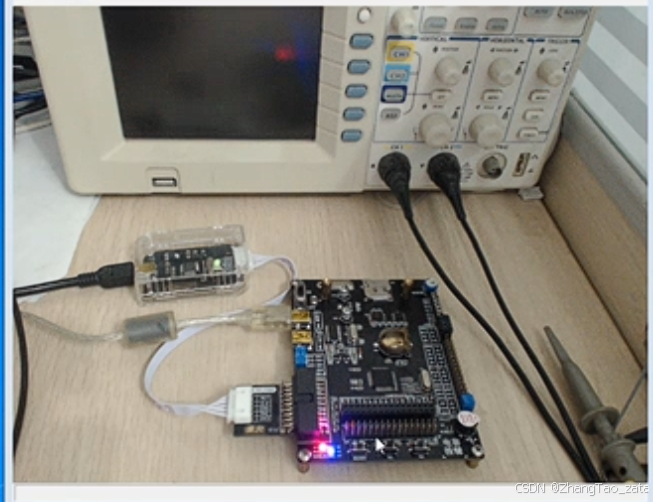

***使用keil打开测试固件的程序***

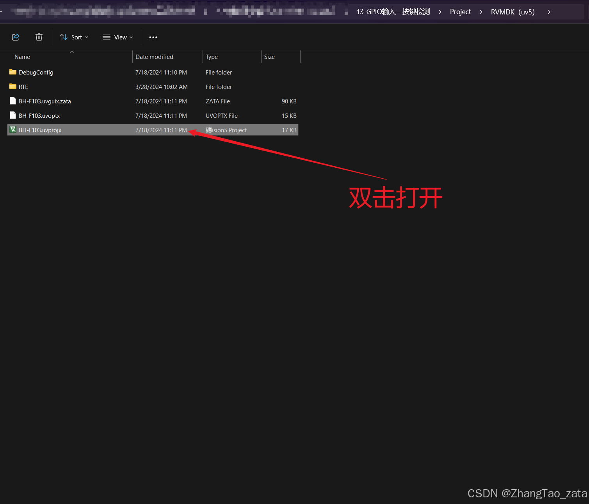

***下载程序到开发板，一会进度条加载完就下载好了***

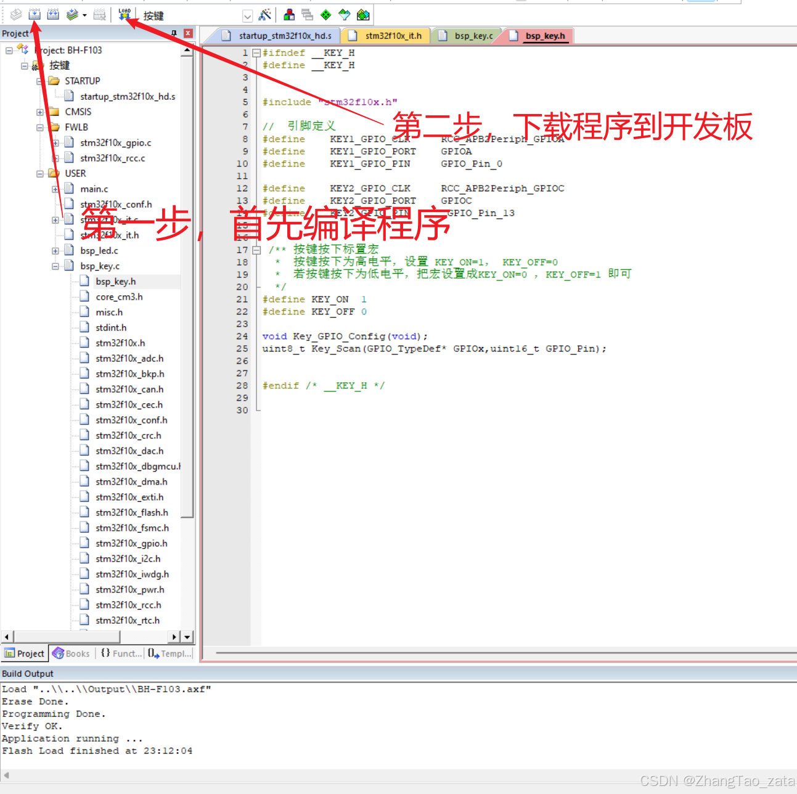

***点击下图的第二个按钮就可以切换灯了***

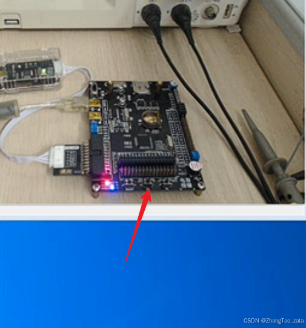

## 7-（第一节） 新建工程模板-寄存器版
1. 新建项目-并选择芯片
2. 导入启动文件  XX.s
3. 创建main.c文件
4. 创建stm32f10x.h 固件库
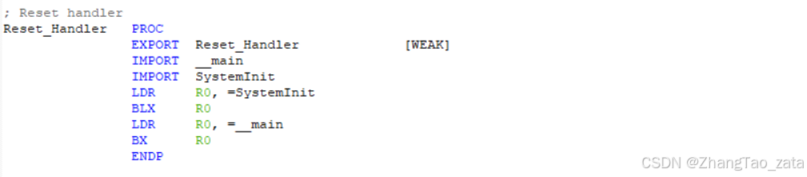
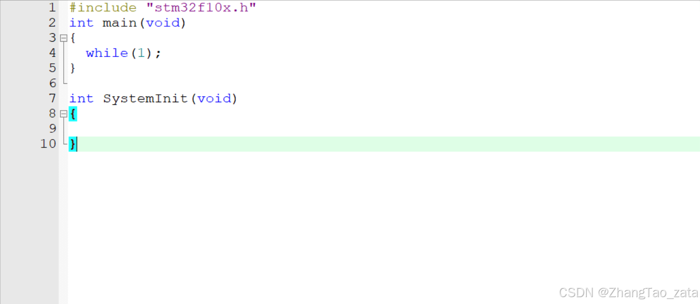

5.连接DAP设置
<table>
    <tr>
        <td >
        	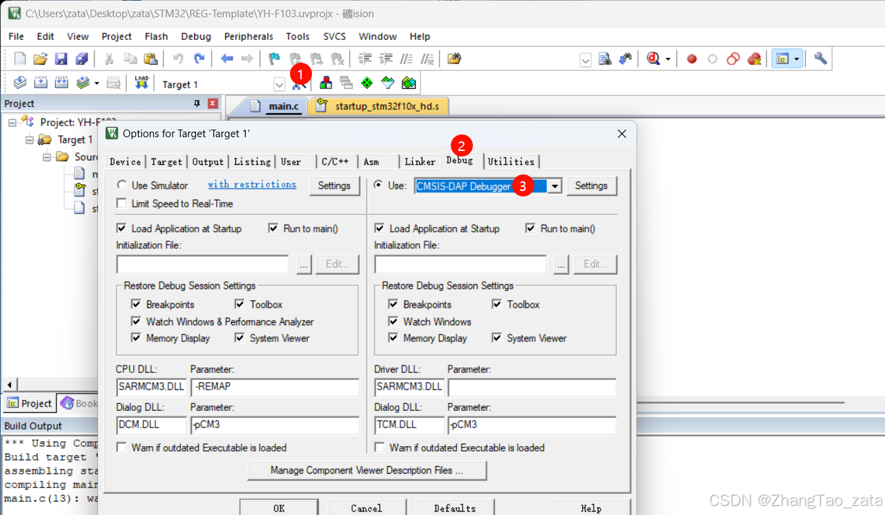图1 
        </td>
        <td >
       		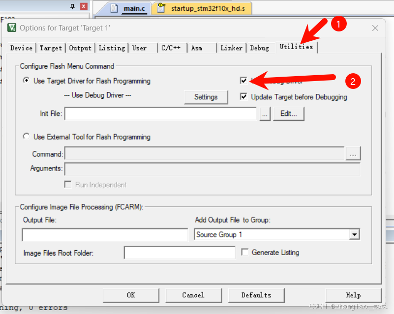图2 
       	</td>
    </tr>
<tr>
        <td >
       		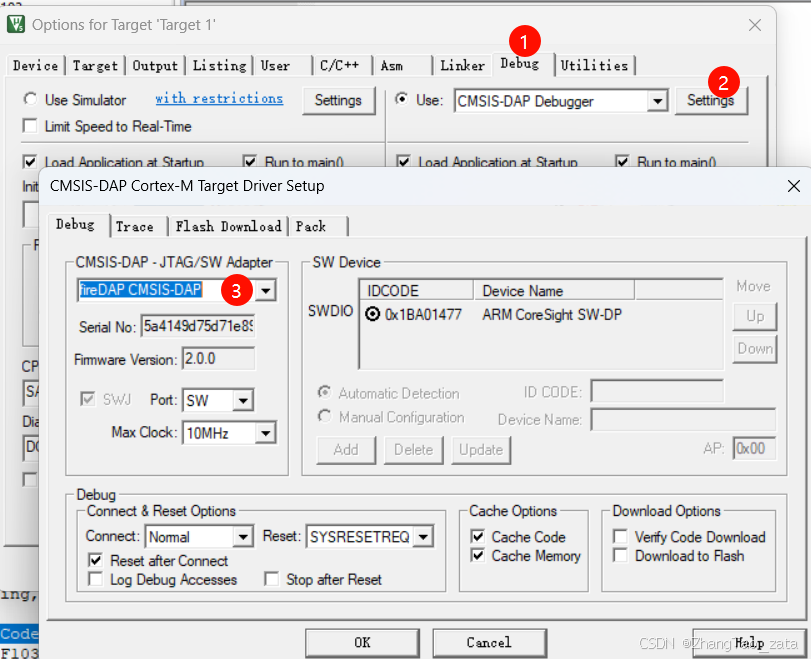图3
       	</td>
        <td >
        	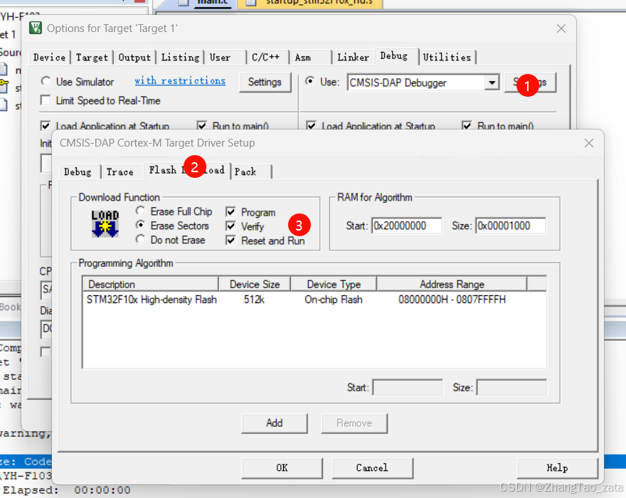图4
        </td>
</tr>
<tr>
        <td >
       		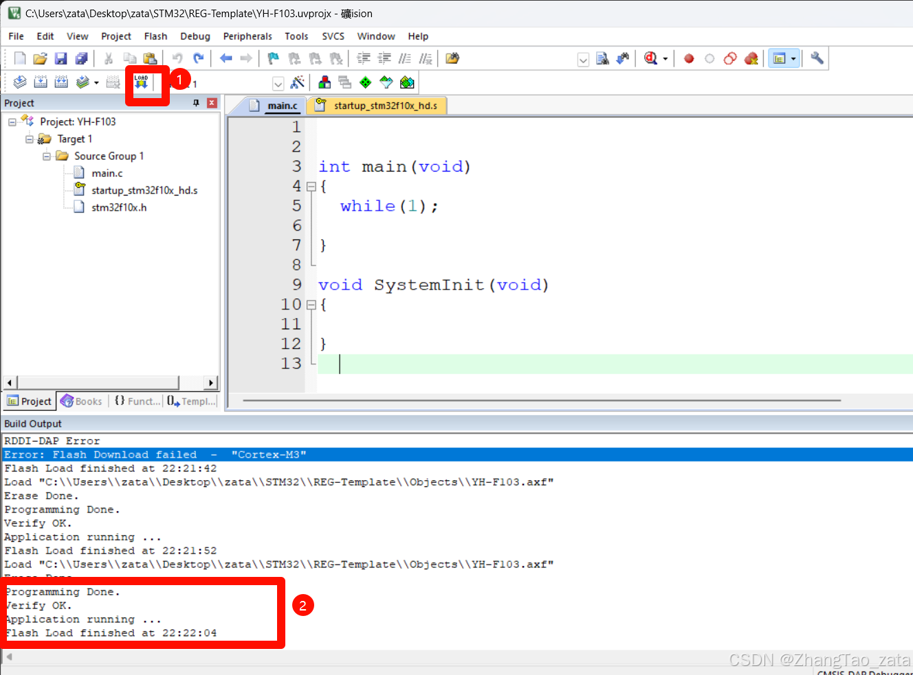图5
       	</td>
        <td >
       		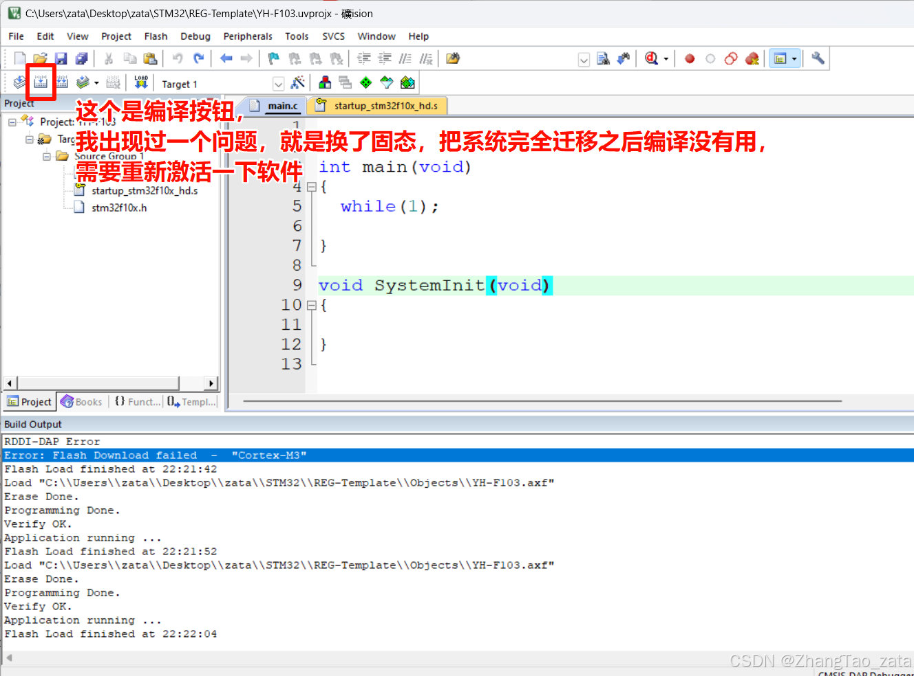图6
       	</td>
</tr>
</table>

## 7-（第二节）使用寄存器点亮LED
本节课代码如下，为什么和老师代码不一样？因为我觉得老师教错了，在CRL这里
```c
#include "stm32f10x.h"
int main(void)
{
	// RCC
	*(unsigned int *)0X40021018 |= (1<<4);
		
	//ODR
	*(unsigned int *)0X4001100C &= ~(1<<2);
	
	//CRL
	*(unsigned int *)0X40011000 |= (1<<8);
	*(unsigned int *)0X40011000 &= ~(1<<10); //这里我和老师不一样，不过效果是一样的，后续代码我就按照老师的来了
}

int SystemInit(void)
{
}
```

1. 找到寄存器的地址 （寄存器的GPIO的起始地址 + 偏移地址），因为是MINI开发板子上的端口PC2对应的是C，所以找CPIOC
2. 配置ODR寄存器，其中可以用ODR中的第四位控制灯泡，具体咱回事我没太弄懂
3. CRL寄存器，这个是控制输入还是输出，以及用什么模式的，设置为“推挽输出”，又因为第一步对应PC2，对应的是‘2’
5. 打开时钟CRC寄存器（APB2外设时钟使能寄存器：为什么是APB2，因为GPIO在APB2总线上），如果要读取外设就必须要打开。


1.   (unsigned int *)0X4001100C是什么意思？

> 这是将内存地址 0X4001100C 转换为指向 unsigned int 类型的指针。
> 指针类型是为了：
> 
> 1. 告诉编译器如何解释内存中的数据。比如 unsigned int* 指针解引用时，会把那个地址的4个字节当作无符号整数来读取
> 
> 2. 指针运算时确定步长。unsigned int* 加1会前进4个字节，而 char* 加1只前进1个字节
> 

2. 为什么指针也有类型？

> 指针类型是为了：
> 
> 告诉编译器如何解释内存中的数据。比如 unsigned int* 指针解引用时，会把那个地址的4个字节当作无符号整数来读取
> 指针运算时确定步长。unsigned int* 加1会前进4个字节，而 char* 加1只前进1个字节 一般我们这样定义

```c
unsigned int* p1 = (unsigned int*)0x1000;
p1 + 1;  // 0x1004
char* p2 = (char*)0x1000; 
p2 + 1;  // 0x1001
```
3.  *(unsigned int *)0X4001100C什么意思?

> `*(unsigned int *)0X4001100C` 对内存地址 0X4001100C
> 进行解引用(*),获取该地址存储的无符号整数值。

举例:
```c
// 读取该地址的值
unsigned int value = *(unsigned int *)0X4001100C;

// 写入值到该地址
*(unsigned int *)0X4001100C = 0x1;
```


这种操作常用于直接读写硬件寄存器。

4. 为什么要这么麻烦，直接*0X4001100C行不行

> 不行,因为 0X4001100C 是一个数值常量,直接用*解引用会出错。需要先把它转换成指针类型((unsigned int *)),才能进行解引用操作。
> 
> 这是C语言的语法规则要求 - 解引用操作必须作用于指针类型。


5. *(unsigned int *)0X4001100C &= ~(1<<2) 的含义：

> 0X4001100C 是内存地址，要加(unsigned int *)转成指针才能解引用 
> 1<<2 产生二进制...0100 ~
> 取反得到...1011   &= 进行AND操作，会把对应地址值的第2位清零，因为0和任何值做AND都得0
> 其他位保持不变，因为1和原值做AND保持原值

6. &= ~ 和 |= 的作用

> 正如第五问所问：
> &= ~ 用来清零
>  |= 用来写1
>  `当然操作过程要用到位运算 （1<<XXX）` 

7. 这节课的视频里面，老师为什么说4位为一组？

> STM32寄存器中4位一组是因为：
> 1. 每4位可以表示一个16进制数(0-F)
> 2. 容易读写和分组管理
> 3. 符合很多外设配置的需求（如GPIO的4位可以配置一个引脚的模式）
> 
> 例如一个32位寄存器可以分为8组，每组4位，方便配置和管理不同功能。
> 那么很显然，如果你在C语言里面用2进制表示的话，实际上也是可以的，不过就是麻烦点


## 8-使用寄存器点亮LED
第8课包含两节：
第一节说功能框图（具体内容可以看STM32F10X-中文参考这本电子书）
第二节把第7课中的地址通过定义一个常量做映射

没有什么太有争议或者难以理解的内容

## 9-1自己写库（第一节）-GPIO寄存器结构体定义
代码如下

```c
//stm32f10x.h
#define  PERIPH_BASE               ((unsigned int)0x40000000)
#define  APB1PERIPH_BASE           PERIPH_BASE
#define  APB2PERIPH_BASE          (PERIPH_BASE + 0x10000)
#define  AHBPERIPH_BASE           (PERIPH_BASE + 0x20000)


#define  RCC_BASE                (AHBPERIPH_BASE + 0x1000)
#define  GPIOC_BASE              (APB2PERIPH_BASE + 0x1000)


#define  RCC_APB2ENR            *(unsigned int*)(RCC_BASE + 0x18)
	

typedef unsigned int      uint32_t;
typedef unsigned short    uint16_t;

typedef struct
{
	uint32_t CRL;
	uint32_t CRH;
	uint32_t IDR;
	uint32_t ODR;
	uint32_t BSRR;
	uint32_t BRR;
	uint32_t LCKR;
}GPIO_TypeDef;


#define GPIOC   ((GPIO_TypeDef*)GPIOC_BASE)


```
这是定义了一个名为GPIO_TypeDef的结构体，用于映射GPIO外设的寄存器布局：

	```c
	typedef struct {
	    uint32_t CRL;    // 端口配置低寄存器 (0x00)
	    uint32_t CRH;    // 端口配置高寄存器 (0x04)
	    uint32_t IDR;    // 端口输入数据寄存器 (0x08)
	    uint32_t ODR;    // 端口输出数据寄存器 (0x0C)
	    uint32_t BSRR;   // 端口位设置/清除寄存器 (0x10)
	    uint32_t BRR;    // 端口位清除寄存器 (0x14)
	    uint32_t LCKR;   // 端口配置锁定寄存器 (0x18)
	} GPIO_TypeDef;
	```

结构体成员的排列顺序与寄存器在内存中的实际布局一致。这样通过结构体指针就可以直接访问这些寄存器

这基于C语言结构体在内存中的存储原理：

1. 连续性：结构体成员在内存中按声明顺序连续存储

2. 对齐：每个成员按其类型的对齐要求存储。这里uint32_t通常4字节对齐，刚好对应寄存器间隔：
	```c
	CRL  - 0x00
	CRH  - 0x04  
	IDR  - 0x08
	ODR  - 0x0C
	```

3. 指针访问：当把GPIOC_BASE转为GPIO_TypeDef指针时，编译器会根据结构体布局自动计算每个成员的偏移量，从而访问到对应寄存器

	这样就实现了通过结构体直接操作物理寄存器。

	```c
	GPIO_TypeDef* GPIOC = (GPIO_TypeDef*)GPIOC_BASE;
	GPIOC->ODR = ...;  // 访问ODR寄存器
	```

```c
//main,c
#include "stm32f10x.h"

int main (void)
{

		// 打开时钟
	RCC_APB2ENR  |=  ( (1) << 4 );
	
	// 配置IO口为输出
	GPIOC->CRL |=  ( (1) << (4*2) );
	
	// 控制ODR寄存器
	GPIOC->ODR &= ~(1<<2);
	//GPIOC->ODR |= (1<<2);
}


void SystemInit(void)
{
	//函数体为空为了骗过编译器
}

```

## 9-2编写GPIO端口置位复位函数
`先贴代码:`
	
main.c
```c
#include "stm32f10x.h"
#include "stm32f10x_gpio.h"

void soft_delay( unsigned int count)
{
	for(;count !=0 ;count--);
}

int main (void)
{
	// 打开 GPIOC 端口的时钟
	RCC->APB2ENR  |=  ( (1) << 4 );
	
	// 配置IO口为输出
	//GPIOC->CRL &=  ~( (10000) << (4*2) );
	GPIOC->CRL |=  ( (1) << (4*2) );

	// 配置ODR寄存器
	//GPIOC->ODR &= ~(1<<2);
	GPIO_SetBits(GPIOC,(1<<2));
	while(1)
	{
		//GPIOC->ODR |= (1<<2);
		GPIO_ResetBits(GPIOC,(1<<2));
		soft_delay(1000000); // 这里用10进制表示的
		
		//GPIOC->ODR &= ~(1<<2);
		GPIO_SetBits(GPIOC,(1<<2));
		soft_delay(1000000); 
	}
}
void SystemInit(void)
{
	// 函数体为空，目的是为了骗过编译器不报错
}
```

stm32f10x.h
```c
#ifndef __STM32F10X_H
#define __STM32F10X_H

#define  PERIPH_BASE               ((unsigned int)0x40000000)
#define  APB1PERIPH_BASE           PERIPH_BASE
#define  APB2PERIPH_BASE          (PERIPH_BASE + 0x10000)
#define  AHBPERIPH_BASE           (PERIPH_BASE + 0x20000)

#define  RCC_BASE                (AHBPERIPH_BASE + 0x1000)
#define  GPIOC_BASE              (APB2PERIPH_BASE + 0x1000)

#define  RCC_APB2ENR            *(unsigned int*)(RCC_BASE + 0x18)
	
typedef unsigned int      uint32_t;
typedef unsigned short    uint16_t;

typedef struct
{
	uint32_t CRL;
	uint32_t CRH;
	uint32_t IDR;
	uint32_t ODR;
	uint32_t BSRR;
	uint32_t BRR;
	uint32_t LCKR;
}GPIO_TypeDef;

typedef struct
{
	uint32_t CR;
	uint32_t CFGR;
	uint32_t CIR;
	uint32_t APB2RSTR;
	uint32_t APB1RSTR;
	uint32_t AHBENR;
	uint32_t APB2ENR;
	uint32_t APB1ENR;
	uint32_t BDCR;
	uint32_t CSR;
}RCC_TypeDef;

#define GPIOC   ((GPIO_TypeDef*)GPIOC_BASE)
#define RCC     ((RCC_TypeDef*)RCC_BASE)

#endif /* __STM32F10X_H */
```

stm32f10x_gpio.h

```c
#ifndef __STM32F10X_GPIO_H
#define __STM32F10X_GPIO_H

#include "stm32f10x.h"

void GPIO_SetBits(GPIO_TypeDef *GPIOx,uint16_t GPIO_Pin);
void GPIO_ResetBits( GPIO_TypeDef *GPIOx,uint16_t GPIO_Pin );

#endif /* __STM32F10X_GPIO_H */
```
stm32f10x_gpio.c
```c
#include "stm32f10x_gpio.h"

/**
* 函数功能：设置引脚为高电平
* 参数说明：GPIOx: 该参数为 GPIO_TypeDef 类型的指针，指向 GPIO 端口的地址
* GPIO_Pin: 选择要设置的 GPIO 端口引脚，可输入宏 GPIO_Pin_0-15，
* 表示 GPIOx 端口的 0-15 号引脚。
*/
void GPIO_SetBits(GPIO_TypeDef *GPIOx,uint16_t GPIO_Pin)
{
	
	/* 设置 GPIOx 端口 BSRR 寄存器的第 GPIO_Pin 位，使其输出高电平 */
  /* 因为 BSRR 寄存器写 0 不影响，宏 GPIO_Pin 只是对应位为 1，其它位均为 0，所以可以直接赋值 */
	
	GPIOx->BSRR |= GPIO_Pin;
}

/**
* 函数功能：设置引脚为低电平
* 参数说明：GPIOx: 该参数为 GPIO_TypeDef 类型的指针，指向 GPIO 端口的地址
* GPIO_Pin: 选择要设置的 GPIO 端口引脚，可输入宏 GPIO_Pin_0-15，
* 表示 GPIOx 端口的 0-15 号引脚。
*/
void GPIO_ResetBits( GPIO_TypeDef *GPIOx,uint16_t GPIO_Pin )
{
	
	/* 设置 GPIOx 端口 BRR 寄存器的第 GPIO_Pin 位, 使其输出低电平 */
  /* 因为 BRR 寄存器写 0 不影响，宏 GPIO_Pin 只是对应位为 1，其它位均为 0，所以可以直接赋值 */
	
	GPIOx->BRR |= GPIO_Pin;
}
```

 **1. 为什么没有引入stm32f10x_gpio.c，也能正常调用其中的函数**

> 
> 这个问题涉及到C语言编译和链接的概念。让我来详细解释：
> 
> 1. 在这个项目中，虽然代码中没有直接 `#include "stm32f10x_gpio.c"`，但程序仍然能够正常工作，原因是：
> 
>    - `main.c` 引入了 `stm32f10x_gpio.h` 头文件，该头文件声明了 `GPIO_SetBits` 和 `GPIO_ResetBits` 这两个函数
>    - `stm32f10x_gpio.c` 源文件包含了这两个函数的实际实现
>    - 在项目编译时，编译器会分别编译 `main.c` 和 `stm32f10x_gpio.c`，然后链接器会将它们链接在一起
> 
> 2. 实际上，直接引入 `.c` 文件通常是不推荐的做法：
>    - 头文件(`.h`)用于声明函数接口
>    - 源文件(`.c`)用于实现具体功能
>    - 编译器会分别编译各个源文件，然后链接器将它们组合成最终的可执行文件
> 
> 3. 编译过程是这样的： 
> 
>         		main.c ────┐   			        
>                 		   ├── 编译 --> 链接 --> 可执行文件   
>         stm32f10x_gpio.c ─┘   
>      
> 4. 如果你直接 `#include "stm32f10x_gpio.c"`，可能会导致：
>    - 函数重复定义错误（如果该.c文件在多个地方被引入）
>    - 编译时间增加
>    - 代码组织混乱
> 
> 所以正确的做法就是你现在的方式：
> - 在头文件中声明函数
> - 在源文件中实现函数
> - 在项目配置中将所有需要的源文件加入编译
> 
> 这样可以保持代码的模块化和可维护性，同时避免潜在的编译错误。

**2. 头文件防重**

>  代码
>  	
>  
> 		 #ifndef __STM32F10X_GPIO_H
> 		 #define __STM32F10X_GPIO_H // 头文件内容
>		 #endif
>这种方式称为"Include Guard"或"Header Guard"
  防止头文件被重复包含导致的重复定义问题
 有些编译器也支持 #pragma once，效果类似


**3. 声明和定义的区别**

> // 声明 - 告诉编译器函数的存在 void func(int x);  
> // 定义 - 提供函数的具体实现 void func(int x) {}

**4. 条件编译：**

> ```c
> #ifdef DEBUG
>     // 调试代码
> #else
>     // 发布代码
> #endif
> 
> #if defined(PLATFORM_A)
>     // 平台A的代码
> #elif defined(PLATFORM_B)
>     // 平台B的代码
> #endif 

## 9-3 自己写库，构建库函数雏形
`代码如下`
以下是文件夹的结构和内容：

目录结构：
  📄 main.c
  📄 startup_stm32f10x_hd.s   // 启动文件
  📄 stm32f10x.h
  📄 stm32f10x_gpio.c
  📄 stm32f10x_gpio.h


文件 'main.c'：
```
#include "stm32f10x.h"
#include "stm32f10x_gpio.h"

#define   LED_G_GPIO_PORT                   GPIOC
#define   LED_G_GPIO_CLK_ENABLE            (RCC->APB2ENR  |=  ( (1) << 4 ))
#define   LED_G_GPIO_PIN                    GPIO_Pin_2

void Delay(uint32_t count)
{
	for( ; count !=0; count-- );
}

int main (void)
{
	GPIO_InitTypeDef  GPIO_InitStructure;
	
	// 打开 GPIOC 端口的时钟
	LED_G_GPIO_CLK_ENABLE;
	
	GPIO_InitStructure.GPIO_Pin = LED_G_GPIO_PIN;
	GPIO_InitStructure.GPIO_Mode = GPIO_Mode_Out_PP;
	GPIO_InitStructure.GPIO_Speed = GPIO_Speed_50MHz;
	GPIO_Init(LED_G_GPIO_PORT, &GPIO_InitStructure);	

  while(1)
  {
		GPIO_SetBits(LED_G_GPIO_PORT,LED_G_GPIO_PIN);
		Delay(0xFFFF);
		GPIO_ResetBits(LED_G_GPIO_PORT,LED_G_GPIO_PIN);
		Delay(0xFFFF);
	}

}

void SystemInit(void)
{
	// 函数体为空，目的是为了骗过编译器不报错
}
```


文件 'stm32f10x.h'：
```
#ifndef __STM32F10X_H
#define __STM32F10X_H

// 用来存放STM32寄存器映射的代码

// 外设  perirhral

#define  PERIPH_BASE               ((unsigned int)0x40000000)
#define  APB1PERIPH_BASE           PERIPH_BASE
#define  APB2PERIPH_BASE          (PERIPH_BASE + 0x10000)
#define  AHBPERIPH_BASE           (PERIPH_BASE + 0x20000)


#define  RCC_BASE                (AHBPERIPH_BASE + 0x1000)
#define  GPIOC_BASE              (APB2PERIPH_BASE + 0x1000)


#define  RCC_APB2ENR            *(unsigned int*)(RCC_BASE + 0x18)
	
#define  GPIOC_CRL              *(unsigned int*)(GPIOC_BASE + 0x00)
#define  GPIOC_CRH              *(unsigned int*)(GPIOC_BASE + 0x04)
#define  GPIOC_IDR              *(unsigned int*)(GPIOC_BASE + 0x08)
#define  GPIOC_ODR              *(unsigned int*)(GPIOC_BASE + 0x0C)
#define  GPIOC_BSRR             *(unsigned int*)(GPIOC_BASE + 0x10)
#define  GPIOC_BRR              *(unsigned int*)(GPIOC_BASE + 0x14)
#define  GPIOC_LCKR             *(unsigned int*)(GPIOC_BASE + 0x18)
	
typedef unsigned int      uint32_t;
typedef unsigned short    uint16_t;

typedef struct
{
	uint32_t CRL;
	uint32_t CRH;
	uint32_t IDR;
	uint32_t ODR;
	uint32_t BSRR;
	uint32_t BRR;
	uint32_t LCKR;
}GPIO_TypeDef;


typedef struct
{
	uint32_t CR;
	uint32_t CFGR;
	uint32_t CIR;
	uint32_t APB2RSTR;
	uint32_t APB1RSTR;
	uint32_t AHBENR;
	uint32_t APB2ENR;
	uint32_t APB1ENR;
	uint32_t BDCR;
	uint32_t CSR;
}RCC_TypeDef;


#define GPIOC   ((GPIO_TypeDef*)GPIOC_BASE)
#define RCC     ((RCC_TypeDef*)RCC_BASE)

#endif /* __STM32F10X_H */
```

文件 'stm32f10x_gpio.c'：
```
#include "stm32f10x_gpio.h"

/**
* 函数功能：设置引脚为高电平
* 参数说明：GPIOx: 该参数为 GPIO_TypeDef 类型的指针，指向 GPIO 端口的地址
* GPIO_Pin: 选择要设置的 GPIO 端口引脚，可输入宏 GPIO_Pin_0-15，
* 表示 GPIOx 端口的 0-15 号引脚。
*/
void GPIO_SetBits(GPIO_TypeDef *GPIOx,uint16_t GPIO_Pin)
{
	
	/* 设置 GPIOx 端口 BSRR 寄存器的第 GPIO_Pin 位，使其输出高电平 */
  /* 因为 BSRR 寄存器写 0 不影响，宏 GPIO_Pin 只是对应位为 1，其它位均为 0，所以可以直接赋值 */
	
	GPIOx->BSRR |= GPIO_Pin;
}


/**
* 函数功能：设置引脚为低电平
* 参数说明：GPIOx: 该参数为 GPIO_TypeDef 类型的指针，指向 GPIO 端口的地址
* GPIO_Pin: 选择要设置的 GPIO 端口引脚，可输入宏 GPIO_Pin_0-15，
* 表示 GPIOx 端口的 0-15 号引脚。
*/
void GPIO_ResetBits( GPIO_TypeDef *GPIOx,uint16_t GPIO_Pin )
{
	
	/* 设置 GPIOx 端口 BRR 寄存器的第 GPIO_Pin 位, 使其输出低电平 */
  /* 因为 BRR 寄存器写 0 不影响，宏 GPIO_Pin 只是对应位为 1，其它位均为 0，所以可以直接赋值 */
	
	GPIOx->BRR |= GPIO_Pin;
}


/**
* 函数功能：初始化引脚模式
* 参数说明：GPIOx，该参数为 GPIO_TypeDef 类型的指针，指向 GPIO 端口的地址
* GPIO_InitTypeDef:GPIO_InitTypeDef 结构体指针，指向初始化变量
*/
void GPIO_Init(GPIO_TypeDef* GPIOx, GPIO_InitTypeDef* GPIO_InitStruct)
{
  uint32_t currentmode = 0x00, currentpin = 0x00, pinpos = 0x00, pos = 0x00;
  uint32_t tmpreg = 0x00, pinmask = 0x00;
  
/*---------------------- GPIO 模式配置 --------------------------*/
  // 把输入参数GPIO_Mode的低四位暂存在currentmode
  currentmode = ((uint32_t)GPIO_InitStruct->GPIO_Mode) & ((uint32_t)0x0F);
	
  // bit4是1表示输出，bit4是0则是输入 
  // 判断bit4是1还是0，即首选判断是输入还是输出模式
  if ((((uint32_t)GPIO_InitStruct->GPIO_Mode) & ((uint32_t)0x10)) != 0x00)
  { 
	// 输出模式则要设置输出速度
    currentmode |= (uint32_t)GPIO_InitStruct->GPIO_Speed;
  }
/*-------------GPIO CRL 寄存器配置 CRL寄存器控制着低8位IO- -------*/
  // 配置端口低8位，即Pin0~Pin7
  if (((uint32_t)GPIO_InitStruct->GPIO_Pin & ((uint32_t)0x00FF)) != 0x00)
  {
	// 先备份CRL寄存器的值
    tmpreg = GPIOx->CRL;
		
	// 循环，从Pin0开始配对，找出具体的Pin
    for (pinpos = 0x00; pinpos < 0x08; pinpos++)
    {
	 // pos的值为1左移pinpos位
      pos = ((uint32_t)0x01) << pinpos;
      
	  // 令pos与输入参数GPIO_PIN作位与运算，为下面的判断作准备
      currentpin = (GPIO_InitStruct->GPIO_Pin) & pos;
			
	  //若currentpin=pos,则找到使用的引脚
      if (currentpin == pos)
      {
		// pinpos的值左移两位（乘以4），因为寄存器中4个寄存器位配置一个引脚
        pos = pinpos << 2;
       //把控制这个引脚的4个寄存器位清零，其它寄存器位不变
        pinmask = ((uint32_t)0x0F) << pos;
        tmpreg &= ~pinmask;
				
        // 向寄存器写入将要配置的引脚的模式
        tmpreg |= (currentmode << pos);  
				
		// 判断是否为下拉输入模式
        if (GPIO_InitStruct->GPIO_Mode == GPIO_Mode_IPD)
        {
		  // 下拉输入模式，引脚默认置0，对BRR寄存器写1可对引脚置0
          GPIOx->BRR = (((uint32_t)0x01) << pinpos);
        }				
        else
        {
          // 判断是否为上拉输入模式
          if (GPIO_InitStruct->GPIO_Mode == GPIO_Mode_IPU)
          {
		    // 上拉输入模式，引脚默认值为1，对BSRR寄存器写1可对引脚置1
            GPIOx->BSRR = (((uint32_t)0x01) << pinpos);
          }
        }
      }
    }
		// 把前面处理后的暂存值写入到CRL寄存器之中
    GPIOx->CRL = tmpreg;
  }
/*-------------GPIO CRH 寄存器配置 CRH寄存器控制着高8位IO- -----------*/
  // 配置端口高8位，即Pin8~Pin15
  if (GPIO_InitStruct->GPIO_Pin > 0x00FF)
  {
		// // 先备份CRH寄存器的值
    tmpreg = GPIOx->CRH;
		
	// 循环，从Pin8开始配对，找出具体的Pin
    for (pinpos = 0x00; pinpos < 0x08; pinpos++)
    {
      pos = (((uint32_t)0x01) << (pinpos + 0x08));
			
      // pos与输入参数GPIO_PIN作位与运算
      currentpin = ((GPIO_InitStruct->GPIO_Pin) & pos);
			
	 //若currentpin=pos,则找到使用的引脚
      if (currentpin == pos)
      {
		//pinpos的值左移两位（乘以4），因为寄存器中4个寄存器位配置一个引脚
        pos = pinpos << 2;
        
	    //把控制这个引脚的4个寄存器位清零，其它寄存器位不变
        pinmask = ((uint32_t)0x0F) << pos;
        tmpreg &= ~pinmask;
				
        // 向寄存器写入将要配置的引脚的模式
        tmpreg |= (currentmode << pos);
        
		// 判断是否为下拉输入模式
        if (GPIO_InitStruct->GPIO_Mode == GPIO_Mode_IPD)
        {
		  // 下拉输入模式，引脚默认置0，对BRR寄存器写1可对引脚置0
          GPIOx->BRR = (((uint32_t)0x01) << (pinpos + 0x08));
        }
         // 判断是否为上拉输入模式
        if (GPIO_InitStruct->GPIO_Mode == GPIO_Mode_IPU)
        {
		  // 上拉输入模式，引脚默认值为1，对BSRR寄存器写1可对引脚置1
          GPIOx->BSRR = (((uint32_t)0x01) << (pinpos + 0x08));
        }
      }
    }
	// 把前面处理后的暂存值写入到CRH寄存器之中
    GPIOx->CRH = tmpreg;
  }
}


```

文件 'stm32f10x_gpio.h'：
```
#ifndef __STM32F10X_GPIO_H
#define __STM32F10X_GPIO_H

#include "stm32f10x.h"

#define GPIO_Pin_0    ((uint16_t)0x0001)  /*!< 选择Pin0 */    //(00000000 00000001)b
#define GPIO_Pin_1    ((uint16_t)0x0002)  /*!< 选择Pin1 */    //(00000000 00000010)b
#define GPIO_Pin_2    ((uint16_t)0x0004)  /*!< 选择Pin2 */    //(00000000 00000100)b
#define GPIO_Pin_3    ((uint16_t)0x0008)  /*!< 选择Pin3 */    //(00000000 00001000)b
#define GPIO_Pin_4    ((uint16_t)0x0010)  /*!< 选择Pin4 */    //(00000000 00010000)b
#define GPIO_Pin_5    ((uint16_t)0x0020)  /*!< 选择Pin5 */    //(00000000 00100000)b
#define GPIO_Pin_6    ((uint16_t)0x0040)  /*!< 选择Pin6 */    //(00000000 01000000)b
#define GPIO_Pin_7    ((uint16_t)0x0080)  /*!< 选择Pin7 */    //(00000000 10000000)b

#define GPIO_Pin_8    ((uint16_t)0x0100)  /*!< 选择Pin8 */    //(00000001 00000000)b
#define GPIO_Pin_9    ((uint16_t)0x0200)  /*!< 选择Pin9 */    //(00000010 00000000)b
#define GPIO_Pin_10   ((uint16_t)0x0400)  /*!< 选择Pin10 */   //(00000100 00000000)b
#define GPIO_Pin_11   ((uint16_t)0x0800)  /*!< 选择Pin11 */   //(00001000 00000000)b
#define GPIO_Pin_12   ((uint16_t)0x1000)  /*!< 选择Pin12 */   //(00010000 00000000)b
#define GPIO_Pin_13   ((uint16_t)0x2000)  /*!< 选择Pin13 */   //(00100000 00000000)b
#define GPIO_Pin_14   ((uint16_t)0x4000)  /*!< 选择Pin14 */   //(01000000 00000000)b
#define GPIO_Pin_15   ((uint16_t)0x8000)  /*!< 选择Pin15 */   //(10000000 00000000)b
#define GPIO_Pin_All  ((uint16_t)0xFFFF)  /*!< 选择全部引脚*/ //(11111111 11111111)b


typedef enum
{ 
  GPIO_Speed_10MHz = 1,         // 10MHZ        (01)b
  GPIO_Speed_2MHz,              // 2MHZ         (10)b
  GPIO_Speed_50MHz              // 50MHZ        (11)b
}GPIOSpeed_TypeDef;

typedef enum
{ GPIO_Mode_AIN = 0x0,           // 模拟输入     (0000 0000)b
  GPIO_Mode_IN_FLOATING = 0x04,  // 浮空输入     (0000 0100)b
  GPIO_Mode_IPD = 0x28,          // 下拉输入     (0010 1000)b
  GPIO_Mode_IPU = 0x48,          // 上拉输入     (0100 1000)b
  
  GPIO_Mode_Out_OD = 0x14,       // 开漏输出     (0001 0100)b
  GPIO_Mode_Out_PP = 0x10,       // 推挽输出     (0001 0000)b
  GPIO_Mode_AF_OD = 0x1C,        // 复用开漏输出 (0001 1100)b
  GPIO_Mode_AF_PP = 0x18         // 复用推挽输出 (0001 1000)b
}GPIOMode_TypeDef;

typedef struct
{
	uint16_t GPIO_Pin;
	uint16_t GPIO_Speed;
	uint16_t GPIO_Mode;
}GPIO_InitTypeDef;

void GPIO_SetBits(GPIO_TypeDef *GPIOx,uint16_t GPIO_Pin);
void GPIO_ResetBits( GPIO_TypeDef *GPIOx,uint16_t GPIO_Pin );
void GPIO_Init(GPIO_TypeDef* GPIOx, GPIO_InitTypeDef* GPIO_InitStruct);

#endif /* __STM32F10X_GPIO_H */
```


文件 'startup_stm32f10x_hd.s'：
```
;******************** (C) COPYRIGHT 2011 STMicroelectronics ********************
;* File Name          : startup_stm32f10x_hd.s
;* Author             : MCD Application Team
;* Version            : V3.5.0
;* Date               : 11-March-2011
;* Description        : STM32F10x High Density Devices vector table for MDK-ARM 
;*                      toolchain. 
;*                      This module performs:
;*                      - Set the initial SP
;*                      - Set the initial PC == Reset_Handler
;*                      - Set the vector table entries with the exceptions ISR address
;*                      - Configure the clock system and also configure the external 
;*                        SRAM mounted on STM3210E-EVAL board to be used as data 
;*                        memory (optional, to be enabled by user)
;*                      - Branches to __main in the C library (which eventually
;*                        calls main()).
;*                      After Reset the CortexM3 processor is in Thread mode,
;*                      priority is Privileged, and the Stack is set to Main.
;* <<< Use Configuration Wizard in Context Menu >>>   
;*******************************************************************************
; THE PRESENT FIRMWARE WHICH IS FOR GUIDANCE ONLY AIMS AT PROVIDING CUSTOMERS
; WITH CODING INFORMATION REGARDING THEIR PRODUCTS IN ORDER FOR THEM TO SAVE TIME.
; AS A RESULT, STMICROELECTRONICS SHALL NOT BE HELD LIABLE FOR ANY DIRECT,
; INDIRECT OR CONSEQUENTIAL DAMAGES WITH RESPECT TO ANY CLAIMS ARISING FROM THE
; CONTENT OF SUCH FIRMWARE AND/OR THE USE MADE BY CUSTOMERS OF THE CODING
; INFORMATION CONTAINED HEREIN IN CONNECTION WITH THEIR PRODUCTS.
;*******************************************************************************

; Amount of memory (in bytes) allocated for Stack
; Tailor this value to your application needs
; <h> Stack Configuration
;   <o> Stack Size (in Bytes) <0x0-0xFFFFFFFF:8>
; </h>

Stack_Size      EQU     0x00000400

                AREA    STACK, NOINIT, READWRITE, ALIGN=3
Stack_Mem       SPACE   Stack_Size
__initial_sp
                                                  
; <h> Heap Configuration
;   <o>  Heap Size (in Bytes) <0x0-0xFFFFFFFF:8>
; </h>

Heap_Size       EQU     0x00000200

                AREA    HEAP, NOINIT, READWRITE, ALIGN=3
__heap_base
Heap_Mem        SPACE   Heap_Size
__heap_limit

                PRESERVE8
                THUMB


; Vector Table Mapped to Address 0 at Reset
                AREA    RESET, DATA, READONLY
                EXPORT  __Vectors
                EXPORT  __Vectors_End
                EXPORT  __Vectors_Size

__Vectors       DCD     __initial_sp               ; Top of Stack
                DCD     Reset_Handler              ; Reset Handler
                DCD     NMI_Handler                ; NMI Handler
                DCD     HardFault_Handler          ; Hard Fault Handler
                DCD     MemManage_Handler          ; MPU Fault Handler
                DCD     BusFault_Handler           ; Bus Fault Handler
                DCD     UsageFault_Handler         ; Usage Fault Handler
                DCD     0                          ; Reserved
                DCD     0                          ; Reserved
                DCD     0                          ; Reserved
                DCD     0                          ; Reserved
                DCD     SVC_Handler                ; SVCall Handler
                DCD     DebugMon_Handler           ; Debug Monitor Handler
                DCD     0                          ; Reserved
                DCD     PendSV_Handler             ; PendSV Handler
                DCD     SysTick_Handler            ; SysTick Handler

                ; External Interrupts
                DCD     WWDG_IRQHandler            ; Window Watchdog
                DCD     PVD_IRQHandler             ; PVD through EXTI Line detect
                DCD     TAMPER_IRQHandler          ; Tamper
                DCD     RTC_IRQHandler             ; RTC
                DCD     FLASH_IRQHandler           ; Flash
                DCD     RCC_IRQHandler             ; RCC
                DCD     EXTI0_IRQHandler           ; EXTI Line 0
                DCD     EXTI1_IRQHandler           ; EXTI Line 1
                DCD     EXTI2_IRQHandler           ; EXTI Line 2
                DCD     EXTI3_IRQHandler           ; EXTI Line 3
                DCD     EXTI4_IRQHandler           ; EXTI Line 4
                DCD     DMA1_Channel1_IRQHandler   ; DMA1 Channel 1
                DCD     DMA1_Channel2_IRQHandler   ; DMA1 Channel 2
                DCD     DMA1_Channel3_IRQHandler   ; DMA1 Channel 3
                DCD     DMA1_Channel4_IRQHandler   ; DMA1 Channel 4
                DCD     DMA1_Channel5_IRQHandler   ; DMA1 Channel 5
                DCD     DMA1_Channel6_IRQHandler   ; DMA1 Channel 6
                DCD     DMA1_Channel7_IRQHandler   ; DMA1 Channel 7
                DCD     ADC1_2_IRQHandler          ; ADC1 & ADC2
                DCD     USB_HP_CAN1_TX_IRQHandler  ; USB High Priority or CAN1 TX
                DCD     USB_LP_CAN1_RX0_IRQHandler ; USB Low  Priority or CAN1 RX0
                DCD     CAN1_RX1_IRQHandler        ; CAN1 RX1
                DCD     CAN1_SCE_IRQHandler        ; CAN1 SCE
                DCD     EXTI9_5_IRQHandler         ; EXTI Line 9..5
                DCD     TIM1_BRK_IRQHandler        ; TIM1 Break
                DCD     TIM1_UP_IRQHandler         ; TIM1 Update
                DCD     TIM1_TRG_COM_IRQHandler    ; TIM1 Trigger and Commutation
                DCD     TIM1_CC_IRQHandler         ; TIM1 Capture Compare
                DCD     TIM2_IRQHandler            ; TIM2
                DCD     TIM3_IRQHandler            ; TIM3
                DCD     TIM4_IRQHandler            ; TIM4
                DCD     I2C1_EV_IRQHandler         ; I2C1 Event
                DCD     I2C1_ER_IRQHandler         ; I2C1 Error
                DCD     I2C2_EV_IRQHandler         ; I2C2 Event
                DCD     I2C2_ER_IRQHandler         ; I2C2 Error
                DCD     SPI1_IRQHandler            ; SPI1
                DCD     SPI2_IRQHandler            ; SPI2
                DCD     USART1_IRQHandler          ; USART1
                DCD     USART2_IRQHandler          ; USART2
                DCD     USART3_IRQHandler          ; USART3
                DCD     EXTI15_10_IRQHandler       ; EXTI Line 15..10
                DCD     RTCAlarm_IRQHandler        ; RTC Alarm through EXTI Line
                DCD     USBWakeUp_IRQHandler       ; USB Wakeup from suspend
                DCD     TIM8_BRK_IRQHandler        ; TIM8 Break
                DCD     TIM8_UP_IRQHandler         ; TIM8 Update
                DCD     TIM8_TRG_COM_IRQHandler    ; TIM8 Trigger and Commutation
                DCD     TIM8_CC_IRQHandler         ; TIM8 Capture Compare
                DCD     ADC3_IRQHandler            ; ADC3
                DCD     FSMC_IRQHandler            ; FSMC
                DCD     SDIO_IRQHandler            ; SDIO
                DCD     TIM5_IRQHandler            ; TIM5
                DCD     SPI3_IRQHandler            ; SPI3
                DCD     UART4_IRQHandler           ; UART4
                DCD     UART5_IRQHandler           ; UART5
                DCD     TIM6_IRQHandler            ; TIM6
                DCD     TIM7_IRQHandler            ; TIM7
                DCD     DMA2_Channel1_IRQHandler   ; DMA2 Channel1
                DCD     DMA2_Channel2_IRQHandler   ; DMA2 Channel2
                DCD     DMA2_Channel3_IRQHandler   ; DMA2 Channel3
                DCD     DMA2_Channel4_5_IRQHandler ; DMA2 Channel4 & Channel5
__Vectors_End

__Vectors_Size  EQU  __Vectors_End - __Vectors

                AREA    |.text|, CODE, READONLY
                
; Reset handler
Reset_Handler   PROC
                EXPORT  Reset_Handler             [WEAK]
                IMPORT  __main
                IMPORT  SystemInit
                LDR     R0, =SystemInit
                BLX     R0               
                LDR     R0, =__main
                BX      R0
                ENDP
                
; Dummy Exception Handlers (infinite loops which can be modified)

NMI_Handler     PROC
                EXPORT  NMI_Handler                [WEAK]
                B       .
                ENDP
HardFault_Handler\
                PROC
                EXPORT  HardFault_Handler          [WEAK]
                B       .
                ENDP
MemManage_Handler\
                PROC
                EXPORT  MemManage_Handler          [WEAK]
                B       .
                ENDP
BusFault_Handler\
                PROC
                EXPORT  BusFault_Handler           [WEAK]
                B       .
                ENDP
UsageFault_Handler\
                PROC
                EXPORT  UsageFault_Handler         [WEAK]
                B       .
                ENDP
SVC_Handler     PROC
                EXPORT  SVC_Handler                [WEAK]
                B       .
                ENDP
DebugMon_Handler\
                PROC
                EXPORT  DebugMon_Handler           [WEAK]
                B       .
                ENDP
PendSV_Handler  PROC
                EXPORT  PendSV_Handler             [WEAK]
                B       .
                ENDP
SysTick_Handler PROC
                EXPORT  SysTick_Handler            [WEAK]
                B       .
                ENDP

Default_Handler PROC

                EXPORT  WWDG_IRQHandler            [WEAK]
                EXPORT  PVD_IRQHandler             [WEAK]
                EXPORT  TAMPER_IRQHandler          [WEAK]
                EXPORT  RTC_IRQHandler             [WEAK]
                EXPORT  FLASH_IRQHandler           [WEAK]
                EXPORT  RCC_IRQHandler             [WEAK]
                EXPORT  EXTI0_IRQHandler           [WEAK]
                EXPORT  EXTI1_IRQHandler           [WEAK]
                EXPORT  EXTI2_IRQHandler           [WEAK]
                EXPORT  EXTI3_IRQHandler           [WEAK]
                EXPORT  EXTI4_IRQHandler           [WEAK]
                EXPORT  DMA1_Channel1_IRQHandler   [WEAK]
                EXPORT  DMA1_Channel2_IRQHandler   [WEAK]
                EXPORT  DMA1_Channel3_IRQHandler   [WEAK]
                EXPORT  DMA1_Channel4_IRQHandler   [WEAK]
                EXPORT  DMA1_Channel5_IRQHandler   [WEAK]
                EXPORT  DMA1_Channel6_IRQHandler   [WEAK]
                EXPORT  DMA1_Channel7_IRQHandler   [WEAK]
                EXPORT  ADC1_2_IRQHandler          [WEAK]
                EXPORT  USB_HP_CAN1_TX_IRQHandler  [WEAK]
                EXPORT  USB_LP_CAN1_RX0_IRQHandler [WEAK]
                EXPORT  CAN1_RX1_IRQHandler        [WEAK]
                EXPORT  CAN1_SCE_IRQHandler        [WEAK]
                EXPORT  EXTI9_5_IRQHandler         [WEAK]
                EXPORT  TIM1_BRK_IRQHandler        [WEAK]
                EXPORT  TIM1_UP_IRQHandler         [WEAK]
                EXPORT  TIM1_TRG_COM_IRQHandler    [WEAK]
                EXPORT  TIM1_CC_IRQHandler         [WEAK]
                EXPORT  TIM2_IRQHandler            [WEAK]
                EXPORT  TIM3_IRQHandler            [WEAK]
                EXPORT  TIM4_IRQHandler            [WEAK]
                EXPORT  I2C1_EV_IRQHandler         [WEAK]
                EXPORT  I2C1_ER_IRQHandler         [WEAK]
                EXPORT  I2C2_EV_IRQHandler         [WEAK]
                EXPORT  I2C2_ER_IRQHandler         [WEAK]
                EXPORT  SPI1_IRQHandler            [WEAK]
                EXPORT  SPI2_IRQHandler            [WEAK]
                EXPORT  USART1_IRQHandler          [WEAK]
                EXPORT  USART2_IRQHandler          [WEAK]
                EXPORT  USART3_IRQHandler          [WEAK]
                EXPORT  EXTI15_10_IRQHandler       [WEAK]
                EXPORT  RTCAlarm_IRQHandler        [WEAK]
                EXPORT  USBWakeUp_IRQHandler       [WEAK]
                EXPORT  TIM8_BRK_IRQHandler        [WEAK]
                EXPORT  TIM8_UP_IRQHandler         [WEAK]
                EXPORT  TIM8_TRG_COM_IRQHandler    [WEAK]
                EXPORT  TIM8_CC_IRQHandler         [WEAK]
                EXPORT  ADC3_IRQHandler            [WEAK]
                EXPORT  FSMC_IRQHandler            [WEAK]
                EXPORT  SDIO_IRQHandler            [WEAK]
                EXPORT  TIM5_IRQHandler            [WEAK]
                EXPORT  SPI3_IRQHandler            [WEAK]
                EXPORT  UART4_IRQHandler           [WEAK]
                EXPORT  UART5_IRQHandler           [WEAK]
                EXPORT  TIM6_IRQHandler            [WEAK]
                EXPORT  TIM7_IRQHandler            [WEAK]
                EXPORT  DMA2_Channel1_IRQHandler   [WEAK]
                EXPORT  DMA2_Channel2_IRQHandler   [WEAK]
                EXPORT  DMA2_Channel3_IRQHandler   [WEAK]
                EXPORT  DMA2_Channel4_5_IRQHandler [WEAK]

WWDG_IRQHandler
PVD_IRQHandler
TAMPER_IRQHandler
RTC_IRQHandler
FLASH_IRQHandler
RCC_IRQHandler
EXTI0_IRQHandler
EXTI1_IRQHandler
EXTI2_IRQHandler
EXTI3_IRQHandler
EXTI4_IRQHandler
DMA1_Channel1_IRQHandler
DMA1_Channel2_IRQHandler
DMA1_Channel3_IRQHandler
DMA1_Channel4_IRQHandler
DMA1_Channel5_IRQHandler
DMA1_Channel6_IRQHandler
DMA1_Channel7_IRQHandler
ADC1_2_IRQHandler
USB_HP_CAN1_TX_IRQHandler
USB_LP_CAN1_RX0_IRQHandler
CAN1_RX1_IRQHandler
CAN1_SCE_IRQHandler
EXTI9_5_IRQHandler
TIM1_BRK_IRQHandler
TIM1_UP_IRQHandler
TIM1_TRG_COM_IRQHandler
TIM1_CC_IRQHandler
TIM2_IRQHandler
TIM3_IRQHandler
TIM4_IRQHandler
I2C1_EV_IRQHandler
I2C1_ER_IRQHandler
I2C2_EV_IRQHandler
I2C2_ER_IRQHandler
SPI1_IRQHandler
SPI2_IRQHandler
USART1_IRQHandler
USART2_IRQHandler
USART3_IRQHandler
EXTI15_10_IRQHandler
RTCAlarm_IRQHandler
USBWakeUp_IRQHandler
TIM8_BRK_IRQHandler
TIM8_UP_IRQHandler
TIM8_TRG_COM_IRQHandler
TIM8_CC_IRQHandler
ADC3_IRQHandler
FSMC_IRQHandler
SDIO_IRQHandler
TIM5_IRQHandler
SPI3_IRQHandler
UART4_IRQHandler
UART5_IRQHandler
TIM6_IRQHandler
TIM7_IRQHandler
DMA2_Channel1_IRQHandler
DMA2_Channel2_IRQHandler
DMA2_Channel3_IRQHandler
DMA2_Channel4_5_IRQHandler
                B       .

                ENDP

                ALIGN

;*******************************************************************************
; User Stack and Heap initialization
;*******************************************************************************
                 IF      :DEF:__MICROLIB
                
                 EXPORT  __initial_sp
                 EXPORT  __heap_base
                 EXPORT  __heap_limit
                
                 ELSE
                
                 IMPORT  __use_two_region_memory
                 EXPORT  __user_initial_stackheap
                 
__user_initial_stackheap

                 LDR     R0, =  Heap_Mem
                 LDR     R1, =(Stack_Mem + Stack_Size)
                 LDR     R2, = (Heap_Mem +  Heap_Size)
                 LDR     R3, = Stack_Mem
                 BX      LR

                 ALIGN

                 ENDIF

                 END

;******************* (C) COPYRIGHT 2011 STMicroelectronics *****END OF FILE*****

```

**1. 代码解释**

> 1. main.c - 主程序文件 这是一个简单的LED闪烁程序： 配置GPIOC的Pin2作为LED控制引脚 在主循环中通过GPIO_SetBits和GPIO_ResetBits来控制LED的亮灭 使用Delay函数实现延时
> 2. startup_stm32f10x_hd.s - 启动文件 这是STM32的汇编启动文件，主要功能包括： 设置堆栈指针 配置中断向量表 初始化系统时钟 跳转到C语言main函数
> 3. stm32f10x.h - 寄存器定义文件 定义了STM32的硬件寄存器映射： 定义了外设基地址（PERIPH_BASE等） 定义了GPIO和RCC等外设的寄存器结构体 提供了访问这些寄存器的指针定义
> 4. stm32f10x_gpio.c/.h - GPIO驱动文件 提供GPIO操作的函数实现： GPIO_Init：初始化GPIO引脚的模式和速度 GPIO_SetBits：设置引脚高电平 GPIO_ResetBits：设置引脚低电平
> 关键的GPIO模式定义：
> 								typedef enum
								{ 
								  GPIO_Mode_AIN = 0x0,          // 模拟输入
								  GPIO_Mode_IN_FLOATING = 0x04, // 浮空输入
								  GPIO_Mode_IPD = 0x28,         // 下拉输入
								  GPIO_Mode_IPU = 0x48,         // 上拉输入
								  GPIO_Mode_Out_OD = 0x14,      // 开漏输出
								  GPIO_Mode_Out_PP = 0x10,      // 推挽输出
								  GPIO_Mode_AF_OD = 0x1C,       // 复用开漏输出
								  GPIO_Mode_AF_PP = 0x18        // 复用推挽输出
								}GPIOMode_TypeDef;
> 这是一个典型的STM32F10x系列单片机的基础程序，实现了最基本的GPIO控制功能，可以控制LED的亮灭。程序的结构清晰，包含了完整的底层驱动实现。

## 10 初识stm32固件库
**如何下载固件库**

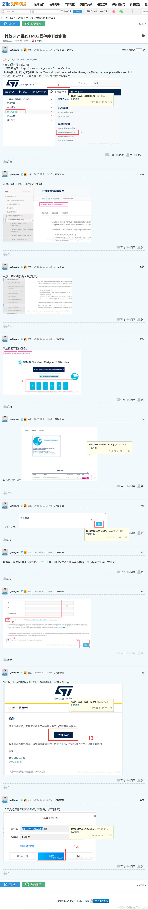

## 11 新建项目，固件库版本（开始使用固件库编程）
一般结构如下

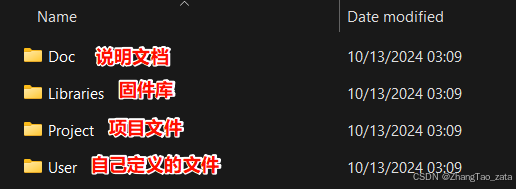

可以在这里改名

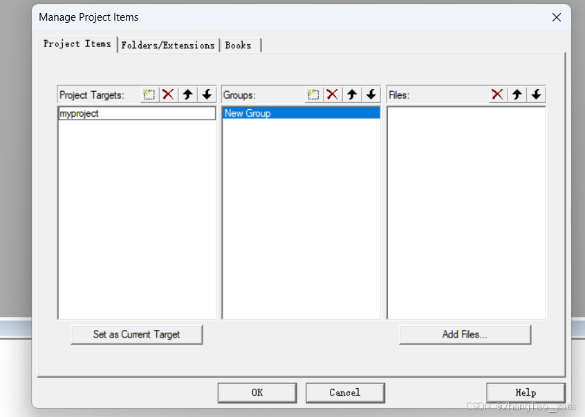
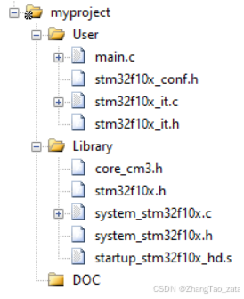

创建好文件夹还不行，还需要在keil中指定文件目录

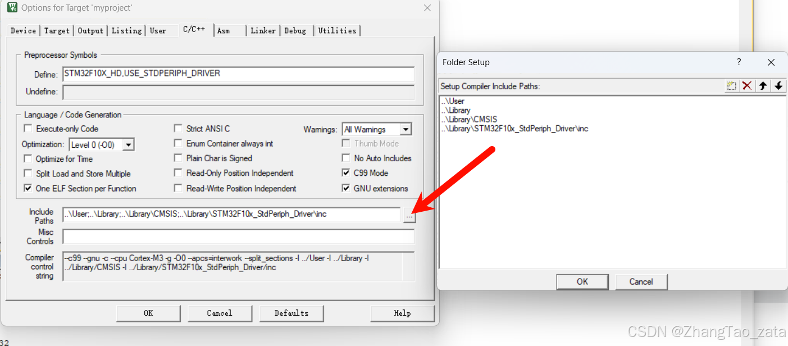


