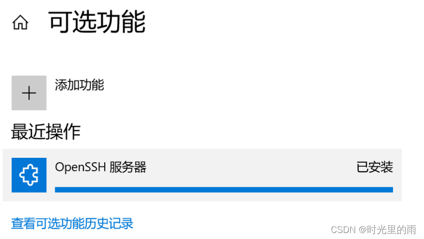

#  ☆ SSH常用命令
## SSH安装
1. ubuntu 

```bash
sudo apt update # 更新仓库
sudo apt install openssh-server # 安装openssh
vi /etc/ssh/sshd_config # 进入配置文件，找到port=22那行，取消注释 ，如果想要root登陆，可以取消PermitRootLogin注释并修改为yes
sudo service ssh restart # 重启服务，然后就可以连接了，有时候为了安全，上一步的root登陆是不允许的，root用户连不上，可以用普通用户登录再切换到root 
```


### 1. SSH 连接命令
```bash
# 基本连接
ssh username@hostname

# 指定端口连接
ssh -p 2222 username@hostname

# 使用密钥连接
ssh -i /path/to/private_key username@hostname
```

### 2. SSH 密钥管理
```bash
# 生成 SSH 密钥对
ssh-keygen -t rsa -b 4096

# 复制公钥到远程服务器
ssh-copy-id username@hostname   # 如果是windows可以看问题：在Windows客户机上实现类似ssh-copy-id功能即下次不需要输入密码

# 查看已知主机
cat ~/.ssh/known_hosts
```
(在Windows客户机上实现类似ssh-copy-id功能即下次不需要输入密码)[#在Windows客户机上实现类似ssh-copy-id功能即下次不需要输入密码]


### 3.SSH传输文件

```python
# 1、从服务器上下载文件
scp username@servername:/path/filename /var/www/local_dir（本地目录）
 # 例如scp root@192.168.0.101:/var/www/test.txt  把192.168.0.101上的/var/www/test.txt 的文件下载到/var/www/local_dir（本地目录）

# 2、上传本地文件到服务器
scp /path/filename username@servername:/path   
# 例如scp /var/www/test.php  root@192.168.0.101:/var/www/  把本机/var/www/目录下的test.php文件上传到192.168.0.101这台服务器上的/var/www/目录中

# 3、从服务器下载整个目录
scp -r username@servername:/var/www/remote_dir/（远程目录） /var/www/local_dir（本地目录）
# 例如:scp -r root@192.168.0.101:/var/www/test  /var/www/  

# 4、上传目录到服务器
scp  -r local_dir username@servername:remote_dir
# 例如：scp -r test  root@192.168.0.101:/var/www/   把当前目录下的test目录上传到服务器的/var/www/ 目录 


```


### 4. SSH 端口转发

<span style="color :red"> 注意必须要提前配置公网服务器的ssh配置文件 可见ssh问题中的“通过 SSH 反向隧道将本地前后端暴露到公网” </span>

```bash
# 本地端口转发
ssh -L local_port:target_host:target_port username@hostname

# 远程端口转发
ssh -R remote_port:target_host:target_port username@hostname
#不发送任何命令，只用来建立连接。没有这个参数，会在 SSH 服务器打开一个 Shell。会在前台打开
ssh -R <服务器端口>:localhost:22 -N root@<服务器地址>
# 将SSH命令放到后台，如果想要停止需要杀死进程   （ 比较常用 ）
ssh -R <服务器端口>:localhost:22 -Nf root@<服务器地址> 

# 动态端口转发（SOCKS代理）
ssh -D local_port username@hostname


# 基本格式
ssh [选项] username@hostname

# 常用选项说明
-L [本地IP:]本地端口:目标IP:目标端口    # 本地端口转发
-R [远程IP:]远程端口:目标IP:目标端口    # 远程端口转发
-D [本地IP:]本地端口                    # 动态端口转发(SOCKS代理)

# 重要的辅助选项
-N      # 不执行远程命令，仅用于端口转发
-f      # 后台运行
-C      # 压缩数据传输
-q      # 安静模式，减少日志输出
-v      # 详细模式，用于调试
-vv     # 更详细的模式
-4      # 仅使用 IPv4
-6      # 仅使用 IPv6
# 连接相关选项
-p 端口  # 指定 SSH 服务器端口
-i 密钥  # 指定私钥文件路径
```

### 5. SSH 配置管理
```bash
# 编辑 SSH 配置文件
vim ~/.ssh/config

# 配置文件示例
Host myserver
    HostName hostname
    User username
    Port 2222
    IdentityFile ~/.ssh/id_rsa
```

### 常见用途对比：

1. **安全性**
- 密码登录：便捷但相对不安全
- 密钥登录：更安全，推荐使用

2. **传输方式**
- `scp`：简单直接，适合临时传输
- `rsync`：支持增量传输，适合大量文件同步

3. **端口转发**
- 本地转发：访问远程内网服务
- 远程转发：让远程访问本地服务
- 动态转发：创建 SOCKS 代理

4. **连接管理**
- 普通连接：一次性使用
- 配置文件：适合经常连接的服务器

### 使用建议：

1. 优先使用密钥认证
2. 重要服务器建议修改默认 22 端口
3. 经常连接的服务器建议配置 `~/.ssh/config`
4. 大文件传输建议使用 `rsync` 而不是 `scp`
5. 注意保护好私钥文件的安全

这些命令和用法覆盖了日常 SSH 使用的大部分场景，建议根据实际需求选择合适的命令使用。

## Ubuntu 下 SSH 服务的启动、停止和管理方法：

安装 SSH 服务
```bash
# 安装 OpenSSH 服务器
sudo apt update
sudo apt install openssh-server
```


 1. service 命令（传统方式）
```bash
# 启动
sudo service ssh start

# 停止
sudo service ssh stop

# 重启
sudo service ssh restart

# 查看状态
sudo service ssh status
```

 2. /etc/init.d 脚本方式
```bash
# 启动
sudo /etc/init.d/ssh start

# 停止
sudo /etc/init.d/ssh stop

# 重启
sudo /etc/init.d/ssh restart

# 查看状态
sudo /etc/init.d/ssh status
```

 3. systemctl 命令（现代 systemd 方式）
```bash
# 启动
sudo systemctl start sshd

# 停止
sudo systemctl stop sshd

# 重启
sudo systemctl restart sshd

# 查看状态
sudo systemctl status sshd
```

 4. 直接启动 sshd 进程
```bash
# 直接启动 sshd
sudo /usr/sbin/sshd

# 使用特定配置文件启动
sudo /usr/sbin/sshd -f /path/to/sshd_config
```

 不同系统的区别：

1. **Ubuntu/Debian** 系统中服务名通常是 `ssh`
```bash
sudo service ssh start
```

2. **CentOS/RHEL** 系统中服务名通常是 `sshd`
```bash
sudo service sshd start
```

 注意事项：

1. 现代 Linux 系统推荐使用 `systemctl` 命令
2. `service` 命令在新系统中实际上是 `systemctl` 的封装
3. `/etc/init.d` 脚本方式是最传统的方法，但仍被支持
4. 直接启动 `sshd` 进程通常用于调试目的

选择哪种方式主要取决于：
- 系统版本
- 个人习惯
- 具体需求（如调试）

所有这些方法都能达到相同的目的，只是使用的方式不同。


 3. SSH 配置文件位置
```bash
# 主配置文件
sudo vim /etc/ssh/sshd_config

# 常见配置项示例
Port 22                    # SSH 端口
PermitRootLogin no        # 禁止 root 登录
PasswordAuthentication yes # 允许密码认证
```

 4. 检查 SSH 服务
```bash
# 检查 SSH 是否正在运行
ps aux | grep ssh

# 检查 SSH 端口是否开放
sudo netstat -tulpn | grep ssh

# 检查防火墙是否允许 SSH
sudo ufw status
```

 5. 防火墙设置
```bash
# 允许 SSH 连接
sudo ufw allow ssh

# 允许特定端口（如果修改了默认端口）
sudo ufw allow 2222/tcp
```

 常见问题解决：

1. **服务无法启动**
```bash
# 查看详细日志
sudo journalctl -u ssh

# 检查配置文件语法
sudo sshd -t
```

2. **权限问题**
```bash
# 修复 SSH 目录权限
sudo chmod 755 /etc/ssh
sudo chmod 600 /etc/ssh/ssh_host_*_key
sudo chmod 644 /etc/ssh/ssh_host_*_key.pub
```

 安全建议：

1. **基本安全配置**
```bash
# 编辑 SSH 配置文件
sudo vim /etc/ssh/sshd_config

# 推荐的安全设置
PermitRootLogin no
PasswordAuthentication no
MaxAuthTries 3
Protocol 2
```

2. **使用密钥认证**
```bash
# 在客户端生成密钥对
ssh-keygen -t rsa -b 4096

# 将公钥复制到服务器
ssh-copy-id username@server_ip
```

 常用维护命令：

1. **查看连接状态**
```bash
# 查看当前 SSH 连接
who
w

# 查看 SSH 登录日志
sudo cat /var/log/auth.log | grep ssh
```

2. **配置文件备份**
```bash
# 备份 SSH 配置
sudo cp /etc/ssh/sshd_config /etc/ssh/sshd_config.backup
```

记住，每次修改 SSH 配置文件后，都需要重启 SSH 服务才能生效：
```bash
sudo systemctl restart ssh
```

这些是 Ubuntu 下管理 SSH 服务的基本操作，建议在修改配置时先备份，并保持一个可用的连接会话，以防配置错误导致无法连接。


## SSH 问题


### 使用公网Linux服务器为Windows电脑做内网穿透

#### 方法一：使用FRP（推荐，稳定可靠）

FRP (Fast Reverse Proxy) 是一款专为此类场景设计的工具，功能强大，支持断线重连，适合长期稳定使用。

1. 服务端配置 (Linux公网服务器)

下载并解压FRP:

```Bash
# 前往 https://github.com/fatedier/frp/releases 找最新版Linux amd64链接

wget [最新版frp的linux_amd64.tar.gz链接]

tar -zxvf frp_*.tar.gzcd frp_*/
```

配置 frps.ini:


``` TOML
# frps.ini[common]bind_port = 7000                 # 用于和客户端通信的端口token = your_secure_password     # 连接凭证，请务必修改dashboard_port = 7500            # [可选] 状态仪表盘端口dashboard_user = admin           # [可选] 仪表盘用户名dashboard_pwd = admin_password   # [可选] 仪表盘密码
```

开放服务器防火墙:

确保开放 7000 端口以及你计划用于转发的端口（如下文的 7001）和仪表盘端口 7500。


```Bash


# firewalld示例

sudo firewall-cmd --add-port=7000/tcp --permanent

sudo firewall-cmd --add-port=7001/tcp --permanent

sudo firewall-cmd --reload
```

运行服务端:

```Bash


./frps -c ./frps.ini
```

建议设置为 systemd 服务以实现开机自启和后台运行。

2. 客户端配置 (Windows内网电脑)

下载并解压FRP: 前往FRP的GitHub Releases页面，下载对应的 windows_amd64.zip 版本并解压。

配置 frpc.ini (以穿透远程桌面为例):


```TOML


# frpc.ini[common]server_addr = 你的服务器公网IPserver_port = 7000token = your_secure_password # 必须和服务端一致[rdp]type = tcplocal_ip = 127.0.0.1local_port = 3389          # Windows远程桌面默认端口remote_port = 7001         # 从公网访问的端口
```
运行客户端: 打开CMD或PowerShell运行：


```DOS

# 进入frp目录

.\frpc.exe -c .\frpc.ini
```

建议使用 nssm 等工具将其注册为Windows服务，实现开机自启。

3. 如何连接

在任何电脑上打开“远程桌面连接”(mstsc)，计算机名处输入：你的服务器公网IP:7001。


#### 方法二：使用SSH反向隧道（轻便快捷）

利用SSH内置功能，无需额外软件，适合临时、快速的连接。

1. 服务端配置 (Linux公网服务器)

编辑SSH配置文件，允许公网访问隧道端口：


```Bash


sudo vim /etc/ssh/sshd_config

# 找到或添加 GatewayPorts 并设置为 yes：
GatewayPorts yes
```

重启SSH服务：


```Bash
sudo systemctl restart sshd
```

2. 客户端操作 (Windows内网电脑)

打开PowerShell或CMD，执行以下命令：


```PowerShell
# -fN 表示后台运行且不执行远程命令，只做隧道# 格式: ssh -fN -R [服务器端口]:[本地IP]:[本地端口] [用户名]@[服务器IP]

ssh -fN -R 7001:127.0.0.1:3389 your_user@你的服务器公网IP
```

该命令会建立一个长连接隧道，关闭窗口则隧道断开。

3. 如何连接

与FRP方式相同，在“远程桌面连接”中输入 你的服务器公网IP:7001。

常见问题：localhost 不行但 127.0.0.1 可以？

这是一个由于IPv6/IPv4解析优先级导致的问题。


原因: localhost 可能被系统优先解析为IPv6的 ::1 地址，但你的目标服务（如远程桌面）仅在IPv4的 127.0.0.1 上监听。

最佳解决方案: 无需排查，在所有配置（无论是FRP还是SSH）中，请始终使用 127.0.0.1 而不是 localhost。127.0.0.1 明确指向IPv4本地环回地址，能保证连接的准确性，是最简单、最可靠的做法。


### 通过 SSH 反向隧道将本地前后端暴露到公网

1. **准备公网服务器**
   - 获取公网服务器（如阿里云），记录 IP（如 `203.0.113.1`）。
   - 确保安装 SSH 服务（OpenSSH）。

2. **配置公网服务器**
   - 编辑 `/etc/ssh/sshd_config`，启用：
     ```bash
     AllowTcpForwarding yes
     GatewayPorts yes
     ```
   - 重启 SSH：
     ```bash
     sudo systemctl restart sshd
     ```
   - 开放端口（如 3000、8000）：
     ```bash
     sudo ufw allow 3000
     sudo ufw allow 8000
     ```

3. **确保本地服务运行**
   - 前端：运行在 `localhost:3000`（如 React）。
   - 后端：运行在 `localhost:8000`（如 Flask）。
   - 确认本地可通过浏览器访问。

4. **配置 SSH 反向隧道**
   - 在本地运行：
     ```bash
     ssh -R 3000:localhost:3000 -R 8000:localhost:8000 user@203.0.113.1
     ```
   - 使用 `autossh` 保持连接：
     ```bash
     autossh -M 0 -R 3000:localhost:3000 -R 8000:localhost:8000 user@203.0.113.1
     ```

5. **测试访问**
   - 访问 `http://203.0.113.1:3000`（前端）和 `http://203.0.113.1:8000`（后端）。
   - 确保前端 API 请求指向公网 IP（如 `http://203.0.113.1:8000`）。

6. **可选：Nginx 优化**
   - 安装 Nginx：
     ```bash
     sudo apt install nginx
     ```
   - 配置 `/etc/nginx/sites-available/default`：
     ```nginx
     server {
         listen 80;
         server_name 203.0.113.1;
         location / { proxy_pass http://localhost:3000; }
         location /api/ { proxy_pass http://localhost:8000/; }
     }
     ```
   - 重启 Nginx：
     ```bash
     sudo systemctl restart nginx
     ```

7. **注意事项**
   - 保持本地电脑开机和网络稳定。
   - 配置 SSH 密钥认证提高安全性。
   - 检查防火墙和 CORS 设置。


### 解决 ssh 连接远程主机超时未使用自动断开
参考：https://blog.csdn.net/Gelomen/article/details/109121069

```json
这个问题可以通过配置 SSH 客户端来保持连接活跃。有以下几种解决方案：

1. 修改 SSH 客户端配置文件（推荐方案）：
编辑 ~/.ssh/config 文件（如果没有则创建），添加以下配置：

    Host *
    ServerAliveInterval 60
    ServerAliveCountMax 3

这个配置的含义是：
- ServerAliveInterval 60: 每60秒发送一次心跳包
- ServerAliveCountMax 3: 如果连续3次心跳包没有响应，则断开连接

2. 在建立 SSH 连接时直接指定参数：

    ssh -o ServerAliveInterval=60 -o ServerAliveCountMax=3 user@remote-server

3. 如果是在使用 SSH 隧道，可以这样：

    ssh -N -f -o ServerAliveInterval=60 -o ServerAliveCountMax=3 -L local-port:remote-host:remote-port user@remote-server

4. 如果你是服务器管理员，也可以通过修改服务器端的 SSH 配置（/etc/ssh/sshd_config）来实现：

    ClientAliveInterval 60
    ClientAliveCountMax 3

修改服务器配置后需要重启 SSH 服务：

    sudo systemctl restart sshd

推荐使用第一种方案（修改客户端配置文件），因为：
1. 只需配置一次，永久生效
2. 对所有 SSH 连接都有效
3. 不需要每次手动输入参数

注意：设置的时间间隔不要太短（比如小于30秒），否则可能会增加不必要的网络开销。60秒通常是一个比较好的选择。

```


### 服务器安装ssh服务 (linux & windows)
1. linux
```bash
sudo apt update # 更新仓库
sudo apt install openssh-server # 安装openssh
sudo service ssh restart # 重启服务，然后就可以连接了，有时候root用户连不上，可以用普通用户登录再切换到root
```

2. windows
参考： https://blog.csdn.net/weixin_72910567/article/details/132414264



```bash 
# 1. 在设置-应用和功能里安装openssh服务

# 2. 查看是否安装成功
Get-WindowsCapability -Online | ? Name -like 'OpenSSH*'  

# 3. 开启服务
net start sshd

# 4. 设置开机自启动
Set-Service -Name sshd -StartupType 'Automatic'
```


### 在Windows客户机上实现类似ssh-copy-id功能即下次不需要输入密码

#### 问题背景
Windows 的 CMD 或 PowerShell 默认不支持 `ssh-copy-id` 命令。本教程介绍如何在 Windows 上将 SSH 公钥复制到远程服务器（IP: 192.168.110.150，端口: 6001）以实现无密码登录。

---

#### 方法 1：手动复制 SSH 公钥
1. **检查本地 SSH 密钥**：
   - 查看公钥：`type %USERPROFILE%\.ssh\id_rsa.pub`
   - 如无密钥，生成：`ssh-keygen -t rsa -b 4096`
2. **登录远程服务器**：
   - 运行：`ssh -p 6001 root@192.168.110.150`
   - 确保 `~/.ssh` 目录存在：`mkdir -p ~/.ssh && chmod 700 ~/.ssh`
3. **复制公钥**：
   - 在 Windows 复制公钥内容：`type %USERPROFILE%\.ssh\id_rsa.pub`
   - 在远程服务器编辑：`vi ~/.ssh/authorized_keys`，粘贴公钥，保存。
   - 设置权限：`chmod 600 ~/.ssh/authorized_keys`
4. **测试无密码登录**：
   - 运行：`ssh -p 6001 root@192.168.110.150`

---

#### 方法 2：使用 PowerShell 模拟 ssh-copy-id
1. **确保 OpenSSH 客户端已安装**：
   - 检查：`ssh -V`
   - 未安装则在“设置 > 应用 > 可选功能”中添加 OpenSSH 客户端。
2. **复制公钥**：
   - 运行：`Get-Content $env:USERPROFILE\.ssh\id_rsa.pub | ssh -p 6001 root@192.168.110.150 "cat >> ~/.ssh/authorized_keys"`
3. **验证权限**：
   - 登录服务器：`ssh -p 6001 root@192.168.110.150`
   - 运行：`chmod 700 ~/.ssh && chmod 600 ~/.ssh/authorized_keys`
4. **测试无密码登录**：
   - 运行：`ssh -p 6001 root@192.168.110.150`

---

#### 方法 3：安装 Git Bash 或 WSL
1. **使用 Git Bash**：
   - 安装 Git for Windows，打开 Git Bash。
   - 运行：`ssh-copy-id -p 6001 root@192.168.110.150`
2. **使用 WSL**：
   - 安装 WSL：`wsl --install`
   - 在 Ubuntu 中安装 openssh-client：`sudo apt update && sudo apt install openssh-client`
   - 运行：`ssh-copy-id -p 6001 root@192.168.110.150`

---

#### 注意事项
- 确保远程服务器允许密码登录或已配置 root 密码。
- 公钥复制后，检查 `~/.ssh/authorized_keys` 文件内容和权限。
- 测试无密码登录是否成功，如失败，检查 SSH 配置文件 `/etc/ssh/sshd_config` 和服务器防火墙设置。

### 本地机器生成密钥并复制到远程服务器（下次ssh连接就不需要输入密码）


注意：
ssh-copy-id 是专门为linux系统适配的，windows系统不好用，需要手动复制公钥到.ssh文件夹下面的authorized_keys文件中

#### linux

```bash
# 生成 SSH 密钥对
ssh-keygen -t rsa -b 4096

# 复制公钥到远程服务器
ssh-copy-id username@hostname

# 查看已知主机
cat ~/.ssh/known_hosts
```


如果是windows服务器，使用如下方式将公钥内容追加

``` bash 
echo "你的公钥内容" >> 你的用户目录/.ssh/authorized_keys
```


### Windows 下关闭 SSH 后台连接的方法 （在使用端口转发设置参数为-f时）

1. 使用任务管理器：
```powershell
# 打开任务管理器的方法：
# 1. Ctrl + Shift + Esc
# 2. 右键任务栏 -> 任务管理器
# 3. Ctrl + Alt + Delete -> 任务管理器

# 在"详细信息"或"进程"标签下找到 ssh.exe 进程并结束
```

2. 使用命令行查找和终止进程：
```powershell
# PowerShell 命令
# 查看 SSH 进程
Get-Process ssh

# 终止所有 SSH 进程
Get-Process ssh | Stop-Process

# 或者使用 CMD 命令
# 查看 SSH 进程
tasklist | findstr "ssh"

# 通过 PID 终止进程
taskkill /PID <进程ID> /F

# 终止所有 SSH 进程
taskkill /F /IM ssh.exe
```

3. 如果使用 Git Bash：
```bash
# 查看 SSH 进程
ps aux | grep ssh

# 终止进程
kill <进程ID>
```

建议：
1. 在使用 `-Nf` 启动 SSH 连接时，可以记录下进程 ID：
```bash
# 将进程 ID 保存到文件
ssh -Nf ... & echo $! > ssh_pid.txt
```

2. 创建一个批处理文件来管理连接：
```batch
@echo off
REM start_ssh.bat
ssh -Nf ... & echo %ERRORLEVEL% > ssh_pid.txt

REM stop_ssh.bat
for /f %%i in (ssh_pid.txt) do taskkill /PID %%i /F
del ssh_pid.txt
```