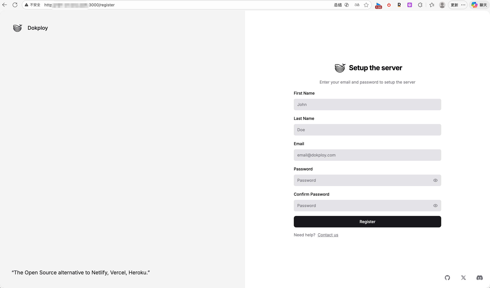
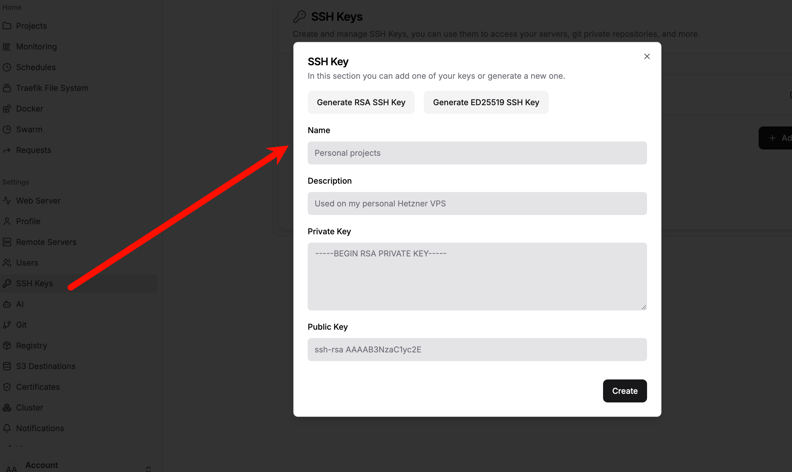
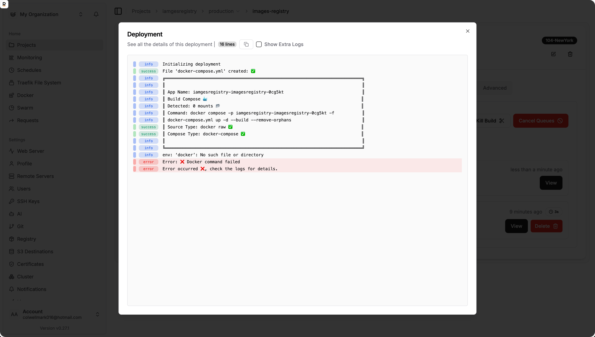

# 快速安装使用教程


[官网地址](https://dokploy.com/)

一键安装脚本，安装完成之后会给一个地址
```bash
curl -sSL https://dokploy.com/install.sh | sh
```


帮助子节点安装docker
```bash
curl -fsSL https://get.docker.com | sh

# 设置开机自启  
systemctl enable --now docker
```





# 注意事项

1. 可以先用自己电脑ssh-copy-id 到远程服务器，然后把自己电脑上的ssh密钥复制过来


2. 子节点默认可能是没有docker的



# Dokploy介绍

Dokploy 是一个新兴的、开源的、基于 Web 的服务器管理和应用程序部署平台，旨在让开发者和中小型团队能够像使用 Heroku 或 Vercel 一样简便地部署和管理应用，但所有服务完全运行在您自己拥有或控制的服务器（如 VPS）上。简单来说，Dokploy 是“自托管/私有化部署的 Heroku”。

它通过一个直观的 Web 控制面板，将复杂的 Docker、Git、Webhook 和反向代理配置过程完全可视化，让您无需记忆冗长的命令行指令，就能完成应用部署、数据库创建、SSL 证书安装等一系列操作。

 核心特性

- **基于 Docker**：所有应用和服务都以 Docker 容器形式运行，保证环境的一致性和隔离性。支持上传标准的 `docker-compose.yml` 文件，或使用内置模板快速创建多容器应用。

- **可视化部署**：
  - **Git 集成**：连接 GitHub、GitLab 或 Bitbucket 仓库，实现持续部署。每次推送代码到指定分支，Dokploy 会自动拉取、构建并重新部署应用。
  - **Docker 镜像部署**：可直接从 Docker Hub 或私有仓库拉取镜像进行部署。
  - **环境变量管理**：在网页界面中轻松添加、编辑和管理敏感配置信息，无需手动编辑文件。

- **内置服务支持**：一键部署常用数据库（MySQL、PostgreSQL、MongoDB、Redis 等）、缓存服务和反向代理（Nginx），无需手动编写配置文件。

- **SSL 证书自动管理**：集成 Let’s Encrypt，为您的应用域名自动签发和续期免费的 HTTPS 证书，仅需点击几下即可完成配置。

- **直观的监控与管理**：
  - 实时查看容器状态（运行/停止）、CPU 与内存使用情况。
  - 查看实时日志流，支持在线启动、停止、重启容器。

- **多服务器管理**：一个 Dokploy 控制面板可同时管理多个远程服务器（节点），便于在不同机器上分布和调度应用。

- **开源与可扩展**：完全开源（采用商业源码许可证），代码透明，社区驱动，支持通过插件或模板扩展功能，便于二次开发与定制。

 典型工作流程

1. **准备一台 VPS**：在 DigitalOcean、Linode、阿里云、腾讯云等服务商购买一台安装了 Ubuntu 或 Debian 的虚拟服务器。
2. **安装 Dokploy**：使用官方提供的一键安装脚本，在服务器上部署 Dokploy（其本身也是一个 Docker 容器）。
3. **访问控制面板**：通过浏览器访问服务器 IP 和指定端口，进入 Dokploy 的 Web 界面并完成初始设置。
4. **连接 Git 账户**：在面板中授权您的 GitHub、GitLab 或 Bitbucket 账号。
5. **创建新项目**：点击“部署应用”，选择目标仓库和分支。
6. **配置部署参数**：设置端口映射、环境变量、构建命令等。Dokploy 会自动生成 `Dockerfile`（如项目未提供），或使用您上传的 `docker-compose.yml`。
7. **执行部署**：点击“部署”按钮，Dokploy 会自动拉取代码、构建镜像、启动容器，并通过内置的 Traefik 或 Nginx 配置好域名访问。
8. **持续管理**：部署完成后，通过面板监控应用状态、查看日志、添加自定义域名并启用 SSL。

 适合谁使用？

- **前端/全栈开发者**：希望快速部署 Next.js、Nuxt.js、React、Vue 或 Node.js 等项目，却不愿花时间处理服务器运维。
- **初创团队和小公司**：需要成本可控、易于维护的部署方案，同时避免被 Heroku、Railway 等 PaaS 平台绑定或高额费用困扰。
- **注重数据隐私的个人或组织**：因合规性、安全或数据主权要求，必须将应用部署在自有基础设施上，但仍希望享受现代云平台的便捷体验。
- **Docker 初学者**：想体验容器化部署的优势，但对命令行、网络配置、存储卷等概念感到困难。

 优点与缺点

**优点：**
- **成本效益高**：仅需支付 VPS 费用，Dokploy 本身免费，长期使用远低于按需付费的云 PaaS。
- **完全自主可控**：数据和基础设施由您掌控，可自由定制服务器配置和安全策略。
- **开发者体验友好**：极大降低了 Docker 和 CI/CD 的入门门槛，部署流程流畅直观。
- **活跃社区**：项目更新频繁，功能持续迭代，社区支持逐步增强。

**缺点：**
- **依赖自有服务器**：您需具备基本的服务器运维能力（如 SSH 登录、防火墙设置），并自行负责安全更新、备份和底层维护。
- **非企业级架构**：相比 Kubernetes 或商业面板（如 Plesk、cPanel），在集群管理、高可用、自动伸缩等方面功能尚不完善。
- **新兴项目**：作为较新的开源工具，其长期稳定性、大规模生产环境验证和生态成熟度仍需时间检验。

 与其他工具的对比

| 工具 | 类型 | 核心特点 | 适合场景 |
| :--- | :--- | :--- | :--- |
| **Dokploy** | 自托管 PaaS 面板 | 开源、可视化、Git 集成、轻量级、基于 Docker | 个人开发者、小团队自托管应用 |
| **Heroku / Vercel** | 云 PaaS | 极致简化、全托管、生态丰富、按需付费 | 追求效率、不愿管理服务器的用户 |
| **Portainer** | Docker 管理面板 | 通用型容器、镜像、网络、卷管理 | 需要精细管理 Docker 环境的管理员 |
| **Coolify / CapRover** | 自托管 PaaS 面板 | 与 Dokploy 定位高度重叠，功能相似 | 可作为 Dokploy 的替代选择进行对比 |
| **Kubernetes** | 容器编排平台 | 企业级、高扩展性、功能强大但复杂 | 大型系统、微服务架构、需要弹性伸缩的场景 |

 如何开始？

1. 访问 Dokploy 官方网站获取最新文档和安装指南：[https://dokploy.com](https://dokploy.com)
2. 查看开源代码和社区贡献：[https://github.com/Dokploy/dokploy](https://github.com/Dokploy/dokploy)

 总结

Dokploy 填补了“完全托管的云服务”与“手动服务器运维”之间的空白，让开发者能专注于编写代码，而将部署与运维的复杂性封装在一个美观、易用的界面之后。对于追求自主权、控制权和成本效益的开发者而言，Dokploy 是一个极具吸引力的现代部署解决方案。如果您正在寻找一种比手动操作更高效、比大型云平台更自主的部署方式，Dokploy 绝对值得一试。


# Dokploy 搭配 Nginx Proxy Manager 保姆级实操教程

没问题！既然你习惯了 1Panel 的操作逻辑，那么**方案一：使用 Nginx Proxy Manager (NPM)** 绝对是你的最佳选择。

这将是一个**手把手、保姆级**的实操教程，涵盖从网络配置到最终通过域名访问的全过程。

---

**准备工作**

1.  **一台安装好 Dokploy 的服务器**。
2.  **一个域名**（假设为 `example.com`）。
3.  **确保端口未被占用**：确保服务器的 80 和 443 端口没有被其他程序占用（Dokploy 面板默认通常在 3000 端口，所以 80/443 通常是空闲的）。

---

**第一步：规划 Docker 网络（关键点）**

在 1Panel 里，系统帮你自动处理了网络。但在 Dokploy（以及原生 Docker）中，为了让“反向代理容器”能找到“应用容器”，它们必须在**同一个 Docker 网络**中。

我们先创建一个专用的网络，名字叫 `proxy-net`。

1.  登录你的服务器终端（SSH）。
2.  执行以下命令创建网络：

```bash
docker network create proxy-net
```

这一步做完，以后所有的应用和 NPM 都加入这个网络，它们就能通过“容器名”互相通信了。

---

**第二步：在 Dokploy 中部署 Nginx Proxy Manager**

1.  登录 Dokploy 面板。
2.  进入 **Project（项目）** -> 选择或新建一个项目（例如叫 `System`）。
3.  点击 **Compose** -> **Add Compose**。
    *   **Name:** `nginx-proxy-manager`
    *   **Description:** 反向代理服务
4.  在右侧的编辑器中，粘贴以下配置（注意我添加了网络配置）：

```yaml
version: '3.8'
services:
  app:
    image: 'jc21/nginx-proxy-manager:latest'
    container_name: nginx-proxy-manager
    restart: unless-stopped
    ports:
      - '80:80'
      - '81:81'
      - '443:443'
    volumes:
      - ./data:/data
      - ./letsencrypt:/etc/letsencrypt
    networks:
      - proxy-net

networks:
  proxy-net:
    external: true
```

5.  点击 **Deploy**（部署）。
6.  等待日志显示 `Listening on port 81`，表示启动成功。

---

**第三步：初始化 Nginx Proxy Manager**

1.  在浏览器访问：`http://你的服务器 IP:81`
2.  使用默认账号登录：
    *   **Email:** `admin@example.com`
    *   **Password:** `changeme`
3.  登录后，系统会立即要求你修改**用户名**和**密码**，请务必修改并记住。

此时，你的“反向代理中心”已经搭建好了！

---

**第四步：部署一个业务应用（以 Alist 为例）**

现在我们来部署一个实际的应用，并尝试通过域名访问它。

1.  回到 Dokploy 面板。
2.  进入你的项目，点击 **Compose** -> **Add Compose**。
3.  **Name:** `alist`
4.  粘贴以下配置（**注意看 `networks` 和 `ports` 的部分**）：

```yaml
version: '3.3'
services:
  alist:
    image: 'xhofe/alist:latest'
    container_name: alist-app
    restart: always
    volumes:
      - './etc/alist:/opt/alist/data'
    networks:
      - proxy-net

networks:
  proxy-net:
    external: true
```

5.  点击 **Deploy**。

**重点理解**：此时，`alist-app` 和 `nginx-proxy-manager` 都在 `proxy-net` 这个网络里。虽然你在公网通过 IP:5244 访问不到 Alist（因为没暴露端口），但 NPM 可以通过内部网络访问到它。

---

**第五步：域名解析 (DNS)**

去你的域名服务商（阿里云、腾讯云、Cloudflare 等）：

1.  添加一条 **A 记录**。
2.  **主机记录 (Name):** 例如 `pan` (即 `pan.example.com`)。
3.  **记录值 (Value):** 填写你 **Dokploy 服务器的公网 IP**。

---

**第六步：在 NPM 中配置反向代理（最后一步！）**

1.  回到 NPM 的管理后台 (`http://你的服务器 IP:81`)。
2.  点击顶部菜单 **Hosts** -> **Proxy Hosts**。
3.  点击右上角 **Add Proxy Host**。

**A. Details 标签页 (基本信息)**
*   **Domain Names:** `pan.example.com` (你刚才解析的域名)
*   **Scheme:** `http`
*   **Forward Hostname / IP:** `alist-app`
    *   这里最关键！填写你在第四步定义的 `container_name`。不要填 IP，填容器名即可。
*   **Forward Port:** `5244`
    *   填写 Alist 的内部端口。
*   **Cache Assets / Block Common Exploits:** 推荐勾选。

**B. SSL 标签页 (HTTPS 证书)**
*   **SSL Certificate:** 选择 `Request a new SSL Certificate`。
*   **Force SSL:** 勾选 (强制跳转 HTTPS)。
*   **HTTP/2 Support:** 推荐勾选。
*   **Email Address:** 填写你的邮箱。
*   **I Agree to the Terms:** 勾选。

4.  点击 **Save**。

---

**验证成果**

现在，在浏览器输入 `https://pan.example.com`。

*   如果一切顺利，你应该能看到 Alist 的页面。
*   并且浏览器地址栏有一把**小锁**（HTTPS 已启用）。
*   整个过程你不需要手动去碰 Nginx 的配置文件，也不需要手动上传证书。

**进阶小贴士**

1.  **后续添加新应用：**
    *   在 Dokploy 部署新应用时，记得在 Compose 文件里加上 `networks: - proxy-net`。
    *   记下容器名 (`container_name`) 和内部端口。
    *   去 NPM 添加一条新的 Proxy Host 即可。

2.  **关于端口 81 的安全：**
    *   NPM 的后台（81 端口）直接暴露在公网其实不太安全。
    *   **高级玩法**：你可以在 NPM 里，把自己（`nginx-proxy-manager` 容器，端口 81）也代理一下！
    *   配置一个域名如 `npm.example.com` -> Forward Hostname: `nginx-proxy-manager` -> Port: `81`。
    *   一旦配置成功，去云服务商防火墙把 81 端口封掉，只留 80/443，以后通过 `npm.example.com` 访问管理后台，更加安全且带有 HTTPS。

通过这套流程，你在 Dokploy 上就完美复刻了 1Panel 的反向代理体验，甚至在多服务器扩展性上比 1Panel 更强（因为基于标准的 Docker 网络）。