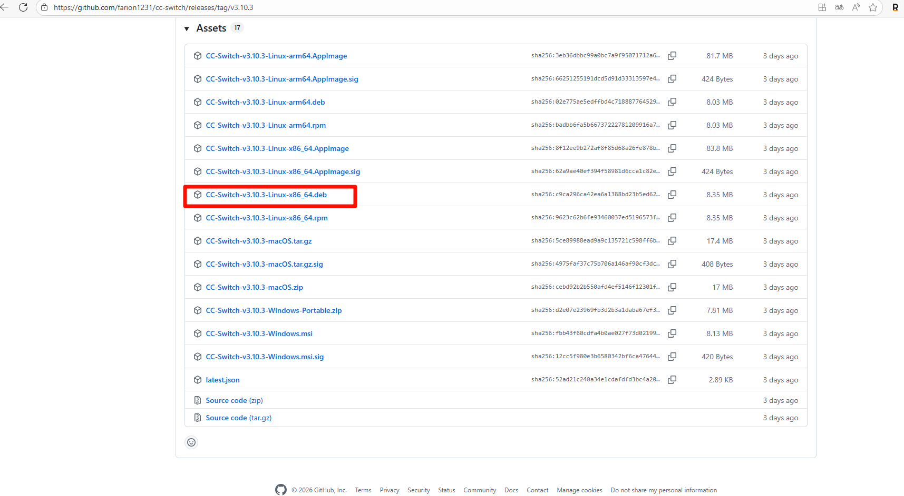
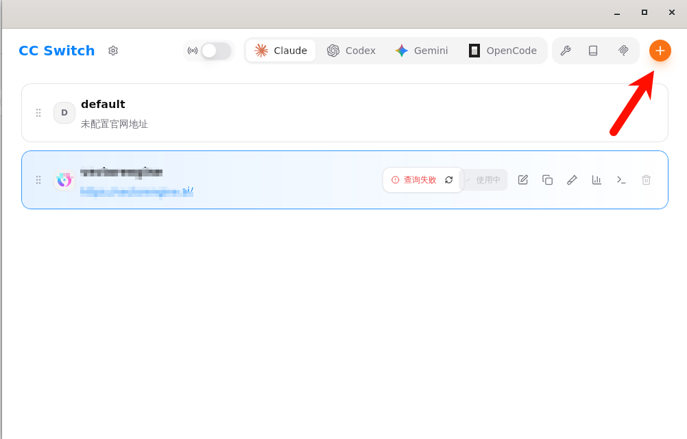
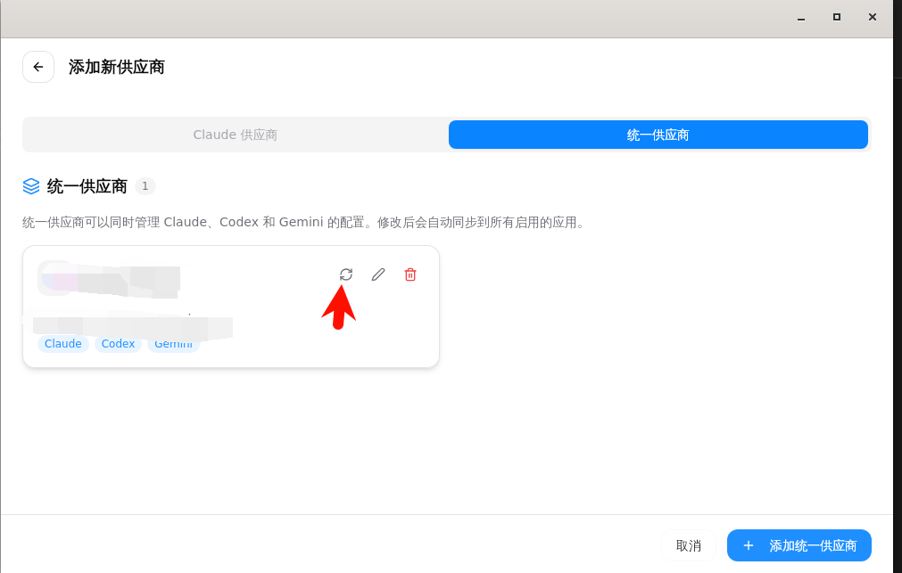
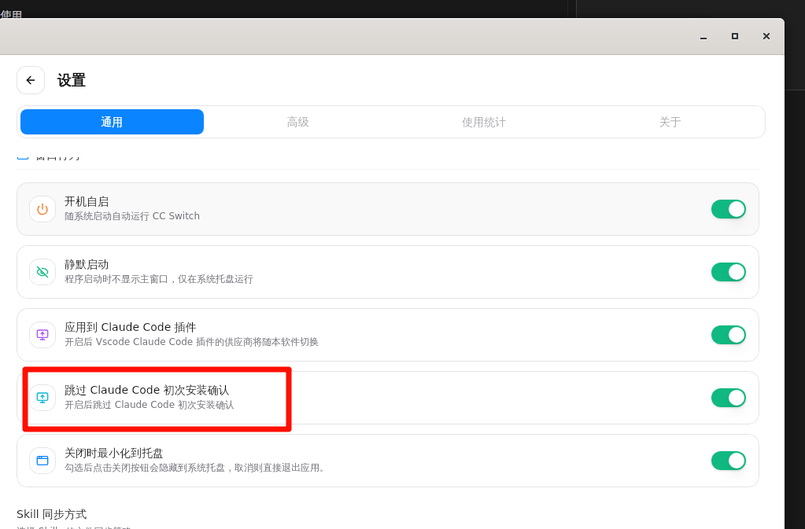
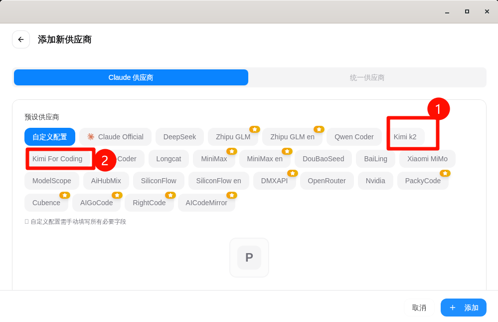
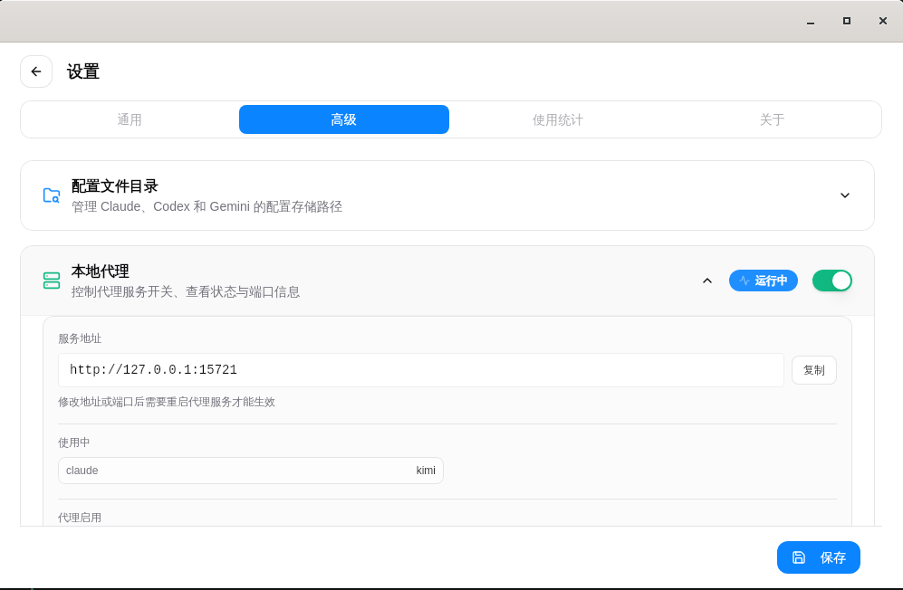
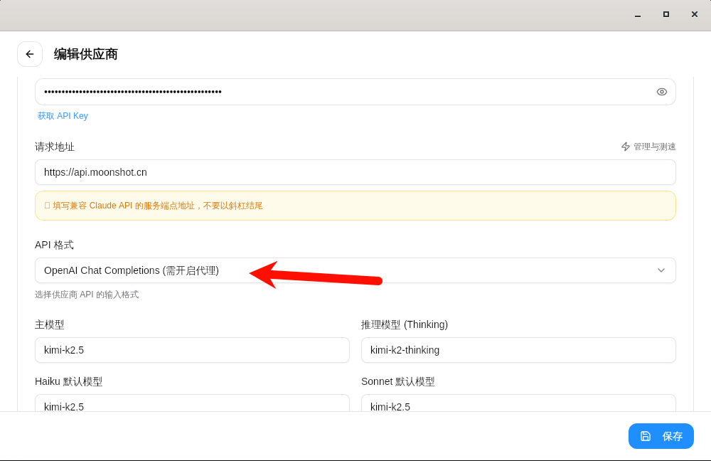

# cc-switch 使用

##  公开教程

[bili](https://www.bilibili.com/read/cv44051635/?opus_fallback=1)

[github issue --- vscode里面使用claude code for vscode免登录 ](https://github.com/farion1231/cc-switch/issues/814)

[zhihu](https://zhuanlan.zhihu.com/p/1992351805414334464)

## 安装

1. 入到仓库,这里以wsl-ubuntu为例,下载deb包

[cc-switch github地址](https://github.com/farion1231/cc-switch)

2. 使用sudo apt install ./... 命令去安装

- 配置

1. 创建统一供应商

2. 一键同步

3. 把设置里面的一些东西打开, 但是不需要开代理

## 配置 claude 供应商 

--- 

1. 配置支持Anthropic协议的提供商

    1.1 配置kimi模型 

    kimi 有两种供应方式,需要注意一下

    

---

2. 配置只支持openai协议的提供商

    2.1 需要设置里面开启本地代理

    

    2.2 需要将api格式改成openai,当然api接口也是openai格式对应的接口,这里也是以kimi为例
    