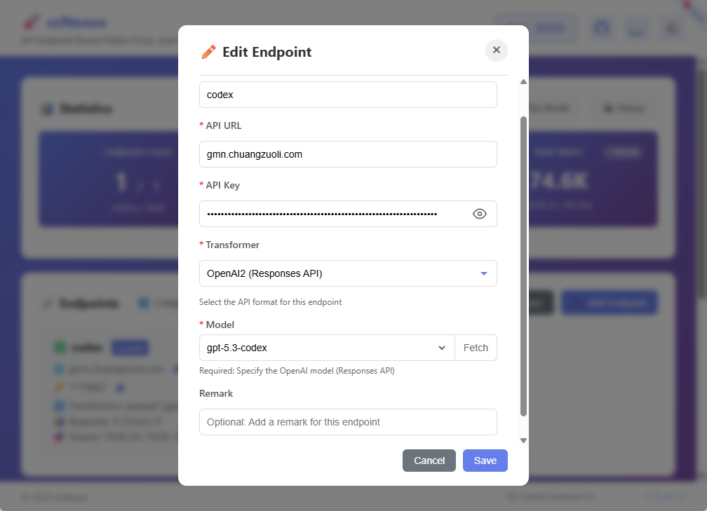

[ccNexus 下载地址](https://github.com/lich0821/ccNexus/releases)




**ccNexus 项目介绍**  
（基于 GitHub 仓库 https://github.com/lich0821/ccNexus 官方描述与 README 整理）

**项目全称**：ccNexus  
**官方描述**：Intelligent API gateway for Claude Code and Codex CLI —— 一个专为 **Claude Code** 和 **Codex CLI** 打造的智能 API 网关。  
它能实现**端点自动轮换**、**API 格式转换**、**实时使用量监控**，并无缝对接 OpenAI、Gemini 等多种平台。

### 核心功能亮点
- **多端点智能轮换**：添加多个 API 地址，自动故障转移（一个挂了立刻切下一个）
- **API 格式转换**：支持 Claude / OpenAI / Gemini 之间相互转换
- **实时统计面板**：请求数、错误数、Token 消耗一目了然
- **WebDAV 多设备同步**：配置和数据跨电脑、手机同步
- **纯后端 + Docker 支持**：可作为 HTTP 服务运行，也支持容器化部署
- **跨平台原生支持**：Windows、macOS、Linux 均有对应可执行文件

### 支持平台与安装方式（超简单）
1. 去 **Releases 页面** 下载最新版本（你直接点的就是这个页面）：  
   https://github.com/lich0821/ccNexus/releases
2. 解压后运行即可：
   - Windows：直接双击 `ccNexus.exe`
   - macOS：拖到「应用程序」文件夹，第一次右键 →「打开」
   - Linux：`tar -xzf ccNexus-linux-amd64.tar.gz && ./ccNexus`

### 快速配置（两步搞定 Claude Code / Codex CLI）
1. 启动 ccNexus（默认监听 `http://127.0.0.1:3000`）
2. 添加端点（填 API 地址 + Key + 选择转换器）
3. Claude Code 配置（`~/.claude/settings.json`）：
   ```json
   {
     "anthropic": {
       "base_url": "http://127.0.0.1:3000"
     }
   }
   ```
4. Codex CLI 配置（`~/.codex/config.toml`）：
   ```toml
   model_provider = "ccNexus"
   base_url = "http://localhost:3000/v1"
   ```

### 最新版本信息（截至目前）
- **最新稳定版**：v4.11.1（2026 年 2 月发布）
- 包含 Mac Docker 菜单栏修复、标签兼容性优化、终端 Launcher 自定义等更新
- 项目非常活跃，持续在迭代（已发布 60+ 个版本）

### 项目数据一览
- 语言：主要 Go + 前端（JavaScript/CSS）
- 开源协议：MIT
- Star：743+｜Fork：89+
- 标签：`ai-coding`、`claude-code-proxy`、`claude-code-router`

**一句话总结**：  
如果你在用 Claude Code 或 Codex CLI，但苦于 API 限流、地区限制、多账号切换麻烦，**ccNexus 就是专门为你打造的“智能中转站”** —— 一键轮换、格式转换、监控全都有，安装后几分钟就能用上。
