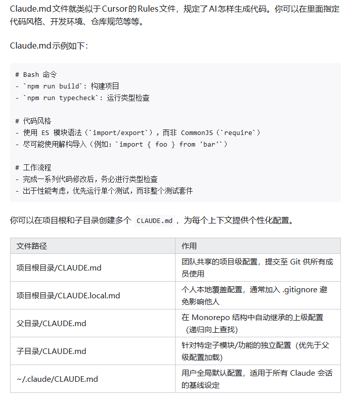
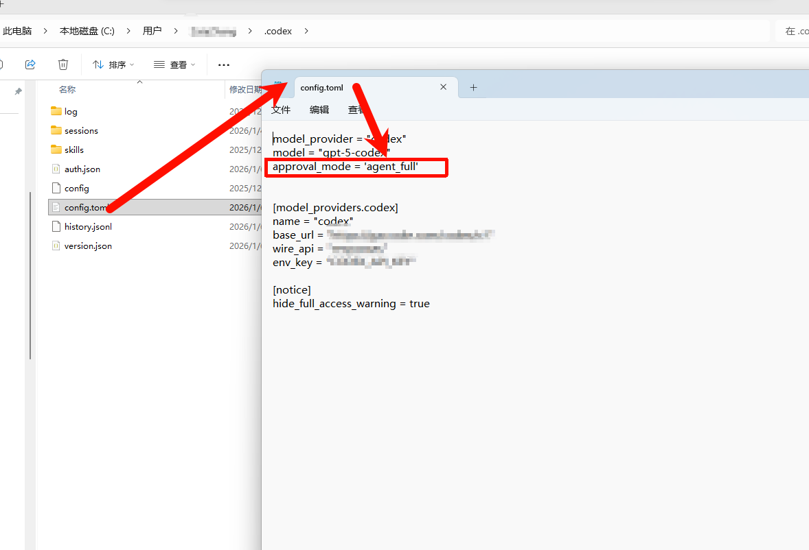
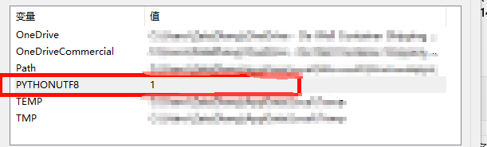

注意 : 不可或缺的一个工具是 cc-switch 可以查看cc-switch教程


## claude code

### 使用教程
```bash
"CLAUDE_CODE_EXPERIMENTAL_AGENT_TEAMS": "1"  # agent teams

# 无需确认
# 如果用户是root
IS_SANDBOX=1 claude --dangerously-skip-permissions 
# 如果用户不是root
claude --dangerously-skip-permissions 

# 别名，方便使用，加入到zshrc中
alias clauded="claude --dangerously-skip-permissions"


```

- [非常好用，在windows通过wsl使用claude，我就是看的这个](https://itecsonline.com/post/how-to-install-claude-code-on-windows)
- [claude code 官方实战](https://docs.anthropic.com/en/docs/claude-code/overview)
- [claude code 仓库](https://github.com/anthropics/claude-code)
- [Claude Code 實戰教學：三大超好用功能公開！【2025年6月更新】【AI寫程式】](https://vocus.cc/article/6854309dfd89780001335549)
- [Claude Code 最佳实践](https://gaccode.com/document/claude-code-best-practices-zh)
- [让claude更加好用](https://itecsonline.com/post/claude-code-tips-tricks)
- [Claude Code 用法全面拆解！26 项核心功能 + 实战技巧](https://zhuanlan.zhihu.com/p/1928918331810886674)


### 安装


#### mac/linux/wsl


- 安装
```bash
  # 注意，要吧下面的端口设置成你自己的vpn端口，为什么先要设置代理环境变量？ 因为curl默认不会走代理

  # 设置代理环境变量，这个是socks5代理
  export all_proxy="socks5://127.0.0.1:7897"
  或者
  export https_proxy=http://127.0.0.1:7897 http_proxy=http://127.0.0.1:7897

  
  curl -fsSL https://claude.ai/install.sh | bash
```
- 卸载
  ```bash
  rm -f ~/.local/bin/claude
  rm -rf ~/.local/share/claude
  ```


#### windows 

推荐通过wsl安装

[安装参考](https://itecsonline.com/post/how-to-install-claude-code-on-windows)

1. wsl --install  # 如果出现问题就要去 https://blog.csdn.net/no1xium/article/details/131285182
2. wsl --list --online  # 查看有哪些可用的镜像,如果没有Ubuntu-24.04进行第三步
3. wsl --install -d Ubuntu-24.04

进入到wsl里面

sudo apt update
sudo apt full-upgrade -y

目前claude支持原生安装（2026/02） [claude code](https://code.claude.com/docs/en/overview)
```bash
curl -fsSL https://claude.ai/install.sh | bash
```

安装cc-switch， 参考 本网站的 cc-switch 教程 

Install Additional Dependencies

```bash
sudo apt install python3 python3-pip -y #  Install Python (if needed)

sudo apt install git ripgrep -y # Install Git and Ripgrep (Recommended)


mkdir -p ~/.npm-global


```


### 配置其他模型api以使用claude_code --- 20260228

参考cc-swith


### 使用技巧

1. CLAUDE.md 文件管理





---

2. claude code 使用git worktree 开启多线程工作


  - 1. 创建 Git Worktree
  为每个任务创建独立工作目录和分支。例如，开发 `feature-auth` 和 `feature-ui`：

  ```bash
  git worktree add ../my-project-auth -b feature-auth
  git worktree add ../my-project-ui -b feature-ui
  ```

  - 验证：
  ```bash
  git worktree list
  ```

  - 2. 配置环境
  复制配置文件（如 `.env`）并设置不同端口以避免冲突：
  ```bash
  cp .env ../my-project-auth/.env
  cp .env ../my-project-ui/.env
  ```
  - `my-project-auth/.env`：`PORT=3000`
  - `my-project-ui/.env`：`PORT=3001`

  安装依赖：
  ```bash
  cd ../my-project-auth && npm install
  cd ../my-project-ui && npm install
  ```

  - 3. 启动 Claude Code

    在每个 Worktree 中运行 Claude Code：
    - 终端 1：
      ```bash
      cd ../my-project-auth
      claude "Implement JWT-based authentication with refresh tokens"
      ```
    - 终端 2：
      ```bash
      cd ../my-project-ui
      claude "Redesign UI with responsive Tailwind CSS layout"
      ```

  - 4. 提交和合并
  提交代码：
  ```bash
  cd ../my_search-project-auth
  git add .
  git commit -m "Add JWT authentication"
  cd ../my-project-ui
  git add .
  git commit -m "Update UI with Tailwind CSS"
  ```

  合并到主分支：
  ```bash
  cd ../my-project
  git checkout main
  git merge feature-auth
  git merge feature-ui
  ```

  - 5. 清理
  删除 Worktree 和分支：
  ```bash
  git worktree remove ../my-project-auth
  git worktree remove ../my-project-ui
  git branch -d feature-auth
  git branch -d feature-ui
  ```

  - 优化技巧
  - **自动化脚本**：
    ```bash
    function wt() {
      git worktree add ../worktrees/$1 -b $1
      cd ../worktrees/$1
      cp ../my-project/.env .env
      npm install
      claude
    }
    ```
    使用：`wt feature-auth`

  - **任务文件**：在每个 Worktree 创建 `CLAUDE.md` 记录指令，调用 `claude @CLAUDE.md`。
  - **IDE 集成**：使用 VS Code 的 Git Worktrees 扩展切换 Worktree。

  - 注意事项
  - 确保不同 Worktree 使用不同分支。
  - 为数据库任务配置独立实例（如 Docker 容器）。
  - 监控资源使用，避免并行任务过多导致过载。


3.  The Permission System Hack That Changes Everything

 Tips: `--dangerously-skip-permissions`  这个参数只能执行在非root用户下执行，因此如果只有root用户需要创建一个账户

```bash
sudo useradd -m -s /bin/bash username  # 创建新用户

su - username # 切换用户

curl --resolve raw.githubusercontent.com:443:185.199.108.133 -fsSL https://raw.githubusercontent.com/mklement0/n-install/stable/bin/n-install | bash -s 22   # 安装 node 其中--resolve表示自动去找可用的地址， 也可以安装nvm

npm install -g https://gaccode.com/claudecode/install --registry=https://registry.npmmirror.com  # 安装gac站的claude code

claude --dangerously-skip-permissions
```

3. 在容器中开发时--dangerously-skip-permissions指令让它自动执行
```bash 
# 如果用户是root
IS_SANDBOX=1 claude --dangerously-skip-permissions 

# 如果用户不是root
claude --dangerously-skip-permissions 
```

### Claude Code Plugin 系统终极指南 (最新版)  --- 20260228

Claude Code 是 Anthropic 官方推出的 AI 编码助手（CLI + IDE 集成）。其 **Plugin（插件）系统** 是最强大的扩展机制，允许通过 **Skills、Agents、Hooks、MCP Servers、LSP** 等组件扩展功能，实现一键安装、版本管理和团队共享，告别手动复制 `.claude/` 配置。

本教程结合官方文档与最佳实践，覆盖 **环境搭建 → 发现使用 → 管理维护 → 开发创建** 全流程。

---

**一、环境搭建：安装 Claude Code**

在使用插件前，需确保已安装最新版本的 Claude Code。

**1.1 安装 CLI 工具**

适用于 macOS / Linux / WSL（推荐）：

```bash
curl -fsSL https://claude.ai/install.sh | bash
```

适用于 Windows PowerShell：

```bash
irm https://claude.ai/install.ps1 | iex
```

验证安装 (建议版本 1.0.33+)：

```bash
claude --version
```

*首次运行 `claude` 需登录 Anthropic 账号（需要 Claude Pro / Team / Max 订阅）。*

**1.2 安装 IDE 插件（可选但推荐）**

插件系统在 IDE 中同样可用，且体验更佳：

- **VS Code**：扩展市场搜索 **"Claude Code"** 安装官方插件。
- **JetBrains**：市场搜索 **"Claude Code [Beta]"** 安装。
- *效果*：编辑器右侧可直接聊天，支持 Diff 查看、自动打开文件，所有插件命令无缝集成。

---

**二、核心概念：插件由什么组成？**

插件不仅仅是命令，它是一个功能包。理解组件有助于你选择合适的插件。

| 组件 | 功能描述 | 调用方式 | 典型用途 |
|------|----------|----------|----------|
| **Skills / Commands** | 自定义 slash 命令 | `/plugin-name:command` | 快捷操作（如 `/commit:commit`） |
| **Agents** | 专用子代理 | `/agents` 列表中选择 | 特定任务专家（如安全审查员） |
| **Hooks** | 自动化钩子 | 自动触发 | 文件保存后自动 lint/format |
| **MCP Servers** | 连接外部工具 | 自动出现在工具列表 | 连接 GitHub、Slack、数据库 |
| **LSP Servers** | 代码智能服务 | 自动启用 | 代码跳转、类型提示、诊断 |

> **注意**：安装插件后，命令通常带有 **命名空间** 以避免冲突，例如 `/commit-commands:commit`。

---

**三、用户指南：发现与安装插件**

**3.1 打开插件管理器**

在 Claude Code 会话中输入：

```bash
/plugin
```

进入交互式界面，包含四个 Tab：

- **发现 (Discover)**：浏览所有可用插件。
- **已安装 (Installed)**：管理已装插件。
- **市场 (Marketplaces)**：添加/删除插件源。
- **错误 (Errors)**：查看加载失败详情。

*操作提示：使用 `Tab` 切换选项卡，方向键选择，`Enter` 确认。*

**3.2 添加插件市场**

官方市场 `claude-plugins-official` 通常自动可用。如需添加第三方市场：

添加 Anthropic 演示市场：

```bash
/plugin marketplace add anthropics/claude-code
```

添加 GitHub 仓库市场：

```bash
/plugin marketplace add owner/repo
```

添加本地路径：

```bash
/plugin marketplace add ./my-marketplace
```

**3.3 安装插件（三种方式）**

**方式 A：交互式（最简单）**

1. 输入 `/plugin` → 切换到“发现”Tab。
2. 找到插件 → `Enter`。
3. **选择安装范围**（关键步骤）：
   - `user`：仅当前用户，所有项目可用（默认）。
   - `project`：写入 `.claude/settings.json`，团队共享（推荐）。
   - `local`：写入 `.claude/settings.local.json`，不提交 git。

**方式 B：命令行一键安装**

官方市场安装：

```bash
/plugin install typescript-lsp@claude-plugins-official
```

指定范围安装（团队共享）：

```bash
claude plugin install pr-review-toolkit@anthropics-claude-code --scope project
```

**方式 C：热门插件推荐**

| 插件名 | 功能 | 推荐场景 |
|--------|------|----------|
| `typescript-lsp` / `pyright-lsp` | 代码智能 | 所有开发项目 |
| `commit-commands` | 智能提交 | Git 工作流 |
| `pr-review-toolkit` | PR 审查 | 代码合并前 |
| `security-guidance` | 安全审查 | 敏感代码处理 |
| `context7` | API 文档 | 查阅最新文档 |

---

**四、管理插件：更新与维护**

| 操作 | 命令 / 路径 | 说明 |
|------|------------|------|
| **查看已安装** | `/plugin` → 已安装 Tab | 查看版本与状态 |
| **禁用/启用** | `/plugin disable <name>` | 暂时停用但不卸载 |
| **卸载** | `/plugin uninstall <name>` | 完全移除 |
| **更新单个** | `/plugin update <name>` | 升级到最新版本 |
| **更新市场** | `/plugin marketplace update <name>` | 刷新插件列表 |
| **配置文件** | `.claude/settings.json` | 手动编辑项目级配置 |

**自动更新配置**

可通过环境变量控制更新行为：

禁用所有自动更新：

```bash
export DISABLE_AUTOUPDATER=true
```

仅保留插件更新，禁用 CLI 更新：

```bash
export FORCE_AUTOUPDATE_PLUGINS=true
```

---

**五、开发者指南：创建自己的插件**

**5.1 标准目录结构**

创建一个文件夹，结构如下：

```
my-awesome-plugin/
├── .claude-plugin/           # 元数据目录
│   └── plugin.json           # 插件清单（必需）
├── skills/                   # 技能命令
│   └── greet/
│       └── SKILL.md
├── agents/                   # 子代理
│   └── security-reviewer.md
├── hooks/                    # 钩子配置
│   └── hooks.json
├── .mcp.json                 # MCP 服务器定义
├── .lsp.json                 # LSP 服务器配置
└── scripts/                  # 可执行脚本
    └── format.sh
```

**5.2 编写 plugin.json**

```json
{
  "name": "my-awesome-plugin",
  "version": "1.0.0",
  "description": "我的第一个插件",
  "author": { "name": "Your Name", "email": "you@example.com" },
  "license": "MIT",
  "skills": "./skills/",
  "agents": "./agents/",
  "hooks": "./hooks/hooks.json"
}
```

**5.3 创建 Skill 示例**

`skills/greet/SKILL.md`:

```markdown
---
description: 向用户问好
---
你好！我是你的专属助手，今天有什么可以帮你的吗？
```

**5.4 配置 Hooks 示例**

`hooks/hooks.json` (实现保存后自动格式化):

```json
{
  "hooks": {
    "PostToolUse": [
      {
        "matcher": "Write|Edit",
        "hooks": [
          {
            "type": "command",
            "command": "${CLAUDE_PLUGIN_ROOT}/scripts/format.sh"
          }
        ]
      }
    ]
  }
}
```

**5.5 本地调试与测试**

无需发布即可测试插件：

指定插件目录启动：

```bash
claude --plugin-dir ./my-awesome-plugin
```

调试模式查看加载详情：

```bash
claude --debug
```

进入会话后输入 `/my-awesome-plugin:greet` 验证功能。

**5.6 发布到市场**

1. 将代码上传至 GitHub 公共仓库。
2. 创建 `marketplace.json` 索引文件。
3. 通过 Claude.ai 设置 → Plugins → Submit 提交至官方市场，或分享给团队直接使用 Git URL 安装。

---

**六、故障排除 (Troubleshooting)**

| 问题现象 | 可能原因 | 解决方案 |
|----------|----------|----------|
| `/plugin` 命令不识别 | 版本过低 | 升级 CLI：`curl -fsSL https://claude.ai/install.sh | bash` |
| 插件未加载 | 缓存问题 | 删除缓存：`rm -rf ~/.claude/plugins/cache` 后重启 |
| 命令未出现 | 目录结构错误 | 确保 `skills/` 或 `commands/` 在插件根目录 |
| Hooks 未触发 | 脚本无权限 | 运行 `chmod +x scripts/*.sh` |
| LSP 报错 | 语言服务器缺失 | 安装对应二进制（如 `npm i -g typescript-language-server`） |
| 安装失败 | 网络/权限问题 | 检查 GitHub 仓库是否公开，或切换网络环境 |
| 命令冲突 | 命名空间重复 | 使用完整命名空间 `/plugin-name:cmd` 调用 |

---

**七、最佳实践与建议**

1.  **版本管理**：遵循语义版本控制（MAJOR.MINOR.PATCH），便于回滚。
2.  **团队共享**：使用 `--scope project` 将插件配置提交到 `.claude/settings.json`，确保团队成员环境一致。
3.  **安全优先**：安装第三方插件前，检查其 `plugin.json` 和脚本内容，确认来源可信。
4.  **路径规范**：插件内部所有路径必须相对于插件根目录，以 `./` 开头，或使用 `${CLAUDE_PLUGIN_ROOT}` 变量。
5.  **结合规范**：在项目根目录放置 `CLAUDE.md` 定义编码规范，插件会自动遵守。

---

**八、官方资源**

- **官方文档 (中文)**： `https://code.claude.com/docs/zh-CN/` 
- **插件开发文档**： `https://code.claude.com/docs/zh-CN/plugins` 
- **官方演示仓库**： `https://github.com/anthropics/claude-code` 
- **社区讨论**：Claude 官方 Discord 频道

掌握插件系统后，Claude Code 的生产力将显著提升。通过团队统一安装核心插件（如 LSP、Commit、Security），可实现「一键 PR 审查 + 自动部署 + 安全扫描」的现代化开发全流程。

## codex 

[codex 官方](https://developers.openai.com/codex/cli/)


### 安装和配置


｀安装｀

```bash
npm i -g @openai/codex
```


--- 

｀配置｀

**设置默认agent full模式**



**设置$env:PYTHONUTF8 = "1"**

不设置的话会出现乱码,因为python代码默认是utf8但是命令行默认是ascii




